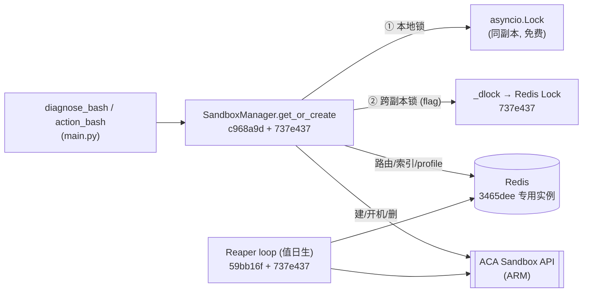
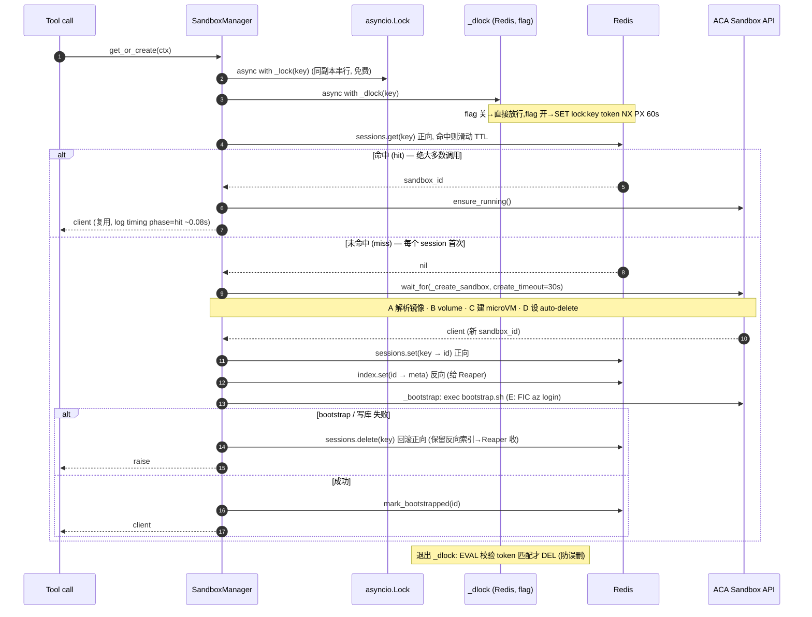
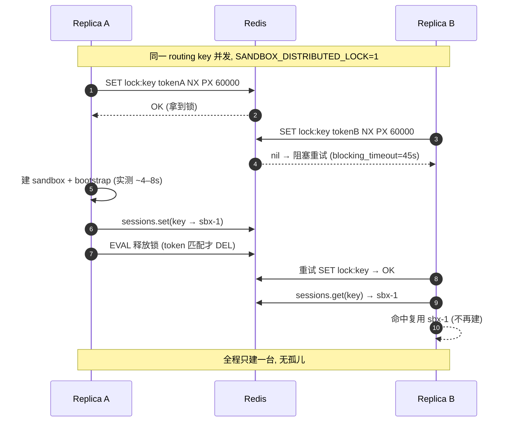
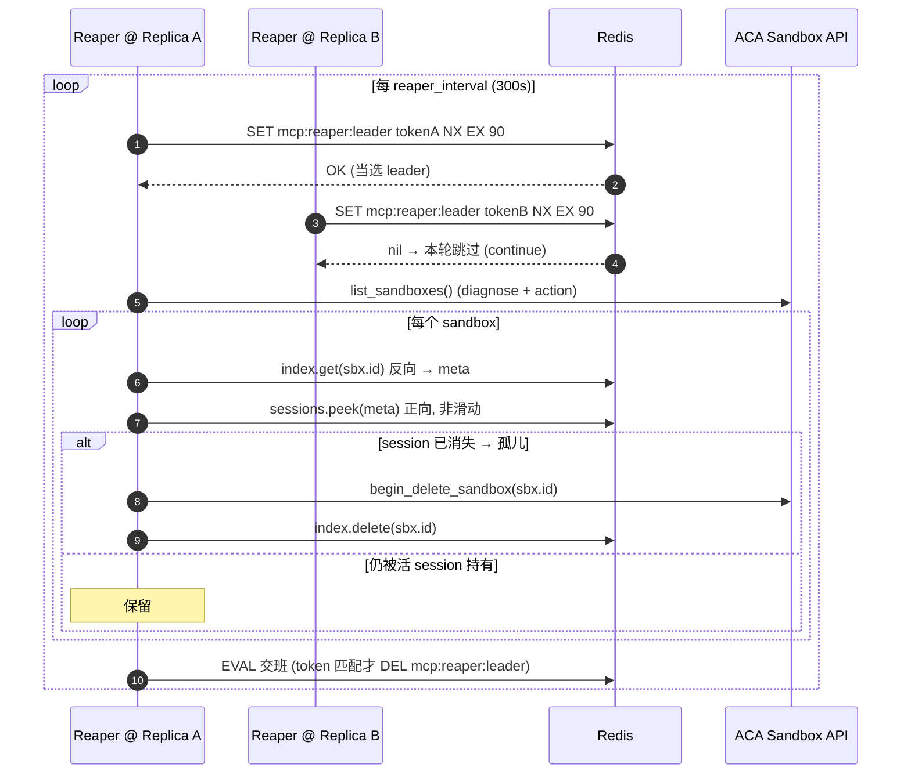

# MCP 实现总览:Sandbox 创建 · Redis · Reaper(时序图 + commit 状态)

这份是**收口文档**:把 sandbox 创建、Redis 用法、Reaper 回收的**最终实现**用时序图画清楚,并给每一块标上**实现它的 commit hash 和状态**,方便日后回看"哪行代码是哪个 commit 来的、上没上、开没开"。

配套:[MCP-分布式锁与Reaper选主-实现方案.md](MCP-分布式锁与Reaper选主-实现方案.md)(落地方案)、[MCP-Sandbox-创建耗时实测报告.md](MCP-Sandbox-创建耗时实测报告.md)(实测)、[MCP-水平扩展-分布式锁与Reaper选主.md](MCP-水平扩展-分布式锁与Reaper选主.md)(原理)。

代码:`src/mcp-server/sandbox_manager.py`、`cache.py`、`session.py`、`main.py`。

---

## 0. 状态一览(commit hash 矩阵)

| 组件 / 特性 | 实现 commit | 状态 | 默认行为 | 分支 |
|---|---|---|---|---|
| SandboxManager 核心(`get_or_create` / `_create_sandbox` / `_bootstrap`) | `c968a9d`(Phase 3) | ✅ 上线 | 常开 | 主线 |
| Blob volume 挂载(`_workspace_volumes`) | `1f4368a`(Phase 5) | ✅ 上线 | 常开 | 主线 |
| Redis 正向路由 + profile + `bootstrapped` 标记 | `32d06bd`(Phase 4) | ✅ 上线 | 常开 | 主线 |
| 专用 Redis Container App(env 内短名互通) | `3465dee` | ✅ 上线 | 常开 | 主线 |
| 反向索引 `mcp:sbxidx` + Reaper(每副本各扫) | `59bb16f`(Phase 6) | ✅ 上线 | 常开 | 主线 |
| **timing 打点**(`_log_timing`,create/bootstrap/hit) | `737e437` | ✅ 已合 | 常开(纯日志) | `fix-redis` |
| **create 超时**(`wait_for`)+ **失败回滚** session key | `737e437` | ✅ 已合 | 常开(仅异常路径显现) | `fix-redis` |
| **分布式锁 `_dlock`**(跨副本,两层锁内层) | `737e437` | ✅ 已合 | ⚠️ **默认关** | `fix-redis` |
| **Reaper 值日生选主**(`_try_become_reaper`) | `737e437` | ✅ 已合 | ⚠️ **默认关**(同一开关) | `fix-redis` |
| 多副本上线(`maxReplicas>1` + 开开关 + 压测) | — | ⏳ **未做(PR-4)** | — | 未来 |
| PR-2/PR-3 正式单测(mock 单测) | — | ⏳ **未写** | — | 未来 |
| 测量 harness + PR-1 单测(`tests/`) | `021aaec` | ✅ 保留(供复现) | — | `measure-sandbox-timing` |
| **端到端冒烟测试**(`tests/e2e_deployed.py`,走真前门) | —(待提交) | ✅ **实测跑通**(2026-07-05,rev `0000007`,详见 §8) | 手动(需登录 + 活部署) | `fix-redis` |

> **一个开关管两件事**:`SANDBOX_DISTRIBUTED_LOCK`(默认 `0`)同时门控 `_dlock` 与 Reaper 选主。关 = 今天的单副本行为逐字节不变;开(将来 `maxReplicas>1` 时,和它同一个 PR)= 跨副本互斥 + 单值日生。timing / create 超时 / 回滚这三样**不受开关控制,已常开**(但 30s 超时远高于实测 ~8s 最坏,平时无感)。

---

## 1. 组件全景



---

## 2. 时序图 A:Sandbox 创建 / 复用(`get_or_create`)

最终实现(`c968a9d` 核心 + `737e437` 加两层锁/超时/回滚)。**flag 关时,`_dlock` 那一步是空操作。**



**关键点(都在 `737e437`):**
- **两层锁**:外层 `asyncio.Lock` 挡同副本(免费),内层 `_dlock` 挡跨副本(best-effort,Redis 挂了/等锁超时都降级放行,绝不 fail 请求)。
- **create 超时**:`wait_for(_create_sandbox, 30s)` —— 卡死的建不会永占锁。⚠️ 只取消"我这边等待",ARM 那台可能仍建成 → 孤儿由 Reaper 收。
- **失败回滚**:bootstrap/写库抛错时删掉正向 key(保留反向索引),下次同 key 重建,不会复用"没登录的坏台子"。
- **顺序不能变**:正向 `sessions.set` 在 `_bootstrap` **之前**,以保证 Reaper 在 bootstrap 期间看到 `live==sbx`、不误删(所以没做无锁快路径)。

**补充:为什么"建台子 → 写 Redis → 再 bootstrap",不反过来?**

有人会问:既然可能"开机成功但 bootstrap 失败、却已经写了 sandbox_id",不如**开机后立刻 `az login`、成功再写 Redis**,回滚不就没了(库里啥都没写)?这确实更简单,但当前顺序是**故意**的,关键在 Reaper 的删除判据(`reap_orphans`):**一台被删 ⇔ 它有反向索引 `meta` 且 正向 `peek != sbx.id`**。

- 现在把**反向索引尽量早写**(建完台子立刻写,`index.set` 在 bootstrap 之前),等于从 ARM 台子一存在就留下"Reaper 能回收"的面包屑:bootstrap 之后**任何**失败——被 catch 的异常、甚至副本硬崩 / OOM——反向索引都已在,Reaper ~5min 收掉。
- 反向早写就**逼着正向也早写**:否则 bootstrap 那 ~3s 里,别的副本 Reaper 会 list 到它 → 查反向有 meta → peek 正向还没写 → 判成孤儿 → **bootstrap 中途误删**。正向先写让 `peek==sbx`,Reaper 才不动它(即上面"顺序不能变")。

你的"先 bootstrap"方案其实也**不会误删**(bootstrap 期间反向还没写,Reaper 查 `meta` 为空直接跳过),代价换到别处 —— **建 / bootstrap 期间硬崩**时,这台 ARM 没有反向索引 → Reaper 永远不碰 → 只能等平台 1h 的 `auto_delete`,比 ~5min 慢、多攒孤儿:

| | 当前(反向先写) | 备选(先 bootstrap) |
|---|---|---|
| 回滚 | 删 1 个正向 key(`sessions.delete`,一行) | 无需回滚 |
| bootstrap 异常 | 留反向,Reaper ~5min 收 | 需在 except 里显式删台子 |
| **硬崩 / OOM** | 反向已在,Reaper ~5min 收 | 无索引,等平台 **1h** 兜底 |

即"**先埋回收面包屑,再做有风险的 bootstrap**"的崩溃安全写法,复杂度其实只有一行 delete。若接受硬崩退回 1h 兜底,备选顺序也可行。

---

## 3. 时序图 B:分布式锁跨副本(`_dlock`,flag 开时)

同一 routing key 的两个并发请求落到不同副本,**只建一台**(对照:flag 关时会各建一台→孤儿,由 Reaper 兜)。实现:`737e437`。



> 降级:`_dlock` 抢锁抛异常(Redis 不可达)或等锁超 45s → 记 warning 后**照常放行**,退回"仅 asyncio.Lock",最坏偶发一台孤儿(Reaper 收)。它是**效率锁不是正确性锁**;用户隔离的 1:1 绑定由 `never-rebind` 独立守住,与这把锁无关。

**补充:B 会白等满 45s 吗?——不会,A 一 release,B ~0.1s 内就拿到。**

上图 `blocking_timeout=45s` 是**上限**,不是固定等待。redis-py 的阻塞 `Lock.acquire` 既不是睡满 45s、也不是事件通知,而是**轮询**:反复 `SET NX`,拿不到就 `await asyncio.sleep(0.1)`(默认 `sleep=0.1s`,我们只设了 `blocking_timeout`、没覆盖它),直到拿到或超 45s。所以 A 在 ~4–8s `lock.release()`(跑 token 校验的 DEL)后,**B 下一次轮询(≤0.1s)就成功**。

- B 的总等待 ≈ A 的关键段(4–8s)+ 最多 ~0.1s,**不是 45s**。
- 45s 只有 A 一直不释放(卡死)时才会走到 → B 超时后降级放行(见上方"降级")。
- "看不见 release logic"是因为它被 `lock.release()` 封进去了:没有通知,B 靠每 0.1s 探一次发现 key 没了(Redis 没有给它用的"阻塞等 key 删除"原语)。

---

## 4. 时序图 C:Reaper 值日生选主(`_reaper_loop`)

flag 开时每轮选 1 个 leader 干活;flag 关时退回"每副本各扫"(幂等,只是浪费)。核心 `reap_orphans` 自 `59bb16f`,选主 `737e437`。



**三道回收网(纵深防御):** ① 本节 Reaper(session 一结束就删,~5min)→ ② 平台 `auto_suspend`(5min 挂起停计费)→ ③ 平台 `auto_delete`(1h 最终兜底)。孤儿正常 ~5min 被收,不是熬满 1h。

**补充:两把锁为什么写法不同?(`_dlock` 用 redis-py `Lock`,选主手写 Lua)**

同一套模式(**SET-NX-带TTL + token 校验释放**),两种实现,因为**获取语义相反**:

| | `_dlock`(§3,`lock:*`) | Reaper 选主(本节,`mcp:reaper:leader`) |
|---|---|---|
| 获取 | **阻塞等**:第二个并发创建者要等第一个建完再复用 → `blocking=True, blocking_timeout=45s` | **非阻塞试一次**:这轮别人已是 leader 就别等,`SET NX` 拿不到就跳过、下轮再来 |
| 用什么 | redis-py 的 `self._redis.lock(...)` 对象,`acquire()` / `release()` | 裸 `self._redis.set(nx=True, ex=)` + `self._redis.eval(...)` |
| 释放 | `lock.release()`,**库自带** Lua 校验 token | 手写 `_RELEASE_LUA` + `.eval()` |

关键:**`_RELEASE_LUA`(`if get==token then del`)就是 redis-py `Lock.release()` 内部那段的逐字翻版** —— 同一个"只删自己那把、防误删已过期后被别人重拿的锁"的守卫,一个库给的、一个手写的。选主用裸 `SET NX` 是因为它要"试一次"的语义,拿不到 `Lock` 对象自带的释放脚本,所以自己写。想统一(让选主也用 `lock(..., blocking=False)`)可以,但收益小,还会把非阻塞路径绑回 redis-py `Lock` 的 `decode_responses` 行为。

---

## 5. Redis 数据模型(key / TTL / commit)

前缀:`sessions`/`profiles` 用 `RedisBackend(prefix="mcp")`;反向索引单独 `prefix="mcp:sbxidx"`;`_dlock` 和选主用**裸 client**(键名如实写)。

| Redis key(含前缀) | 内容 | TTL | 写 | 读 | commit |
|---|---|---|---|---|---|
| `mcp:session:{oid}:{session}:{group}` | **正向**:routing key → sandbox_id | 1800s 滑动 | `get_or_create` | `get`(命中)/ `peek`(Reaper) | `32d06bd` |
| `mcp:sbxidx:{sandbox_id}` | **反向**:sandbox_id → {oid,session,group} | 永不过期 | `get_or_create` | Reaper | `59bb16f` |
| `mcp:bootstrapped:{sandbox_id}` | 已 `az login` 标记 | 永不过期 | `get_or_create` | `get_or_create` | `32d06bd` |
| `mcp:profile:{oid}` | 用户 subscription 等,重建 `az` 上下文 | 永不过期 | 登录时 | `_user_subscription` | `32d06bd` |
| `mcp:usersession:{oid}` | oid → session_id(30min 窗口派生) | 1800s 滑动 | middleware(`session.py`) | middleware | `32d06bd` |
| `lock:{oid}:{session}:{group}` | **分布式锁** token | `lock_ttl`=60s | `_dlock`(flag) | `_dlock` | `737e437` |
| `mcp:reaper:leader` | **值日生** token | `ex=reaper_lease`=90s | `_try_become_reaper`(flag) | 同 | `737e437` |

---

## 6. Redis 访问的三层对象(`_redis` / `RedisBackend` / `_redis_safe`)

这几个名字容易混,其实**底层是同一个 Redis 连接**(`from_env` 里一个 `make_redis_client(redis_url)` 喂给所有人),区别只在"层":

| 名字 | 是什么 | 谁在用 | 为什么 |
|---|---|---|---|
| `self._redis` | **裸 redis-py async client**(名词) | `_dlock`、Reaper 选主 | 要 `.lock()` / `.set(nx=)` / `.eval()` 这些原语,`RedisBackend` 抽象没暴露 |
| `self._sessions` / `_index` / `_profiles` | **`RedisBackend` 包装层**(cache.py):加 prefix / TTL / 类型化 get·set·peek | `get_or_create`、Reaper 扫描 | 路由 / 索引 / profile 的结构化读写 |
| `_redis_safe(coro)` | **降级壳**(函数,不是 client):`await coro`,出错就 log + 返回 `default` | 套在 `get_or_create` 里的 `sessions.*` / `index.*` 外面 | Redis 抽风时降级(给默认值)而不是 fail 掉 tool call |

所以 **`_redis` vs `_redis_safe` 不是"同一 API 两种写法"**:一个是裸 client(名词),一个是给"值操作"套的 try/except 降级壳(动词)。它们共用同一个连接池,只是访问层不同。

**新锁 / Reaper 为什么不走 `_redis_safe`?** 因为 `_redis_safe` 的形状是"**取个值、失败给默认值**",而锁 / 选主的兜底是**控制流**(抢不到锁就照样 `yield` 继续、选主失败就 `return _NO_LEASE` 照扫),塞不进"返回默认值",所以各自 inline 了 try/except。

**要不要统一 API?** 精神上已统一 —— **全用同一个 client、全都"Redis 出事就降级、绝不 fail 请求"**,只是形态两样(值操作用 `_redis_safe` 壳、锁 / 控制流 inline)。真抽个统一 helper 收益很小(兜底是控制流,包完更绕),倾向**不改**;这张表把"谁是谁"讲清即可。

---

## 7. 时间参数与实测耗时一览

把散落在 §2–§5 的各种"时间"收在一处:**7.1 是配置的旋钮**(超时 / TTL / 周期,都有 env 可调),**7.2 是实测耗时**(实际跑多久)。一句话:冷启动 ~7–8s 一次性,之后命中 ~0.02s;所有超时都对实测留了 ≥3× 余量。

### 7.1 定时器 / 超时 / TTL(配置项)

| 参数 | 值(默认) | env / 字段 | 归属 | 作用 | 见 |
|---|---|---|---|---|---|
| create 超时 | 30s | `SANDBOX_CREATE_TIMEOUT` / `create_timeout` | `get_or_create` | `wait_for` 建台子超时即放弃(远高于实测最坏 ~8s) | §2 |
| 分布式锁 TTL | 60s | `SANDBOX_LOCK_TTL` / `lock_ttl` | `_dlock`(`lock:*`) | 锁自动过期(SET PX),持锁副本崩了也不死锁;关键段实测 ~8s ≪ 60s | §2 §3 §5 |
| 等锁超时 | 45s | `SANDBOX_LOCK_WAIT` / `lock_wait` | `_dlock` | `blocking_timeout`,等不到就降级放行(绝不 fail 请求) | §3 |
| session TTL(正向路由) | 1800s(30min)滑动 | `cache.py` / `session.py` | `mcp:session:*` | 每次命中滑动续期;静默满 30min = "session 结束" | §5 |
| usersession 窗口 | 1800s(30min)滑动 | `session.py` | `mcp:usersession:*` | oid→session_id 的 30min 派生窗口 | §5 |
| 反向索引 / bootstrapped / profile | 永不过期 | — | `mcp:sbxidx:*` 等 | 靠 Reaper / 显式删,不靠 TTL | §5 |
| Reaper 选主租约 | 90s | `SANDBOX_REAPER_LEASE` / `reaper_lease` | `mcp:reaper:leader` | leader 令牌 EX;≈ 一轮工作上限,到期自动换届 | §4 §5 |
| Reaper 扫描周期 | 300s(5min) | `SANDBOX_REAPER_INTERVAL` / `reaper_interval` | `_reaper_loop` | 每轮先 `sleep(300s)` 再选主+扫(首轮也先睡) | §4 |
| 平台 auto_suspend | 5min | ACA 参数 | sandbox | 空闲挂起、停计费(回收第 2 道网) | §4 |
| 平台 auto_delete | 1h | ACA 参数 | sandbox | 最终兜底删除(回收第 3 道网) | §4 |

> 三个超时是**递进**的:建台子最坏 ~8s < **等锁 45s**(足够让先到的副本建完)< **锁 TTL 60s**(比等锁长,正常路径不会等锁把锁等到过期)。全部 `SANDBOX_*` 环境变量可调,不改代码。

### 7.2 实测耗时(2026-07-05,单机 rev `0000007`;分布详见[实测报告](MCP-Sandbox-创建耗时实测报告.md))

| 阶段 | 实测 | 说明 |
|---|---|---|
| **create 总**(miss 建台子) | ~4.5s(报告:中位 ~4s / 最坏 ~8.3s) | 下面 A–D 之和 |
| ├ A 解析镜像 `disk` | ~2.97s | 最大头 |
| ├ B `volume` 挂载 | ~0.12s | |
| ├ C 建 microVM `vm` | ~1.39s | |
| └ D 设 `auto-delete` | ~0.06s | |
| **bootstrap**(E:FIC `az login`) | ~2.9s | exec `bootstrap.sh` |
| **冷启动合计**(create + bootstrap) | ~7–8s(最坏) | 每个 session 仅首次 |
| **hit**(复用,`ensure_running`) | ~0.02–0.08s | 绝大多数调用走这条 |

> 读法:一个 session 只在**首次**吃 ~7–8s 冷启动,之后每次调用都是 ~0.02s 命中。所以 30s 的 create 超时平时根本碰不到。

---

## 8. 端到端测试(实测 + 怎么跑)

单测(mock)覆盖不到"真前门"整条链:**Entra 登录 → OBO → MCP streamable-HTTP → `diagnose_bash`/`action_bash` → 真 ACA sandbox**。这条链用 `src/mcp-server/tests/e2e_deployed.py` 手动跑(要交互登录 + 活部署,所以不进 CI)。

**怎么跑**

```
pip install mcp msal                      # 客户端 SDK,不在服务器镜像里
python src/mcp-server/tests/e2e_deployed.py
# 首次打印设备码 URL:浏览器打开、输码、用 diagnose+action 组成员登录。
# token 缓存到 ~/.cache/aca-mcp-e2e/,之后复跑静默,直到过期。
```

默认打当前 dev 部署;可用环境变量 `MCP_SERVER_URL` / `AZURE_TENANT_ID` / `MCP_APP_ID` / `MCP_DEVICE_CLIENT_ID` 覆盖。

**断言了什么(5 条,对应脚本里的 5 个 check):**

| # | 断言 | 证明 |
|---|---|---|
| 1 | 两把工具都出现在 `tools/list` | auth + OBO + 组成员解析 OK |
| 2 | `diagnose_bash` 首调 `exit=0` | 冷建 sandbox + bootstrap 成功 |
| 3 | sandbox 内 `az account show` `exit=0` | FIC 免密 `az login` bootstrap 生效 |
| 4 | 第 1 调写的 marker 文件第 3 调能读到 | 同一 sandbox 复用 = session 粘连路由(hit 路径) |
| 5 | `action_bash` `exit=0` | 第二个组 / 第二台 sandbox 也通 |

**本次实测(2026-07-05,rev `0000007`,当次特意开着 `SANDBOX_DISTRIBUTED_LOCK=1` 实跑锁路径):**
- 工具两把都出来;三条 `diagnose_bash`(`whoami` / `echo+date` / `az account show`)+ 复用命中,全部按预期。
- 服务器日志时延与实测报告吻合:`create total=4.549s`(disk 2.97 / vol 0.12 / vm 1.39 / autodel 0.06)、`bootstrap exec=2.94s`(`account=d09dfd39…`,即 FIC 登录成功)、`hit ensure_running≈0.02s`。
- **关键:flag 开实跑,全程无 `dlock acquire/release failed` 告警** → 真 redis-py `Lock` 在真 Redis(client `decode_responses=True`)上 acquire+release 干净通过,之前担心的 decode 兼容问题不存在。
- 测完把 flag 改回 `0`(默认关,见 §0 矩阵),现活动 rev `0000008`,镜像 `mcp-server:distlock`(= `737e437` 功能代码)。

**本次没覆盖(留后续):** Reaper 选主那一轮 —— `_reaper_loop` 先 `sleep(reaper_interval=300s)` 才首次选主、且成功路径静默,单副本下等于走"每副本各扫"。它用的是 sessions/index 一直在用的同一个 Redis client,风险低;正式确认放到多副本压测(§0 的 PR-4)时一起做。

---

## 9. 分支说明

- **`fix-redis`(主)**:所有功能代码 = 上面矩阵里 `737e437` 那几行(打点 + 锁 + 超时/回滚 + 选主),连同全部设计/落地/实测文档,**外加端到端冒烟测试** `tests/e2e_deployed.py`(见 §8;PR-2/PR-3 的 mock 单测仍待补)。
- **`measure-sandbox-timing`**:只留"测量结论" = PR-1 打点(`021aaec`)+ 测量 harness `measure_create_timeline.py` + 单测 `test_timing_instrumentation.py`。这些测试连同 PR-2/PR-3 的正式单测,**日后与端到端(e2e)测试一起补**。
- **未来(PR-4)**:`provisioning/aca/modules/mcp-app.bicep` 把 `maxReplicas` 调 >1、同 PR 置 `SANDBOX_DISTRIBUTED_LOCK=1`,跑多副本压测(见[落地方案](MCP-分布式锁与Reaper选主-实现方案.md)的 §7 压测清单),把 create 尾延迟在并发下复测定稿。

---

*关联:* [MCP-分布式锁与Reaper选主-实现方案.md](MCP-分布式锁与Reaper选主-实现方案.md) · [MCP-Sandbox-创建耗时实测报告.md](MCP-Sandbox-创建耗时实测报告.md) · [MCP-水平扩展-分布式锁与Reaper选主.md](MCP-水平扩展-分布式锁与Reaper选主.md) · [ACA-Sandbox-迁移方案.md](ACA-Sandbox-迁移方案.md)
