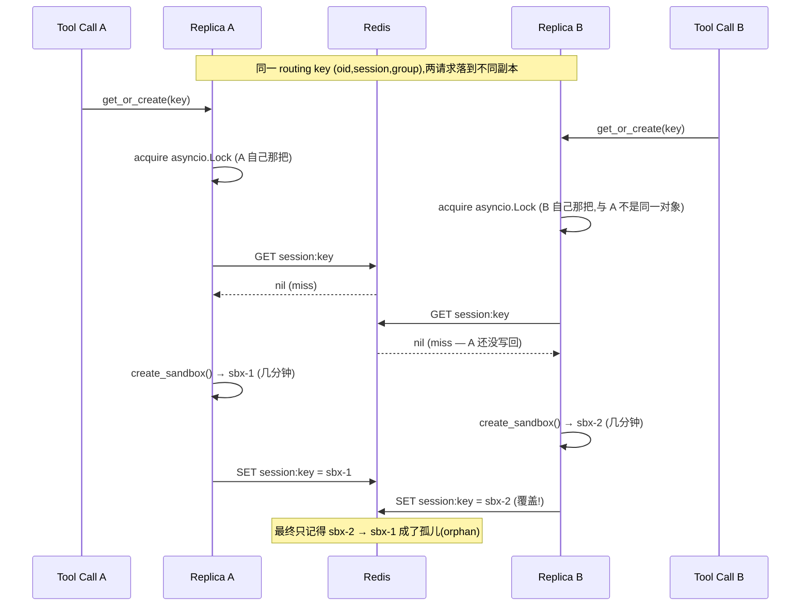
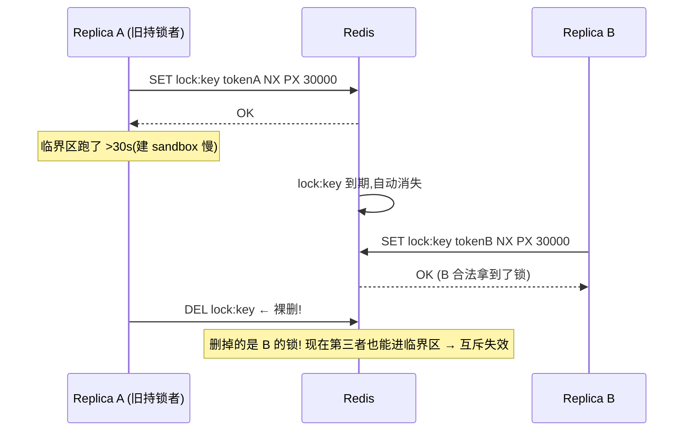
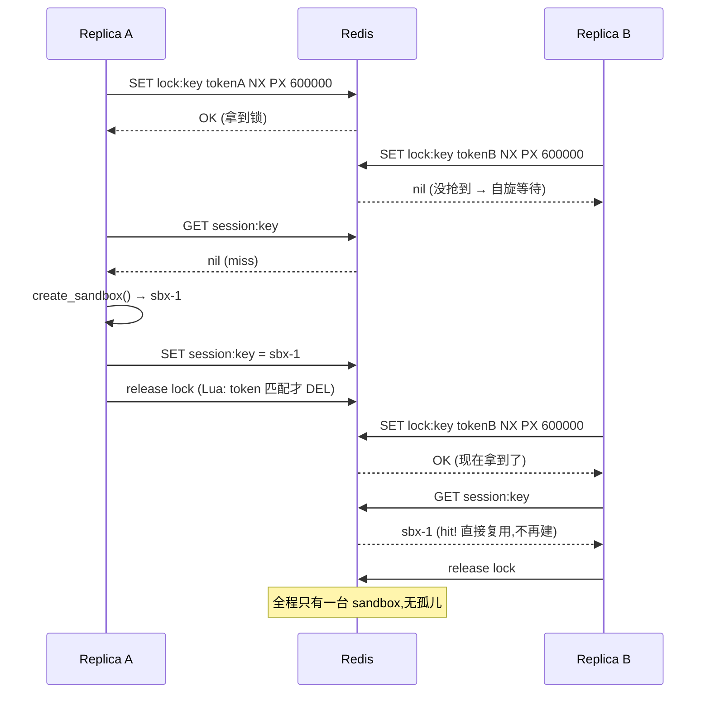
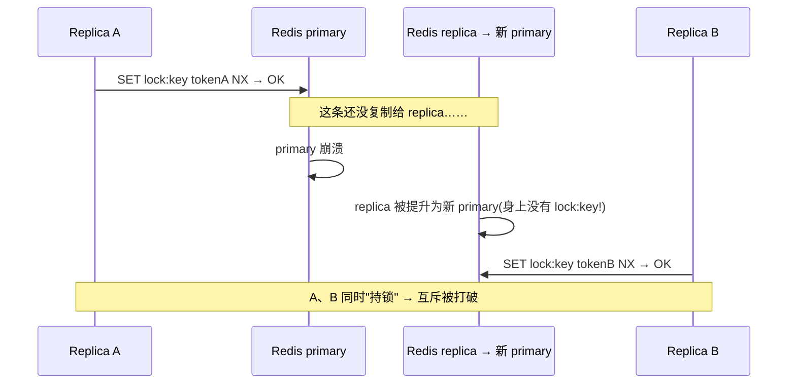
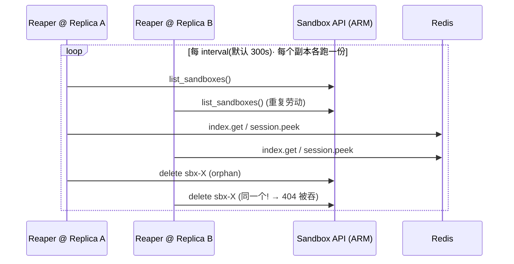
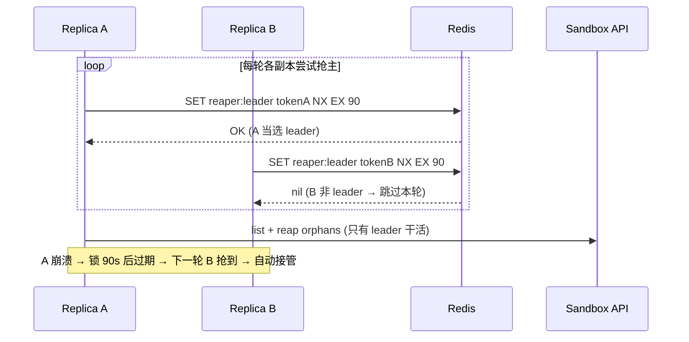

# MCP Server 水平扩展:进程内状态、分布式锁(distributed lock)与 Reaper 选主(leader election)

本文承接 commit `3465dee`(*fix(redis): dedicated redis Container App ...*)末尾那句话:

> *full horizontal scaling also needs a distributed lock on the routing key and a single reaper leader — follow-ups.*

把这句话**为什么成立、底层原理、怎么落地**讲透。读完你应该能回答:

1. 把 Redis decouple 出去,到底让这个 server "无状态(stateless)"到了什么程度?还差什么?
2. `SandboxManager` 里那把锁,**锁的到底是什么**?(剧透:不是"保护写 Redis")
3. 分布式锁(distributed lock)不是把 `asyncio.Lock` 这个对象写进 Redis ——那它是什么?`SET NX` / TTL / token / Lua 释放 / 续租(lease renewal)逐个拆开。
4. Reaper 现在怎么跑(current status),有哪些改造选项,leader election 怎么写。

涉及代码:`src/mcp-server/sandbox_manager.py`、`src/mcp-server/cache.py`、`src/mcp-server/main.py`。
前置阅读:[MCP-用户隔离与Redis设计.md](MCP-用户隔离与Redis设计.md)、[ACA-Sandbox-迁移方案.md](ACA-Sandbox-迁移方案.md)。

---

## TL;DR

- **"无状态" 的判据**:一个请求随机落到哪个副本(replica)上,结果都一样吗?
- Redis decouple 把**共享的 source of truth**(谁的 session 用哪个 sandbox)从进程内搬进了 Redis —— **这是水平扩展的必要(necessary)第一步,且已完成**。
- 但**还剩两块进程内(in-process)的协调状态**,使它还不是"完全无状态":
  1. **routing-key 锁是 `asyncio.Lock`,只在单副本内互斥** → 跨副本会重复建 sandbox(孤儿 orphan)。修法:**Redis 分布式锁**。
  2. **reaper 每副本各跑一个** → N 个 reaper 重复扫;幂等不出错,但浪费。修法:**leader election**。
- 这两件事**底层是同一把 Redis 锁原语**:`SET <key> <token> NX PX <ttl>` + Lua 释放 + 续租。
- 完整可水平扩展 = **decoupled Redis(已完成)+ routing-key distributed lock + single reaper leader**。

---

## 1. "无状态(stateless)" 到底指什么

这里的"无状态",指**进程本身不持有任何"换一个副本就丢"的关键状态**。这样才能跑 N 个副本、随便重启、负载均衡随便打。判据只有一句:

> **一个请求随机落到哪个副本上,结果都一样吗?**

Redis decouple 这一步,做的就是把**真正的共享状态(shared state / source of truth)**从进程内搬到 Redis:

| 状态 | 含义 | 现在存哪 | 谁读它 |
|---|---|---|---|
| `SessionSandboxCache` | `(oid, session, group) → sandbox_id` 路由表 | **Redis** ✅ | `get_or_create` 命中即复用 |
| `UserProfileCache` | `oid → {subscription_id, ...}`,重建 `az` 上下文 | **Redis** ✅ | `_user_subscription` / bootstrap |
| `UserSessionCache` | `oid → session_id`,30 min 滑动窗口(sliding window) | **Redis** ✅ | middleware 派生 session |
| 反向索引 `_index` | `sandbox_id → {oid,session,group}` | **Redis** ✅ | reaper 判活 |

这些是**"谁拥有哪个 sandbox" 的唯一真相来源**。放进 Redis,意味着副本 A 建的 sandbox,副本 B 也查得到、复用得了、回收得掉。

**反例对照(为什么不能用 sidecar):** 如果 Redis 跟每个副本绑在一起跑 `localhost`(sidecar 模式),每个副本就有**自己的一份路由表**,副本 B 根本不知道 A 建过什么 —— 共享状态直接破功。这正是 `3465dee` 坚持把 redis 做成**独立 Container App**(而非 sidecar)的根因:

```
sidecar:    Replica A ── localhost ── redis-A   (各看各的,状态不共享 ✗)
            Replica B ── localhost ── redis-B

dedicated:  Replica A ─┐
                       ├──→ dataops-aca-redis:6379  (共享一份 ✓)
            Replica B ─┘
```

> 顺带一个踩过的坑:in-environment app-to-app TCP 要用 app 的 **short name**(`dataops-aca-redis:6379`),不能用 `ingress.fqdn` 返回的 `.internal.<domain>` FQDN —— 后者从 peer app 连会 timeout。详见 commit `3465dee` 与 `redis.bicep`。

---

## 2. 还剩两块进程内状态(in-process state)

数据搬走了,但**协调用的两个东西还留在进程里**,它们才是"还差一口气"的地方。看 `SandboxManager.__init__`(`sandbox_manager.py:114-118`):

```python
self._group_clients: dict[Group, object] = {}   # SDK client 缓存 —— 每副本各建天经地义,无所谓
self._built_disk_ids: dict[str, str] = {}        # "这 group 的 disk image 我建过了" 备忘
self._ensured_volumes: set[str] = set()          # "这 group 的 volume 我建过了" 备忘
self._locks: dict[str, asyncio.Lock] = {}        # ★ routing-key 锁 —— 副本级!
self._reaper_task: asyncio.Task | None = None    # ★ reaper 后台 task —— 每副本一个!
```

带 ★ 的两个是问题所在,下面两大节分别拆解。`_built_disk_ids` / `_ensured_volumes` / `group_cache` 等**不是 bug**,放第 8 节定性。

---

## 3. 锁锁的是什么 —— 先纠正一个常见误解

> 误解:"这把锁是为了保证**写 Redis** 时不发生 race condition。"

**不是。** Redis 的单个 `SET` **本身就是原子的(atomic)** —— 两个客户端同时写同一个 key,不会写坏、不会撕裂,最后就是"谁后写谁赢"。**写 Redis 这一步根本不需要锁。**

锁真正保护的,是 `get_or_create`(`sandbox_manager.py:191-229`)里那一整段 **check-then-act**:

```python
async with self._lock(f"{ctx.user_oid}:{ctx.session_id}:{group}"):   # ← 临界区开始
    sandbox_id = await self._redis_safe(self._sessions.get(...))      # ① check: 有现成的吗?
    if sandbox_id is not None:
        ... ensure_running → 复用,返回 ...                            #    命中:复用
    client = await self._create_sandbox(...)                          # ② act:  真的开一台 sandbox(几分钟!)
    await self._redis_safe(self._sessions.set(..., client.sandbox_id))# ③ 写回 Redis
    ... 写 index、bootstrap(az login)...                              # ④ 还在临界区里
```

**危险的不是 ③ 那个写,而是 ① 和 ③ 之间夹着 ② 这个又贵又不可撤销的副作用 —— 真的开了一台 sandbox。**

两个并发请求都在 ① 读到 `miss`,于是都走到 ② 各开一台。就算 ③ 的写再原子,**两台 sandbox 也已经建出来了** —— 孤儿是在 ② 产生的,不是在 ③。所以锁的语义是:

> **"同一个 routing key,同一时刻只允许一个人在做 '查→建→写' 这个决策。"**
> 这是对一段**带昂贵外部副作用的临界区(critical section)**做互斥,不是对一次 Redis 写做互斥。

### 3.1 锁的粒度:per routing key,不是一把全局大锁

`_lock`(`sandbox_manager.py:183-188`)按 key 懒建并缓存锁对象:

```python
def _lock(self, key: str) -> asyncio.Lock:
    lock = self._locks.get(key)
    if lock is None:
        lock = asyncio.Lock()      # 普通 asyncio 锁,只在本事件循环互斥
        self._locks[key] = lock
    return lock
```

- **不同 routing key → 不同锁对象** → 用户 A 和用户 B 的 session **并行**建各自 sandbox,互不阻塞。✅ 这是好事。
- **同一 routing key,同一副本内 → 同一把锁** → 串行,挡住同副本内的并发。✅
- **但跨副本,即使"同一个" routing key,也是两个不同的 `asyncio.Lock` 对象** —— 因为 `self._locks` 每个副本各有一份。❌ 这就是它挡不住跨副本竞态的根因。

### 3.2 跨副本竞态:时序图

N 副本时,同一个 routing key 的两个并发请求打到不同副本:



代价:多开一台 sandbox + 多跑一遍 bootstrap(`az login`)。孤儿最后会被 reaper 或平台 1 小时 `auto_delete` 兜底,但这本不该发生。

### 3.3 什么时候"同一个 key"真的会被多实例同时 create —— 本项目的具体触发场景

> **前置条件(缺一不可,AND):** 这个孤儿竞态**只有**同时满足下面三条才发生:
> 1. **同一个 routing key** `(oid, session, group)`;
> 2. 两个调用**并发在飞**(时间上重叠,不是一前一后);
> 3. 落在**不同 instance** 上(或说:没有跨实例锁在管)。
>
> ⚠️ **当前 `provisioning/aca/modules/mcp-app.bicep:120-121` 是 `minReplicas = maxReplicas = 1`(单实例)** —— 条件 3 不成立,`asyncio.Lock` 已完整覆盖同-key 并发,**这个竞态今天一台孤儿都不会产生**。下面讨论的是**你哪天把 `maxReplicas` 调到 ≥2 或开自动扩缩之后**的前瞻场景。

**为什么"串行多次调用"不算:** 同一 session 当然会调很多次 tool,但只要客户端是**串行**的(调一个 → 等结果 → 再调下一个),第 2 次发出时第 1 次早已返回、sandbox 早已写进 Redis,于是第 2 次**命中复用**,根本不进 create 分支。**串行调用即使跨实例也安全。** 真正制造"并发同-key"的,是下面这几种:

| # | 触发场景(本项目具体化) | 为什么撞成同一个 key | 现实概率 |
|---|---|---|---|
| **1** | **模型一轮里并行发多个同-group 工具调用**。例:用户问"同时看下资源组 A 和 B 的状态",模型在一条消息里发**两个 `diagnose_bash`**,客户端(VS Code / Claude Desktop)并发派发 | 两个都是 `group=diagnose` + 同一 `(oid, session)` → **同一个 key**;ACA ingress 把两个并发请求分到不同 replica | ★★★ **最可能**。并行工具调用是常态 |
| **2** | **同一 session 内两个 conversation 并发**:session 是 30min 滑动窗口、跨 conversation 复用;两个聊天同时首次触碰 diagnose | `conversation_id` **不进路由**(见迁移方案),两个 conversation 派生**同一个 `session_id`** → 同一个 key | ★★ 少见但可能 |
| **3** | **客户端超时重试**:建 sandbox 要几分钟,若客户端超时短于建的耗时,它可能**重发**,而原请求还在飞 | 重发的是**同一个 tool call**、同一个 key;重试落到另一 replica,原 replica 还在建 | ★★ 取决于客户端超时 |
| **4** | 正常**串行**多次调用 | — | ✗ 不撞(后来的都命中缓存) |
| **5** | 并行发 `diagnose_bash` + `action_bash` | 一个 `group=diagnose`、一个 `group=action` → **两个不同 key** | ✗ 不撞(本就该各建一台,正确行为) |

**注意场景 5:** 不同 group 并行是**正确**的,该建两台(一台只读 diagnose、一台可写 action,身份边界不同)。锁**不应该**、也**不会**把它们串起来 —— key 不同,锁对象也不同(§3.1)。

**放大器 —— 为什么一旦并发就很容易中招:** 别的系统里 check-then-act 的窗口是微秒级,撞上要靠运气;**本项目里 ② 建 sandbox 要几分钟**,窗口是**分钟级**。场景 1/2/3 只要两个调用落在这几分钟内、且第一台还没写回 Redis,第二个必然也 miss。好消息是:**这个窗口只在每个 `(session, group)` 的"首次 create"存在**;sandbox 一旦进了 Redis,后续全是命中,再无竞争。

**一句话:** 对你这个 app,**最现实的孤儿来源是"模型在一轮里并行调了两个同一 group 的 bash",而 web 层又恰好扩到了多实例**。这两件事**同时**成立时,不加分布式锁就会漏出孤儿(reaper 兜底,但本不该发生)。

> **另一条便宜的缓解(非分布式锁):** ACA ingress 支持 **session affinity(粘性会话)**,把同一客户端的请求钉在同一 replica 上 → 同-key 并发又回到同一把 `asyncio.Lock`。它能挡住**场景 1**(同一客户端的并行调用),但挡不住**场景 2/3**(不同 conversation/客户端、或原 replica 不可达后的重试);且**前提是客户端会带上 affinity cookie**(标准浏览器/HTTP 客户端会,MCP streamable-HTTP 客户端需确认)。所以它是**部分缓解**,真要严谨还是 §4.5 的 Redis 锁。

---

## 4. 分布式锁(distributed lock):原理拆解

### 4.1 核心观念:**用一个 Redis key *模拟* "锁",不是把锁对象存进去**

最关键的认知纠偏:**`asyncio.Lock` 这个对象既不可能、也没有意义写进 Redis**。它绑在某个副本的事件循环上,序列化到另一个进程里就是一堆没用的字节。

"分布式锁"的真相是一套**约定 / 协议(convention)**:

> 想持有逻辑锁 `L`,你必须先"占住" Redis 里的 key `lock:L`。**key 存在 = 锁被占着;key 不存在(或已过期)= 锁空着。**

靠的是 Redis 一条原子命令:

```
SET lock:<routingkey>  <random-token>  NX  PX 600000
```

逐字段拆开:

| 字段 | 含义 | 为什么需要 |
|---|---|---|
| `lock:<routingkey>` | 锁的身份 = 一个 key | 锁不是对象,是"占住这个 key 的人就是持锁者"的约定 |
| `<random-token>` | value 存一个随机串(如 `uuid4`) | 标记"这把锁是我的",**释放时防误删**(见 4.3) |
| `NX` | only set if **N**ot e**X**ists | **原子的**:并发时只有一个客户端成功,其余返回 `nil` —— 互斥就靠它 |
| `PX 600000` | 600s 后自动过期(毫秒) | **防死锁(deadlock)**:持锁副本崩了/卡死,锁会自己过期,系统不至于永远卡住 |

### 4.2 获取 / 释放的完整生命周期

```python
import uuid

async def acquire(redis, lock_key, ttl_ms, *, retry_every=0.2, max_wait=30):
    token = uuid.uuid4().hex
    waited = 0
    while True:
        ok = await redis.set(f"lock:{lock_key}", token, nx=True, px=ttl_ms)
        if ok:                       # 抢到了
            return token
        if waited >= max_wait:       # 等太久,放弃(避免无限阻塞)
            raise TimeoutError("could not acquire lock")
        await asyncio.sleep(retry_every)   # 别人占着 → 自旋等待
        waited += retry_every

# 释放:见 4.3,必须用 token + Lua,不能裸 DEL
```

- 抢到锁(`SET` 返回 OK)→ 进临界区。
- 没抢到(返回 `nil`)→ 别人占着 → **自旋重试 / 等一会再试**,直到 key 消失或超时。

### 4.3 为什么释放不能裸 `DEL` —— "误删别人的锁" 时序图

如果直接 `DEL lock:key`,会出一个隐蔽的 bug:你的锁可能**已经超时过期、别人已经重新拿到了**,这时你 `DEL` 删的是**别人的锁**。



正解:value 存 token,释放时用一段 **Lua 脚本**("只有 value 等于我的 token 才删",check-and-delete 在 Redis 内**原子**完成):

```lua
-- KEYS[1] = lock:key, ARGV[1] = 我的 token
if redis.call("get", KEYS[1]) == ARGV[1] then
  return redis.call("del", KEYS[1])
else
  return 0    -- 不是我的锁,别动
end
```

### 4.4 TTL 与临界区长度的矛盾(本项目的真实痛点)

先把两个**极易混为一谈**的问题分开 —— §4.3 只解决了第一个:

| 问题 | 是什么 | token+Lua 解决了吗 |
|---|---|---|
| **P1 · 误删(§4.3)** | 锁过期后你去 `DEL`,删掉的是**别人**刚合法拿到的锁 | ✅ 解决(只删自己 token 的) |
| **P2 · 锁中途过期(本节)** | create 比 TTL 长 → 锁**自己**过期 → 别人合法拿到 → **两副本同时在临界区** → 双建孤儿 | ❌ **token 完全没碰它** |

§4.3 那张图是 **P1**(A 误删 B 的锁)。加了 token 之后 P1 消失,但 **A、B 仍会同时在建 sandbox** —— 这是 **P2**,和"删得对不对"无关,纯粹是**锁的存活时间 < 临界区时间**。

回看第 3 节临界区:② 建 sandbox 要**几分钟**、④ 还要 `az login`,而且 **bootstrap 整段都在锁里**(`get_or_create` 整段都在 `async with` 内)。TTL 一旦短于这段,P2 必现。

**三档解法,诚实排序:**

1. **TTL 设够长**(600s 盖过最坏建 sandbox 时间)。**降低概率,不能消除**:你永远无法 100% 确定 TTL 盖住了最坏情况(ARM 抽风、GC 停顿);且副本真崩了要空等满 TTL 才释放。
2. **watchdog 续租(lease renewal)**:短 TTL + 后台协程每 TTL/3 `PEXPIRE` 续命。**活着就不中途过期,崩了很快释放** —— 比固定长 TTL 好。**但仍有洞**:进程"没死但卡住"(长 GC、事件循环阻塞、到 Redis 的网络分区)时续租跑不了 → 锁过期 → 别人拿到 → 卡住的进程醒来还以为自己持锁 → 又两个持锁者。窗口大大变窄,**没关死**。这就是 Martin Kleppmann 对 Redlock 的经典批评。

   ```python
   async def _watchdog(redis, lock_key, token, ttl_ms, interval):
       while True:
           await asyncio.sleep(interval)          # 比如 ttl 的 1/3
           # 同样要 token 校验后再续(Lua),避免给别人的锁续命
           await redis.eval(RENEW_LUA, 1, f"lock:{lock_key}", token, ttl_ms)
   ```

3. **fencing token(理论上唯一真正安全的解法)**:锁每次发一个**单调递增号**,**被保护的资源**校验"只收比见过的更大的号",旧持锁者的写被拒 —— 无视 TTL/卡顿。**但前提是资源方支持校验**。

> **根本限制:基于 TTL 的分布式锁,对一段可能超过 TTL 的临界区,永远给不了完美互斥。** 这不是实现不到位,是原理性的(Kleppmann, 2016)。想彻底安全,只能靠 fencing token,而它要求**资源方配合**。

**那本项目怎么办?—— 不追求完美的锁,靠纵深防御(defense in depth)。**

- 关键认清:**这把锁是"效率锁"不是"正确性锁"**(详见 §4.8)。它失效的代价**有界且自愈**:多一台孤儿,reaper + 平台 `auto_delete` 收掉。1:1 绑定(不跨用户)由 **create-binds-unique + never-rebind** 独立守住(§5.1),**与锁无关**。
- 所以正确姿势 = **锁(长 TTL + watchdog)把双建压到罕见** + **reaper 对账保证漏网的也会被清**。**锁负责省钱,reaper 负责正确。**

**能不能把 fencing 思路落到资源层?(确定性命名)** 最干净的真·互斥,是让**平台自己**拒绝重复:用 routing key 派生一个**确定性的 sandbox 名**,第二次并发建因**重名冲突**被拒 —— 等价于数据库的 `INSERT ... ON CONFLICT` / 唯一约束,**TTL 无关、真正安全**。

> ⚠️ **但 ACA Sandbox 平台不支持这条**(2026-02-01-preview,已查官方文档):**`sandbox_id` 由平台 mint,调用方不能指定**;`labels` 能在建时打、能 `list_sandboxes(labels=…)` 查,但 **labels 无唯一约束**(多台可同 label),且**没有 conditional / idempotent / create-if-absent**。换句话说**平台层没有任何原生互斥原语**——不是我们没用,是它没有。于是"**尽力而为的锁 + reaper 对账**"在这个平台上**不是选择,是被逼出来的最优解**。

> **Redlock** 是 Redis 作者提出的、面向"多个独立 Redis 节点"的分布式锁算法(过半数节点抢到才算持锁),解决单点 Redis 挂掉时锁的安全性。我们现在单 Redis(§4.8),**不需要 Redlock**;了解它是"分布式锁严谨版"即可。

### 4.5 别自己造轮子:`redis-py` 自带 `Lock`

上面的 token / Lua 释放 / 阻塞等待,`redis-py` 都封装好了,异步版直接 `async with`:

```python
def _dlock(self, key: str):
    # 取代进程内的 self._lock();timeout 是 TTL,blocking_timeout 是最多等多久
    return self._redis.lock(
        f"lock:{key}",
        timeout=600,            # 锁 TTL,要盖过建 sandbox 的最坏时间
        blocking_timeout=30,    # 抢不到时最多阻塞 30s
    )

async def get_or_create(self, ctx):
    key = f"{ctx.user_oid}:{ctx.session_id}:{ctx.group}"
    async with self._dlock(key):          # ← 跨副本互斥,替换原 self._lock(key)
        ...  # 原来那段 查—建—写,现在跨副本串行
```

> 注意:`redis-py` 的 `Lock` 默认**不自动续租**,超长临界区要么把 `timeout` 设大,要么手动 `lock.extend()`。本项目临界区数分钟,务必把 `timeout` 设够(或加 watchdog)。

### 4.6 加了分布式锁之后:时序图

对照 3.2 那张竞态图,现在 B 被挡在 Redis 锁外,等 A 写完后**查到 sbx-1 直接复用**:



### 4.7 Plan B:不锁整段,改"乐观认领(claim + poll)"

持锁数分钟很重(别的副本一直阻塞)。另一种思路:**只用一次原子写来"认领"**,把昂贵的建动作放到锁外:

1. `SET session:key "CREATING:<token>" NX` —— 原子认领。
2. **抢到的人**:去建 sandbox,建好后把值改写成真正的 `sandbox_id`。
3. **没抢到的人**:轮询(poll)这个 key,直到它从 `CREATING:*` 变成真正的 `sandbox_id`,然后复用。

优点:没有"持锁几分钟";缺点:状态机更复杂(要处理认领者中途崩了、`CREATING` 卡住要超时回收)。**先掌握 4.1–4.6 的主线**,Plan B 作为进阶选项。

| 方案 | 互斥粒度 | 复杂度 | 何时选 |
|---|---|---|---|
| 分布式锁(4.5) | 锁住整段查—建—写 | 低,有现成库 | 默认推荐,先上这个 |
| claim + poll(4.7) | 只锁一次原子认领 | 高,自己管状态机 | 建 sandbox 极慢、并发极高、不想让副本阻塞时 |

### 4.8 如果 Redis 本身有多个实例:锁还成立吗

前面 4.1–4.7 有一个**没写明的前提:所有 web 副本都在跟"同一个、权威的" Redis 说话**。§4.1 那句"key 存在 = 锁被占着",只有在**大家问的是同一个 Redis** 时才成立。一旦把 **Redis 本身**也做成"多个实例",就得分情况——而且结论差别很大,因为"多 Redis"有三种完全不同的含义。

| 拓扑 | 是什么 | 锁还成立吗 |
|---|---|---|
| **A. 主从 / Sentinel**(一个逻辑 Redis,primary + 只读 replica,故障自动切换) | 写永远只走 **primary**,replica 是异步复制的只读副本 | **平时成立**(所有 `SET NX` 都打到同一个 primary);**只有 failover 一瞬有安全窗口**——见下 |
| **B. Redis Cluster**(分片,多 master 各管一部分 key) | 一个 lock key 用哈希落到**唯一一个分片的 master** 上 | **本质同 A**。分片只解决容量,**不增强也不削弱锁安全**;每个分片仍是"单 master + 异步 replica",failover 窗口照在 |
| **C. N 个互相独立的 Redis**(真·多实例,彼此不复制,副本各连各的) | 没有"单一真相"了 | **彻底失效** ❌——副本 A 在 redis-1 上 `SET NX` 成功,副本 B 在 redis-2 上也成功,两边都以为自己持锁,互斥归零 |

**情况 C 应该让你想起 §1 的 sidecar 反例**:锁本身也是一种**共享状态**,和路由表有完全相同的要求——必须有一份**单一的、大家都认的真相**。把 Redis 拆成 N 个独立实例,等于把路由表也拆成 N 份,共享状态直接破功。真要在 N 个独立节点上安全上锁,那正是 §4.4 提的 **Redlock**:必须在**多数节点(N/2+1)**都抢到才算持锁。

**即便是最常见的主从(A),也有一个无法用单 Redis 消除的安全窗口**,根源是**异步复制**:



primary 回你 OK 时,这条写还没落到 replica;primary 一崩、replica 顶上,锁就丢了。这不是配置问题,是主从架构的**固有取舍**。彻底解法是 **fencing token**(锁每次发一个单调递增的号,被保护的资源拒绝旧号)——但要求**资源方配合校验**,本项目资源(ARM 建 sandbox + `SET session:key`)并不校验,所以我们不走这条路。

**但对本项目,这不致命——因为这把锁是"效率锁"而非"正确性锁"。** 回顾 §5.1:1:1 绑定(不跨用户串号)是靠 **create-binds-unique + never-rebind** 独立守住的,**跟这把锁无关**。所以就算锁在 failover(A)或多实例(C)下失效,最坏结果是:

- 两副本各建一台 → `SET session:key` 后写者赢 → 另一台成**孤儿** → reaper 删掉,平台 1h `auto_delete` 兜底;
- **不会**跨用户数据泄露——每台 sandbox 仍绑定到唯一 routing key,只是同一 key 短暂多出一台。

它的失败模式是**有界的**(多一台孤儿,能自愈),不是灾难。**reaper leader 那把锁(§6.1)更无所谓**:双主一瞬间就退回到"N 个 reaper 幂等重复扫"(§5.3 已论证安全)。

**结论 / 部署建议:**

| Redis 怎么部署 | 这套锁的处境 | 建议 |
|---|---|---|
| **单实例 standalone**(现状 `dataops-aca-redis`) | 完全正确,无窗口 | ✅ 够用 |
| **主从 / Sentinel**(为高可用) | 平时正确,failover 有短暂窗口 → 偶发一台孤儿 | ✅ 可接受,reaper 兜底;别拿它当正确性锁 |
| **Redis Cluster**(为容量) | 同上,单 key 落单分片 | ✅ 可接受;多 key 的 Lua 要同 slot(加 hash tag) |
| **N 个互相独立的 Redis** | ❌ 锁完全失效 | **别这么干**;真要多独立节点才上 Redlock |

一句话:**"扩 web 副本"和"扩 Redis"是两码事。这套方案只需要一份"单一逻辑 Redis"**(standalone 或 primary+replica 都算),**不需要、也不应该把 Redis 拆成多个独立实例**。这里的锁 / 主从 / reaper 与数据库、编排系统是同一套原语的不同展厅,系统性对照见 [分布式原语-数据库-编排三者对照.md](分布式原语-数据库-编排三者对照.md)。

### 4.9 超时编排:四个 timeout 各管一段

§4.4 说了 TTL 与临界区长度的矛盾"没有完美解、只能靠保险"。这一节把**那些保险怎么配**讲透。一旦把 §4.5 那把 Redis 锁真正用起来,会牵出**四个不同的超时**,它们**各治一种故障,谁也替代不了谁**。最常见的错误是把"等锁的人"和"建 sandbox 的人"的超时混为一谈。

**先声明一个互斥:长 TTL 和续租(watchdog)不能都要,二选一。** 它们是"临界区那么长(建 sandbox 几分钟),怎么让锁别中途过期"的**两个互斥答案**:

| 方案 | 怎么配 | 崩溃后恢复 | 何时选 |
|---|---|---|---|
| **长 TTL** | 一次性给够(如 600s / 10min),**不续租** | 持锁者崩了要**空等满整个 TTL** 才释放 | 图省事、临界区上界确定 |
| **续租 / watchdog** | 故意给**短 TTL**(如 30s)+ 后台每 ~10s `PEXPIRE` 续命 | 崩了 → 续租停 → **~TTL 秒就释放**,恢复快 | 想快速故障恢复(推荐) |

**续租的前提就是短 TTL** —— 它存在的意义就是"让你不必给长 TTL"。**"长 TTL + 续租"是最坏组合**(恢复慢 + 续租复杂度,零收益),没人这么配。**选续租,就配短 TTL;要长 TTL,就别加续租。** (注意:续租 ≠ **Redlock**;Redlock 是 §4.4 那个"多独立 Redis 节点过半数"的算法,和这里"单节点短 TTL 续命"是两码事。)

在"续租/长 TTL 二选一"之上,还要叠三道超时,凑齐**四个角色**:

| 角色 | 谁 | 用什么超时 | 治哪种故障 |
|---|---|---|---|
| **持锁的创建者 A** | 正在建 sandbox 的副本 | **短 TTL + watchdog 续租** | A **崩溃**:续租停 → ~TTL 秒自动释放 |
| **A 卡死但没崩**(还在续租) | 同上 | **create 操作超时**(临界区上界) | A **卡死**:建太久 → 主动 `cancel` + 释放锁 + 报错 → 换人 |
| **等锁的副本 B** | 抢不到锁的那些 | **`blocking_timeout`** | B **无限等**:到点放弃 + 报错,**不动 A 的锁** |
| **客户端** | MCP client | 请求超时 **≥ 冷启动** | client **过早超时**:别在 sandbox 建好前就放弃 |

**关键区分:让 A 释放锁、换人去建的开关,是 "create 操作超时",不是 `blocking_timeout`。** 因为 A 卡死时 watchdog 会一直续租,只有给"建 sandbox 这个动作本身"设上界,超了才 `cancel`+释放。`blocking_timeout` 管的是 B 那边"等多久放弃",它**不会**让 A 松手。

**排序铁律(每一层都要 > 正常冷启动):**

```
正常建 sandbox(~5min)
  ≤  create 操作超时     (A 攥锁最多试这么久,超了让出)   ~6–8min
  ≤  blocking_timeout    (B 最多等这么久去抢锁)           ~8–10min
  ≤  client 请求超时      (client 最多等一次结果)          ≥ 上面
```

为什么必须 `create 超时 < blocking_timeout`:若反过来,**B 会在 A 正成功建着 sandbox 时就先给 client 报错** —— B 本可以等 A 建完直接复用,却白白失败了,同一 session 里 A 成功 B 失败,既浪费又不一致。所以要**刻意让等待方的耐心盖过创建方的一次尝试**:

- **A 成功(常态)**:B 一直等 → A 写回 Redis → B 拿锁**命中复用**,不再建。✅ 这正是锁的价值:B 蹭到 A 的成果。
- **A 卡死/失败**:A 到 create 超时让出锁;B 还在等(因为 blocking_timeout 更长)→ 轮到 B 试。✅

> ⚠️ **现实天花板:** 上面整条链都 > 5 分钟,**前提是 client 愿意等 5 分钟以上**。很多 MCP client 默认请求超时只有几十秒 —— 那么**冷启动会在 client 侧先超时,再怎么调锁都没用**。这时唯一解法不是调 timeout,而是**暖池**(把冷启动 5min 变成亚秒 claim)。**暖池另开一节讨论**;这里只需记住:**timeout 编排解决"别重复建 + 别过早放弃",但"client 等不了冷启动"这个 UX 问题它解决不了。**

**一个必须知道的坑:A "释放锁" ≠ 取消了 ARM 那边的创建。** A 在自己这边 `cancel`+释放,只是 A 不等了;**ARM 那台 sandbox 可能还在继续建、最后真建出来** → 成孤儿。加上 B 也建一台 → 两台。所以"让出锁换人试"是对的,但**代价是可能多一台孤儿**(Reaper 收,§4.10)。这又是"外部副作用不可回滚"(见对照文档),无法根除。

**而且"换人去试"不总有用:** 失败**局部于 A**(A 进程卡、A 到 ARM 网络断)→ 换 B **有用**;失败在**共享资源 ARM**(ARM 挂 / 限流)→ B 去试**照样失败**,只是白烧重试。所以**限定重试次数**,超了把错误如实抛给用户("sandbox 暂时起不来"),别让请求无限打转。

### 4.10 故障收敛与纵深防御:worst case 到底多糟

**A、B 都失败后,用户在同一 session 内再问 —— 就是"对同一个 key 重跑 create"。**

- **同一 session**:`session_id` 按用户 30min 滑动窗口派生,窗口内再问,**即使是新的 conversation 也是同一个 `session_id`**(`conversation_id` 不进路由,只用于 Blob 分目录)。
- **同一 key**:`(oid, session, group)` 没变 → 同一个 routing key。
- **等于重跑 create**:A、B 都失败 → Redis 里这个 key 没有有效 sandbox_id(没写进去,或写了个半成品、`ensure_running` 会失败并清掉)→ 下次同-key 调用**必然 miss → 重走 create**。

**这是幂等收敛的:** 同一个 key 无论重试多少次,目标都是"给这个 (oid,session,group) 搞出**它那一台** sandbox"。失败尝试的残骸由 Reaper / auto_delete 清,重试成功的那台绑定到 key,**最终收敛到"一个 key 一台"**。

> **一个反向索引的缝隙:** 若 A 在**建成功之后、写 Redis 之前**崩了,那台 sandbox 在 Redis 里**毫无记录**(正反向都没写)→ Reaper 靠反向索引找不到它(当成"非我所建"跳过)→ **只能等 1h `auto_delete` 兜底**。这是"外部副作用先于本地记账"的固有缝隙,概率低、有界(1h),但存在。

**纵深防御:三道独立的网 + 一条安全底线。** §4.4 讲过"锁是效率锁不是正确性锁",这里把兜底关系画清:

| 层 | 机制 | 作用 | 独立吗 |
|---|---|---|---|
| 1 | **分布式锁**(§4.5,按 §4.9 调超时) | 挡住**绝大多数**双建 | 一层(§4.4/§4.9 是调它,不是另加) |
| 2 | **Reaper**(每 ~300s) | 收掉漏网孤儿(反向索引认出 `live≠自己`) | ✅ 独立 |
| 3 | 平台 **auto_delete(1h)+ auto_suspend(5min)** | 连 Reaper 都挂了的最后兜底 | ✅ 独立 |
| — | **never-rebind 不变量**(§5.1) | 保证孤儿**绝不**绑给别的 user | 正确性底线,与上面无关 |

**worst case 到底多糟 —— 别被"1 小时"吓到:**

- **孤儿通常 ~5 分钟内就被 Reaper 收掉**,不是熬满一小时。Reaper 每 ~300s 扫一次,下一轮就认出这台孤儿(它的反向索引 key 现在指向的是**赢的那台** sbx-2,`live(sbx-2) != sbx-1` → 删)。
- 而且孤儿没人用 → **5 分钟 auto_suspend 先挂起**(停止计算计费),即便还没删也基本不烧钱。
- **1 小时的 `auto_delete` 只是"连 Reaper 都挂了"的最终兜底**,不是正常路径的等待时间。

所以精确的 worst case:

> **上述所有条件全满足 → 多建一台孤儿 → 通常 5 分钟内被 Reaper 删(且 5 分钟起已挂起不计费);只有 Reaper 也挂了,才轮到 1 小时 auto_delete。** 代价只是"几分钟的一点点浪费",**不是正确性/安全问题** —— `never-rebind` 保证那台孤儿永不绑给另一个用户,无跨用户串号或数据泄露。

**一句话分工:锁负责省钱,Reaper 负责收尾,`never-rebind` 负责安全,三者各管一段。**

---

## 5. Reaper:current status

### 5.1 先理解反向索引(reverse index):reaper 的眼睛

reaper 的代码里反复出现 `self._index`,它就是 §1 状态表里那个**反向索引**。"反向"是相对于**主查询方向**说的——系统里有两张方向相反的 Redis 表:

```
正向(routing 用):  (oid, session, group)  ──→  sandbox_id
反向(reaper 用):    sandbox_id            ──→  (oid, session, group)
```

- **正向** = `SessionSandboxCache`(`cache.py:114`),key 是 `session:{oid}:{session}:{group}`。这是**平时干活的方向**:来一个 tool call,手里有 `(oid, session, group)`,查"该用哪个 sandbox"。
- **反向** = `_index`(`sandbox_manager.py:134`,prefix `mcp:sbxidx`),key 是 `sandbox_id`,value 是 `{oid, session, group}`。把正向那张表**反过来存了一遍**,像数据库的 secondary index——为了能**从另一头查**。

建 sandbox 时两张表同时写(`sandbox_manager.py:214-222`):

```python
client = await self._create_sandbox(...)                              # 平台 mint 全新唯一 sandbox_id
await self._sessions.set(oid, session, group, client.sandbox_id)      # 正向
await self._index.set(client.sandbox_id, {"oid":..., "session":..., "group":...})  # 反向
```

**为什么 reaper 非要它:** reaper 从 ARM `list_sandboxes()` 拿到的**只有 sandbox_id**。它要回答"这台还被活着的 session 持有吗",得去查正向表的 session key——可正向 key 是 `(oid, session, group)`,**没法用 sandbox_id 去查**。反向索引就是那座桥(`reap_orphans` `:454-460`):

```python
meta = await self._index.get(sbx.id)        # ① 反向:sbx.id → {oid,session,group}
if not meta: continue                        #    查不到 → 不是我们建的,平台 auto-delete 管
live = await self._sessions.peek(            # ② 拿 meta 回正向表查 session 还活着没
    meta["oid"], meta["session"], meta["group"])
if live == sbx.id: continue                  #    session 还在 → 留着;否则 → 孤儿 → 删
```

两个设计细节:

1. **反向索引 `ttl=None`(永不过期)**,正向 session 表则有 30min TTL。这是故意的:session 窗口一到期(session 结束),正向 key 自动消失,而**恰恰这之后** reaper 才需要靠反向索引认出"这台没人要了"。若反向索引也跟着过期,reaper 会 `meta is None` → 当成"非我所建"跳过,只能等平台 1 小时兜底。所以**反向索引必须比 session key 活得久**,改由删除时显式清理(`end_session` `:424`、reap 成功后 `:467`)。
2. **它兼任 "managed 标记"**:有反向记录 = "这台是我们建的,归我管";没记录 = 别人/平台的,reaper 不碰。

**绑定是 1:1,且是 security 不变量:** 一个 sandbox_id 自始至终只对应**唯一**一个 `(oid, session, group)`。守住它的不是"用完即毁"(sandbox 在一个 session 内是跨多次 tool call **复用**的,不是每次销毁),而是两条不变量——**create-binds-unique**(每次建都 mint 全新唯一 id,只绑给当时的 routing key)+ **never-rebind**(没有任何路径把已存在的 sandbox_id 写到第二个 routing key 下,复用走"读老 id 直接用"不重写绑定)。这条 1:1 也是用户隔离的底线:绑定一旦串了就是跨用户串号/数据泄露。

> 注意方向:**"一个 sandbox → 多个 key" 不会发生**;但它的对偶 **"一个 key → 多个 sandbox" 会**——正是 §3.2 那个跨副本 create 竞态(一个 routing key 被并发建出 sbx-1、sbx-2,正向表后写者赢,另一台成孤儿)。这也是 distributed lock 要消灭的东西。

### 5.2 代码走读

```python
async def exec(self, ctx, command):       # :393
    self._ensure_reaper()                  # ← 每次 tool 调用都来一下
    ...

def _ensure_reaper(self):                  # :427
    if self._reaper_task is None or self._reaper_task.done():
        self._reaper_task = asyncio.create_task(self._reaper_loop())  # 进程内后台 task

async def _reaper_loop(self):              # :432
    while True:
        await asyncio.sleep(self._reaper_interval)   # 默认 300s
        try:
            await self.reap_orphans()
        except Exception:                  # 吞异常,循环永不死
            ...

async def reap_orphans(self):              # :440
    for group in ("diagnose", "action"):
        async for sbx in gclient.list_sandboxes():     # 列出该 group 全部 sandbox
            meta = await self._index.get(sbx.id)       # 查反向索引(Redis)
            if not meta:        continue               # 不是我们建的 → 平台 auto-delete 管
            live = await self._sessions.peek(...)      # 非滑动地读 session key(不刷新窗口)
            if live == sbx.id:  continue               # 还被活 session 持有 → 留着
            await gclient.begin_delete_sandbox(sbx.id) # 否则:session 没了 → 删
            await self._index.delete(sbx.id)
```

reaper 的意义:**session 一结束就尽快删,不用等平台那 1 小时 `auto_delete` 兜底。**注意 `peek` 用的是**非滑动读**(`cache.py:140`),不会因为 reaper 来看一眼就把 session 窗口续上。

### 5.3 现状定性

| 维度 | 状态 |
|---|---|
| 启动方式 | 懒启动,**每个副本各起一个** `create_task` 后台 task |
| 副本数 N | **N 个 reaper 在重复扫同一批 sandbox** |
| 正确性 | ✅ 基本 OK。两个 reaper 抢删同一个 → 一个成功,另一个收 `ResourceNotFoundError` 被 `:465` 吞掉,不出错 |
| 代价 | ❌ 浪费:N 倍的 `list_sandboxes` + 删除调用;N 大了有 ARM API 限流(throttling)风险 |
| 兜底 | reaper 全挂也不致命:平台层 `auto_suspend`(默认 300s 挂起)+ `auto_delete`(默认 3600s 删除,见 `_apply_idle_autodelete` `:342`)仍会自我回收。**注:正常路径下孤儿通常先被 reaper ~5min 删,1h 只是"连 reaper 都挂了"的最终兜底,见 §4.10** |

### 5.4 N 个 reaper 并行扫:时序图



---

## 6. Reaper 改造选项

| 选项 | 做法 | 取舍 |
|---|---|---|
| **1. 不动(现状)** | N 个幂等 reaper | 最简单、正确。N 小够用。代价是 N× 重复扫 + 限流风险 |
| **2. Redis 租约选主(推荐)** | 一个副本靠 `SET reaper:leader <token> NX EX 60` 抢领导权并续租;只有 leader 跑 `reap_orphans`,其余跳过。leader 崩 → 锁过期 → 别人自动接管 | **正解**,~20 行,**复用第 4 节同一把 Redis 锁原语**。web 层仍 N 副本,但 reaper 实际只有一个干活 |
| **3. 错峰 / 加抖动(jitter)** | 仍 N 个 reaper,interval 加随机偏移,别同时打 API | 便宜,缓解 thundering herd,但还是 N× 的活。半吊子 |
| **4. 拆成独立单例** | 把 reaper 移出 web 进程:单独一个 `min=max=1` 副本的 Container App,或一个 ACA Job / 定时触发器专跑回收 | 架构最干净 —— **web 层变成真·无状态,reaper 天然单例**。代价是多一份基础设施 |
| **5. 只靠平台 auto-delete** | 删掉自定义 reaper,全靠 `auto_delete`(1h)+ `auto_suspend` | 最省事,但丢掉"session 一结束就回收"的快速性,空闲 sandbox 最多白付 1 小时 |

**建议:** 现在 N 小,**选项 1 先扛着**;要做"正确版水平扩展" → **选项 2**(和 routing-key 锁同一套机制);想让 web 层彻底无脑无状态,再升级 **选项 4**。

### 6.1 Leader election 怎么写

和分布式锁是同一个原语,只是这把锁**意味着"我是这一轮的 reaper leader"**,且**持续续租以维持领导权**:

```python
async def _reaper_loop(self):
    while True:
        await asyncio.sleep(self._reaper_interval)
        # 抢这一轮的 leader;EX 给的 TTL 要 > 一轮 reap 的最坏耗时
        token = uuid.uuid4().hex
        got = await self._redis.set("reaper:leader", token, nx=True, ex=90)
        if not got:
            continue                  # 不是 leader → 本轮跳过
        try:
            await self.reap_orphans() # 只有 leader 干活
        finally:
            # 用 token 校验后释放(Lua),或留给它自然过期让下一轮重新选
            await self._redis.eval(RELEASE_LUA, 1, "reaper:leader", token)
```



---

## 7. 统一视角:一把锁原语,解决两件事

commit message 里 *"distributed lock on the routing key"* 和 *"single reaper leader"* 看着是两件事,**底层是同一个 Redis 锁原语**(`SET <key> <token> NX PX/EX <ttl>` + Lua 释放 + 续租),只是 key 和语义不同:

| 用途 | 锁的 key | 锁的语义 | 解决的问题 |
|---|---|---|---|
| routing-key lock | `lock:{oid}:{session}:{group}` | "我在为这个 session 建/复用 sandbox" | 防止跨副本重复建 sandbox(孤儿) |
| reaper leader | `reaper:leader` | "这一轮由我来回收" | 防止 N 个 reaper 重复扫 |

落地这一个原语(建议直接用 `redis-py` 的 `Lock`),两个 follow-up 就都齐了。

---

## 8. 附:其他进程内状态(定性,不是 bug)

`SandboxManager` / `main.py` 里还有几块进程内的 dict/set,跨副本时**安全,只是首次有点冗余或命中率偏低**,不影响正确性:

| 状态 | 位置 | 跨副本表现 | 为什么安全 |
|---|---|---|---|
| `_group_clients` | `sandbox_manager.py:114` | 每副本各建一份 SDK client | 本就该 per-process,无共享需求 |
| `_built_disk_ids` | `:115` | 首次各自查一遍 disk image | `_ensure_disk_image` 先 `list_disk_images` **复用现成 Ready 镜像**(`:327`),不会重复 build |
| `_ensured_volumes` | `:116` | 首次各自尝试建 volume | `_ensure_volume` 把 `409 GlobalVolumeAlreadyExists` **吞掉**(`:303`),幂等 |
| `group_cache` | `main.py:85` `InMemoryBackend` | **组成员缓存仍进程内**,每副本各缓存一份 | 不是正确性 bug,但:被踢出组的用户在每个副本上**各自最多多撑 `GROUP_CACHE_TTL`(300s)**,命中率也偏低。注释自己写了 "swap InMemoryBackend for a RedisBackend to share across pods" —— **是个值得跟进的点** |

> 小结:`_built_disk_ids` / `_ensured_volumes` 已被 `3465dee` 做成幂等,放心;`group_cache` 想更严格可搬 Redis(用 `RedisBackend` 替 `InMemoryBackend` 即可,接口一致)。

---

## 9. Follow-up checklist

> ⚠️ **前置认知:下面前两项(分布式锁 / reaper 选主)只在 `maxReplicas > 1` 时才有意义。** 当前 `provisioning/aca/modules/mcp-app.bicep:120-121` 为 `minReplicas = maxReplicas = 1`(单实例),`asyncio.Lock` 与"每副本一个 reaper"都已足够正确 —— 这两项是**扩到多实例前**要补的前瞻项,**不是现存 bug**。触发条件与具体场景见 §3.3。**落地优先级、要不要 watchdog、这套算不算过度工程,见 §10。**

- [ ] **routing-key distributed lock**:`get_or_create` 把 `self._lock(key)` 换成 Redis 锁(`redis-py` `Lock`,`timeout` 盖过建 sandbox 最坏时间;必要时加 watchdog 续租)。参 §4.5。**仅当 `maxReplicas > 1` 才需要**。
- [ ] **超时编排**:落地分布式锁时,`长 TTL` 与 `watchdog 续租` 二选一(§4.9);并按铁律配 `create 操作超时 < blocking_timeout < client 请求超时`,且都 > 冷启动。参 §4.9。
- [ ] **reaper leader election**:`_reaper_loop` 每轮先抢 `reaper:leader`(`SET NX EX`),非 leader 跳过。参 §6.1。
- [ ] (可选)**group_cache 上 Redis**:`InMemoryBackend` → `RedisBackend`,跨副本共享组成员缓存。参 §8。
- [ ] (可选)**reaper 物理隔离**:升级到独立 `min=max=1` Container App / ACA Job,让 web 层彻底无状态。参 §6 选项 4。
- [ ] 压测验证:N≥2 副本下,同一 session 高并发首调**只产生一台 sandbox**;reaper **每轮只有一个副本**真正执行删除。

---

## 10. 落地判断:冷启动其实很快,这套该建到什么程度

> §3–§4 用 "~5min 建 sandbox" 作为**举例占位数字**推导竞态与超时。**实际体感是秒级。** 这一节做诚实校准,并回答"三重保险(watchdog + create-timeout + blocking-timeout)+ Reaper 现在就一步到位,是不是过度工程"。§4.9/§4.10 里的 "~5min" 请按本节理解为"盖过实测冷启动"的**相对量级**,不是实测值。

### 10.1 冷启动其实很快 —— 量级校准

VS Code 里 approve 完很快返回,说明冷启动远没有 5min 那么慢。四条原因:

1. **microVM 秒级启动**:ACA Sandbox 底层是 Firecracker 一类轻量 microVM,秒级(甚至亚秒)启动就是卖点。
2. **镜像预建、复用,create 不含 build**:`_ensure_disk_image` 先 `list_disk_images` 复用现成 Ready 镜像(§8 / `:327`),不每次现 build。
3. **bootstrap 是几个 API 往返**:FIC `az login` + `az account set` + 挂 Blob 卷(create 时 `volumes=` 一起挂),秒级。
4. **多数调用根本没在 create**:同一 session 第 2 次起 Redis 命中 → 复用(甚至从 `auto_suspend` 内存快照 resume)→ 亚秒,不进 create 分支。

**唯一的分钟级例外**:全新部署 / 换新镜像版本后的**第一台**,`_ensure_disk_image` 要现 build 镜像(分钟级),但**一次性、可摊销**,日常碰不到。

这把前面几个"痛点"的严重性大幅缩水:

| 之前(按 5min 举例) | 秒级冷启动下的实况 |
|---|---|
| §4.9 "client 超时 < 冷启动"是大天花板 | **基本不是问题**,几十秒 client 超时轻松盖过 |
| 锁要长 TTL + watchdog | **短/宽松固定 TTL 就够**,watchdog 大概率不必 |
| §3.3 竞态窗口分钟级、易撞 | **缩到秒级,更难撞** |
| 暖池是刚需 | **降级为延迟打磨**,非必需 |

> ⚠️ **诚实保留:上面是从架构组件推的量级,没有实测秒数。** 拿准数只需在 `_create_sandbox` / `_bootstrap` 前后打时间戳,跑几次拿三档:首建(冷)/ 命中(warm)/ 全新镜像首台(build)。测完把 §4.9 的占位数换成实测值,"要不要 watchdog"也就有了答案。

### 10.2 这算过度工程吗 —— 三重保险 + Reaper 建到什么程度

结论:**不是全过度,但 watchdog 这一块现在上属于 premature。** 逐块判断(成本 × 单实例现在的收益 × 建议):

| 部件 | 成本 | 现在(单实例)收益 | 建议 |
|---|---|---|---|
| 分布式锁(redis-py `Lock`) | 低,近 drop-in | **零**(asyncio.Lock 已够);甚至略差(+1 Redis 往返 + 新失败面) | ✅ 值得,但纯属 `maxReplicas>1` 铺路 |
| `blocking_timeout` | 极低(一个参数) | 防等待方无限挂 | ✅ 无脑做 |
| create 操作超时(`asyncio.wait_for`) | 低 | **有独立价值**(卡死 create 不占锁 / 不挂 client,单实例也受益) | ✅ 做 |
| **watchdog 续租** | **中,最费** | **≈零**(秒级 create 配宽松固定 TTL,watchdog 一次都不触发) | ⚠️ **defer** |
| Reaper | 已实现 | 已兜底 | ✅ 现成;leader 选主随锁(N>1)一起上 |

**为什么单挑 watchdog defer:** 它的全部意义是"临界区 ≈ 或 > TTL",而秒级 create 让这前提消失。更要命的是——**你没法验证它**:要测 watchdog 正确续命,得造一个"create 超过基础 TTL"的场景,而这正是你缺的 timeline。等于 ship 一段当前 smoke test 覆盖不到的分支。而且它边际安全很小(Reaper 已兜底双建孤儿),以后要加又是**加法式**改动、很便宜。**低边际安全 + 现在无法验证 + 以后加便宜 = 教科书级"该 defer"。**

**真正的卡点是你缺的输入:** lock / blocking / create-timeout 的**机制**值得建,但它们的**参数**(各 timeout 设多少)全依赖 create 时间分布。没测 = 机制搭好了、旋钮乱拧。所以最高性价比的第一步不是写锁,是**先测 create timeline**。

**roadmap 铰链:** 分布式锁的全部价值 = `maxReplicas>1` 那一刻。近期要扩多副本 → 现在建锁 + blocking + create-timeout + reaper leader 是合理提前量;短期就单实例也不打算扩 → 连锁都可先不写(别给创建热路径平白加 Redis 依赖),`asyncio.Lock` 挺好。

**建议落地顺序:**

1. **先测 create timeline**(打时间戳)—— 无脑先做,解锁一切参数决定。
2. **确认多副本 roadmap** —— 决定锁现在建还是以后建。
3. 要建就建三样:**分布式锁**(建议**两层**:保留本地 `asyncio.Lock` + 叠 Redis 锁,Redis 挂了仍能单机降级)+ **`blocking_timeout`** + **create 操作超时**,参数用实测值。
4. **watchdog 先不写**,用宽松固定 TTL(> 实测最坏 create + 倍数余量);等 measurement 显示 create 逼近 TTL 时再加(那时也终于能测它)。
5. Reaper 已有;leader 选主与锁同批(N>1)上。

**一句话:lock + blocking + create-timeout + Reaper 是合理的一步到位;watchdog 是该等数据那块。摘掉它,复杂度掉一大截,鲁棒性几乎不损失。**

---

*关联文档:* [分布式原语-数据库-编排三者对照.md](分布式原语-数据库-编排三者对照.md) · [Redis-基本语法入门.md](Redis-基本语法入门.md) · [MCP-用户隔离与Redis设计.md](MCP-用户隔离与Redis设计.md) · [ACA-Sandbox-迁移方案.md](ACA-Sandbox-迁移方案.md) · [MCP-鉴权-缓存与凭据演进.md](MCP-鉴权-缓存与凭据演进.md)
