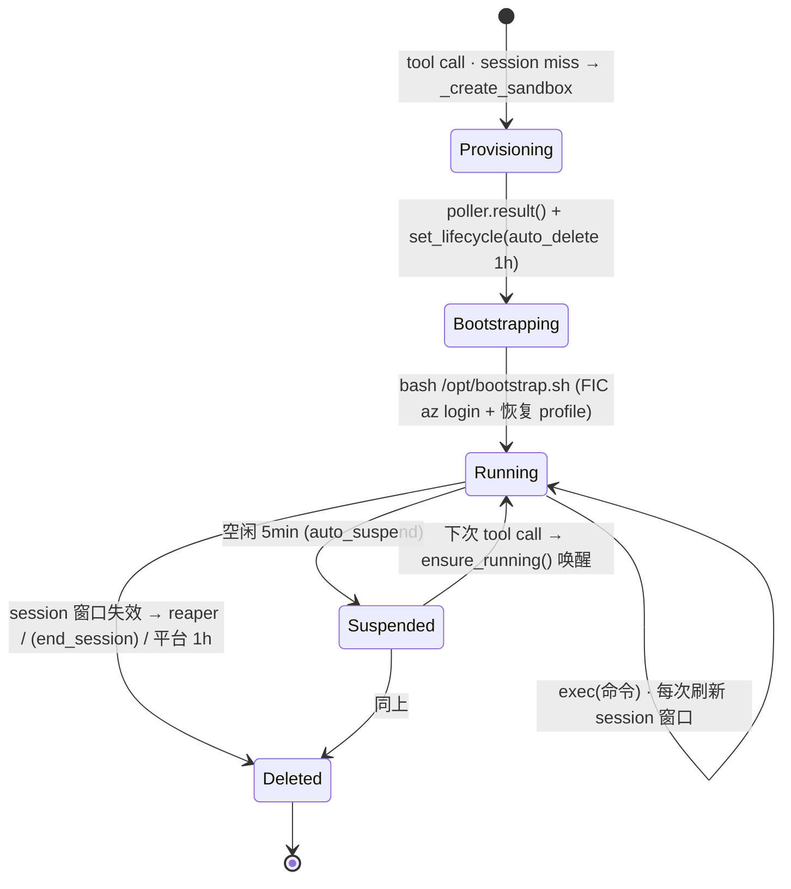
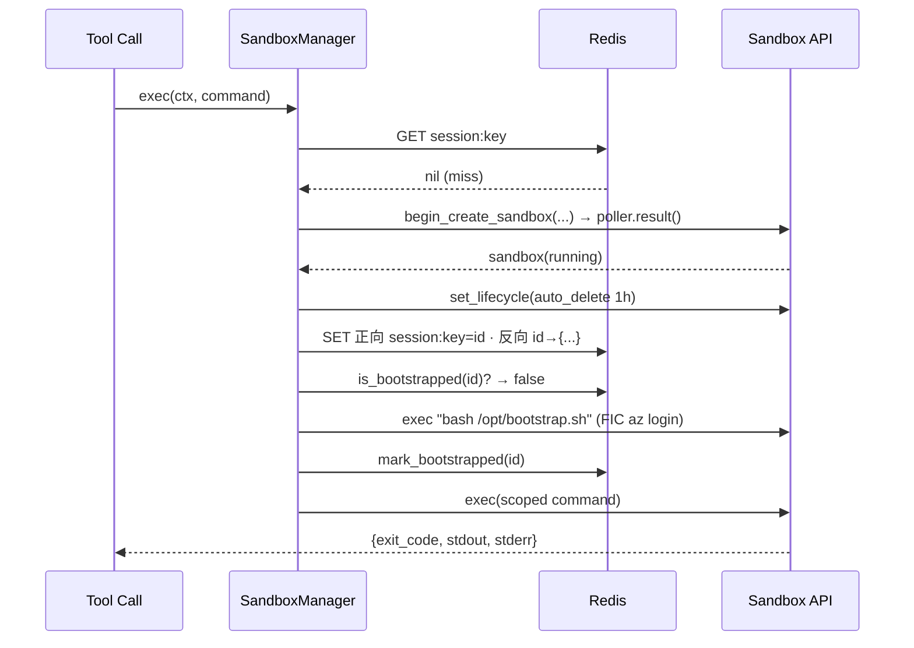
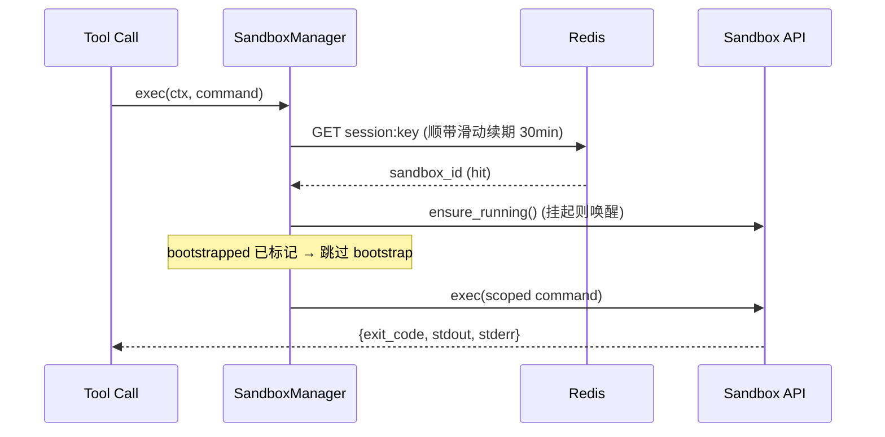

# Sandbox 生命周期(Lifecycle)

本文讲清楚 ACA 执行后端里**一台 sandbox 从出生到死亡的完整生命周期**:谁触发它出生、首次启动做了什么、靠什么在多次 tool call 间保活、空闲时如何挂起、最终由谁回收。

涉及代码:`src/mcp-server/sandbox_manager.py`、`src/mcp-server/cache.py`、`src/mcp-server/main.py`。
关联文档:[MCP-水平扩展-分布式锁与Reaper选主.md](MCP-水平扩展-分布式锁与Reaper选主.md)(routing/反向索引/reaper 的并发面)、[ACA-Sandbox-迁移方案.md](ACA-Sandbox-迁移方案.md)、[MCP-用户隔离与Redis设计.md](MCP-用户隔离与Redis设计.md)。

---

## TL;DR

一次 **session miss** 生出一台 sandbox(选盘 → 建 → 设 1h 兜底删)→ 首次 **bootstrap** 登录 → 之后靠 **30min 滑动窗口**在多次 tool call 间**复用**,中途空闲 5min **挂起**、下次调用**唤醒** → session 窗口一失效,**reaper** 在 ≤5min 内删掉它,平台 **1h auto-delete** 兜底。`end_session` 是为"显式结束"预留的第三条回收路,**当前实现了但未接线**。

---

## 0. 关键参数(都可 env 覆盖,`from_env` `sandbox_manager.py:126`)

| 参数 | env | 默认 | 角色 |
|---|---|---|---|
| session 窗口 | `MCP_SESSION_TTL` | 1800s / 30min | 正向 routing key 的滑动 TTL = sandbox 存活信号 |
| auto_suspend | `SANDBOX_AUTO_SUSPEND_SECONDS` | 300s / 5min | 空闲挂起(可唤醒) |
| reaper 间隔 | `SANDBOX_REAPER_INTERVAL` | 300s / 5min | 多久扫一次孤儿 |
| auto_delete | `SANDBOX_AUTO_DELETE_SECONDS` | 3600s / 1h | 平台层兜底删除 |
| cpu / memory | `SANDBOX_CPU` / `SANDBOX_MEMORY` | 1000m / 2048Mi | 资源规格 |

> 一个重要关系:**auto_suspend(5min) < session 窗口(30min)**。所以一次 session 内停顿几分钟会被挂起,但 session key 还在、下次调用自动唤醒;只有 session 窗口整段失效,才进入回收。

---

## 1. 状态机总览



---

## 2. 出生(create)—— 由一次 tool call 的 session miss 触发

调用链:`diagnose_bash / action_bash → _exec → executor.exec → SandboxManager.exec → get_or_create`。

`get_or_create`(`:191`)在 **routing-key 锁**内查正向表(`SessionSandboxCache`),**miss** 才走 `_create_sandbox`(`:244`):

1. **选盘(`_resolve_disk` `:311`)** —— 三选一,优先级从高到低:
   - prebuilt `disk_id`(`SANDBOX_DISK_ID`)→ 直接用;
   - 从 image 现建(`SANDBOX_DISK_IMAGE`)→ `_ensure_disk_image` 先 `list_disk_images` **复用现成 Ready 镜像**,没有才 build(多分钟,每 group 一次);
   - 公共盘(默认 `ubuntu`)。
2. **挂卷(`_workspace_volumes` `:271`)** —— 启用 blob 时挂上 group 的 workspace 容器(group MI 鉴权);`_ensure_volume` 幂等建卷(吞 `409 already exists`)。
3. **打标 + 注入 env** —— labels `{user, session, group}`(`_label_safe` 处理成合法 label);env `{SP_APP_ID, AZURE_TENANT_ID, AZURE_SUBSCRIPTION_ID}`(subscription 来自用户 profile,`_user_subscription`)。
4. `begin_create_sandbox(... cpu, memory, auto_suspend_seconds, volumes ...)` → `await poller.result()` 等 provisioning 完成。
5. **`_apply_idle_autodelete`(`:342`)** —— 立刻设 lifecycle policy:**1h 空闲 auto_delete**,平台层兜底(非致命,失败只 warning)。

create 成功后,`get_or_create` 写入 **正向 + 反向** 两张 Redis 表(`:214-222`):

```python
client = await self._create_sandbox(...)                              # 全新唯一 sandbox_id
await self._sessions.set(oid, session, group, client.sandbox_id)      # 正向: (oid,session,group) → id
await self._index.set(client.sandbox_id, {"oid":..., "session":..., "group":...})  # 反向: id → 路由信息
```

> 每次 create 都 mint 一个**全新唯一** sandbox_id,只绑给当前 routing key —— 这就是 1:1 绑定不变量(详见 [水平扩展 doc §5.1](MCP-水平扩展-分布式锁与Reaper选主.md))。

---

## 3. 启动一次(bootstrap)—— 每台 sandbox 只跑一次

写完 Redis 后,`get_or_create` 查 `is_bootstrapped(sandbox_id)`(标记存 Redis,`cache.py:150`)。**没跑过才**执行 `_bootstrap`(`:358`):

```python
result = await client.exec("bash /opt/bootstrap.sh")   # passwordless FIC `az login` 成 worker SP + 恢复用户 az profile
...
await self._sessions.mark_bootstrapped(client.sandbox_id)
```

- 成功 → 标记 bootstrapped;失败 → 抛 `RuntimeError`,这次 tool call 失败(下次会重试,bootstrap 幂等)。
- **复用一台已 bootstrapped 的 sandbox 会跳过这一步** —— 这正是 session-stickiness 省下的成本(免去每次重登)。

---

## 4. 干活(running / exec)

`exec`(`:393`)每次:`_ensure_reaper()` → `get_or_create()`(命中即复用)→ `client.exec(scoped_command)`。

- **每次 exec 是全新 shell**,所以 `_scope_to_workspace`(`:378`)每次 `mkdir -p && cd` 进入 per-conversation 的 workspace 目录(写入落到 blob 才持久),用 `&&` 保留用户命令自己的 exit code。
- 输出截到 `MAX_OUTPUT_BYTES`(默认 64KB),超了追加 `TRUNCATE_HINT` 教 agent 在源头收窄。

---

## 5. 保活(stickiness)—— 滑动窗口让它别死

正向 key `session:{oid}:{session}:{group}` 是 **30min 滑动 TTL**:`SessionSandboxCache.get` 每次读都 re-set(`cache.py:133-138`)。

> 只要用户在 30min 内继续调用,key 不断续命 → **同一台 sandbox 一直复用**。这个 key 既是路由依据,也是"session 还活着"的信号。它一旦过期,就等于宣告 session 结束。

---

## 6. 打盹(suspend)—— 省钱,但还活着

空闲超过 `auto_suspend`(默认 **5min**),平台把 sandbox **挂起**(不计算费,盘还在)。下次复用时 `get_or_create` 里的 `ensure_running()`(`:205`)把它**唤醒**:

```python
client = gclient.get_sandbox_client(sandbox_id)
await client.ensure_running()   # 挂起的唤醒;已删的抛 ResourceNotFoundError → 走重建
```

---

## 7. 死亡(delete)—— 三条路径(当前两条在跑)

| 路径 | 触发 | 状态 | 说明 |
|---|---|---|---|
| **reaper**(`reap_orphans` `:440`) | session 窗口失效(正向 key 过期) | ✅ 在跑 | 主力快路径:`peek` 发现 session key 没了 → 立刻 `begin_delete_sandbox` + 清反向索引,不等平台 1h |
| **平台 auto-delete** | 空闲满 `auto_delete`(默认 1h) | ✅ 在跑 | 兜底:reaper 全挂、或 unmanaged sandbox,靠它自我回收 |
| **`end_session`**(`:409`) | 显式结束 session | ⚠️ **实现了但未接线** | 一次删掉该 session 两个 group 的 sandbox + 清 Redis(正向 + 反向)。`Executor` 协议只声明了 `exec`,MCP 暂无 session-end 信号,**目前没有调用方** |

### 7.1 stale 恢复(额外的一条)

复用时若 `ensure_running()` 抛 `ResourceNotFoundError`(sandbox 被平台 auto-delete 从底下删了),`get_or_create`(`:208`)清掉正向 key 并**重建**一台:

```python
except ResourceNotFoundError:
    logger.info("stale session sandbox %s gone; recreating", sandbox_id)
    await self._redis_safe(self._sessions.delete(ctx.user_oid, ctx.session_id, group))
    # 继续往下走 _create_sandbox,等价于一次 miss
```

---

## 8. 两条典型路径的时序图

### 8.1 冷启动(首次 call,session miss)



### 8.2 复用(命中,可能从挂起唤醒)



---

## 9. 时间轴(把几个 TTL 串起来)

```
t=0      tool call → 建 sandbox(几分钟)→ bootstrap → 跑命令     [session 窗口开始 30min 计时]
t=5min   一直空闲 → auto_suspend 挂起(可唤醒)
t=8min   又来一个 call → ensure_running 唤醒 → 跑命令           [session 窗口刷新,重新 30min]
...
t=末次 call +30min   session key 过期 → 下一轮 reaper(≤5min 内)删掉它 + 清反向索引
t=末次 call +60min   若 reaper 没删成 → 平台 auto-delete 兜底删
```

---

## 10. 小结

- **出生**:session miss → 选盘 → 建 → 设 1h 兜底删 → 写正向/反向 Redis。
- **启动**:每台只 bootstrap 一次(FIC `az login` + 恢复 profile),复用即跳过。
- **保活**:30min 滑动窗口,只要持续调用就一直复用同一台。
- **打盹**:空闲 5min 挂起,下次 `ensure_running` 唤醒。
- **死亡**:session 窗口失效 → reaper 快删(≤5min);平台 1h auto-delete 兜底;`end_session` 预留但未接线;stale 则自动重建。

> 想了解多副本下 create 竞态、反向索引、reaper 选主等并发正确性问题,见 [MCP-水平扩展-分布式锁与Reaper选主.md](MCP-水平扩展-分布式锁与Reaper选主.md)。
