# 解释 Entra OAuth Proxy

这份文档总结两种 MCP + Entra 认证模式：

1. **DCR / OAuth Proxy 模式**
   - 任意 MCP client 动态注册到 FastMCP OAuth Proxy。
   - Entra 不认识这些动态 MCP clients。
   - FastMCP OAuth Proxy 用一个固定的 Entra App Registration 跟 Entra 交互。
   - Proxy 在本地 storage 里保存 client registration、authorization transaction、code/token mapping。

2. **Pre-registration / Pre-authorized Client 模式**
   - MCP client 是 Entra 已知 client，比如 VS Code。
   - MCP server 在 Entra 里注册成 protected API/resource。
   - Entra 直接给 MCP client 签发访问 MCP server 的 access token。
   - 没有 OAuth proxy，也没有 proxy 自己签发的 access token。

一句话区别：

> OAuth Proxy 是让 Entra 间接支持 arbitrary MCP clients；pre-registration 是让 Entra 只接受明确注册/预授权过的 MCP clients。

# 1. 背景：MCP Auth 和 Entra 的矛盾

MCP authorization spec 基于 OAuth 2.1。用 OAuth 角色来讲：

| OAuth 角色 | MCP 场景 |
| --- | --- |
| Resource Owner | 当前登录用户 |
| OAuth Client | MCP Client，比如 VS Code、Claude、agent |
| Resource Server | MCP Server / MCP Tools |
| Authorization Server | Entra 或 FastMCP OAuth Proxy |

MCP 为了支持 arbitrary clients，需要 client 能被 authorization server 识别。常见方式有：

- DCR：Dynamic Client Registration。
- CIMD：Client ID Metadata Document。
- Pre-registration：提前在 authorization server 里注册或授权 client。

问题是：**Microsoft Entra 目前不按 MCP 需要的方式支持 DCR / CIMD**。所以有两条路线：

- 要支持 arbitrary MCP clients：在 Entra 前面加 FastMCP OAuth Proxy。
- 要生产上更安全：使用 pre-registered / pre-authorized clients。

# 2. 两层 OAuth 世界

理解 OAuth Proxy 的关键，是把“client 看到的 OAuth 世界”和“Entra 看到的 OAuth 世界”分开。

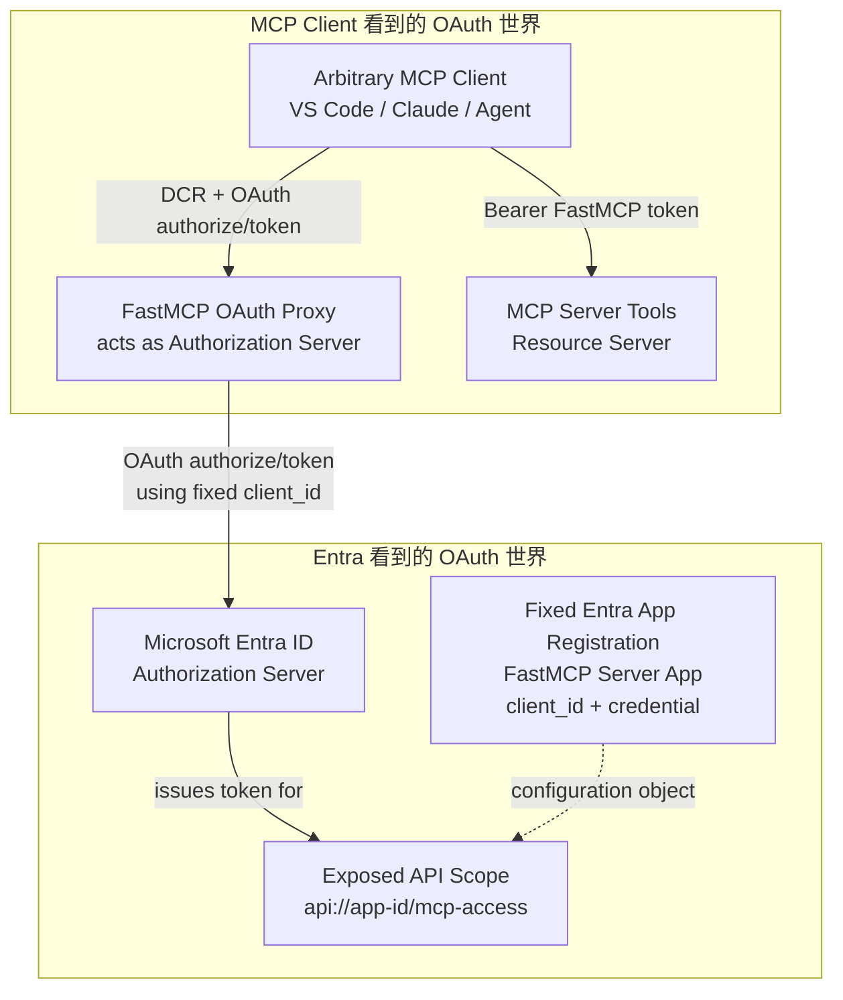

所以在 OAuth Proxy 模式里：

- 从 MCP client 看，FastMCP OAuth Proxy 是 Authorization Server。
- 从 FastMCP OAuth Proxy 看，Entra 是 Authorization Server。
- Entra 只知道固定的 FastMCP App Registration。
- Entra 不知道任意动态 MCP client 的真实身份。

# 3. DCR / OAuth Proxy 模式

## 3.1 这个模式解决什么问题

这个模式解决的是：

> MCP client 想动态注册，但 Entra 只接受固定 app registration。

FastMCP 的 `AzureProvider` / `OAuthProxy` 在 MCP server 进程里挂出一组 OAuth endpoints，让 MCP client 以为自己在跟一个支持 DCR 的 authorization server 交互。

在 demo 里，配置大概是：

```python
auth = AzureProvider(
    client_id=os.environ["ENTRA_PROXY_AZURE_CLIENT_ID"],
    client_secret=os.environ["ENTRA_PROXY_AZURE_CLIENT_SECRET"],
    tenant_id=os.environ["AZURE_TENANT_ID"],
    base_url=entra_base_url,
    required_scopes=["mcp-access"],
    client_storage=oauth_client_store,
)
```

其中：

- `client_id` / `client_secret` 是固定 Entra App Registration 的配置。
- `required_scopes=["mcp-access"]` 是 MCP server 要求 token 里出现的 scope。
- `client_storage` 是 proxy 保存 DCR 和 OAuth state 的地方。
- local 可以用 `MemoryStore`。
- production demo 用 Cosmos DB store。

## 3.2 Proxy storage 里存什么

这个 storage 不是用户数据库，也不是替代 Entra 的 identity store。

它主要保存 OAuth proxy 自己需要的状态：

- 动态 MCP client registration。
- authorization transaction。
- MCP client redirect URI、state、PKCE 信息。
- proxy authorization code。
- FastMCP token 与 upstream Entra token 的 mapping。
- refresh token / JTI mapping metadata。

可以理解成：

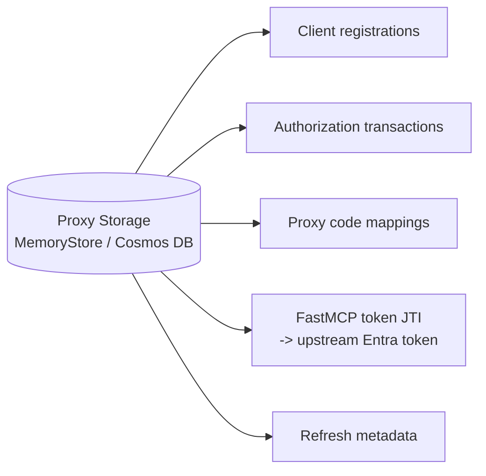

## 3.3 Entra App Registration 在这里代表谁

OAuth Proxy 模式里，Entra 里的 App Registration 代表的是：

> FastMCP OAuth Proxy / MCP Server application as seen by Entra.

它不是任意 MCP client 本身。

这个 App Registration 同时承担两个配置角色：

| 角色 | Entra 配置 | 用途 |
| --- | --- | --- |
| Upstream OAuth client | `client_id`、secret/cert/FIC、redirect URI `/auth/callback` | Proxy 用它跟 Entra 做 OAuth |
| Protected API/resource | `Expose an API`、scope `mcp-access`、Application ID URI `api://{app_id}` | Entra 能签发面向 MCP server 的 token |

在 1 月文章中，这个 app registration 定义了 `mcp-access` scope。MCP client 最终请求的是：

```text
api://<fastmcp-app-id>/mcp-access
```

token 里期望看到：

```json
{
  "aud": "api://<fastmcp-app-id>",
  "scp": "mcp-access"
}
```

`mcp-access` 和 `user_impersonation` 一样，本质都是自定义 scope 名字。Entra 负责把它写进 token；MCP server 负责解释这个 scope 到底允许做什么。

## 3.4 为什么 DCR Proxy 模式里常常只用一个 App Registration

从纯 OAuth 角色建模来看，proxy 和 MCP server 可以拆成两个 Entra App Registrations：

- Proxy app registration：只作为 Entra OAuth client，配置 `client_id`、credential、`/auth/callback`。
- Server API app registration：只作为 protected resource/API，配置 `Expose an API` 和 `mcp-access` scope。

但在 FastMCP demo / OAuth Proxy pattern 里，通常只创建一个 Entra App Registration，因为 **FastMCP OAuth Proxy 和 MCP Server 是同一个应用安全边界**：

- same FastMCP app。
- same process / container。
- same public base URL。
- same operator。
- same auth provider / token validation layer。

因此一个 Entra App Registration 同时表达两件事：

```text
As upstream Entra client:
  client_id
  client_secret / certificate / FIC
  redirect URI: /auth/callback

As protected API/resource:
  Application ID URI: api://<app-id>
  scope: mcp-access
```

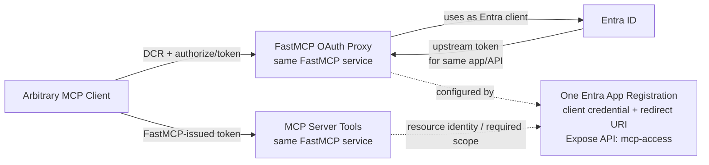

这和 pre-registration 模式不同。Pre-registration 没有 proxy 这个中间授权服务器，Entra 直接面对真实 MCP client，因此 Entra 必须同时知道：

```text
谁在请求 token？  -> Client App Registration
token 发给谁？    -> Server/API App Registration
```

所以 pre-registration 通常是两个 app registrations：

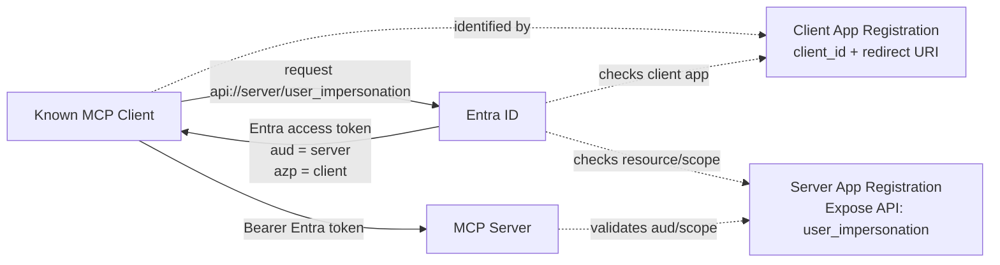

总结成一句话：

> Pre-registration 模式里，Entra 直接看见真实 client，所以 client app 和 server app 必须分开表达；DCR proxy 模式里，Entra 看不见真实 arbitrary client，只看见 proxy，而 proxy 和 server 又部署在同一个 FastMCP service 里，所以一个 app registration 就能同时表达 upstream client 和 protected API。

如果你希望边界更清晰，DCR proxy 模式也可以设计成两个 app registrations：

```mermaid
flowchart LR
    C["Arbitrary MCP Client"]
    P["FastMCP OAuth Proxy"]
    E["Entra ID"]
    PA["Proxy Client App Registration"]
    SA["MCP Server API App Registration\nExpose API: mcp-access"]
    S["MCP Server"]

    C --> P
    P -->|"authorize/token as proxy client"| E
    E -. "checks proxy client"| PA
    E -. "issues token for server API"| SA
    E -->|"upstream token\naud = server API"| P
    C -->|"FastMCP-issued token"| S
    S -. "resource identity" .-> SA
```

这种设计语义更干净，但部署和配置更复杂。FastMCP demo 合并成一个，是因为 proxy 和 tools 是同一个 FastMCP service。

## 3.5 OAuth Proxy 完整流程图

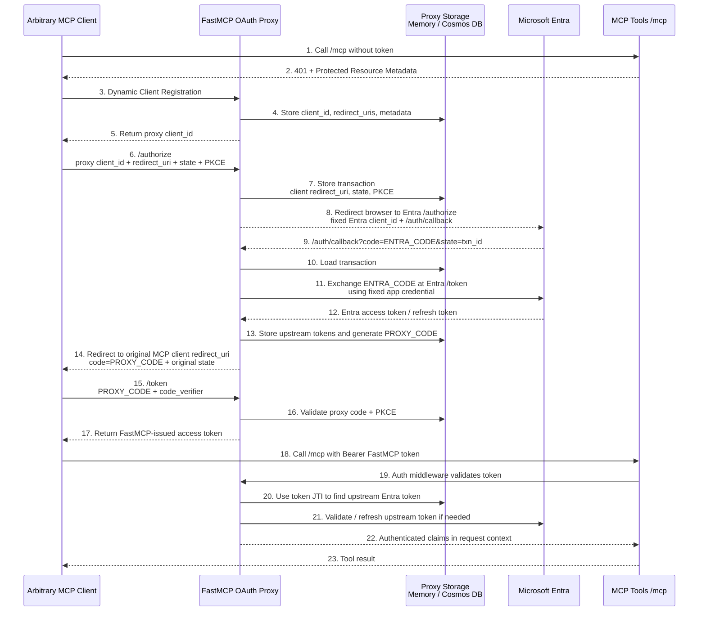

## 3.6 最容易误解的点

### Entra code 不会直接给 MCP client

Entra 返回的是：

```text
ENTRA_CODE
```

这个 code 绑定的是：

- 固定 Entra App Registration。
- Proxy 的 `/auth/callback` redirect URI。
- Proxy 与 Entra 的 upstream OAuth transaction。

MCP client 不能直接拿这个 code 去 Entra 换 token。

FastMCP Proxy 会先消耗 `ENTRA_CODE`，换出 upstream Entra token，然后自己生成：

```text
PROXY_CODE
```

再把 `PROXY_CODE` 给 MCP client。

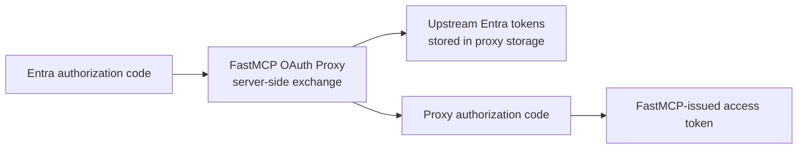

### MCP client 拿到的不是原始 Entra access token

在 FastMCP OAuth Proxy 模式里，MCP client 最终拿到的是 **FastMCP-issued access token**，不是原始 Entra access token。

更准确地说：

```text
Entra access token
  = proxy/server 内部保存的 upstream token
  = 用来证明用户已经通过 Entra，并可供 FastMCP 验证/刷新/OBO 使用

FastMCP-issued access token
  = arbitrary MCP client 实际拿到并带给 /mcp 的 bearer token
  = FastMCP OAuth Proxy 对 MCP client 签发的 token
```

FastMCP 源码里 `exchange_authorization_code()` 的语义就是：

```text
Exchange authorization code for FastMCP-issued tokens.
Returns FastMCP tokens (NOT upstream tokens).
```

这个 FastMCP token 里有 `jti` 等信息，FastMCP auth layer 可以用它在 storage 中找回 upstream Entra token。

所以 MCP request 阶段不是简单的：

```text
proxy 把 HTTP header 替换成 Entra token 再转发
```

更准确是：

```text
MCP request 带 FastMCP token
-> FastMCP auth middleware 验证 FastMCP token
-> 用 JTI 查回 upstream Entra token
-> 验证/刷新 upstream token
-> 把用户 claims 放入 request context
-> MCP tool 执行业务逻辑
```

也就是说，MCP server 之所以“认”这个 FastMCP-issued token，是因为在这个 demo 里：

- OAuth Proxy 和 MCP Server 运行在同一个 FastMCP app 里。
- MCP Server 的 auth middleware 使用同一个 `AzureProvider/OAuthProxy`。
- FastMCP 自己签发 token，也自己验证 token。
- 验证时再通过 JTI mapping 找回并验证/刷新 upstream Entra token。

所以这个 demo 里的信任关系不是：

```text
MCP server 原生信任任意 proxy token
```

而是：

```text
FastMCP OAuth Proxy 和 MCP Server 共享同一套 auth provider，
因此 FastMCP-issued token 可以被同一个 FastMCP app 的 /mcp middleware 识别。
```

如果你把 proxy 和 MCP server 拆成两个独立服务，那么就不能默认假设 MCP server 会认 proxy token。你需要显式设计信任关系，例如：

- MCP server 信任 proxy 的 JWT issuer / JWKS。
- MCP server 通过 introspection 调 proxy 验 token。
- 或者改成让 MCP client 直接拿 Entra-issued token 调 MCP server。

一句话校准：

> DCR proxy 模式里，Entra access token 是 proxy/server 内部的 upstream token；arbitrary MCP client 面向的是 proxy 的 OAuth 世界，最终拿到的是 FastMCP/proxy token。MCP server 认不认这个 token，取决于 server 是否和 proxy 共享同一套 auth provider，或者是否显式信任 proxy issuer。

所以这里的边界是：

| 模式 | MCP client 最终带给 MCP server 的 token |
| --- | --- |
| FastMCP OAuth Proxy demo | FastMCP-issued token |
| Pre-registration | Entra-issued token |
| 自定义分离式 proxy | 取决于你的设计，必须显式定义 server 如何信任 token |

# 4. OBO：MCP Server 再调用 Graph

无论是 DCR/proxy 模式还是 pre-registration 模式，如果 MCP server 需要调用 Microsoft Graph，就需要 OBO。

OBO 的目的不是让 MCP client 调 MCP server；那一步已经由 MCP access token 完成。

OBO 的目的是：

> MCP server 收到用户上下文后，再代表这个用户调用下游 API，比如 Microsoft Graph。

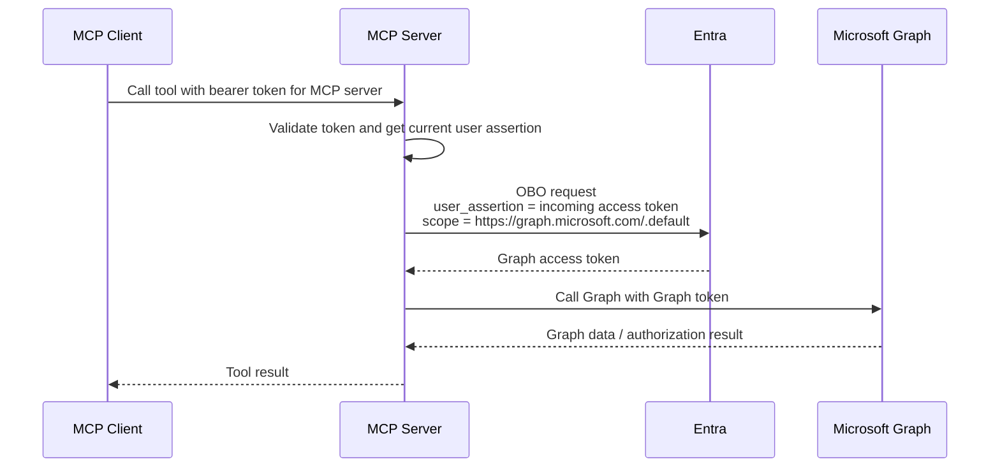

为了 OBO 成功，MCP server 对应的 Entra App Registration 需要有 Graph delegated permissions，并通常需要 admin consent。例如：

- `User.Read`
- `email`
- `openid`
- `profile`
- 其他 Graph scopes

注意：

- `mcp-access` / `user_impersonation` 是 MCP server 自己的 API scope。
- `User.Read` 是 Microsoft Graph 的 API scope。
- 前者让 client 能访问 MCP server。
- 后者让 MCP server 能通过 OBO 访问 Graph。

# 5. Pre-registration / Pre-authorized Client 模式

## 5.1 这个模式解决什么问题

Pre-registration 模式适合：

- MCP server 只需要支持已知 clients，比如 VS Code 或公司内部 client。
- 生产环境希望明确审查每个 client。
- 不想让一个 proxy 替 arbitrary clients 跟 Entra 交互。

4 月文章明确采用的是这种模式：VS Code 是 pre-authorized client，Entra 直接作为 authorization server。

## 5.2 需要几个 App Registration

典型情况：

| 组件 | Entra App Registration | 说明 |
| --- | --- | --- |
| MCP Client | 需要已知 app registration | VS Code 已有 Microsoft first-party client ID；自研 client 需要自己注册 |
| MCP Server | 需要 app registration | 暴露 API scope，比如 `user_impersonation` |
| Microsoft Graph | Microsoft 已有 resource app | 不是你创建的 |

注意：文章里为了 local dev 和 Azure Container Apps production 分别创建了两个 server-side app registrations：

- local：使用 client secret。
- production：使用 Managed Identity as Federated Identity Credential。

这是部署凭据策略，不改变 OAuth 模型。概念上仍然是“server app registration 暴露 MCP server API scope”。

## 5.3 Server App Registration 的作用

MCP server 的 App Registration 不是“部署到 Function App / Container App 的副产品”。它的核心作用是让 Entra 知道：

> 这里有一个受保护的 API/resource，client 可以请求它的 delegated scope。

例如：

```text
api://<server-app-id>/user_impersonation
```

这个 scope 是 server 自己定义的 permission label。名字可以换成：

- `access_as_user`
- `mcp-access`
- `tools.call`
- `tools.execute`

关键是：

- Entra 把它写入 access token 的 `scp` claim。
- MCP server 验证 token 里有没有这个 scope。
- MCP server 根据这个 scope 执行对应授权逻辑。

```json
{
  "aud": "api://<server-app-id>",
  "scp": "user_impersonation",
  "oid": "<user-object-id>",
  "azp": "<client-app-id>"
}
```

Graph 的 `User.Read` 也是同一机制，只是 Microsoft Graph 服务端已经实现了 `User.Read` 的含义。你的 `user_impersonation` / `mcp-access` 的含义要由你的 MCP server 实现。

## 5.4 Pre-registration 完整流程图

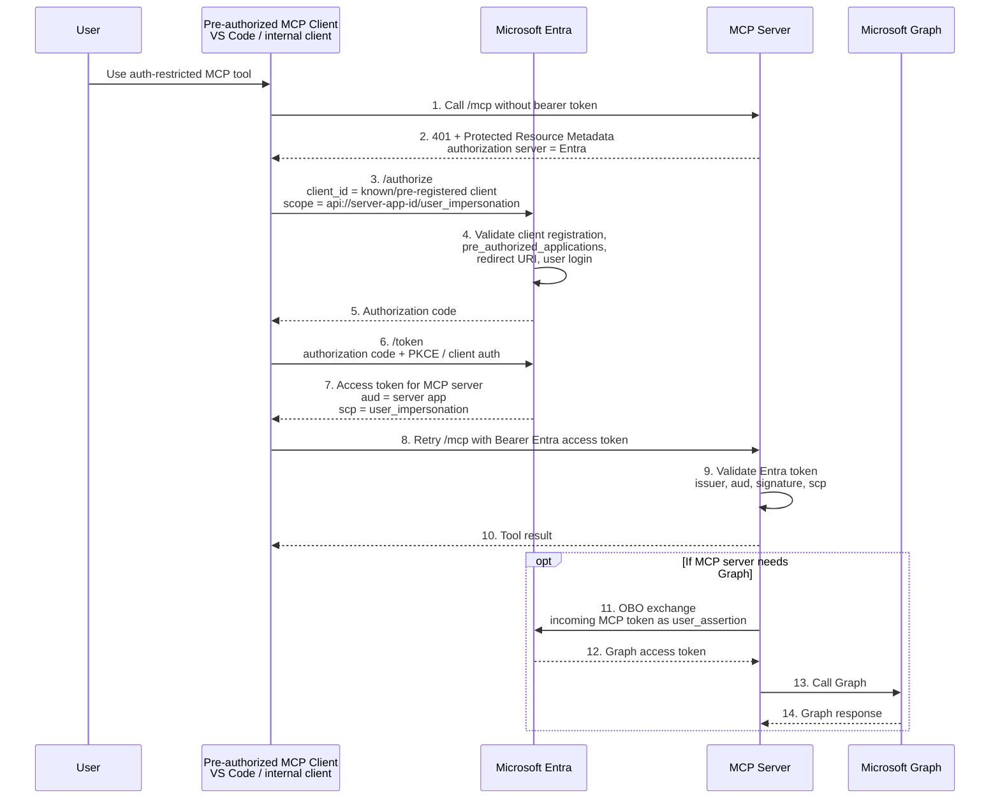

## 5.5 Pre-registration 架构图

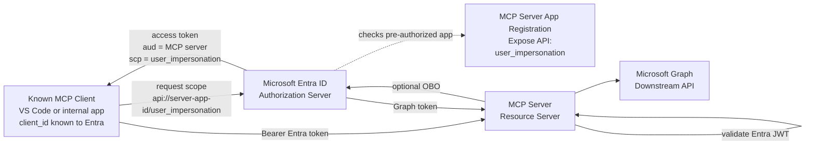

# 6. DCR Proxy vs Pre-registration 对比

| 维度 | DCR / OAuth Proxy | Pre-registration |
| --- | --- | --- |
| MCP client 是否 arbitrary | 是 | 否，只支持已知 clients |
| Client 注册在哪里 | FastMCP Proxy storage | Entra |
| Entra 是否知道真实 MCP client | 通常不知道 | 知道 |
| Authorization Server，MCP client 视角 | FastMCP OAuth Proxy | Entra |
| Authorization Server，proxy/server 视角 | Entra | Entra |
| Server 是否有 Entra App Registration | 有 | 有 |
| 是否需要 proxy storage | 需要，Memory/Cosmos DB | 不需要 |
| Client 拿到的 token | FastMCP-issued token | Entra-issued token |
| Server 验证方式 | 先验 FastMCP token，再查/验 upstream Entra token | 直接验证 Entra JWT |
| 生产安全性 | 风险更高，文章建议主要开发测试 | 更推荐 |
| 支持 OBO 调 Graph | 支持 | 支持 |

# 7. “为什么 server 也要 App Registration？”

因为 OAuth access token 必须有 audience 和 scope。

Client 请求：

```text
scope=api://<server-app-id>/user_impersonation
```

Entra 要知道：

- `api://<server-app-id>` 是哪个 protected resource。
- `user_impersonation` 是不是这个 resource 暴露的 delegated scope。
- 哪些 clients 可以请求这个 scope。
- 用户/admin 是否 consent。

这些信息都在 **server-side App Registration** 的 `Expose an API` 配置里。

所以即使 MCP server 部署在 Azure Function App、App Service、Container Apps、AKS，本质都一样：

> Hosting resource 不等于 OAuth resource。你的 HTTP API 要成为 Entra 可签 token 的 audience，就需要一个 App Registration 来定义这个 API/resource。

# 8. “user_impersonation / mcp-access 到底是什么？”

它是自定义 scope，也就是一个 permission label。

它不像 Graph 的 `User.Read` 那样由 Microsoft Graph 实现业务权限。它的实际意义由你的 MCP server 代码实现。

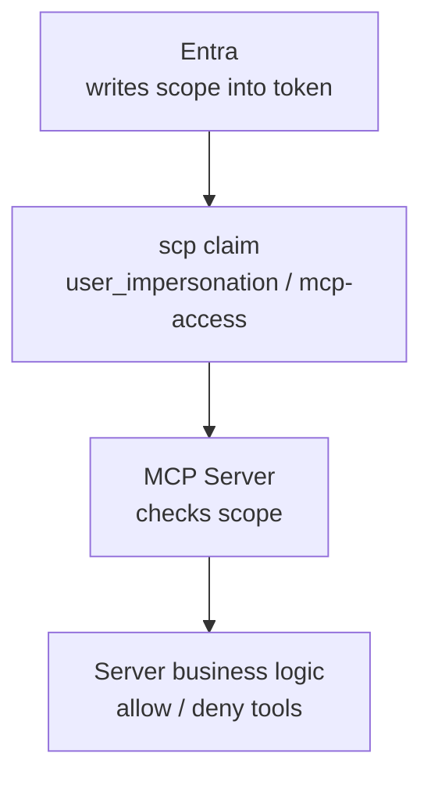

类比：

| Scope | 谁定义 | 谁实现含义 |
| --- | --- | --- |
| `https://graph.microsoft.com/User.Read` | Microsoft Graph | Microsoft Graph |
| `https://graph.microsoft.com/Mail.Read` | Microsoft Graph | Microsoft Graph |
| `api://your-api/user_impersonation` | 你的 MCP server | 你的 MCP server |
| `api://your-api/mcp-access` | 你的 MCP server | 你的 MCP server |

最小实现通常是：

```text
token.aud == my server app id
token.scp contains mcp-access
=> allow MCP request
```

更细粒度实现可以定义：

```text
tools.read
tools.execute
tools.admin
```

然后在工具层分别检查。

# 9. 代码实现心智模型

在 `python-mcp-demos` 的 DCR/proxy 模式里，关键结构是：

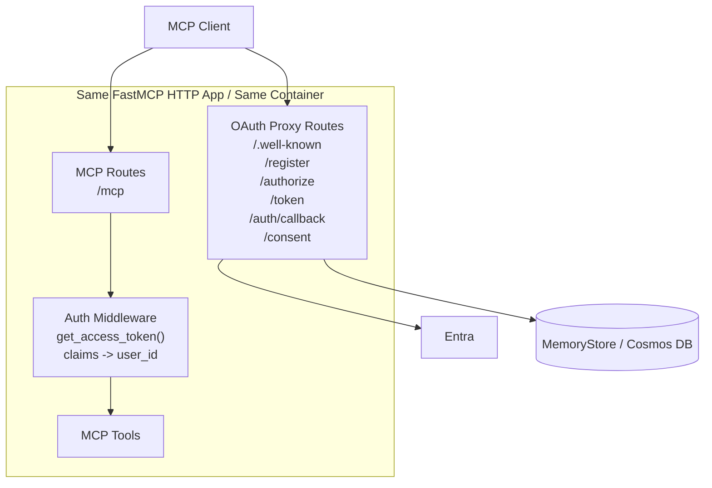

也就是说：

- OAuth Proxy 和 MCP Server 通常在同一个 FastMCP app 里。
- 它们暴露不同 HTTP endpoints。
- FastMCP auth provider 自动处理 DCR、authorize、token、callback、PKCE、code mapping。
- 你的 tool 代码通常只关心当前用户 claims 或 OBO 后的 downstream token。

# 10. 最终结论

如果你要支持任意 MCP client：

```text
MCP Client -> FastMCP OAuth Proxy -> Entra
```

你需要：

- 一个固定 Entra App Registration 给 proxy/server 使用。
- Proxy storage，保存 dynamic client registration 和 OAuth transaction 状态。
- FastMCP-issued token 与 upstream Entra token 的 mapping。
- 如果要调 Graph，再给这个 Entra app registration 配 Graph delegated permissions / admin consent。

如果你只支持已知 MCP client：

```text
MCP Client -> Entra -> MCP Server
```

你需要：

- MCP client 在 Entra 里已注册或已知。
- MCP server App Registration 暴露 API scope，比如 `user_impersonation`。
- 在 server app registration 里 pre-authorize 这个 client。
- MCP server 直接验证 Entra access token。
- 如果要调 Graph，再走 OBO。

推荐判断：

- **开发测试 / arbitrary clients**：OAuth Proxy 可以快速工作，但安全边界复杂。
- **生产 / 企业环境**：Pre-registration 更清晰，因为每个 client 都被明确创建、审查和授权。
