# Function App + APIM for MCP Authentication

这份总结聚焦一个问题：

> 如果 FastMCP server 已经写好了，怎样在**不改 MCP server 业务代码**的前提下，给远程 MCP endpoint 加访问控制？

结论先放前面：

| 部署方式 | 不改 FastMCP 代码能否做 key-based access | 主要机制 |
|---|---:|---|
| Azure Functions custom handler | 可以 | Function key |
| Azure API Management + 任意后端 | 可以 | APIM subscription key / OAuth validation policy |
| Azure App Service / Web App 单独部署 | 不太适合 | 没有 Function key；通常要 Easy Auth、APIM、或应用层 middleware |
| Azure Container Apps 单独部署 | 不太适合 | 没有通用 Function key；通常要 Easy Auth、APIM、ingress 限制、或应用层 middleware |

核心判断：

> 如果不想改 FastMCP server 代码，key-based access 最自然的选择是 **Azure Functions Host** 或 **API Management gateway**。

---

## 1. Baseline: FastMCP Hosted in Azure Functions

在 `mcp-sdk-functions-hosting-python` 这个 repo 里，FastMCP server 是一个普通的 streamable HTTP server：

```python
mcp = FastMCP("weather", stateless_http=True)
mcp.run(transport="streamable-http")
```

Azure Functions 通过 `customHandler` 启动 `server.py`，再把 HTTP 请求转发给这个 FastMCP server。

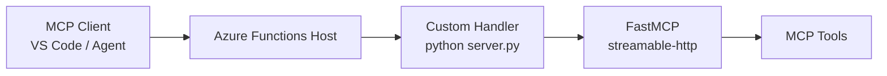

这里的关键是：

> Function key 校验发生在 Azure Functions Host 层，不发生在 FastMCP 业务代码里。

---

## 2. Key-Based Option A: Azure Function Key

把 `host.json` 里的 custom handler authorization level 改成 `function`：

```json
{
  "customHandler": {
    "http": {
      "DefaultAuthorizationLevel": "function"
    }
  }
}
```

调用方必须带 Function key：

```http
POST https://your-function-app.azurewebsites.net/mcp
x-functions-key: <function-key>
content-type: application/json
```

或者：

```text
https://your-function-app.azurewebsites.net/mcp?code=<function-key>
```

推荐 header 方式，避免 key 出现在 URL、日志、浏览器历史里。

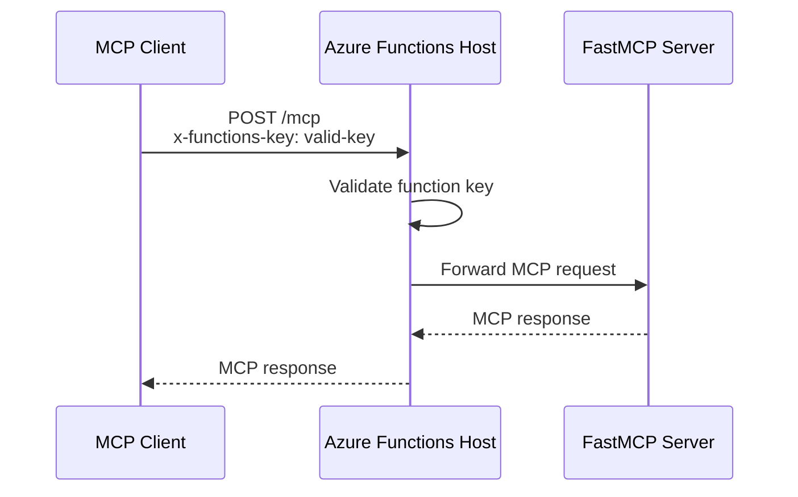

如果 key 缺失或错误：

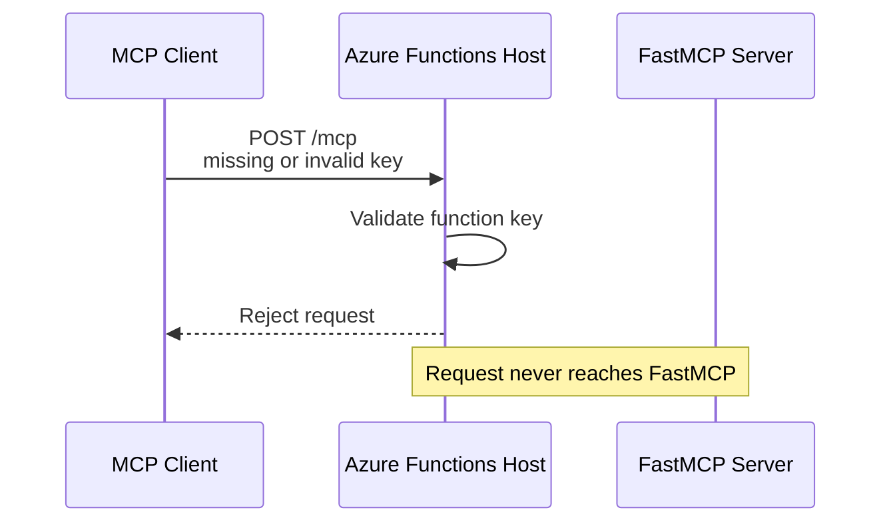

特点：

| 项目 | 说明 |
|---|---|
| 校验位置 | Azure Functions Host |
| FastMCP 是否感知 key | 不感知 |
| 是否表达用户身份 | 不表达 |
| 是否表达 OAuth scope | 不表达 |
| 适合场景 | demo、internal tool、少量 trusted clients、快速保护 endpoint |

---

## 3. Key-Based Option B: APIM Subscription Key

如果 MCP server 后面可以是 Azure Function、Container Apps、App Service、AKS，APIM 可以作为统一入口。

APIM 的 key-based access 叫 **subscription key**。

调用方带：

```http
POST https://your-apim.azure-api.net/mcp
Ocp-Apim-Subscription-Key: <subscription-key>
content-type: application/json
```

APIM 校验通过后，再转发到后端 MCP service。

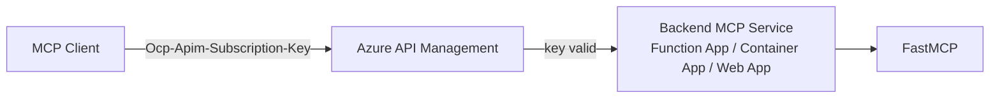

失败时：

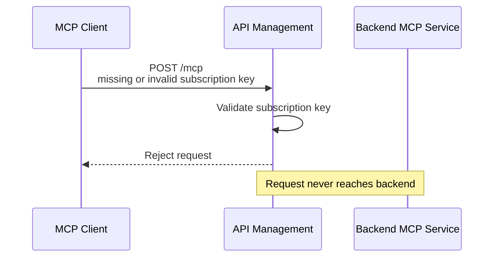

特点：

| 项目 | 说明 |
|---|---|
| 校验位置 | APIM gateway |
| FastMCP 是否感知 key | 不感知 |
| 后端类型 | Function App、Container Apps、App Service、AKS 都可以 |
| 是否支持用户自助申请 key | 可以通过 Developer Portal 申请 subscription，由 APIM 生成 primary/secondary keys |
| 是否是 bearer token | 不是；它是 APIM subscription key |

APIM subscription key 适合把 API access 分发给 developer、team、client application，但它本身不代表 end user identity。

---

## 4. Key-Based Option C: Application-Level API Key

也可以在 FastMCP / ASGI / Starlette / FastAPI 层自己写 middleware：

```text
Client -> FastMCP app -> custom API key middleware -> MCP tools
```

但这需要改业务层或 server 代码。

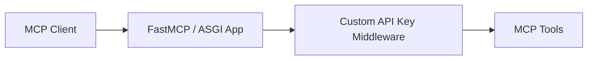

这个方式不符合“不要改 MCP server 代码”的目标，所以在这份方案里不作为主路径。

---

## 5. Why Not Just Azure Web App or Container App?

Azure App Service / Web App 和 Azure Container Apps 都可以跑 FastMCP server，但它们不像 Azure Functions 那样自带通用的 `function key` authorization level。

如果直接部署到 Web App 或 Container App，要做 key-based access，通常有几种选择：

| 做法 | 是否改 FastMCP server 代码 | 说明 |
|---|---:|---|
| 自己写 API key middleware | 要改 | 最像普通 REST API key |
| 使用 App Service / Container Apps built-in auth | 不一定改 | 更偏 OAuth/OIDC，不是 key-based |
| 放在 APIM 后面 | 不改 | APIM 做 key 或 token 校验 |
| 用 ingress / network restriction | 不改 | 限制网络来源，不是 API key |

所以如果目标是：

> 不改 FastMCP server 业务代码，又要 key-based access

推荐：

```text
Azure Functions Function Key
或
APIM Subscription Key
```

---

## 6. Function App + APIM Combined

APIM 和 Function key 可以叠加，但不一定都需要。

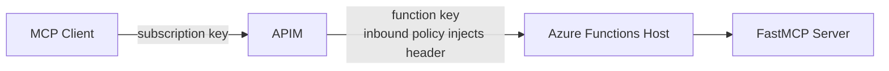

常见设计：

| 设计 | Client 需要知道 | 后端保护方式 |
|---|---|---|
| 只用 Function key | Function key | Functions Host 验 key |
| 只用 APIM key | APIM subscription key | 后端只允许 APIM 访问 |
| APIM key + Function key | 只知道 APIM key；Function key 由 APIM 注入 | 双层保护 |

如果 APIM 在前面，比较干净的做法是：

1. Client 只面对 APIM。
2. Client 只拿 APIM subscription key 或 Entra token。
3. Function App 后端不要公网裸奔。
4. 如果 Function App 仍要求 function key，由 APIM policy 注入 `x-functions-key`。

---

## 7. OAuth Option A: User Impersonation

Key-based access 只能证明“调用方知道 key”。如果需要用户身份、consent、scope，就要 OAuth。

User impersonation 适合：

- 用户在场
- 需要知道是谁在调用 MCP
- MCP tool 返回 user-specific data
- 需要 delegated permission

典型 app registration：

| App registration | 代表谁 |
|---|---|
| Client App | MCP client，例如 VS Code、desktop client、web client |
| MCP API App | 被保护的 API resource，暴露 `user_impersonation` scope |

请求 token 时：

```text
client_id=<client-app-id>
scope=api://<mcp-api-app-id>/user_impersonation
```

用户 consent 的含义是：

> Do you consent to this Client App accessing the MCP API with `user_impersonation`?

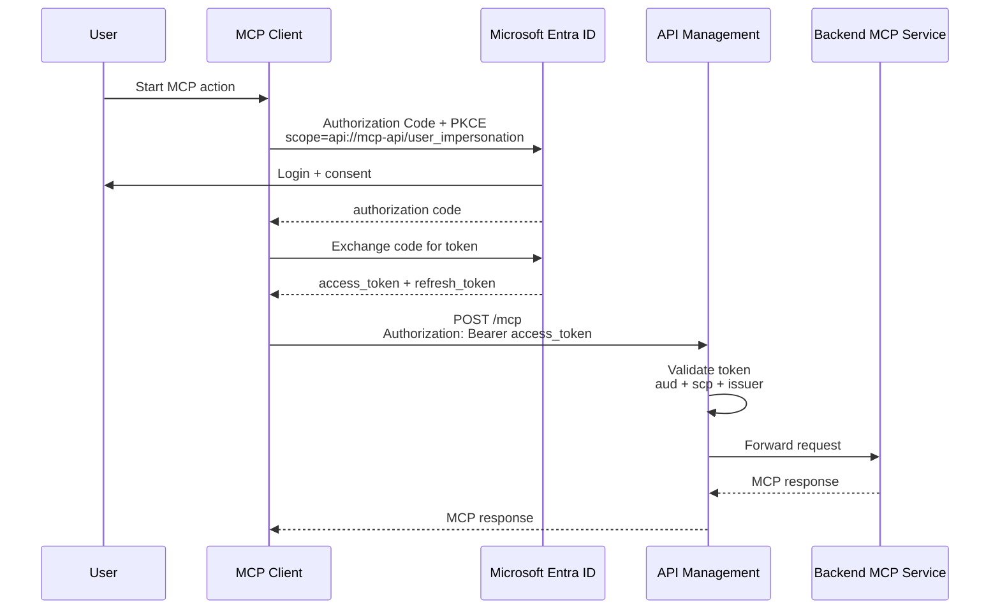

APIM policy checks:

| Claim | What APIM checks |
|---|---|
| `iss` | Token came from expected Entra tenant |
| `aud` | Token is for MCP API |
| `scp` | Token includes `user_impersonation` |
| `azp` / `appid` | Optional: caller client app is allowed |

Example APIM policy shape:

```xml
<validate-azure-ad-token tenant-id="YOUR_TENANT_ID">
  <audiences>
    <audience>api://YOUR_MCP_API_APP_ID</audience>
  </audiences>
  <required-claims>
    <claim name="scp" match="any">
      <value>user_impersonation</value>
    </claim>
  </required-claims>
</validate-azure-ad-token>
```

The user does not log in on every API call:

1. Client uses the access token until it expires.
2. Client uses refresh token to silently get a new access token.
3. User signs in again only when refresh token is expired/revoked or Conditional Access requires it.

---

## 8. OAuth Option B: Client Credentials with Client ID + Client Secret

For microservices, do not use interactive user login.

Use client credentials:

```text
client_id + client_secret/certificate/federated credential
grant_type=client_credentials
scope=api://<mcp-api-app-id>/.default
```

This is app-only identity.

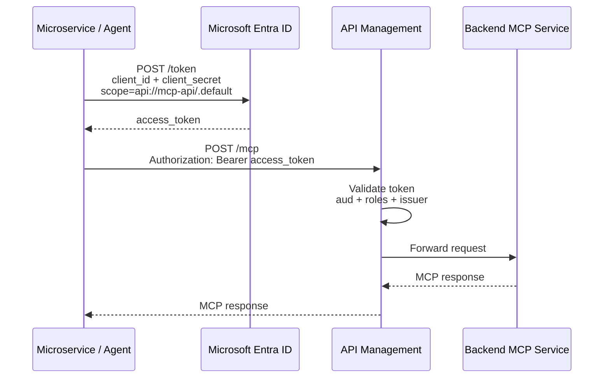

For client credentials:

| Topic | Answer |
|---|---|
| Is there a user? | No |
| Is there consent? | Admin consent, usually ahead of time |
| Does it use `user_impersonation`? | No |
| Scope format | `api://mcp-api/.default` |
| Token claim to check | Usually `roles`, not `scp` |
| Refresh token? | No |
| How does service renew token? | It calls Entra again with its own credential |

APIM policy should check app-only claims:

```xml
<validate-azure-ad-token tenant-id="YOUR_TENANT_ID">
  <audiences>
    <audience>api://YOUR_MCP_API_APP_ID</audience>
  </audiences>
  <required-claims>
    <claim name="roles" match="any">
      <value>Mcp.Invoke</value>
    </claim>
  </required-claims>
</validate-azure-ad-token>
```

Conceptually:

```text
user_impersonation = user delegated access
.default = app-only permissions already granted to this client
```

---

## 9. APIM as OAuth Gatekeeper

APIM does not log users in and does not issue Entra tokens.

APIM's role is:

1. Receive request.
2. Extract `Authorization: Bearer <access_token>`.
3. Validate issuer, audience, signature, expiry, and required claims.
4. Forward only valid requests to backend MCP service.

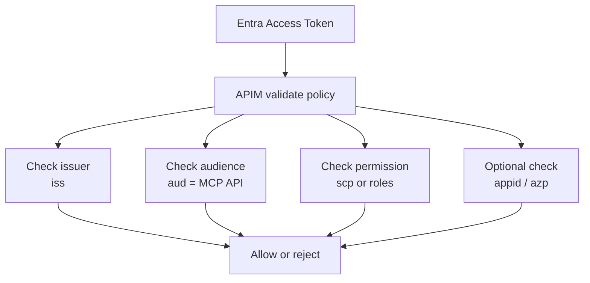

You can combine APIM subscription key and OAuth:

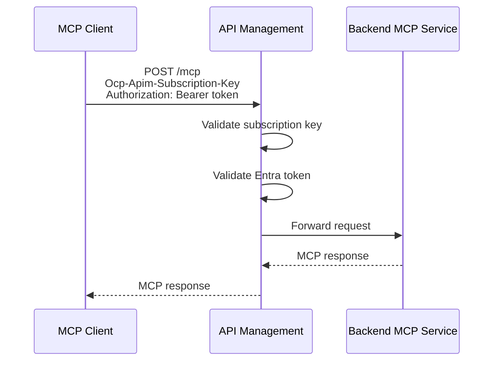

This gives two dimensions:

| Mechanism | Represents |
|---|---|
| Subscription key | Developer / application subscription in APIM |
| Bearer token | User or app identity from Entra |

---

## 10. Managed Identity Flow

For Azure-hosted microservices, prefer Managed Identity over client secret.

Example callers:

- Azure Function
- Azure Container Apps
- Azure App Service
- AKS workload identity
- VM / VMSS

The service asks Entra for a token using its managed identity, then calls APIM with that token.

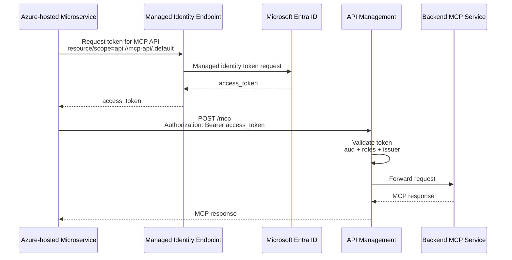

Managed Identity is preferred because:

| Client secret | Managed Identity |
|---|---|
| Secret must be stored | No secret stored in app |
| Secret rotates manually or by automation | Azure manages credential material |
| Risk if leaked | Lower exposure |
| Good for non-Azure or legacy callers | Best for Azure-hosted workloads |

---

## 11. Recommended Patterns

### Simple internal MCP server

```text
MCP Client -> Azure Function key -> FastMCP
```

Use this when:

- Small number of clients
- No user identity needed
- Fast setup matters

### Public developer-facing MCP API

```text
MCP Client -> APIM subscription key -> Backend MCP
```

Use this when:

- You want developer subscriptions
- You want key issuance through APIM
- Backend should stay unchanged

### User-specific MCP tools

```text
MCP Client -> Entra user token -> APIM validate token -> Backend MCP
```

Use this when:

- Tool results depend on the user
- You need consent, scopes, or delegated permissions

### Microservice / automation

```text
Microservice -> Entra app token or Managed Identity token -> APIM -> Backend MCP
```

Use this when:

- No human should log in
- Automation must run continuously
- Authorization should be app identity / app role based

---

## 12. Final Mental Model

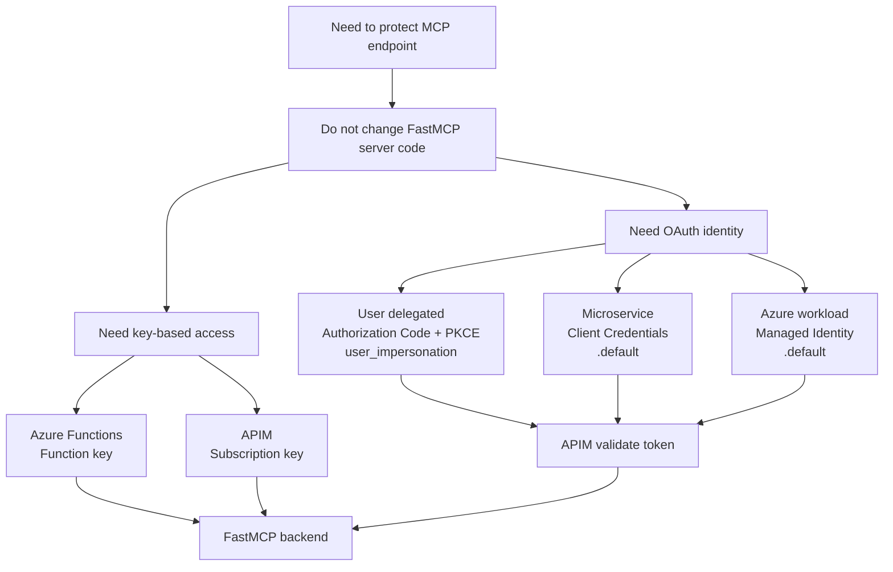

