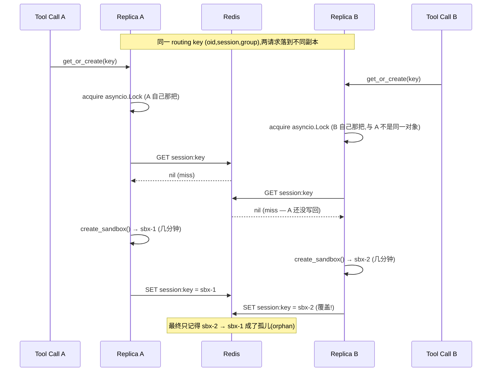
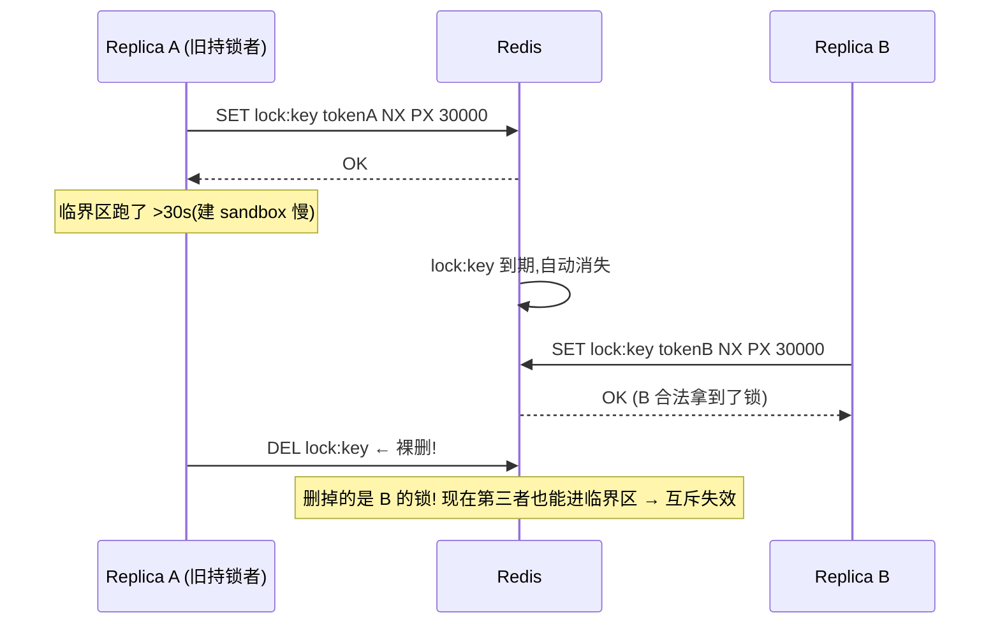
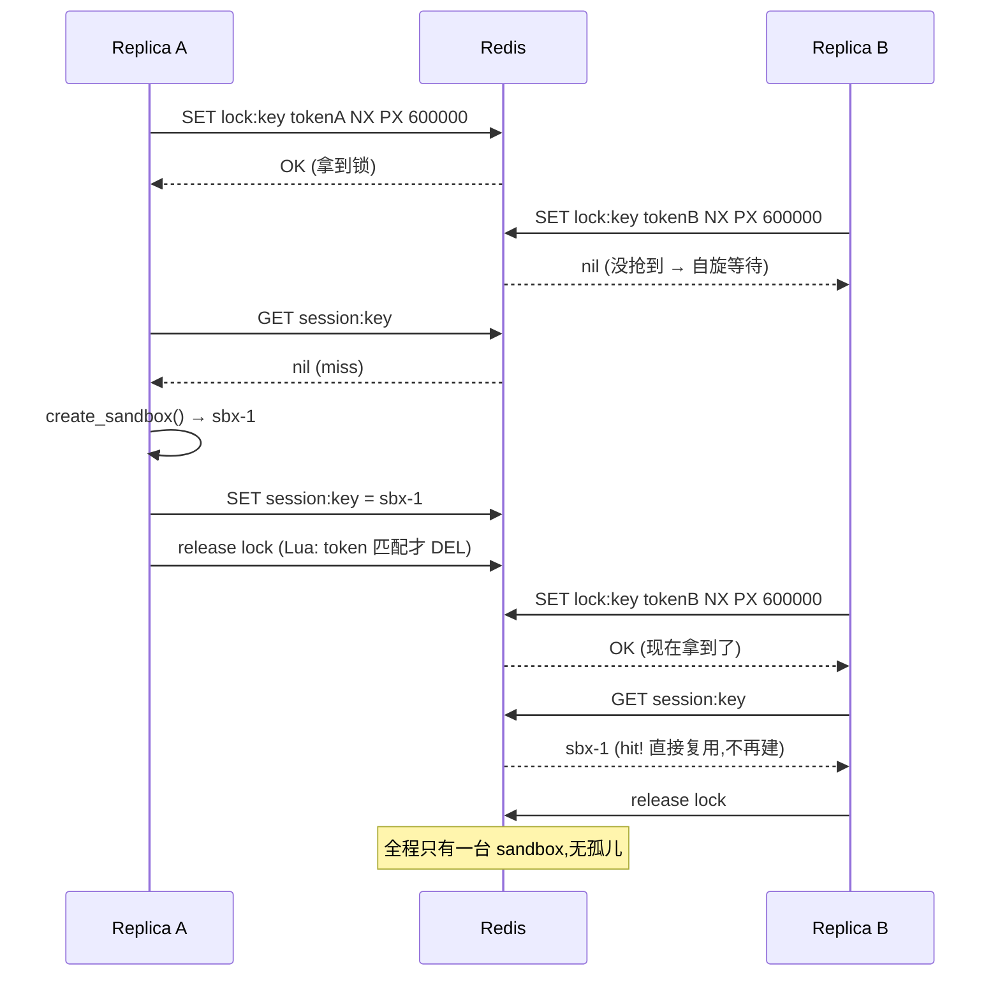
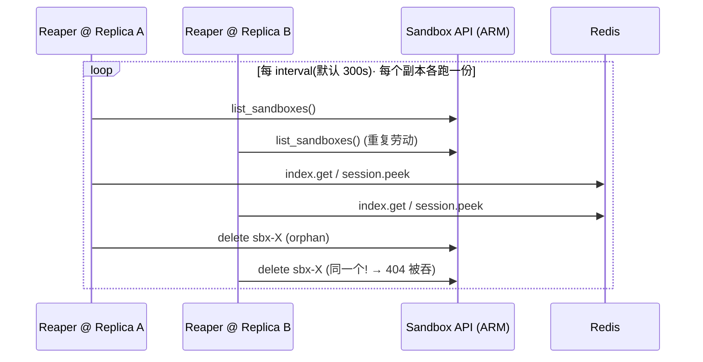
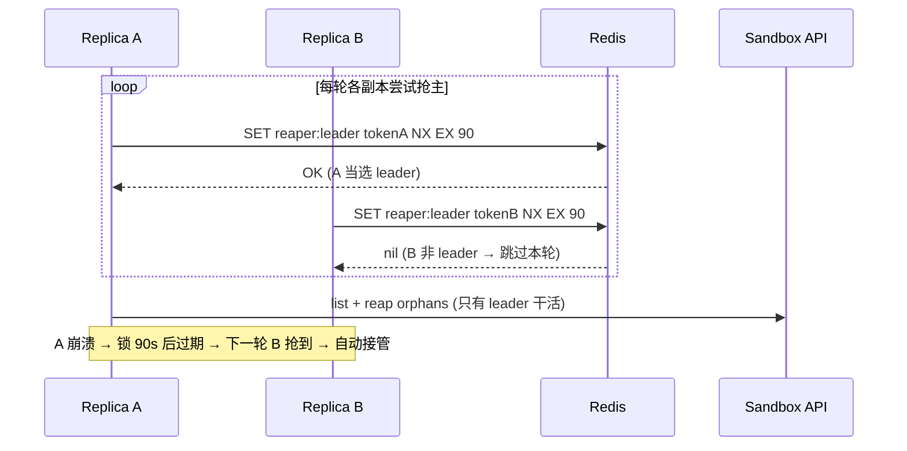

# MCP Server 水平扩展:进程内状态、分布式锁(distributed lock)与 Reaper 选主(leader election)

本文承接 commit `3465dee`(*fix(redis): dedicated redis Container App ...*)末尾那句话:

> *full horizontal scaling also needs a distributed lock on the routing key and a single reaper leader — follow-ups.*

把这句话**为什么成立、底层原理、怎么落地**讲透。读完你应该能回答:

1. 把 Redis decouple 出去,到底让这个 server "无状态(stateless)"到了什么程度?还差什么?
2. `SandboxManager` 里那把锁,**锁的到底是什么**?(剧透:不是"保护写 Redis")
3. 分布式锁(distributed lock)不是把 `asyncio.Lock` 这个对象写进 Redis ——那它是什么?`SET NX` / TTL / token / Lua 释放 / 续租(lease renewal)逐个拆开。
4. Reaper 现在怎么跑(current status),有哪些改造选项,leader election 怎么写。

涉及代码:`src/mcp-server/sandbox_manager.py`、`src/mcp-server/cache.py`、`src/mcp-server/main.py`。
前置阅读:[MCP-用户隔离与Redis设计.md](MCP-用户隔离与Redis设计.md)、[ACA-Sandbox-迁移方案.md](ACA-Sandbox-迁移方案.md)。

---

## TL;DR

- **"无状态" 的判据**:一个请求随机落到哪个副本(replica)上,结果都一样吗?
- Redis decouple 把**共享的 source of truth**(谁的 session 用哪个 sandbox)从进程内搬进了 Redis —— **这是水平扩展的必要(necessary)第一步,且已完成**。
- 但**还剩两块进程内(in-process)的协调状态**,使它还不是"完全无状态":
  1. **routing-key 锁是 `asyncio.Lock`,只在单副本内互斥** → 跨副本会重复建 sandbox(孤儿 orphan)。修法:**Redis 分布式锁**。
  2. **reaper 每副本各跑一个** → N 个 reaper 重复扫;幂等不出错,但浪费。修法:**leader election**。
- 这两件事**底层是同一把 Redis 锁原语**:`SET <key> <token> NX PX <ttl>` + Lua 释放 + 续租。
- 完整可水平扩展 = **decoupled Redis(已完成)+ routing-key distributed lock + single reaper leader**。

---

## 1. "无状态(stateless)" 到底指什么

这里的"无状态",指**进程本身不持有任何"换一个副本就丢"的关键状态**。这样才能跑 N 个副本、随便重启、负载均衡随便打。判据只有一句:

> **一个请求随机落到哪个副本上,结果都一样吗?**

Redis decouple 这一步,做的就是把**真正的共享状态(shared state / source of truth)**从进程内搬到 Redis:

| 状态 | 含义 | 现在存哪 | 谁读它 |
|---|---|---|---|
| `SessionSandboxCache` | `(oid, session, group) → sandbox_id` 路由表 | **Redis** ✅ | `get_or_create` 命中即复用 |
| `UserProfileCache` | `oid → {subscription_id, ...}`,重建 `az` 上下文 | **Redis** ✅ | `_user_subscription` / bootstrap |
| `UserSessionCache` | `oid → session_id`,30 min 滑动窗口(sliding window) | **Redis** ✅ | middleware 派生 session |
| 反向索引 `_index` | `sandbox_id → {oid,session,group}` | **Redis** ✅ | reaper 判活 |

这些是**"谁拥有哪个 sandbox" 的唯一真相来源**。放进 Redis,意味着副本 A 建的 sandbox,副本 B 也查得到、复用得了、回收得掉。

**反例对照(为什么不能用 sidecar):** 如果 Redis 跟每个副本绑在一起跑 `localhost`(sidecar 模式),每个副本就有**自己的一份路由表**,副本 B 根本不知道 A 建过什么 —— 共享状态直接破功。这正是 `3465dee` 坚持把 redis 做成**独立 Container App**(而非 sidecar)的根因:

```
sidecar:    Replica A ── localhost ── redis-A   (各看各的,状态不共享 ✗)
            Replica B ── localhost ── redis-B

dedicated:  Replica A ─┐
                       ├──→ dataops-aca-redis:6379  (共享一份 ✓)
            Replica B ─┘
```

> 顺带一个踩过的坑:in-environment app-to-app TCP 要用 app 的 **short name**(`dataops-aca-redis:6379`),不能用 `ingress.fqdn` 返回的 `.internal.<domain>` FQDN —— 后者从 peer app 连会 timeout。详见 commit `3465dee` 与 `redis.bicep`。

---

## 2. 还剩两块进程内状态(in-process state)

数据搬走了,但**协调用的两个东西还留在进程里**,它们才是"还差一口气"的地方。看 `SandboxManager.__init__`(`sandbox_manager.py:114-118`):

```python
self._group_clients: dict[Group, object] = {}   # SDK client 缓存 —— 每副本各建天经地义,无所谓
self._built_disk_ids: dict[str, str] = {}        # "这 group 的 disk image 我建过了" 备忘
self._ensured_volumes: set[str] = set()          # "这 group 的 volume 我建过了" 备忘
self._locks: dict[str, asyncio.Lock] = {}        # ★ routing-key 锁 —— 副本级!
self._reaper_task: asyncio.Task | None = None    # ★ reaper 后台 task —— 每副本一个!
```

带 ★ 的两个是问题所在,下面两大节分别拆解。`_built_disk_ids` / `_ensured_volumes` / `group_cache` 等**不是 bug**,放第 8 节定性。

---

## 3. 锁锁的是什么 —— 先纠正一个常见误解

> 误解:"这把锁是为了保证**写 Redis** 时不发生 race condition。"

**不是。** Redis 的单个 `SET` **本身就是原子的(atomic)** —— 两个客户端同时写同一个 key,不会写坏、不会撕裂,最后就是"谁后写谁赢"。**写 Redis 这一步根本不需要锁。**

锁真正保护的,是 `get_or_create`(`sandbox_manager.py:191-229`)里那一整段 **check-then-act**:

```python
async with self._lock(f"{ctx.user_oid}:{ctx.session_id}:{group}"):   # ← 临界区开始
    sandbox_id = await self._redis_safe(self._sessions.get(...))      # ① check: 有现成的吗?
    if sandbox_id is not None:
        ... ensure_running → 复用,返回 ...                            #    命中:复用
    client = await self._create_sandbox(...)                          # ② act:  真的开一台 sandbox(几分钟!)
    await self._redis_safe(self._sessions.set(..., client.sandbox_id))# ③ 写回 Redis
    ... 写 index、bootstrap(az login)...                              # ④ 还在临界区里
```

**危险的不是 ③ 那个写,而是 ① 和 ③ 之间夹着 ② 这个又贵又不可撤销的副作用 —— 真的开了一台 sandbox。**

两个并发请求都在 ① 读到 `miss`,于是都走到 ② 各开一台。就算 ③ 的写再原子,**两台 sandbox 也已经建出来了** —— 孤儿是在 ② 产生的,不是在 ③。所以锁的语义是:

> **"同一个 routing key,同一时刻只允许一个人在做 '查→建→写' 这个决策。"**
> 这是对一段**带昂贵外部副作用的临界区(critical section)**做互斥,不是对一次 Redis 写做互斥。

### 3.1 锁的粒度:per routing key,不是一把全局大锁

`_lock`(`sandbox_manager.py:183-188`)按 key 懒建并缓存锁对象:

```python
def _lock(self, key: str) -> asyncio.Lock:
    lock = self._locks.get(key)
    if lock is None:
        lock = asyncio.Lock()      # 普通 asyncio 锁,只在本事件循环互斥
        self._locks[key] = lock
    return lock
```

- **不同 routing key → 不同锁对象** → 用户 A 和用户 B 的 session **并行**建各自 sandbox,互不阻塞。✅ 这是好事。
- **同一 routing key,同一副本内 → 同一把锁** → 串行,挡住同副本内的并发。✅
- **但跨副本,即使"同一个" routing key,也是两个不同的 `asyncio.Lock` 对象** —— 因为 `self._locks` 每个副本各有一份。❌ 这就是它挡不住跨副本竞态的根因。

### 3.2 跨副本竞态:时序图

N 副本时,同一个 routing key 的两个并发请求打到不同副本:



代价:多开一台 sandbox + 多跑一遍 bootstrap(`az login`)。孤儿最后会被 reaper 或平台 1 小时 `auto_delete` 兜底,但这本不该发生。

---

## 4. 分布式锁(distributed lock):原理拆解

### 4.1 核心观念:**用一个 Redis key *模拟* "锁",不是把锁对象存进去**

最关键的认知纠偏:**`asyncio.Lock` 这个对象既不可能、也没有意义写进 Redis**。它绑在某个副本的事件循环上,序列化到另一个进程里就是一堆没用的字节。

"分布式锁"的真相是一套**约定 / 协议(convention)**:

> 想持有逻辑锁 `L`,你必须先"占住" Redis 里的 key `lock:L`。**key 存在 = 锁被占着;key 不存在(或已过期)= 锁空着。**

靠的是 Redis 一条原子命令:

```
SET lock:<routingkey>  <random-token>  NX  PX 600000
```

逐字段拆开:

| 字段 | 含义 | 为什么需要 |
|---|---|---|
| `lock:<routingkey>` | 锁的身份 = 一个 key | 锁不是对象,是"占住这个 key 的人就是持锁者"的约定 |
| `<random-token>` | value 存一个随机串(如 `uuid4`) | 标记"这把锁是我的",**释放时防误删**(见 4.3) |
| `NX` | only set if **N**ot e**X**ists | **原子的**:并发时只有一个客户端成功,其余返回 `nil` —— 互斥就靠它 |
| `PX 600000` | 600s 后自动过期(毫秒) | **防死锁(deadlock)**:持锁副本崩了/卡死,锁会自己过期,系统不至于永远卡住 |

### 4.2 获取 / 释放的完整生命周期

```python
import uuid

async def acquire(redis, lock_key, ttl_ms, *, retry_every=0.2, max_wait=30):
    token = uuid.uuid4().hex
    waited = 0
    while True:
        ok = await redis.set(f"lock:{lock_key}", token, nx=True, px=ttl_ms)
        if ok:                       # 抢到了
            return token
        if waited >= max_wait:       # 等太久,放弃(避免无限阻塞)
            raise TimeoutError("could not acquire lock")
        await asyncio.sleep(retry_every)   # 别人占着 → 自旋等待
        waited += retry_every

# 释放:见 4.3,必须用 token + Lua,不能裸 DEL
```

- 抢到锁(`SET` 返回 OK)→ 进临界区。
- 没抢到(返回 `nil`)→ 别人占着 → **自旋重试 / 等一会再试**,直到 key 消失或超时。

### 4.3 为什么释放不能裸 `DEL` —— "误删别人的锁" 时序图

如果直接 `DEL lock:key`,会出一个隐蔽的 bug:你的锁可能**已经超时过期、别人已经重新拿到了**,这时你 `DEL` 删的是**别人的锁**。



正解:value 存 token,释放时用一段 **Lua 脚本**("只有 value 等于我的 token 才删",check-and-delete 在 Redis 内**原子**完成):

```lua
-- KEYS[1] = lock:key, ARGV[1] = 我的 token
if redis.call("get", KEYS[1]) == ARGV[1] then
  return redis.call("del", KEYS[1])
else
  return 0    -- 不是我的锁,别动
end
```

### 4.4 TTL 与临界区长度的矛盾(本项目的真实痛点)

回看第 3 节那段临界区:② 建 sandbox 要**几分钟**,④ 还要跑 `az login` —— 而且 **bootstrap 也在锁里**(`get_or_create` 整段都在 `async with` 内)。如果 TTL 只给 30s,**锁会在 sandbox 还没建完时就过期**,另一个副本拿到锁又去建,孤儿回来了(正是 4.3 那张图)。

两条出路:

1. **TTL 设得足够长**(盖过最坏建 sandbox 时间,如 600s)。简单,但某副本真崩了要等满 TTL 才释放。
2. **续租 / watchdog(lease renewal)**:持锁期间起个后台协程,每隔几秒 `PEXPIRE` 续命,临界区做完再释放。锁可以设短 TTL(快速故障恢复),又不会中途过期。

```python
async def _watchdog(redis, lock_key, token, ttl_ms, interval):
    while True:
        await asyncio.sleep(interval)          # 比如 ttl 的 1/3
        # 同样要 token 校验后再续(Lua),避免给别人的锁续命
        await redis.eval(RENEW_LUA, 1, f"lock:{lock_key}", token, ttl_ms)
```

> **Redlock** 是 Redis 作者提出的、面向"多个独立 Redis 节点"的分布式锁算法(过半数节点抢到才算持锁),解决单点 Redis 挂掉时锁的安全性。我们现在单 Redis,**不需要 Redlock**;了解它是"分布式锁严谨版"即可。

### 4.5 别自己造轮子:`redis-py` 自带 `Lock`

上面的 token / Lua 释放 / 阻塞等待,`redis-py` 都封装好了,异步版直接 `async with`:

```python
def _dlock(self, key: str):
    # 取代进程内的 self._lock();timeout 是 TTL,blocking_timeout 是最多等多久
    return self._redis.lock(
        f"lock:{key}",
        timeout=600,            # 锁 TTL,要盖过建 sandbox 的最坏时间
        blocking_timeout=30,    # 抢不到时最多阻塞 30s
    )

async def get_or_create(self, ctx):
    key = f"{ctx.user_oid}:{ctx.session_id}:{ctx.group}"
    async with self._dlock(key):          # ← 跨副本互斥,替换原 self._lock(key)
        ...  # 原来那段 查—建—写,现在跨副本串行
```

> 注意:`redis-py` 的 `Lock` 默认**不自动续租**,超长临界区要么把 `timeout` 设大,要么手动 `lock.extend()`。本项目临界区数分钟,务必把 `timeout` 设够(或加 watchdog)。

### 4.6 加了分布式锁之后:时序图

对照 3.2 那张竞态图,现在 B 被挡在 Redis 锁外,等 A 写完后**查到 sbx-1 直接复用**:



### 4.7 Plan B:不锁整段,改"乐观认领(claim + poll)"

持锁数分钟很重(别的副本一直阻塞)。另一种思路:**只用一次原子写来"认领"**,把昂贵的建动作放到锁外:

1. `SET session:key "CREATING:<token>" NX` —— 原子认领。
2. **抢到的人**:去建 sandbox,建好后把值改写成真正的 `sandbox_id`。
3. **没抢到的人**:轮询(poll)这个 key,直到它从 `CREATING:*` 变成真正的 `sandbox_id`,然后复用。

优点:没有"持锁几分钟";缺点:状态机更复杂(要处理认领者中途崩了、`CREATING` 卡住要超时回收)。**先掌握 4.1–4.6 的主线**,Plan B 作为进阶选项。

| 方案 | 互斥粒度 | 复杂度 | 何时选 |
|---|---|---|---|
| 分布式锁(4.5) | 锁住整段查—建—写 | 低,有现成库 | 默认推荐,先上这个 |
| claim + poll(4.7) | 只锁一次原子认领 | 高,自己管状态机 | 建 sandbox 极慢、并发极高、不想让副本阻塞时 |

---

## 5. Reaper:current status

### 5.1 先理解反向索引(reverse index):reaper 的眼睛

reaper 的代码里反复出现 `self._index`,它就是 §1 状态表里那个**反向索引**。"反向"是相对于**主查询方向**说的——系统里有两张方向相反的 Redis 表:

```
正向(routing 用):  (oid, session, group)  ──→  sandbox_id
反向(reaper 用):    sandbox_id            ──→  (oid, session, group)
```

- **正向** = `SessionSandboxCache`(`cache.py:114`),key 是 `session:{oid}:{session}:{group}`。这是**平时干活的方向**:来一个 tool call,手里有 `(oid, session, group)`,查"该用哪个 sandbox"。
- **反向** = `_index`(`sandbox_manager.py:134`,prefix `mcp:sbxidx`),key 是 `sandbox_id`,value 是 `{oid, session, group}`。把正向那张表**反过来存了一遍**,像数据库的 secondary index——为了能**从另一头查**。

建 sandbox 时两张表同时写(`sandbox_manager.py:214-222`):

```python
client = await self._create_sandbox(...)                              # 平台 mint 全新唯一 sandbox_id
await self._sessions.set(oid, session, group, client.sandbox_id)      # 正向
await self._index.set(client.sandbox_id, {"oid":..., "session":..., "group":...})  # 反向
```

**为什么 reaper 非要它:** reaper 从 ARM `list_sandboxes()` 拿到的**只有 sandbox_id**。它要回答"这台还被活着的 session 持有吗",得去查正向表的 session key——可正向 key 是 `(oid, session, group)`,**没法用 sandbox_id 去查**。反向索引就是那座桥(`reap_orphans` `:454-460`):

```python
meta = await self._index.get(sbx.id)        # ① 反向:sbx.id → {oid,session,group}
if not meta: continue                        #    查不到 → 不是我们建的,平台 auto-delete 管
live = await self._sessions.peek(            # ② 拿 meta 回正向表查 session 还活着没
    meta["oid"], meta["session"], meta["group"])
if live == sbx.id: continue                  #    session 还在 → 留着;否则 → 孤儿 → 删
```

两个设计细节:

1. **反向索引 `ttl=None`(永不过期)**,正向 session 表则有 30min TTL。这是故意的:session 窗口一到期(session 结束),正向 key 自动消失,而**恰恰这之后** reaper 才需要靠反向索引认出"这台没人要了"。若反向索引也跟着过期,reaper 会 `meta is None` → 当成"非我所建"跳过,只能等平台 1 小时兜底。所以**反向索引必须比 session key 活得久**,改由删除时显式清理(`end_session` `:424`、reap 成功后 `:467`)。
2. **它兼任 "managed 标记"**:有反向记录 = "这台是我们建的,归我管";没记录 = 别人/平台的,reaper 不碰。

**绑定是 1:1,且是 security 不变量:** 一个 sandbox_id 自始至终只对应**唯一**一个 `(oid, session, group)`。守住它的不是"用完即毁"(sandbox 在一个 session 内是跨多次 tool call **复用**的,不是每次销毁),而是两条不变量——**create-binds-unique**(每次建都 mint 全新唯一 id,只绑给当时的 routing key)+ **never-rebind**(没有任何路径把已存在的 sandbox_id 写到第二个 routing key 下,复用走"读老 id 直接用"不重写绑定)。这条 1:1 也是用户隔离的底线:绑定一旦串了就是跨用户串号/数据泄露。

> 注意方向:**"一个 sandbox → 多个 key" 不会发生**;但它的对偶 **"一个 key → 多个 sandbox" 会**——正是 §3.2 那个跨副本 create 竞态(一个 routing key 被并发建出 sbx-1、sbx-2,正向表后写者赢,另一台成孤儿)。这也是 distributed lock 要消灭的东西。

### 5.2 代码走读

```python
async def exec(self, ctx, command):       # :393
    self._ensure_reaper()                  # ← 每次 tool 调用都来一下
    ...

def _ensure_reaper(self):                  # :427
    if self._reaper_task is None or self._reaper_task.done():
        self._reaper_task = asyncio.create_task(self._reaper_loop())  # 进程内后台 task

async def _reaper_loop(self):              # :432
    while True:
        await asyncio.sleep(self._reaper_interval)   # 默认 300s
        try:
            await self.reap_orphans()
        except Exception:                  # 吞异常,循环永不死
            ...

async def reap_orphans(self):              # :440
    for group in ("diagnose", "action"):
        async for sbx in gclient.list_sandboxes():     # 列出该 group 全部 sandbox
            meta = await self._index.get(sbx.id)       # 查反向索引(Redis)
            if not meta:        continue               # 不是我们建的 → 平台 auto-delete 管
            live = await self._sessions.peek(...)      # 非滑动地读 session key(不刷新窗口)
            if live == sbx.id:  continue               # 还被活 session 持有 → 留着
            await gclient.begin_delete_sandbox(sbx.id) # 否则:session 没了 → 删
            await self._index.delete(sbx.id)
```

reaper 的意义:**session 一结束就尽快删,不用等平台那 1 小时 `auto_delete` 兜底。**注意 `peek` 用的是**非滑动读**(`cache.py:140`),不会因为 reaper 来看一眼就把 session 窗口续上。

### 5.3 现状定性

| 维度 | 状态 |
|---|---|
| 启动方式 | 懒启动,**每个副本各起一个** `create_task` 后台 task |
| 副本数 N | **N 个 reaper 在重复扫同一批 sandbox** |
| 正确性 | ✅ 基本 OK。两个 reaper 抢删同一个 → 一个成功,另一个收 `ResourceNotFoundError` 被 `:465` 吞掉,不出错 |
| 代价 | ❌ 浪费:N 倍的 `list_sandboxes` + 删除调用;N 大了有 ARM API 限流(throttling)风险 |
| 兜底 | reaper 全挂也不致命:平台层 `auto_suspend`(默认 300s 挂起)+ `auto_delete`(默认 3600s 删除,见 `_apply_idle_autodelete` `:342`)仍会自我回收 |

### 5.4 N 个 reaper 并行扫:时序图



---

## 6. Reaper 改造选项

| 选项 | 做法 | 取舍 |
|---|---|---|
| **1. 不动(现状)** | N 个幂等 reaper | 最简单、正确。N 小够用。代价是 N× 重复扫 + 限流风险 |
| **2. Redis 租约选主(推荐)** | 一个副本靠 `SET reaper:leader <token> NX EX 60` 抢领导权并续租;只有 leader 跑 `reap_orphans`,其余跳过。leader 崩 → 锁过期 → 别人自动接管 | **正解**,~20 行,**复用第 4 节同一把 Redis 锁原语**。web 层仍 N 副本,但 reaper 实际只有一个干活 |
| **3. 错峰 / 加抖动(jitter)** | 仍 N 个 reaper,interval 加随机偏移,别同时打 API | 便宜,缓解 thundering herd,但还是 N× 的活。半吊子 |
| **4. 拆成独立单例** | 把 reaper 移出 web 进程:单独一个 `min=max=1` 副本的 Container App,或一个 ACA Job / 定时触发器专跑回收 | 架构最干净 —— **web 层变成真·无状态,reaper 天然单例**。代价是多一份基础设施 |
| **5. 只靠平台 auto-delete** | 删掉自定义 reaper,全靠 `auto_delete`(1h)+ `auto_suspend` | 最省事,但丢掉"session 一结束就回收"的快速性,空闲 sandbox 最多白付 1 小时 |

**建议:** 现在 N 小,**选项 1 先扛着**;要做"正确版水平扩展" → **选项 2**(和 routing-key 锁同一套机制);想让 web 层彻底无脑无状态,再升级 **选项 4**。

### 6.1 Leader election 怎么写

和分布式锁是同一个原语,只是这把锁**意味着"我是这一轮的 reaper leader"**,且**持续续租以维持领导权**:

```python
async def _reaper_loop(self):
    while True:
        await asyncio.sleep(self._reaper_interval)
        # 抢这一轮的 leader;EX 给的 TTL 要 > 一轮 reap 的最坏耗时
        token = uuid.uuid4().hex
        got = await self._redis.set("reaper:leader", token, nx=True, ex=90)
        if not got:
            continue                  # 不是 leader → 本轮跳过
        try:
            await self.reap_orphans() # 只有 leader 干活
        finally:
            # 用 token 校验后释放(Lua),或留给它自然过期让下一轮重新选
            await self._redis.eval(RELEASE_LUA, 1, "reaper:leader", token)
```



---

## 7. 统一视角:一把锁原语,解决两件事

commit message 里 *"distributed lock on the routing key"* 和 *"single reaper leader"* 看着是两件事,**底层是同一个 Redis 锁原语**(`SET <key> <token> NX PX/EX <ttl>` + Lua 释放 + 续租),只是 key 和语义不同:

| 用途 | 锁的 key | 锁的语义 | 解决的问题 |
|---|---|---|---|
| routing-key lock | `lock:{oid}:{session}:{group}` | "我在为这个 session 建/复用 sandbox" | 防止跨副本重复建 sandbox(孤儿) |
| reaper leader | `reaper:leader` | "这一轮由我来回收" | 防止 N 个 reaper 重复扫 |

落地这一个原语(建议直接用 `redis-py` 的 `Lock`),两个 follow-up 就都齐了。

---

## 8. 附:其他进程内状态(定性,不是 bug)

`SandboxManager` / `main.py` 里还有几块进程内的 dict/set,跨副本时**安全,只是首次有点冗余或命中率偏低**,不影响正确性:

| 状态 | 位置 | 跨副本表现 | 为什么安全 |
|---|---|---|---|
| `_group_clients` | `sandbox_manager.py:114` | 每副本各建一份 SDK client | 本就该 per-process,无共享需求 |
| `_built_disk_ids` | `:115` | 首次各自查一遍 disk image | `_ensure_disk_image` 先 `list_disk_images` **复用现成 Ready 镜像**(`:327`),不会重复 build |
| `_ensured_volumes` | `:116` | 首次各自尝试建 volume | `_ensure_volume` 把 `409 GlobalVolumeAlreadyExists` **吞掉**(`:303`),幂等 |
| `group_cache` | `main.py:85` `InMemoryBackend` | **组成员缓存仍进程内**,每副本各缓存一份 | 不是正确性 bug,但:被踢出组的用户在每个副本上**各自最多多撑 `GROUP_CACHE_TTL`(300s)**,命中率也偏低。注释自己写了 "swap InMemoryBackend for a RedisBackend to share across pods" —— **是个值得跟进的点** |

> 小结:`_built_disk_ids` / `_ensured_volumes` 已被 `3465dee` 做成幂等,放心;`group_cache` 想更严格可搬 Redis(用 `RedisBackend` 替 `InMemoryBackend` 即可,接口一致)。

---

## 9. Follow-up checklist

- [ ] **routing-key distributed lock**:`get_or_create` 把 `self._lock(key)` 换成 Redis 锁(`redis-py` `Lock`,`timeout` 盖过建 sandbox 最坏时间;必要时加 watchdog 续租)。参 §4.5。
- [ ] **reaper leader election**:`_reaper_loop` 每轮先抢 `reaper:leader`(`SET NX EX`),非 leader 跳过。参 §6.1。
- [ ] (可选)**group_cache 上 Redis**:`InMemoryBackend` → `RedisBackend`,跨副本共享组成员缓存。参 §8。
- [ ] (可选)**reaper 物理隔离**:升级到独立 `min=max=1` Container App / ACA Job,让 web 层彻底无状态。参 §6 选项 4。
- [ ] 压测验证:N≥2 副本下,同一 session 高并发首调**只产生一台 sandbox**;reaper **每轮只有一个副本**真正执行删除。

---

*关联文档:* [MCP-用户隔离与Redis设计.md](MCP-用户隔离与Redis设计.md) · [ACA-Sandbox-迁移方案.md](ACA-Sandbox-迁移方案.md) · [MCP-鉴权-缓存与凭据演进.md](MCP-鉴权-缓存与凭据演进.md)
