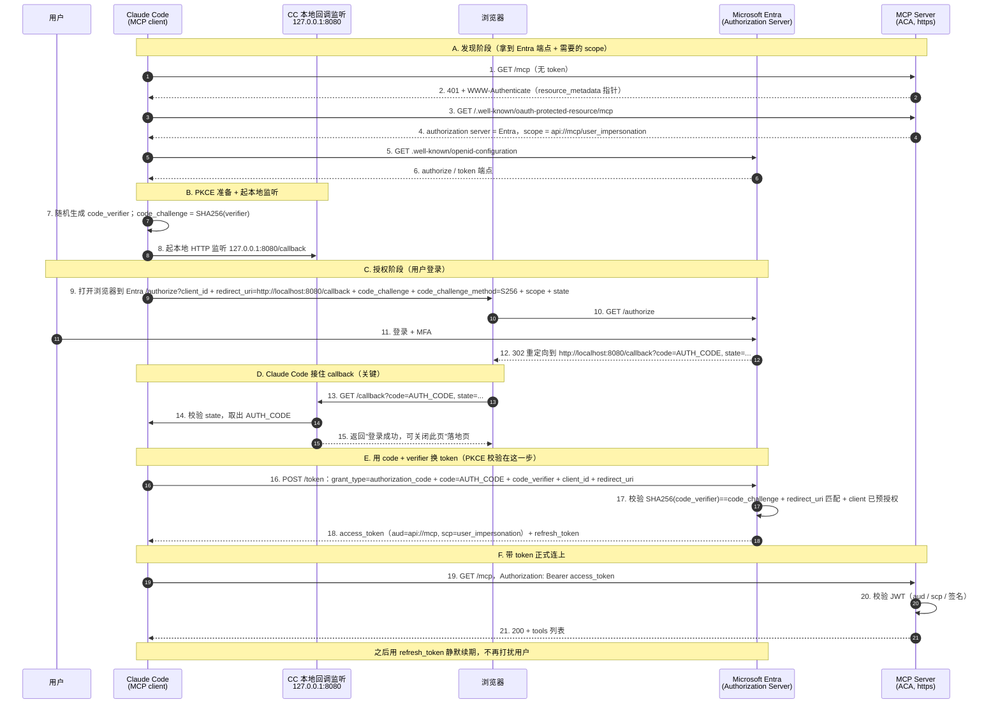

# 为 Entra 保护的 MCP 接入自定义 Client

> 本文回答三个连续的问题：
> 1. 现在只有 VS Code 能自动连这个 MCP server，如果我想用**别的 client（比如 Claude Code）**，该怎么做？能不能给它一个 client id/secret 塞进配置就自动 OAuth？
> 2. 为什么 Claude Code **不需要 client secret**？只拿 client id、不拿 secret，怎么证明"我是我"？
> 3. **opencode / GitHub Copilot CLI / Codex** 这些 agent 客户端，是不是也有一样的支持？
> 4. 能不能在客户端配置层，**强制 MCP server 里某个 tool 永远走人工审批、不能 bypass**？
>    （本项目场景：`diagnose_bash` 可自动放行，但 `action_bash` 无论如何都要人 review——见第 7 节）
>
> 相关背景见 [`DataOps-MCP-登录与同意流程.md`](./DataOps-MCP-登录与同意流程.md)（登录/同意三道闸）与
> [`Entra OAuth Proxy vs Pre-registration MCP.md`](./Entra%20OAuth%20Proxy%20vs%20Pre-registration%20MCP.md)（DCR proxy vs pre-registration 两种模式）。

---

## 一句话总结

- **能换 client**，但不是"随便编一个 id/secret 塞进配置"就行——**Entra 不支持 DCR**，所以真实 client 必须**事先在 Entra 里注册/预授权**（这就是 pre-registration 模式）。做法和 VS Code 完全同构：注册一个 client app registration → 在 MCP server app 上 pre-authorize → 把 `client_id` 填进客户端配置。
- **不需要 secret**：Claude Code / VS Code 是**桌面/CLI 型 public client**，secret 对装在用户机器上的程序保不住密，等于没有。"证明你是你"靠的是**浏览器里那次 Entra 登录（含 MFA）**，"防授权码被偷"靠的是 **PKCE**，不是 secret。
- **各客户端支持差异很大**（截至 2026-07）：

  | Client | 静态 client_id 支持 | 能否连 Entra 保护的 MCP |
  |---|---|---|
  | **Claude Code** | ✅ 一等公民 | ✅ 现在就能 |
  | **opencode** | ✅ 支持（DCR 只是兜底） | ✅ 现在就能 |
  | **GitHub Copilot CLI** | ⚠️ 有字段但 bug 未修 | ❌ 目前不行 |
  | **Codex CLI** | ❌ 无静态 client_id | ❌ 目前不行 |

---

## 0. 背景：现在为什么"只有 VS Code 自动能连"

本 MCP server 走的是 **pre-registration / pre-authorized client** 模式（不是 OAuth Proxy 模式）：Entra 直接作为 authorization server，直接给 client 签发访问 MCP server 的 access token。

VS Code 能"零配置"跑通，是两件事叠加：

1. **VS Code 本身是 Entra 已知的 first-party public client**，client id 是公开固定的 `aebc6443-996d-45c2-90f0-388ff96faa56`。
2. 我们在 `provisioning/aca/modules/identity.bicep` 里，把这个 id 写进了 MCP server app 的 `preAuthorizedApplications`（对应登录流程里的**闸②**，免掉 consent 弹窗）。

关键矛盾（这也是后面一切的根因）：

> **Microsoft Entra 不按 MCP 需要的方式支持 Dynamic Client Registration (DCR)。**

所以 client **不能临时向 Entra 动态注册**，只能用 Entra **已经认识**的 client id。VS Code 的 id 是 Microsoft 内置的；换成别的 client，就得**你自己去 Entra 注册一个**。

---

## 1. 换 client（比如 Claude Code）：结论 + 两个纠正

**结论：能，而且这正是 pre-registration 模式的设计意图**——Claude Code 只是"又一个你自己注册/预授权的已知 client"，和 VS Code 地位完全一样。而且 Claude Code 官方就支持"auth server 不支持 DCR、需要预配置凭据"这个场景。

原始设想里有两个要纠正的点：

1. **client_id 不能瞎编**——必须是你在 Entra 里**新建的那个 client app registration 的 appId**。Entra 没有 DCR，认不出没注册过的 client。
2. **secret 不放进配置文件，而且大概率根本不需要 secret**。桌面/CLI 型 public client 走 Authorization Code + **PKCE**，不需要 client secret（原理见第 3 节）。就算用 confidential client，secret 也是通过独立的 `--client-secret` 传、存进系统钥匙串，**不会写进 config 文件**。

---

## 2. 具体做法：三步接入 Claude Code

### 2.0 全景：OAuth 时序图 + redirect URI 解析

先看整条链路——Claude Code 这类**本地 client** 是怎么和 MCP server 完成 OAuth 的。重点看
**②发现 401 → ⑫Entra 的 302 重定向 → ⑬–⑮Claude Code 本地接住 callback → ⑯用 code+verifier 换
token**：



#### Claude Code 是怎么 handle callback 的（步骤 8、13–15、16）

这是最容易好奇的一段——一个**本地 CLI 程序**怎么"接住"浏览器里的登录结果：

1. **OAuth 开始前先起监听**（步骤 8）：Claude Code 在本机起一个**临时 HTTP 服务**，监听
   `127.0.0.1:<callbackPort>`（默认随机端口，用 `--callback-port` 可钉死成 8080）。这个监听只为接
   一次 callback，用完即关。
2. **同时算好 PKCE**（步骤 7）：本地随机生成 `code_verifier`（只存在内存，从不发出去），算出
   `code_challenge = SHA256(code_verifier)`，只把 `code_challenge` 放进 `/authorize` 请求。
3. **Entra 用 302 把 code 送回本地**（步骤 12–13）：用户在浏览器里登录成功后，Entra 返回一个
   **302 重定向**，让浏览器跳到 `http://localhost:8080/callback?code=AUTH_CODE&state=...`。浏览器一跳，
   authorization code 就作为 URL query 落到 Claude Code 那个本地监听上。
4. **取出 code、核对 state、回落地页**（步骤 14–15）：Claude Code 从回调 URL 里读出 `code`，核对
   `state`（防 CSRF），然后给浏览器回一个"登录成功，可关闭此页"的页面——你平时看到的就是它。
5. **拿 code + verifier 换 token**（步骤 16–18）：Claude Code 带着 `code` 和**之前只存在内存的**
   `code_verifier` 去 Entra `/token`。Entra 校验 `SHA256(code_verifier) == code_challenge`、
   `redirect_uri` 是否匹配、client 是否已预授权——全对才发 **access token**（+ refresh token）。
   PKCE 就是在这一步把"code 兑换"死死绑定到"当初发起流程的那个 Claude Code 进程"上：别的程序就算
   偷到 `code`，没有 `code_verifier` 也换不出 token。
6. 之后 Claude Code 才带 `Authorization: Bearer <access_token>` 正式连 `/mcp`（步骤 19），token 进
   系统钥匙串，靠 refresh token 静默续期。

#### redirect URI 是什么？为什么是 localhost？MCP server 在 ACA 上还成立吗？

这是个很好的疑问，一次说清：

- **redirect URI（reply URL）= authorization server（Entra）在用户登录后，把 authorization code
  送回给谁。** 它是 **client 的属性，和 MCP server / resource server 无关**。
- **谁接收这个 redirect？是发起 OAuth 的那个 client。** Claude Code 是**跑在你本机**的桌面/CLI 程序，
  它接 code 的方式就是在本机起一个 loopback 监听——所以 redirect URI 是
  `http://localhost:PORT/callback`。这正是 native app 的标准做法（**RFC 8252, OAuth for Native Apps**）。
- **这和 MCP server 部署在哪里完全无关。** 看时序图 C→D 段：整个 redirect 发生在**你本机的浏览器 →
  你本机的 Claude Code 监听**之间（Entra → 浏览器 → localhost），**全程不经过 ACA 上的 MCP server**。
  MCP server 只在最后一步（步骤 19）被 Claude Code 用 Bearer token 访问，它**从不参与 redirect**。
- **所以：localhost 完全正确，而且正应该用 localhost。** 哪怕 MCP server 部署在 ACA、在天边，只要
  Claude Code 跑在你本机，redirect 就该回本机的 loopback。你**不会**、也**不应该**把 redirect URI 填成
  MCP server 的 ACA 地址——那不是接 code 的地方。
- **什么时候 redirect URI 才是公网地址？** 当 client 本身是**服务器端 web app**（confidential client），
  登录后 Entra 要把 code 送到那个 web app 的公网回调。但 Claude Code 不是 web app，是本地程序，所以用
  loopback。
- **redirect URI 在 OAuth 里的作用（为什么必须预注册）：** 它是 Entra 交付 authorization code 的目的地。
  **Entra 只会把 code 送到 app registration 里预先登记过的 redirect URI**，没登记的地址一律拒绝。这是
  防止攻击者把 code 重定向到自己控制的地址（code 劫持）的关键控制；配合 PKCE，构成双保险。这也是第 2.1
  步为什么要在 Entra 里登记 `http://localhost:8080/callback` 并用 `--callback-port 8080` 对齐的原因。

> **只有一个 port，别被"两处 8080"绕晕。** 步骤 8 的本地监听端口，和步骤 9 / Entra 里注册的 redirect
> URI 端口，是**同一个端口**——`--callback-port 8080` 一次同时设定这两处。如果这个端口在本机被占用，
> 本地监听绑不上、callback 就收不回来。端口冲突怎么兜底（钉死冷门端口 vs 靠 Entra 的 localhost 端口无关
> 匹配、用随机端口），见 [`计划-预注册-ClaudeCode-或-opencode-项目级接入.md`](./计划-预注册-ClaudeCode-或-opencode-项目级接入.md) §3。

### 2.1 Entra：给 Claude Code 建一个 client app registration

- 新建 App Registration，例如 `DataOps MCP – Claude Code Client`
- Platform 选 **Mobile and desktop applications**（public client），Redirect URI 填 `http://localhost:8080/callback`（端口自选，第 2.3 步要对上）
- 打开 **Allow public client flows**（`allowPublicClient = true`），**不建 client secret**
- API permissions → My APIs → 本 MCP server → 勾选 delegated 的 `user_impersonation`

> Redirect URI 端口说明：Claude Code 支持用 `--callback-port` 钉死端口，所以直接注册
> `http://localhost:8080/callback` 最稳。若某个客户端**不支持固定端口**（用随机端口），
> 则把 redirect URI 注册成 `http://localhost`（loopback）——Entra 对 public client 的
> loopback 地址会**忽略端口**匹配，随机端口也能对上。
> （redirect URI 到底是什么、为什么必须是 localhost、MCP server 在 ACA 上为何不影响它，见 [§2.0](#20-全景oauth-时序图--redirect-uri-解析)。）

### 2.2 Entra：在 MCP server app 上 pre-authorize 它（对应"闸②"）

在 `provisioning/aca/modules/identity.bicep` 里，把新 client 的 appId 也加进
`preAuthorizedApplications`，和 VS Code 并列一条：

```bicep
@description('Client ID of VS Code (well-known). Override for a different MCP client.')
param vscodeClientId string = 'aebc6443-996d-45c2-90f0-388ff96faa56'

// 新增：自注册的 Claude Code client app 的 appId（默认空 = 不预授权）
@description('Client ID of the self-registered Claude Code client app.')
param claudeCodeClientId string = ''

// ... mcpServerApp.api 里：
    preAuthorizedApplications: [
      {
        appId: vscodeClientId
        delegatedPermissionIds: [ userImpersonationScopeId ]
      }
      // 仅当传入了 claudeCodeClientId 时才加这条
      ...(empty(claudeCodeClientId) ? [] : [
        {
          appId: claudeCodeClientId
          delegatedPermissionIds: [ userImpersonationScopeId ]
        }
      ])
    ]
```

然后在 `provisioning/aca/main.bicep` 的 `module identity` 里把它传进去：

```bicep
module identity 'modules/identity.bicep' = {
  name: 'identity'
  scope: rg
  params: {
    name: name
    claudeCodeClientId: claudeCodeClientId   // 从顶层 param 透传
  }
}
```

> 加了 pre-authorize，Claude Code 首次连接**没有 consent 弹窗**，体验和 VS Code 一致。
> 不加也能跑，只是用户第一次会多点一次"同意"——前提是租户允许用户自助同意这个低权限
> 自定义 scope；如果租户禁了 user consent，就**必须** pre-authorize 或走管理员 consent。

### 2.3 Claude Code：用 client id + 固定 callback 端口加 server

命令行方式：

```bash
claude mcp add --transport http \
  --client-id <第2.1步拿到的-appId> \
  --callback-port 8080 \
  dataops-mcp https://<你的-MCP-server-URL>/mcp
```

`--callback-port 8080` 必须和第 2.1 步 Entra 里注册的 redirect URI 端口一致。

等价的 `.mcp.json` 写法（注意 `oauth` 对象里放 `clientId`，**没有 secret**）：

```json
{
  "mcpServers": {
    "dataops-mcp": {
      "type": "http",
      "url": "https://<你的-MCP-server-URL>/mcp",
      "oauth": { "clientId": "<第2.1步的-appId>", "callbackPort": 8080 }
    }
  }
}
```

然后在 Claude Code 里执行 `/mcp` → Authenticate → 浏览器跳 Entra 登录一次 → 完成。
token 自动缓存 + refresh，之后不再弹。（若是 confidential client 才需要 `--client-secret`，
secret 存进系统钥匙串，不进 config 文件。）

### 2.4 不用动的部分：OBO（"闸③"）

`grant_obo_admin_consent` 是 `AllPrincipals` 的 tenant-wide admin consent，作用在
**MCP server SP → Graph** 上，**与用哪个 client 无关**。换成任何 client，OBO 照样静默成功，
无需改动。

---

## 3. 为什么 public client 不需要 client secret

这是全篇最容易绕晕的一点。核心：**`client_secret` 认证的不是"你（用户）"，而是"client 这个应用程序"**。原始问题"不拿 secret 怎么证明我是我"其实把两个身份合成了一个。

### 3.1 两个不同的身份

| 要证明的身份 | 靠什么证明 |
|---|---|
| **你是你**（user identity） | **在浏览器里登录 Entra**（账号密码 + MFA） |
| **这个 app 是它自称的那个 app**（client identity） | confidential client 用 secret；public client 不用 |

"认证我是我"从来不靠 secret，而靠那次**交互式 Entra 登录**。secret 只解决"发请求的这个程序是不是真的那个 client"，跟你本人是谁无关。

### 3.2 confidential client vs public client

secret 有没有意义，取决于它**能不能真的保密**：

- **Confidential client**（跑在服务器后端）：secret 只存在后端，用户碰不到 → secret 有意义。
- **Public client**（桌面 app、CLI、手机 app、SPA）：程序**装在每个用户机器上**。把 secret 打包进 Claude Code 发给所有人 = 对所有人可见 = 一秒被扒出来 = **等于没有 secret**。

所以 OAuth 明确规定 public client **不应依赖 secret**——对分发到用户手里的程序，secret 只给**虚假的安全感**。VS Code 的 client id 干脆公开硬编码在源码里，因为 **client id 本来就不是机密**，只是个名字。

### 3.3 PKCE 顶替 secret 的作用

> **先说什么是 PKCE。** PKCE = **Proof Key for Code Exchange**（RFC 7636，读作 "pixy"），是 OAuth
> 授权码流程的一个**扩展**，专门防"authorization code 被中途截走盗用"。
>
> 注意方向：**PKCE 不是 code_challenge 的一部分；恰恰相反，code_challenge 是 PKCE 的组成部分。**
> PKCE 由三样东西构成：
> - `code_verifier`：客户端**每次流程随机生成的一次性秘密**，只留在本地内存，从不发出去；
> - `code_challenge`：`code_verifier` 的哈希（`SHA256`），**只有它**被发给 authorization server（Entra）；
> - `code_challenge_method`：哈希算法标识，通常是 `S256`。
>
> 直觉：`code_verifier` 是"钥匙"，`code_challenge` 是先交给 Entra 的"锁"。`/authorize` 时先亮出锁，
> `/token` 换 token 时必须拿出钥匙，Entra 验 `SHA256(钥匙) == 锁` 才放行。

secret 在授权码流程里的原始作用，是"换 token 时证明是我在换"。public client 用 **PKCE** 替代——就是上面
这套"锁 + 钥匙"：

```text
1. Claude Code 本地随机生成 code_verifier（只在内存，从不发出）
2. /authorize 时只发它的哈希 code_challenge = SHA256(code_verifier)
3. 用户登录成功，Entra 把 authorization code 发回 http://localhost:8080/callback
4. 换 token 时，Claude Code 必须附上原始 code_verifier
5. Entra 校验 SHA256(code_verifier) == code_challenge，对上才发 token
```

效果：就算别的程序在同机抢到了 authorization code（比如恶意 app 也监听 localhost），
它**没有 code_verifier，换不出 token**；而 code_verifier 从头到尾没离开过 Claude Code 进程。
这就把"secret 保护 code 兑换"换成"每次流程动态生成、绝不外传的一次性凭据"，且**无需预先分发**，天然不存在被扒出来的问题。

再叠加 **redirect URI 必须预注册** + loopback 只在本机，code 只会回到发起流程的那个本机 app。

### 3.4 小结

> **你本人的身份 = 浏览器里那次 Entra 登录（含 MFA）；**
> **client 的身份 = client_id（公开的名字）+ PKCE（一次性动态凭据）+ 预注册 redirect URI。**

拿到的 access token 里带 `oid`（是你）、`aud`（你的 MCP server）、`azp`（哪个 client）。
MCP server 只校验 `aud` + `scp` + 签名——**根本不关心 client 当初有没有用 secret**。

---

## 4. 各 Agent 客户端对 Entra 场景的支持对比

判断标准只有一条：**该 client 能不能吃一个"静态/预注册的 client_id"**——这是 Entra（无 DCR）能否跑通的命门。

| Client | 静态 client_id 支持 | Entra（无 DCR）能否跑通 | 配置字段 |
|---|---|---|---|
| **Claude Code** | ✅ 一等公民 | ✅ 就是为这场景做的 | `--client-id` / `--callback-port`；`oauth.clientId`、`oauth.callbackPort` |
| **opencode** | ✅ 支持 | ✅ 填 `clientId` 即可，DCR 只是兜底 | `oauth: { clientId, scope }`（`clientSecret` 可选，public client 不填） |
| **Copilot CLI** | ⚠️ 字段有，但 **bug 未修** | ❌ 目前不能 | `oauth: { clientId, callbackPort }`（被忽略） |
| **Codex CLI** | ❌ 根本没有 | ❌ 不能（只走 DCR） | 只有 `bearer_token_env_var` / `http_headers` / `oauth_resource` |

### 4.1 Claude Code — ✅ 直接支持

`--client-id` + `--callback-port` 就是官方给"auth server 不支持 DCR"准备的路径（文档原文：
*"Some MCP servers don't support automatic OAuth setup via Dynamic Client Registration… the server
requires pre-configured credentials"*）。用法见第 2 节。Entra 首选。

### 4.2 opencode — ✅ 支持，用法几乎一样

远程 server 配置里有 `oauth` 对象，可直接填预注册凭据：

```json
{
  "mcp": {
    "dataops-mcp": {
      "type": "remote",
      "url": "https://<你的-MCP-URL>/mcp",
      "oauth": { "clientId": "<Entra里注册的-appId>", "scope": "api://<mcp-app-id>/user_impersonation" }
    }
  }
}
```

文档原文：*"If not provided, dynamic client registration will be attempted"*——即**先用你给的
clientId，给不了才退回 DCR**。所以 Entra 场景填上 `clientId` 就能跑。

**关于 secret：opencode 和 Claude Code 等价——都是 public client + PKCE，不需要 client secret。**
opencode 的 `oauth` 里 `clientSecret` 是**可选**字段（官方 options 表里没标 Required），public client
**只填 `clientId`（+ `scope`）、把 `clientSecret` 留空**即可。它的 DCR 兜底路径本身就是 public + PKCE
流程，静态 `clientId` 复用同一套。（唯一区别：opencode 文档没像 Claude Code 那样把"静态 clientId + PKCE、
无 secret"写得那么显式，但字段和流程都支持——所以上一版把 `clientSecret` 列进"配置字段"是误导，已改。）

⚠️ 细节：opencode 文档没暴露"固定 callback 端口"字段。若它用随机端口，就在 Entra 里把
redirect URI 注册成 `http://localhost`（loopback，Entra 忽略端口匹配）。

### 4.3 GitHub Copilot CLI — ⚠️ 有字段，但目前是坏的

`~/.copilot/mcp-config.json` **设计上**支持 `oauth.clientId` + `oauth.callbackPort`，但有个
**已确认、截至 2026-07 仍 open 的 bug（[copilot-cli#2717](https://github.com/github/copilot-cli/issues/2717)）**：
CLI **忽略你配的 `clientId`，强行走 DCR**，自己动态注册一个 id。对 Entra 是致命的——DCR 注册出来的
那个 id 你没在 app registration 里授权、没 admin consent，登录直接失败。

> 注意区分：GitHub 在 **JetBrains / Eclipse / Xcode 的 Copilot 插件**已支持"DCR 失败就回退静态
> client id/secret"，但那是 IDE 插件，不是 CLI；**CLI 这条链目前是断的**。

### 4.4 Codex CLI — ❌ 无静态 client_id（见第 5 节详解）

Codex `config.toml` 里 OAuth 相关只有 `scopes`、`oauth_resource`（RFC 8707 resource 参数）、
`mcp_oauth_callback_port/url`，**没有任何 `client_id` / `client_secret` 字段**。`codex mcp login`
走纯 DCR，无法用 pre-registration 方式连 Entra。

---

## 5. Codex 深入：为什么支持最差 + workaround

Codex CLI（和 Codex App）的 MCP OAuth 登录**只会走 DCR**，且**没有"每个 server 配静态
client_id"的字段**。这是 openai/codex 仓库里多个 **open** issue 直接坐实的：

- **[#15818](https://github.com/openai/codex/issues/15818)** —— 环境就是 **Microsoft Entra
  OAuth 2.0**，报错 `Dynamic client registration not supported`。**Open，官方未修**。
- **[#19154](https://github.com/openai/codex/issues/19154)** —— 报告者原话：*"I could not find a
  documented way to provide a per-server static OAuth client id"*，明确 Codex 只支持 DCR、无法用
  pre-registered client。**Open**。
- 同类还有 Okta / Kaggle（[#23627](https://github.com/openai/codex/issues/23627)）/
  Meta Ads（[#24103](https://github.com/openai/codex/issues/24103)）——全是"auth server 不给 DCR，
  Codex 就跪"的同一根因。

也就是说，**给 Codex 一个 client_id 让它自动 OAuth——现在做不到**，它根本不读 client_id，
只会自己去 DCR，而 Entra 没有 DCR 端点。

### 唯一 workaround：手动塞 bearer token（很脆）

Codex 支持 `bearer_token_env_var` / `http_headers`，理论上可绕过 OAuth 直接带 token：

```toml
[mcp_servers.dataops-mcp]
url = "https://<你的-MCP-URL>/mcp"
bearer_token_env_var = "MCP_TOKEN"
```

你在外面自己弄一个 Entra token 导进 `MCP_TOKEN`（如 `az account get-access-token --resource
api://<mcp-app-id>`，前提是 az CLI 那个 client 也在你 API 上被授权/同意过）。

但看 **#15818 的实测**：塞了手动 bearer token 后，失败从 **401 变成 403**——token 进去了但被
server 拒（audience/scope 对不上）。加上 token 约 1 小时过期、**无自动刷新**，所以这条路：

- 只适合"临时验证 server 通不通"，**不是日常可用方案**；
- 想真跑通，得保证 token 的 `aud = api://<mcp-app-id>`、`scp` 含 `user_impersonation`，且每小时手动换。

---

## 6. 速查 / 决策建议

- **要用非 VS Code 的 client 连本 Entra 保护的 MCP：优先 Claude Code 或 opencode**——都是
  "Entra 注册 client app → pre-authorize → 填 clientId"，现在就能用。
- **Copilot CLI**：有配置字段但 bug（#2717）未修，**暂不可用**，等修。
- **Codex CLI**：无静态 client_id 字段，官方 issue 长期 open，**暂不可用**；只能手动塞 bearer
  token 凑合测试。
- 根因始终同一条：**Entra 无 DCR，client 必须能吃静态 client_id**。谁支持静态 client_id，谁就能
  接本项目这套 pre-registration 架构。
- **不变的两点**：secret 对 public client 无意义（用 PKCE）；OBO（闸③）与 client 无关，无需改动。

---

## 7. 进阶：强制某个 Tool 永远人工审批（不能 bypass）

场景：本项目里 `diagnose_bash`（只读诊断）希望自动放行，但 `action_bash`（写操作）
**无论如何都要人工 review，不能 bypass**——因为 agent 给 `action_bash` 写的命令若无人 review 太危险。
问题：**能不能在 client 配置层（mcp.json / 各自的 permission 层）做到这件事？**

### 7.0 先厘清：两件事别混

| | 难度 | 说明 |
|---|---|---|
| (A) 把 `diagnose_bash` **自动放行** | 容易 | 五个 client 全都能做（allowlist） |
| (B) 让 `action_bash` **永远必须人工审批、无法被 bypass** | 难 | 这才是真正要的，且有本质限制 |

**关键事实**：client 侧的审批是**运行 client 的人**控制的 UX 闸门，**每个 client 都有"全局绕过"模式**——
Claude `--dangerously-skip-permissions`、VS Code Autopilot / `chat.tools.autoApprove`、
Codex `--yolo` / `--dangerously-bypass-approvals-and-sandbox`、Copilot `--allow-all`、
opencode 会话里点 "always allow"。

所以：**在一台由用户自己掌控 client 配置的机器上，用户总能把闸门放松**。client 配置能防"模型自作主张
跑 `action_bash`"，但防不住"人主动选择 bypass"。

> **真正无法被 bypass 的地方，是 MCP server 自己。** 本项目架构里已经有了——见
> [`mcp_discussion.md`](./mcp_discussion.md) §5 的 per-tool-call hook：server 收到 `action_bash` 就
> 阻塞，直到人工 consent 才执行，**不管连的是哪个 client、client 有没有开 YOLO**；再加上 worker
> Service Principal / RBAC 兜底。**这才是主控制，client 配置只是 defense-in-depth。**

另外一个措辞纠正：这些 per-tool 审批控制**基本都不在 mcp.json（server 定义文件）里**，而在各自的
permission / settings 层（下面每个都会标出位置）。

### 7.1 五个 client 对比

| Client | 自动放行 diagnose_bash | 强制 action_bash 永远审批 | **能锁到"本机用户也 bypass 不了"** | 配置在哪 |
|---|---|---|---|---|
| **Claude Code** | ✅ `allow` | ✅ `ask`（bypass 模式下也照弹） | ✅ **managed settings** 可锁死 | `settings.json`（非 mcp.json） |
| **VS Code** | ✅ | ✅ `eligibleForAutoApproval:false` | ✅ **企业 MDM policy** 可锁死 | `settings.json` |
| **Codex** | ✅ | ✅ per-tool `approval_mode="approve"` | ❌ `--yolo`/bypass 可绕，无企业锁 | `config.toml` |
| **opencode** | ✅ | ✅ `"dataops_action_bash":"ask"` | ⚠️ 会话点 "always" 可绕，无企业锁 | `opencode.json` |
| **Copilot CLI** | ✅ | ⚠️ 只能 `--deny-tool` **硬禁**（无法"审批后放行"） | ✅ deny 优先于 `--allow-all`（但=彻底禁用） | flags / `permissions-config.json` |

**结论：只有 Claude Code 和 VS Code 能做到"连本机用户也改不了、且审批后仍可执行"**——但都得靠
**企业 / 托管策略**下发，不是普通用户配置。Codex / opencode 能设但会被 bypass；Copilot 只能"要么彻底
禁、要么可放行"，没有"永远审批但可放行"的硬保证。

### 7.2 逐个配置

#### Claude Code —— 最强（`ask` 在 bypass 模式下也生效）

官方文档明确：`bypassPermissions` 模式 *"Skips permission prompts, **except those forced by explicit
`ask` rules**"*。

```jsonc
// settings.json（普通用户级即可强制弹窗；要"用户也改不了"就放进 managed settings）
{
  "permissions": {
    "allow": ["mcp__dataops__diagnose_bash"],
    "ask":   ["mcp__dataops__action_bash"],
    "disableBypassPermissionsMode": "disable"
  }
}
```

- `ask` = 每次调用 `action_bash` 都强制确认，即使开了 `--dangerously-skip-permissions` 也弹。
- 要**真正锁死**（用户删不掉这条规则）：把它下发为 **managed settings**，并设
  `allowManagedPermissionRulesOnly: true`（禁止用户/项目自定义 allow/ask/deny）+
  `disableBypassPermissionsMode: "disable"`。managed settings 优先级最高，命令行都覆盖不了。
- 更硬还可叠 **PreToolUse hook**（exit code 2 阻断）或直接 `deny`（彻底禁用）。规则名用规范形式
  `mcp__<server>__<tool>`。

#### VS Code —— 靠企业策略

```jsonc
// settings.json（组织级 / MDM 下发）
{ "chat.tools.eligibleForAutoApproval": { "<action_bash 的 tool id>": false } }
```

把某 tool 设 `false` = 永远需要人工确认；文档明确"组织可用设备管理策略强制特定 tool 手动审批"。
注意：普通的 `chat.tools.autoApprove` / Autopilot 会覆盖**用户级**的 per-tool 设置，所以硬保证必须走
**组织托管**的 `eligibleForAutoApproval`。

#### Codex —— 能设，但会被 bypass

```toml
# config.toml
[mcp_servers.dataops.tools.action_bash]
approval_mode = "approve"        # 每次都要人工批准
# diagnose_bash 设成自动放行的那个模式即可（default_tools_approval_mode 可设 server 级默认）
```

问题：`--dangerously-bypass-approvals-and-sandbox` / `--yolo` / `--full-auto` 会整体绕过，且
**没有企业级锁**（见 [issue #24135](https://github.com/openai/codex/issues/24135)：非交互场景要么全弹
要么全绕）。只能当"防手滑"，给不了硬保证。

#### opencode —— 能设，但会被绕

```jsonc
// opencode.json（MCP tool 名是 <server>_<tool>）
{
  "permission": {
    "dataops_diagnose_bash": "allow",
    "dataops_action_bash": "ask"
  }
}
```

`ask` 会强制弹窗，但用户在会话里可以点 "always approve"，且没有企业级锁死机制。防手滑够用，硬保证不行。

#### Copilot CLI —— 只能硬禁

```bash
copilot --deny-tool='dataops(action_bash)'   # 彻底禁用；deny 优先于 --allow-all
```

deny 的优先级确实高于 `--allow-all`，但那是**完全不让跑**，不是"审批后放行"。Copilot CLI 目前给不了
"永远审批但可执行"的 un-bypassable 状态（批准会被保存、`--allow-all` 会放行其他）。

### 7.3 建议

1. **别把 `action_bash` 的安全指望在 client 配置上**——它是防模型手滑的，不是防人 bypass 的。
   现有的 **server 端 per-tool-call hook + human consent + worker SP/RBAC** 才是唯一无法绕过的边界，
   保持它作为主控制。
2. **client 层作为纵深防御**：若你能统一管控团队的 client，**Claude Code（managed settings）或
   VS Code（MDM）** 是唯二能"锁到用户也改不了"的；其余三个只能当"防手滑"。
3. MCP 规范里 server 还能用 **elicitation** 主动向 client 要一次确认，但那仍依赖 client 实现，
   不如 server 端直接阻塞可靠。

---

## 参考资料

**项目内相关文档**
- [`DataOps-MCP-登录与同意流程.md`](./DataOps-MCP-登录与同意流程.md) —— 1 次登录 + 2 道同意闸（②/③）
- [`Entra OAuth Proxy vs Pre-registration MCP.md`](./Entra%20OAuth%20Proxy%20vs%20Pre-registration%20MCP.md) —— DCR proxy vs pre-registration 两模式
- `provisioning/aca/modules/identity.bicep` —— `preAuthorizedApplications` / `user_impersonation` scope

**外部来源**
- [Claude Code – Connect to MCP（pre-configured OAuth credentials / `--client-id`）](https://code.claude.com/docs/en/mcp)
- [opencode – MCP servers docs](https://opencode.ai/docs/mcp-servers/)
- [Codex – MCP docs](https://developers.openai.com/codex/mcp) / [Config reference](https://developers.openai.com/codex/config-reference)
- [Codex #15818 – Remote HTTP MCP OAuth fails when auth server lacks DCR (Microsoft Entra)](https://github.com/openai/codex/issues/15818)
- [Codex #19154 – cannot use pre-registered client identity for MCP OAuth](https://github.com/openai/codex/issues/19154)
- [Copilot CLI #2717 – ignores `oauth.clientId`, always uses DCR](https://github.com/github/copilot-cli/issues/2717)

**外部来源（第 7 节：per-tool 审批）**
- [Claude Code – Configure permissions（ask/deny、bypassPermissions 例外、managed settings）](https://code.claude.com/docs/en/permissions)
- [VS Code – Manage approvals and permissions（`eligibleForAutoApproval`、Autopilot 覆盖）](https://code.visualstudio.com/docs/agents/approvals)
- [opencode – Permissions（ask/allow/deny、MCP 通配）](https://opencode.ai/docs/permissions/)
- [Codex – Config reference（per-tool `approval_mode`）](https://developers.openai.com/codex/config-reference) / [issue #24135](https://github.com/openai/codex/issues/24135)
- [GitHub Copilot CLI – Allowing and denying tool use（deny 优先于 `--allow-all`）](https://docs.github.com/en/copilot/how-tos/copilot-cli/use-copilot-cli/allowing-tools)
