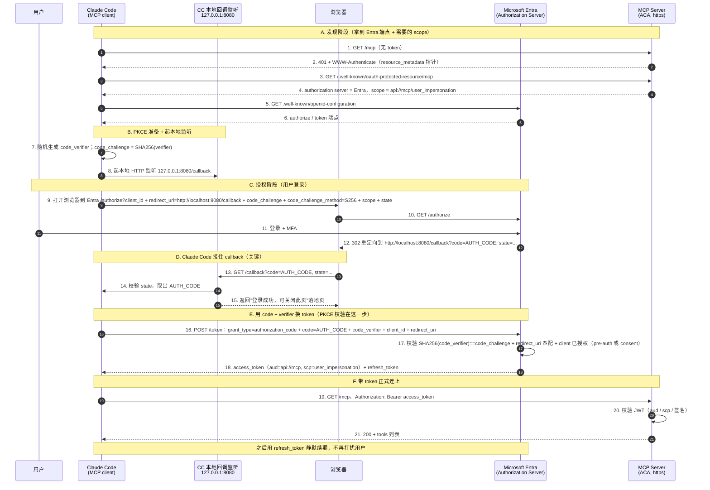

# 为 Entra 保护的 MCP 接入自定义 Client（原理与说明篇）

> 本文是**原理 / 说明篇**：讲清楚"自定义 client 怎么通过 OAuth 连上 Entra 保护的 MCP"背后的**每一个为什么**。
> **具体怎么落地**（注册 client、写三份 mcp.json、改 bicep、验证）见配套的**实施篇**
> [`计划-预注册-ClaudeCode-或-opencode-项目级接入.md`](./计划-预注册-ClaudeCode-或-opencode-项目级接入.md)。
>
> 本文回答这些问题：
> 1. 现在只有 VS Code 能自动连，想换**别的 client（比如 Claude Code）**为什么不能"随便编个 id/secret"？
> 2. Claude Code 这类 client 的 OAuth 到底怎么和 MCP server 走完的？redirect URI 为什么是 localhost、
>    MCP server 部署在 ACA 还成立吗？（第 3 节）
> 3. 为什么 **不需要 client secret**？PKCE 是什么？（第 4 节）
> 4. 用户 login 完**为什么就能拿 authorization code**？MCP server 做了什么？是 RBAC 吗？（第 5 节）
> 5. Bicep 里**不 pre-authorize** 会怎样？能不能**不改 MCP server 的 app registration** 就 work？（第 6 节）
> 6. **opencode / Copilot CLI / Codex** 支持度如何？（第 7–9 节）
> 7. 能不能强制某个 tool（`action_bash`）**永远人工审批、不能 bypass**？（第 10 节）
>
> 更早的背景见 [`DataOps-MCP-登录与同意流程.md`](./DataOps-MCP-登录与同意流程.md)（登录/同意三道闸）与
> [`Entra OAuth Proxy vs Pre-registration MCP.md`](./Entra%20OAuth%20Proxy%20vs%20Pre-registration%20MCP.md)（DCR proxy vs pre-registration）。

---

## 一句话总结

- **能换 client**，但不是"随便编个 id/secret 塞进配置"——**Entra 不支持 DCR**，真实 client 必须**事先在
  Entra 注册/预授权**（pre-registration 模式）。和 VS Code 同构：注册 client app → pre-authorize（或
  consent）→ 把 `client_id` 填进客户端配置。
- **不需要 secret**：Claude Code / opencode / VS Code 都是**桌面/CLI 型 public client**，secret 对装在
  用户机器上的程序保不住密，等于没有。"证明你是你"靠**浏览器里那次 Entra 登录（含 MFA）**，"防授权码被偷"
  靠 **PKCE**。
- **各客户端支持差异很大**（截至 2026-07）：

  | Client | 静态 client_id 支持 | 能否连 Entra 保护的 MCP |
  |---|---|---|
  | **Claude Code** | ✅ 一等公民 | ✅ 现在就能 |
  | **opencode** | ✅ 支持（DCR 只是兜底） | ✅ 现在就能 |
  | **GitHub Copilot CLI** | ⚠️ 有字段但 bug 未修 | ❌ 目前不行 |
  | **Codex CLI** | ❌ 无静态 client_id | ❌ 目前不行 |

---

## 1. 背景：现在为什么"只有 VS Code 自动能连"

本 MCP server 走 **pre-registration / pre-authorized client** 模式（不是 OAuth Proxy 模式）：Entra 直接
作为 authorization server，直接给 client 签发访问 MCP server 的 access token。

VS Code 能"零配置"跑通，是两件事叠加：

1. **VS Code 本身是 Entra 已知的 first-party public client**，client id 是公开固定的
   `aebc6443-996d-45c2-90f0-388ff96faa56`。
2. `provisioning/aca/modules/identity.bicep` 里，把这个 id 写进了 MCP server app 的
   `preAuthorizedApplications`（对应登录流程的**闸②**，免掉 consent 弹窗）。

关键矛盾（后面一切的根因）：

> **Microsoft Entra 不按 MCP 需要的方式支持 Dynamic Client Registration (DCR)。**

所以 client **不能临时向 Entra 动态注册**，只能用 Entra **已经认识**的 client id。VS Code 的 id 是
Microsoft 内置的；换别的 client，就得**你自己去 Entra 注册一个**。

---

## 2. 换 client：结论 + 两个纠正

**结论：能，这正是 pre-registration 模式的设计意图**——自定义 client 只是"又一个你注册/预授权的已知
client"，和 VS Code 地位一样。Claude Code / opencode 官方都支持"auth server 不支持 DCR、需预配置凭据"
这个场景。

两个要纠正的点：

1. **client_id 不能瞎编**——必须是你在 Entra 里**新建的 client app registration 的 appId**。Entra 没有
   DCR，认不出没注册过的 client。
2. **secret 不放进配置文件，而且大概率根本不需要**。桌面/CLI 型 public client 走 Authorization Code +
   **PKCE**，不需要 client secret（原理见第 4 节）。

---

## 3. OAuth 全景：时序图、callback、redirect URI 与端口

### 3.1 时序图

Claude Code 这类**本地 client** 与 MCP server 完成 OAuth 的整条链路。重点看
**②发现 401 → ⑫Entra 的 302 重定向 → ⑬–⑮本地接住 callback → ⑯用 code+verifier 换 token**：



### 3.2 Claude Code 是怎么 handle callback 的（步骤 8、13–15、16）

一个**本地 CLI 程序**怎么"接住"浏览器里的登录结果：

1. **OAuth 开始前先起监听**（步骤 8）：Claude Code 在本机起一个**临时 HTTP 服务**，监听
   `127.0.0.1:<callbackPort>`（默认随机端口，用 `--callback-port` 可钉死成 8080）。只为接一次 callback，
   用完即关。
2. **同时算好 PKCE**（步骤 7）：本地随机生成 `code_verifier`（只存内存，从不发出），算出
   `code_challenge = SHA256(code_verifier)`，只把 `code_challenge` 放进 `/authorize`。
3. **Entra 用 302 把 code 送回本地**（步骤 12–13）：用户登录成功后，Entra 返回 **302 重定向**，让浏览器
   跳到 `http://localhost:8080/callback?code=AUTH_CODE...`。浏览器一跳，authorization code 就作为 URL
   query 落到那个本地监听上。
4. **取出 code、核对 state、回落地页**（步骤 14–15）：Claude Code 从回调 URL 读出 `code`，核对 `state`
   （防 CSRF），给浏览器回一个"登录成功，可关闭此页"。
5. **拿 code + verifier 换 token**（步骤 16–18）：带 `code` 和**只存在内存的** `code_verifier` 去 Entra
   `/token`。Entra 校验 `SHA256(code_verifier) == code_challenge`、`redirect_uri` 匹配、client 已授权——
   全对才发 **access token**（+ refresh token）。别的程序就算偷到 `code`，没有 `code_verifier` 也换不出。
6. 之后才带 `Authorization: Bearer <token>` 正式连 `/mcp`（步骤 19），token 进系统钥匙串、靠 refresh
   token 静默续期。

### 3.3 redirect URI 是什么？为什么是 localhost？MCP server 在 ACA 上还成立吗？

- **redirect URI（reply URL）= authorization server（Entra）在用户登录后，把 authorization code 送回给谁。**
  它是 **client 的属性，和 MCP server / resource server 无关**。
- **谁接收这个 redirect？是发起 OAuth 的那个 client。** Claude Code 是**跑在你本机**的桌面/CLI 程序，接
  code 的方式就是在本机起一个 loopback 监听——所以 redirect URI 是 `http://localhost:PORT/callback`。这是
  native app 的标准做法（**RFC 8252, OAuth for Native Apps**）。
- **这和 MCP server 部署在哪里完全无关。** 看时序图 C→D 段：整个 redirect 发生在**你本机的浏览器 → 你本机
  的 Claude Code 监听**之间（Entra → 浏览器 → localhost），**全程不经过 ACA 上的 MCP server**。MCP server
  只在最后一步（步骤 19）被 Bearer token 访问，**从不参与 redirect**。
- **所以 localhost 完全正确、且正应该用 localhost。** 哪怕 MCP server 在 ACA、在天边，只要 Claude Code
  跑在你本机，redirect 就该回本机 loopback。你**不该**把 redirect URI 填成 MCP server 的 ACA 地址——那不是
  接 code 的地方。
- **什么时候 redirect URI 才是公网地址？** 当 client 本身是**服务器端 web app**（confidential client），
  登录后 Entra 要把 code 送到那个 web app 的公网回调。Claude Code 不是 web app，所以用 loopback。
- **redirect URI 为什么必须预注册：** 它是 Entra 交付 code 的目的地。**Entra 只把 code 送到 app
  registration 里登记过的 redirect URI**，没登记的一律拒绝。这是防 code 劫持的关键控制，配合 PKCE 构成
  双保险。

### 3.4 只有一个 port，别被"两处 8080"绕晕；端口被占怎么办

**"第一次的 callback port"和"第二次的 callback port"其实是同一个端口，只是出现在两处，必须相等：**

| 出现位置 | 角色 |
|---|---|
| 步骤 8：本机起 HTTP 监听 `127.0.0.1:8080` | **接** authorization code 的本地服务 |
| 步骤 9 / Entra 注册的 redirect URI `http://localhost:8080/callback` | 告诉 Entra **把 code 送到哪** |

`--callback-port 8080`（或 `oauth.callbackPort: 8080`）**一次同时设定这两处**：监听绑 8080、redirect_uri
也用 8080。**所以"锁在一个 port" = 就是 `--callback-port` 干的事，本来就只有一个 port。**

**端口被占怎么办**（你的担心是对的：钉死 8080 而 8080 被占 → 步骤 8 绑不上 → OAuth 失败）。两种思路：

- **办法 A：钉死一个不常用端口**（如 `8765`）。Entra 注册 `http://localhost:8765/callback`，客户端
  `--callback-port 8765`。简单、确定。
- **办法 B：不钉端口，靠 Entra 的 localhost 端口无关匹配。** Microsoft 官方明确：*"The login server
  cannot distinguish between redirect URIs when only the port differs"*，且允许注册 `http://localhost`、
  `http://localhost:3000/abc`（*paths and ports are okay*）——即 **Entra 匹配 localhost redirect 时忽略
  端口、只认 path**。于是客户端随机挑空闲端口，只要 **path（`/callback`）对上**，Entra 照样放行，天然躲开
  端口冲突。
  - 代价：path **必须**对上（path 被严格匹配，端口不是）。Claude Code 的 path 固定是 `/callback`；
    opencode 的 path 需实测。
- 没有固定端口字段的客户端（如 opencode）**只能用办法 B**。

> 具体本项目选哪种、怎么注册，见实施篇 §3。

---

## 4. 为什么 public client 不需要 client secret（含 PKCE）

最容易绕晕的一点。核心：**`client_secret` 认证的不是"你（用户）"，而是"client 这个应用程序"**。"不拿
secret 怎么证明我是我"其实把两个身份合成了一个。

### 4.1 两个不同的身份

| 要证明的身份 | 靠什么证明 |
|---|---|
| **你是你**（user identity） | **在浏览器里登录 Entra**（账号密码 + MFA） |
| **这个 app 是它自称的那个 app**（client identity） | confidential client 用 secret；public client 不用 |

"认证我是我"从来不靠 secret，而靠那次**交互式 Entra 登录**。secret 只解决"发请求的程序是不是真的那个
client"，跟你本人是谁无关。

### 4.2 confidential client vs public client

secret 有没有意义，取决于它**能不能真的保密**：

- **Confidential client**（跑在服务器后端）：secret 只存后端，用户碰不到 → secret 有意义。
- **Public client**（桌面 app、CLI、手机 app、SPA）：程序**装在每个用户机器上**。把 secret 打包进程序发给
  所有人 = 对所有人可见 = 一秒被扒出来 = **等于没有 secret**。

所以 OAuth 明确规定 public client **不应依赖 secret**。VS Code 的 client id 干脆公开硬编码在源码里，因为
**client id 本来就不是机密**，只是个名字。

### 4.3 什么是 PKCE，它怎么顶替 secret

> **PKCE = Proof Key for Code Exchange**（RFC 7636，读作 "pixy"），是 OAuth 授权码流程的一个**扩展**，
> 专门防"authorization code 被中途截走盗用"。
>
> 注意方向：**PKCE 不是 code_challenge 的一部分；恰恰相反，code_challenge 是 PKCE 的组成部分。**
> PKCE 由三样构成：
> - `code_verifier`：客户端**每次流程随机生成的一次性秘密**，只留在本地内存，从不发出；
> - `code_challenge`：`code_verifier` 的哈希（`SHA256`），**只有它**被发给 Entra；
> - `code_challenge_method`：哈希算法标识，通常 `S256`。
>
> 直觉：`code_verifier` 是"钥匙"，`code_challenge` 是先交给 Entra 的"锁"。`/authorize` 亮锁，`/token`
> 换 token 时必须拿出钥匙，Entra 验 `SHA256(钥匙) == 锁` 才放行。

secret 在授权码流程里的原始作用是"换 token 时证明是我在换"。public client 用 PKCE 替代——就是这套
"锁 + 钥匙"：

```text
1. 本地随机生成 code_verifier（只在内存，从不发出）
2. /authorize 时只发它的哈希 code_challenge = SHA256(code_verifier)
3. 用户登录成功，Entra 把 authorization code 发回 http://localhost:8080/callback
4. 换 token 时，客户端必须附上原始 code_verifier
5. Entra 校验 SHA256(code_verifier) == code_challenge，对上才发 token
```

效果：就算别的程序在同机抢到了 code，它**没有 code_verifier，换不出 token**；而 code_verifier 从头到尾
没离开过发起进程。这就把"secret 保护 code 兑换"换成"每次动态生成、绝不外传的一次性凭据"，**无需预先分发**，
天然不会被扒。再叠加 **redirect URI 必须预注册** + loopback 只在本机，code 只会回到发起流程的那个本机 app。

### 4.4 小结

> **你本人的身份 = 浏览器里那次 Entra 登录（含 MFA）；**
> **client 的身份 = client_id（公开的名字）+ PKCE（一次性动态凭据）+ 预注册 redirect URI。**

拿到的 access token 里带 `oid`（是你）、`aud`（你的 MCP server）、`azp`（哪个 client）。MCP server 只
校验 `aud` + `scp` + 签名——**根本不关心 client 当初有没有用 secret**。

---

## 5. 为什么 login 完就能拿 authorization code？MCP server 做了什么？是 RBAC 吗？

最容易误解的一点：**authorization code 是 Entra（authorization server）发的，不是 MCP server 发的。**

### 5.1 发 code 的是 Entra，MCP server 在这一步完全不参与

看第 3 节时序图：`/authorize` → 登录 → 302 带 code，全程在**浏览器 ↔ Entra** 之间。**MCP server 在整个
authorize / token 交换里一次都没被调用。** 它只在两头出现：

- **最前面**（步骤 1–2）：返回 `401 + WWW-Authenticate`，告诉 client "去找 Entra、要这个 scope"。
- **最后面**（步骤 19–20）：收到 Bearer token，**校验 JWT**（`aud` / `scp` / 签名 / issuer）。

中间发不发 code、发给谁，**MCP server 说了不算，Entra 说了算**。

### 5.2 Entra 凭什么在 login 后就发 code？两道闸，都在 Entra

1. **认证（authN，"你是谁"）**：用户在 Entra 登录成功（+ MFA）。
2. **授权（authZ，"这个 client 能不能要这个 scope"）**：Entra 检查该 client 对
   `api://<mcp>/user_impersonation` 是否被允许——**要么 pre-authorized，要么有 consent grant**（见第 6 节）。

两条都过，Entra 才把 code 发到 client 的 redirect URI。**这跟 MCP server 无关，不是 MCP server 在放行。**

### 5.3 这是 RBAC 吗？——不是

- **发 code / 发 token**：Entra 的 authN + client authZ，**不是 RBAC**。
- **MCP server 的"谁能用哪个 tool"**：那是 token 校验**通过之后**、在 **runtime** 做的——MCP server 用
  **OBO** 拿用户 token 换 Graph token，查用户的 **AD group** 成员，决定 tool 可见性（见
  [`mcp_discussion.md`](./mcp_discussion.md) §2/§3）。这是**基于组的 tool 门控**，最接近"RBAC"，但发生在
  **拿到 token 之后**，和"发 code"是两码事。
- **Azure RBAC**：只作用在 **worker Service Principal** 执行 `az` 命令时的资源权限边界，和用户登录/发 code
  完全无关。

> 一句话：**login 后能拿 code，是 Entra 完成了"认证 + client 授权"；MCP server 只负责最前面发 401 指路、
> 最后面验 token。tool 级组门控是 MCP server 在 runtime 用 OBO+Graph 做的，那才沾 RBAC 的边，但不在发 code
> 这条链上。**

---

## 6. pre-authorize 是什么？不加会怎样？能不能不改 server app？

### 6.1 pre-authorize 的作用（闸②）

pre-authorize 写在 **MCP server app** 的 `preAuthorizedApplications`，唯一作用是**免掉 consent 弹窗**：
你（API 拥有者）替某个可信 client 预先同意，Entra 直接发 token、零 consent。

### 6.2 不 pre-authorize 会发生什么

不加它，OAuth **技术上照样能走**，区别只在第一次登录：

| 租户 user-consent 设置 | 不 pre-auth 的结果 |
|---|---|
| 允许用户自助同意 | 用户第一次看到一次 consent 弹窗 → 点"同意" → 记一条 per-user grant → 之后不再弹 |
| **关闭了用户同意**（很多企业租户） | 用户点不了，显示"需管理员批准" → 卡住，需**管理员 consent 一次** |

本项目的 `user_impersonation` scope 在 `identity.bicep` 里是 `type: 'User'`（带 userConsent 文案），
**属可用户自助同意的低权限 scope**——只要租户没禁用户同意，不 pre-auth 也就是"第一次多点一下"。

### 6.3 能不能完全不改 MCP server 的 app registration？——能

关键区分：**pre-authorize 改的是 server app；而让 client 拿到 scope 还有另一条路——consent grant，它不改
server app 的定义。** 要让 client work，最少只需要：

1. 新建 **client app registration** + redirect URI + `allowPublicClient`（全新对象，**不碰 server app**）；
2. 在 **client app** 上加 API permission：server 的 `user_impersonation` delegated scope（改的是 **client
   app**，不是 server app）；
3. **Consent**：用户第一次点"同意"（生成 per-user grant）**或** 管理员 consent 一次（生成 grant 对象）
   ——grant 是**独立对象，不是对 server app registration 定义的编辑**。

> **结论：可以不改 MCP server 的 app registration 就让它 work**——前提是**能拿到 consent**（租户允许用户
> 自助同意，或有管理员愿意 consent 一次）。**pre-authorize 只是省掉那次 consent 点击的优化，不是功能必需。**

什么时候**不得不**碰 server app（加 pre-auth）？只有当**租户禁了用户同意、又不方便逐个 admin consent**，
想用"服务端预授权"一次性解决所有用户时。

### 6.4 OBO（闸③）与 client 无关

`grant_obo_admin_consent`（AllPrincipals，MCP server SP → Graph）与用哪个 client 无关，换 client 不需要
改动。

---

## 7. 各 Agent 客户端对 Entra 场景的支持对比

判断标准只有一条：**该 client 能不能吃一个"静态/预注册的 client_id"**——这是 Entra（无 DCR）能否跑通的命门。

| Client | 静态 client_id 支持 | Entra（无 DCR）能否跑通 | 配置字段 |
|---|---|---|---|
| **Claude Code** | ✅ 一等公民 | ✅ 就是为这场景做的 | `--client-id` / `--callback-port`；`oauth.clientId`、`oauth.callbackPort` |
| **opencode** | ✅ 支持 | ✅ 填 `clientId` 即可，DCR 只是兜底 | `oauth: { clientId, scope }`（`clientSecret` 可选，public client 不填） |
| **Copilot CLI** | ⚠️ 字段有，但 **bug 未修** | ❌ 目前不能 | `oauth: { clientId, callbackPort }`（被忽略） |
| **Codex CLI** | ❌ 根本没有 | ❌ 不能（只走 DCR） | 只有 `bearer_token_env_var` / `http_headers` / `oauth_resource` |

### 7.1 Claude Code — ✅ 直接支持

`--client-id` + `--callback-port` 就是官方给"auth server 不支持 DCR"准备的路径（文档原文：
*"Some MCP servers don't support automatic OAuth setup via Dynamic Client Registration… the server
requires pre-configured credentials"*）。落地见实施篇。Entra 首选。

### 7.2 opencode — ✅ 支持，用法几乎一样

远程 server 配置里有 `oauth` 对象，可直接填预注册凭据。文档原文：*"If not provided, dynamic client
registration will be attempted"*——即**先用你给的 clientId，给不了才退回 DCR**。

**关于 secret：opencode 和 Claude Code 等价——都是 public client + PKCE，不需要 client secret。**
opencode 的 `oauth` 里 `clientSecret` 是**可选**字段（官方 options 表没标 Required），public client
**只填 `clientId`（+ `scope`）、把 `clientSecret` 留空**即可。它的 DCR 兜底路径本身就是 public + PKCE
流程，静态 `clientId` 复用同一套。（唯一区别：opencode 文档没像 Claude Code 那样把"静态 clientId + PKCE、
无 secret"写得那么显式，但字段和流程都支持。）

⚠️ 细节：opencode 没暴露"固定 callback 端口"字段 → 只能用第 3.4 节的**办法 B**（Entra 注册端口无关的
`…/callback`）。

### 7.3 GitHub Copilot CLI — ⚠️ 有字段，但目前是坏的

`~/.copilot/mcp-config.json` **设计上**支持 `oauth.clientId` + `oauth.callbackPort`，但有个**已确认、截至
2026-07 仍 open 的 bug（[copilot-cli#2717](https://github.com/github/copilot-cli/issues/2717)）**：CLI
**忽略你配的 `clientId`，强行走 DCR**。对 Entra 是致命的——DCR 注册出来的 id 你没授权、没 consent，登录
直接失败。

> 注意区分：GitHub 在 **JetBrains / Eclipse / Xcode 的 Copilot 插件**已支持"DCR 失败回退静态
> client id/secret"，但那是 IDE 插件，不是 CLI；**CLI 这条链目前是断的**。

### 7.4 Codex CLI — ❌ 无静态 client_id（见第 8 节详解）

Codex `config.toml` 里 OAuth 相关只有 `scopes`、`oauth_resource`、`mcp_oauth_callback_port/url`，
**没有任何 `client_id` / `client_secret` 字段**。`codex mcp login` 走纯 DCR，无法用 pre-registration 连
Entra。

---

## 8. Codex 深入：为什么支持最差 + workaround

Codex CLI（和 Codex App）的 MCP OAuth 登录**只会走 DCR**，且**没有"每个 server 配静态 client_id"的字段**。
openai/codex 仓库里多个 **open** issue 直接坐实：

- **[#15818](https://github.com/openai/codex/issues/15818)** —— 环境就是 **Microsoft Entra OAuth 2.0**，
  报错 `Dynamic client registration not supported`。**Open，官方未修**。
- **[#19154](https://github.com/openai/codex/issues/19154)** —— 报告者原话：*"I could not find a
  documented way to provide a per-server static OAuth client id"*。**Open**。
- 同类还有 Okta / Kaggle（[#23627](https://github.com/openai/codex/issues/23627)）/
  Meta Ads（[#24103](https://github.com/openai/codex/issues/24103)）。

也就是说，**给 Codex 一个 client_id 让它自动 OAuth——现在做不到**，它根本不读 client_id，只会自己去 DCR。

### 唯一 workaround：手动塞 bearer token（很脆）

Codex 支持 `bearer_token_env_var` / `http_headers`，理论上可绕过 OAuth 直接带 token：

```toml
[mcp_servers.dataops-mcp]
url = "https://<你的-MCP-URL>/mcp"
bearer_token_env_var = "MCP_TOKEN"
```

你在外面自己弄一个 Entra token 导进 `MCP_TOKEN`（如 `az account get-access-token --resource
api://<mcp-app-id>`，前提是 az CLI 那个 client 也在你 API 上被授权/同意过）。

但看 **#15818 的实测**：塞了手动 bearer token 后，失败从 **401 变成 403**——token 进去了但被 server 拒
（audience/scope 对不上）。加上 token 约 1 小时过期、**无自动刷新**：

- 只适合"临时验证 server 通不通"，**不是日常可用方案**；
- 想真跑通，得保证 token 的 `aud = api://<mcp-app-id>`、`scp` 含 `user_impersonation`，且每小时手动换。

---

## 9. 速查 / 决策建议

- **要用非 VS Code 的 client 连本 Entra 保护的 MCP：优先 Claude Code 或 opencode**——都是"Entra 注册
  client app →（可选）pre-authorize → 填 clientId"，现在就能用。
- **Copilot CLI**：有配置字段但 bug（#2717）未修，**暂不可用**，等修。
- **Codex CLI**：无静态 client_id 字段，官方 issue 长期 open，**暂不可用**；只能手动塞 bearer token 凑合。
- 根因始终同一条：**Entra 无 DCR，client 必须能吃静态 client_id**。
- **不变的两点**：secret 对 public client 无意义（用 PKCE）；OBO（闸③）与 client 无关，无需改动。

---

## 10. 进阶：强制某个 Tool 永远人工审批（不能 bypass）

场景：`diagnose_bash`（只读诊断）希望自动放行，但 `action_bash`（写操作）**无论如何都要人工 review、不能
bypass**——agent 给 `action_bash` 写的命令若无人 review 太危险。问题：**能不能在 client 配置层做到？**

### 10.1 先厘清：两件事别混

| | 难度 | 说明 |
|---|---|---|
| (A) 把 `diagnose_bash` **自动放行** | 容易 | 五个 client 全都能做（allowlist） |
| (B) 让 `action_bash` **永远必须人工审批、无法被 bypass** | 难 | 这才是真正要的，且有本质限制 |

**关键事实**：client 侧的审批是**运行 client 的人**控制的 UX 闸门，**每个 client 都有"全局绕过"模式**——
Claude `--dangerously-skip-permissions`、VS Code Autopilot / `chat.tools.autoApprove`、Codex `--yolo` /
`--dangerously-bypass-approvals-and-sandbox`、Copilot `--allow-all`、opencode 会话里点 "always allow"。

所以：**在一台由用户自己掌控 client 配置的机器上，用户总能把闸门放松**。client 配置能防"模型自作主张跑
`action_bash`"，但防不住"人主动选择 bypass"。

> **真正无法被 bypass 的地方，是 MCP server 自己。** 见 [`mcp_discussion.md`](./mcp_discussion.md) §5 的
> per-tool-call hook：server 收到 `action_bash` 就阻塞，直到人工 consent 才执行，**不管连的是哪个 client、
> client 有没有开 YOLO**；再加上 worker SP / RBAC 兜底。**这才是主控制，client 配置只是 defense-in-depth。**

另外：这些 per-tool 审批控制**基本都不在 mcp.json（server 定义文件）里**，而在各自的 permission / settings
层。

### 10.2 五个 client 对比

| Client | 自动放行 diagnose_bash | 强制 action_bash 永远审批 | **能锁到"本机用户也 bypass 不了"** | 配置在哪 |
|---|---|---|---|---|
| **Claude Code** | ✅ `allow` | ✅ `ask`（bypass 模式下也照弹） | ✅ **managed settings** 可锁死 | `settings.json`（非 mcp.json） |
| **VS Code** | ✅ | ✅ `eligibleForAutoApproval:false` | ✅ **企业 MDM policy** 可锁死 | `settings.json` |
| **Codex** | ✅ | ✅ per-tool `approval_mode="approve"` | ❌ `--yolo`/bypass 可绕，无企业锁 | `config.toml` |
| **opencode** | ✅ | ✅ `"dataops_action_bash":"ask"` | ⚠️ 会话点 "always" 可绕，无企业锁 | `opencode.json` |
| **Copilot CLI** | ✅ | ⚠️ 只能 `--deny-tool` **硬禁**（无法"审批后放行"） | ✅ deny 优先于 `--allow-all`（但=彻底禁用） | flags / `permissions-config.json` |

**结论：只有 Claude Code 和 VS Code 能做到"连本机用户也改不了、且审批后仍可执行"**——但都得靠**企业 /
托管策略**下发。Codex / opencode 能设但会被 bypass；Copilot 只能"要么彻底禁、要么可放行"。

### 10.3 逐个配置

#### Claude Code —— 最强（`ask` 在 bypass 模式下也生效）

官方文档明确：`bypassPermissions` 模式 *"Skips permission prompts, **except those forced by explicit
`ask` rules**"*。

```jsonc
// settings.json（普通用户级即可强制弹窗；要"用户也改不了"就放进 managed settings）
{
  "permissions": {
    "allow": ["mcp__dataops__diagnose_bash"],
    "ask":   ["mcp__dataops__action_bash"],
    "disableBypassPermissionsMode": "disable"
  }
}
```

- `ask` = 每次调用 `action_bash` 都强制确认，即使开了 `--dangerously-skip-permissions` 也弹。
- 要**真正锁死**（用户删不掉）：下发为 **managed settings**，设 `allowManagedPermissionRulesOnly: true` +
  `disableBypassPermissionsMode: "disable"`。managed settings 优先级最高，命令行都覆盖不了。
- 更硬还可叠 **PreToolUse hook**（exit code 2 阻断）或直接 `deny`。规则名用规范形式 `mcp__<server>__<tool>`。

#### VS Code —— 靠企业策略

```jsonc
// settings.json（组织级 / MDM 下发）
{ "chat.tools.eligibleForAutoApproval": { "<action_bash 的 tool id>": false } }
```

设 `false` = 永远需要人工确认；文档明确"组织可用设备管理策略强制特定 tool 手动审批"。注意普通的
`chat.tools.autoApprove` / Autopilot 会覆盖**用户级**设置，硬保证必须走**组织托管**。

#### Codex —— 能设，但会被 bypass

```toml
# config.toml
[mcp_servers.dataops.tools.action_bash]
approval_mode = "approve"        # 每次都要人工批准
```

`--yolo` / `--dangerously-bypass-approvals-and-sandbox` / `--full-auto` 会整体绕过，且**无企业级锁**
（见 [issue #24135](https://github.com/openai/codex/issues/24135)）。只能当"防手滑"。

#### opencode —— 能设，但会被绕

```jsonc
// opencode.json（MCP tool 名是 <server>_<tool>）
{ "permission": { "dataops_diagnose_bash": "allow", "dataops_action_bash": "ask" } }
```

`ask` 会强制弹窗，但用户会话里可点 "always approve"，且无企业级锁。

#### Copilot CLI —— 只能硬禁

```bash
copilot --deny-tool='dataops(action_bash)'   # 彻底禁用；deny 优先于 --allow-all
```

deny 优先级高于 `--allow-all`，但那是**完全不让跑**，不是"审批后放行"。

### 10.4 建议

1. **别把 `action_bash` 的安全指望在 client 配置上**——它防模型手滑，不防人 bypass。现有的 **server 端
   per-tool-call hook + human consent + worker SP/RBAC** 才是唯一无法绕过的边界，作为主控制。
2. **client 层作为纵深防御**：若能统一管控团队 client，**Claude Code（managed settings）或 VS Code（MDM）**
   是唯二能"锁到用户也改不了"的。
3. MCP 规范里 server 还能用 **elicitation** 主动向 client 要确认，但仍依赖 client 实现，不如 server 端
   直接阻塞可靠。

---

## 参考资料

**项目内相关文档**
- [`计划-预注册-ClaudeCode-或-opencode-项目级接入.md`](./计划-预注册-ClaudeCode-或-opencode-项目级接入.md) —— **实施篇**（注册 client、三份 mcp.json、bicep 改动、验证）
- [`DataOps-MCP-登录与同意流程.md`](./DataOps-MCP-登录与同意流程.md) —— 1 次登录 + 2 道同意闸（②/③）
- [`Entra OAuth Proxy vs Pre-registration MCP.md`](./Entra%20OAuth%20Proxy%20vs%20Pre-registration%20MCP.md) —— DCR proxy vs pre-registration 两模式
- `provisioning/aca/modules/identity.bicep` —— `preAuthorizedApplications` / `user_impersonation` scope

**外部来源**
- [Claude Code – Connect to MCP（pre-configured OAuth credentials / `--client-id`）](https://code.claude.com/docs/en/mcp)
- [Claude Code – Configure permissions（ask/deny、bypassPermissions 例外、managed settings）](https://code.claude.com/docs/en/permissions)
- [opencode – MCP servers](https://opencode.ai/docs/mcp-servers/) / [Permissions](https://opencode.ai/docs/permissions/)
- [Codex – MCP docs](https://developers.openai.com/codex/mcp) / [Config reference](https://developers.openai.com/codex/config-reference) / [issue #24135](https://github.com/openai/codex/issues/24135)
- [VS Code – Manage approvals and permissions（`eligibleForAutoApproval`）](https://code.visualstudio.com/docs/agents/approvals)
- [Microsoft – Redirect URI (reply URL) best practices（localhost 端口/path 匹配）](https://learn.microsoft.com/en-us/entra/identity-platform/reply-url)
- [Codex #15818](https://github.com/openai/codex/issues/15818) / [#19154](https://github.com/openai/codex/issues/19154) —— Entra 无 DCR 连不上
- [Copilot CLI #2717 – ignores `oauth.clientId`, always uses DCR](https://github.com/github/copilot-cli/issues/2717)
