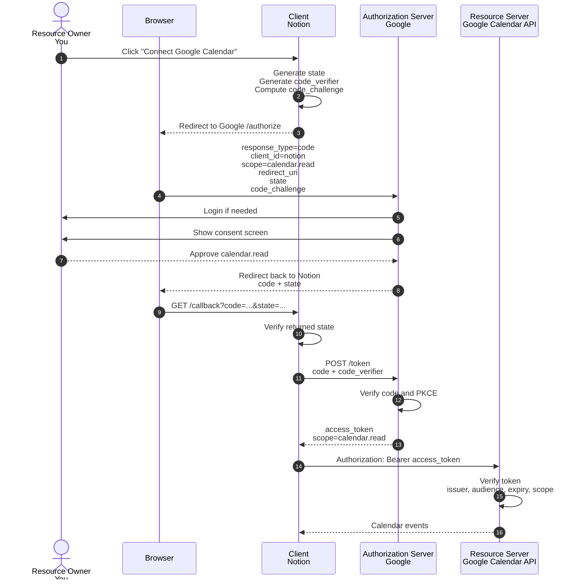
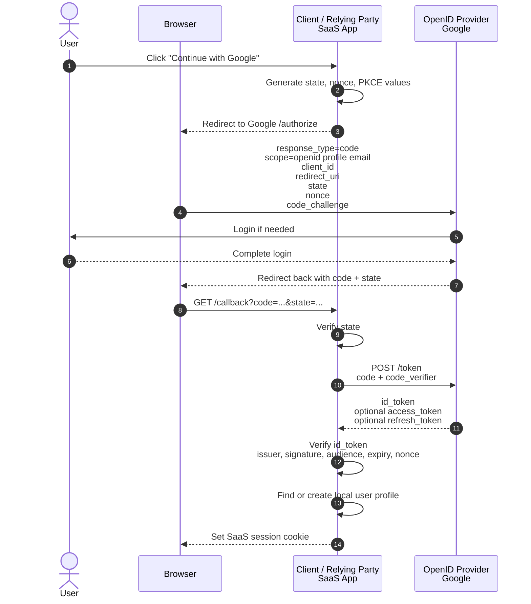
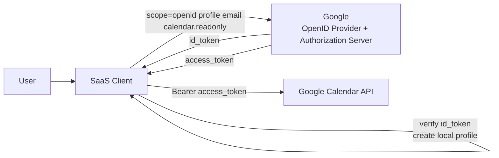
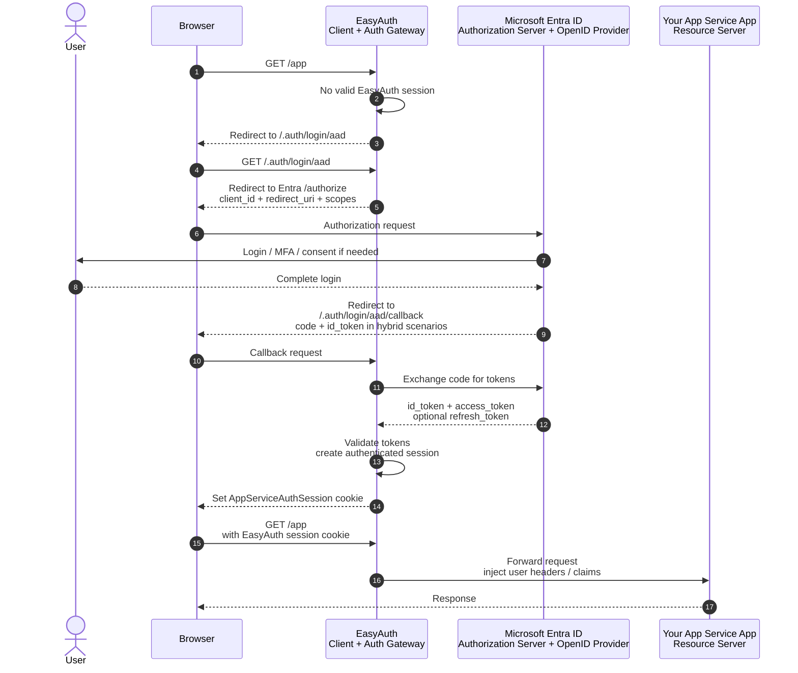
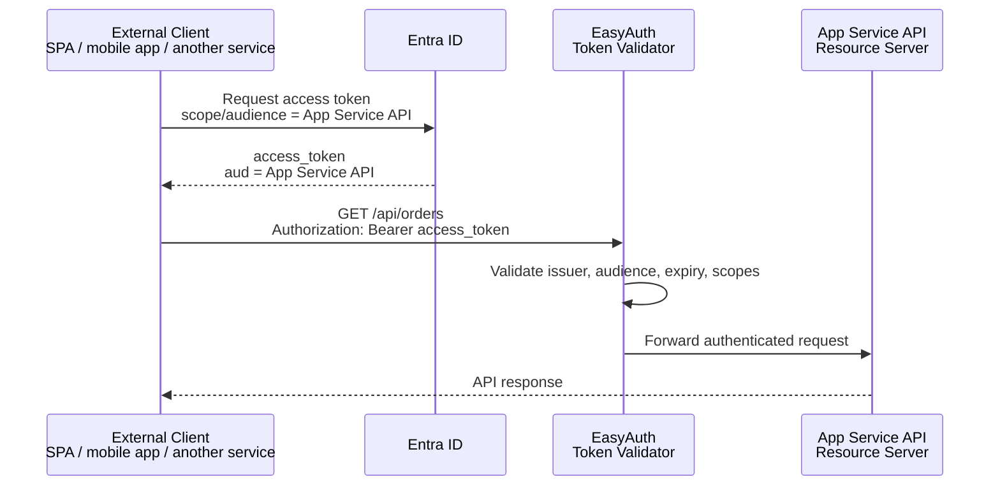
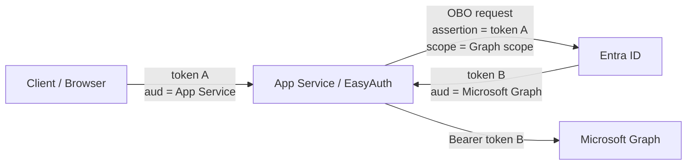
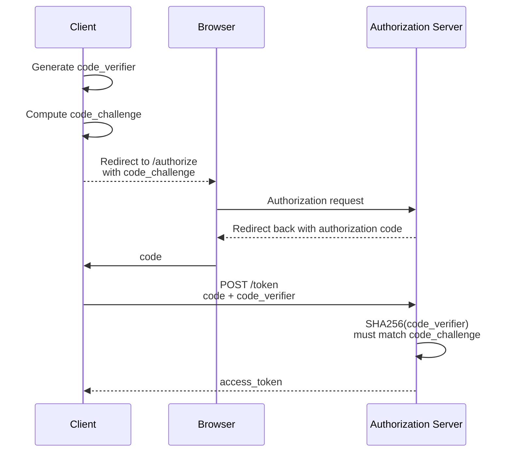

# OAuth, OIDC, and Azure App Service EasyAuth

## One Sentence Summary

OAuth answers:

> Can this application access this resource with this permission?

OIDC answers:

> Who is the user who just authenticated?

Azure App Service EasyAuth is not itself OAuth or OIDC. It is Azure App Service's built-in authentication and authorization gateway. It uses OAuth/OIDC-style flows with identity providers such as Microsoft Entra ID, then protects the App Service application before requests reach the app code.

## The Four OAuth Roles

| Role | Meaning | Plain example |
|---|---|---|
| Resource Owner | The owner of the protected data, usually the user | You |
| Client | The app that wants access | Notion, Calendly, a SaaS app, an Azure App Service app |
| Authorization Server | The system that authenticates the user and issues tokens | Google, Microsoft Entra ID, GitHub |
| Resource Server | The API that holds the protected resource | Google Calendar API, Microsoft Graph, your App Service API |

The important point is that these are roles, not always separate machines. One product can play more than one role depending on the flow.

For Azure App Service EasyAuth:

| Piece | Role |
|---|---|
| EasyAuth during login | Client / OIDC relying party |
| Microsoft Entra ID | Authorization Server and OpenID Provider |
| Your App Service app/API | Resource Server |
| Browser user | Resource Owner |

This is why EasyAuth can feel circular: the App Service platform is both initiating login as a client and protecting the app as a resource server.

## 1. Complete OAuth 2.0 Flow

### Real World Example: Notion Connects to Google Calendar

Imagine you are already logged in to Notion. You click:

```text
Connect Google Calendar
```

Notion is not primarily trying to "log you in with Google" here. Notion already has its own user account for you. The main goal is:

> Allow Notion to read your Google Calendar without giving Notion your Google password.

Role mapping:

| OAuth role | Concrete example |
|---|---|
| Resource Owner | You |
| Client | Notion |
| Authorization Server | Google authorization server |
| Resource Server | Google Calendar API |
| Resource | Your calendar events |

### Flow Diagram



### Step by Step

1. You click "Connect Google Calendar" in Notion.

Notion decides it needs permission to read your calendar. It does not ask for your Google password. Instead, it starts an OAuth authorization flow.

2. Notion creates `state`, `code_verifier`, and `code_challenge`.

`state` is a random value used to bind the outgoing request to the returning callback. It helps prevent CSRF and some response mix-up attacks.

`code_verifier` is a secret random string that Notion keeps locally.

`code_challenge` is derived from `code_verifier`, usually:

```text
code_challenge = BASE64URL(SHA256(code_verifier))
```

This is the PKCE part of the flow.

3. Notion redirects your browser to Google's authorization endpoint.

The request looks conceptually like this:

```text
GET https://accounts.google.com/o/oauth2/v2/auth
  ?response_type=code
  &client_id=notion-client-id
  &redirect_uri=https://notion.example.com/oauth/callback
  &scope=https://www.googleapis.com/auth/calendar.readonly
  &state=random-state
  &code_challenge=hashed-value
  &code_challenge_method=S256
```

The key thing is:

```text
response_type=code
```

Notion is asking for an authorization code, not an access token directly.

4. Google authenticates you.

Google may ask you to log in, use MFA, or choose an account. OAuth itself does not define exactly how Google authenticates you. That is Google's own identity system.

5. Google shows a consent screen.

Google asks whether you allow Notion to read your calendar. The permission is represented by a `scope`, for example:

```text
calendar.readonly
```

6. Google redirects back to Notion with an authorization code.

The browser is sent back to Notion:

```text
https://notion.example.com/oauth/callback
  ?code=temporary-code
  &state=random-state
```

The authorization code is short-lived and usually one-time use.

7. Notion verifies `state`.

Notion checks that the returned `state` matches the one it created. If not, it rejects the callback.

8. Notion exchanges the authorization code for an access token.

Notion's backend sends:

```text
POST https://oauth2.googleapis.com/token

grant_type=authorization_code
code=temporary-code
redirect_uri=https://notion.example.com/oauth/callback
client_id=notion-client-id
code_verifier=original-random-secret
```

For confidential clients, there may also be a client secret or private key authentication.

9. Google verifies the code and PKCE.

Google checks:

```text
Is the code valid?
Is the code expired?
Was the code already used?
Does the redirect_uri match?
Does this code belong to this client_id?
Does SHA256(code_verifier) match the previous code_challenge?
```

10. Google returns an access token.

Conceptually:

```json
{
  "access_token": "eyJ...",
  "token_type": "Bearer",
  "expires_in": 3600,
  "scope": "calendar.readonly"
}
```

11. Notion calls Google Calendar API.

```text
GET https://www.googleapis.com/calendar/v3/users/me/calendarList
Authorization: Bearer eyJ...
```

12. Google Calendar API verifies the access token.

The Resource Server checks whether the token is valid and whether it contains enough permission to perform the requested action.

It usually checks:

```text
issuer
audience
signature or introspection result
expiry
scope
subject / user context, if present
client identity, if present
```

### What OAuth Accomplished

OAuth allowed Notion to access your calendar with limited permission, without ever receiving your Google password.

The core artifact is:

```text
access_token
```

The access token is meant for the Resource Server, not for the Client to treat as a login identity proof.

## 2. Complete OIDC Flow

### Real World Example: Sign in to a SaaS with Google

Imagine you open a SaaS app and click:

```text
Continue with Google
```

The SaaS app wants to know:

> Which Google user just authenticated?

This is where OIDC comes in.

OIDC means OpenID Connect. It is an identity layer built on top of OAuth 2.0. It adds a standard way for the Client to receive and verify user identity.

Role mapping:

| OIDC/OAuth role | Concrete example |
|---|---|
| User | You |
| Client / Relying Party | The SaaS app |
| OpenID Provider | Google |
| Authorization Server | Google |
| ID token audience | The SaaS app |

### Flow Diagram



### Step by Step

1. You click "Continue with Google".

The SaaS app does not want your Google password. It wants Google to authenticate you and return a standardized identity result.

2. The SaaS app redirects your browser to Google.

The request includes:

```text
scope=openid profile email
```

The `openid` scope is the switch that turns the OAuth-style flow into an OIDC flow.

Conceptual request:

```text
GET https://accounts.google.com/o/oauth2/v2/auth
  ?response_type=code
  &client_id=saas-client-id
  &redirect_uri=https://saas.example.com/auth/callback
  &scope=openid profile email
  &state=random-state
  &nonce=random-nonce
  &code_challenge=hashed-value
  &code_challenge_method=S256
```

3. Google authenticates you.

Google handles password, MFA, passkey, session cookies, account selection, and so on.

4. Google redirects back with an authorization code.

The SaaS app receives:

```text
code
state
```

5. The SaaS app exchanges the code for tokens.

It sends the authorization code and `code_verifier` to the token endpoint.

6. Google returns an ID token.

The ID token is the key OIDC addition.

Conceptually:

```json
{
  "iss": "https://accounts.google.com",
  "sub": "google-user-stable-id",
  "aud": "saas-client-id",
  "exp": 1710000000,
  "iat": 1709996400,
  "nonce": "random-nonce",
  "email": "you@example.com",
  "email_verified": true,
  "name": "Your Name"
}
```

7. The SaaS app verifies the ID token.

The app must not merely decode the token. It must verify it.

It checks:

```text
Was this token signed by Google?
Is the issuer the expected Google issuer?
Is the audience my client_id?
Has it expired?
Does the nonce match the login request?
```

8. The SaaS app finds or creates its own local user profile.

The SaaS app typically stores a mapping:

```text
provider = google
provider_sub = google-user-stable-id
local_user_id = saas-user-123
```

The next time you click "Continue with Google", Google returns the same stable `sub` for that client/provider relationship. The SaaS app can map you back to your existing local account.

9. The SaaS app creates its own session.

After OIDC login, the SaaS app usually sets its own cookie:

```text
saas_session=...
```

From then on, your browser is logged in to the SaaS app using the SaaS app's own session. The SaaS app does not necessarily need a Google access token.

### OIDC Plus OAuth in One Flow

OIDC can also request user data access at the same time.

Example:

```text
scope=openid profile email https://www.googleapis.com/auth/calendar.readonly
```

Then the SaaS app may receive:

```text
id_token      -> proves who the user is to the Client
access_token  -> lets the Client call Google Calendar API
```

Visualized:



This is the clean mental model:

```text
OIDC part:
Who is the user?

OAuth part:
What resource can the Client access?
```

## 3. Azure App Service EasyAuth Flow

### What EasyAuth Is

Azure App Service Authentication, often called EasyAuth, is a platform middleware/gateway that runs before your application code.

It can:

```text
authenticate users and clients
redirect users to identity providers
validate tokens
manage authenticated sessions
store and refresh provider tokens
inject identity information into request headers
```

EasyAuth is not strictly "the OAuth protocol" or "the OIDC protocol". It is Azure's product feature that uses those protocols.

### Why EasyAuth Feels Circular

In an App Service setup, the same App Service system has two different roles:

```text
EasyAuth during login:
Client / OIDC relying party

Your App Service app/API:
Resource Server
```

And Microsoft Entra ID is:

```text
Authorization Server
OpenID Provider
```

This makes the architecture feel like:

```text
App Service asks Entra for tokens so the user can access App Service.
```

But conceptually it is not a loop. It is two roles glued together:

```text
EasyAuth = login client and auth gateway
App Service app/API = protected resource
```

### Interactive Browser Login Flow



### What Happens Step by Step

1. The browser requests a protected App Service URL.

The request reaches EasyAuth before it reaches your application code.

2. EasyAuth sees there is no valid authenticated session.

Depending on configuration, it redirects to the configured identity provider. For Entra ID, the path is commonly:

```text
/.auth/login/aad
```

3. EasyAuth creates an authorization request to Entra ID.

It sends a configured `client_id`. That `client_id` belongs to an Entra app registration associated with the App Service authentication setup.

It also sends a `redirect_uri`, commonly:

```text
https://<app>.azurewebsites.net/.auth/login/aad/callback
```

Important correction:

```text
EasyAuth sends the redirect_uri.
Entra ID checks whether that redirect_uri is registered and allowed for the app registration.
```

The app registration does not "return" the redirect URL. It stores allowed redirect URLs.

4. Entra ID authenticates the user.

The user may see login, MFA, conditional access, and possibly consent.

5. Entra ID redirects back to EasyAuth.

In Entra ID scenarios, App Service Authentication can use different behavior depending on configuration.

With a client secret configured, EasyAuth acts like a confidential client and may use hybrid flow:

```text
response_type=code id_token
```

Without a client secret, EasyAuth may fall back to an implicit-style behavior that returns an ID token.

6. EasyAuth validates identity and establishes its own session.

EasyAuth uses the OIDC identity result to know who the user is. Then it establishes an App Service authentication session, usually represented in the browser by a cookie such as:

```text
AppServiceAuthSession
```

7. EasyAuth forwards the request to your app.

Your app receives user context through platform-provided headers and endpoints such as:

```text
X-MS-CLIENT-PRINCIPAL
X-MS-CLIENT-PRINCIPAL-NAME
X-MS-CLIENT-PRINCIPAL-ID
/.auth/me
```

If token store is enabled, EasyAuth can also cache provider tokens for the authenticated session.

### Where the Access Token Fits

There are two common cases.

#### Case A: Browser User Accessing the Web App

The browser does not normally call your App Service on every request with the Entra access token. After login, the browser mainly uses the EasyAuth session cookie.

So for interactive web browsing:

```text
The important runtime credential is the EasyAuth session cookie.
The ID token established user identity.
The access token may be stored, but your app may not need it.
```

If your app does not call downstream APIs, the provider access token may not be very meaningful to your application code.

#### Case B: API Client Calling Your App Service API

Here the access token has a clear purpose.



In this case:

```text
App Service API is the Resource Server.
EasyAuth is the token validator in front of it.
The access token's audience must match the App Service API.
```

### Calling Microsoft Graph or Another Downstream API

An access token whose audience is your App Service API cannot be used to call Microsoft Graph.

```text
token A:
aud = your App Service API

token B:
aud = Microsoft Graph
```

If your App Service receives token A and needs to call Graph on the user's behalf, it usually needs an On-Behalf-Of flow:



OBO is not OIDC. It is an OAuth 2.0-style delegated token exchange pattern used by Microsoft Entra ID.

## High Level Token Summary

### What Can a Token Contain?

A token may contain different data depending on the issuer, token type, and format.

Common fields, also called claims:

| Claim | Meaning |
|---|---|
| `iss` | Issuer. Who issued the token |
| `sub` | Subject. The user or principal the token is about |
| `aud` | Audience. Who the token is intended for |
| `exp` | Expiration time |
| `iat` | Issued-at time |
| `nbf` | Not valid before this time |
| `scope` / `scp` | Delegated permissions |
| `roles` | App roles or application permissions |
| `azp` / `appid` / `client_id` | The client application involved |
| `tid` | Tenant ID, common in Microsoft Entra tokens |
| `nonce` | OIDC replay protection value |
| `email`, `name` | User profile claims, common in ID tokens |

### Access Token vs ID Token

| Token | Intended audience | Main purpose |
|---|---|---|
| Access token | Resource Server / API | Authorize access to a resource |
| ID token | Client application | Tell the Client who authenticated |
| Refresh token | Authorization Server | Obtain new access tokens |

Rules of thumb:

```text
Use access_token to call APIs.
Use id_token to sign in the user to the Client.
Do not use id_token as an API authorization token.
Do not use access_token as the Client's login proof.
```

## JWT

JWT means JSON Web Token.

It is a compact token format with three parts:

```text
header.payload.signature
```

Example shape:

```text
eyJhbGciOiJSUzI1NiIs...eyJzdWIiOiIxMjMi...abc123signature
```

The first two parts are Base64URL-encoded JSON.

### Header

The header says what kind of token this is and how it was signed:

```json
{
  "alg": "RS256",
  "typ": "JWT",
  "kid": "key-id-123"
}
```

### Payload

The payload contains claims:

```json
{
  "iss": "https://login.example.com",
  "sub": "user-123",
  "aud": "api://orders-api",
  "exp": 1710000000,
  "scp": "orders.read",
  "azp": "client-app-456"
}
```

### Signature

The signature protects the header and payload from tampering.

Conceptually:

```text
signature = SIGN(
  base64url(header) + "." + base64url(payload),
  issuer_private_key
)
```

Anyone with the issuer's public key can verify that signature.

### JWT Is Usually Not Encrypted

This is crucial:

```text
JWT is usually signed, not encrypted.
```

That means:

```text
Anyone who has the JWT can usually decode and read the header and payload.
But they cannot change the content without breaking the signature.
```

A signed JWT is like a transparent envelope with a tamper-proof seal. People may be able to read it, but they cannot alter it without detection.

## Decoding

Decoding means taking the Base64URL-encoded header and payload and turning them back into JSON.

Given:

```text
header.payload.signature
```

Decoding does:

```text
Base64URL decode header  -> JSON header
Base64URL decode payload -> JSON claims
```

Decoding does not prove that the token is valid.

This is the key mistake:

```text
I decoded the token and saw email = admin@example.com, so it must be true.
```

That is unsafe.

Anyone can create a fake payload:

```json
{
  "sub": "admin",
  "email": "admin@example.com"
}
```

and Base64URL encode it. Without signature verification, it is just text.

## Verifying

Verifying means checking whether the token is authentic, intended for this receiver, still valid, and sufficient for the requested action.

### What Verify Checks

Common verification checks:

1. Signature

Was this token actually signed by the trusted issuer?

The verifier fetches the issuer's public keys, often from a JWKS endpoint, finds the key matching `kid`, and verifies the signature.

2. Issuer

Is `iss` the expected issuer?

Example:

```text
iss == https://login.microsoftonline.com/<tenant-id>/v2.0
```

3. Audience

Is `aud` me?

For an API:

```text
access_token.aud == my API identifier
```

For a Client validating an ID token:

```text
id_token.aud == my client_id
```

This prevents a token meant for one service from being reused against another.

4. Expiration

Is `exp` still in the future?

5. Not-before time

If `nbf` exists, is the token already valid?

6. Scope or role

Does the token have the permission needed for this operation?

Example:

```text
GET /orders requires orders.read
POST /orders requires orders.write
```

7. Nonce, for OIDC ID tokens

Does the returned `nonce` match the one sent in the login request?

This helps prevent replay attacks where an old ID token is injected into a new login flow.

8. Tenant, client, or policy-specific checks

In Microsoft Entra systems, apps may also check tenant ID, app ID, user assignment, conditional access results, or app roles.

### Decode vs Verify

| Action | Meaning | Security value |
|---|---|---|
| Decode | Read the JSON inside the token | Useful for inspection only |
| Verify | Prove the token is valid and trustworthy | Required before trusting it |

Short version:

```text
Decode tells you what the token says.
Verify tells you whether you should believe it.
```

## Code Challenge and PKCE

PKCE means Proof Key for Code Exchange.

It protects the authorization code flow.

### The Problem PKCE Solves

In authorization code flow, the Authorization Server first sends an authorization code through the browser redirect:

```text
Authorization Server -> Browser -> Client callback
```

If an attacker steals that authorization code, they might try to exchange it for an access token.

PKCE prevents this by requiring a second secret value that never traveled through the browser redirect.

### The Two Values

The Client creates:

```text
code_verifier = a high-entropy random secret
```

Then it derives:

```text
code_challenge = BASE64URL(SHA256(code_verifier))
```

The Client sends only the challenge during the authorization request:

```text
GET /authorize
  ...
  code_challenge=...
  code_challenge_method=S256
```

The Client keeps the verifier private.

### What Is the "Challenge" Challenging?

The Authorization Server is effectively saying:

> When you come back later to exchange the authorization code for tokens, prove that you are the same party that started this flow.

During token exchange, the Client sends:

```text
code_verifier=original-secret
```

The Authorization Server computes:

```text
BASE64URL(SHA256(code_verifier))
```

and checks whether it equals the earlier `code_challenge`.

If it matches:

```text
The token requester knows the original secret.
So it is probably the same Client that started the authorization request.
```

If an attacker only stole the authorization code, they still do not know the `code_verifier`, so they cannot exchange the code for tokens.

### PKCE in One Picture



## Final Mental Model

OAuth:

```text
The Client gets permission to access a Resource Server.
Main artifact: access_token.
```

OIDC:

```text
The Client learns who the user is through a standard identity token.
Main artifact: id_token.
```

EasyAuth:

```text
Azure App Service's platform gateway that uses OAuth/OIDC with providers like Entra ID,
then establishes an App Service session and protects requests before they reach your code.
```

JWT:

```text
A compact, usually signed token format.
Readable after decoding, trustworthy only after verification.
```

PKCE:

```text
A way to bind the authorization code to the Client that started the login flow.
It prevents a stolen code from being exchanged by someone else.
```

## References

- [Azure App Service authentication and authorization](https://learn.microsoft.com/en-us/azure/app-service/overview-authentication-authorization)
- [Configure Microsoft Entra sign-in for App Service](https://learn.microsoft.com/en-us/azure/app-service/configure-authentication-provider-aad)
- [Microsoft identity platform OAuth 2.0 on-behalf-of flow](https://learn.microsoft.com/en-us/entra/identity-platform/v2-oauth2-on-behalf-of-flow)
- [OpenID Connect Core 1.0](https://openid.net/specs/openid-connect-core-1_0.html)
- [OAuth 2.1 draft](https://datatracker.ietf.org/doc/html/draft-ietf-oauth-v2-1)
