# Executive Summary

这份聊天文档的核心主题是：如何把 OAuth、OIDC、Microsoft Entra ID、Azure CLI、App Service EasyAuth、OBO、Service Principal、Azure RBAC 放到同一个身份模型里理解。

最重要的结论是：

- OAuth 的本质不是“登录”，而是 **授权委托和 token 签发机制**。
- OIDC 才是 OAuth 之上的“登录/身份认证”层。
- Access token 总是面向某个 Resource Server 的，关键字段是 `aud`。
- Azure 里，Entra 负责认证和发 token；Key Vault、Storage、ARM 等资源服务负责根据 RBAC / policy 做最终授权。
- Azure CLI 登录后不是靠 OBO 换所有资源 token，而是作为原始 OAuth client，按资源请求不同 audience 的 access token。
- App Service / EasyAuth 想代表用户访问 Key Vault 或 Storage，通常应使用 OBO / delegated identity，并让 Azure RBAC 继续做最终权限判断。
- 如果做一个集中式 Web UI 操作 Azure 资源，本质上是在做一个小型 Azure Portal / Cloud Identity Broker，需要非常谨慎地处理 per-user token cache、session 隔离和最小权限。

# 1. OAuth 的基本角色

OAuth 2.0 里有四个核心角色：

| 角色 | 含义 | Azure / Entra 例子 |
| --- | --- | --- |
| Resource Owner | 能授权访问资源的人或实体，通常是用户 | Azure 用户 |
| Client | 想访问资源的应用 | Azure CLI、Web App、MCP Client |
| Authorization Server | 认证用户并签发 token 的服务 | Microsoft Entra ID |
| Resource Server | 接收 access token 并保护资源的服务 | Microsoft Graph、Key Vault、Storage、ARM |

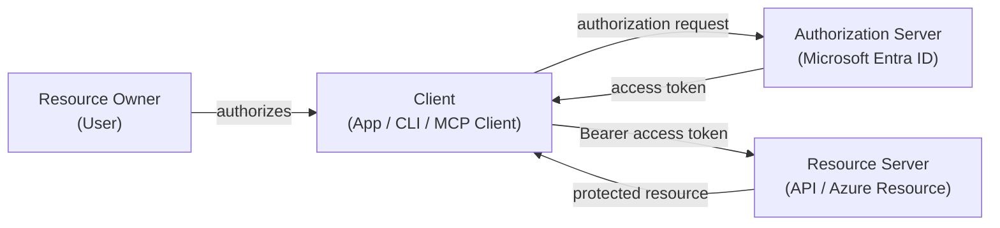

# 2. OAuth 不是登录，OIDC 才是登录层

OAuth 主要回答：

> 这个 client 能不能拿到一个 token，代表某个用户或应用去访问某个资源？

OIDC 主要回答：

> 这个用户是谁？

所以现实中常见的“Login with Microsoft / Google / GitHub”通常是 OAuth + OIDC 的组合：

- OIDC 给 client 一个 `id_token`，用于证明用户身份。
- OAuth 给 client 一个 `access_token`，用于访问 API / resource。

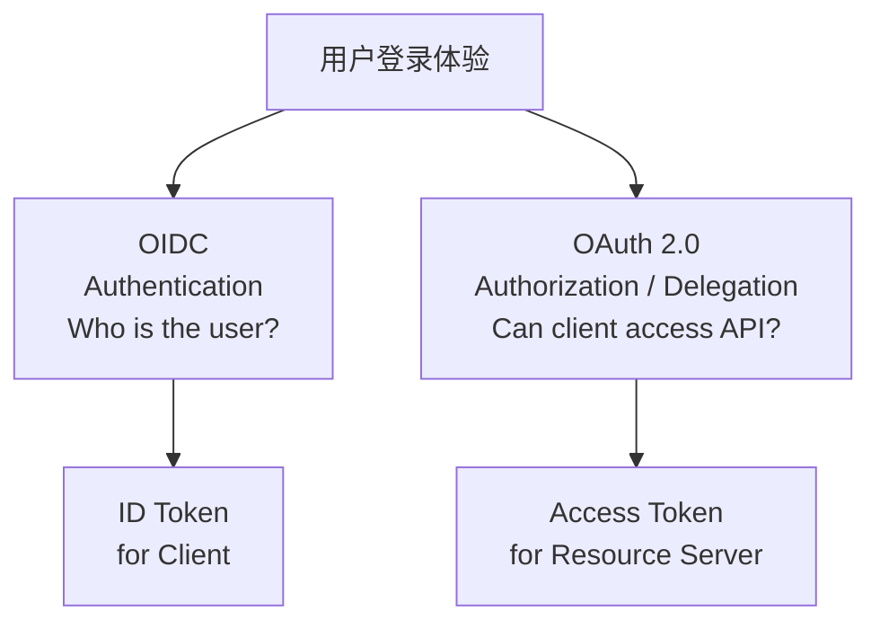

# 3. Authorization Code Flow

Authorization Code Flow 是文档里反复讨论的主流程。

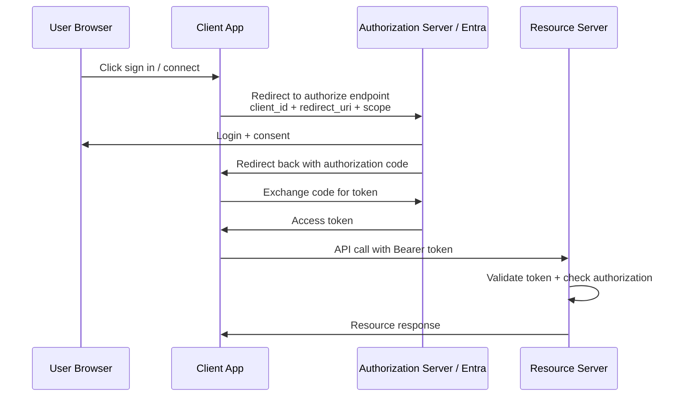

关键点：

- Authorization code 不是最终凭据，只是临时授权凭证。
- Client 要用 authorization code 去 token endpoint 换 access token。
- Authorization Server 会校验 `client_id`、`redirect_uri`、client authentication、PKCE 等信息。

# 4. Client Registration：预注册 vs DCR

OAuth client 通常要先被 Authorization Server 认识。

在 Entra 里，这通常对应 App Registration：

- `client_id`
- redirect URI
- client secret / certificate / federated credential
- allowed scopes / API permissions
- supported account types
- platform type

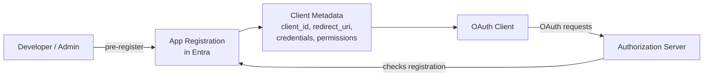

DCR, Dynamic Client Registration, 是另一种方式：client 通过标准注册 endpoint 动态注册自己。它不是 OAuth core 的一部分，而是扩展标准 RFC 7591 / RFC 7592。

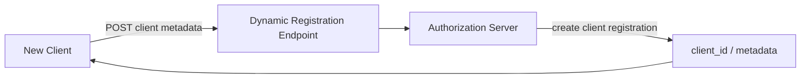

对 Entra 的更准确理解：

- Entra 主要使用预注册 App Registration 模型。
- Entra 可通过 Microsoft Graph 自动化创建应用注册，但这不等同于开放标准 RFC 7591 DCR。
- MCP 场景里常提 DCR，是因为 MCP client 可能事先不知道所有 MCP server / authorization server。

# 5. Public Client vs Confidential Client

文档里一个很关键的分界是：client 能不能安全保存 secret。

| Client 类型 | 能否安全保存 secret | 例子 | 常见 flow |
| --- | --- | --- | --- |
| Public Client | 不能 | SPA、Mobile、Desktop、CLI、很多 MCP Client | Authorization Code + PKCE |
| Confidential Client | 能 | Backend Web App、API、Daemon、Server-side App | Auth Code + client authentication，或 Client Credentials |

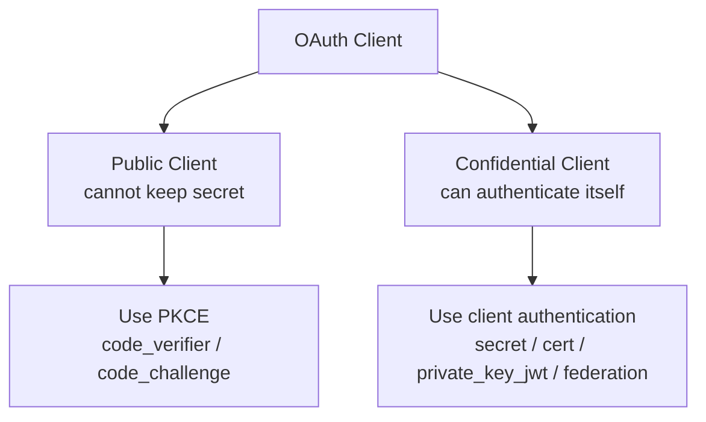

重要修正：

- client secret 不是用户密码，而是应用向 Authorization Server 证明“我是这个 client”的凭据。
- Public client 不应依赖 secret，因为 secret 会泄露。
- PKCE 可以理解为每次授权请求生成的临时证明，用来防止 authorization code 被截获后被别人换 token。
- 现代最佳实践里，即使是 confidential client，也越来越建议使用 PKCE。

# 6. Delegated Permission vs Application Permission

OAuth / Entra 里有两种很不同的权限世界。

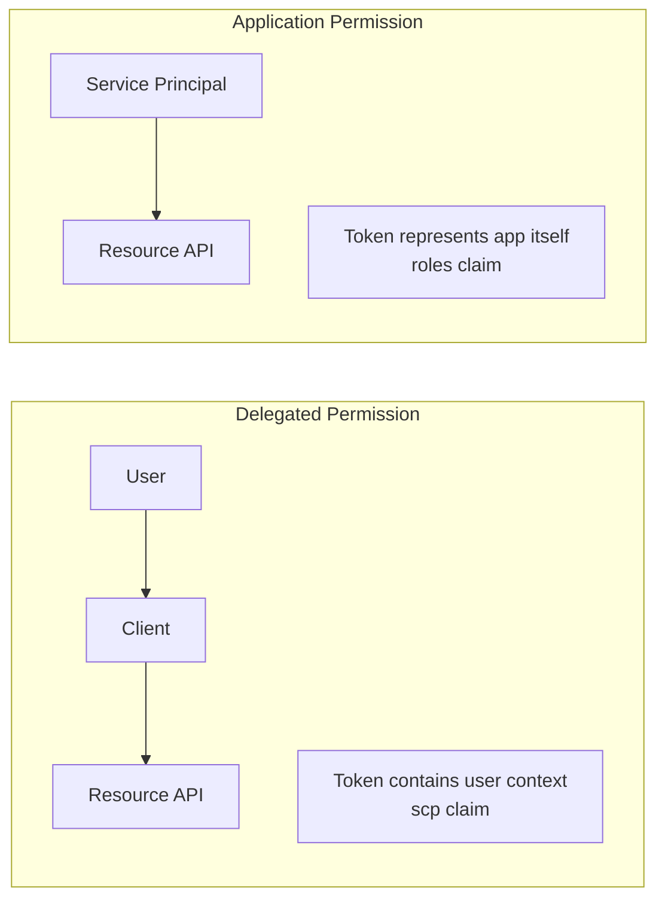

| 模式 | 是否有用户 | token 代表谁 | 常见 claim | 例子 |
| --- | --- | --- | --- | --- |
| Delegated | 有 | 用户 + client | `scp` | Web App 代表用户读 Graph |
| Application | 无 | 应用自身 | `roles` | Daemon / SPN 调 API |

Service Principal 不是 Resource Owner。它是 Entra tenant 里的安全主体，可以被 Azure RBAC 授权。

# 7. Azure 的三层模型：认证、发 Token、授权

这份文档最有价值的部分，是把 Azure 访问模型拆成三层。

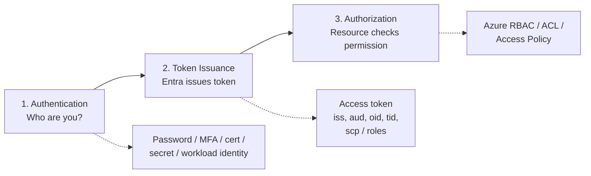

核心判断：

- Entra 负责认证和 token issuance。
- Resource Server 负责验证 token，并结合 RBAC / policy 决定是否允许操作。
- OAuth API Permission 不等于 Azure RBAC。
- 你能拿到 Storage token，不代表你一定能 delete blob；delete blob 仍然要 Storage RBAC 允许。

# 8. Azure CLI 的 Token 模型

用户问到 `az login` 后为什么能访问 ARM、Key Vault、Storage。文档的关键纠正是：这通常不是 OBO。

Azure CLI 是原始 OAuth client。它登录后可以基于自己的 token cache / refresh token / session，为不同 resource 请求不同 audience 的 access token。

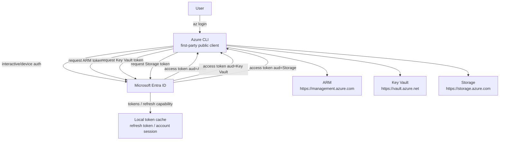

关键点：

- Access token 是 resource-specific 的。
- Graph token 不能直接访问 Key Vault。
- 能不能成功操作资源，还要看对应资源的 RBAC。
- Refresh token 不是万能票据，它绑定 user + client，并受 consent、scope、conditional access、token policy 限制。

# 9. OBO：什么时候需要 On-Behalf-Of

OBO 是中间层 API 代表用户去调用下游 API。

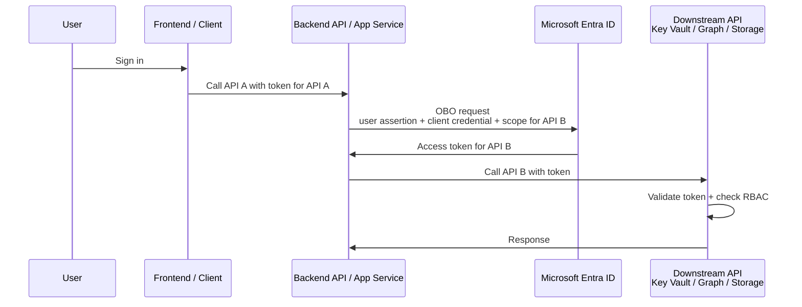

适合 OBO 的场景：

- Web App / API 收到用户请求后，要代表这个用户调用 Graph、Key Vault、Storage 等。
- 权限必须保留用户边界，不能用一个统一的 Managed Identity 覆盖所有用户差异。
- 你希望 Azure RBAC 继续决定 User A / User B 到底能读哪些 secret 或 blob。

不适合把所有东西都做成 OBO 的情况：

- 后端只是执行应用自己的固定任务。
- 不需要区分每个用户在 Azure 资源上的原生权限。
- 用 Managed Identity 更清晰、更小 blast radius。

# 10. App Service / EasyAuth 的正确理解

EasyAuth 可以帮助 App Service 做 OIDC/OAuth 登录和 token store。

但要注意：

- EasyAuth 里的 client 是 App Service Authentication 组件背后的 app registration。
- Resource 通常是你的 Web App / API，不是“Azure App Service 这个平台服务”本身。
- EasyAuth 的 token store 是和 authenticated session 关联的。
- 如果要访问下游 Azure 资源，仍然要考虑 downstream token、OBO、API permissions 和 RBAC。

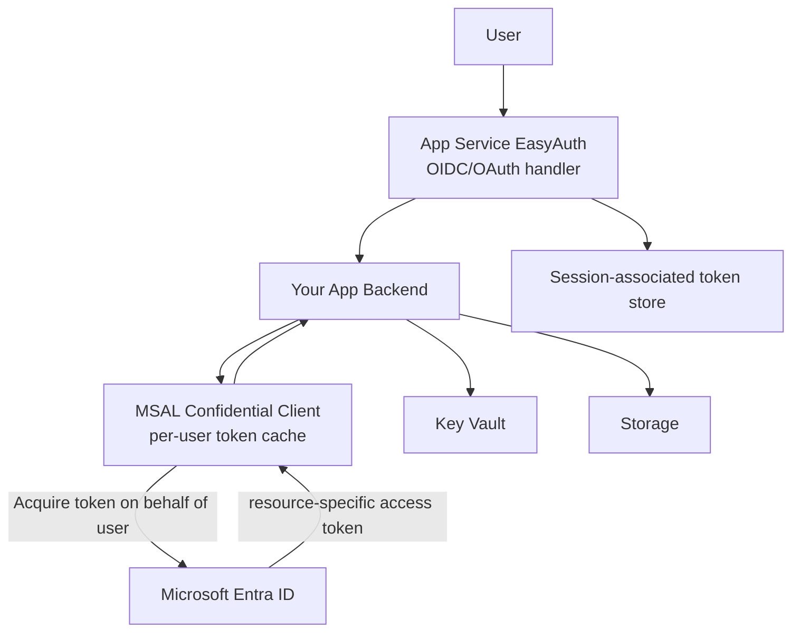

# 11. 做集中式 Azure Resource GUI 的架构建议

用户最后提出的场景是：做一个 App Service，集中图形化操作 Storage Account 和 Key Vault，并保留不同用户的权限差异。

推荐模型：

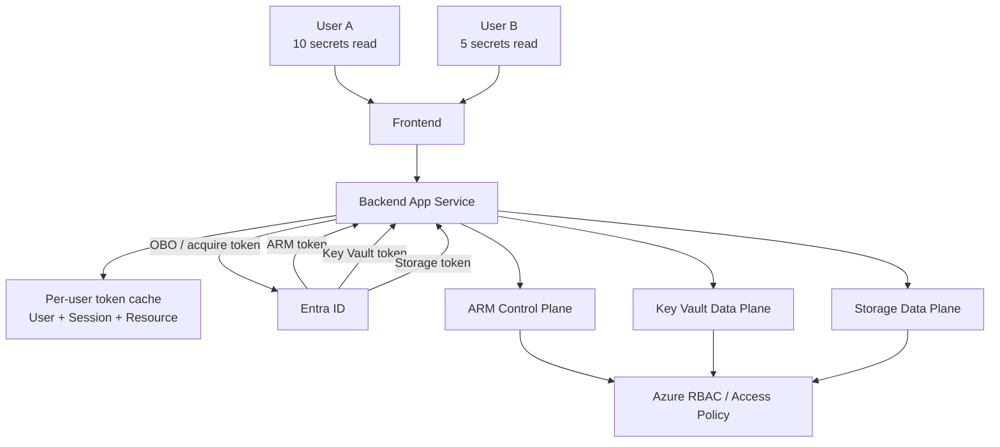

工程原则：

- 使用 delegated identity / OBO 保留用户权限边界。
- 不要用一个超大权限 Managed Identity 代表所有用户，除非你愿意自己实现完整授权系统。
- Token cache 必须按 user、session、tenant、resource/scope 隔离。
- 不要明文存 access token / refresh token。
- 尽量用 MSAL 管 token cache、refresh、rotation。
- 让 Azure RBAC 做最终 authorization，不要在应用里重造一套 Azure 权限系统。

# 12. Control Plane vs Data Plane

很多 Azure 操作可以通过 ARM 完成，但读写 secret / blob 这类数据面操作通常需要各自资源的 data plane token。

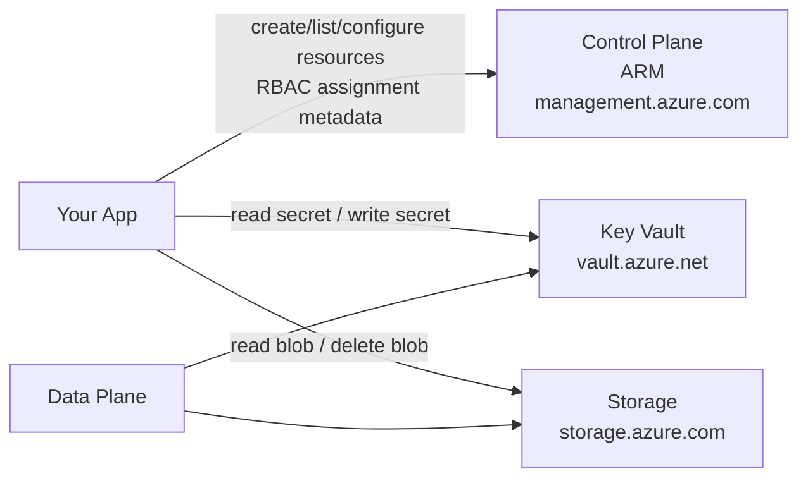

| 层 | 例子 | Token audience |
| --- | --- | --- |
| Control Plane | 创建资源、列资源、配置资源、管理 RBAC | `https://management.azure.com` |
| Key Vault Data Plane | 读 secret、写 secret | `https://vault.azure.net` |
| Storage Data Plane | 读 blob、删 blob、写 blob | `https://storage.azure.com` |

# 13. 最终心智模型

把全文压成一句话：

> OAuth/Entra 负责让某个 client 在明确边界内拿到某个 resource 的 token；Azure resource 再根据 token 中的身份和自己的 RBAC/policy 判断能不能执行操作。

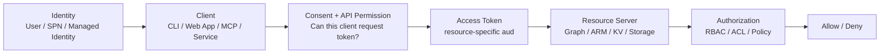

# 14. 几个必须记住的校准点

- `client_id` 标识应用，不是用户。
- `client_secret` 证明应用身份，不是用户密码。
- `id_token` 给 client 识别用户。
- `access_token` 给 resource server 授权访问。
- `aud` 决定 token 能给谁用。
- `scp` 常见于 delegated permission。
- `roles` 常见于 application permission。
- OBO 是 API 到 API 的用户委托链路，不是 Azure CLI 的常规工作方式。
- App Registration 的 API Permission 只是“能不能申请 token”的一层，不等于资源上的 RBAC。
- Refresh token 绑定 user + client + policy，不是跨资源无限制万能钥匙。
