# Python + MCP: Authentication for MCP Servers

> Readable Markdown conversion of `PythonMCP-Authentication-ForSharing.pptx`.
> Each section maps to one original slide. Visual slides and screenshots are recreated as Mermaid diagrams, tables, or code blocks.

## Slide 1 - Series Overview

**Python + MCP livestream series**

| Date | Topic |
|---|---|
| Dec 16 | Building MCP servers with FastMCP |
| Dec 17 | Deploying MCP servers to the cloud |
| Dec 18 | Authentication for MCP servers |

Registration: <https://aka.ms/pythonmcp/series>

## Slide 2 - Series Context

This session is part of a three-part Python + MCP series:

1. Building MCP servers with FastMCP
2. Deploying MCP servers to the cloud
3. Authentication for MCP servers

## Slide 3 - Session Title

# Authentication for MCP Servers

Presenter: Pamela Fox, Python Cloud Advocate

Links:

- <https://www.pamelafox.org>
- <https://aka.ms/pythonmcp/slides/auth>

## Slide 4 - Today's Agenda

This session focuses on practical ways to protect remote MCP servers:

1. Restricting access to MCP servers
2. Key-based access
3. OAuth-based access
4. Keycloak integration
5. Microsoft Entra integration

## Slide 5 - Section: Restricting MCP Server Access

The first question is simple:

> Who is allowed to call this MCP server?

Authentication and access control matter because an MCP server can expose tools, prompts, and resources that may read data, call APIs, or perform actions on behalf of a user.

## Slide 6 - Recap: MCP Architecture

MCP separates clients from servers. Clients ask for tools, prompts, and resources; servers expose them through the MCP protocol.

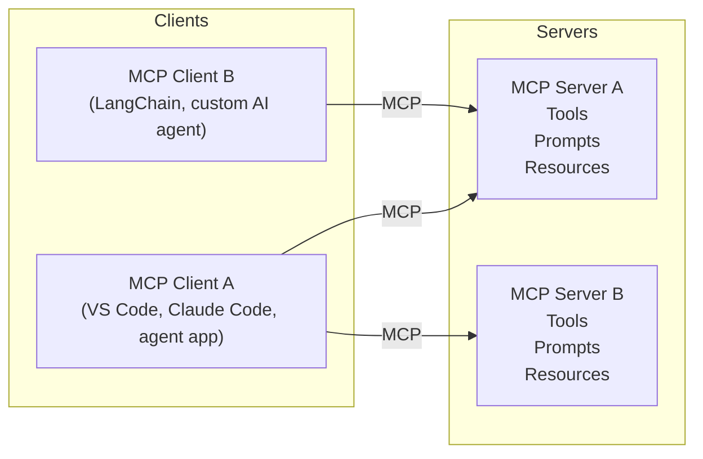

MCP clients can live inside desktop applications such as VS Code or Claude Code, or inside programmatic AI agents built with frameworks such as LangChain.

## Slide 7 - Three Ways to Restrict Access

There are three common access patterns for MCP servers.

| Approach | How access is granted | Best fit |
|---|---|---|
| Private network | Only callers inside a private network or VPN can reach the server | Internal deployments and cloud network isolation |
| Key-based access | The client sends a shared key registered with the MCP server | Simple internal tools, demos, low-friction service access |
| OAuth-based access | Access follows an OAuth flow involving user, MCP client, auth provider, and MCP server | User-specific access, production authorization, delegated access |

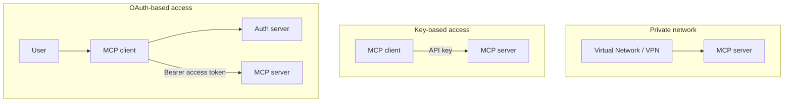

The private-network option was covered in the Dec 17 livestream. This session focuses on key-based and OAuth-based access.

## Slide 8 - Section: Key-Based Access

Key-based access is the simplest pattern:

> The MCP client includes a secret key with each request, and the MCP server accepts or rejects the request based on that key.

## Slide 9 - Key-Based Access Flow

In key-based access, the key is commonly sent in an HTTP header or query parameter.

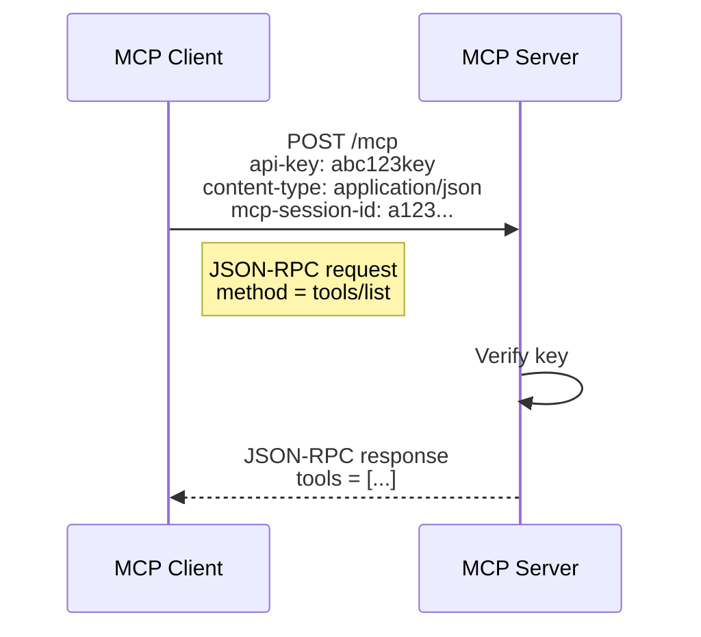

Example request:

```http
POST /mcp
api-key: abc123key
content-type: application/json
mcp-session-id: a123...
```

```json
{
  "jsonrpc": "2.0",
  "id": 1,
  "method": "tools/list"
}
```

## Slide 10 - Key-Based Access in VS Code

VS Code can prompt for a secret and inject it into MCP server headers. Marking the input as `"password": true` reduces accidental exposure.

```json
{
  "servers": {
    "tavily-mcp": {
      "url": "https://mcp.tavily.com/mcp/",
      "type": "http",
      "headers": {
        "Authorization": "Bearer ${input:tavily-key}"
      }
    }
  },
  "inputs": [
    {
      "type": "promptString",
      "id": "tavily-key",
      "description": "Tavily MCP API Key",
      "password": true
    }
  ]
}
```

Tavily MCP documentation: <https://docs.tavily.com/documentation/mcp#remote-mcp-server>

## Slide 11 - Key-Based Access in AI Agents

Agent frameworks usually let you customize the MCP URL and request headers.

LangChain example:

```python
MultiServerMCPClient({
    "tavily": {
        "url": "https://mcp.tavily.com/mcp/",
        "transport": "streamable_http",
        "headers": {"Authorization": f"Bearer {tavily_key}"}
    }
})
```

Agent Framework example:

```python
MCPStreamableHTTPTool(
    name="Tavily MCP",
    url="https://mcp.tavily.com/mcp/",
    headers={"Authorization": f"Bearer {tavily_key}"}
)
```

Demo links:

- <https://aka.ms/python-mcp-demos> - `agents/langchainv1_tavily.py`
- <https://aka.ms/python-mcp-demos> - `agents/agentframework_tavily.py`

## Slide 12 - Deploying Key-Based Access in Azure

Two Azure options are highlighted:

| Azure service | What it provides | When to use |
|---|---|---|
| Azure Functions | Basic function-key authorization | Internal tools or limited users |
| Azure API Management | API key management, policies, analytics, and developer portal | Production-ready API access at scale |

You can also build your own key management system, but managed options usually reduce operational work.

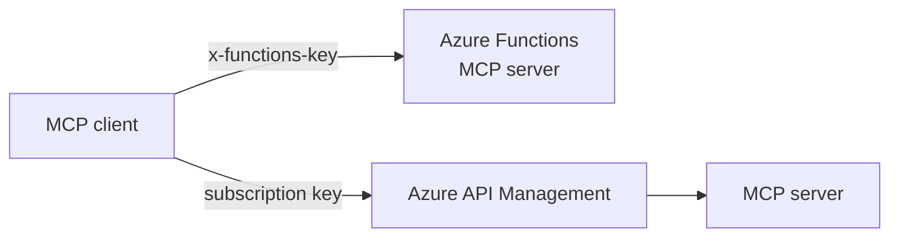

## Slide 13 - Deploying an Azure Function with Key Access

Use the Azure Functions MCP sample and switch the authorization level to function keys.

1. Open <https://github.com/Azure-Samples/mcp-sdk-functions-hosting-python>
2. In `host.json`, change `DefaultAuthorizationLevel` to `"function"`
3. Deploy with Azure Developer CLI:

```bash
azd auth login
azd up
azd env set ANONYMOUS_SERVER_AUTH true
```

## Slide 14 - Demo: Using the Deployed Function from VS Code

Add the deployed Azure Function MCP endpoint to `.vscode/mcp.json` and pass the function key as a password input.

```json
{
  "servers": {
    "deployed-mcp-server": {
      "url": "https://your-function-subdomain.azurewebsites.net/mcp",
      "type": "http",
      "headers": {
        "x-functions-key": "${input:functionapp-key}"
      }
    }
  },
  "inputs": [
    {
      "type": "promptString",
      "id": "functionapp-key",
      "description": "Server key",
      "password": true
    }
  ]
}
```

## Slide 15 - Section: OAuth-Based Access

OAuth-based access is more powerful than keys because it supports user-specific, delegated access.

Instead of asking "Does this request have the shared key?", the server can ask:

> Is this access token valid, and what user, client, audience, and scopes does it represent?

## Slide 16 - OAuth-Based Access Flow

With OAuth, the MCP client sends a bearer access token to the MCP server.

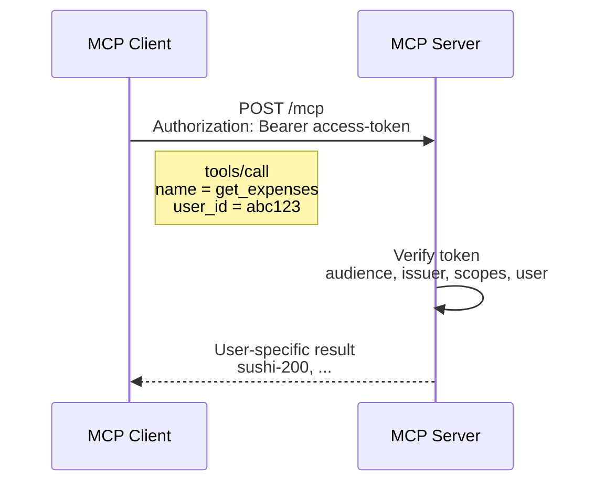

The MCP authorization spec builds on OAuth 2.1:

<https://modelcontextprotocol.io/specification/2025-11-25/basic/authorization>

## Slide 17 - OAuth 2.1 Overview

OAuth 2.1 defines four core roles. MCP maps onto those roles naturally.

| OAuth role | MCP mapping |
|---|---|
| Resource owner | The user |
| OAuth client | The MCP client |
| Authorization server | The identity/auth provider |
| Resource server | The MCP server |

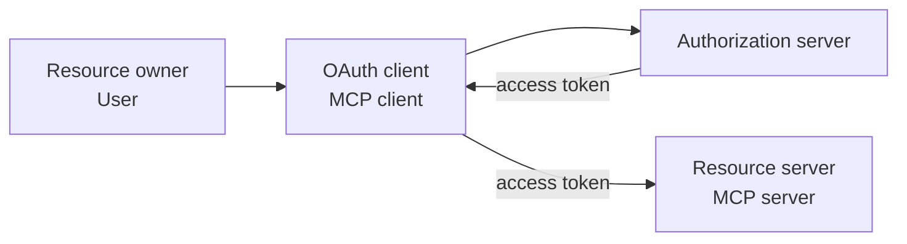

## Slide 18 - OAuth Flow for MCP, Simplified

The simplified MCP OAuth flow:

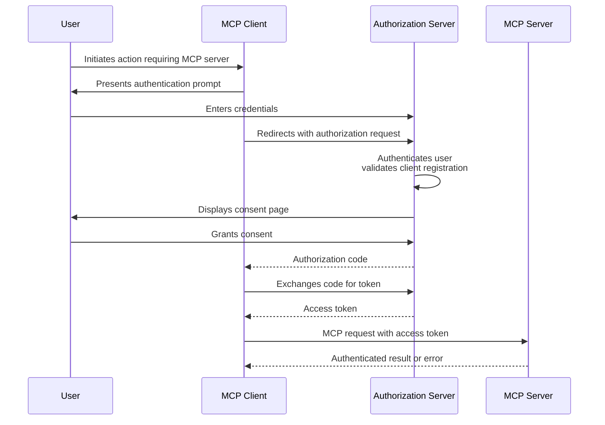

## Slide 19 - Authorization Server Discovery

Before OAuth can begin, the MCP client must discover:

- Which authorization server protects the MCP server
- Which scopes or resource metadata are required
- Which authorization and token endpoints to use

The MCP server supports discovery through Protected Resource Metadata, or PRM.

| Discovery document | Purpose |
|---|---|
| Protected Resource Metadata | Published by the MCP server; identifies authorization servers and resource metadata |
| OAuth 2.0 Authorization Server Metadata | Published by the authorization server; identifies auth/token endpoints |
| OIDC Discovery 1.0 | Alternate discovery format used by OpenID Connect providers |

The PRM URL can be discovered from a `WWW-Authenticate` header or from a well-known PRM URL.

## Slide 20 - PRM Flow: Discovering the Authorization Server

There are two PRM discovery paths.

### Option 1: `WWW-Authenticate` header

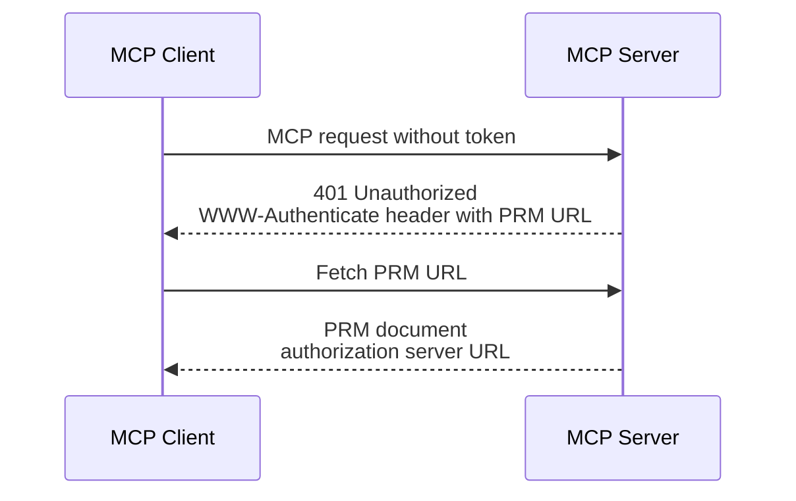

### Option 2: Well-known PRM URL

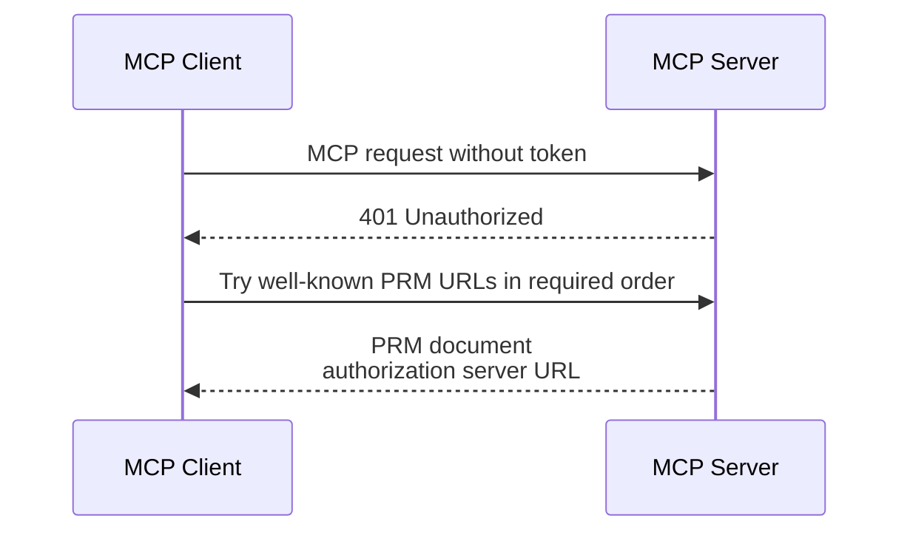

This discovery usually happens on the first unauthenticated request to the MCP server.

## Slide 21 - PRM Support in Python FastMCP Servers

FastMCP can generate the PRM routes automatically when an auth provider is configured.

```python
AuthProvider()
```

FastMCP adds:

```text
/.well-known/oauth-protected-resource
```

If you write an MCP server from scratch, you must implement the PRM route yourself.

## Slide 22 - Authorization Server Metadata Discovery

After PRM discovery, the MCP client discovers the authorization server's metadata.

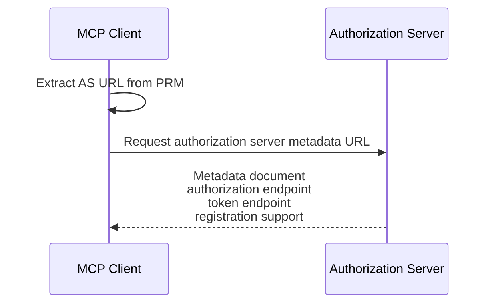

If the authorization URL includes a path, clients try:

```text
https://AUTHORIZATION-URL.COM/.well-known/oauth-authorization-server/PATH
https://AUTHORIZATION-URL.COM/.well-known/openid-configuration/PATH
https://AUTHORIZATION-URL.COM/PATH/.well-known/openid-configuration
```

If the authorization URL has no path, clients try:

```text
https://AUTHORIZATION-URL.COM/.well-known/oauth-authorization-server
https://AUTHORIZATION-URL.COM/.well-known/openid-configuration
```

## Slide 23 - OAuth Flow for MCP, Revisited

The full flow now includes the discovery phase before the user-facing login and consent phase.

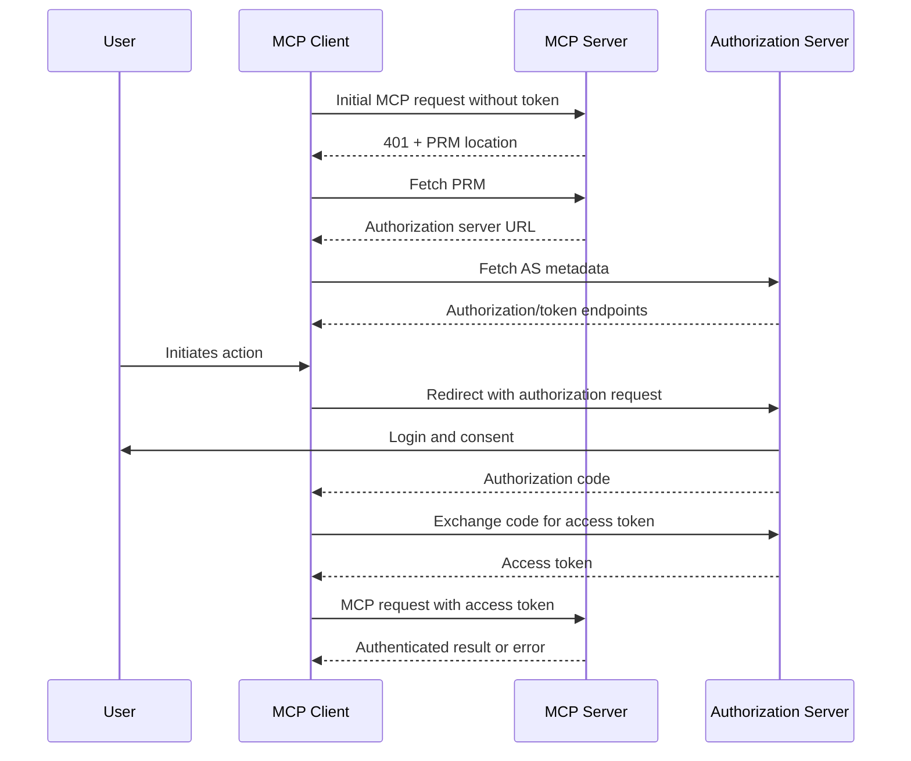

## Slide 24 - How the Authorization Server Validates the Client

The authorization server must decide whether it recognizes and trusts the MCP client.

| Question | If yes | If no |
|---|---|---|
| Does the authorization server already know the MCP client? | Use pre-registration | Client needs another registration path |
| Do the authorization server and client support CIMD? | Use Client Identity Metadata Document | Fall back to DCR if supported |

Key terms:

| Term | Meaning |
|---|---|
| CIMD | Client Identity Metadata Document. The client ID is a URL pointing to metadata. This is the most common path in newer MCP auth. |
| DCR | Dynamic Client Registration. The client registers itself with the authorization server before the OAuth flow. Legacy fallback. |

## Slide 25 - Client Identity Metadata Document

With CIMD, the client ID is a URL to a metadata document.

Example:

```json
{
  "client_id": "https://app.example.com/oauth/client-metadata.json",
  "client_name": "Example MCP Client",
  "client_uri": "https://app.example.com",
  "logo_uri": "https://app.example.com/logo.png",
  "redirect_uris": [
    "http://127.0.0.1:3000/callback",
    "http://localhost:3000/callback"
  ],
  "grant_types": ["authorization_code"],
  "response_types": ["code"],
  "token_endpoint_auth_method": "none"
}
```

VS Code example: <https://vscode.dev/oauth/client-metadata.json>

## Slide 26 - CIMD Flow

In the CIMD flow, the authorization server recognizes that `client_id` is a URL, fetches the metadata document, and validates it.

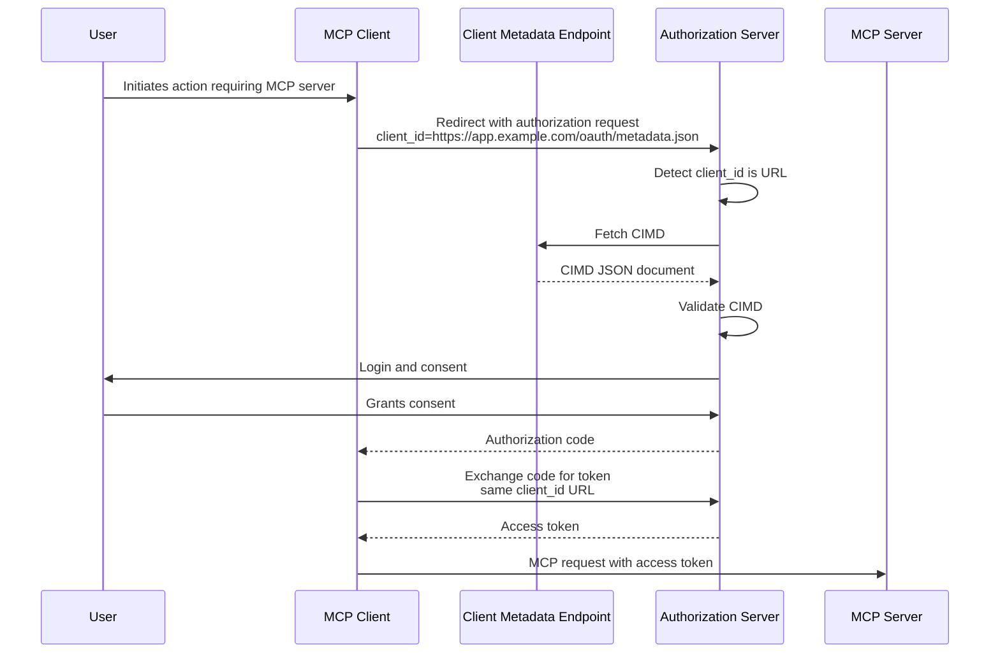

## Slide 27 - DCR Flow

Dynamic Client Registration adds one setup step before the normal OAuth flow.

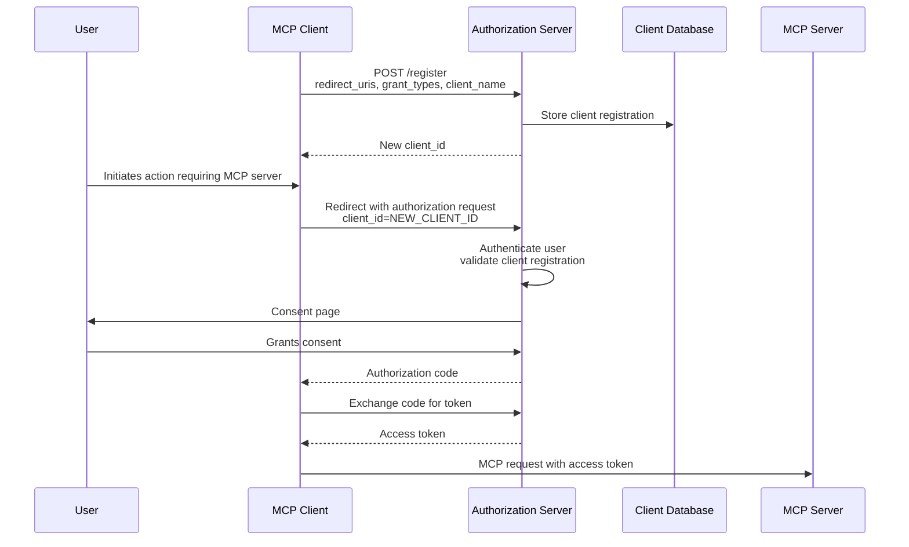

Only the initial client-registration step differs from a standard OAuth 2.1 flow.

## Slide 28 - Support for the Full MCP Authorization Spec

The full MCP authorization spec depends on several capabilities:

| Capability | Why it matters |
|---|---|
| PRM | Lets the MCP client discover the protected resource metadata |
| Authorization server metadata discovery | Lets the client discover authorization and token endpoints |
| Client validation | Lets the authorization server identify the MCP client |
| CIMD or DCR | Lets clients work without manual pre-registration |
| Token verification | Lets the MCP server validate access tokens before serving data |

## Slide 29 - OAuth Support in Python FastMCP Servers

FastMCP provides several auth provider patterns.

| Provider pattern | What it is for | DCR support |
|---|---|---|
| `RemoteAuthProvider` | Use an external auth provider that already handles MCP-compatible OAuth | Depends on provider |
| `OAuthProvider` | Build or customize OAuth behavior directly | Depends on implementation |
| `OAuthProxy` | Add a proxy layer when the upstream identity provider lacks full MCP auth support | Can provide DCR |

Provider examples:

| DCR support | Providers |
|---|---|
| Yes | `DescopeProvider`, `SupabaseProvider`, `ScalekitProvider`, `AuthKitProvider` |
| No or needs proxy/pre-registration | `Auth0Provider`, `AzureProvider`, `AWSCognitoProvider`, `OCIProvider`, `DiscordProvider`, `GitHubProvider`, `GoogleProvider`, `WorkOSProvider` |

## Slide 30 - Remote OAuth with Full DCR Support

The cleanest OAuth path is to use a hosted provider that already supports the MCP authorization requirements, including dynamic client registration.

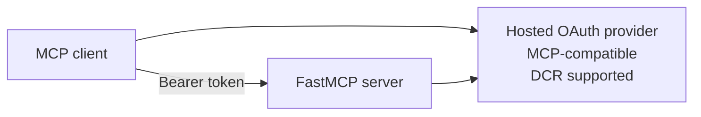

This keeps the FastMCP server focused on validating tokens and serving MCP requests.

## Slide 31 - Using Remote OAuth in a Python FastMCP Server

Example using ScaleKit:

```python
from fastmcp.server.auth.providers.scalekit import ScalekitProvider

auth_provider = ScalekitProvider(
    environment_url=SCALEKIT_ENVIRONMENT_URL,
    resource_id=SCALEKIT_RESOURCE_ID,
    base_url=MCP_SERVER_URL,
    required_scopes=["read"],
)

mcp = FastMCP(name="My MCP server", auth=auth_provider)
```

ScaleKit is presented as a hosted provider with full MCP auth support.

## Slide 32 - Keycloak: Open-Source Identity Server

Keycloak is an open-source OAuth 2.1 compliant identity server. It can be deployed with Docker and used as the authorization server for MCP auth.

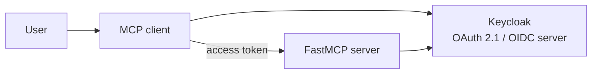

Keycloak supports DCR, but the deck notes that there are still open issues requiring workarounds.

## Slide 33 - Integrating Keycloak with FastMCP

The example uses a custom subclass of `RemoteAuthProvider` to work around Keycloak DCR issues.

```python
from fastmcp.server.auth import RemoteAuthProvider


class KeycloakAuthProvider(RemoteAuthProvider):
    def __init__(
        self,
        *,
        realm_url: AnyHttpUrl | str,
        base_url: AnyHttpUrl | str,
        required_scopes: list[str] | None = None,
        audience: str | list[str] | None = None,
        token_verifier: JWTVerifier | None = None,
    ):
        ...
```

Configuration example:

```python
auth = KeycloakAuthProvider(
    realm_url=KEYCLOAK_REALM_URL,
    base_url=keycloak_base_url,
    required_scopes=["openid", "mcp:access"],
    audience=keycloak_audience,
)
```

Demo files:

- <https://aka.ms/python-mcp-demos> - `servers/keycloak_provider.py`
- <https://aka.ms/python-mcp-demos> - `servers/auth_mcp.py`

## Slide 34 - Deploying the Example Server with Keycloak

Deployment steps:

1. Open <https://aka.ms/python-mcp-demos>
2. Follow the README section "Deploy to Azure with Keycloak"
3. Run:

```bash
azd auth login
azd env set MCP_AUTH_PROVIDER keycloak
azd env set KEYCLOAK_ADMIN_PASSWORD "YourSecurePassword123"
azd up
```

## Slide 35 - Demo: Using the Authenticated Server in VS Code

The demo shows VS Code initiating authentication against a Keycloak login screen.

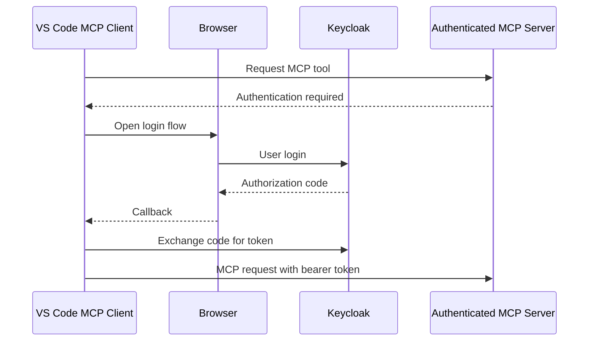

## Slide 36 - Section: Entra via OAuth Proxy

Microsoft Entra can be used as the upstream identity provider, but it does not provide DCR in the way MCP clients may need.

The solution shown here is an OAuth proxy:

> The proxy makes Entra work with MCP-style client registration and token expectations.

## Slide 37 - Entra Support via OAuth Proxy

To compensate for Entra's lack of DCR support, FastMCP can put an OAuth proxy between the MCP client and Entra.

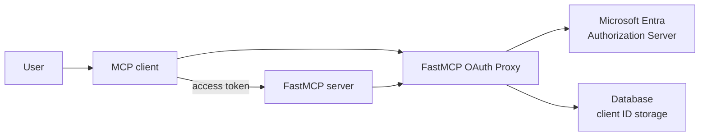

The proxy stores MCP client registrations and bridges the MCP auth expectations to Entra.

## Slide 38 - Integrating Entra with FastMCP

FastMCP provides `AzureProvider`, a subclass of `OAuthProxy`, to implement DCR-like behavior in front of Entra.

```python
from fastmcp.server.auth.providers.azure import AzureProvider

oauth_container = cosmos_db.get_container_client(
    os.environ["AUTH_CONTAINER"]
)

oauth_client_store = CosmosDBStore(
    container=oauth_container,
    default_collection="oauth-clients",
)

auth = AzureProvider(
    client_id=os.environ["ENTRA_PROXY_AZURE_CLIENT_ID"],
    client_secret=os.environ["ENTRA_PROXY_AZURE_CLIENT_SECRET"],
    tenant_id=os.environ["AZURE_TENANT_ID"],
    base_url=os.environ["ENTRA_PROXY_MCP_SERVER_BASE_URL"],
    required_scopes=["mcp-access"],
    client_storage=oauth_client_store,
)
```

Demo file:

- <https://aka.ms/python-mcp-demos> - `servers/auth_mcp.py`

## Slide 39 - Deploying the Example Server with Entra Proxy

Deployment steps:

1. Open <https://aka.ms/python-mcp-demos>
2. Follow the README steps for "Deploy to Azure with Entra OAuth Proxy"
3. Run:

```bash
azd auth login
azd env set MCP_AUTH_PROVIDER entra_proxy
azd env set AZURE_TENANT_ID your-tenant-id
azd up
```

## Slide 40 - Demo: Using the Authenticated Server in VS Code

The demo shows VS Code authenticating through the FastMCP OAuth proxy before calling the MCP server.

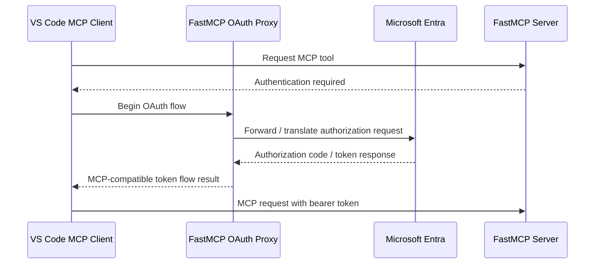

## Slide 41 - Alternative: Only Support Pre-Registered Clients

If your MCP server only needs to support known clients, you can avoid DCR.

Known client IDs can be pre-authorized:

| Client | Example |
|---|---|
| VS Code | `aebc6443-996d-45c2-90f0-388ff96faa5` |
| Other Microsoft products | Product-specific known client IDs |
| Your own applications | Your registered app/client IDs |

This is simpler than DCR, but it means arbitrary MCP clients cannot connect without prior registration.

## Slide 42 - Deploying Azure Functions with Pre-Registration

Use the Azure Functions MCP sample and pre-authorize known client IDs.

1. Open <https://github.com/Azure-Samples/mcp-sdk-functions-hosting-python>
2. Follow the README deployment instructions
3. Run:

```bash
azd env set PRE_AUTHORIZED_CLIENT_IDS aebc6443-996d-45c2-90f0-388ff96faa56
azd up
```

Architecture:

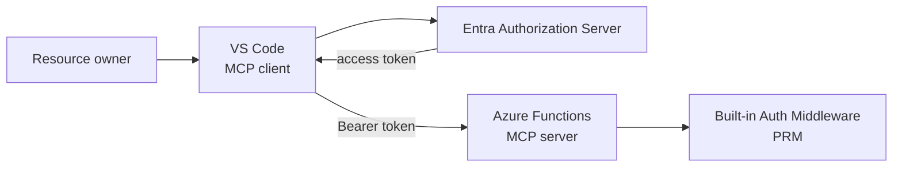

## Slide 43 - Next Steps

Resources:

- Watch past recordings: <https://aka.ms/pythonmcp/resources>
- Come to office hours in Discord: <https://aka.ms/pythonai/oh>
- Learn from MCP for Beginners: <https://aka.ms/mcp-for-beginners>

Series recap:

| Date | Topic |
|---|---|
| Dec 16 | Building MCP servers with FastMCP |
| Dec 17 | Deploying MCP servers to the cloud |
| Dec 18 | Authentication for MCP servers |

## Overall Mental Model

Use this quick decision table when choosing an access model:

| Need | Prefer |
|---|---|
| Only private internal traffic should reach the server | Private network / VPN |
| Simple shared secret is enough | Key-based access |
| User-specific access and delegated permissions are required | OAuth-based access |
| Auth provider fully supports MCP auth and DCR | `RemoteAuthProvider` with that provider |
| Auth provider lacks DCR but should still support arbitrary MCP clients | OAuth proxy |
| Only known clients need access | Pre-registration |

