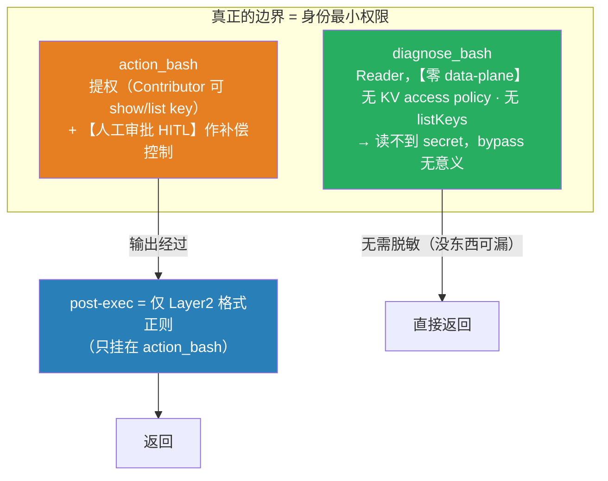

# 从输出脱敏到身份边界：认知收敛与 Layer2 终稿

> **这是一次认知拐点，也是本专题的落点。**
>
> 上一篇《[输出脱敏对任意 bash 输出的健壮性](设计-输出脱敏对任意bash输出的健壮性-分支流程与fallback取舍.md)》一路在试图把「后置输出擦除器」做稳——`raw_decode` 提取 JSON 片段、确定性 scope 兜底、删掉靠不住的熵。走到那条路的尽头，才看清一件事：**无论把擦除器打磨得多确定、多稳，它都不是安全边界**——只要调用方能塑形输出（藏命令、改字段名、重编码），后置脱敏就能被绕过。
>
> 于是结论从「怎么把脱敏做对」翻转成「**脱敏根本不该承担边界职责**」：边界交给**身份最小权限**；脱敏退回到 **Layer2 格式正则**这一层纯 hygiene，且只挂在真正会读到 secret 的 `action_bash` 上。

---

## 1. 压垮结构派的两个 bypass

| bypass | 例子 | 为什么破 |
|---|---|---|
| **scope 判定失效** | `svc=keyvault` `az "$svc" secret show …` | scope 是对**命令字符串**做静态正则；真正命令要到 shell 变量展开后才成形。变量 / `eval` / 别名 / base64 解码再跑，静态匹配就瞎了 → scope=False → 连上一篇 §8 的 in-scope 兜底都不触发。 |
| **jq 改字段名** | `az keyvault secret show -o json \| jq '{"value":.value,"leak":.value}'` | 就算 scope 命中、按字段名打码，`leak` 这个新名字不在敏感集合里 → secret 从 `leak` 原样漏出。改名 / reshape 废掉一切字段法。 |

**结论：对「能跑任意 bash」的威胁模型，后置输出脱敏本质无解**——对手能藏命令（躲 scope）、改字段名（躲字段法）、重编码值（`| base64` 躲格式正则）。它是 **hygiene，不是 boundary**。这也是 DLP 的经典结论：在一个由不可信方控制的输出通道上做内容过滤，永远不是安全边界。

---

## 2. 最终架构：边界在身份层，脱敏退回纯 hygiene

- **diagnose = Reader，零 data-plane。** 纯 Reader（ARM `*/read`）**读不到 KV secret 值**（access-policy 模式要单独 policy、RBAC 模式要 Secrets User）、**列不出 storage key**（`listKeys` 是管理面 `/action`，不在 `*/read`）。读取那一步就被身份挡死，§1 两个 bypass 因此**归零**——命令再怎么塑形，数据根本没回来。
  - 诚实 caveat：Reader ≠ 完全看不到 secret。管理面读的长尾（`webapp config appsettings list`、某些资源 `properties` 里的连接串、automation 变量…）仍会把 secret 吐给 Reader。这类要么进一步收紧 diagnose 自定义角色去 deny，要么接受（低危）——**不是靠脱敏补**。
- **action = 提权 + 审批。** action SP 是 Contributor，**能 `show` / `list` key**。特权读的正确归属就是这里：elevated + 人工审批（HITL）作补偿控制。
- **post-exec 脱敏 = 只留 Layer2，且只挂 action_bash。** diagnose 零 data-plane、没东西可漏，不必挂；只有 action 会真读到 key，才需要 Layer2 兜住高危**格式**。
  - 为什么不再对 action 做字段级 value 打码？因为 action 的读是**人工审批过的**——读一条 KV secret 的 value 往往就是审批的**目的**，把它 mask 掉反而误事。Layer2 只兜「账户级长期凭据」这种**即使批了也不该落盘**的东西。

---

## 3. Layer2 到底防住什么（也是它为什么值得单独留下）

Layer2 只看**值本身的格式**，不看命令、不看字段名 → §1 两个 bypass（scope 躲、jq 改名）**都打不掉它**，这正是它区别于字段法的价值。

| 凭据 | 正则（现有 / 待补） | 为什么必须挡（即使 elevated） |
|---|---|---|
| **Storage account key** | `(?<![A-Za-z0-9+/])[A-Za-z0-9+/]{86}==`（现有） | **账户级、长期有效、读写删全权。审批授权的是「执行这个操作」，不是「把账户主钥打进 transcript / 日志 / agent 上下文」。这类哪怕 elevated 也绝不回显。** |
| SAS 签名 | `\bsig=…`（现有） | 可携带的预签名授权，泄露即可直接用 |
| 连接串内凭据 | `(AccountKey\|SharedAccessKey\|Password\|pwd)=…`（现有） | 连接串里嵌的长期密钥 |
| JWT / bearer | `eyJ…` / `bearer …`（现有） | 可直接冒充调用的令牌 |
| PEM 私钥 | `BEGIN … PRIVATE KEY …`（现有） | 私钥本体 |
| **Function key / host key** | **待补**（~44–56 字符 base64url，特征偏弱） | Function 调用密钥；**现有正则未覆盖**，需引入成熟 rule pack（见 §4） |

> 架构级加固（治本）：storage 尽量**别用 account key** —— 用 `--auth-mode login`(AAD) 或短时 **user-delegation SAS**，从源头缩小 key 的暴露面。Layer2 是万一 key 还是被 `list` 出来时的最后一道遮挡。

**Layer2 的边界（诚实）**：只防你写了 pattern 的格式；`| base64` 重编码仍漏；无固定格式的新型 secret 仍漏。所以它是 hygiene，**边界始终是身份**。

---

## 4. 研究：用成熟的 secret-scanning（"git leak"）做更强的 Layer2？

调研了三个主流工具，能不能替我们手写的那 6 条正则：

| 工具 | 机制 | 对我们的适配 |
|---|---|---|
| **gitleaks** | 规则优先，150+ 条 regex（`gitleaks.toml`）+ 熵作辅助；单 Go 二进制、极快、无网络 | 规则集是**目前最全的维护版 regex**（含 Azure）。二进制 shell-out per call 有延迟，但**可把它的 regex 直接 vendor 进我们的 Python Layer2** |
| **trufflehog** | 800+ detector + **live verification**（调 provider API 确认 key 是否有效），`--only-verified` 近零 FP | **不适合 inline**：验证要网络往返，且「MCP 把候选 secret 发给 provider 去验活」本身就是一次副作用 / 外泄。**排除** |
| **detect-secrets**（Yelp） | Python 库，plugin 架构（~27 detector），`RegexBasedDetector` 基类可加自定义正则；含可选熵 / keyword plugin | **最省事的嵌入**：本身就是 Python，直接 in-process 跑它的 regex plugins；Azure 覆盖偏薄但可用 `RegexBasedDetector` 补 |

（NC State 研究：各工具 true-positive 重叠仅 18–76%，无单一工具全覆盖 → 取其**正则规则集**即可，不必上多工具。）

**结论：**

- **值得做**：用成熟 rule pack **替换 / 扩充**手写的 6 条 Layer2 正则 → 一次性拿到 function key / SAS / 连接串 / 跨云凭据的社区维护覆盖。
- **怎么接**：优先 **detect-secrets**（Python，in-process，`RegexBasedDetector`）或 **vendor gitleaks 的 Azure regex**；**regex-only**。
- **不要**：熵 plugin（同上一篇 §4 的短串盲 + FP）；trufflehog 的 live verification（inline 不适用）。
- **不变**：再强的 ruleset 也是 hygiene；边界还是身份最小权限。

---

## 5. 落地 to-do（终稿）

- [ ] **diagnose 锁死零 data-plane**：撤销本次测试期加的 access policy（diagnose 在 3 vault 上的 get/list），恢复纯 Reader。
- [ ] **main.py**：`redact_result` **只在 `group == "action"` 时调用**；diagnose 分支不挂脱敏。
- [ ] **redact.py 砍成 Layer2-only**：移除 Layer1/1b（`_mask_json` / `_SENSITIVE_KEY` / `_CMD_VALUE_SCOPES` / `mask_ambiguous`）与 Layer3（`_shannon` / 熵相关）；保留并**扩充已知格式正则**。
- [ ] **Layer2 引入 rule pack**：detect-secrets 或 vendored gitleaks regex，补上 **function key** 等；storage key / SAS / 连接串 / JWT / PEM / bearer 必保。
- [ ] **架构**：storage 优先 `--auth-mode login` / user-delegation SAS，减少 account key 回显面。
- [ ] 回归用例：action 路径下 storage key（含 jq 改名 `leak` 字段、`| base64` 反例）、SAS、连接串必被 Layer2 命中；diagnose 路径确认**根本读不到** key（Forbidden），不依赖脱敏。

---

## 参考

- gitleaks — <https://github.com/gitleaks/gitleaks>
- trufflehog（find / verify / analyze）— <https://github.com/trufflesecurity/trufflehog>
- detect-secrets（Yelp）plugins — <https://github.com/Yelp/detect-secrets/blob/master/docs/plugins.md>
- gitleaks vs trufflehog 对比 — <https://appsecsanta.com/secret-scanning-tools/gitleaks-vs-trufflehog>
