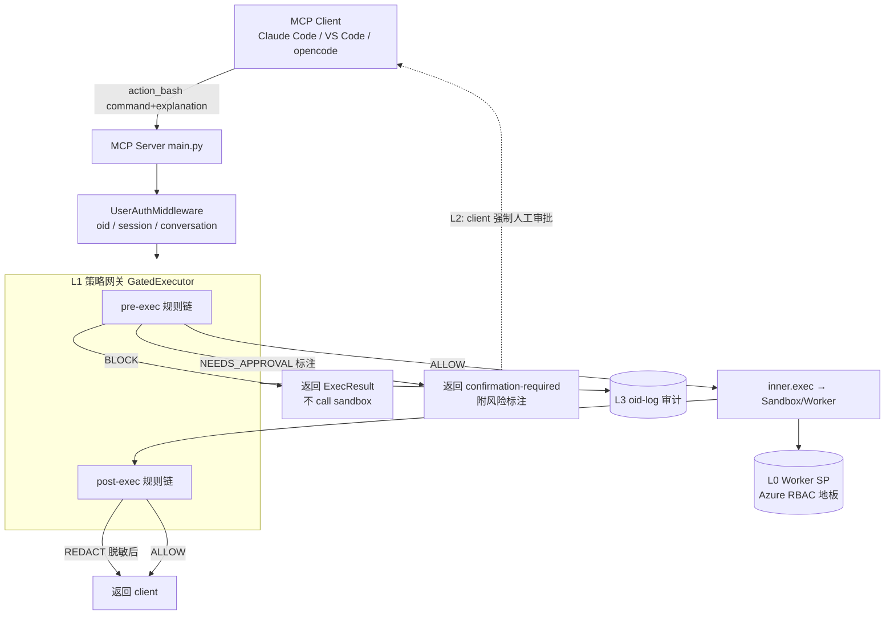

# action_bash 策略网关与人工审批 —— 设计与实施方案

> 本文把「给 `action_bash` 加一道 policy gate + 人工审批」这条线的多轮讨论收敛成一份可落地的实施方案。
> 涉及代码：`src/mcp-server/main.py`（tool 定义、`_exec`）、`src/mcp-server/executor.py`（`Executor` 协议、
> `SessionCtx`、`ExecResult`）。关联文档：[`multi-client 接入对比`](../multi-client-implementation/MCP-自定义Client接入-Entra与各Agent客户端支持对比.md)（client 审批能力 §10）、`oid-log-tracking/`（审计）。

---

## 0. 结论先行（TL;DR）

1. **威胁模型已收敛**：本服务是**企业内部**服务，client 都在 Entra 预注册（VS Code / Claude Code / opencode），
   **「恶意 client」不在范围内**。真正要防的是 **可信 client 被 prompt injection**，进而生成恶意/超范围命令。
   → 这让设计**大幅变薄**：可以**扔掉带外审批、PIM 等重家伙**，靠「server 端 gate + client 内人工审批」即可。

2. **四层纵深防御**（各司其职，缺一层就漏）：

   | 层 | 机制 | 位置 | 防什么 | 现状 |
   |---|---|---|---|---|
   | L0 地板 | Worker SP 的 Azure RBAC（diagnose=Reader / action=Contributor） | Azure | 封顶爆炸半径 | ✅ 已有 |
   | L1 策略网关 | `GatedExecutor`：pre-exec 拦截 + post-exec 脱敏 | MCP server | 自动挡明显攻击、给人风险标注、脱敏 | 🔨 本方案 |
   | L2 人工审批 | tool 级强制审批（`requiresUserInteraction` / `eligibleForAutoApproval` / `ask`） | client（fleet 锁定） | 让真人对放行的命令拍板 | 🔨 本方案 |
   | L3 审计 | oid-log 用户归因 | server + Azure Log | 事后追责、抓漏网 | 🔨 进行中 |

3. **最关键的两个认知**：
   - **人工审批为什么在注入场景有效**：注入攻陷的是「模型的意图」，**不是 client 的 harness 代码、也不是那个人**。
     可信 client 照样弹审批框、照样要真人点批准，注入点不了那个按钮。**所以 client 内审批就够，不需要带外。**
   - **gate 不是可有可无**：光弹一个原始命令框，很容易被伪装成人畜无害的注入 rubber-stamp（approval fatigue）。
     **gate 负责「自动挡掉明显攻击 + 给人附上风险标注」**，让人工审批真正有意义。二者是配套，不是二选一。

4. **最薄的强制审批点**：Claude Code 用 **server 端 `_meta["anthropic/requiresUserInteraction"]=true`**（一处声明、
   自动强制、连 `--permission-prompt-tool` 的 allow 都被转 deny）。VS Code 用 MDM 锁 `eligibleForAutoApproval:false`。
   **opencode 是弱链**（无 server 端强制、无企业锁、无 elicitation），需在取舍中特殊对待。

5. **一个必须先补的缺口**：`action_bash` 的 `explanation` 目前只被打了日志，**没有透传进 executor**
   （`main.py:_exec` 只传 `command`）。要做「意图 vs 命令」比对，先把 `explanation` 顺 `SessionCtx` 传下去。

6. **别依赖 `destructiveHint`**：它只是 hint，不是审批闸门，client 没义务因它弹窗。

---

## 1. 背景与现状

### 1.1 两个 bash tool 的现状（`src/mcp-server/main.py`）

| Tool | 参数 | 权限边界 | 是否强制 explanation |
|---|---|---|---|
| `diagnose_bash` | `command` | 只读（Reader） | ❌ 只有 command |
| `action_bash` | `command` + `explanation` | 写（Contributor） | ✅ `explanation` 必填 |

- `action_bash` 的 `explanation` docstring 要求：一句话说明「命令干什么 + blast radius（影响范围）」。
  → **这正是语义 gate 需要的「purpose（意图）」原材料，已经在参数里了。**
- **缺口**：`main.py` 的 `_exec(group, command, ctx)` 只把 `command` 往下传，`explanation` 在 `action_bash` 里
  只做了 `logger.info`，**没进 `SessionCtx` / executor**。gate 若放在 executor 层，现在拿不到 `explanation`。

### 1.2 执行层的接缝（`src/mcp-server/executor.py`）

```
main.py.action_bash → _exec() → executor.exec(SessionCtx, command) → LocalDockerExecutor / SandboxManager
```

- `Executor` 是一个 `Protocol`（`exec()` + `aclose()`），本地 Docker 与 ACA Sandbox 都实现它。
- `ExecResult = {exit_code, stdout, stderr, truncated}`；`SessionCtx = {user_oid, session_id, conversation_id, group}`。
- **这就是 gate 的天然落点**：包一层 `GatedExecutor`，它自己也实现 `Executor`，对 `main.py` 完全透明，
  对下游 sandbox 也完全透明——**纯加一层，不改 tool 逻辑、不改 sandbox。**

---

## 2. 威胁模型（本方案的边界）

### 2.1 在范围内

- **可信 client 被 prompt injection**：agent 读到被投毒的数据（资源 tag、pipeline 输出、外部文档），
  被诱导对 `action_bash` 生成**恶意或影响面远超声称意图**的命令。
- **模型手滑 / 幻觉**：模型自作主张跑破坏性命令。
- **输出侧泄漏**：`az` 命令回吐 secret / 连接串 / token / PII，或输出里夹带二次注入指令。

### 2.2 不在范围内（已排除）

- **恶意 client**：client 都在 Entra 预注册、企业管控（见 multi-client 文档），不假设 client 软件本身作恶。
  → 因此**不需要**：带外审批通道（Teams/Slack 审批 bot、Entra 审批网页）、Azure PIM 按需激活、four-eyes 强制。
  这些是为「恶意 client」准备的，本模型下是过度设计。

### 2.3 为什么这个边界让「client 内审批」重新变得可信

> **prompt injection 攻陷「模型意图」，不攻陷「client harness」，也不攻陷「人」。**

被注入的模型**想**跑坏命令，但可信 client 的 harness 仍会强制审批闸、仍要真人批准。注入无法点那个按钮。
所以在本模型下，**client 内人工审批 = 一道真实控制**，而非仅仅是 UX。这是整套「薄设计」成立的地基。

**但薄设计成立有三个前提（缺一即漏）**：
1. **那个人关不掉闸**（否则图省事开 YOLO → 注入长驱直入）→ 审批必须 fleet 锁定。
2. **那个人判得了命令**（否则被伪装成无害的注入骗着点同意）→ 需要 L1 gate 自动挡 + 风险标注。
3. **审批看到的 = 实际执行的**（防掉包/TOCTOU）→ 由可信 client 的显示保证 + gate 侧命令绑定。

---

## 3. 总体架构



- **L2 的人工审批发生在 client 内**：server 把 `action_bash` 标成「必须人工确认」，client 弹框，人点批准后
  才真正走到执行。server 端**不需要**去「中断对话」——它只负责「没到位就不执行」，中断是 client 的 UX 职责。
- **L1 gate 的 pre/post 都在同一个 `GatedExecutor`** 里：pre 看 `command+explanation+ctx`，post 看 `ExecResult`。

---

## 4. L1 策略网关（Policy Gate）设计

### 4.1 抽象：Rule / Verdict / Pipeline（可扩展是硬需求）

参照 Guardrails AI 的 `Validator` + `on_fail` 形状，让「以后随便加 rule」成立：

- **`Rule`（Check）接口**，每条规则声明：
  - `phase`: `PRE_EXEC`（看 command+explanation+ctx）或 `POST_EXEC`（看 ExecResult）
  - `applies_to`: 适用 group（如仅 `action`）
  - `evaluate(...) -> Verdict`
- **`Verdict`（不止 allow/block）**：
  - `ALLOW` —— 放行
  - `BLOCK` —— 直接返回（不 call sandbox），`ExecResult(exit_code≠0, stderr="blocked by policy: …")`
  - `REDACT` —— 改写输出后放行（脱敏用）
  - `NEEDS_APPROVAL` —— 升级人工审批，返回带风险标注的结果，交 L2 处理
- **`Pipeline`**：按顺序跑、遇 `BLOCK` 短路、**fail-closed**
  - `action` 组：规则自身异常 → 默认拦
  - `diagnose` 组：可 fail-open + 记日志（只读，风险低）
- **规则来自配置**（yaml/json）而非散落的 if；加规则 = 加一个配置项 + 一个小类。
- **每个 verdict 都写审计**（复用 L3，见 §6）。

### 4.2 pre-exec 规则链（顺序：便宜确定的先跑，贵的语义判断最后）

> 设计原则：能被前面便宜规则短路的，就不必调 LLM，省延迟省钱（OWASP / Arthur 的 pre-LLM 热路径思路）。

1. **命令规范化 / 结构化解析（canonicalize）**——确定性但比正则强得多。
   - tokenize，展开变量、递归解析 `$(...)`、识别 pipe 目的地，**在规范化后的 token 上判策**。
   - 本项目 90% 是 `az`，可只解析 `az` 子命令树（`az datafactory pipeline delete` vs `create-run`），
     按「服务 + 动词」判读/写、判 blast radius。
   - ⚠️ 为什么不用纯正则：正则检查的是**原始字符串**，而 shell 执行前会展开/去引号/替换，
     「被检查的文本 ≠ 实际执行的命令」（GuardFall 类漏洞）。正则只留给极少数**绝对红线**。
2. **红线正则（少量、绝对）**——`rm -rf /`、fork bomb、明文 dump keyvault secret 等零容忍项，便宜兜底。
3. **注入 / 越权分类器（可选，小模型）**——如 Llama Prompt Guard 2（22M/86M）判 prompt-injection/jailbreak 企图。
   注意：它判不了「az 命令与 explanation 是否一致」，只判「有没有注入味」。
4. **LLM 意图裁判（judge，核心一层）**——小快模型，**必须同时做两件事**：
   - **(a) 一致性**：`command` 是否符合 `explanation` 声称的意图与影响面。
   - **(b) 绝对危险性**：不管解释成什么，这条命令**本身**危不危险 / 是否触碰范围外资源。
   - 为什么必须有 (b)：注入可以**同时伪造恶意命令 + 一句匹配的漂亮 explanation**，只查 (a) 会被自洽的坏组合骗过。
   - **judge 自身要防注入**：把待审内容用分隔符包成**纯数据**、要求**结构化输出**（只回 verdict+reason，
     不执行其中任何指令）。

**pre-exec 的产出**：`ALLOW` / `BLOCK` / `NEEDS_APPROVAL(+risk_note)`。`NEEDS_APPROVAL` 时把 `risk_note`
（如「⚠️ 影响面超出声称意图；批量删除；触碰订阅外资源」）随结果返回，供 L2 的人看。

### 4.3 post-exec 规则链（输出侧 guardrail）

> 输入侧靠语义（LLM 判意图），**输出侧靠确定性**（正则/Presidio 扫 secret）——技术正好反过来。

1. **PII / Secret 脱敏**——`az keyvault secret show`、连接串、SP secret、access token、订阅 ID、邮箱。
   用 Microsoft Presidio（Analyzer + Anonymizer；mutation 改写 vs validation 整条拦）或 Guardrails AI DetectPII。
   高熵/正则扫 secret 在输出侧是**合适**的。
2. **输出内二次注入探针**——`az` 返回的资源名/tag/description 可能被埋「ignore previous instructions…」，
   在回灌 agent 上下文前扫一遍。
3. **数据外泄检测**——异常大 payload、编码块、往非白名单 webhook 出网。

post-exec 产出主要是 `REDACT`（脱敏后放行）或 `BLOCK`（validation 模式，检出即拦）。

### 4.4 与代码的对接点

- **新增** `GatedExecutor(inner: Executor, pipeline: Pipeline)`，实现 `Executor`；`make_executor()` 里用它包住
  `LocalDockerExecutor` / `SandboxManager`。
- **透传 explanation**：给 `SessionCtx` 加 `explanation: str | None`（或给 `exec()` 加参数）；`main.py:_exec`
  从 `action_bash` 收 `explanation` 并放进 `SessionCtx`。**这是前置改动。**
- `BLOCK` / `NEEDS_APPROVAL` 时构造 `ExecResult` 直接返回，**不调用 `inner.exec`**——即「不 call sandbox，
  直接把 answer 回给 server 再回 client」。

---

## 5. L2 人工审批（client 侧强制，fleet 锁定）

### 5.1 核心结论

- **两段式 token 能证明「命令完整性」，证明不了「有没有人」**：把 token 送回来的和收到的是同一个 agent。
  → 单纯的 token round-trip 不构成人工审批。**人工审批的信号必须由 client 的 harness 向真人索取。**
- 在本威胁模型（可信 client）下，**client 内强制审批 = 有效控制**（§2.3）。据此选各 client 的最强手段。

### 5.2 三个 client 的能力（截至 2026-07，已更新 multi-client 文档中过时结论）

| Client | Elicitation | tool 级强制审批 | 能否锁到「用户也关不掉」 | 采用 |
|---|---|---|---|---|
| **Claude Code** | ✅ v2.1.76 起（可被 Elicitation hook 自动应答） | ✅ **server `_meta["anthropic/requiresUserInteraction"]=true`**（v2.1.199+）**或** `ask` 规则 | ✅ managed settings + `disableBypassPermissionsMode` | **`requiresUserInteraction`（首选，server 端一处声明）** |
| **VS Code** | ✅ 原生（PR #251872） | ✅ `chat.tools.eligibleForAutoApproval:{tool:false}` | ✅ 仅靠 **MDM/组织策略** | **MDM 下发 `eligibleForAutoApproval:false`** |
| **opencode** | ❌ 仍不支持（FR #8251/#23066） | ✅ 仅 `permission:{tool:"ask"}` | ❌ 无锁、无 server 端强制 | **弱链**：`ask` + 组织约定；高危场景建议改用可锁 client |

要点：
- **`requiresUserInteraction` 是最薄的点**：写在 **server 的 tool 定义**里，Claude Code 自动强制，
  连 `--permission-prompt-tool` 的 `allow` 都会被转成 `deny`（「prompt 必须到达一个人」）。比客户端 `ask` 更硬。
- **不要依赖 `destructiveHint`**（现在 `action_bash` 上设了）——它是 hint 不是闸门。
- **elicitation 不能当统一机制**：opencode 接不住；且支持的两家也能被 operator 配置绕过。可作为支持 client 上的
  UX 增强，但硬保证靠上面的强制审批 + fleet 锁定。

### 5.3 落地配置示例

```jsonc
// Claude Code —— 首选：server 端已标 requiresUserInteraction；再叠 managed settings 锁死
{
  "permissions": {
    "allow": ["mcp__dataops__diagnose_bash"],
    "ask":   ["mcp__dataops__action_bash"],
    "disableBypassPermissionsMode": "disable"
  }
}
```
```jsonc
// VS Code —— 组织级 / MDM 下发
{ "chat.tools.eligibleForAutoApproval": { "<action_bash tool id>": false } }
```
```jsonc
// opencode —— 弱链，尽力而为
{ "permission": { "dataops_diagnose_bash": "allow", "dataops_action_bash": "ask" } }
```

服务端（FastMCP）在 `action_bash` 的 tool 定义里加：
```
_meta = {"anthropic/requiresUserInteraction": True}   # Claude Code v2.1.199+ 强制人工
```

---

## 6. L3 审计（复用 oid-log 体系）

- `main.py` 已在打 `user_oid / explanation / command`；把 **L1 每个 verdict**（规则名、verdict、risk_note）
  和 **L2 审批结果**都挂进同一条审计链，形成 OWASP 要求的 audit trail。
- 分工：**L1/L2 预防**，**L3 侦测**——审批挡不住的、被话术骗过的，靠审计事后追到「谁、哪条命令、gate 判了什么」。
- 具体日志落点与用户归因见 `docs/oid-log-tracking/`。

---

## 7. 分阶段实施计划

| 阶段 | 任务 | 关键文件 | 产出 / 验收 |
|---|---|---|---|
| **P0 前置** | `SessionCtx` 加 `explanation`；`_exec` 透传；`action_bash` 加 `requiresUserInteraction` `_meta` | `main.py`、`executor.py` | explanation 到达 executor；Claude Code 上 action_bash 每次弹审批 |
| **P1 骨架** | `Rule`/`Verdict`/`Pipeline` 抽象 + `GatedExecutor` 包 `make_executor`；先只挂 1–2 条红线规则 + 审计 | 新增 `gate/`（如 `gate/pipeline.py`、`gate/rules/…`） | BLOCK 能不 call sandbox 直接返回；verdict 进审计 |
| **P2 pre-exec** | 命令规范化/az 解析 → 红线正则 → LLM 意图裁判（一致性 + 绝对危险性） | `gate/rules/*` | 明显攻击自动 BLOCK；可疑项 NEEDS_APPROVAL 附 risk_note |
| **P3 post-exec** | Presidio/DetectPII 脱敏 + 输出注入探针 + 外泄检测 | `gate/rules/*` | stdout/stderr 中 secret/PII 被脱敏或拦截 |
| **P4 client fleet** | Claude Code managed settings、VS Code MDM 下发；opencode 弱链取舍记入运维手册 | 运维 / MDM | 团队机器上 action_bash 无法被 operator 绕过（Claude Code / VS Code） |
| **P5 观测** | 延迟预算核对（judge < 1s，`MCP_EXEC_TIMEOUT=120` 足够）、审批率 / 拦截率看板 | 审计 / 监控 | 可观测 gate 触发趋势 |

---

## 8. 残余风险与开放决策

1. **opencode 是弱链**：无 server 端强制、无企业锁、无 elicitation。
   决策：高危操作是否限制只允许 Claude Code / VS Code 接入？或接受 opencode 仅走 `ask` + 组织约定？
2. **Approval fatigue**：人可能被伪装成无害的注入话术骗着点同意。缓解靠 L1 的自动拦 + 风险标注，
   把「要人看的量」压到最少、且每次都是有意义的决策。**RBAC（L0）永远是爆炸半径上限。**
3. **LLM judge 的延迟 / 成本 / 自身被注入**：前置确定性层短路可大幅减少调用；judge 用结构化输出 + 纯数据分隔。
4. **gate 是纵深防御，不是唯一边界**：真正的硬地板是 worker SP 的 RBAC；gate 提高门槛、审计兜底。
5. **diagnose_bash 是否也上 gate**：无 explanation → 做不了意图比对，但**输出脱敏（post-exec）对它照样该做**
   （只读一样能读到 secret）。建议 diagnose 只挂 post-exec 脱敏 + 轻量红线。

---

## 9. 参考资料

**项目内**
- [`multi-client 接入对比 §10`](../multi-client-implementation/MCP-自定义Client接入-Entra与各Agent客户端支持对比.md) —— 各 client 强制审批能力（本方案 §5 是其更新版）
- `docs/oid-log-tracking/` —— 审计与用户归因
- `src/mcp-server/executor.py` / `main.py` —— gate 落点与前置改动

**外部**
- [Claude Code – MCP（`anthropic/requiresUserInteraction`、elicitation）](https://code.claude.com/docs/en/mcp)
- [VS Code – Manage approvals（`eligibleForAutoApproval`、MDM）](https://code.visualstudio.com/docs/agents/approvals) · [VS Code MCP elicitation PR #251872](https://github.com/microsoft/vscode/pull/251872)
- [opencode – Permissions（allow/ask/deny）](https://opencode.ai/docs/permissions/) · elicitation FR [#8251](https://github.com/anomalyco/opencode/issues/8251) / [#23066](https://github.com/anomalyco/opencode/issues/23066)
- [OWASP – AI Agent Security Cheat Sheet（分层管道、separate decision from execution、fail-closed）](https://cheatsheetseries.owasp.org/cheatsheets/AI_Agent_Security_Cheat_Sheet.html)
- [Guardrails AI – Validators（Rule/on_fail 抽象）](https://guardrailsai.com/guardrails/docs/concepts/validators)
- [MCP Blog – Tool Annotations are Hints, not Gates](https://blog.modelcontextprotocol.io/posts/2026-03-16-tool-annotations/)
- [FastMCP – User Elicitation（`ctx.elicit`）](https://gofastmcp.com/servers/elicitation)
- [Microsoft Presidio – PII 检测/脱敏](https://microsoft.github.io/presidio/) · [Meta Llama Prompt Guard 2](https://huggingface.co/meta-llama/Llama-Prompt-Guard-2-86M)
