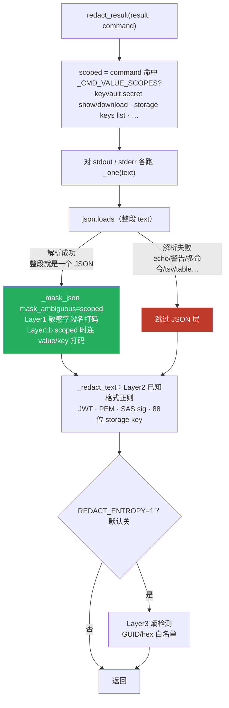
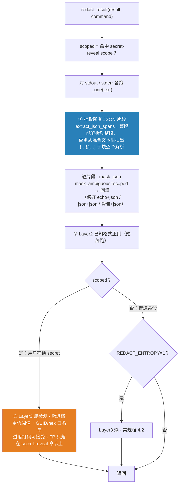
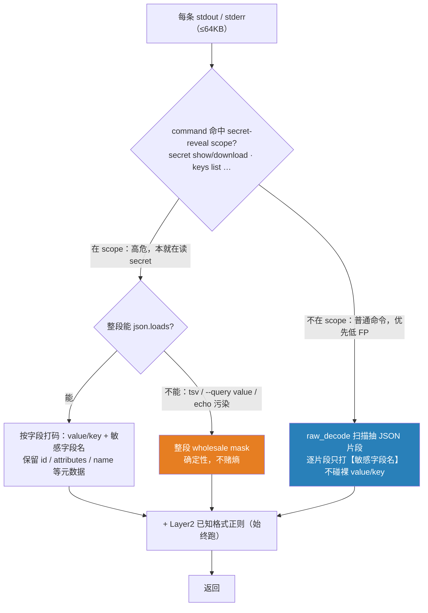

# 设计：输出脱敏对任意 bash 输出的健壮性

> 结论先行：**「按字段名打码」和「fallback 到熵检测」都不是银弹**。前者要求输出有结构（tsv/table/`--query value` 直接击穿），后者对低熵 secret 无能为力且有误杀。
> 正确姿势是 **纵深防御**：JSON 片段提取 + scoped 命令上激进熵兜底 + **承认残余泄漏不可消除** → 真正的边界是**身份最小权限**（diagnose SP 本就该是 Reader、没有 secret get/list）。

---

## 1. 实测复现的 bug（2026-07-18）

线上镜像 `mcp-server:redact-gate-1`（digest `530027c4`）**确实带了脱敏代码并接对了线**（`main.py:206` 无条件调 `redact.redact_result`）。但同一个 canary secret，两条命令结果相反：

| 命令 | 返回的 `value` |
|---|---|
| `az keyvault secret show … -o json` | **`«redacted»`** ✅ |
| `echo "marker"; az keyvault secret show … -o json` | `CANARY_SENTINEL_…`（明文）❌ |

根因在 `redact.py` 的 `_one()`：

```python
try:
    parsed = json.loads(text)      # ← 对【整段】stdout 解析
except (ValueError, TypeError):
    parsed = None
if parsed is not None:
    parsed, n = _mask_json(parsed, mask_ambiguous=scoped)   # Layer1 / 1b 只在这里跑
    text = json.dumps(parsed, ensure_ascii=False)
text, n = _redact_text(text, entropy)                       # Layer2 正则 + 可选 Layer3 熵
```

**整段 text 必须是一个能被 `json.loads` 解析的 JSON**，Layer1/1b 才会跑。前面多一行 `echo`、`az` 自己打个 WARNING、两条命令拼接……只要整段不是合法 JSON → `parsed=None` → 按字段名的打码（Layer1/1b）**整段被跳过**，只剩 Layer2 格式正则兜底。而 KV secret 的 `value` 是**无固定格式的任意值**，Layer2 抓不到 → 裸奔。

---

## 2. 为什么「只准备一个 echo 例外」没用 —— bash 输出的组合爆炸

不能把这个当成「一个 echo 的特例」来打补丁。同一条 secret，能被玩成的形态几乎无穷：

| # | 输出形态 | 结构还在吗 | 击穿了哪层 |
|---|---|---|---|
| 1 | `echo hdr; az … -o json` | JSON 子串还在 | 整段解析失败 → Layer1/1b 挂 |
| 2 | `az … -o json; az … -o json` | 两个 JSON 拼接 | 整段解析失败 → Layer1/1b 挂 |
| 3 | `az … --query value -o tsv` | **没了**（纯裸值一行） | 一切「按字段」全挂，只能靠内容检测 |
| 4 | `az … -o table` / `-o yaml` | 字段名变形/无引号 | JSON 层 + 文本字段正则都挂 |
| 5 | `az`（自带 WARNING/deprecation/进度打到 stdout） | JSON + 噪声 | 整段解析失败 → Layer1/1b 挂 |
| 6 | `echo "tok=$(az … --query value -o tsv)"` | 裸值嵌进任意文本 | 无字段、无格式 → 只剩熵 |
| 7 | `az … -o json \| jq -r .value` | 裸值 | 同 3 |
| 8 | 多行 secret（PEM / value 里带 `\n`） | JSON value 里带转义 | 文本字段正则难处理转义/换行 |

**教训：输出形态是无穷的，靠枚举例外或「按字段名文本正则」永远补不完。** 能对抗「结构消失」的只有**内容检测**（格式正则 / 熵），而内容检测各有硬伤（见 §4）。

---

## 3. 当前分支流程



**红色 `F` 就是泄漏路径**：非纯 JSON → 跳过按字段打码 → KV secret value 只剩 Layer2，而它没有已知格式 → 明文出去。

---

## 4. 各手段抓什么 / 被什么击穿（回答「稳吗」）

| 手段 | 抓什么 | 被什么击穿 |
|---|---|---|
| Layer1 敏感字段名（JSON） | `connectionString`/`accountKey`… 的**任意值** | 输出非纯 JSON、tsv、table |
| Layer1b scoped `value`/`key`（JSON） | `secret show` 的 `value` | 同上 + 整段解析失败（本次 bug） |
| 文本级 `"value":"…"` 正则（**方案 a**） | JSON 里的 value 字段 | tsv/table 无字段名；`--query value` 无 key；值含转义引号/换行 |
| Layer2 已知格式正则 | JWT/PEM/SAS/storagekey（**格式**可识别） | **无固定格式的 secret**（KV 任意值、弱密码、内部 token） |
| Layer3 熵（**方案 b＝你想的 fallback**） | 高熵随机串 | **低熵 secret 漏**；高熵非 secret **误杀** |
| **身份最小权限** | 从源头就不返回 secret | 需正确配置；**这是真正的边界** |

熵检测的实测数据（`shannon()`，阈值 4.2）：

| 样本 | 长度 | 熵 | ≥4.2 会打码？ |
|---|---|---|---|
| `Zx9K2mNq…`（真 storage key 44B） | 43 | 5.24 | YES |
| JWT 随机段 | 36 | 4.36 | YES |
| canary（本次测试值） | 45 | 4.49 | YES |
| **`Summer2026!`（弱密码）** | 11 | **3.10** | **no — 漏** |
| GUID（标识符，本应放行） | 36 | 3.72 | no（靠低于阈值+白名单） |

**所以「直接 fallback 到熵」不稳**：它救得了随机高熵 secret，但

1. **低熵 secret 照样漏**（`Summer2026!`、PIN、短 token、口令短语）；
2. 高熵**非** secret（base64 数据、镜像 digest、证书指纹、某些资源 id）会被**误杀** —— 这正是当前把 Layer3 默认关掉的原因。

而「按字段名文本正则」（方案 a）同样不稳：形态 3/4/6/7（tsv、table、`--query value`、裸值嵌入）根本没有字段名可抓。

**两个都不是银弹。**

---

## 5. 建议：纵深防御 + 把 fallback 的 FP 成本关进 scope

不追求「一层搞定」，而是几层叠加，并**把「过度打码」的代价限制在「用户明确在读 secret」的命令上**：



三个改动：

1. **① 用 JSON 片段提取替换「整段 json.loads」门槛。** 只要输出里**还有 JSON 结构**（echo+json、多个 json 拼接、警告行+json），就能恢复 Layer1/1b。这一步同时修好了**敏感字段名**那组（不止 `value`/`key`），成本低、无新增 FP，**建议无条件上**。

2. **③ scoped 命令加激进熵兜底。** 逻辑依据：用户跑 `keyvault secret show` / `keys list` 时，输出**本来就是要给出 secret**，此时「宁可多打码」是完全可接受的；把熵的误杀代价**关进这个 scope**，就不会污染普通只读命令。这直接采纳了你「fallback 到内容检测」的直觉，但用 scope 把它的 FP 副作用框住。

3. **② Layer2 保持始终跑**（格式可识别的 secret 双保险，不受结构变化影响）。

### 残余泄漏（必须诚实标注）

即便如此，形态 3/6（`--query value -o tsv` 打出一个**低熵** secret、或把裸值 echo 进文本）**仍会漏**：没有结构 + 熵不够高 = 任何后置擦除器都无解。

**这不是能靠脱敏补完的洞。** 后置输出脱敏本质是 best-effort 的**兜底**，不是安全边界。

---

## 6. 真正的边界：身份最小权限

脱敏能减少**误伤式泄漏**，但拦不住一个**能塑形输出**的调用方。对「别让 diagnose 读到 KV secret」这件事，真正的控制点是**身份层**：

- diagnose SP 本就应当是 **Reader**、**没有** secret get/list —— 也就是 2026-07-18 我为了测试脱敏、临时给它 grant access policy **之前**的状态。
- 特权读（secret / listKeys）应只走 **action** 路径，且带**人工审批**（PR4 的另一半）。
- 脱敏是「万一 action 输出里带了 secret，尽量别外泄」的**第二道**，不是第一道。

> 建议：把本次为测试加的 access policy（diagnose+action 在 3 个 vault 上的 get/list）在测完后**撤掉**，恢复 diagnose=Reader 的最小权限姿势。否则「脱敏绕过」+「diagnose 有 secret 读权限」叠加，才是真正的风险面。

---

## 7. 待定 / 下一步

- [ ] 实现 `extract_json_spans`（§5①）+ scoped 激进熵档（§5③），补回归用例覆盖 §2 形态 1–8（**不是**只测一个 echo）。
- [ ] 决定激进熵档的阈值与白名单（GUID/hex 已有，是否再加 base64-image-digest / cert-thumbprint 白名单）。
- [ ] 复核 `_CMD_VALUE_SCOPES` 覆盖面（是否漏了某些 `list-connection-strings` / `credential` 子命令）。
- [ ] 撤销测试期临时 access policy，恢复最小权限。

---

## 8. 定稿方案 v2（2026-07-18）：删掉熵、scope 决定策略、raw_decode 统一结构打码

> 本节是 §5 讨论之后收敛的**实现定稿**，**取代 §5 里「scoped 激进熵档（Layer3）」那半**。
> 但 §4/§5 关于熵的分析**保留在上文不删**，作为「为什么最终不用熵」的依据。
> 核心变化：**彻底移除 Layer 3（熵）**，高危残余缝改用**确定性 scope 兜底**。

### 8.1 前提：脱敏看到的输出天生 ≤ 64KB

`SandboxManager.exec()` **先截断再返回**，`main.py:_exec` 拿到的已是截断结果，之后才脱敏：

```python
# sandbox_manager.py
MAX_OUTPUT_BYTES = int(os.environ.get("MAX_OUTPUT_BYTES", str(64 * 1024)))  # :51 默认 64KB
stdout, t1 = _cap(result.stdout or "")                                      # :537 exec() 里先截
# main.py
result = await executor.exec(sctx, command)   # :202 已截断
result = redact.redact_result(result, ...)    # :206 才脱敏
```

含义：

- `raw_decode` 扫描的输入 ≤ 64KB（可用 `MAX_OUTPUT_BYTES` 调大），**性能不是问题**（sub-ms，远小于 az+网络的秒级）。
- 副作用：>64KB 的 JSON 会被从中间砍断，`raw_decode` 解析残缺对象失败 → 抓不到（残余泄漏之一，见 §8.4）。

### 8.2 定稿流程



### 8.3 分支说明

**顶层按 scope 分策略**（`scope = command 命中 _CMD_VALUE_SCOPES`，即 `keyvault secret show/download`、`… keys list` 等 secret-reveal 命令）：

- **在 scope（高危，本就在读 secret）—— 目标：绝不漏，宁可多打码**
  - 整段能 `json.loads` → 按字段打码（`value`/`key` + 敏感字段名全打），**保留 `id`/`attributes`/`name` 等非敏感元数据**。
  - 整段解析不了（tsv / `--query value` / echo 污染）→ 无法外科手术 → **整段 wholesale mask**（替成单个 `«redacted»` 或一句提示）。确定性、不赌熵；此处 `«redacted»` 是预期结果。

- **不在 scope（普通命令）—— 目标：低误杀**
  - `raw_decode` 扫描抽出所有 JSON 片段，逐片段**只打【敏感字段名】**（`connectionString`/`accountKey`/`clientSecret`/`password`…），**不碰裸 `value`/`key`**（它们在 tags、list 包装等非 secret 对象上也出现）。

**两条分支共用的确定性打码机器**：

- `raw_decode` 扫描 = 在每个 `{`/`[` 处试解析一个 JSON 值，成功就拿到精确区间打码、跳到其后继续。**它天然包含「整段就是一个 JSON」**（从下标 0 抽到末尾的单片段），所以 §5 里「先 json.loads、不行再 raw_decode」**合并成一步**；`json.loads` 顶多留作干净 JSON 的快路径，非必需。
- **Layer 2 已知格式正则始终跑**（JWT / PEM / SAS sig / 88 位 storage key），不依赖结构，tsv 里也能抓格式化 secret。

**Layer 3（熵）删除**：默认本就关闭（`REDACT_ENTROPY=0`），删掉零运行时影响；理由见 §4（短串盲区 `log2(18)<4.2` + 高熵非 secret 误杀 + 虚假安全感）。

### 8.4 残余泄漏与真正的边界（不变）

删熵之后仍漏、且**任何后置擦除器都救不了**的：

- 非 scope 命令里，既无 JSON 结构、又无已知格式的裸 secret（如 `echo "tok=$(az … --query value -o tsv)"`）。
- >64KB 被截断的 JSON 尾部。

这些交给 **身份最小权限**：diagnose SP 本就该是 Reader、无 secret get/list；特权读走带审批的 action。脱敏只保证「结构化/格式化的别漏」，**不是安全边界**（见 §6）。

### 8.5 实现要点

- [ ] `extract_json_spans(text)`：`json.JSONDecoder().raw_decode` 扫描，O(n)，n ≤ 64KB。
- [ ] scope 兜底：in-scope 且整段不可解析 → wholesale mask（覆盖 tsv / 裸值 / echo 污染）。
- [ ] 移除 `_shannon` / `_GUID` / `_HEX` / `_TOKEN` / `REDACT_ENTROPY` 相关代码。
- [ ] 回归用例覆盖 §2 形态 1–8（不止一个 echo）+ in-scope tsv 裸值 + >64KB 截断。
