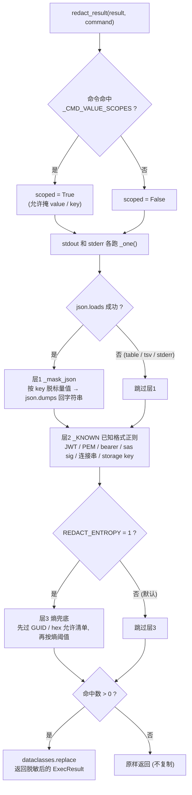
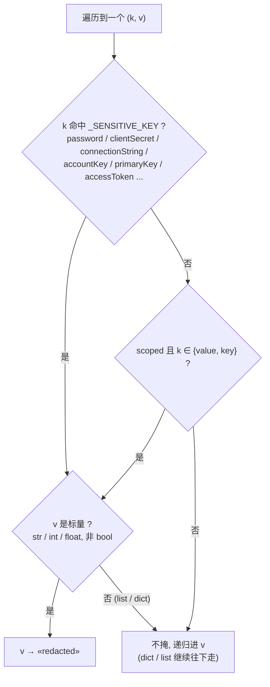

# 输出脱敏实现详解 —— `redact.py` 三层逻辑与示例

> 本文是 [`护栏落地方案`](护栏落地方案-输出脱敏与client强制审批.md) §2.1 的实现深挖：逐层讲 `src/mcp-server/redact.py`，每层配 before/after 例子，附流程图与端到端走查。
>
> 一句话：**每次 tool 返回前，把输出里的 secret 就地掩成 `«redacted»`，其余原样留下。** 三层从精确到兜底，外加一个「命令域」开关控制最容易误伤的 `value`/`key`。

---

## 0. 落点与总原则

- **落点**：`main.py:_exec` 里、`executor.exec` 返回之后、`return` 之前，`result = redact.redact_result(result, command=command)`。`diagnose_bash` / `action_bash` 都走 `_exec`，**改一处、两个 tool 全覆盖**。
- **只 REDACT**：不 BLOCK、不审批、不进审计。命令已跑完、secret 已在输出里，唯一职责是别吐出去；BLOCK 会把 secret 周围有用的输出也丢掉，对 DataOps 太难用。
- **纯变换**：`ExecResult → 脱敏后的 ExecResult`（frozen dataclass，用 `dataclasses.replace` 造新对象）。一个命中都没有就原样返回、不复制。
- **FP 是唯一真风险**：精确层负责召回、熵默认关、歧义键名与标识符明确排除。

---

## 1. 总流程



关键：进来先看**命令**决定 `scoped`（只影响层1里 `value`/`key` 掩不掩），然后 stdout / stderr 各自过三层、全程数命中；一个都没命中就把原对象原样返回。

---

## 2. 层1：JSON 按 key 脱值（`_mask_json`）—— 主力，精度最高

`az` 输出多是 JSON。`json.loads` 成功就**递归走整棵树**，看**字段名**决定掩不掩值——key 的是字段名不是值形状，所以**任意值的 password 也抓得到**。

判定逻辑（这是 FP 的心脏）：



两条 FP 防线就在图里：

- **`_SENSITIVE_KEY` 只放不歧义的复合名**（`clientSecret`/`connectionString`/`accountKey`/`primaryKey`/`accessToken`…），**不放** `value`/`key`/`token`/`secret`——后者在非 secret 对象上太常见。
- **只掩标量**（`C1`）——值是 list/dict 就不替、递归进去，防 `{"value":[...]}` 被整个端掉。

**例（不歧义 key，与 scoped 无关）**：命令 `az ad sp create-for-rbac`（`scoped=False`）

```
输入  {"appId":"1111","clientSecret":"Xy9~arbitrary.secret","displayName":"sp"}
      clientSecret 命中 _SENSITIVE_KEY → 标量 → 掩
输出  {"appId":"1111","clientSecret":"«redacted»","displayName":"sp"}
```

`appId` / `displayName` 不动。

---

## 3. 层1b：命令域开关（`_CMD_VALUE_SCOPES`）—— 专治歧义的 `value`/`key`

`value` / `key` 太常见（tag 是 `{"key":"env","value":"prod"}`、list 是 `{"value":[...]}`、storage 是 `{"keyName":"key1","value":"<secret>"}`），盲掩必炸。所以**只有当命令本身「目的就是吐 secret」时**（`keyvault secret show`、`* keys list`…），才把 `scoped` 打开、允许掩 `value`/`key`。

命中的命令模式（`_CMD_VALUE_SCOPES`）：

- `az keyvault (secret|key) (show|download)`
- `az (storage account|cosmosdb|redis|servicebus|eventhubs|relay|cognitiveservices|search|batch|maps|appconfig|acr|signalr|webpubsub|iot) … (keys list|list-keys|list-connection-strings|credential|connection-string)`

**对照例**，同样是 JSON、同样有 `value` 字段，命令不同结果就不同：

```
命令 az keyvault secret show ...        (scoped = True)
输入  {"id":".../secrets/db/1","value":"s3cr3t-pw","attributes":{"enabled":true}}
输出  {"id":".../secrets/db/1","value":"«redacted»","attributes":{"enabled":true}}
      ↑ value 被掩 (scoped 打开); id 保留; enabled 是 bool 不掩

命令 az group list                      (scoped = False)
输入  {"value":[{"name":"rg-prod","location":"eastus"}]}
输出  {"value":[{"name":"rg-prod","location":"eastus"}]}   ← 一字不动
      ↑ value 是 list 且未 scoped → 不掩; 递归进去也没有敏感 key
```

这就是「redact 所有输出但不误伤」的关键——**同一个 `value` 字段，看命令决定碰不碰**。

---

## 4. 层2：已知格式正则（`_KNOWN`）—— 抓非 JSON / 藏在普通字段里的

层1只看 key。但 secret 也会出现在**非 JSON 输出**（`-o tsv`、stderr）或**藏在一个不敏感字段的字符串里**（如某个 `description` 里嵌了连接串）。层2用一组**已知格式正则**兜这些，每条都是精确 span、近零 FP：

| 规则 | 抓什么 | 掩法 |
|---|---|---|
| `jwt` | `eyJ….eyJ….sig`（JWT 三段） | 整段掩 |
| `pem` | `-----BEGIN … PRIVATE KEY-----` | 整段掩 |
| `bearer` | `Bearer <token>` | 留 `Bearer `，掩 token |
| `sas_sig` | SAS 里的 `sig=…` | 留 `sig=`，掩值 |
| `conn_secret` | 连接串里 `AccountKey=` / `SharedAccessKey=` / `Password=` / `pwd=` | 留标签，掩值 |
| `storage_key` | 88 字符 base64（storage key 形状，`…==` 结尾） | 整段掩 |

`group>0` 的规则**保留标签、只掩值**，便于 debug（看得出被掩的是什么）。

**例（非 JSON，连接串）**：命令 `az storage account show-connection-string`

```
输入  DefaultEndpointsProtocol=https;AccountName=acct;AccountKey=ZmFrZWtleQ==;Endpoint=x
      json.loads 失败 → 跳过层1; conn_secret 命中 AccountKey=...
输出  DefaultEndpointsProtocol=https;AccountName=acct;AccountKey=«redacted»;Endpoint=x
      ↑ AccountName 保留, 只掩 AccountKey 的值
```

> 层2 **在层1重序列化之后也再跑一遍**：即便一个连接串藏在某个非敏感 JSON 字段的字符串值里（层1按 key 抓不到），层2的正则照样能抓到。

---

## 5. 层3：熵兜底 —— 默认关，抓「任意高熵串」

前两层抓不到的是**无格式、无上下文的高熵 secret**（如一个裸露的随机密码）。层3用 Shannon 熵扫 20+ 字符的 token。但熵是**唯一的 FP 源**（GUID、hash、base64 数据都高熵），所以：

- **默认关**（`REDACT_ENTROPY=1` 才开）。
- 开了也**先过允许清单**：GUID（订阅/租户/资源 id）、hex/sha（git sha、镜像 digest）直接放行——掩了它们不只是 FP，还会**打断 agent 下一步**（下一条命令要用那个 id）。
- 再按 **Shannon 熵阈值**（`REDACT_ENTROPY_MIN`，默认 4.2）判；`[A-Za-z0-9+/=_-]{20,}` 的 token 才进判。
- 命中就整段掩。**漏掉的高熵 secret 由 L0 RBAC + L3 审计兜底——用熵的 FN 换 FP→0。**

**例（`REDACT_ENTROPY=1`）**：命令 `az ...`，stderr 里裸露一个随机密码

```
输入  login failed for user; pw=9dK2jF83nDkeQ0zzXvB2mQ ; subId=12345678-1234-1234-1234-123456789abc
输出  login failed for user; pw=«redacted» ; subId=12345678-1234-1234-1234-123456789abc
      ↑ 高熵随机串被掩; GUID 命中允许清单 → 保留
```

> 建议先维持默认关：等出现真实漏报再开，并配 detect-secrets 的 filters（`is_potential_uuid` / `is_templated_secret` …）进一步压 FP。

---

## 6. 端到端走查（一条 keyvault 命令）

命令：`az keyvault secret show --vault-name v -n db`（→ `scoped=True`，`REDACT_ENTROPY` 默认关）

```
stdout 输入:
  {"id":"https://v.vault.azure.net/secrets/db/1","value":"s3cr3t-pw-!@#","attributes":{"enabled":true}}

① scoped 判定: 命中 _CMD_VALUE_SCOPES[keyvault secret show] → scoped = True
② _one(stdout):
   json.loads 成功
   ├─ 层1 _mask_json(mask_ambiguous=True):
   │    id         → 非敏感, 非 value/key → 递归(字符串) 不变
   │    value      → scoped 且 ∈{value,key} → 标量 → «redacted»   (hit +1)
   │    attributes → 递归 → enabled 是 bool → 不掩
   │    → json.dumps 回字符串
   ├─ 层2 _KNOWN: 无 JWT/PEM/连接串等 → 无命中
   └─ 层3: REDACT_ENTROPY 关 → 跳过
   命中数 = 1
③ stderr 空 → 跳过
④ 命中数 > 0 → dataclasses.replace

stdout 输出:
  {"id":"https://v.vault.azure.net/secrets/db/1","value":"«redacted»","attributes":{"enabled":true}}
```

---

## 7. FP 防线 & 可调项汇总

**FP 防线**（为什么默认配置实际 FP≈0）：

1. 优先高精度层（JSON key + 已知格式），熵默认关。
2. 歧义键名 `value`/`key`/`token`/`secret` 不进 `_SENSITIVE_KEY`，只在命令域内掩。
3. 只掩标量，绝不端掉 list/dict。
4. 标识符允许清单（GUID / hex / sha）——即便开熵也不碰。
5. 命令域精准打击，优先于任何盲扫。

**环境变量**：

| 变量 | 默认 | 作用 |
|---|---|---|
| `REDACT_ENTROPY` | `0`（关） | 是否启用层3熵兜底 |
| `REDACT_ENTROPY_MIN` | `4.2` | 熵阈值（越高越保守、FP 越少 FN 越多） |

**验收**：`redact.py` 配套 8 个用例（keyvault secret show / storage keys list / group list 不误伤 / tag key-value 保留 / 连接串 / clientSecret / JWT in stderr / GUID 保留），全绿。

**扩展点**：把 gitleaks 规则集灌进 `_KNOWN` 扩已知格式；把 detect-secrets 的 filters 灌进层3熵通道压 FP。

---

## 参考

- [`护栏落地方案`](护栏落地方案-输出脱敏与client强制审批.md) §2.1 —— 本文的上层设计（为何进程内、为何不外包）
- `src/mcp-server/redact.py` —— 实现
- `src/mcp-server/main.py:_exec` —— 落点（diagnose + action 共走）
- [detect-secrets](https://github.com/Yelp/detect-secrets) · [gitleaks](https://github.com/gitleaks/gitleaks)
