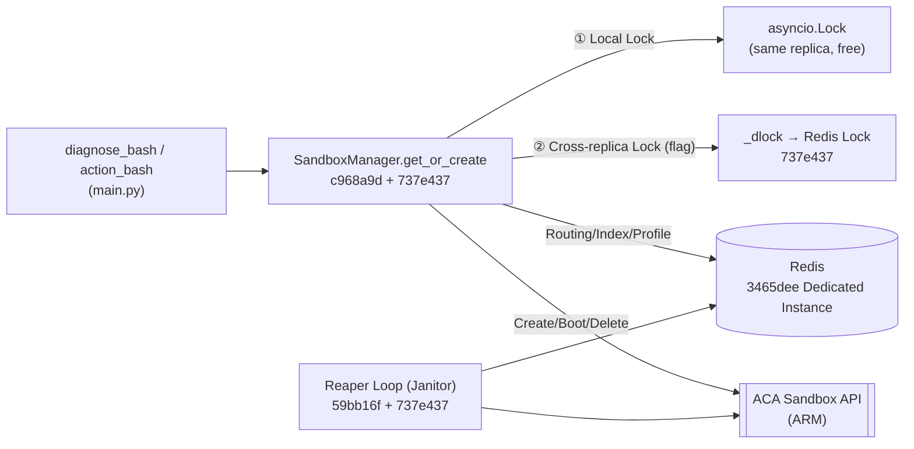
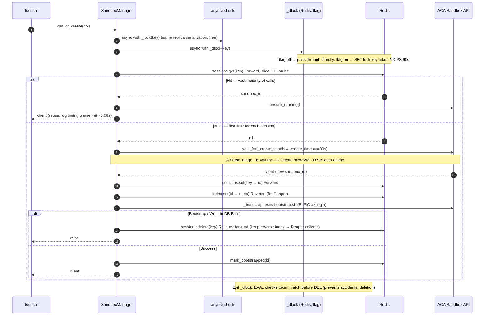
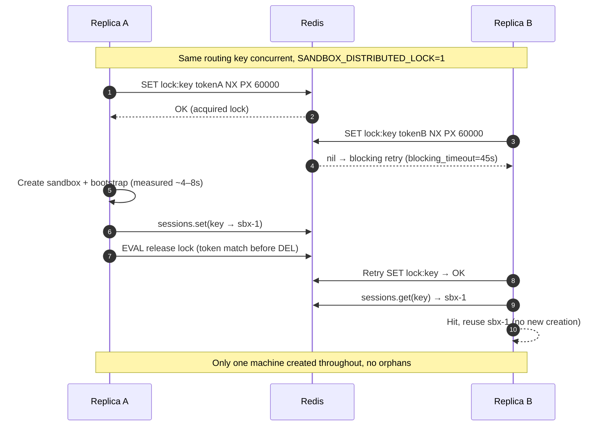
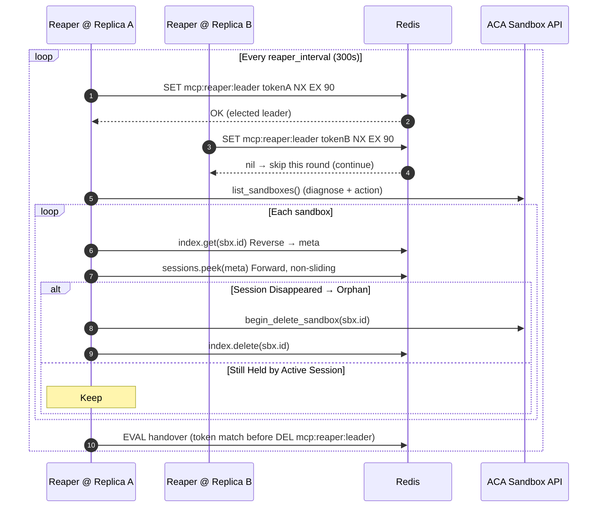

# MCP Implementation Overview: Sandbox Creation · Redis · Reaper (Sequence Diagram + Commit Status)

This is the **convergence document**: it clearly illustrates the **final implementation** of sandbox creation, Redis usage, and Reaper reclamation using sequence diagrams, and marks each block with its **implementing commit hash and status** for easy future reference of "which line of code came from which commit, whether it's deployed, and whether it's enabled."

Companion documents: [MCP-Distributed Lock and Reaper Leader Election-Implementation Plan.md](distributed-lock-and-reaper-leader-election-implementation-plan.md) (implementation plan), [MCP-Sandbox-Creation Latency Measurement Report.md](mcp-sandbox-creation-latency-measurement-report.md) (measurement report), [MCP-Horizontal Scaling-Distributed Lock and Reaper Leader Election.md](mcp-server-horizontal-scaling-distributed-lock-and-reaper-leader-election.md) (principles).

Code: `src/mcp-server/sandbox_manager.py`, `cache.py`, `session.py`, `main.py`.

---

## 0. Status Overview (Commit Hash Matrix)

| Component / Feature | Implementation Commit | Status | Default Behavior | Branch |
|---|---|---|---|---|
| SandboxManager Core (`get_or_create` / `_create_sandbox` / `_bootstrap`) | `c968a9d` (Phase 3) | ✅ Deployed | Always On | Mainline |
| Blob Volume Mounting (`_workspace_volumes`) | `1f4368a` (Phase 5) | ✅ Deployed | Always On | Mainline |
| Redis Forward Routing + Profile + `bootstrapped` Flag | `32d06bd` (Phase 4) | ✅ Deployed | Always On | Mainline |
| Dedicated Redis Container App (short-name communication within env) | `3465dee` | ✅ Deployed | Always On | Mainline |
| Reverse Index `mcp:sbxidx` + Reaper (each replica scans independently) | `59bb16f` (Phase 6) | ✅ Deployed | Always On | Mainline |
| **Timing Instrumentation** (`_log_timing`, create/bootstrap/hit) | `737e437` | ✅ Merged | Always On (pure logging) | `fix-redis` |
| **Create Timeout** (`wait_for`) + **Failure Rollback** session key | `737e437` | ✅ Merged | Always On (only visible on error paths) | `fix-redis` |
| **Distributed Lock `_dlock`** (cross-replica, inner layer of two-layer lock) | `737e437` | ✅ Merged | ⚠️ **Default Off** | `fix-redis` |
| **Reaper Leader Election** (`_try_become_reaper`) | `737e437` | ✅ Merged | ⚠️ **Default Off** (same toggle) | `fix-redis` |
| Multi-replica Deployment (`maxReplicas>1` + enable toggle + load test) | — | ⏳ **Not Done (PR-4)** | — | Future |
| PR-2/PR-3 Formal Unit Tests (mock unit tests) | — | ⏳ **Not Written** | — | Future |
| Measurement Harness + PR-1 Unit Tests (`tests/`) | `021aaec` | ✅ Retained (for reproducibility) | — | `measure-sandbox-timing` |
| **End-to-End Smoke Test** (`tests/e2e_deployed.py`, uses real front door) | —(pending commit) | ✅ **Tested Successfully** (2026-07-05, rev `0000007`, see §8) | Manual (requires login + live deployment) | `fix-redis` |

> **One toggle controls two things**: `SANDBOX_DISTRIBUTED_LOCK` (default `0`) gates both `_dlock` and Reaper leader election. Off = today's single-replica behavior byte-for-byte unchanged; On (when `maxReplicas>1` in the future, in the same PR) = cross-replica mutual exclusion + single janitor. Timing / create timeout / rollback are **not controlled by the toggle and are always on** (but the 30s timeout is far above the measured worst-case ~8s, normally imperceptible).

---

## 1. Component Panorama



---

## 2. Sequence Diagram A: Sandbox Creation / Reuse (`get_or_create`)

Final implementation (`c968a9d` core + `737e437` adds two-layer lock/timeout/rollback). **When the flag is off, the `_dlock` step is a no-op.**



**Key Points (all in `737e437`):**
- **Two-layer lock**: Outer `asyncio.Lock` protects same replica (free), inner `_dlock` protects cross-replica (best-effort; if Redis is down or lock wait times out, it degrades gracefully and never fails the request).
- **Create timeout**: `wait_for(_create_sandbox, 30s)` — a stuck creation won't permanently hold the lock. ⚠️ It only cancels "my waiting"; the ARM side might still finish creating → orphan collected by Reaper.
- **Failure rollback**: On bootstrap/write error, delete the forward key (keep reverse index), so the next call with the same key rebuilds, avoiding reuse of a "broken machine that didn't log in."
- **Order is fixed**: Forward `sessions.set` happens **before** `_bootstrap` to ensure Reaper sees `live==sbx` during bootstrap and doesn't mistakenly delete it (hence no lock-free fast path).

**Supplement: Why "Create Machine → Write Redis → Then Bootstrap" and not the reverse?**

One might ask: since it's possible for "machine creation to succeed but bootstrap to fail, yet the sandbox_id is already written," why not **create the machine, immediately `az login`, and only write to Redis upon success**? Then rollback would be trivial (nothing written to the DB). This is indeed simpler, but the current order is **intentional**, key to Reaper's deletion criterion (`reap_orphans`): **A machine is deleted ⇔ it has a reverse index `meta` AND the forward `peek != sbx.id`**.

- By writing the **reverse index as early as possible** (immediately after machine creation, `index.set` before bootstrap), we leave a breadcrumb for Reaper to reclaim from the moment the ARM machine exists: after bootstrap, **any** failure — caught exception, or even a hard crash / OOM — the reverse index is already there, and Reaper collects it in ~5min.
- Writing the reverse early **forces the forward to also be written early**: otherwise, during the ~3s bootstrap, another replica's Reaper would list it → find meta in the reverse → peek the forward (not yet written) → classify it as orphan → **mistakenly delete it mid-bootstrap**. Writing the forward first ensures `peek==sbx`, so Reaper leaves it alone (i.e., the "order is fixed" above).

Your "bootstrap first" scheme actually **wouldn't cause mistaken deletion either** (during bootstrap, the reverse isn't written yet, so Reaper checks `meta` as empty and skips directly), but the cost shifts elsewhere — **if a hard crash occurs during creation/bootstrap**, this ARM machine has no reverse index → Reaper never touches it → it can only rely on the platform's 1h `auto_delete`, which is slower than ~5min and accumulates more orphans:

| | Current (reverse written first) | Alternative (bootstrap first) |
|---|---|---|
| Rollback | Delete 1 forward key (`sessions.delete`, one line) | No rollback needed |
| Bootstrap exception | Reverse remains, Reaper collects in ~5min | Need to explicitly delete machine in except block |
| **Hard crash / OOM** | Reverse already exists, Reaper collects in ~5min | No index, wait for platform **1h** fallback |

That is, a **crash-safe approach of "lay down the reclamation breadcrumb first, then do the risky bootstrap"**, with the complexity being just one line of delete. If accepting a hard crash falling back to the 1h fallback, the alternative order is also feasible.

---

## 3. Sequence Diagram B: Distributed Lock Cross-Replica (`_dlock`, flag on)

Two concurrent requests for the same routing key land on different replicas, **only one machine is created** (contrast: when the flag is off, each replica creates one → orphans, collected by Reaper). Implementation: `737e437`.



> Degradation: `_dlock` lock acquisition throws an exception (Redis unreachable) or lock wait times out at 45s → logs a warning and **proceeds normally**, falling back to "only asyncio.Lock", at worst causing an occasional orphan (collected by Reaper). It is an **efficiency lock, not a correctness lock**; the 1:1 binding for user isolation is independently guarded by `never-rebind`, unrelated to this lock.

**Supplement: Will B wait the full 45s? — No, B gets the lock ~0.1s after A releases it.**

The `blocking_timeout=45s` in the diagram is an **upper limit**, not a fixed wait. redis-py's blocking `Lock.acquire` neither sleeps for 45s nor uses event notification; it uses **polling**: repeatedly `SET NX`, and if it fails, `await asyncio.sleep(0.1)` (default `sleep=0.1s`, we only set `blocking_timeout`, didn't override it), until it succeeds or times out at 45s. So after A's `lock.release()` at ~4–8s (which runs the token-validating DEL), **B's next poll (≤0.1s) succeeds**.

- B's total wait ≈ A's critical section (4–8s) + at most ~0.1s, **not 45s**.
- 45s is only reached if A never releases (stuck) → B times out and degrades gracefully (see "Degradation" above).
- "No visible release logic" is because it's encapsulated in `lock.release()`: there's no notification; B probes every 0.1s and finds the key gone (Redis has no "blocking wait for key deletion" primitive for this use case).

---

## 4. Sequence Diagram C: Reaper Leader Election (`_reaper_loop`)

When the flag is on, one leader is elected per round to do the work; when the flag is off, it falls back to "each replica scans independently" (idempotent, but wasteful). Core `reap_orphans` from `59bb16f`, leader election `737e437`.



**Three Layers of Reclamation (Defense in Depth):** ① This section's Reaper (deletes shortly after session ends, ~5min) → ② Platform `auto_suspend` (suspends after 5min, stops billing) → ③ Platform `auto_delete` (final fallback at 1h). Orphans are normally collected in ~5min, not waiting the full 1h.

**Supplement: Why are the two locks implemented differently? (`_dlock` uses redis-py `Lock`, leader election uses hand-written Lua)**

Both follow the same pattern (**SET-NX-with-TTL + token-validated release**), but with two implementations because the **acquisition semantics differ**:

| | `_dlock` (§3, `lock:*`) | Reaper Leader Election (this section, `mcp:reaper:leader`) |
|---|---|---|
| Acquisition | **Blocking wait**: the second concurrent creator waits for the first to finish before reusing → `blocking=True, blocking_timeout=45s` | **Non-blocking try once**: if someone else is already the leader this round, don't wait; `SET NX` fails → skip, try again next round |
| Implementation | redis-py's `self._redis.lock(...)` object, `acquire()` / `release()` | Raw `self._redis.set(nx=True, ex=)` + `self._redis.eval(...)` |
| Release | `lock.release()`, **library-provided** Lua token validation | Hand-written `_RELEASE_LUA` + `.eval()` |

Key point: **`_RELEASE_LUA` (`if get==token then del`) is a verbatim replica of the internal logic of redis-py's `Lock.release()`** — the same guard of "only delete your own lock, prevent accidental deletion of a lock that has expired and been re-acquired by someone else," one provided by the library, one hand-written. Leader election uses raw `SET NX` because it needs the "try once" semantics; without a `Lock` object, it provides its own release script. It could be unified (make leader election also use `lock(..., blocking=False)`), but the benefit is small, and it would tie the non-blocking path back to redis-py `Lock`'s `decode_responses` behavior.

---

## 5. Redis Data Model (Key / TTL / Commit)

Prefixes: `sessions`/`profiles` use `RedisBackend(prefix="mcp")`; reverse index uses separate `prefix="mcp:sbxidx"`; `_dlock` and leader election use the **raw client** (key names written as-is).

| Redis Key (with prefix) | Content | TTL | Write | Read | Commit |
|---|---|---|---|---|---|
| `mcp:session:{oid}:{session}:{group}` | **Forward**: routing key → sandbox_id | 1800s sliding | `get_or_create` | `get` (hit) / `peek` (Reaper) | `32d06bd` |
| `mcp:sbxidx:{sandbox_id}` | **Reverse**: sandbox_id → {oid,session,group} | Never expires | `get_or_create` | Reaper | `59bb16f` |
| `mcp:bootstrapped:{sandbox_id}` | `az login` completed flag | Never expires | `get_or_create` | `get_or_create` | `32d06bd` |
| `mcp:profile:{oid}` | User subscription etc., rebuild `az` context | Never expires | On login | `_user_subscription` | `32d06bd` |
| `mcp:usersession:{oid}` | oid → session_id (30min window derivation) | 1800s sliding | middleware (`session.py`) | middleware | `32d06bd` |
| `lock:{oid}:{session}:{group}` | **Distributed lock** token | `lock_ttl`=60s | `_dlock` (flag) | `_dlock` | `737e437` |
| `mcp:reaper:leader` | **Janitor** token | `ex=reaper_lease`=90s | `_try_become_reaper` (flag) | Same | `737e437` |

---

## 6. Three Layers of Redis Access (`_redis` / `RedisBackend` / `_redis_safe`)

These names are easy to confuse, but they all **share the same underlying Redis connection** (`from_env` creates a single `make_redis_client(redis_url)` and feeds it to everyone); the difference is only in the "layer":

| Name | What It Is | Who Uses It | Why |
|---|---|---|---|
| `self._redis` | **Raw redis-py async client** (noun) | `_dlock`, Reaper leader election | Needs primitives like `.lock()` / `.set(nx=)` / `.eval()` not exposed by the `RedisBackend` abstraction |
| `self._sessions` / `_index` / `_profiles` | **`RedisBackend` wrapper layer** (cache.py): adds prefix / TTL / typed get·set·peek | `get_or_create`, Reaper scanning | Structured read/write for routing / index / profile |
| `_redis_safe(coro)` | **Degradation shell** (function, not a client): `await coro`, on error log + return `default` | Wraps `sessions.*` / `index.*` calls inside `get_or_create` | Degrade gracefully when Redis is flaky (return default) instead of failing the tool call |

So **`_redis` vs `_redis_safe` is not "two ways to write the same API"**: one is a raw client (noun), the other is a try/except degradation shell for "value operations" (verb). They share the same connection pool, just at different access layers.

**Why don't the new lock / Reaper use `_redis_safe`?** Because `_redis_safe`'s shape is "**get a value, return default on failure**", while the fallback for locks / leader election is **control flow** (can't acquire lock → still `yield` and continue; leader election fails → `return _NO_LEASE` and scan anyway), which doesn't fit into "return a default value." So each has its own inline try/except.

**Should we unify the API?** Spiritually, it's already unified — **all use the same client, all "degrade on Redis failure, never fail the request"**, just in two forms (value operations use the `_redis_safe` shell; locks / control flow are inline). Extracting a unified helper would yield little benefit (the fallback is control flow, wrapping it would be more convoluted), so the preference is **not to change it**; this table clarifies "who is who."

---

## 7. Time Parameters and Measured Latency Overview

Collects all the various "times" scattered across §2–§5 in one place: **7.1 is the configured knobs** (timeouts / TTLs / intervals, all adjustable via env vars), **7.2 is the measured latency** (actual runtime). In short: cold start ~7–8s one-time, then hit ~0.02s; all timeouts have ≥3× headroom over measured values.

### 7.1 Timers / Timeouts / TTLs (Configuration Items)

| Parameter | Value (Default) | Env / Field | Belongs To | Purpose | See |
|---|---|---|---|---|---|
| Create Timeout | 30s | `SANDBOX_CREATE_TIMEOUT` / `create_timeout` | `get_or_create` | `wait_for` machine creation timeout, abandons if exceeded (far above measured worst-case ~8s) | §2 |
| Distributed Lock TTL | 60s | `SANDBOX_LOCK_TTL` / `lock_ttl` | `_dlock` (`lock:*`) | Lock auto-expiry (SET PX); prevents deadlock if the holding replica crashes; critical section measured ~8s ≪ 60s | §2 §3 §5 |
| Lock Wait Timeout | 45s | `SANDBOX_LOCK_WAIT` / `lock_wait` | `_dlock` | `blocking_timeout`, degrades gracefully if not acquired (never fails the request) | §3 |
| Session TTL (Forward Routing) | 1800s (30min) sliding | `cache.py` / `session.py` | `mcp:session:*` | Sliding renewal on each hit; 30min of silence = "session ended" | §5 |
| UserSession Window | 1800s (30min) sliding | `session.py` | `mcp:usersession:*` | 30min derivation window for oid→session_id | §5 |
| Reverse Index / Bootstrapped / Profile | Never expires | — | `mcp:sbxidx:*` etc. | Relies on Reaper / explicit deletion, not TTL | §5 |
| Reaper Leader Lease | 90s | `SANDBOX_REAPER_LEASE` / `reaper_lease` | `mcp:reaper:leader` | Leader token EX; ≈ upper limit for one round of work, auto-transition on expiry | §4 §5 |
| Reaper Scan Interval | 300s (5min) | `SANDBOX_REAPER_INTERVAL` / `reaper_interval` | `_reaper_loop` | Each round first `sleep(300s)` then elect leader + scan (first round also sleeps first) | §4 |
| Platform auto_suspend | 5min | ACA parameter | sandbox | Suspend when idle, stop billing (2nd layer of reclamation) | §4 |
| Platform auto_delete | 1h | ACA parameter | sandbox | Final fallback deletion (3rd layer of reclamation) | §4 |

> The three timeouts are **progressive**: worst-case machine creation ~8s < **lock wait 45s** (enough for the first replica to finish creating) < **lock TTL 60s** (longer than lock wait, so normal paths won't cause the lock to expire). All `SANDBOX_*` environment variables are adjustable without code changes.

### 7.2 Measured Latency (2026-07-05, single machine rev `0000007`; details in [Measurement Report](mcp-sandbox-creation-latency-measurement-report.md))

| Phase | Measured | Description |
|---|---|---|
| **Total Create** (miss, machine creation) | ~4.5s (report: median ~4s / worst-case ~8.3s) | Sum of A–D below |
| ├ A Parse image `disk` | ~2.97s | Largest portion |
| ├ B `volume` mount | ~0.12s | |
| ├ C Create microVM `vm` | ~1.39s | |
| └ D Set `auto-delete` | ~0.06s | |
| **Bootstrap** (E: FIC `az login`) | ~2.9s | exec `bootstrap.sh` |
| **Total Cold Start** (create + bootstrap) | ~7–8s (worst-case) | Only on first use per session |
| **Hit** (reuse, `ensure_running`) | ~0.02–0.08s | Vast majority of calls take this path |

> Interpretation: A session only incurs the ~7–8s cold start on its **first** use; every subsequent call is a ~0.02s hit. So the 30s create timeout is never encountered in normal operation.

---

## 8. End-to-End Test (Measured + How to Run)

Unit tests (mocks) cannot cover the "real front door" end-to-end chain: **Entra login → OBO → MCP streamable-HTTP → `diagnose_bash`/`action_bash` → real ACA sandbox**. This chain is run manually using `src/mcp-server/tests/e2e_deployed.py` (requires interactive login + live deployment, so it's not in CI).

**How to Run**

```
pip install mcp msal                      # Client SDK, not in server image
python src/mcp-server/tests/e2e_deployed.py
# First run prints device code URL: open in browser, enter code, log in as a diagnose+action group member.
# Token cached to ~/.cache/aca-mcp-e2e/, subsequent runs are silent until expiry.
```

Defaults to hitting the current dev deployment; can be overridden with environment variables `MCP_SERVER_URL` / `AZURE_TENANT_ID` / `MCP_APP_ID` / `MCP_DEVICE_CLIENT_ID`.

**What is Asserted (5 checks, corresponding to the 5 checks in the script):**

| # | Assertion | Proves |
|---|---|---|
| 1 | Both tools appear in `tools/list` | Auth + OBO + group membership resolution OK |
| 2 | First `diagnose_bash` call `exit=0` | Cold sandbox creation + bootstrap successful |
| 3 | `az account show` inside sandbox `exit=0` | FIC passwordless `az login` bootstrap effective |
| 4 | Marker file written by call 1 is readable by call 3 | Same sandbox reuse = session sticky routing (hit path) |
| 5 | `action_bash` `exit=0` | Second group / second sandbox also works |

**This Measurement (2026-07-05, rev `0000007`, intentionally ran with `SANDBOX_DISTRIBUTED_LOCK=1` to exercise the lock path):**
- Both tools appeared; three `diagnose_bash` calls (`whoami` / `echo+date` / `az account show`) + reuse hit, all as expected.
- Server log latencies matched the measurement report: `create total=4.549s` (disk 2.97 / vol 0.12 / vm 1.39 / autodel 0.06), `bootstrap exec=2.94s` (`account=d09dfd39…`, i.e., FIC login successful), `hit ensure_running≈0.02s`.
- **Key: flag on during real run, no `dlock acquire/release failed` warnings** → real redis-py `Lock` on real Redis (client `decode_responses=True`) acquired and released cleanly; the previously feared decode compatibility issue does not exist.
- After the test, the flag was reverted to `0` (default off, see §0 matrix). Current active rev `0000008`, image `mcp-server:distlock` (= `737e437` functional code).

**Not Covered This Time (deferred):** The Reaper leader election round — `_reaper_loop` first `sleep(reaper_interval=300s)` before the first election, and the success path is silent; on a single replica, it effectively runs "each replica scans independently." It uses the same Redis client as sessions/index, which is already in constant use, so the risk is low. Formal validation will be done together with multi-replica load testing (§0's PR-4).

---

## 9. Branch Description

- **`fix-redis` (main)**: All functional code = the `737e437` rows in the matrix above (instrumentation + lock + timeout/rollback + leader election), along with all design/implementation/measurement documents, **plus the end-to-end smoke test** `tests/e2e_deployed.py` (see §8; PR-2/PR-3 mock unit tests still pending).
- **`measure-sandbox-timing`**: Only retains "measurement conclusions" = PR-1 instrumentation (`021aaec`) + measurement harness `measure_create_timeline.py` + unit test `test_timing_instrumentation.py`. These tests, along with the formal PR-2/PR-3 unit tests, **will be added later together with the e2e tests**.
- **Future (PR-4)**: `provisioning/aca/modules/mcp-app.bicep` sets `maxReplicas` > 1, in the same PR sets `SANDBOX_DISTRIBUTED_LOCK=1`, runs multi-replica load testing (see [Implementation Plan](distributed-lock-and-reaper-leader-election-implementation-plan.md) §7 load test checklist), and finalizes the create tail latency under concurrency.

---

*Related:* [MCP-Distributed Lock and Reaper Leader Election-Implementation Plan.md](distributed-lock-and-reaper-leader-election-implementation-plan.md) · [MCP-Sandbox-Creation Latency Measurement Report.md](mcp-sandbox-creation-latency-measurement-report.md) · [MCP-Horizontal Scaling-Distributed Lock and Reaper Leader Election.md](mcp-server-horizontal-scaling-distributed-lock-and-reaper-leader-election.md) · [ACA-Sandbox-Migration Plan.md](migrating-identity-aware-mcp-to-aca-sandboxes-plan.md)