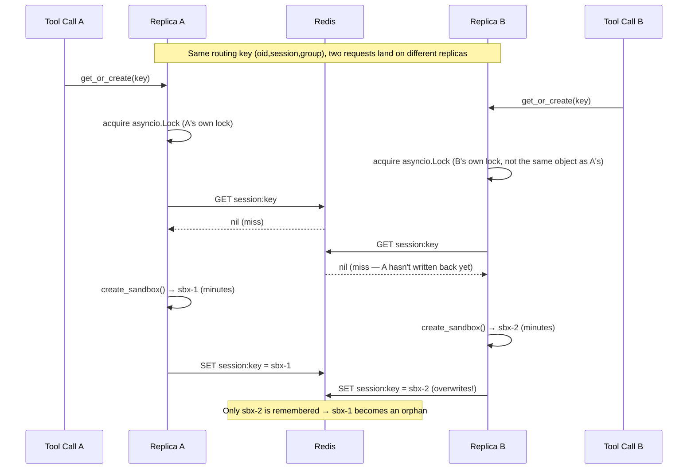
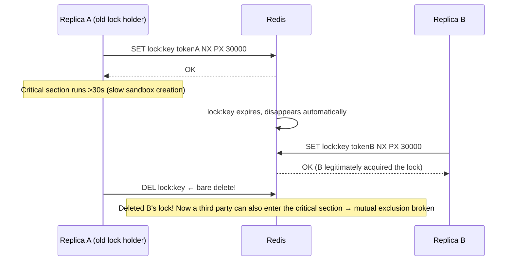
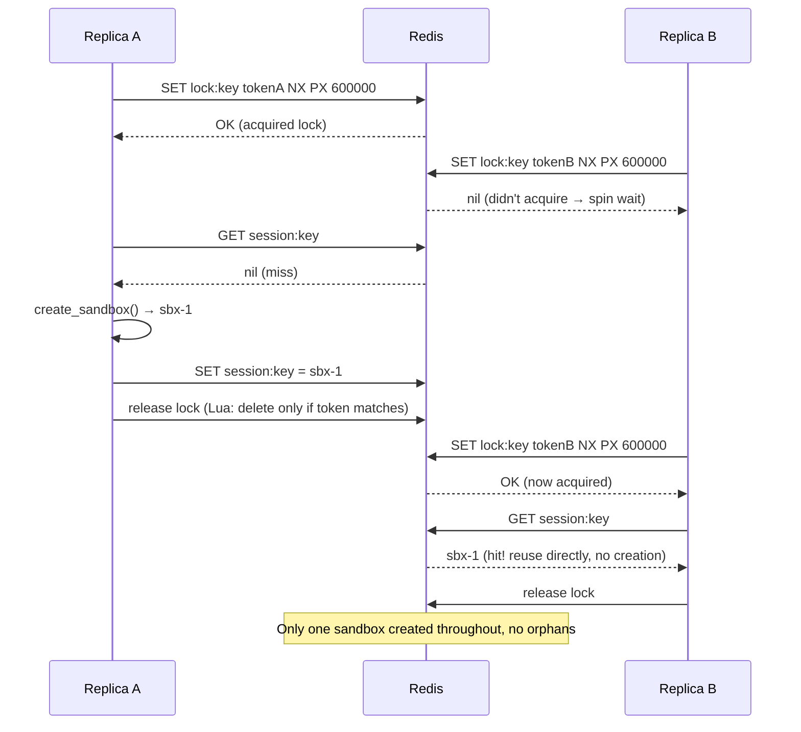
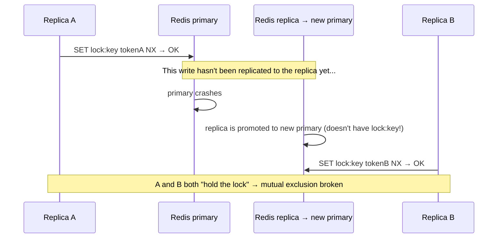
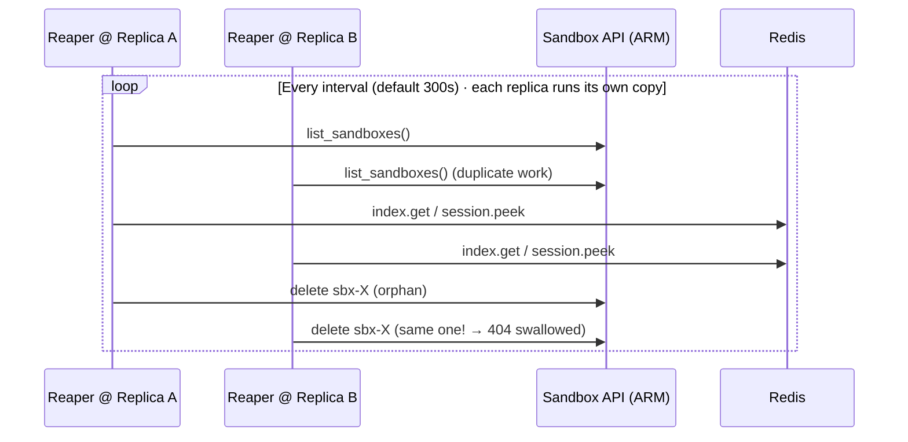
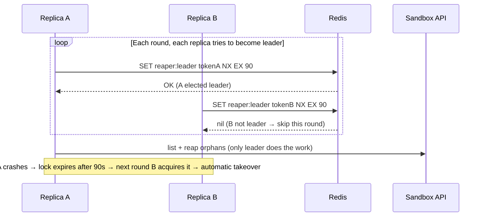

# MCP Server Horizontal Scaling: In-Process State, Distributed Lock, and Reaper Leader Election

This document follows up on the last sentence of commit `3465dee` (*fix(redis): dedicated redis Container App ...*):

> *full horizontal scaling also needs a distributed lock on the routing key and a single reaper leader — follow-ups.*

It explains **why this statement holds, the underlying principles, and how to implement it**. After reading, you should be able to answer:

1. After decoupling Redis, to what extent is this server truly "stateless"? What is still missing?
2. What exactly does the lock in `SandboxManager` **lock**? (Spoiler: it's not "protecting writes to Redis")
3. A distributed lock is **not** putting an `asyncio.Lock` object into Redis — so what is it? `SET NX` / TTL / token / Lua release / lease renewal, broken down one by one.
4. How does the Reaper currently run (current status), what are the refactoring options, and how to write leader election.

Involved code: `src/mcp-server/sandbox_manager.py`, `src/mcp-server/cache.py`, `src/mcp-server/main.py`.
Prerequisite reading: [MCP-User Isolation and Redis Design.md](../MCP-user-isolation-comparison-and-redis-design.md), [ACA-Sandbox Migration Plan.md](migrating-identity-aware-mcp-to-aca-sandboxes-plan.md).

---

## TL;DR

- **Criterion for "stateless"**: If a request lands on any replica at random, is the result the same?
- Decoupling Redis moved the **shared source of truth** (whose session uses which sandbox) from in-process into Redis — **this is the necessary first step for horizontal scaling, and it is complete**.
- However, **two pieces of in-process coordination state remain**, preventing it from being fully stateless:
  1. **The routing-key lock is `asyncio.Lock`, which only provides mutual exclusion within a single replica** → cross-replica duplicate sandbox creation (orphans). Fix: **Redis distributed lock**.
  2. **Each replica runs its own reaper** → N reapers scan the same set; idempotent but wasteful. Fix: **leader election**.
- These two things **share the same underlying Redis lock primitive**: `SET <key> <token> NX PX <ttl>` + Lua release + lease renewal.
- Fully horizontally scalable = **decoupled Redis (done) + routing-key distributed lock + single reaper leader**.

---

## 1. What "Stateless" Really Means

Here, "stateless" means **the process itself does not hold any critical state that would be lost if it were replaced by another replica**. This allows running N replicas, restarting arbitrarily, and load balancing freely. The criterion is just one sentence:

> **If a request lands on any replica at random, is the result the same?**

The Redis decoupling step moves the **true shared state / source of truth** from in-process into Redis:

| State | Meaning | Stored Now | Who Reads It |
|---|---|---|---|
| `SessionSandboxCache` | `(oid, session, group) → sandbox_id` routing table | **Redis** ✅ | `get_or_create` reuses on hit |
| `UserProfileCache` | `oid → {subscription_id, ...}`, rebuilds `az` context | **Redis** ✅ | `_user_subscription` / bootstrap |
| `UserSessionCache` | `oid → session_id`, 30 min sliding window | **Redis** ✅ | middleware derives session |
| Reverse index `_index` | `sandbox_id → {oid,session,group}` | **Redis** ✅ | reaper determines liveness |

These are the **sole source of truth for "who owns which sandbox"**. Putting them in Redis means a sandbox created by replica A can be found, reused, and reclaimed by replica B.

**Counterexample (why not a sidecar):** If Redis ran on `localhost` bound to each replica (sidecar mode), each replica would have **its own routing table**, and replica B would have no idea what A had created — the shared state is broken. This is the root cause of why `3465dee` insists on making Redis a **dedicated Container App** (not a sidecar):

```
sidecar:    Replica A ── localhost ── redis-A   (each sees its own, state not shared ✗)
            Replica B ── localhost ── redis-B

dedicated:  Replica A ─┐
                       ├──→ dataops-aca-redis:6379  (shared single source ✓)
            Replica B ─┘
```

> A pitfall we encountered: in-environment app-to-app TCP must use the app's **short name** (`dataops-aca-redis:6379`), not the `.internal.<domain>` FQDN returned by `ingress.fqdn` — the latter times out when connecting from a peer app. See commit `3465dee` and `redis.bicep` for details.

---

## 2. The Two Remaining Pieces of In-Process State

The data has been moved out, but **two coordination items remain in the process**, and they are the "last mile". Look at `SandboxManager.__init__` (`sandbox_manager.py:114-118`):

```python
self._group_clients: dict[Group, object] = {}   # SDK client cache — per-replica is fine, no issue
self._built_disk_ids: dict[str, str] = {}        # "I've built the disk image for this group" memo
self._ensured_volumes: set[str] = set()          # "I've ensured the volume for this group" memo
self._locks: dict[str, asyncio.Lock] = {}        # ★ routing-key lock — replica-level!
self._reaper_task: asyncio.Task | None = None    # ★ reaper background task — one per replica!
```

The two items marked with ★ are the problems. The next two major sections break them down. `_built_disk_ids` / `_ensured_volumes` / `group_cache` etc. are **not bugs**; they are characterized in Section 8.

---

## 3. What the Lock Locks — Correcting a Common Misconception

> Misconception: "This lock is to prevent **race conditions when writing to Redis**."

**No.** A single `SET` in Redis **is inherently atomic** — two clients writing the same key simultaneously will not corrupt or tear the data; the last writer wins. **Writing to Redis does not need a lock.**

What the lock actually protects is the entire **check-then-act** sequence in `get_or_create` (`sandbox_manager.py:191-229`):

```python
async with self._lock(f"{ctx.user_oid}:{ctx.session_id}:{group}"):   # ← critical section starts
    sandbox_id = await self._redis_safe(self._sessions.get(...))      # ① check: is there an existing one?
    if sandbox_id is not None:
        ... ensure_running → reuse, return ...                            #    hit: reuse
    client = await self._create_sandbox(...)                          # ② act:  actually create a sandbox (minutes!)
    await self._redis_safe(self._sessions.set(..., client.sandbox_id))# ③ write back to Redis
    ... write index, bootstrap(az login)...                              # ④ still in critical section
```

**The danger is not the write in ③, but the expensive and irreversible side effect between ① and ③ — actually creating a sandbox.**

Two concurrent requests both read `miss` at ①, so both proceed to ② and each creates a sandbox. Even if the write in ③ is atomic, **two sandboxes have already been created** — the orphan is produced at ②, not ③. So the semantics of the lock are:

> **"For the same routing key, only one person is allowed to make the 'check → create → write' decision at any given time."**
> This is mutual exclusion for a **critical section with an expensive external side effect**, not mutual exclusion for a Redis write.

### 3.1 Lock Granularity: Per Routing Key, Not a Global Lock

`_lock` (`sandbox_manager.py:183-188`) lazily creates and caches lock objects by key:

```python
def _lock(self, key: str) -> asyncio.Lock:
    lock = self._locks.get(key)
    if lock is None:
        lock = asyncio.Lock()      # ordinary asyncio lock, only mutual exclusion within this event loop
        self._locks[key] = lock
    return lock
```

- **Different routing key → different lock object** → user A and user B's sessions create their sandboxes **in parallel**, without blocking each other. ✅ This is good.
- **Same routing key, same replica → same lock** → serialized, preventing concurrency within the same replica. ✅
- **But across replicas, even for the "same" routing key, there are two different `asyncio.Lock` objects** — because `self._locks` is per-replica. ❌ This is the root cause of why it cannot prevent cross-replica races.

### 3.2 Cross-Replica Race Condition: Sequence Diagram

With N replicas, two concurrent requests for the same routing key land on different replicas:



Cost: one extra sandbox created + one extra bootstrap (`az login`). The orphan will eventually be cleaned up by the reaper or the platform's 1-hour `auto_delete`, but this should not happen.

### 3.3 When "Same Key" Is Really Concurrently Created Across Instances — Specific Trigger Scenarios for This Project

> **Prerequisites (all must be true, AND):** This orphan race condition **only** occurs when all three conditions are met:
> 1. **Same routing key** `(oid, session, group)`;
> 2. Two calls are **concurrent** (overlapping in time, not sequential);
> 3. They land on **different instances** (or: no cross-instance lock is in effect).
>
> ⚠️ **Currently `provisioning/aca/modules/mcp-app.bicep:120-121` is `minReplicas = maxReplicas = 1` (single instance)** — condition 3 is not met, `asyncio.Lock` fully covers same-key concurrency, **this race condition produces zero orphans today**. The discussion below is a **forward-looking scenario for when you set `maxReplicas` to ≥2 or enable auto-scaling**.

**Why "sequential multiple calls" don't count:** The same session will of course call many tools, but as long as the client is **sequential** (call one → wait for result → call the next), by the time the second call is made, the first has already returned and the sandbox is already written to Redis. So the second call **hits the cache and reuses**, never entering the create branch. **Sequential calls are safe even across instances.** The real sources of "concurrent same-key" are the following:

| # | Trigger Scenario (Specific to This Project) | Why It Collides on the Same Key | Real-World Probability |
|---|---|---|---|
| **1** | **Model issues multiple same-group tool calls in one turn**. Example: user asks "check the status of resource groups A and B simultaneously", the model sends **two `diagnose_bash`** calls in one message, the client (VS Code / Claude Desktop) dispatches them concurrently | Both are `group=diagnose` + same `(oid, session)` → **same key**; ACA ingress distributes the two concurrent requests to different replicas | ★★★ **Most likely**. Parallel tool calls are common |
| **2** | **Two conversations within the same session are concurrent**: session is a 30min sliding window, reused across conversations; two chats both touch diagnose for the first time | `conversation_id` **is not part of the routing key** (see migration plan), both conversations derive the **same `session_id`** → same key | ★★ Rare but possible |
| **3** | **Client timeout retry**: creating a sandbox takes minutes; if the client timeout is shorter than the creation time, it may **retry** while the original request is still in flight | The retry is for the **same tool call**, same key; the retry lands on another replica while the original replica is still creating | ★★ Depends on client timeout |
| **4** | Normal **sequential** multiple calls | — | ✗ No collision (subsequent calls hit the cache) |
| **5** | Concurrent `diagnose_bash` + `action_bash` | One is `group=diagnose`, the other is `group=action` → **two different keys** | ✗ No collision (they should each create a sandbox, correct behavior) |

**Note on scenario 5:** Different groups running in parallel is **correct**; two sandboxes should be created (one read-only diagnose, one writable action, with different identity boundaries). The lock **should not** and **will not** serialize them — the keys are different, so the lock objects are different (§3.1).

**Amplifier — why it's easy to hit once concurrent:** In other systems, the check-then-act window is microseconds, and hitting it requires luck; **in this project, ② creating a sandbox takes minutes**, making the window **minutes long**. For scenarios 1/2/3, if two calls fall within these minutes and the first sandbox hasn't been written back to Redis yet, the second will inevitably also miss. The good news is: **this window only exists for the "first create" of each `(session, group)`**; once the sandbox is in Redis, all subsequent calls are cache hits, and there is no more contention.

**In a nutshell:** For this app, **the most realistic source of orphans is "the model issues two same-group bash calls in parallel in one turn, and the web layer happens to have scaled to multiple instances"**. When these two things **happen simultaneously**, not adding a distributed lock will leak orphans (the reaper will clean them up, but it shouldn't happen).

> **Another cheap mitigation (not a distributed lock):** ACA ingress supports **session affinity**, pinning requests from the same client to the same replica → same-key concurrency goes back to the same `asyncio.Lock`. This can block **scenario 1** (parallel calls from the same client), but not **scenarios 2/3** (different conversations/clients, or retries after the original replica becomes unreachable); and it **requires the client to carry the affinity cookie** (standard browsers/HTTP clients do, MCP streamable-HTTP clients need to be confirmed). So it's a **partial mitigation**; for true rigor, use the Redis lock from §4.5.

---

## 4. Distributed Lock: Principle Breakdown

### 4.1 Core Concept: **Using a Redis Key to *Simulate* a "Lock", Not Storing a Lock Object**

The most important cognitive correction: **The `asyncio.Lock` object can neither be stored in Redis nor would it make sense to do so.** It is tied to a specific replica's event loop; serializing it into another process yields useless bytes.

The truth about a distributed lock is a **convention / protocol**:

> To hold the logical lock `L`, you must first "occupy" the Redis key `lock:L`. **Key exists = lock is held; key does not exist (or has expired) = lock is free.**

It relies on a single atomic Redis command:

```
SET lock:<routingkey>  <random-token>  NX  PX 600000
```

Breaking down each field:

| Field | Meaning | Why It's Needed |
|---|---|---|
| `lock:<routingkey>` | Lock identity = a key | The lock is not an object; it's a convention that "whoever occupies this key holds the lock" |
| `<random-token>` | Value stores a random string (e.g., `uuid4`) | Marks "this lock is mine", **prevents accidental deletion during release** (see 4.3) |
| `NX` | only set if **N**ot e**X**ists | **Atomic**: only one client succeeds in a concurrent scenario, the rest get `nil` — this is the mutual exclusion mechanism |
| `PX 600000` | Auto-expires after 600s (milliseconds) | **Prevents deadlock**: if the holding replica crashes/hangs, the lock will expire on its own, preventing the system from being stuck forever |

### 4.2 Complete Lifecycle of Acquire / Release

```python
import uuid

async def acquire(redis, lock_key, ttl_ms, *, retry_every=0.2, max_wait=30):
    token = uuid.uuid4().hex
    waited = 0
    while True:
        ok = await redis.set(f"lock:{lock_key}", token, nx=True, px=ttl_ms)
        if ok:                       # acquired
            return token
        if waited >= max_wait:       # waited too long, give up (avoid infinite blocking)
            raise TimeoutError("could not acquire lock")
        await asyncio.sleep(retry_every)   # someone else holds it → spin wait
        waited += retry_every

# Release: see 4.3, must use token + Lua, not bare DEL
```

- Acquired lock (`SET` returns OK) → enter critical section.
- Did not acquire (returns `nil`) → someone else holds it → **spin retry / wait and try again**, until the key disappears or timeout.

### 4.3 Why Release Cannot Be a Bare `DEL` — "Deleting Someone Else's Lock" Sequence Diagram

If you simply `DEL lock:key`, a subtle bug occurs: your lock may have **already expired, and someone else has re-acquired it**, so your `DEL` deletes **someone else's lock**.



Correct solution: store the token in the value, and use a **Lua script** for release ("only delete if the value equals my token", check-and-delete is **atomic** within Redis):

```lua
-- KEYS[1] = lock:key, ARGV[1] = my token
if redis.call("get", KEYS[1]) == ARGV[1] then
  return redis.call("del", KEYS[1])
else
  return 0    -- not my lock, don't touch it
end
```

### 4.4 The TTL vs. Critical Section Length Dilemma (Real Pain Point for This Project)

First, separate two **easily confused** issues — §4.3 only solved the first:

| Issue | What It Is | Does Token+Lua Solve It? |
|---|---|---|
| **P1 · Accidental deletion (§4.3)** | After your lock expires, you `DEL` and delete **someone else's** legitimately acquired lock | ✅ Solved (only deletes if token matches) |
| **P2 · Lock expires mid-operation (this section)** | Create takes longer than TTL → lock **expires on its own** → someone else legitimately acquires it → **two replicas in the critical section simultaneously** → double creation of orphans | ❌ **Token does not address this at all** |

The diagram in §4.3 is **P1** (A accidentally deletes B's lock). Adding the token eliminates P1, but **A and B would still be creating sandboxes simultaneously** — this is **P2**, unrelated to "whether the deletion is correct", purely because **the lock's lifetime < the critical section's duration**.

Looking back at the critical section in Section 3: ② creating a sandbox takes **minutes**, ④ also requires `az login`, and the **entire bootstrap is inside the lock** (the entire `get_or_create` is inside `async with`). If the TTL is shorter than this, P2 is inevitable.

**Three tiers of solutions, honestly ranked:**

1. **Set TTL long enough** (600s to cover the worst-case sandbox creation time). **Reduces probability, cannot eliminate**: you can never be 100% sure the TTL covers the worst case (ARM hiccup, GC pause); and if a replica truly crashes, you have to wait the full TTL for release.
2. **Watchdog lease renewal**: short TTL + a background coroutine that `PEXPIRE` renews every TTL/3. **Stays alive if the process is alive, releases quickly if it crashes** — better than a fixed long TTL. **But there is still a hole**: if the process is "not dead but stuck" (long GC, event loop blocked, network partition to Redis), the renewal cannot run → lock expires → someone else acquires it → the stuck process wakes up thinking it still holds the lock → two lock holders again. The window is much narrower, **but not completely closed**. This is Martin Kleppmann's classic criticism of Redlock.

   ```python
   async def _watchdog(redis, lock_key, token, ttl_ms, interval):
       while True:
           await asyncio.sleep(interval)          # e.g., 1/3 of TTL
           # Also needs token verification before renewal (Lua), to avoid renewing someone else's lock
           await redis.eval(RENEW_LUA, 1, f"lock:{lock_key}", token, ttl_ms)
   ```

3. **Fencing token (the only theoretically truly safe solution)**: The lock issues a **monotonically increasing number** each time, and the **protected resource** validates "only accept writes with a number higher than the last seen one", rejecting writes from the old lock holder — regardless of TTL/stalls. **But this requires the resource side to support validation**.

> **Fundamental limitation: A TTL-based distributed lock can never provide perfect mutual exclusion for a critical section that may exceed the TTL.** This is not an implementation issue; it's a principle (Kleppmann, 2016). For complete safety, only a fencing token works, and it requires **cooperation from the resource side**.

**So what should this project do? — Don't pursue a perfect lock; rely on defense in depth.**

- Key realization: **This lock is an "efficiency lock", not a "correctness lock"** (see §4.8 for details). The cost of its failure is **bounded and self-healing**: one extra orphan, cleaned up by the reaper + platform `auto_delete`. The 1:1 binding (no cross-user leakage) is independently guaranteed by **create-binds-unique + never-rebind** (§5.1), **unrelated to the lock**.
- So the correct approach = **lock (long TTL + watchdog) reduces double creation to rare** + **reaper reconciliation ensures any leaks are cleaned up**. **The lock is responsible for saving money; the reaper is responsible for correctness.**

**Can the fencing idea be applied at the resource level? (Deterministic naming)** The cleanest true mutual exclusion is to let the **platform itself** reject duplicates: derive a **deterministic sandbox name** from the routing key, and the second concurrent creation is rejected due to a **name conflict** — equivalent to a database `INSERT ... ON CONFLICT` / unique constraint, **TTL-independent and truly safe**.

> ⚠️ **But the ACA Sandbox platform does not support this (2026-02-01-preview, checked official docs):** `sandbox_id` is minted by the platform; the caller cannot specify it; `labels` can be set at creation time and queried via `list_sandboxes(labels=…)`, but **labels have no unique constraint** (multiple sandboxes can have the same label), and there is **no conditional / idempotent / create-if-absent** operation. In other words, **the platform layer has no native mutual exclusion primitive** — it's not that we didn't use it; it doesn't exist. Therefore, "**best-effort lock + reaper reconciliation**" is **not a choice but the optimal solution forced by the platform**.

> **Redlock** is a distributed lock algorithm proposed by the Redis author for "multiple independent Redis nodes" (acquiring the lock requires a majority of nodes). We currently have a single Redis instance (§4.8), so **we don't need Redlock**; just understand it as the "rigorous version" of a distributed lock.

### 4.5 Don't Reinvent the Wheel: `redis-py` Has a Built-in `Lock`

The token / Lua release / blocking wait are all encapsulated in `redis-py`. The async version can be used directly with `async with`:

```python
def _dlock(self, key: str):
    # Replaces the in-process self._lock(); timeout is TTL, blocking_timeout is max wait time
    return self._redis.lock(
        f"lock:{key}",
        timeout=600,            # Lock TTL, must cover the worst-case sandbox creation time
        blocking_timeout=30,    # Max blocking time if the lock cannot be acquired
    )

async def get_or_create(self, ctx):
    key = f"{ctx.user_oid}:{ctx.session_id}:{ctx.group}"
    async with self._dlock(key):          # ← cross-replica mutual exclusion, replaces original self._lock(key)
        ...  # The original check-create-write block, now serialized across replicas
```

> Note: `redis-py`'s `Lock` does **not auto-renew** by default. For very long critical sections, either set `timeout` large enough or manually call `lock.extend()`. For this project, the critical section takes minutes, so make sure `timeout` is set sufficiently high (or add a watchdog).

### 4.6 After Adding the Distributed Lock: Sequence Diagram

Compare with the race condition diagram in 3.2. Now B is blocked by the Redis lock, and after A finishes, B finds `sbx-1` and reuses it directly:



### 4.7 Plan B: Don't Lock the Entire Block; Use "Optimistic Claim + Poll"

Holding a lock for minutes is heavy (other replicas are blocked). Another approach: **use only one atomic write to "claim"**, and move the expensive creation outside the lock:

1. `SET session:key "CREATING:<token>" NX` — atomic claim.
2. **The one who claimed**: create the sandbox, then rewrite the value to the actual `sandbox_id`.
3. **Those who didn't claim**: poll this key until it changes from `CREATING:*` to the actual `sandbox_id`, then reuse.

Advantages: no "holding the lock for minutes"; disadvantages: more complex state machine (need to handle the case where the claimer crashes mid-way, `CREATING` stuck and needs timeout recovery). **Master the main line (4.1–4.6) first; Plan B is an advanced option.**

| Approach | Mutual Exclusion Granularity | Complexity | When to Choose |
|---|---|---|---|
| Distributed lock (4.5) | Locks the entire check-create-write block | Low, existing library | Default recommendation, implement this first |
| Claim + poll (4.7) | Locks only one atomic claim | High, manage state machine yourself | When sandbox creation is extremely slow, concurrency is very high, and you don't want to block other replicas |

### 4.8 If Redis Itself Has Multiple Instances: Does the Lock Still Hold?

The discussion in 4.1–4.7 has an **unstated premise: all web replicas are talking to the "same, authoritative" Redis instance**. The statement in §4.1 "key exists = lock is held" only holds if **everyone is asking the same Redis**. Once you make **Redis itself** "multiple instances", you need to distinguish between cases — and the conclusions differ significantly, because "multi-Redis" has three completely different meanings.

| Topology | What It Is | Does the Lock Still Hold? |
|---|---|---|
| **A. Master-Slave / Sentinel** (one logical Redis, primary + read-only replicas, automatic failover) | Writes always go to the **primary**; replicas are asynchronously replicated read-only copies | **Holds under normal operation** (all `SET NX` go to the same primary); **only a brief safety window during failover** — see below |
| **B. Redis Cluster** (sharded, multiple masters each managing a subset of keys) | A lock key is hashed to **a single shard's master** | **Essentially the same as A**. Sharding only addresses capacity, **does not enhance or weaken lock safety**; each shard is still "single master + async replica", the failover window still exists |
| **C. N completely independent Redis instances** (truly multi-instance, no replication between them, each replica connects to its own) | There is no "single source of truth" | **Completely broken** ❌ — Replica A succeeds with `SET NX` on redis-1, Replica B also succeeds on redis-2, both think they hold the lock, mutual exclusion is zero |

**Case C should remind you of the sidecar anti-pattern from §1**: a lock is itself a form of **shared state**, and it has the exact same requirement as the routing table — there must be a **single, universally recognized source of truth**. Splitting Redis into N independent instances is equivalent to splitting the routing table into N pieces, breaking the shared state. To safely lock across N independent nodes, you would need **Redlock** as mentioned in §4.4: you must acquire the lock on a **majority of nodes (N/2+1)**.

**Even with the most common master-slave setup (A), there is a safety window that cannot be eliminated with a single Redis instance**, rooted in **asynchronous replication**:



When the primary responds OK, the write hasn't reached the replica yet; when the primary crashes and the replica takes over, the lock is lost. This is not a configuration issue; it's an **inherent trade-off** of the master-slave architecture. The complete solution is **fencing tokens** (the lock issues a monotonically increasing number each time, and the protected resource rejects old numbers) — but this requires **cooperation from the resource side for validation**. The resources in this project (ARM creating sandboxes + `SET session:key`) do not validate, so we don't go down this path.

**But for this project, this is not fatal — because this lock is an "efficiency lock", not a "correctness lock".** Review §5.1: the 1:1 binding (no cross-user session leakage) is independently guaranteed by **create-binds-unique + never-rebind**, **unrelated to this lock**. So even if the lock fails during failover (A) or with multiple instances (C), the worst-case outcome is:

- Two replicas each create a sandbox → `SET session:key` last writer wins → the other becomes an **orphan** → the reaper deletes it, platform 1h `auto_delete` as a safety net;
- **No** cross-user data leakage — each sandbox is still bound to a unique routing key, just one key briefly has an extra sandbox.

Its failure mode is **bounded** (one extra orphan, self-healing), not catastrophic. **The reaper leader lock (§6.1) is even less of a concern**: a dual-master scenario just reverts to "N reapers idempotently scanning" (already proven safe in §5.3).

**Conclusion / Deployment Recommendations:**

| Redis Deployment | Status of This Lock | Recommendation |
|---|---|---|
| **Single instance standalone** (current `dataops-aca-redis`) | Completely correct, no window | ✅ Sufficient |
| **Master-Slave / Sentinel** (for high availability) | Correct under normal operation, brief window during failover → occasional orphan | ✅ Acceptable, reaper handles it; don't treat it as a correctness lock |
| **Redis Cluster** (for capacity) | Same as above, single key lands on one shard | ✅ Acceptable; multi-key Lua scripts need to be in the same slot (use hash tags) |
| **N completely independent Redis instances** | ❌ Lock completely broken | **Don't do this**; if you truly need multiple independent nodes, use Redlock |

In a nutshell: **"Scaling web replicas" and "scaling Redis" are two different things. This solution only needs a single "logical Redis" instance** (standalone or primary+replica both count), **and does not need, nor should it, split Redis into multiple independent instances**. The lock / master-slave / reaper here are different manifestations of the same primitives as databases and orchestration systems. For a systematic comparison, see [Distributed Primitives-Database-Orchestration Three-Way Comparison.md](distributed-primitives-database-orchestration-comparison.md).

### 4.9 Timeout Orchestration: Four Timeouts, Each Managing a Different Aspect

§4.4 stated that "the TTL vs. critical section length dilemma has no perfect solution, only insurance". This section explains **how to configure those insurance policies**. Once you actually use the Redis lock from §4.5, **four different timeouts** come into play, each **handling a different type of failure, and none can replace another**. The most common mistake is conflating the timeout for "the one waiting for the lock" with the timeout for "the one creating the sandbox".

**First, a mutual exclusion: long TTL and watchdog renewal cannot both be used; choose one.** They are **two mutually exclusive answers** to the question "the critical section is long (creating a sandbox takes minutes), how do I prevent the lock from expiring mid-operation":

| Approach | How to Configure | Recovery After Crash | When to Choose |
|---|---|---|---|
| **Long TTL** | Set it large enough once (e.g., 600s / 10min), **no renewal** | If the lock holder crashes, you must **wait the entire TTL** for release | For simplicity, when the upper bound of the critical section is well-defined |
| **Renewal / Watchdog** | Intentionally use a **short TTL** (e.g., 30s) + a background coroutine that `PEXPIRE` renews every ~10s | If it crashes → renewal stops → **releases in ~TTL seconds**, fast recovery | When you want fast failure recovery (recommended) |

**The prerequisite for renewal is a short TTL** — its entire purpose is "so you don't have to use a long TTL". **"Long TTL + renewal" is the worst combination** (slow recovery + renewal complexity, zero benefit); no one configures it this way. **If you choose renewal, use a short TTL; if you want a long TTL, don't add renewal.** (Note: renewal ≠ **Redlock**; Redlock is the algorithm from §4.4 for "majority of multiple independent Redis nodes", which is different from "single-node short TTL renewal".)

On top of the "renewal/long TTL" choice, you need to layer three more timeouts, covering **four roles**:

| Role | Who | Timeout Used | Failure Handled |
|---|---|---|---|
| **Lock-holding creator A** | The replica creating the sandbox | **Short TTL + watchdog renewal** | A **crashes**: renewal stops → releases in ~TTL seconds |
| **A is stuck but not crashed** (still renewing) | Same as above | **Create operation timeout** (upper bound of critical section) | A **stuck**: creation takes too long → actively `cancel` + release lock + error → let someone else try |
| **Lock-waiting replica B** | Those that couldn't acquire the lock | **`blocking_timeout`** | B **waits indefinitely**: gives up after timeout + error, **does not touch A's lock** |
| **Client** | MCP client | Request timeout **≥ cold start** | Client **premature timeout**: don't give up before the sandbox is created |

**Key distinction: The switch that makes A release the lock and lets someone else try is the "create operation timeout", not `blocking_timeout`.** Because when A is stuck, the watchdog will keep renewing; only by setting an upper bound on "the create sandbox action itself" can you `cancel` + release when exceeded. `blocking_timeout` governs B's side "how long to wait before giving up"; it **does not** make A let go.

**Ordering rule (each layer must be > normal cold start):**

```
Normal sandbox creation (~5min)
  ≤  Create operation timeout     (A holds the lock for at most this long, gives up if exceeded)   ~6–8min
  ≤  blocking_timeout             (B waits at most this long to acquire the lock)                   ~8–10min
  ≤  Client request timeout       (Client waits at most this long for a result)                     ≥ above
```

Why `create timeout < blocking_timeout` is necessary: if reversed, **B would report an error to the client while A is still successfully creating the sandbox** — B could have waited for A to finish and then reused, but instead it fails unnecessarily, leading to A succeeding and B failing in the same session, which is wasteful and inconsistent. So you must **deliberately make the waiting party's patience exceed the creating party's single attempt**:

- **A succeeds (normal case)**: B keeps waiting → A writes back to Redis → B acquires the lock **and finds a hit, reuses, no creation**. ✅ This is the value of the lock: B benefits from A's work.
- **A is stuck/fails**: A reaches the create timeout and releases the lock; B is still waiting (because blocking_timeout is longer) → B gets its turn. ✅

> ⚠️ **Real-world ceiling:** The entire chain above is > 5 minutes, **which requires the client to be willing to wait more than 5 minutes**. Many MCP clients have a default request timeout of only tens of seconds — in that case, **the cold start will time out on the client side first, and no amount of lock tuning will help**. The only solution then is not timeout tuning, but **a warm pool** (turning a 5-minute cold start into a sub-second claim). **Warm pool is a separate discussion**; for now, just remember: **timeout orchestration solves "don't create duplicates + don't give up too early", but it cannot solve the UX problem of "the client can't wait for a cold start".**

**A must-know pitfall: A "releasing the lock" ≠ cancelling the ARM creation.** When A `cancel`s and releases on its side, it just means A stops waiting; **the ARM sandbox may still be in the process of being created and may eventually be created** → it becomes an orphan. Plus, B also creates one → two sandboxes. So "releasing the lock to let someone else try" is correct, but **the cost is potentially one extra orphan** (cleaned up by the Reaper, §4.10). This is another case of "external side effects cannot be rolled back" (see the comparison document), and it cannot be eliminated.

**Moreover, "letting someone else try" is not always useful:** If the failure is **local to A** (A's process is stuck, A's network to ARM is broken) → letting B try **is useful**; if the failure is in the **shared resource ARM** (ARM is down / throttled) → B trying **will also fail**, just wasting a retry. So **limit the number of retries**, and if exceeded, honestly report the error to the user ("sandbox temporarily unavailable"), don't let the request loop indefinitely.

### 4.10 Failure Convergence and Defense in Depth: How Bad Is the Worst Case?

**After both A and B fail, if the user asks again in the same session — that is "re-running create for the same key".**

- **Same session**: `session_id` is derived from the user's 30-minute sliding window; if the user asks again within the window, **even if it's a new conversation, it's the same `session_id`** (`conversation_id` is not part of the routing key, only used for Blob subdirectories).
- **Same key**: `(oid, session, group)` hasn't changed → same routing key.
- **Equivalent to re-running create**: A and B both failed → Redis doesn't have a valid sandbox_id for this key (either it was never written, or a half-baked one was written and `ensure_running` will fail and clean it up) → the next same-key call **will inevitably miss → re-enter create**.

**This is idempotent convergence:** No matter how many times the same key is retried, the goal is always "to get **that one** sandbox for this `(oid, session, group)`". The debris from failed attempts is cleaned up by the Reaper / auto_delete, and the successful retry binds to the key, **ultimately converging to "one key, one sandbox"**.

> **A gap in the reverse index:** If A crashes **after successfully creating the sandbox but before writing to Redis**, that sandbox has **no record at all in Redis** (neither forward nor reverse index was written) → the Reaper cannot find it via the reverse index (treats it as "not ours" and skips it) → **it can only be cleaned up by the 1h `auto_delete` safety net**. This is an inherent gap where "external side effects precede local bookkeeping"; the probability is low, the impact is bounded (1h), but it exists.

**Defense in depth: three independent nets + one safety baseline.** §4.4 explained that "the lock is an efficiency lock, not a correctness lock". Here is the clear relationship of the safety nets:

| Layer | Mechanism | Role | Independent? |
|---|---|---|---|
| 1 | **Distributed lock** (§4.5, tuned per §4.9) | Blocks **the vast majority** of double creations | One layer (§4.4/§4.9 tune it, not add another) |
| 2 | **Reaper** (every ~300s) | Cleans up any orphans that slip through (reverse index identifies `live≠self`) | ✅ Independent |
| 3 | Platform **auto_delete (1h) + auto_suspend (5min)** | Final safety net even if the Reaper is down | ✅ Independent |
| — | **never-rebind invariant** (§5.1) | Guarantees an orphan is **never** bound to another user | Correctness baseline, unrelated to the above |

**How bad is the worst case — don't be scared by "1 hour":**

- **Orphans are usually cleaned up by the Reaper within ~5 minutes**, not after a full hour. The Reaper scans every ~300s, and in the next round it will identify the orphan (its reverse index key now points to the **winning** sandbox sbx-2, `live(sbx-2) != sbx-1` → delete).
- Moreover, the orphan is unused → **auto_suspend suspends it after 5 minutes** (stops compute billing), so even if not yet deleted, it's essentially not costing money.
- **The 1-hour `auto_delete` is just the final safety net "even if the Reaper is down"**, not the normal waiting time.

So the precise worst case is:

> **All the above conditions are met → one extra orphan is created → usually deleted by the Reaper within 5 minutes (and suspended after 5 minutes, no billing); only if the Reaper is also down does the 1-hour auto_delete kick in.** The cost is just "a few minutes of minor waste", **not a correctness/security issue** — `never-rebind` guarantees that orphan is never bound to another user, so there is no cross-user session leakage or data exposure.

**One-sentence division of labor: the lock saves money, the Reaper handles the tail, `never-rebind` ensures safety; each manages its own domain.**

---

## 5. Reaper: Current Status

### 5.1 Understanding the Reverse Index: The Reaper's Eyes

The reaper code frequently references `self._index`. This is the **reverse index** from the state table in §1. "Reverse" is relative to the **primary query direction** — the system has two Redis tables with opposite directions:

```
Forward (for routing):  (oid, session, group)  ──→  sandbox_id
Reverse (for reaper):    sandbox_id            ──→  (oid, session, group)
```

- **Forward** = `SessionSandboxCache` (`cache.py:114`), key is `session:{oid}:{session}:{group}`. This is the **direction used during normal operation**: a tool call comes in with `(oid, session, group)`, and we look up "which sandbox to use".
- **Reverse** = `_index` (`sandbox_manager.py:134`, prefix `mcp:sbxidx`), key is `sandbox_id`, value is `{oid, session, group}`. It **stores the forward table in reverse**, like a secondary index in a database — to allow querying **from the other end**.

When a sandbox is created, both tables are written simultaneously (`sandbox_manager.py:214-222`):

```python
client = await self._create_sandbox(...)                              # platform mints a new unique sandbox_id
await self._sessions.set(oid, session, group, client.sandbox_id)      # forward
await self._index.set(client.sandbox_id, {"oid":..., "session":..., "group":...})  # reverse
```

**Why the reaper needs it:** The reaper gets **only sandbox_id** from ARM `list_sandboxes()`. To answer "is this sandbox still held by a live session?", it needs to look up the session key in the forward table — but the forward key is `(oid, session, group)`, **which cannot be queried by sandbox_id**. The reverse index is that bridge (`reap_orphans` `:454-460`):

```python
meta = await self._index.get(sbx.id)        # ① reverse: sbx.id → {oid,session,group}
if not meta: continue                        #    not found → not ours, platform auto-delete handles it
live = await self._sessions.peek(            # ② use meta to look up the forward table to see if the session is still alive
    meta["oid"], meta["session"], meta["group"])
if live == sbx.id: continue                  #    session still alive → keep it; otherwise → orphan → delete
```

Two design details:

1. **Reverse index `ttl=None` (never expires)**, while the forward session table has a 30-minute TTL. This is intentional: when the session window expires (session ends), the forward key disappears automatically, and **it is precisely after this** that the reaper needs the reverse index to identify "this sandbox is no longer needed". If the reverse index also expired, the reaper would see `meta is None` → treat it as "not ours" and skip it, leaving it to the platform's 1-hour safety net. So **the reverse index must outlive the session key**; it is instead explicitly cleaned up on deletion (`end_session` `:424`, after successful reap `:467`).
2. **It also serves as a "managed" marker**: having a reverse record means "this sandbox was created by us, we manage it"; no record means it belongs to someone else / the platform, and the reaper does not touch it.

**The binding is 1:1 and is a security invariant:** A sandbox_id always corresponds to **exactly one** `(oid, session, group)` for its entire lifetime. This is not guaranteed by "destroy after use" (a sandbox is **reused** across multiple tool calls within a session, not destroyed each time), but by two invariants — **create-binds-unique** (each creation mints a brand new unique id, bound only to the current routing key) + **never-rebind** (there is no code path that writes an existing sandbox_id under a second routing key; reuse reads the old id and uses it directly without rewriting the binding). This 1:1 relationship is also the baseline for user isolation: if the binding were to leak, it would mean cross-user session leakage / data exposure.

> Note on direction: **"One sandbox → multiple keys" cannot happen**; but its dual **"one key → multiple sandboxes" can** — this is exactly the cross-replica create race condition from §3.2 (a routing key is concurrently created as sbx-1 and sbx-2, the forward table last writer wins, the other becomes an orphan). This is also what the distributed lock aims to eliminate.

### 5.2 Code Walkthrough

```python
async def exec(self, ctx, command):       # :393
    self._ensure_reaper()                  # ← called on every tool invocation
    ...

def _ensure_reaper(self):                  # :427
    if self._reaper_task is None or self._reaper_task.done():
        self._reaper_task = asyncio.create_task(self._reaper_loop())  # in-process background task

async def _reaper_loop(self):              # :432
    while True:
        await asyncio.sleep(self._reaper_interval)   # default 300s
        try:
            await self.reap_orphans()
        except Exception:                  # swallow exceptions, loop never dies
            ...

async def reap_orphans(self):              # :440
    for group in ("diagnose", "action"):
        async for sbx in gclient.list_sandboxes():     # list all sandboxes for that group
            meta = await self._index.get(sbx.id)       # look up reverse index (Redis)
            if not meta:        continue               # not ours → platform auto-delete handles it
            live = await self._sessions.peek(...)      # non-sliding read of session key (doesn't refresh window)
            if live == sbx.id:  continue               # still held by a live session → keep it
            await gclient.begin_delete_sandbox(sbx.id) # otherwise: session gone → delete
            await self._index.delete(sbx.id)
```

The reaper's purpose: **delete as soon as a session ends, without waiting for the platform's 1-hour `auto_delete` safety net.** Note that `peek` uses a **non-sliding read** (`cache.py:140`), so the reaper's check does not extend the session window.

### 5.3 Current Status Assessment

| Dimension | Status |
|---|---|
| Startup method | Lazy startup, **each replica starts its own** `create_task` background task |
| Number of replicas N | **N reapers scanning the same set of sandboxes** |
| Correctness | ✅ Basically OK. Two reapers trying to delete the same sandbox → one succeeds, the other receives `ResourceNotFoundError` which is swallowed by `:465`, no error |
| Cost | ❌ Wasteful: N times the `list_sandboxes` + delete calls; risk of ARM API throttling when N is large |
| Safety net | Even if all reapers are down, it's not fatal: the platform layer's `auto_suspend` (default 300s suspend) + `auto_delete` (default 3600s delete, see `_apply_idle_autodelete` `:342`) will still self-reclaim. **Note: under normal conditions, orphans are usually deleted by the reaper within ~5min; the 1h is just the final safety net "even if the reaper is down", see §4.10** |

### 5.4 N Reapers Scanning in Parallel: Sequence Diagram



---

## 6. Reaper Refactoring Options

| Option | Approach | Trade-offs |
|---|---|---|
| **1. Do nothing (current state)** | N idempotent reapers | Simplest, correct. Sufficient for small N. Cost is N× duplicate scanning + throttling risk |
| **2. Redis lease-based leader election (recommended)** | One replica uses `SET reaper:leader <token> NX EX 60` to acquire leadership and renews; only the leader runs `reap_orphans`, others skip. Leader crashes → lock expires → another takes over automatically | **Correct solution**, ~20 lines, **reuses the same Redis lock primitive from Section 4**. Web layer still has N replicas, but only one reaper actually works |
| **3. Stagger / add jitter** | Still N reapers, but add random offset to the interval to avoid hitting the API simultaneously | Cheap, mitigates thundering herd, but still N× the work. Half-baked |
| **4. Extract into a standalone singleton** | Move the reaper out of the web process: a separate Container App with `min=max=1` replica, or an ACA Job / scheduled trigger dedicated to reclamation | Cleanest architecture — **web layer becomes truly stateless, reaper is naturally a singleton**. Cost is an additional piece of infrastructure |
| **5. Rely solely on platform auto-delete** | Remove the custom reaper, rely entirely on `auto_delete` (1h) + `auto_suspend` | Simplest, but loses the "reclaim as soon as a session ends" speed; idle sandboxes may cost money for up to 1 hour |

**Recommendation:** Currently N is small, **option 1 is fine for now**; to do "proper horizontal scaling" → **option 2** (same mechanism as the routing-key lock); to make the web layer completely stateless and brainless, upgrade to **option 4**.

### 6.1 How to Write Leader Election

It's the same primitive as the distributed lock, except this lock **means "I am the reaper leader for this round"**, and it is **continuously renewed to maintain leadership**:

```python
async def _reaper_loop(self):
    while True:
        await asyncio.sleep(self._reaper_interval)
        # Acquire leadership for this round; EX TTL must be > worst-case reap time
        token = uuid.uuid4().hex
        got = await self._redis.set("reaper:leader", token, nx=True, ex=90)
        if not got:
            continue                  # not the leader → skip this round
        try:
            await self.reap_orphans() # only the leader does the work
        finally:
            # Release with token verification (Lua), or let it expire naturally for the next round to re-elect
            await self._redis.eval(RELEASE_LUA, 1, "reaper:leader", token)
```



---

## 7. Unified Perspective: One Lock Primitive, Solving Two Problems

The commit message mentions *"distributed lock on the routing key"* and *"single reaper leader"* as two things, but **they share the same underlying Redis lock primitive** (`SET <key> <token> NX PX/EX <ttl>` + Lua release + renewal), just with different keys and semantics:

| Use Case | Lock Key | Lock Semantics | Problem Solved |
|---|---|---|---|
| Routing-key lock | `lock:{oid}:{session}:{group}` | "I am creating/reusing the sandbox for this session" | Prevents cross-replica duplicate sandbox creation (orphans) |
| Reaper leader | `reaper:leader` | "I am doing the reclamation for this round" | Prevents N reapers from scanning the same set |

Implement this one primitive (recommended: use `redis-py`'s `Lock` directly), and both follow-ups are covered.

---

## 8. Appendix: Other In-Process State (Characterization, Not Bugs)

`SandboxManager` / `main.py` also have a few in-process dicts/sets. Across replicas, they are **safe, just slightly redundant on first access or have lower hit rates, without affecting correctness**:

| State | Location | Cross-Replica Behavior | Why It's Safe |
|---|---|---|---|
| `_group_clients` | `sandbox_manager.py:114` | Each replica creates its own SDK client | Should be per-process, no sharing needed |
| `_built_disk_ids` | `:115` | Each replica checks for disk image on first access | `_ensure_disk_image` first `list_disk_images` **reuses existing Ready images** (`:327`), does not rebuild |
| `_ensured_volumes` | `:116` | Each replica tries to create the volume on first access | `_ensure_volume` **swallows** `409 GlobalVolumeAlreadyExists` (`:303`), idempotent |
| `group_cache` | `main.py:85` `InMemoryBackend` | **Group membership cache is still in-process**, each replica caches its own copy | Not a correctness bug, but: a user removed from a group will be **cached for up to `GROUP_CACHE_TTL` (300s) on each replica**, and the hit rate is also lower. The comment itself says "swap InMemoryBackend for a RedisBackend to share across pods" — **a worthwhile follow-up** |

> Summary: `_built_disk_ids` / `_ensured_volumes` were made idempotent by `3465dee`, so they are safe; `group_cache` can be moved to Redis for stricter consistency (replace `InMemoryBackend` with `RedisBackend`, the interface is the same).

---

## 9. Follow-up Checklist

> ⚠️ **Prerequisite understanding: The first two items below (distributed lock / reaper leader election) are only meaningful when `maxReplicas > 1`.** Currently `provisioning/aca/modules/mcp-app.bicep:120-121` is `minReplicas = maxReplicas = 1` (single instance), so `asyncio.Lock` and "one reaper per replica" are already correct — these two items are **forward-looking items to implement before scaling to multiple instances, not existing bugs**. Trigger conditions and specific scenarios are in §3.3. **Implementation priority, whether to use watchdog, and whether this is over-engineering are discussed in §10.**

- [ ] **Routing-key distributed lock**: In `get_or_create`, replace `self._lock(key)` with a Redis lock (`redis-py` `Lock`, `timeout` covering the worst-case sandbox creation time; add watchdog renewal if necessary). See §4.5. **Only needed when `maxReplicas > 1`**.
- [ ] **Timeout orchestration**: When implementing the distributed lock, choose between `long TTL` and `watchdog renewal` (§4.9); and configure according to the rule `create operation timeout < blocking_timeout < client request timeout`, all > cold start. See §4.9.
- [ ] **Reaper leader election**: In `_reaper_loop`, first acquire `reaper:leader` (`SET NX EX`) each round; non-leaders skip. See §6.1.
- [ ] (Optional) **group_cache on Redis**: Replace `InMemoryBackend` → `RedisBackend` to share the group membership cache across replicas. See §8.
- [ ] (Optional) **Reaper physical isolation**: Upgrade to a standalone `min=max=1` Container App / ACA Job to make the web layer completely stateless. See §6 option 4.
- [ ] Load test verification: With N≥2 replicas, high-concurrency first calls for the same session should **produce only one sandbox**; the reaper should have **only one replica actually executing deletions per round**.

---

## 10. Implementation Judgment: Cold Start Is Actually Fast, How Far Should This Go?

> §3–§4 used "~5min to create a sandbox" as a **placeholder number for examples** to derive race conditions and timeouts. **The actual experience is sub-second.** This section provides an honest calibration and answers the question "Is the triple insurance (watchdog + create-timeout + blocking-timeout) + Reaper over-engineering if implemented all at once?" The "~5min" in §4.9/§4.10 should be understood as a **relative magnitude** that "covers the measured cold start", not an actual measured value.

### 10.1 Cold Start Is Actually Fast — Magnitude Calibration

The fact that approval in VS Code returns quickly indicates that cold start is far from 5 minutes. Four reasons:

1. **microVM starts in seconds**: ACA Sandbox is based on lightweight microVMs like Firecracker, where second-level (or even sub-second) startup is a selling point.
2. **Images are pre-built and reused; create does not include build**: `_ensure_disk_image` first `list_disk_images` to reuse existing Ready images (§8 / `:327`), not building from scratch each time.
3. **Bootstrap is a few API round trips**: FIC `az login` + `az account set` + mounting Blob volume (attached via `volumes=` during create), all sub-second.
4. **Most calls don't even enter create**: From the second call onwards in the same session, Redis hit → reuse (or even resume from `auto_suspend` memory snapshot) → sub-second, no create branch.

**The only minute-level exception**: The **first** sandbox after a brand new deployment / new image version, where `_ensure_disk_image` needs to build the image from scratch (minutes), but this is **one-time and amortizable**, not encountered in daily operation.

This significantly reduces the severity of the earlier "pain points":

| Earlier (using 5min as example) | Reality with sub-second cold start |
|---|---|
| §4.9 "client timeout < cold start" is a major ceiling | **Basically not a problem**, a few tens of seconds client timeout easily covers it |
| Lock needs long TTL + watchdog | **A short/generous fixed TTL is sufficient**, watchdog is likely unnecessary |
| §3.3 race window is minutes long, easy to hit | **Shrinks to seconds, much harder to hit** |
| Warm pool is a necessity | **Downgraded to latency optimization, not required** |

> ⚠️ **Honest caveat: The above magnitudes are inferred from the architecture components, not actual measured seconds.** To get precise numbers, add timestamps before and after `_create_sandbox` / `_bootstrap`, run a few times, and get three values: first creation (cold) / hit (warm) / first creation with new image (build). Once measured, replace the placeholder numbers in §4.9 with actual values, and the "whether to use watchdog" question will also be answered.

### 10.2 Is This Over-Engineering? — How Far to Build the Triple Insurance + Reaper

Conclusion: **Not entirely over-engineering, but implementing watchdog now is premature.** Judgment per component (cost × benefit with current single instance × recommendation):

| Component | Cost | Benefit Now (Single Instance) | Recommendation |
|---|---|---|---|
| Distributed lock (redis-py `Lock`) | Low, near drop-in | **Zero** (asyncio.Lock is sufficient); slightly worse (+1 Redis round trip + new failure surface) | ✅ Worth it, but purely as preparation for `maxReplicas>1` |
| `blocking_timeout` | Very low (one parameter) | Prevents the waiting party from hanging indefinitely | ✅ Do it without thinking |
| Create operation timeout (`asyncio.wait_for`) | Low | **Has independent value** (prevents a stuck create from holding the lock / hanging the client, benefits even single instance) | ✅ Do it |
| **Watchdog renewal** | **Medium, most expensive** | **≈Zero** (sub-second create with a generous fixed TTL means watchdog never triggers) | ⚠️ **Defer** |
| Reaper | Already implemented | Already provides safety net | ✅ Existing; leader election goes with the lock (when N>1) |

**Why specifically defer watchdog:** Its entire purpose is "critical section ≈ or > TTL", and sub-second creation makes this premise disappear. More importantly — **you can't verify it**: to test that watchdog correctly renews, you would need to create a scenario where "create exceeds the base TTL", which is exactly the timeline you lack. This means shipping a branch that current smoke tests cannot cover. And its marginal safety benefit is small (the Reaper already handles double-creation orphans). Adding it later is an **additive** change, cheap to do. **Low marginal safety + cannot verify now + cheap to add later = textbook case for deferral.**

**The real bottleneck is the input you lack:** The **mechanisms** for lock / blocking / create-timeout are worth building, but their **parameters** (how long each timeout should be) all depend on the create time distribution. Without measurement = mechanisms built, but knobs turned arbitrarily. So the highest-value first step is not writing the lock, but **measuring the create timeline first**.

**Roadmap hinge:** The entire value of the distributed lock = the moment `maxReplicas>1`. If you plan to scale to multiple replicas soon → building the lock + blocking + create-timeout + reaper leader now is a reasonable lead time; if you plan to stay on a single instance for the short term → you can even skip the lock for now (don't add a Redis dependency to the hot path unnecessarily), `asyncio.Lock` is fine.

**Recommended implementation order:**

1. **First, measure the create timeline** (add timestamps) — do this without thinking, it unlocks all parameter decisions.
2. **Confirm the multi-replica roadmap** — decide whether to build the lock now or later.
3. If building, build three things: **distributed lock** (recommended **two layers**: keep the local `asyncio.Lock` + layer the Redis lock on top, so if Redis is down, it can degrade to single-instance mode) + **`blocking_timeout`** + **create operation timeout**, with parameters based on measured values.
4. **Don't write watchdog yet**, use a generous fixed TTL (> measured worst-case create + margin); add it later when measurements show create approaching the TTL (at which point you can finally test it).
5. Reaper already exists; leader election goes with the lock (when N>1).

**In a nutshell: lock + blocking + create-timeout + Reaper is a reasonable one-shot implementation; watchdog is the piece that should wait for data. Removing it significantly reduces complexity with almost no loss of robustness.**

---

*Related documents:* [Distributed Primitives-Database-Orchestration Three-Way Comparison.md](distributed-primitives-database-orchestration-comparison.md) · [Redis-Basic Syntax Introduction.md](redis-basic-syntax-introduction.md) · [MCP-User Isolation and Redis Design.md](../MCP-user-isolation-comparison-and-redis-design.md) · [ACA-Sandbox Migration Plan.md](migrating-identity-aware-mcp-to-aca-sandboxes-plan.md) · [MCP-Authentication-Cache and Credential Evolution.md](../MCP-authentication-group-check-caching-and-credential-evolution.md)