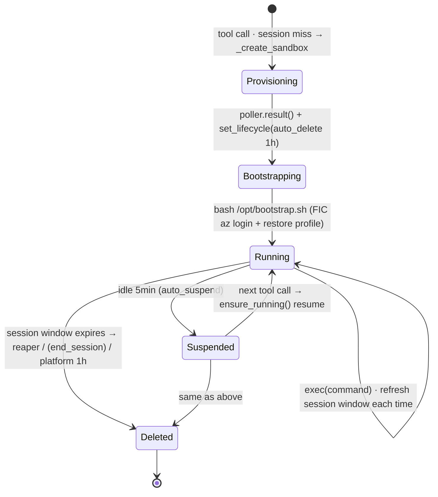
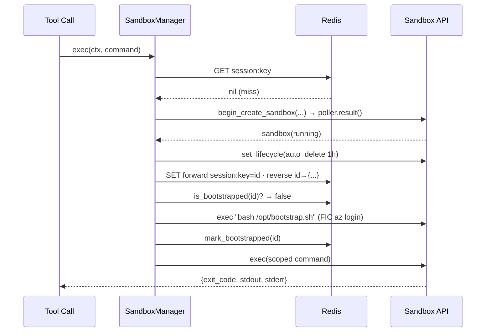
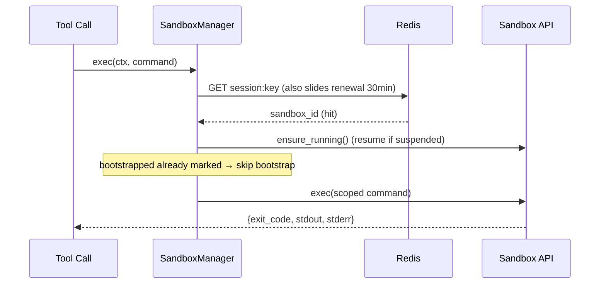

# Sandbox Lifecycle

This document explains the complete lifecycle of **a sandbox from birth to death** in the ACA execution backend: who triggers its creation, what happens on first startup, how it stays alive across multiple tool calls, how it is suspended when idle, and who ultimately reclaims it.

Related code: `src/mcp-server/sandbox_manager.py`, `src/mcp-server/cache.py`, `src/mcp-server/main.py`.
Related documents: [MCP-Horizontal Scaling-Distributed Lock and Reaper Leader Election.md](mcp-server-horizontal-scaling-distributed-lock-and-reaper-leader-election.md) (routing/reverse index/reaper concurrency), [ACA-Sandbox-Migration Plan.md](migrating-identity-aware-mcp-to-aca-sandboxes-plan.md), [MCP-User Isolation and Redis Design.md](../MCP-user-isolation-comparison-and-redis-design.md).

---

## TL;DR

A **session miss** creates a sandbox (select disk → create → set 1h fallback deletion) → first **bootstrap** login → then a **30min sliding window** enables **reuse** across multiple tool calls, with a 5min idle **suspend** and **resume** on the next call → once the session window expires, the **reaper** deletes it within ≤5min, with the platform's **1h auto-delete** as a fallback. `end_session` is a third deletion path reserved for "explicit termination," **currently implemented but not wired**.

---

## 0. Key Parameters (all overridable via env, `from_env` `sandbox_manager.py:126`)

| Parameter | env | Default | Role |
|---|---|---|---|
| session window | `MCP_SESSION_TTL` | 1800s / 30min | Sliding TTL for the forward routing key = sandbox alive signal |
| auto_suspend | `SANDBOX_AUTO_SUSPEND_SECONDS` | 300s / 5min | Idle suspend (resumable) |
| reaper interval | `SANDBOX_REAPER_INTERVAL` | 300s / 5min | How often to scan for orphans |
| auto_delete | `SANDBOX_AUTO_DELETE_SECONDS` | 3600s / 1h | Platform-level fallback deletion |
| cpu / memory | `SANDBOX_CPU` / `SANDBOX_MEMORY` | 1000m / 2048Mi | Resource specification |

> Important relationship: **auto_suspend(5min) < session window(30min)**. So a few minutes of pause within a session will cause a suspend, but the session key remains, and the next call automatically resumes; only when the entire session window expires does reclamation begin.

---

## 1. State Machine Overview



---

## 2. Birth (create) — Triggered by a session miss on a tool call

Call chain: `diagnose_bash / action_bash → _exec → executor.exec → SandboxManager.exec → get_or_create`.

`get_or_create` (`:191`) checks the forward table (`SessionSandboxCache`) under the **routing-key lock**; only on a **miss** does it proceed to `_create_sandbox` (`:244`):

1. **Select disk (`_resolve_disk` `:311`)** — three options, priority from high to low:
   - Prebuilt `disk_id` (`SANDBOX_DISK_ID`) → use directly;
   - Build from image (`SANDBOX_DISK_IMAGE`) → `_ensure_disk_image` first `list_disk_images` to **reuse an existing Ready image**, only build if none exists (takes minutes, once per group);
   - Public disk (default `ubuntu`).
2. **Mount volume (`_workspace_volumes` `:271`)** — when blob is enabled, mount the group's workspace container (authenticated via group MI); `_ensure_volume` idempotently creates the volume (swallows `409 already exists`).
3. **Label + inject env** — labels `{user, session, group}` (`_label_safe` sanitizes to valid labels); env `{SP_APP_ID, AZURE_TENANT_ID, AZURE_SUBSCRIPTION_ID}` (subscription from user profile, `_user_subscription`).
4. `begin_create_sandbox(... cpu, memory, auto_suspend_seconds, volumes ...)` → `await poller.result()` waits for provisioning to complete.
5. **`_apply_idle_autodelete` (`:342`)** — immediately sets lifecycle policy: **1h idle auto_delete**, platform-level fallback (non-fatal, only warning on failure).

After creation succeeds, `get_or_create` writes to both **forward** and **reverse** Redis tables (`:214-222`):

```python
client = await self._create_sandbox(...)                              # brand new unique sandbox_id
await self._sessions.set(oid, session, group, client.sandbox_id)      # forward: (oid,session,group) → id
await self._index.set(client.sandbox_id, {"oid":..., "session":..., "group":...})  # reverse: id → routing info
```

> Each create mints a **brand new unique** sandbox_id, bound only to the current routing key — this is the 1:1 binding invariant (see [horizontal scaling doc §5.1](mcp-server-horizontal-scaling-distributed-lock-and-reaper-leader-election.md)).

---

## 3. First Startup (bootstrap) — Runs only once per sandbox

After writing to Redis, `get_or_create` checks `is_bootstrapped(sandbox_id)` (flag stored in Redis, `cache.py:150`). **Only if not run before** does it execute `_bootstrap` (`:358`):

```python
result = await client.exec("bash /opt/bootstrap.sh")   # passwordless FIC `az login` as worker SP + restore user az profile
...
await self._sessions.mark_bootstrapped(client.sandbox_id)
```

- Success → mark bootstrapped; failure → raise `RuntimeError`, this tool call fails (will retry next time, bootstrap is idempotent).
- **Reusing an already bootstrapped sandbox skips this step** — this is the cost saved by session-stickiness (avoids re-login each time).

---

## 4. Work (running / exec)

`exec` (`:393`) each time: `_ensure_reaper()` → `get_or_create()` (hit = reuse) → `client.exec(scoped_command)`.

- **Each exec is a fresh shell**, so `_scope_to_workspace` (`:378`) does `mkdir -p && cd` into the per-conversation workspace directory (writes persist only when flushed to blob), using `&&` to preserve the user command's own exit code.
- Output is truncated to `MAX_OUTPUT_BYTES` (default 64KB), with `TRUNCATE_HINT` appended to instruct the agent to narrow the scope at the source.

---

## 5. Keep Alive (stickiness) — Sliding window prevents death

The forward key `session:{oid}:{session}:{group}` has a **30min sliding TTL**: `SessionSandboxCache.get` re-sets it on every read (`cache.py:133-138`).

> As long as the user continues calling within 30min, the key keeps renewing → **the same sandbox is reused**. This key serves both as the routing basis and the signal that "the session is alive." Once it expires, it effectively declares the session ended.

---

## 6. Nap (suspend) — Saves cost, but still alive

When idle exceeds `auto_suspend` (default **5min**), the platform **suspends** the sandbox (no compute charges, disk persists). On next reuse, `ensure_running()` (`:205`) inside `get_or_create` **resumes** it:

```python
client = gclient.get_sandbox_client(sandbox_id)
await client.ensure_running()   # resumes suspended; throws ResourceNotFoundError if deleted → triggers rebuild
```

---

## 7. Death (delete) — Three paths (two currently active)

| Path | Trigger | Status | Description |
|---|---|---|---|
| **reaper** (`reap_orphans` `:440`) | Session window expires (forward key expired) | ✅ Active | Primary fast path: `peek` finds session key gone → immediately `begin_delete_sandbox` + clear reverse index, no waiting for platform 1h |
| **Platform auto-delete** | Idle reaches `auto_delete` (default 1h) | ✅ Active | Fallback: if reaper is completely down or for unmanaged sandboxes, relies on this self-reclamation |
| **`end_session`** (`:409`) | Explicit session termination | ⚠️ **Implemented but not wired** | Deletes both groups' sandboxes for that session + clears Redis (forward + reverse). The `Executor` protocol only declares `exec`; MCP has no session-end signal yet, **currently no caller** |

### 7.1 Stale recovery (additional path)

On reuse, if `ensure_running()` throws `ResourceNotFoundError` (sandbox deleted by platform auto-delete underneath), `get_or_create` (`:208`) clears the forward key and **rebuilds**:

```python
except ResourceNotFoundError:
    logger.info("stale session sandbox %s gone; recreating", sandbox_id)
    await self._redis_safe(self._sessions.delete(ctx.user_oid, ctx.session_id, group))
    # continues to _create_sandbox, equivalent to a miss
```

---

## 8. Timing Diagrams for Two Typical Paths

### 8.1 Cold Start (first call, session miss)



### 8.2 Reuse (hit, possibly resume from suspend)



---

## 9. Timeline (putting the TTLs together)

```
t=0      tool call → create sandbox (a few minutes) → bootstrap → run command     [session window starts 30min timer]
t=5min   idle → auto_suspend suspends (resumable)
t=8min   another call → ensure_running resumes → run command                       [session window refreshed, restarts 30min]
...
t=last call +30min   session key expires → next reaper cycle (≤5min) deletes it + clears reverse index
t=last call +60min   if reaper didn't delete → platform auto-delete fallback deletes
```

---

## 10. Summary

- **Birth**: session miss → select disk → create → set 1h fallback deletion → write forward/reverse Redis.
- **Startup**: each sandbox bootstraps only once (FIC `az login` + restore profile), reuse skips it.
- **Keep alive**: 30min sliding window; as long as calls continue, the same sandbox is reused.
- **Nap**: idle 5min suspends, next `ensure_running` resumes.
- **Death**: session window expires → reaper fast delete (≤5min); platform 1h auto-delete fallback; `end_session` reserved but not wired; stale sandboxes auto-rebuild.

> For concurrency correctness issues such as create race conditions under multiple replicas, reverse index, and reaper leader election, see [MCP-Horizontal Scaling-Distributed Lock and Reaper Leader Election.md](mcp-server-horizontal-scaling-distributed-lock-and-reaper-leader-election.md).