# Explaining Entra OAuth Proxy

This document summarizes two MCP + Entra authentication patterns:

1. **DCR / OAuth Proxy Pattern**
   - Arbitrary MCP clients dynamically register with the FastMCP OAuth Proxy.
   - Entra does not recognize these dynamic MCP clients.
   - The FastMCP OAuth Proxy uses a fixed Entra App Registration to interact with Entra.
   - The Proxy saves client registrations, authorization transactions, and code/token mappings in local storage.

2. **Pre-registration / Pre-authorized Client Pattern**
   - The MCP client is an Entra-known client, such as VS Code.
   - The MCP server is registered in Entra as a protected API/resource.
   - Entra directly issues an access token to the MCP client for accessing the MCP server.
   - There is no OAuth proxy, nor any proxy-issued access token.

One-sentence distinction:

> The OAuth Proxy allows Entra to indirectly support arbitrary MCP clients; pre-registration makes Entra accept only explicitly registered/pre-authorized MCP clients.

# 1. Background: The Conflict Between MCP Auth and Entra

The MCP authorization specification is based on OAuth 2.1. Using OAuth roles:

| OAuth Role | MCP Scenario |
| --- | --- |
| Resource Owner | Currently logged-in user |
| OAuth Client | MCP Client, e.g., VS Code, Claude, agent |
| Resource Server | MCP Server / MCP Tools |
| Authorization Server | Entra or FastMCP OAuth Proxy |

To support arbitrary clients, MCP requires the client to be recognizable by the authorization server. Common methods include:

- DCR: Dynamic Client Registration.
- CIMD: Client ID Metadata Document.
- Pre-registration: Registering or authorizing the client in the authorization server in advance.

The problem is: **Microsoft Entra currently does not support DCR / CIMD in the way MCP requires.** Hence, two paths exist:

- To support arbitrary MCP clients: Add a FastMCP OAuth Proxy in front of Entra.
- For greater production security: Use pre-registered / pre-authorized clients.

# 2. The Two-Layer OAuth World

The key to understanding the OAuth Proxy is to separate the "OAuth world seen by the client" from the "OAuth world seen by Entra."

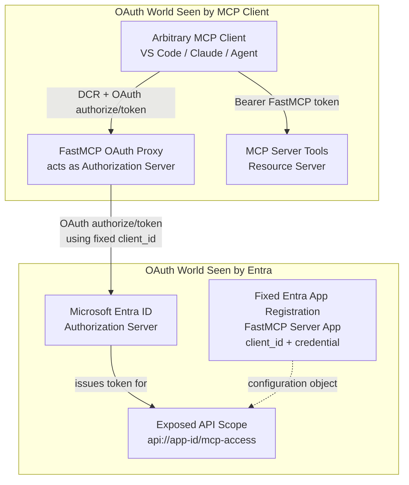

So in the OAuth Proxy pattern:

- From the MCP client's perspective, the FastMCP OAuth Proxy is the Authorization Server.
- From the FastMCP OAuth Proxy's perspective, Entra is the Authorization Server.
- Entra only knows the fixed FastMCP App Registration.
- Entra does not know the true identity of any arbitrary dynamic MCP client.

# 3. DCR / OAuth Proxy Pattern

## 3.1 What Problem Does This Pattern Solve?

This pattern solves:

> The MCP client wants to register dynamically, but Entra only accepts fixed app registrations.

FastMCP's `AzureProvider` / `OAuthProxy` exposes a set of OAuth endpoints within the MCP server process, making the MCP client believe it is interacting with an authorization server that supports DCR.

In the demo, the configuration is roughly:

```python
auth = AzureProvider(
    client_id=os.environ["ENTRA_PROXY_AZURE_CLIENT_ID"],
    client_secret=os.environ["ENTRA_PROXY_AZURE_CLIENT_SECRET"],
    tenant_id=os.environ["AZURE_TENANT_ID"],
    base_url=entra_base_url,
    required_scopes=["mcp-access"],
    client_storage=oauth_client_store,
)
```

Where:

- `client_id` / `client_secret` are the configuration of the fixed Entra App Registration.
- `required_scopes=["mcp-access"]` is the scope the MCP server requires to be present in the token.
- `client_storage` is where the proxy saves DCR and OAuth state.
- Locally, `MemoryStore` can be used.
- The production demo uses a Cosmos DB store.

## 3.2 What Is Stored in the Proxy Storage?

This storage is not a user database, nor does it replace Entra's identity store.

It primarily saves the state needed by the OAuth proxy itself:

- Dynamic MCP client registrations.
- Authorization transactions.
- MCP client redirect URI, state, PKCE information.
- Proxy authorization codes.
- Mapping between FastMCP tokens and upstream Entra tokens.
- Refresh token / JTI mapping metadata.

This can be visualized as:

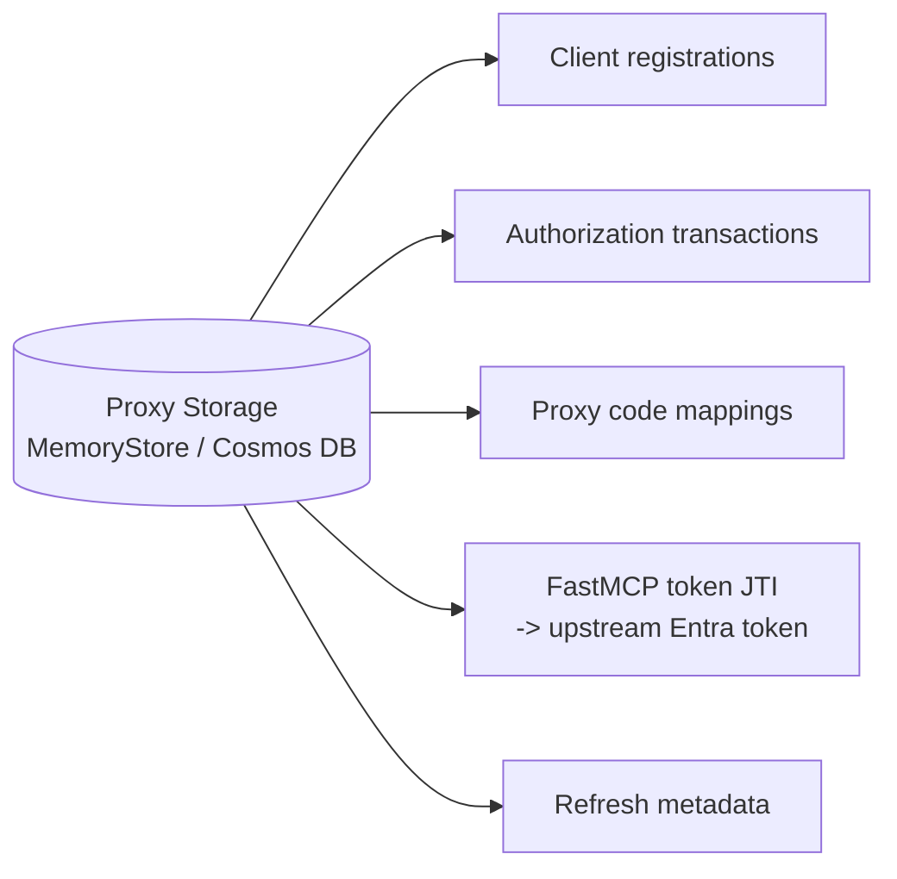

## 3.3 What Does the Entra App Registration Represent Here?

In the OAuth Proxy pattern, the App Registration in Entra represents:

> The FastMCP OAuth Proxy / MCP Server application as seen by Entra.

It is not the arbitrary MCP client itself.

This App Registration simultaneously fulfills two configuration roles:

| Role | Entra Configuration | Purpose |
| --- | --- | --- |
| Upstream OAuth client | `client_id`, secret/cert/FIC, redirect URI `/auth/callback` | The proxy uses this to perform OAuth with Entra |
| Protected API/resource | `Expose an API`, scope `mcp-access`, Application ID URI `api://{app_id}` | Allows Entra to issue tokens targeting the MCP server |

In the January article, this app registration defines the `mcp-access` scope. The MCP client ultimately requests:

```text
api://<fastmcp-app-id>/mcp-access
```

The expected claims in the token are:

```json
{
  "aud": "api://<fastmcp-app-id>",
  "scp": "mcp-access"
}
```

`mcp-access` and `user_impersonation` are both essentially custom scope names. Entra is responsible for writing it into the token; the MCP server is responsible for interpreting what this scope actually permits.

## 3.4 Why Is Only One App Registration Often Used in the DCR Proxy Pattern?

From a pure OAuth role modeling perspective, the proxy and MCP server could be split into two Entra App Registrations:

- Proxy app registration: Acts only as an Entra OAuth client, configured with `client_id`, credential, `/auth/callback`.
- Server API app registration: Acts only as a protected resource/API, configured with `Expose an API` and `mcp-access` scope.

However, in the FastMCP demo / OAuth Proxy pattern, usually only one Entra App Registration is created because **the FastMCP OAuth Proxy and the MCP Server share the same application security boundary**:

- Same FastMCP app.
- Same process / container.
- Same public base URL.
- Same operator.
- Same auth provider / token validation layer.

Therefore, one Entra App Registration expresses two things simultaneously:

```text
As upstream Entra client:
  client_id
  client_secret / certificate / FIC
  redirect URI: /auth/callback

As protected API/resource:
  Application ID URI: api://<app-id>
  scope: mcp-access
```

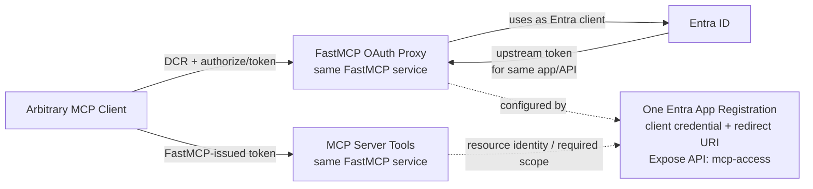

This differs from the pre-registration pattern. Pre-registration has no proxy acting as an intermediate authorization server; Entra directly faces the real MCP client. Therefore, Entra must know both:

```text
Who is requesting the token?  -> Client App Registration
Who is the token for?         -> Server/API App Registration
```

Thus, pre-registration typically involves two app registrations:

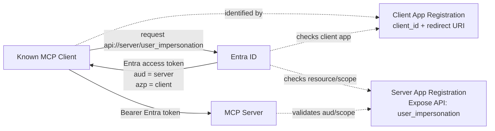

Summarized in one sentence:

> In the pre-registration pattern, Entra directly sees the real client, so the client app and server app must be expressed separately; in the DCR proxy pattern, Entra does not see the real arbitrary client, only the proxy, and since the proxy and server are deployed in the same FastMCP service, one app registration can simultaneously express the upstream client and the protected API.

If you prefer clearer boundaries, the DCR proxy pattern can also be designed with two app registrations:

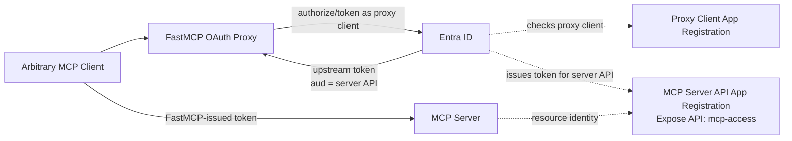

This design is semantically cleaner but more complex to deploy and configure. The FastMCP demo merges them into one because the proxy and tools are the same FastMCP service.

## 3.5 Complete OAuth Proxy Flow Diagram

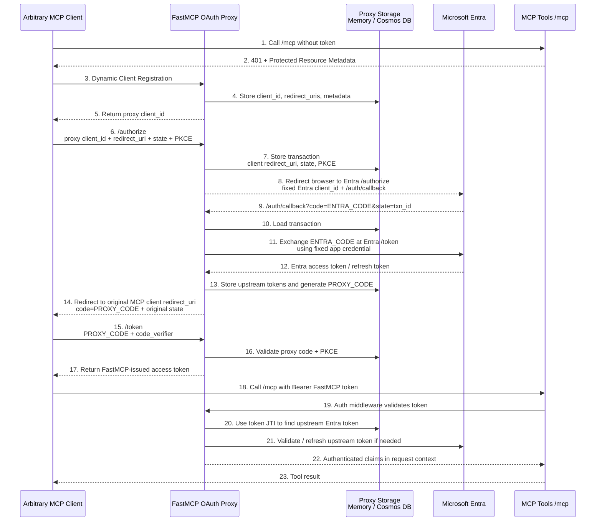

## 3.6 Most Common Misunderstandings

### The Entra code is not given directly to the MCP client

What Entra returns is:

```text
ENTRA_CODE
```

This code is bound to:

- The fixed Entra App Registration.
- The proxy's `/auth/callback` redirect URI.
- The upstream OAuth transaction between the proxy and Entra.

The MCP client cannot directly use this code to exchange for a token at Entra.

The FastMCP Proxy first consumes `ENTRA_CODE`, exchanges it for an upstream Entra token, and then generates its own:

```text
PROXY_CODE
```

It then gives `PROXY_CODE` to the MCP client.

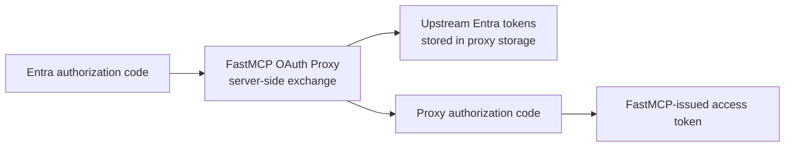

### The MCP client does not receive the original Entra access token

In the FastMCP OAuth Proxy pattern, the MCP client ultimately receives a **FastMCP-issued access token**, not the original Entra access token.

More precisely:

```text
Entra access token
  = upstream token saved internally by the proxy/server
  = used to prove the user has authenticated via Entra, and available for FastMCP to validate/refresh/OBO

FastMCP-issued access token
  = the bearer token the arbitrary MCP client actually receives and presents to /mcp
  = a token issued by the FastMCP OAuth Proxy to the MCP client
```

The semantics of `exchange_authorization_code()` in the FastMCP source code are:

```text
Exchange authorization code for FastMCP-issued tokens.
Returns FastMCP tokens (NOT upstream tokens).
```

This FastMCP token contains information like `jti`, which the FastMCP auth layer can use to retrieve the upstream Entra token from storage.

Therefore, the MCP request phase is not simply:

```text
The proxy replaces the HTTP header with the Entra token and forwards it.
```

More accurately:

```text
MCP request carries FastMCP token
-> FastMCP auth middleware validates the FastMCP token
-> Uses JTI to look up the upstream Entra token
-> Validates/refreshes the upstream token
-> Places user claims into the request context
-> MCP tool executes business logic
```

In other words, the MCP server "recognizes" this FastMCP-issued token because, in this demo:

- The OAuth Proxy and MCP Server run in the same FastMCP app.
- The MCP Server's auth middleware uses the same `AzureProvider/OAuthProxy`.
- FastMCP issues its own tokens and validates its own tokens.
- During validation, it retrieves and validates/refreshes the upstream Entra token via the JTI mapping.

So the trust relationship in this demo is not:

```text
The MCP server natively trusts any arbitrary proxy token.
```

Rather, it is:

```text
The FastMCP OAuth Proxy and MCP Server share the same auth provider,
so the FastMCP-issued token can be recognized by the /mcp middleware of the same FastMCP app.
```

If you split the proxy and MCP server into two independent services, you cannot assume the MCP server will automatically trust the proxy token. You must explicitly design the trust relationship, for example:

- The MCP server trusts the proxy's JWT issuer / JWKS.
- The MCP server calls the proxy's introspection endpoint to validate the token.
- Or, change the design so the MCP client directly uses an Entra-issued token to call the MCP server.

One-sentence correction:

> In the DCR proxy pattern, the Entra access token is an upstream token internal to the proxy/server; the arbitrary MCP client interacts with the proxy's OAuth world and ultimately receives a FastMCP/proxy token. Whether the MCP server recognizes this token depends on whether the server shares the same auth provider as the proxy, or whether it explicitly trusts the proxy issuer.

So the boundary here is:

| Pattern | Token the MCP client ultimately presents to the MCP server |
| --- | --- |
| FastMCP OAuth Proxy demo | FastMCP-issued token |
| Pre-registration | Entra-issued token |
| Custom decoupled proxy | Depends on your design; you must explicitly define how the server trusts the token |

# 4. OBO: MCP Server Calling Graph

Whether in the DCR/proxy pattern or the pre-registration pattern, if the MCP server needs to call Microsoft Graph, OBO is required.

The purpose of OBO is not for the MCP client to call the MCP server; that step is already accomplished by the MCP access token.

The purpose of OBO is:

> After the MCP server receives the user context, it acts on behalf of this user to call a downstream API, such as Microsoft Graph.

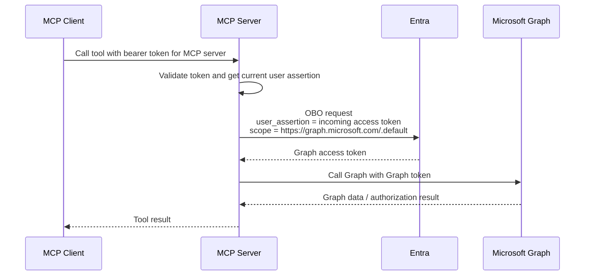

For OBO to succeed, the Entra App Registration corresponding to the MCP server must have Graph delegated permissions, typically requiring admin consent. For example:

- `User.Read`
- `email`
- `openid`
- `profile`
- Other Graph scopes

Note:

- `mcp-access` / `user_impersonation` is the MCP server's own API scope.
- `User.Read` is a Microsoft Graph API scope.
- The former allows the client to access the MCP server.
- The latter allows the MCP server to access Graph via OBO.

# 5. Pre-registration / Pre-authorized Client Pattern

## 5.1 What Problem Does This Pattern Solve?

The pre-registration pattern is suitable for:

- MCP servers that only need to support known clients, such as VS Code or internal corporate clients.
- Production environments where each client should be explicitly reviewed.
- Avoiding a proxy that interacts with Entra on behalf of arbitrary clients.

The April article explicitly adopts this pattern: VS Code is the pre-authorized client, and Entra acts directly as the authorization server.

## 5.2 How Many App Registrations Are Needed?

Typical situation:

| Component | Entra App Registration | Description |
| --- | --- | --- |
| MCP Client | Requires a known app registration | VS Code already has a Microsoft first-party client ID; custom clients need their own registration |
| MCP Server | Requires an app registration | Exposes an API scope, e.g., `user_impersonation` |
| Microsoft Graph | Microsoft's existing resource app | Not created by you |

Note: In the article, two server-side app registrations were created for local dev and Azure Container Apps production respectively:

- Local: Uses a client secret.
- Production: Uses Managed Identity as Federated Identity Credential.

This is a deployment credential strategy and does not change the OAuth model. Conceptually, it remains "the server app registration exposes the MCP server API scope."

## 5.3 Role of the Server App Registration

The MCP server's App Registration is not a "byproduct of deploying to Function App / Container App." Its core purpose is to let Entra know:

> There is a protected API/resource here; clients can request its delegated scope.

For example:

```text
api://<server-app-id>/user_impersonation
```

This scope is a permission label defined by the server itself. The name can be changed to:

- `access_as_user`
- `mcp-access`
- `tools.call`
- `tools.execute`

The key points are:

- Entra writes it into the `scp` claim of the access token.
- The MCP server validates that this scope is present in the token.
- The MCP server executes the corresponding authorization logic based on this scope.

```json
{
  "aud": "api://<server-app-id>",
  "scp": "user_impersonation",
  "oid": "<user-object-id>",
  "azp": "<client-app-id>"
}
```

Graph's `User.Read` uses the same mechanism, except that Microsoft Graph's server-side implementation already defines the meaning of `User.Read`. The meaning of your `user_impersonation` / `mcp-access` must be implemented by your MCP server.

## 5.4 Complete Pre-registration Flow Diagram

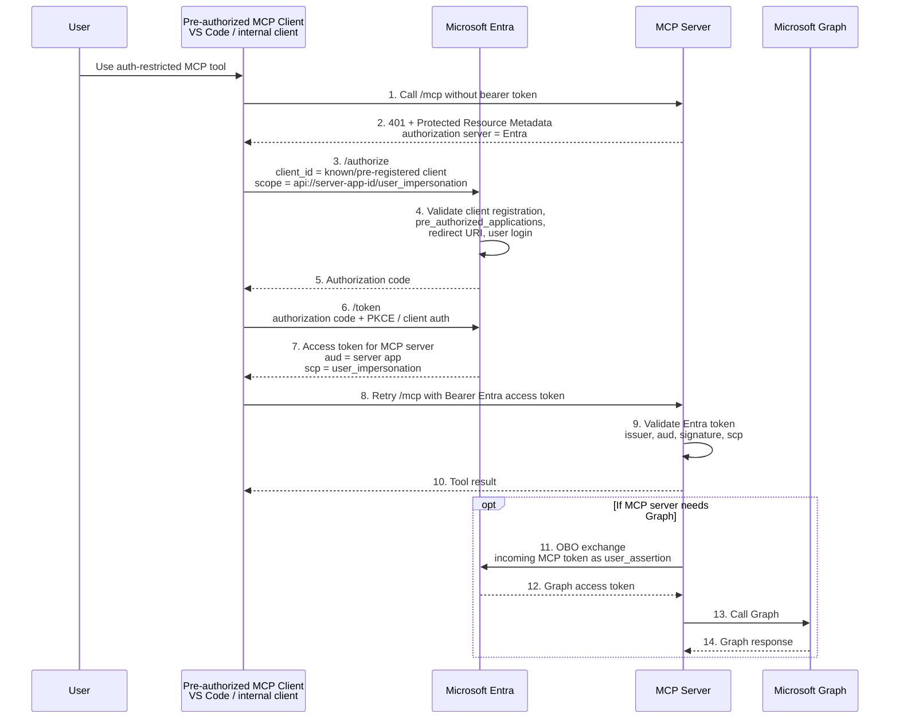

## 5.5 Pre-registration Architecture Diagram

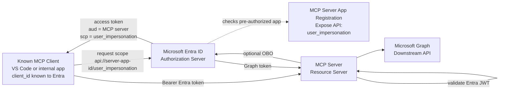

# 6. DCR Proxy vs Pre-registration Comparison

| Dimension | DCR / OAuth Proxy | Pre-registration |
| --- | --- | --- |
| Is the MCP client arbitrary? | Yes | No, only supports known clients |
| Where is the client registered? | FastMCP Proxy storage | Entra |
| Does Entra know the real MCP client? | Typically no | Yes |
| Authorization Server, from MCP client perspective | FastMCP OAuth Proxy | Entra |
| Authorization Server, from proxy/server perspective | Entra | Entra |
| Does the server have an Entra App Registration? | Yes | Yes |
| Is proxy storage needed? | Yes, Memory/Cosmos DB | No |
| Token received by the client | FastMCP-issued token | Entra-issued token |
| Server validation method | First validates FastMCP token, then looks up/validates upstream Entra token | Directly validates Entra JWT |
| Production security | Higher risk; article suggests mainly for dev/test | More recommended |
| Supports OBO to call Graph | Yes | Yes |

# 7. "Why Does the Server Also Need an App Registration?"

Because an OAuth access token must have an audience and a scope.

The client requests:

```text
scope=api://<server-app-id>/user_impersonation
```

Entra needs to know:

- Which protected resource is `api://<server-app-id>`?
- Is `user_impersonation` a delegated scope exposed by this resource?
- Which clients can request this scope?
- Has the user/admin consented?

This information is all in the **server-side App Registration**'s `Expose an API` configuration.

So even if the MCP server is deployed on Azure Function App, App Service, Container Apps, or AKS, the essence is the same:

> The hosting resource is not the OAuth resource. For your HTTP API to become an audience for which Entra can issue tokens, you need an App Registration to define this API/resource.

# 8. "What Exactly Is user_impersonation / mcp-access?"

It is a custom scope, i.e., a permission label.

It does not have a built-in business permission meaning like Graph's `User.Read`. Its actual meaning is implemented by your MCP server code.

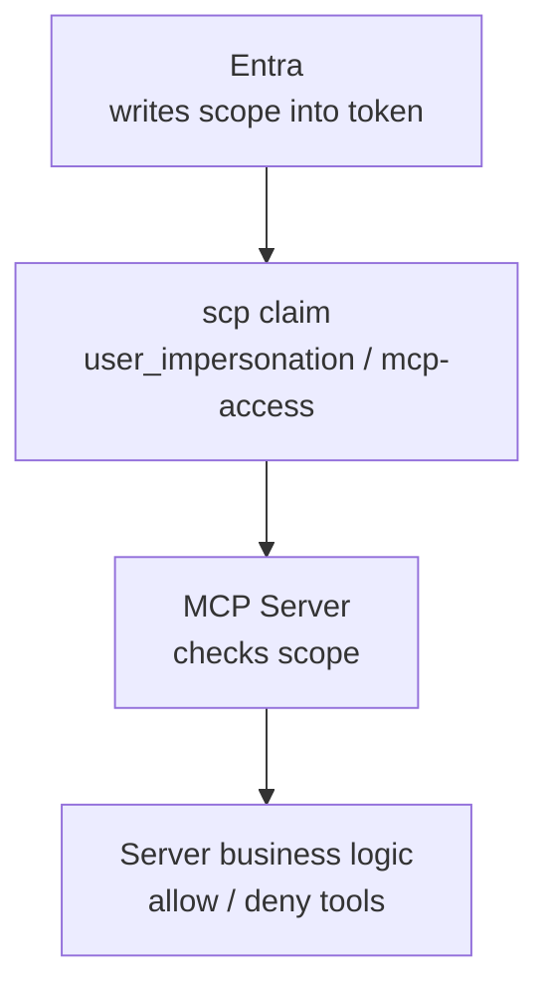

Analogy:

| Scope | Who Defines It | Who Implements Its Meaning |
| --- | --- | --- |
| `https://graph.microsoft.com/User.Read` | Microsoft Graph | Microsoft Graph |
| `https://graph.microsoft.com/Mail.Read` | Microsoft Graph | Microsoft Graph |
| `api://your-api/user_impersonation` | Your MCP server | Your MCP server |
| `api://your-api/mcp-access` | Your MCP server | Your MCP server |

The minimal implementation is usually:

```text
token.aud == my server app id
token.scp contains mcp-access
=> allow MCP request
```

A more granular implementation could define:

```text
tools.read
tools.execute
tools.admin
```

And then check them at the tool level respectively.

# 9. Code Implementation Mental Model

In the DCR/proxy pattern of `python-mcp-demos`, the key structure is:

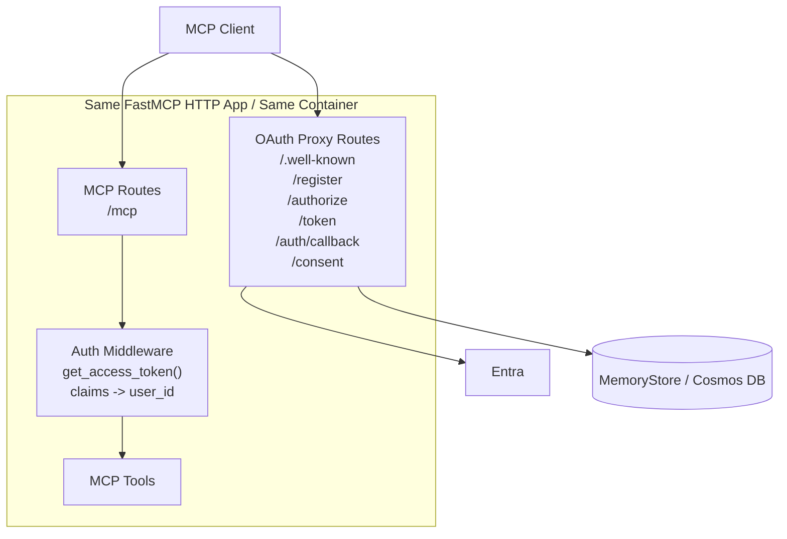

That is:

- The OAuth Proxy and MCP Server are typically in the same FastMCP app.
- They expose different HTTP endpoints.
- The FastMCP auth provider automatically handles DCR, authorize, token, callback, PKCE, and code mapping.
- Your tool code usually only cares about the current user's claims or the downstream token after OBO.

# 10. Final Conclusion

If you need to support arbitrary MCP clients:

```text
MCP Client -> FastMCP OAuth Proxy -> Entra
```

You need:

- One fixed Entra App Registration for the proxy/server.
- Proxy storage to save dynamic client registration and OAuth transaction state.
- A mapping between FastMCP-issued tokens and upstream Entra tokens.
- If calling Graph is needed, configure Graph delegated permissions / admin consent for this Entra app registration.

If you only support known MCP clients:

```text
MCP Client -> Entra -> MCP Server
```

You need:

- The MCP client is registered or known in Entra.
- The MCP server App Registration exposes an API scope, e.g., `user_impersonation`.
- Pre-authorize this client in the server app registration.
- The MCP server directly validates the Entra access token.
- If calling Graph is needed, use OBO.

Recommendation guide:

- **Dev/Test / Arbitrary Clients**: The OAuth Proxy can work quickly, but the security boundary is complex.
- **Production / Enterprise Environments**: Pre-registration is clearer because each client is explicitly created, reviewed, and authorized.