# Function App + APIM for MCP Authentication

This summary focuses on one question:

> If the FastMCP server is already written, how can access control be added to a remote MCP endpoint **without modifying the MCP server business code**?

Conclusion first:

| Deployment Method | Can key-based access be done without modifying FastMCP code? | Main Mechanism |
|---|---:|---|
| Azure Functions custom handler | Yes | Function key |
| Azure API Management + any backend | Yes | APIM subscription key / OAuth validation policy |
| Azure App Service / Web App standalone deployment | Not ideal | No Function key; typically requires Easy Auth, APIM, or application-layer middleware |
| Azure Container Apps standalone deployment | Not ideal | No generic Function key; typically requires Easy Auth, APIM, ingress restrictions, or application-layer middleware |

Core judgment:

> If you don't want to modify FastMCP server code, the most natural choices for key-based access are **Azure Functions Host** or **API Management gateway**.

---

## 1. Baseline: FastMCP Hosted in Azure Functions

In the `mcp-sdk-functions-hosting-python` repo, the FastMCP server is a regular streamable HTTP server:

```python
mcp = FastMCP("weather", stateless_http=True)
mcp.run(transport="streamable-http")
```

Azure Functions starts `server.py` via `customHandler`, then forwards HTTP requests to this FastMCP server.

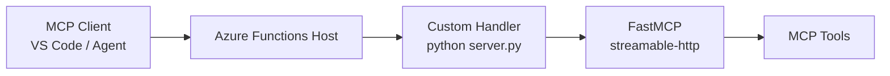

The key point here is:

> Function key validation occurs at the Azure Functions Host layer, not in the FastMCP business code.

---

## 2. Key-Based Option A: Azure Function Key

Set the custom handler authorization level to `function` in `host.json`:

```json
{
  "customHandler": {
    "http": {
      "DefaultAuthorizationLevel": "function"
    }
  }
}
```

The caller must include the Function key:

```http
POST https://your-function-app.azurewebsites.net/mcp
x-functions-key: <function-key>
content-type: application/json
```

Or:

```text
https://your-function-app.azurewebsites.net/mcp?code=<function-key>
```

The header method is recommended to avoid exposing the key in URLs, logs, or browser history.

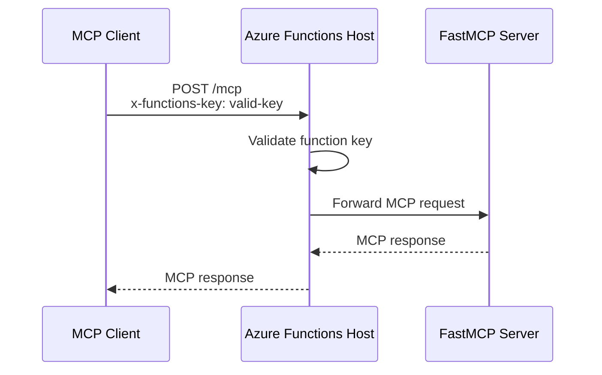

If the key is missing or invalid:

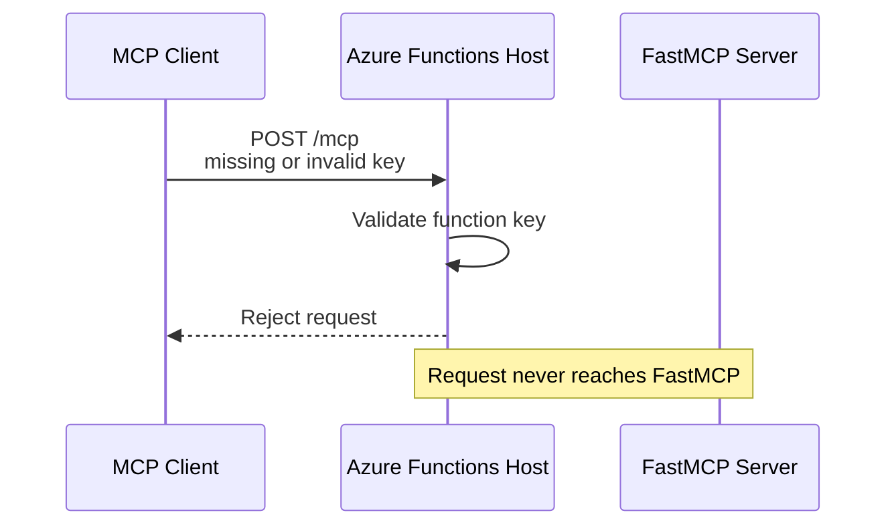

Characteristics:

| Item | Description |
|---|---|
| Validation location | Azure Functions Host |
| Does FastMCP know about the key? | No |
| Does it express user identity? | No |
| Does it express OAuth scope? | No |
| Suitable scenarios | Demo, internal tool, small number of trusted clients, quick endpoint protection |

---

## 3. Key-Based Option B: APIM Subscription Key

If the MCP server backend can be Azure Function, Container Apps, App Service, or AKS, APIM can serve as a unified entry point.

APIM's key-based access is called **subscription key**.

The caller includes:

```http
POST https://your-apim.azure-api.net/mcp
Ocp-Apim-Subscription-Key: <subscription-key>
content-type: application/json
```

After APIM validates the key, it forwards the request to the backend MCP service.

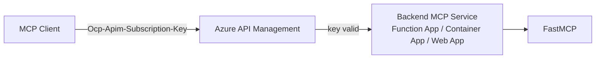

On failure:

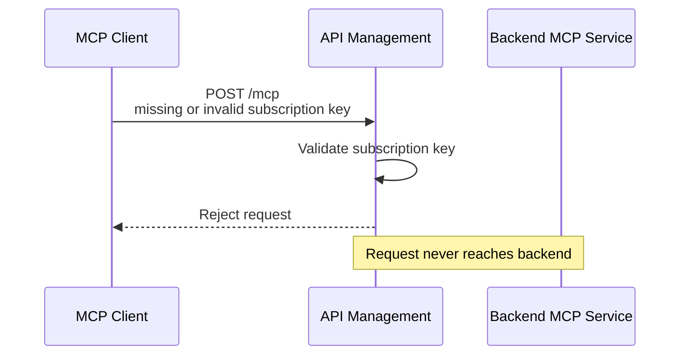

Characteristics:

| Item | Description |
|---|---|
| Validation location | APIM gateway |
| Does FastMCP know about the key? | No |
| Backend type | Function App, Container Apps, App Service, AKS all supported |
| Does it support user self-service key request? | Yes, subscriptions can be requested via Developer Portal; APIM generates primary/secondary keys |
| Is it a bearer token? | No; it is an APIM subscription key |

APIM subscription key is suitable for distributing API access to developers, teams, or client applications, but it does not represent an end user identity.

---

## 4. Key-Based Option C: Application-Level API Key

You can also write a custom middleware at the FastMCP / ASGI / Starlette / FastAPI layer:

```text
Client -> FastMCP app -> custom API key middleware -> MCP tools
```

But this requires modifying the business layer or server code.

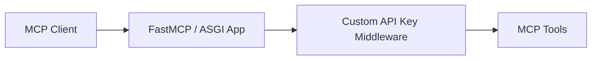

This approach does not meet the goal of "not modifying MCP server code," so it is not a primary path in this plan.

---

## 5. Why Not Just Azure Web App or Container App?

Azure App Service / Web App and Azure Container Apps can both run FastMCP servers, but they do not have a built-in generic `function key` authorization level like Azure Functions.

If deployed directly to Web App or Container App, key-based access typically requires one of these options:

| Approach | Does it modify FastMCP server code? | Description |
|---|---:|---|
| Write custom API key middleware | Yes | Most similar to a regular REST API key |
| Use App Service / Container Apps built-in auth | Not necessarily | More OAuth/OIDC oriented, not key-based |
| Place behind APIM | No | APIM handles key or token validation |
| Use ingress / network restriction | No | Restricts network source, not an API key |

So if the goal is:

> Key-based access without modifying FastMCP server business code

Recommended:

```text
Azure Functions Function Key
or
APIM Subscription Key
```

---

## 6. Function App + APIM Combined

APIM and Function key can be combined, but both are not always necessary.

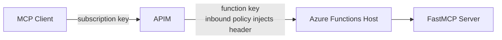

Common designs:

| Design | What the client needs to know | Backend protection method |
|---|---|---|
| Function key only | Function key | Functions Host validates key |
| APIM key only | APIM subscription key | Backend only allows APIM access |
| APIM key + Function key | Only knows APIM key; Function key injected by APIM | Double-layer protection |

If APIM is in front, a cleaner approach is:

1. Client only interacts with APIM.
2. Client only obtains an APIM subscription key or Entra token.
3. The Function App backend should not be exposed to the public internet.
4. If the Function App still requires a function key, let the APIM policy inject `x-functions-key`.

---

## 7. OAuth Option A: User Impersonation

Key-based access only proves "the caller knows the key." If user identity, consent, or scope is needed, OAuth is required.

User impersonation is suitable for:

- User is present
- Need to know who is calling the MCP
- MCP tools return user-specific data
- Delegated permission is required

Typical app registration:

| App registration | Represents who |
|---|---|
| Client App | MCP client, e.g., VS Code, desktop client, web client |
| MCP API App | Protected API resource, exposes `user_impersonation` scope |

When requesting a token:

```text
client_id=<client-app-id>
scope=api://<mcp-api-app-id>/user_impersonation
```

The meaning of user consent is:

> Do you consent to this Client App accessing the MCP API with `user_impersonation`?

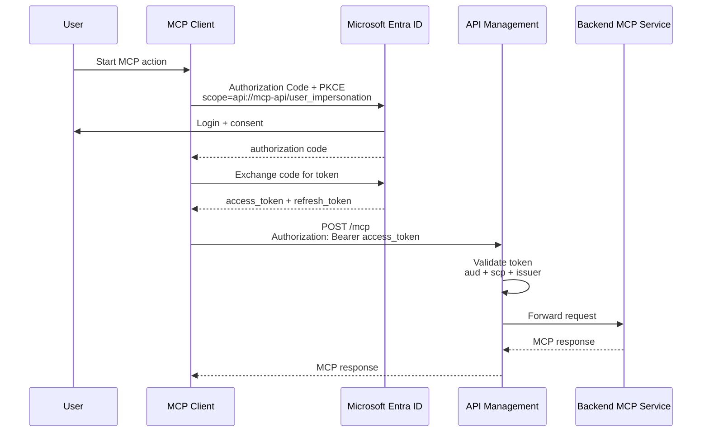

APIM policy checks:

| Claim | What APIM checks |
|---|---|
| `iss` | Token came from expected Entra tenant |
| `aud` | Token is for MCP API |
| `scp` | Token includes `user_impersonation` |
| `azp` / `appid` | Optional: caller client app is allowed |

Example APIM policy shape:

```xml
<validate-azure-ad-token tenant-id="YOUR_TENANT_ID">
  <audiences>
    <audience>api://YOUR_MCP_API_APP_ID</audience>
  </audiences>
  <required-claims>
    <claim name="scp" match="any">
      <value>user_impersonation</value>
    </claim>
  </required-claims>
</validate-azure-ad-token>
```

The user does not log in on every API call:

1. Client uses the access token until it expires.
2. Client uses refresh token to silently get a new access token.
3. User signs in again only when refresh token is expired/revoked or Conditional Access requires it.

---

## 8. OAuth Option B: Client Credentials with Client ID + Client Secret

For microservices, do not use interactive user login.

Use client credentials:

```text
client_id + client_secret/certificate/federated credential
grant_type=client_credentials
scope=api://<mcp-api-app-id>/.default
```

This is app-only identity.

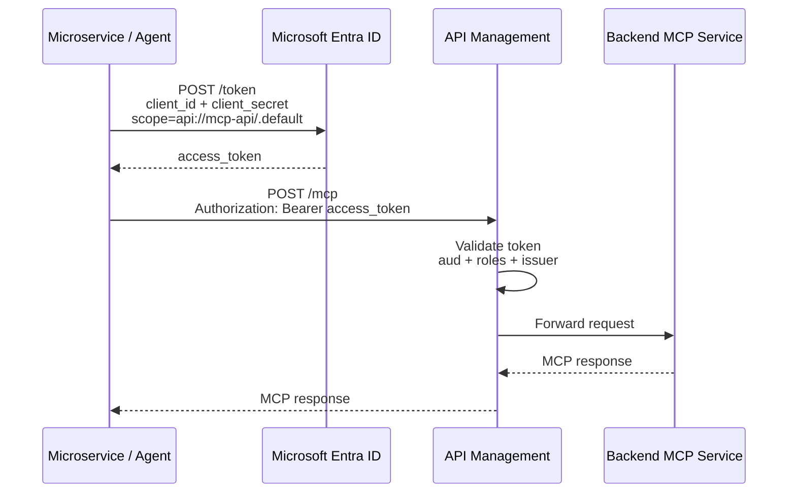

For client credentials:

| Topic | Answer |
|---|---|
| Is there a user? | No |
| Is there consent? | Admin consent, usually ahead of time |
| Does it use `user_impersonation`? | No |
| Scope format | `api://mcp-api/.default` |
| Token claim to check | Usually `roles`, not `scp` |
| Refresh token? | No |
| How does service renew token? | It calls Entra again with its own credential |

APIM policy should check app-only claims:

```xml
<validate-azure-ad-token tenant-id="YOUR_TENANT_ID">
  <audiences>
    <audience>api://YOUR_MCP_API_APP_ID</audience>
  </audiences>
  <required-claims>
    <claim name="roles" match="any">
      <value>Mcp.Invoke</value>
    </claim>
  </required-claims>
</validate-azure-ad-token>
```

Conceptually:

```text
user_impersonation = user delegated access
.default = app-only permissions already granted to this client
```

---

## 9. APIM as OAuth Gatekeeper

APIM does not log users in and does not issue Entra tokens.

APIM's role is:

1. Receive request.
2. Extract `Authorization: Bearer <access_token>`.
3. Validate issuer, audience, signature, expiry, and required claims.
4. Forward only valid requests to backend MCP service.

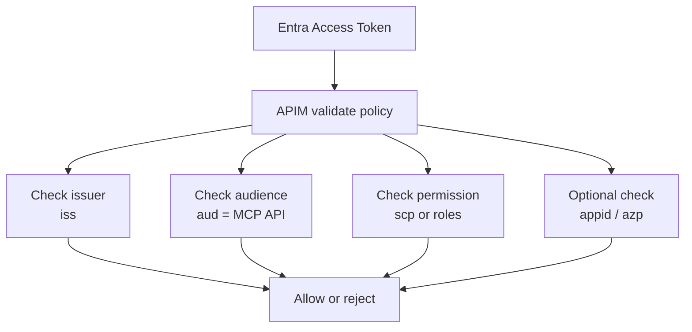

You can combine APIM subscription key and OAuth:

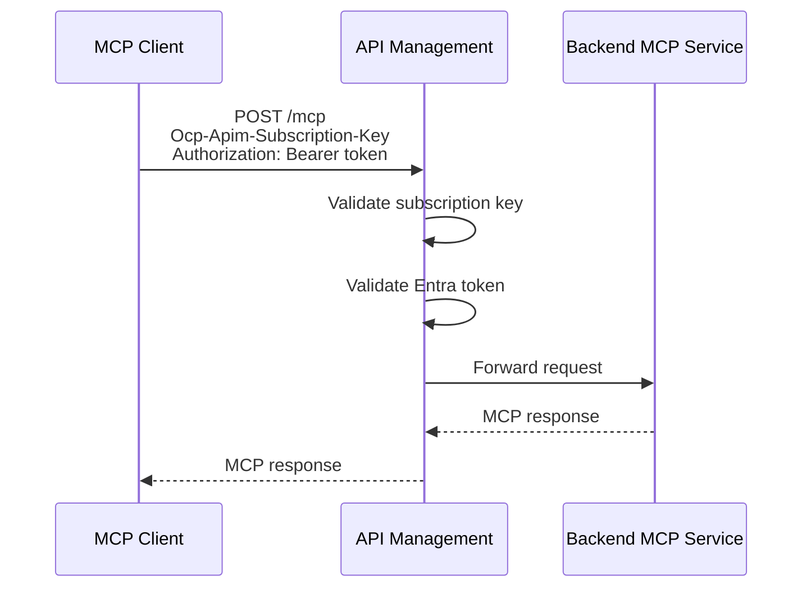

This gives two dimensions:

| Mechanism | Represents |
|---|---|
| Subscription key | Developer / application subscription in APIM |
| Bearer token | User or app identity from Entra |

---

## 10. Managed Identity Flow

For Azure-hosted microservices, prefer Managed Identity over client secret.

Example callers:

- Azure Function
- Azure Container Apps
- Azure App Service
- AKS workload identity
- VM / VMSS

The service asks Entra for a token using its managed identity, then calls APIM with that token.

```mermaid
sequenceDiagram
    participant Service as Azure-hosted Microservice
    participant IMDS as Managed Identity Endpoint
    participant Entra as Microsoft Entra ID
    participant APIM as API Management
    participant MCP as Backend MCP Service

    Service->>IMDS: Request token for MCP API<br/>resource/scope=api://mcp-api/.default
    IMDS->>Entra: Managed identity token request
    Entra-->>IMDS: access_token
    IMDS-->>Service: access_token
    Service->>APIM: POST /mcp<br/>Authorization: Bearer access_token
    APIM->>APIM: Validate token<br/>aud + roles + issuer
    APIM->>MCP: Forward request
    MCP-->>APIM: MCP response
    APIM-->>Service: MCP response
```

Managed Identity is preferred because:

| Client secret | Managed Identity |
|---|---|
| Secret must be stored | No secret stored in app |
| Secret rotates manually or by automation | Azure manages credential material |
| Risk if leaked | Lower exposure |
| Good for non-Azure or legacy callers | Best for Azure-hosted workloads |

---

## 11. Recommended Patterns

### Simple internal MCP server

```text
MCP Client -> Azure Function key -> FastMCP
```

Use this when:

- Small number of clients
- No user identity needed
- Fast setup matters

### Public developer-facing MCP API

```text
MCP Client -> APIM subscription key -> Backend MCP
```

Use this when:

- You want developer subscriptions
- You want key issuance through APIM
- Backend should stay unchanged

### User-specific MCP tools

```text
MCP Client -> Entra user token -> APIM validate token -> Backend MCP
```

Use this when:

- Tool results depend on the user
- You need consent, scopes, or delegated permissions

### Microservice / automation

```text
Microservice -> Entra app token or Managed Identity token -> APIM -> Backend MCP
```

Use this when:

- No human should log in
- Automation must run continuously
- Authorization should be app identity / app role based

---

## 12. Final Mental Model

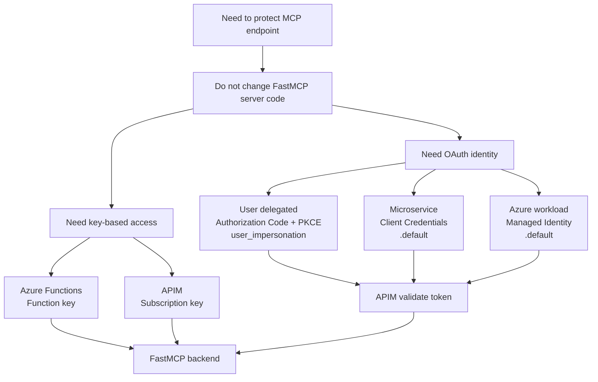