# Executive Summary

The core theme of this chat document is: how to understand OAuth, OIDC, Microsoft Entra ID, Azure CLI, App Service EasyAuth, OBO, Service Principal, and Azure RBAC within a unified identity model.

The most important conclusions are:

- The essence of OAuth is not "login", but an **authorization delegation and token issuance mechanism**.
- OIDC is the "login/authentication" layer built on top of OAuth.
- An access token is always targeted at a specific Resource Server; the key field is `aud`.
- In Azure, Entra is responsible for authentication and token issuance; resource services like Key Vault, Storage, and ARM are responsible for final authorization based on RBAC/policy.
- After logging in, Azure CLI does not use OBO to exchange tokens for all resources. Instead, it acts as an original OAuth client, requesting access tokens with different audiences per resource.
- When App Service / EasyAuth wants to access Key Vault or Storage on behalf of a user, it should typically use OBO / delegated identity, and let Azure RBAC continue to make the final permission decision.
- Building a centralized Web UI to operate Azure resources is essentially building a small Azure Portal / Cloud Identity Broker, requiring very careful handling of per-user token cache, session isolation, and least privilege.

# 1. Basic Roles of OAuth

OAuth 2.0 has four core roles:

| Role | Meaning | Azure / Entra Example |
| --- | --- | --- |
| Resource Owner | The person or entity who can authorize access to a resource, usually a user | Azure User |
| Client | The application that wants to access the resource | Azure CLI, Web App, MCP Client |
| Authorization Server | The service that authenticates the user and issues tokens | Microsoft Entra ID |
| Resource Server | The service that receives the access token and protects the resource | Microsoft Graph, Key Vault, Storage, ARM |

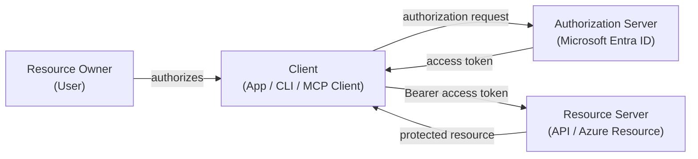

# 2. OAuth is Not Login, OIDC is the Login Layer

OAuth primarily answers:

> Can this client obtain a token to access a specific resource on behalf of a user or application?

OIDC primarily answers:

> Who is this user?

So, the common "Login with Microsoft / Google / GitHub" in practice is usually a combination of OAuth + OIDC:

- OIDC provides the client with an `id_token` to prove the user's identity.
- OAuth provides the client with an `access_token` to access the API / resource.

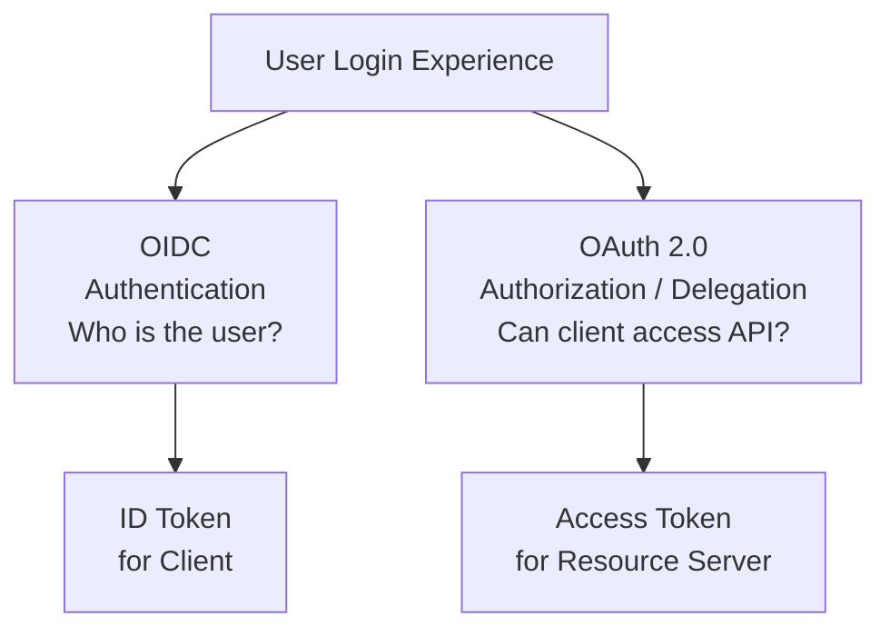

# 3. Authorization Code Flow

The Authorization Code Flow is the main flow discussed repeatedly in the document.

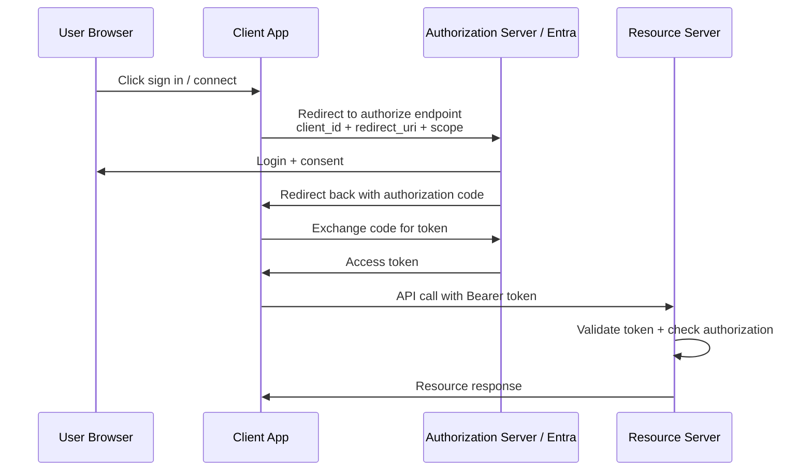

Key points:

- The authorization code is not the final credential, just a temporary authorization grant.
- The client must use the authorization code at the token endpoint to exchange for an access token.
- The Authorization Server validates `client_id`, `redirect_uri`, client authentication, PKCE, etc.

# 4. Client Registration: Pre-registration vs DCR

An OAuth client usually needs to be known by the Authorization Server first.

In Entra, this typically corresponds to App Registration:

- `client_id`
- redirect URI
- client secret / certificate / federated credential
- allowed scopes / API permissions
- supported account types
- platform type

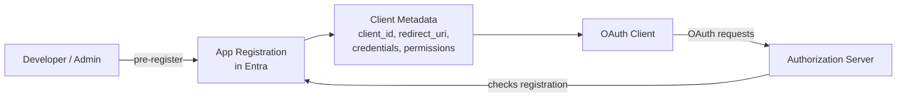

DCR, Dynamic Client Registration, is another approach: a client dynamically registers itself via a standard registration endpoint. It is not part of the OAuth core but an extension standard (RFC 7591 / RFC 7592).

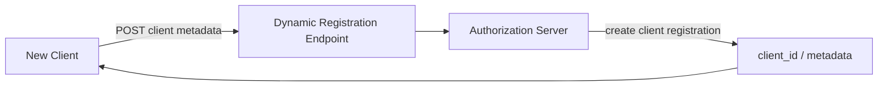

A more accurate understanding for Entra:

- Entra primarily uses the pre-registered App Registration model.
- Entra can automate the creation of app registrations via Microsoft Graph, but this is not equivalent to the open standard RFC 7591 DCR.
- DCR is often mentioned in MCP scenarios because the MCP client may not know all MCP servers / authorization servers in advance.

# 5. Public Client vs Confidential Client

A critical distinction in the document is whether the client can securely store a secret.

| Client Type | Can Securely Store Secret | Example | Common Flow |
| --- | --- | --- | --- |
| Public Client | No | SPA, Mobile, Desktop, CLI, many MCP Clients | Authorization Code + PKCE |
| Confidential Client | Yes | Backend Web App, API, Daemon, Server-side App | Auth Code + client authentication, or Client Credentials |

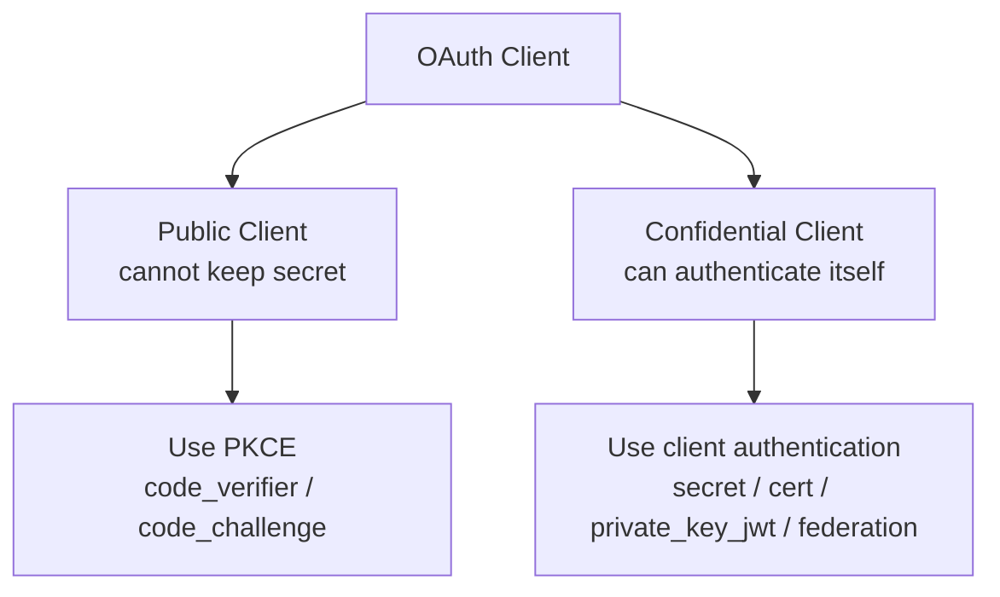

Important corrections:

- A client secret is not a user password; it is the credential the application uses to prove its identity ("I am this client") to the Authorization Server.
- Public clients should not rely on secrets because the secret can be leaked.
- PKCE can be understood as a temporary proof generated for each authorization request, used to prevent an intercepted authorization code from being exchanged for a token by someone else.
- In modern best practices, even for confidential clients, using PKCE is increasingly recommended.

# 6. Delegated Permission vs Application Permission

OAuth / Entra has two very different permission worlds.

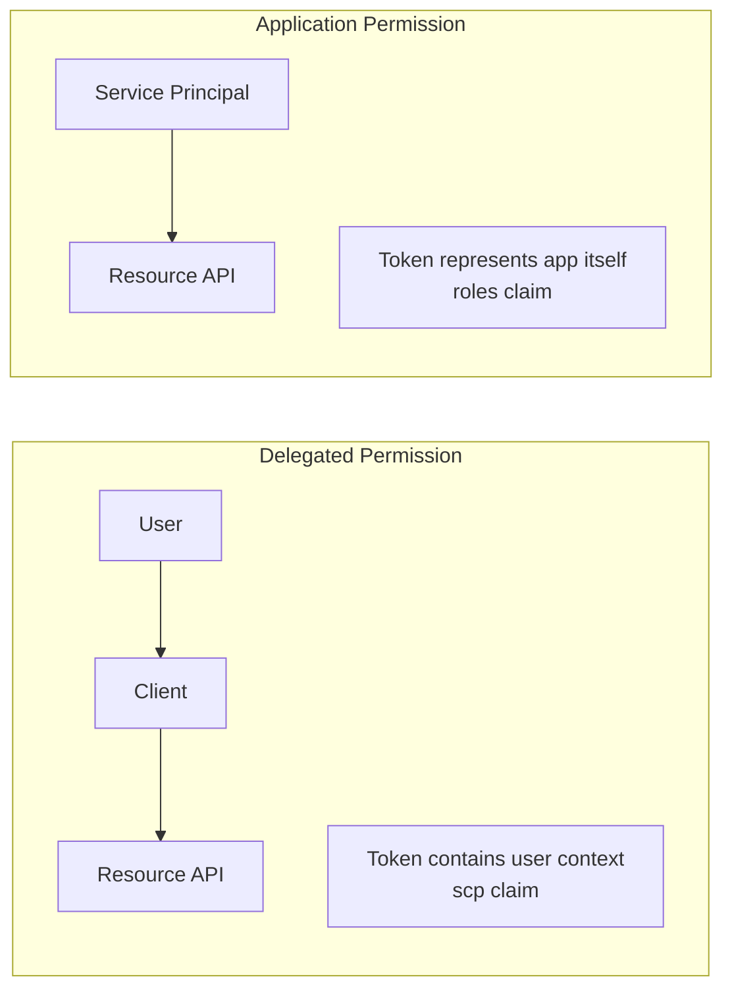

| Mode | Has User | Who Token Represents | Common Claim | Example |
| --- | --- | --- | --- | --- |
| Delegated | Yes | User + Client | `scp` | Web App reads Graph on behalf of user |
| Application | No | Application itself | `roles` | Daemon / SPN calls API |

A Service Principal is not a Resource Owner. It is a security principal within an Entra tenant that can be authorized by Azure RBAC.

# 7. Azure's Three-Layer Model: Authentication, Token Issuance, Authorization

The most valuable part of this document is breaking down the Azure access model into three layers.

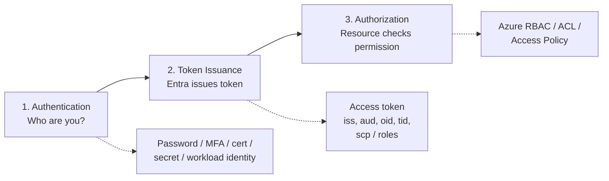

Core judgment:

- Entra is responsible for authentication and token issuance.
- The Resource Server is responsible for validating the token and, combined with RBAC / policy, deciding whether to allow the operation.
- OAuth API Permission is not the same as Azure RBAC.
- Being able to obtain a Storage token does not mean you can definitely delete a blob; deleting a blob still requires Storage RBAC permission.

# 8. Azure CLI Token Model

The user asked why, after `az login`, they can access ARM, Key Vault, and Storage. The document's key correction is: this is typically not OBO.

Azure CLI is an original OAuth client. After login, it can request access tokens with different audiences for different resources based on its own token cache / refresh token / session.

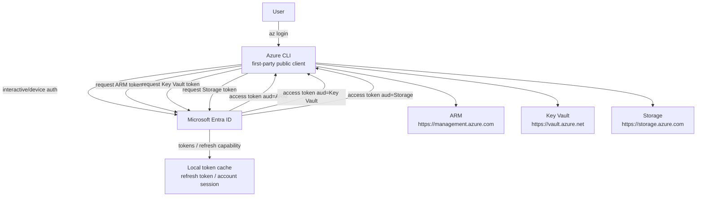

Key points:

- Access tokens are resource-specific.
- A Graph token cannot directly access Key Vault.
- Whether an operation on a resource succeeds also depends on the RBAC for that resource.
- A refresh token is not a universal pass; it is bound to the user + client and is limited by consent, scope, conditional access, and token policy.

# 9. OBO: When On-Behalf-Of is Needed

OBO is for a middle-tier API to call a downstream API on behalf of the user.

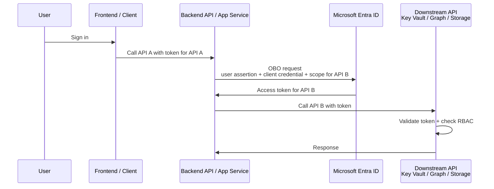

Scenarios suitable for OBO:

- A Web App / API receives a user request and needs to call Graph, Key Vault, Storage, etc., on behalf of this user.
- Permissions must preserve the user boundary; a single Managed Identity cannot cover all user differences.
- You want Azure RBAC to continue deciding which secrets or blobs User A / User B can actually read.

Cases where making everything OBO is not suitable:

- The backend only performs fixed tasks for the application itself.
- There is no need to distinguish each user's native permissions on Azure resources.
- Using Managed Identity is clearer and has a smaller blast radius.

# 10. Correct Understanding of App Service / EasyAuth

EasyAuth can help App Service with OIDC/OAuth login and token store.

But note:

- The client in EasyAuth is the app registration behind the App Service Authentication component.
- The resource is usually your Web App / API, not "Azure App Service the platform service" itself.
- EasyAuth's token store is associated with the authenticated session.
- If you need to access downstream Azure resources, you still need to consider downstream tokens, OBO, API permissions, and RBAC.

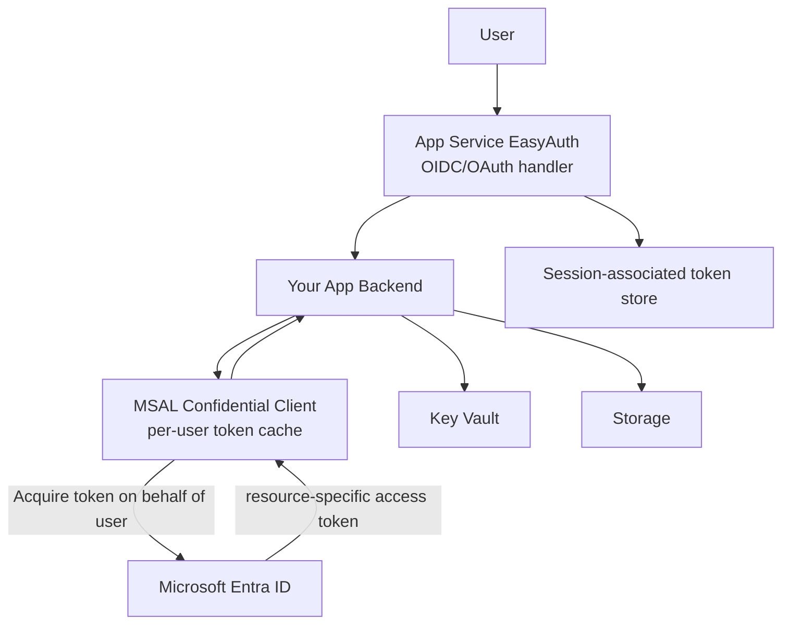

# 11. Architecture Recommendations for a Centralized Azure Resource GUI

The user's final scenario is: build an App Service that provides a centralized graphical interface for operating Storage Accounts and Key Vaults, while preserving permission differences between users.

Recommended model:

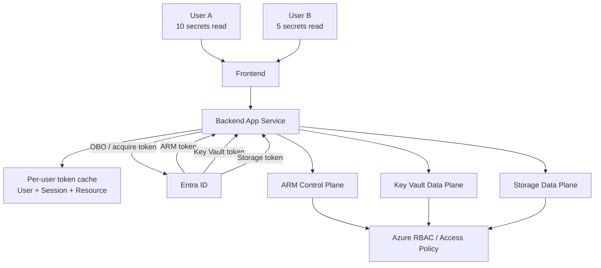

Engineering principles:

- Use delegated identity / OBO to preserve user permission boundaries.
- Do not use a single, overly permissive Managed Identity to represent all users, unless you are willing to implement a complete authorization system yourself.
- The token cache must be isolated by user, session, tenant, and resource/scope.
- Do not store access tokens / refresh tokens in plain text.
- Use MSAL to manage token cache, refresh, and rotation whenever possible.
- Let Azure RBAC be the final authorization authority; do not reinvent an Azure permission system within your application.

# 12. Control Plane vs Data Plane

Many Azure operations can be performed via ARM, but data plane operations like reading secrets / blobs typically require a data plane token for the respective resource.

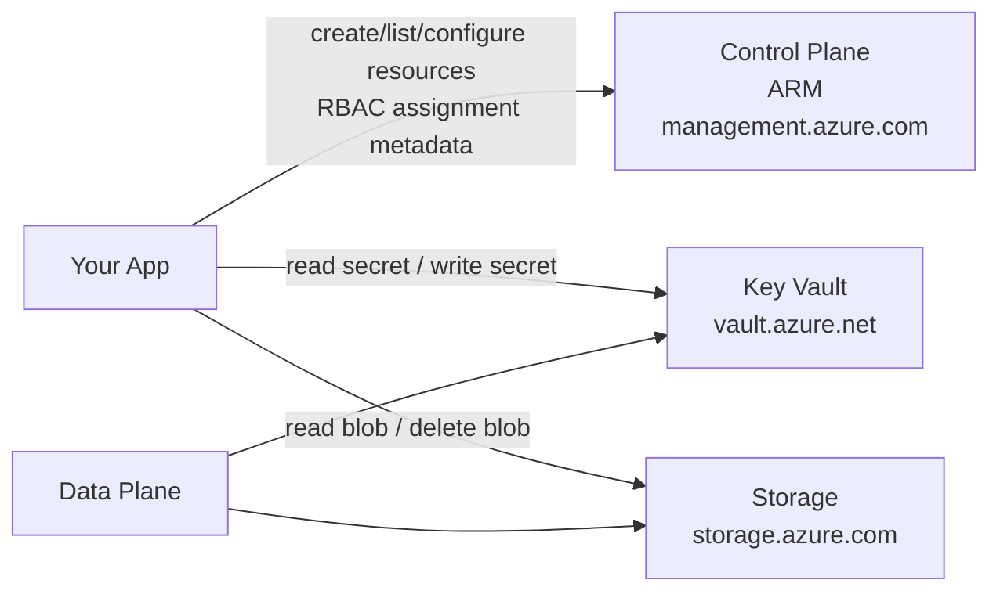

| Layer | Example | Token Audience |
| --- | --- | --- |
| Control Plane | Create resources, list resources, configure resources, manage RBAC | `https://management.azure.com` |
| Key Vault Data Plane | Read secret, write secret | `https://vault.azure.net` |
| Storage Data Plane | Read blob, delete blob, write blob | `https://storage.azure.com` |

# 13. Final Mental Model

Condensing the entire document into one sentence:

> OAuth/Entra is responsible for allowing a specific client to obtain a token for a specific resource within a defined boundary; the Azure resource then determines whether the operation can be performed based on the identity in the token and its own RBAC/policy.

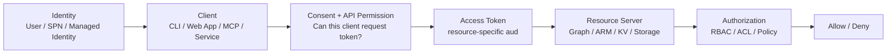

# 14. Several Calibration Points to Remember

- `client_id` identifies the application, not the user.
- `client_secret` proves the application's identity, not the user's password.
- `id_token` is for the client to identify the user.
- `access_token` is for the resource server to authorize access.
- `aud` determines who the token can be used for.
- `scp` is commonly found in delegated permissions.
- `roles` is commonly found in application permissions.
- OBO is a user delegation chain from API to API, not the normal working mode of Azure CLI.
- The API Permission in App Registration is just a layer for "whether a token can be requested"; it is not equivalent to RBAC on the resource.
- A refresh token is bound to the user + client + policy; it is not an unrestricted master key across resources.