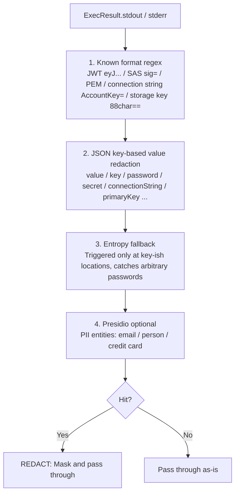
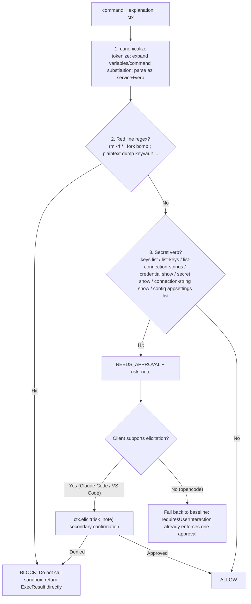
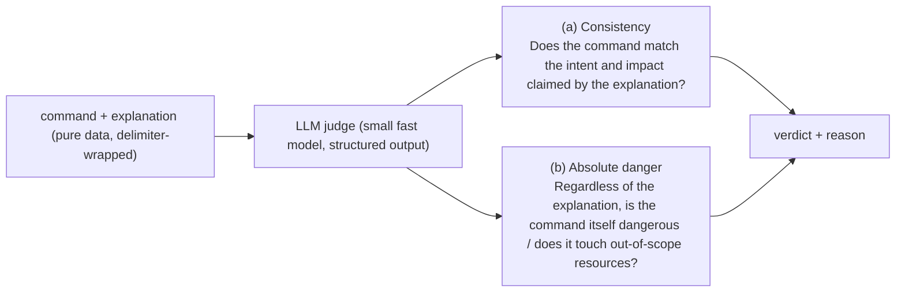

# action_bash Guardrail Implementation — Output Redaction + Client Mandatory Approval

> This document is the converged result of multiple discussions, superseding the parts of [`Implementation Plan-action_bash-Policy Gateway and Manual Approval`](action-bash-policy-gate-and-human-approval-design-and-implementation-plan.md) that have been implemented by the oid-log PR or are now obsolete (see Part 1).
>
> **This step (this iteration) only does two things and implements them: ① Output-side redaction (post-exec gate); ② Client-side mandatory human approval.**
> Part 3 (pre-exec deterministic gate) is the immediate next step in design, and Part 4 (pre-exec introducing an LLM judge) is a longer-term plan. First, make ① and ② solid.

---

## 0. One-Pager (TL;DR)

- **The reliability floor is not the gate, but the two layers already shipped**: L0 = worker SP RBAC (diagnose=Reader / action=Contributor, capping blast radius); L3 = oid-log identity attribution audit (correlation-id traces every command to a real person + real IP). When discussing reliability externally, lead with these two layers.
- **This iteration adds depth**: ① Output redaction is done **inside the MCP server process** (deterministic, not outsourced); ② Every `action_bash` **forces a human approval prompt on the client side** (Claude Code relies on a single `_meta` line from the server, VS Code relies on an MDM-deployed setting).
- **Pre-exec deterministic gate (Part 3)**: Does not enumerate commands, but **scans output shape + matches `az` verb grammar**; hitting a secret verb → secondary confirmation (elicitation), hitting a red line → direct block.
- **LLM judge (Part 4)**: Intent consistency + absolute danger, built as a **pluggable pipeline rule externalized to a managed model endpoint**. This is the next step, not this one.

---

## Part 1 — Current Status

### 1.1 Already Implemented (after oid-log PR #3)

| Capability | Status | Code |
|---|---|---|
| L0 RBAC floor (diagnose=Reader / action=Contributor) | ✅ Existing | Azure side |
| L3 identity attribution audit (`AuditEvent` authoritative row → Log Analytics `MCPAudit_CL`; correlation-id injected into UA to correlate native Azure logs; never-raise/never-block) | ✅ **Implemented** | `audit.py`, `main.py:_exec` |
| `SessionCtx` carries `correlation_id` | ✅ | `executor.py` |
| `explanation` reaches `_exec` and is written into the audit row | ✅ **Partially working** | `main.py:_exec(..., explanation)` |

> Note: The audit row in `audit.py` **does not contain stdout** (only command/explanation/exit_code), so the audit chain itself does not leak secrets from the output. If stdout is ever added to the audit, **redact it first**.

### 1.2 Not Yet Implemented (to be addressed by this plan)

- **`explanation` is not yet in `SessionCtx` and does not reach `executor.exec`**: `_exec` receives `explanation` (for audit), but `SessionCtx` lacks this field, and `exec(ctx, command)` cannot access it. Pre-exec intent-vs-command comparison requires this final hop.
- **`action_bash` does not yet have `requiresUserInteraction` set**: Currently only has `annotations={readOnlyHint:false, destructiveHint:true, ...}` — annotations are hints, not gates; the client is not obligated to show a dialog because of them. The `_meta` line for mandatory approval has not been added.
- **Gate status**: Post-exec redaction (`redact.py`) **has been implemented in this iteration** and integrated into `_exec` (shared by diagnose + action); the pre-exec pipeline (Part 3) and the optional `GatedExecutor` wrapper have not been done.

### 1.3 Convergence Boundary for This Iteration

- **Do**: Part 2's ① (post-exec redaction) + ② (client mandatory approval).
- **Design, do next**: Part 3 (pre-exec deterministic gate).
- **Plan, do later**: Part 4 (pre-exec LLM judge).

---

## Part 2 — Unified Understanding: The Two Parts of This Iteration

### 2.1 Part One: Output-Side Redaction (post-exec gate)

**Conclusion first: Do it inside the MCP server process, with deterministic rules. Do not outsource, do not use an LLM, do not put it on APIM.**

Why in-process (recap of the four hard reasons from the discussion):

1. **Egress paradox**: Outsourcing means sending the output containing secrets out first — to protect the secret, you send it an extra hop. Security control defeats itself.
2. **Context**: The strongest detection relies on "command + az JSON schema + key-ish location", which only the server process has; a gateway sees only an opaque body.
3. **Streaming**: MCP uses SSE. A gateway rewriting a streaming body must buffer it, and secrets can span chunks. The process has the complete `ExecResult` in hand and can scan the whole thing.
4. **Fault coupling**: An external service going down → fail-open leaks secrets / fail-closed stops service. In-process deterministic scanning has no such dependency and is sub-millisecond.

**Redaction insertion point**: Inside `_exec`, after `executor.exec` returns, before returning to the client. It could also be wrapped as a `GatedExecutor` transparently around the inner executor (only needs `ExecResult → ExecResult`, no FastMCP Context needed). Choose one; the recommendation is to put it directly in `_exec` (minimal change, `_exec` is already the single choke point).

**Four-layer deterministic detector** (from precise to catch-all):



Key points:

- **① Known format regex**: JWT, SAS, PEM private key, connection string key, storage 88-character key — high precision, near-zero false positives. Can directly embed **`detect-secrets` (Yelp, pure Python)** or port **gitleaks** rule sets. These mature tools are the libraries, not some managed SKU.
- **② JSON key-based value redaction**: `az` output is mostly JSON (can enforce `-o json`). **Redact values by field name** (key matches a sensitive name → mask value), so **arbitrary password values are also caught** (the key is the field name, not the value). `.value` from `az keyvault secret show` and `[].value` from `az storage account keys list` are 100% recall deterministic items.
- **③ Entropy fallback**: Triggered only at key-ish locations (sensitive variable assignment, after `=` in connection strings, value of sensitive JSON keys) to suppress false positives.
- **④ Presidio (optional)**: Only for PII; do not rely on it for secrets. If the dependency is heavy, place it in a **sidecar container in the same ACA app** (localhost call, dependency isolation).

**Verdict: Only REDACT — no BLOCK, no approval, no audit entry.** The command has already run, the secret is already in the output. The only job of post-exec is "don't let it out"; there is nothing to approve. And "run redaction every time" is the default path; logging the verdict is just noise. So redaction is a pure transformation `ExecResult → redacted ExecResult`: no verdict returned, no blocking of the entire output (BLOCK would discard useful output around the secret, making it too hard for DataOps). Hit counts are only `logger.debug` logged as **counts (not values)** for FP tuning, not in `AuditEvent` (see 2.3).

**Both tools go through the same gate**: `diagnose_bash` and `action_bash` both go through `main.py:_exec`; redaction is attached at this single point, automatically covering both tools — the code is `result = redact.redact_result(result, command=command)` inside `_exec`. Although the action path is most critical (privileged secrets read by action; `diagnose`'s Reader normally cannot read most secrets), diagnose also goes through it: for consistency and depth, and to catch sensitive strings that Reader can occasionally read (e.g., connection strings embedded in some resource properties).

#### 2.1.1 What is detect-secrets

An open-source secret scanning tool/library by Yelp, originally designed to "prevent secrets from being committed to git" (pre-commit hook). Two capabilities are useful to us:

- **Detectors (plugins)**: ① Known formats — AWS/Azure Storage key, JWT, Basic Auth, private keys, various tokens…; ② `KeywordDetector` — catches values by variable name (`password`/`secret`/`api_key`); ③ **Entropy detectors** — `Base64HighEntropyString` / `HexHighEntropyString`, with tunable Shannon entropy threshold.
- **False positive filters — this is the most valuable part for us**: A set of battle-tested FP exclusions that directly counteract the noise from entropy detection: `is_potential_uuid` (GUIDs are not secrets), `is_sequential_string` (`1234abcd`), `is_likely_id_string`, `is_templated_secret` (`<password>` / `${VAR}` / `xxxxx` / `example`), `is_lock_file`…

How to use it as a library (note it is primarily designed for git scenarios — reporting "has secret + type/line number"): For **redaction**, you need the matched span. Under scanning, `PotentialSecret.secret_value` gives the value; `text.replace(secret_value, MASK)` works. **gitleaks is actually better suited for redaction**: each rule is a regex with a capture group, and the capture group is the exact span to mask.

Our usage: **The primary workhorse is our own JSON key-based value redaction** (you control `-o json`, highest precision); the value of detect-secrets / gitleaks is reusing their **mature known-format regex packages + entropy detector + FP filters**, so we don't have to hand-craft them or deal with FP pitfalls ourselves. `redact.py` currently has the most critical ones built-in (JWT/PEM/SAS/connection string/storage key); to expand, feed gitleaks rules into `_KNOWN` and detect-secrets filters into the entropy channel.

#### 2.1.2 Implementation Details (`redact.py`, already implemented)

Insertion point: Inside `_exec`, after `executor.exec`, before returning, `redact.redact_result(result, command=command)`; `ExecResult` is a frozen dataclass, use `dataclasses.replace` to create a new result. The three layers correspond to the code:

1. **JSON key-based value redaction (`_mask_json`)**: If `json.loads(stdout)` succeeds, recurse; if a key matches `_SENSITIVE_KEY` (**only unambiguous compound names**: `password`/`clientSecret`/`connectionString`/`accountKey`/`primaryKey`/`accessToken`…), replace the **scalar value** with `«redacted»`. **Only mask scalars**, never replace a field whose value is a list/dict (to prevent `{"value":[...]}` from being destroyed). If parsing fails (`-o table`/`tsv`/stderr), skip this layer.
2. **Known format regex (`_KNOWN`)**: JWT / PEM / `bearer …` / SAS `sig=` / connection string `AccountKey=…` / 88-character storage key. For `group>0`, only mask the value, keep the label (`sig=«redacted»`). Also run after JSON re-serialization to catch "connection strings hidden in non-sensitive fields".
3. **Entropy fallback (`_redact_text` entropy branch)**: **Off by default** (only enabled with `REDACT_ENTROPY=1`); even when on, first pass through GUID/hex allowlist, then judge by Shannon entropy threshold (default 4.2) + minimum length.

Command-scoped `value`/`key`: `_CMD_VALUE_SCOPES` recognizes `keyvault secret show`, `* keys list`, etc. — commands whose **purpose is to output a secret** — and **only then** allows masking the ambiguous `value`/`key`; otherwise, `value`/`key` are never touched (to protect tags, list wrappers). Both stdout and stderr outputs are redacted (errors can also echo connection strings).

Verification: 8 test cases in `tests` cover each of the above scenarios (including `group list` not being falsely hit, tag `key/value` preserved, GUID preserved — 3 FP cases), all green.

> **Layer-by-layer flowchart, before/after examples for each layer, and end-to-end walkthrough** can be found in [`Output Redaction Implementation Details-redactThree-Layer Logic and Examples`](output-redaction-implementation-details-redact-three-layer-logic-and-examples.md).

#### 2.1.3 Reducing False Positives to Negligible

The precise layers (JSON key + known format + command scope) have ≈0 FP and do the vast majority of the work; **entropy is the only FP source**, so either turn it off or use an allowlist + context to make it negligible. Seven methods:

1. **Prioritize high precision, minimize or even disable the entropy net**: JSON key-based (triggered by key name, ≈100% precision) + known formats (`eyJ` / `-----BEGIN` / `sig=` prefix, ≈100%) have almost no false positives. Relying only on these two layers already yields near-zero FP — `redact.py` defaults to this configuration (entropy off).
2. **Ambiguous key names are not in the general set**: `value`/`key`/`token`/`secret` are too common (tags, `{"value":[...]}` list wrappers, storage's `keyName`), **never put them in `_SENSITIVE_KEY`**, only mask them within the command scope. This is the easiest pitfall for over-redaction (`az … list` would be entirely destroyed).
3. **Only mask scalars**: `_mask_json` never replaces a field whose value is a list/dict with MASK, preventing the entire result array from being destroyed.
4. **Identifier allowlist**: GUIDs (subscription/tenant/resource id), hex/sha (git sha, image digest), resource id are explicitly excluded — masking them is not just an FP, it **breaks the agent's next step** (the next command needs that id). detect-secrets' `is_potential_uuid` and other filters do exactly this; reuse them directly when the entropy channel is on.
5. **Entropy: context-gated + conservative threshold + minimum length**: When entropy is on, trigger only at key-ish locations, use a high threshold (prefer miss over false alarm), require ≥20 characters. High-entropy secrets that are missed are covered by L0 RBAC + L3 audit — **trade entropy's FN for FP→0**.
6. **Command-scope precision strike**: When a command is recognized, surgically mask only that command's secret field (`keyvault secret show → .value`), precision ≈100%, prioritized over any blind scan.
7. **Observable and tunable**: Only log hit counts (`logger.debug`, not values) to facilitate over-redaction detection and rule adjustment; masks retain labels (`sig=«redacted»`) for debugging.

> In one sentence: **Precise layers handle recall, entropy is off by default, ambiguous key names and identifiers are explicitly excluded** → FP is effectively 0; what little is missed is covered by RBAC + audit.

### 2.2 Part Two: Client-Side Mandatory Human Approval (Human-in-the-Loop)

**Core distinction**: For Claude Code, the mandatory signal is a **server-side declaration** (one line of `_meta`, in your code); for VS Code, the mandatory signal is a **client-side setting** (MDM-deployed, your code cannot control it, only provide a hint).

| Client | Parameter for Mandatory Approval | Configured Where | What Server Must Send | Can It Be Locked So User/Operator Cannot Disable |
|---|---|---|---|---|
| **Claude Code** | `_meta["anthropic/requiresUserInteraction"]=true` (v2.1.199+) | **Server's tool definition** | **Just this `_meta` line** (+ stable tool name `mcp__dataops__action_bash`, annotations) | ✅ managed settings + `disableBypassPermissionsMode:"disable"` |
| **VS Code** | `chat.tools.eligibleForAutoApproval:{"<toolId>":false}` | **Client setting (MDM/org policy deployed)** | Server **cannot send a mandatory signal**, can only send annotations as hints (`readOnlyHint:false`/`destructiveHint:true`) + stable toolId | ✅ Only via MDM/org policy |
| **opencode** | Only `permission:{tool:"ask"}` | Client config | No server-side mandatory signal, no elicitation | ❌ No lock, no server-side enforcement — **weak link** |

> ⚠️ The version numbers / setting key names below come from the previous round of multi-client research; client-side settings are evolving — **verify against the team's actual client version before implementation** (especially VS Code key names).
>
> 📁 **This repository already has usable configurations built-in**. After cloning, follow the [`README`'s "Connect a client"](../../../README.md) to set up: the server-side `_meta` is already on `action_bash` in `src/mcp-server/main.py`; client configurations are in the root `.mcp.json` (Claude Code), `.vscode/mcp.json` + `.vscode/settings.json` (VS Code), `opencode.json` (opencode), and `.claude/settings.json` (Claude Code approval). The following is **explanatory (retained)**; the real server name is `azure-dataops-aca`, and placeholder names in the examples should be replaced with the actual repository files.

#### Claude Code — One Line of `_meta` on the Server + Fleet Lock

**① Server (FastMCP) adds the mandatory signal to the `action_bash` tool definition** (this is the primary mechanism; one declaration enforces globally):

```python
@mcp.tool(
    auth=require_action,
    annotations={"readOnlyHint": False, "destructiveHint": True, "idempotentHint": False, "openWorldHint": True},
    meta={"anthropic/requiresUserInteraction": True},   # ← Mandatory signal for Claude Code (v2.1.199+)
)
async def action_bash(command: str, explanation: str, ctx: Context) -> dict:
    ...
```

With this set, Claude Code **forces a real human interaction every time** `action_bash` is called; even `--permission-prompt-tool`'s `allow` is converted to `deny` ("the prompt must reach a person").

**② MCP server registration** (`.mcp.json`) — the server name `dataops` determines the permission id prefix `mcp__dataops__`:

```jsonc
// .mcp.json (project root)
{
  "mcpServers": {
    "dataops": {
      "type": "http",
      "url": "https://mcp.example.internal/mcp"
    }
  }
}
```

**③ Managed settings lock** — enterprise control layer, user/operator cannot modify, takes precedence over user and project settings:

```jsonc
// managed-settings.json (enterprise-deployed; user cannot override)
//   macOS:   /Library/Application Support/ClaudeCode/managed-settings.json
//   Linux:   /etc/claude-code/managed-settings.json
//   Windows: C:\ProgramData\ClaudeCode\managed-settings.json
{
  "permissions": {
    "allow": ["mcp__dataops__diagnose_bash"],
    "ask":   ["mcp__dataops__action_bash"],
    "deny":  [],
    "defaultMode": "default"
  },
  "disableBypassPermissionsMode": "disable",   // ← Top-level key, not inside permissions; locks down YOLO / bypass mode
  "enableAllProjectMcpServers": true            // Optional: force-enable project MCP servers, in case users don't connect
}
```

> Structural note: `disableBypassPermissionsMode` is a **top-level settings key** (not a sub-key of `permissions`); `ask` is the fallback for approval, the real enforcement comes from the server-side `_meta`.

#### VS Code — Server Only Provides Hints, Lock Relies on Client Settings + MDM

The server side has **no equivalent** "mandatory interaction" meta; `annotations` are just hints. The real enforcement relies on client-side settings, deployed by MDM/org policy, which the user cannot change.

**① MCP server registration** (`.vscode/mcp.json`, note VS Code uses `servers` not `mcpServers`):

```jsonc
// .vscode/mcp.json
{
  "servers": {
    "dataops": {
      "type": "http",
      "url": "https://mcp.example.internal/mcp"
    }
  }
}
```

**② Approval settings** (`settings.json`, org-level / MDM-deployed):

```jsonc
// settings.json (enterprise policy deployed, user cannot change)
{
  // First, turn off global auto-approval (default is false, but write it explicitly to prevent someone from enabling it)
  "chat.tools.autoApprove": false,

  // Granular: prevent action_bash from ever entering auto-approval (forces dialog every time, even "always allow" is not remembered)
  //   Key name / tool id shape evolves with VS Code version; verify before implementation (see ⚠️ at top of this section)
  "chat.tools.eligibleForAutoApproval": {
    "dataops/action_bash": false
  }
}
```

> Mechanism note: Setting only `autoApprove:false` is insufficient — VS Code remembers the user's "always allow" clicks and stops prompting afterward. To **always prompt**, you must use `eligibleForAutoApproval:false` (prevents that tool from being remembered/auto-approved), and **lock it via MDM** so the user cannot change it back. So for VS Code, the server's responsibility is: **stable tool id + honest annotations**; the enforcement part is left to the device administrator.

#### What About opencode

opencode currently: **No server-side mandatory interaction, no elicitation (FR #8251 / #23066 still unsupported), no enterprise-level lock**. Only a client-local `permission`, which the operator can change themselves.

```jsonc
// opencode.json (project root / ~/.config/opencode/config.json)
{
  "$schema": "https://opencode.ai/config.json",
  "mcp": {
    "dataops": {
      "type": "remote",
      "url": "https://mcp.example.internal/mcp",
      "enabled": true
    }
  },
  "permission": {
    "dataops_diagnose_bash": "allow",
    "dataops_action_bash": "ask"   // The only thing possible; operator can change it themselves, no lock
  }
}
```

**Trade-off**: opencode is a weak link. For high-risk operations, either **restrict access to only Claude Code / VS Code**, or explicitly accept **opencode only using `ask` + organizational convention as a residual risk** (the RBAC floor is still in place, blast radius is bounded). Do not treat it as a reliable enforcement point.

### 2.3 What Goes Into the Audit and What Does Not

- **Post-exec redaction does not go into the audit**: It is the default behavior run every time; logging the verdict is just noise. Hit counts go to `logger.debug` (not values) only for FP tuning, not into `AuditEvent`.
- **Only pre-exec decisions go into the audit** (when Part 3 is implemented): `BLOCK`, human approval results — these are real security events worth recording. At that time, add to `AuditEvent`:

```python
# audit.py: AuditEvent additional fields (when Part 3 is implemented, not this iteration)
gate_verdict: str | None = None     # ALLOW / BLOCK / NEEDS_APPROVAL
gate_rule:    str | None = None     # Name of the rule hit
risk_note:    str | None = None     # Risk annotation for human reading
approved_by_human: bool | None = None   # Elicitation/approval result (if available)
```

> One tool call still produces **one authoritative row**: the pre-exec verdict is passed back to `_exec`, and `_exec` carries it out in that single row, rather than writing a separate row.

---

## Part 3 — How to Implement Pre-execution (Deterministic Gate)

> Directly describes the approach. This layer is **deterministic** (no LLM), to be done immediately after this iteration. The goal is not to block 100% of bad commands, but to **automatically block obvious red lines + escalate secret-class commands to secondary confirmation + leave audit traces**.

### 3.1 Prerequisite Changes (Must Be Done First)

`explanation` must reach the execution layer so the pipeline can do "intent vs command" comparison:

```python
# executor.py: Add field to SessionCtx
@dataclass(frozen=True)
class SessionCtx:
    user_oid: str | None
    session_id: str | None
    conversation_id: str | None
    group: Group
    correlation_id: str | None = None
    explanation: str | None = None      # ← New

# main.py: Put the already-received explanation into SessionCtx (currently only fed to audit)
sctx = SessionCtx(..., explanation=explanation)
```

### 3.2 Pipeline Structure (Order: Cheap and Deterministic First)



### 3.3 How the Three Rules Work

1. **Canonicalize**: Tokenize, expand variables and `$(...)`, make policy decisions on **canonicalized tokens** (not raw strings — the shell expands/removes quotes before execution, so "what is checked ≠ what is executed"). This project is 90% `az`; only parse the `az` subcommand tree (service + verb) and judge read/write and impact scope accordingly.
2. **Red line regex (few, absolute)**: `rm -rf /`, fork bomb, plaintext dump of secrets, etc. — zero-tolerance items → `BLOCK`. Red lines are a very small set of absolute items; everything else does not use regex.
3. **Secret verb detection (do not enumerate commands, match verb grammar)**: ARM models "operations that return secrets" as POST with names starting with `list*` (`listKeys`/`listConnectionStrings`/`listSecrets`/`listCredentials`/`regenerateKey`). `az` maps these to the small set of verbs below. **Match verbs, not service catalogs**:

   | Verb pattern (~7 categories) | Example services hit |
   |---|---|
   | `keys list` / `list-keys` | storage, cosmosdb, cognitiveservices, batch, maps, redis, signalr |
   | `list-connection-strings` / `connection-string show` | cosmosdb, iot hub, webapp/functionapp config |
   | `credential show` / `credential list` | acr, appconfig |
   | `secret show/list`、`key show` | keyvault |
   | `... authorization-rule keys list` | servicebus, eventhubs, relay, notification-hub |
   | `config appsettings list` | functionapp, webapp (appsettings hide connection strings) |
   | `admin-key show` / `query-key list` | search |

   Hit → `NEEDS_APPROVAL` + `risk_note` (e.g., "This command retrieves credentials and will expose the key for X").

### 3.4 How the Verdict is Implemented in `_exec`

Pre-exec **human interaction (elicitation) requires FastMCP Context**, while `Executor.exec` only has `SessionCtx`. Therefore, place the pre-exec orchestration in `_exec` (which holds `ctx`), and put the rules themselves in a unit-testable `gate/` module:

```python
async def _exec(group, command, ctx, explanation=None):
    sctx = SessionCtx(..., explanation=explanation)
    verdict = gate.pre_exec(sctx, command)          # Pure function: ALLOW/BLOCK/NEEDS_APPROVAL

    if verdict.action == "BLOCK":
        result = ExecResult(exit_code=126, stdout="", stderr=f"blocked by policy: {verdict.rule}")
    else:
        if verdict.action == "NEEDS_APPROVAL":
            ok = await _elicit_or_baseline(ctx, verdict.risk_note)   # Elicit if supported, otherwise fall back to baseline
            if not ok:
                result = ExecResult(exit_code=126, stdout="", stderr="declined by user")
            else:
                result = await executor.exec(sctx, command)
        else:  # ALLOW
            result = await executor.exec(sctx, command)

    result = gate.post_exec(result, sctx)            # Part 2.1 redaction
    await audit... (gate_verdict=verdict.action, gate_rule=verdict.rule, risk_note=verdict.risk_note)
    return result.to_dict()
```

Key points:

- **BLOCK does not call the sandbox**: Construct an `ExecResult` and return directly.
- **NEEDS_APPROVAL mechanism is elicitation**: Note the timing — the client-side `requiresUserInteraction` dialog occurs **before** the server receives `tools/call` (the person has already approved once). To present the server-calculated `risk_note` to the person for a **risk-annotated secondary decision**, use `ctx.elicit` (supported by Claude Code v2.1.76+ / VS Code natively; not supported by opencode → fall back to the baseline mandatory approval).
- **Baseline is always present**: Even if elicitation is unavailable, `requiresUserInteraction` ensures `action_bash` is seen by a real person at least once; BLOCK is a server-side hard block, independent of the client.

### 3.5 Do Not Maintain the Verb List Manually

Make the verb table from 3.3 a **yaml configuration**, and use a **scheduled task** to grep `azure-rest-api-specs` for operationId `(list|regenerate).*(key|secret|credential|connectionString)` to auto-generate/diff. When Azure adds a new `listKeys` operation, you will receive a diff alert instead of discovering it manually. **Adding a rule = changing configuration**, no logic changes, no release.

### 3.6 Scope and Degradation

- **Primarily acts on the action path**: diagnose (Reader) cannot access most secrets anyway, so the command net on diagnose is mostly moot; output redaction is attached to both paths.
- **Ambiguous cases → NEEDS_APPROVAL, not hard BLOCK**: If the list misses one item, it just means one fewer secondary confirmation dialog; the output net still redacts, RBAC still caps. Only absolute red lines get hard-blocked. **Neither net needs to be complete**, because the floor is L0+L3.

---

## Part 4 — Planning: Pre-exec Introducing LLM as a Judge (Next Next Step)

> This is an enhancement after Part 3, not in this iteration. Make it a **pluggable pipeline rule + externalized to a managed model endpoint**, without blocking the preceding implementation.

### 4.1 The Judge Must Do Two Things Simultaneously



- **Why (b) is necessary**: An injection can **simultaneously forge a malicious command + a matching pretty explanation**; checking only consistency (a) can be fooled by a self-consistent bad combination.
- **The judge itself must be injection-proof**: Wrap the content to be reviewed as **pure data** with delimiters, require **structured output** (only return verdict+reason, do not execute any instructions within it).

### 4.2 Deployment and Integration

- **Externalize to a managed model endpoint** (Azure AI Foundry / Azure OpenAI) — the judge is the part that is genuinely hard to self-host and benefits from managed scaling, making it worth outsourcing (contrary to "deterministic redaction is not outsourced").
- **It is just one `Rule` in the pipeline**: After the pre-exec deterministic layer short-circuits most requests, only suspicious items call the judge, saving latency and cost.
- **Latency budget**: Judge target < 1s, `MCP_EXEC_TIMEOUT=120` is sufficient; if the judge fails → fail-closed to `NEEDS_APPROVAL` (escalate to human), not fail-open.

### 4.3 Why Not Do It Now

- It is an independent subsystem (model hosting, parameter tuning, false positive management, its own injection surface). Treat it as an **independent project**, and use the `Rule` abstraction to leave an insertion point.
- This iteration's L0+L3+① output redaction + ② client mandatory approval is already sufficient to address "MCP reliability" concerns; the judge is an icing-on-the-cake semantic layer, not the foundation.

---

## Part 5 — Task List for This Iteration (Converged Scope)

| # | Task | File | Verification |
|---|---|---|---|
| 1 | ✅ **Code already implemented (pending end-to-end verification)**: Add `meta={"anthropic/requiresUserInteraction": True}` to `action_bash`; repository includes all client configurations (`.mcp.json` / `.vscode/*` / `opencode.json` / `.claude/settings.json`) | `main.py` + repository client configs | Code in place; "Forces approval every time" needs a real Claude Code run to confirm (including whether fastmcp `_meta` is passed through as-is) |
| 2 | ⬜ **Not done, essentially an operations/MDM action**: Enterprise `managed-settings.json` + `disableBypassPermissionsMode:"disable"`, VS Code MDM-deployed `eligibleForAutoApproval:false`. ⚠️ What is committed in the repository are **overridable defaults** (`.claude/settings.json`'s `ask`, `.vscode/settings.json`'s `autoApprove`), **not locks** | Operations/MDM | Operator/user cannot bypass (Claude Code / VS Code); opencode recorded as residual risk |
| 3 | ✅ **Already implemented** post-exec redaction: JSON key-based value redaction + known format regex + command-scoped `value` + entropy (off by default); shared by diagnose+action | `redact.py`, `main.py:_exec` | All 8 test cases green; secrets masked, `group list`/tag/GUID not falsely hit |
| 4 | (Moved to Part 3) **Pre-exec** verdict into audit: Add `gate_verdict/rule/risk_note` to `AuditEvent`. **Post-exec redaction does not go into audit** | `audit.py`, `main.py` | Pre-exec BLOCK/approval leaves traces |
| 5 | (Bridge to Part 3) Add `explanation` to `SessionCtx` and pass it through | `executor.py`, `main.py` | `explanation` reaches the execution layer, preparing for pre-exec |

> Order: First 1+2 (client mandatory approval, minimal change, immediate effect) → 3+4 (output redaction + audit traces) → 5 (paving the way for Part 3).

---

## References

**Within the project**
- [`Implementation Plan-action_bash-Policy Gateway and Manual Approval`](action-bash-policy-gate-and-human-approval-design-and-implementation-plan.md) — Previous design (Part 1 marks its obsolete/implemented sections)
- `docs/en/oid-log-tracking/` — L3 audit and user attribution (already implemented)
- [`multi-client Integration Comparison`](../multi-client-implementation/connecting-custom-clients-to-entra-protected-mcp-principles-and-explanation.md) — Client capabilities comparison
- `src/mcp-server/{main,executor,audit}.py` — Gate insertion points and prerequisite changes

**External**
- [Claude Code – MCP (`anthropic/requiresUserInteraction`, elicitation)](https://code.claude.com/docs/en/mcp)
- [VS Code – Manage approvals (`eligibleForAutoApproval`, MDM)](https://code.visualstudio.com/docs/agents/approvals)
- [opencode – Permissions](https://opencode.ai/docs/permissions/) · elicitation FR [#8251](https://github.com/anomalyco/opencode/issues/8251) / [#23066](https://github.com/anomalyco/opencode/issues/23066)
- [FastMCP – User Elicitation (`ctx.elicit`)](https://gofastmcp.com/servers/elicitation)
- [detect-secrets (Yelp)](https://github.com/Yelp/detect-secrets) · [gitleaks](https://github.com/gitleaks/gitleaks) · [Microsoft Presidio](https://microsoft.github.io/presidio/)
