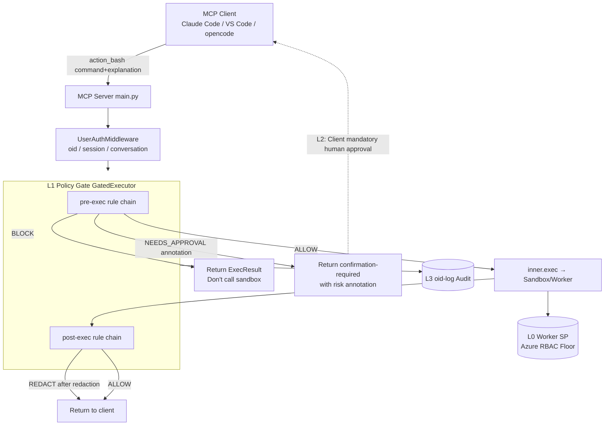

# action_bash Policy Gate and Human Approval — Design and Implementation Plan

> This document consolidates multiple rounds of discussion on adding a "policy gate + human approval" layer to `action_bash` into an actionable implementation plan.
> Related code: `src/mcp-server/main.py` (tool definition, `_exec`), `src/mcp-server/executor.py` (`Executor` protocol,
> `SessionCtx`, `ExecResult`). Related documents: [`multi-client access comparison`](../multi-client-implementation/connecting-custom-clients-to-entra-protected-mcp-principles-and-explanation.md) (client approval capabilities §10), `oid-log-tracking/` (audit).

---

## 0. TL;DR

1. **Threat model is converged**: This service is an **internal enterprise** service. All clients are pre-registered in Entra (VS Code / Claude Code / opencode).
   **"Malicious client" is out of scope.** The real threat is a **trusted client being prompt-injected**, leading to the generation of malicious/out-of-scope commands.
   → This **significantly thins the design**: we can **discard out-of-band approval, PIM, and other heavy mechanisms**, relying on "server-side gate + in-client human approval".

2. **Four-layer defense-in-depth** (each layer has its role; missing one creates a gap):

   | Layer | Mechanism | Location | Prevents | Status |
   |---|---|---|---|---|
   | L0 Floor | Worker SP Azure RBAC (diagnose=Reader / action=Contributor) | Azure | Caps blast radius | ✅ Existing |
   | L1 Policy Gate | `GatedExecutor`: pre-exec interception + post-exec redaction | MCP server | Auto-blocks obvious attacks, provides risk annotations for humans, redacts | 🔨 This plan |
   | L2 Human Approval | Tool-level mandatory approval (`requiresUserInteraction` / `eligibleForAutoApproval` / `ask`) | client (fleet-locked) | Lets a human make the final call on the command being executed | 🔨 This plan |
   | L3 Audit | oid-log user attribution | server + Azure Log | Post-incident accountability, catch what slipped through | 🔨 In progress |

3. **Two most critical insights**:
   - **Why human approval is effective against injection**: Injection compromises the "model's intent", **not the client's harness code, nor the human**.
     A trusted client will still show the approval dialog, still require a human to click approve. The injection cannot click that button. **Therefore, in-client approval is sufficient; out-of-band is unnecessary.**
   - **The gate is not optional**: Showing a raw command dialog alone can easily be tricked by an injection disguised as harmless (approval fatigue).
     **The gate's job is "auto-block obvious attacks + provide risk annotations to the human"**, making human approval meaningful. The two are complementary, not alternatives.

4. **Thinnest mandatory approval point**: Claude Code uses **server-side `_meta["anthropic/requiresUserInteraction"]=true`** (one declaration,
   automatically enforced, even `--permission-prompt-tool`'s allow is converted to deny). VS Code uses MDM-locked `eligibleForAutoApproval:false`.
   **opencode is the weak link** (no server-side enforcement, no enterprise lock, no elicitation), requiring special treatment in trade-offs.

5. **A gap that must be filled first**: `action_bash`'s `explanation` is currently only logged, **not passed into the executor**
   (`main.py:_exec` only passes `command`). To enable "intent vs command" comparison, `explanation` must first be passed down via `SessionCtx`.

6. **Don't rely on `destructiveHint`**: It is only a hint, not an approval gate. Clients are not obligated to show a dialog because of it.

---

## 1. Background and Current Status

### 1.1 Current Status of the Two Bash Tools (`src/mcp-server/main.py`)

| Tool | Parameters | Permission Boundary | Mandatory Explanation |
|---|---|---|---|
| `diagnose_bash` | `command` | Read-only (Reader) | ❌ Only command |
| `action_bash` | `command` + `explanation` | Write (Contributor) | ✅ `explanation` is required |

- `action_bash`'s `explanation` docstring requires: one sentence describing "what the command does + blast radius".
  → **This is exactly the "purpose (intent)" raw material needed for a semantic gate, and it's already a parameter.**
- **Gap**: `main.py`'s `_exec(group, command, ctx)` only passes `command` downstream. `explanation` is only used for `logger.info` in `action_bash`,
  **it does not enter `SessionCtx` / executor**. If the gate is placed at the executor layer, `explanation` is currently unavailable.

### 1.2 Seam at the Execution Layer (`src/mcp-server/executor.py`)

```
main.py.action_bash → _exec() → executor.exec(SessionCtx, command) → LocalDockerExecutor / SandboxManager
```

- `Executor` is a `Protocol` (`exec()` + `aclose()`), implemented by both Local Docker and ACA Sandbox.
- `ExecResult = {exit_code, stdout, stderr, truncated}`; `SessionCtx = {user_oid, session_id, conversation_id, group}`.
- **This is the natural insertion point for the gate**: Wrap a `GatedExecutor`, which itself implements `Executor`, making it completely transparent to `main.py`
  and completely transparent to the downstream sandbox—**purely an added layer, no changes to tool logic or sandbox.**

---

## 2. Threat Model (Boundaries of This Plan)

### 2.1 In Scope

- **Trusted client prompt injection**: The agent reads poisoned data (resource tags, pipeline output, external documents),
  and is induced to generate **malicious commands or commands with a blast radius far exceeding the stated intent** for `action_bash`.
- **Model hallucination / slip**: The model autonomously runs destructive commands.
- **Output-side leakage**: `az` commands return secrets / connection strings / tokens / PII, or the output contains secondary injection instructions.

### 2.2 Out of Scope (Excluded)

- **Malicious client**: All clients are pre-registered in Entra and under enterprise control (see multi-client document). The client software itself is not assumed to be malicious.
  → Therefore, **not needed**: out-of-band approval channels (Teams/Slack approval bot, Entra approval webpage), Azure PIM just-in-time activation, mandatory four-eyes.
  These are designed for "malicious clients" and are over-engineering under this model.

### 2.3 Why This Boundary Makes "In-Client Approval" Trustworthy Again

> **Prompt injection compromises "model intent", not "client harness", nor "human".**

The injected model **wants** to run a bad command, but the trusted client's harness will still enforce the approval gate, still require human approval. The injection cannot click that button.
Therefore, under this model, **in-client human approval = a real control**, not just UX. This is the foundation upon which the entire "thin design" rests.

**But the thin design has three prerequisites (missing any creates a gap)**:
1. **That human cannot turn off the gate** (otherwise, they might enable YOLO mode for convenience → injection flows straight through) → Approval must be fleet-locked.
2. **That human can judge the command** (otherwise, they might be tricked by an injection disguised as harmless) → Requires L1 gate auto-block + risk annotation.
3. **What the human sees = what gets executed** (prevent swap/TOCTOU) → Guaranteed by the trusted client's display + command binding at the gate side.

---

## 3. Overall Architecture



- **L2 human approval happens within the client**: The server marks `action_bash` as "requires human confirmation", the client shows a dialog, and the command is only executed after the human approves. The server side **does not need** to "interrupt the conversation"—it only ensures "no execution until approved"; interruption is the client's UX responsibility.
- **L1 gate's pre/post are both within the same `GatedExecutor`**: pre checks `command+explanation+ctx`, post checks `ExecResult`.

---

## 4. L1 Policy Gate Design

### 4.1 Abstraction: Rule / Verdict / Pipeline (Extensibility is a Hard Requirement)

Referencing Guardrails AI's `Validator` + `on_fail` shape, enabling "easy addition of rules later":

- **`Rule` (Check) Interface**, each rule declares:
  - `phase`: `PRE_EXEC` (checks command+explanation+ctx) or `POST_EXEC` (checks ExecResult)
  - `applies_to`: Applicable group (e.g., only `action`)
  - `evaluate(...) -> Verdict`
- **`Verdict` (more than just allow/block)**:
  - `ALLOW` — Allow
  - `BLOCK` — Return directly (don't call sandbox), `ExecResult(exit_code≠0, stderr="blocked by policy: …")`
  - `REDACT` — Modify output then allow (for redaction)
  - `NEEDS_APPROVAL` — Escalate to human approval, return result with risk annotation, hand off to L2
- **`Pipeline`**: Run sequentially, short-circuit on `BLOCK`, **fail-closed**
  - `action` group: Rule exception → default block
  - `diagnose` group: Can fail-open + log (read-only, low risk)
- **Rules come from configuration** (yaml/json) rather than scattered ifs; adding a rule = adding a config item + a small class.
- **Every verdict is written to audit** (reuses L3, see §6).

### 4.2 Pre-exec Rule Chain (Order: cheap, deterministic rules first; expensive semantic rules last)

> Design principle: If a rule can short-circuit early, don't call an LLM, saving latency and cost (OWASP / Arthur's pre-LLM hot path approach).

1. **Command Canonicalization / Structured Parsing (canonicalize)** — Deterministic but much stronger than regex.
   - Tokenize, expand variables, recursively parse `$(...)`, identify pipe destinations, **evaluate policy on the canonicalized tokens**.
   - Since 90% of commands here are `az`, only the `az` subcommand tree needs parsing (`az datafactory pipeline delete` vs `create-run`),
     determining read/write and blast radius based on "service + verb".
   - ⚠️ Why not pure regex: Regex checks the **raw string**, but the shell expands/unquotes/substitutes before execution.
     "The checked text ≠ the actually executed command" (GuardFall-like vulnerability). Regex should only be used for a very small set of **absolute red lines**.
2. **Red-line Regex (few, absolute)** — `rm -rf /`, fork bombs, plaintext dump of keyvault secrets, etc. Zero-tolerance items, cheap safety net.
3. **Injection / Privilege Escalation Classifier (optional, small model)** — e.g., Llama Prompt Guard 2 (22M/86M) to detect prompt-injection/jailbreak attempts.
   Note: It cannot determine if "the az command matches the explanation", only if "it looks like an injection".
4. **LLM Intent Judge (core layer)** — Small, fast model, **must do two things simultaneously**:
   - **(a) Consistency**: Does the `command` match the intent and blast radius claimed by the `explanation`?
   - **(b) Absolute Danger**: Regardless of the explanation, is this command **itself** dangerous / does it touch resources outside the scope?
   - Why (b) is necessary: An injection can **simultaneously forge a malicious command + a matching, plausible explanation**. Checking only (a) would be fooled by a self-consistent malicious pair.
   - **The judge itself must be injection-proof**: Wrap the content to be reviewed as **pure data** using delimiters, require **structured output** (return only verdict+reason,
     do not execute any instructions within it).

**Pre-exec output**: `ALLOW` / `BLOCK` / `NEEDS_APPROVAL(+risk_note)`. When `NEEDS_APPROVAL`, the `risk_note`
(e.g., "⚠️ Blast radius exceeds stated intent; batch delete; touches resources outside subscription") is returned with the result for L2 review.

### 4.3 Post-exec Rule Chain (Output-side Guardrail)

> Input side relies on semantics (LLM judges intent), **output side relies on determinism** (regex/Presidio scans for secrets)—the technology is reversed.

1. **PII / Secret Redaction** — `az keyvault secret show`, connection strings, SP secrets, access tokens, subscription IDs, emails.
   Use Microsoft Presidio (Analyzer + Anonymizer; mutation rewrite vs validation full block) or Guardrails AI DetectPII.
   Scanning for high-entropy/regex patterns for secrets on the output side is **appropriate**.
2. **Output Secondary Injection Probe** — Resource names/tags/descriptions returned by `az` might contain "ignore previous instructions…",
   scan before feeding back into the agent's context.
3. **Data Exfiltration Detection** — Abnormally large payloads, encoded blocks, outbound connections to non-whitelisted webhooks.

Post-exec output is primarily `REDACT` (redact then allow) or `BLOCK` (validation mode, block on detection).

### 4.4 Integration Points with Code

- **New**: `GatedExecutor(inner: Executor, pipeline: Pipeline)`, implementing `Executor`; `make_executor()` wraps it around
  `LocalDockerExecutor` / `SandboxManager`.
- **Pass through explanation**: Add `explanation: str | None` to `SessionCtx` (or add a parameter to `exec()`); `main.py:_exec`
  receives `explanation` from `action_bash` and puts it into `SessionCtx`. **This is a prerequisite change.**
- On `BLOCK` / `NEEDS_APPROVAL`, construct `ExecResult` and return directly, **do not call `inner.exec`**—i.e., "don't call the sandbox,
  return the answer directly to the server and then to the client."

---

## 5. L2 Human Approval (Client-side Mandatory, Fleet-locked)

### 5.1 Core Conclusion

- **A two-stage token can prove "command integrity", but cannot prove "a human was present"**: The agent that sends the token back is the same agent that received it.
  → A simple token round-trip does not constitute human approval. **The signal for human approval must be obtained by the client's harness from a real human.**
- Under this threat model (trusted client), **mandatory in-client approval = effective control** (§2.3). Based on this, select the strongest mechanism for each client.

### 5.2 Capabilities of the Three Clients (As of 2026-07, updates outdated conclusions in the multi-client document)

| Client | Elicitation | Tool-level Mandatory Approval | Can be locked so "user cannot bypass"? | Adopted Approach |
|---|---|---|---|---|
| **Claude Code** | ✅ Since v2.1.76 (can be auto-answered by Elicitation hook) | ✅ **Server `_meta["anthropic/requiresUserInteraction"]=true`** (v2.1.199+) **or** `ask` rule | ✅ managed settings + `disableBypassPermissionsMode` | **`requiresUserInteraction` (preferred, single server-side declaration)** |
| **VS Code** | ✅ Native (PR #251872) | ✅ `chat.tools.eligibleForAutoApproval:{tool:false}` | ✅ Only via **MDM/Organizational Policy** | **MDM push `eligibleForAutoApproval:false`** |
| **opencode** | ❌ Still not supported (FR #8251/#23066) | ✅ Only `permission:{tool:"ask"}` | ❌ No lock, no server-side enforcement | **Weak link**: `ask` + organizational convention; recommend using a lockable client for high-risk scenarios |

Key points:
- **`requiresUserInteraction` is the thinnest point**: Written in the **server's tool definition**, Claude Code automatically enforces it,
  even `--permission-prompt-tool`'s `allow` is converted to `deny` ("the prompt must reach a human"). Harder than client-side `ask`.
- **Do not rely on `destructiveHint`** (currently set on `action_bash`) — it's a hint, not a gate.
- **Elicitation cannot be a unified mechanism**: opencode cannot handle it; and the two clients that support it can have it bypassed by operator configuration. It can serve as a UX enhancement on supporting clients, but the hard guarantee relies on the mandatory approval + fleet locking above.

### 5.3 Configuration Examples

```jsonc
// Claude Code — Preferred: server already marks requiresUserInteraction; layer managed settings to lock it down
{
  "permissions": {
    "allow": ["mcp__dataops__diagnose_bash"],
    "ask":   ["mcp__dataops__action_bash"],
    "disableBypassPermissionsMode": "disable"
  }
}
```
```jsonc
// VS Code — Organizational / MDM push
{ "chat.tools.eligibleForAutoApproval": { "<action_bash tool id>": false } }
```
```jsonc
// opencode — Weak link, best effort
{ "permission": { "dataops_diagnose_bash": "allow", "dataops_action_bash": "ask" } }
```

On the server side (FastMCP), add to the `action_bash` tool definition:
```
_meta = {"anthropic/requiresUserInteraction": True}   # Claude Code v2.1.199+ forces human approval
```

---

## 6. L3 Audit (Reuse oid-log System)

- `main.py` already logs `user_oid / explanation / command`; attach **each L1 verdict** (rule name, verdict, risk_note)
  and **L2 approval result** to the same audit chain, forming the audit trail required by OWASP.
- Division of labor: **L1/L2 prevent**, **L3 detect**—for what approval misses or what gets through via social engineering, audit allows post-incident tracking of "who, which command, what the gate decided".
- Specific log destinations and user attribution are detailed in `docs/en/oid-log-tracking/`.

---

## 7. Phased Implementation Plan

| Phase | Task | Key Files | Output / Acceptance Criteria |
|---|---|---|---|
| **P0 Prerequisite** | Add `explanation` to `SessionCtx`; pass through `_exec`; add `requiresUserInteraction` `_meta` to `action_bash` | `main.py`, `executor.py` | explanation reaches executor; action_bash shows approval dialog every time in Claude Code |
| **P1 Skeleton** | `Rule`/`Verdict`/`Pipeline` abstraction + `GatedExecutor` wrapping `make_executor`; initially only 1–2 red-line rules + audit | New `gate/` (e.g., `gate/pipeline.py`, `gate/rules/…`) | BLOCK can return without calling sandbox; verdict enters audit |
| **P2 Pre-exec** | Command canonicalization/az parsing → Red-line regex → LLM Intent Judge (consistency + absolute danger) | `gate/rules/*` | Obvious attacks auto-BLOCK; suspicious items NEEDS_APPROVAL with risk_note |
| **P3 Post-exec** | Presidio/DetectPII redaction + output injection probe + exfiltration detection | `gate/rules/*` | Secrets/PII in stdout/stderr are redacted or blocked |
| **P4 Client Fleet** | Claude Code managed settings, VS Code MDM push; document opencode weak link trade-off in operations manual | Operations / MDM | action_bash cannot be bypassed by operator on team machines (Claude Code / VS Code) |
| **P5 Observability** | Latency budget check (judge < 1s, `MCP_EXEC_TIMEOUT=120` is sufficient); approval rate / block rate dashboard | Audit / Monitoring | Gate trigger trends are observable |

---

## 8. Residual Risks and Open Decisions

1. **opencode is the weak link**: No server-side enforcement, no enterprise lock, no elicitation.
   Decision: Should high-risk operations be restricted to only Claude Code / VS Code? Or accept opencode with just `ask` + organizational convention?
2. **Approval fatigue**: Humans might be tricked by an injection disguised as harmless into clicking approve. Mitigation relies on L1's auto-block + risk annotation,
   minimizing the "number of items a human must review" and ensuring each review is a meaningful decision. **RBAC (L0) is always the upper bound of the blast radius.**
3. **LLM judge latency / cost / self-injection risk**: The pre-filtering deterministic layer can significantly reduce calls; the judge uses structured output + pure data delimiters.
4. **The gate is defense-in-depth, not the only boundary**: The true hard floor is the worker SP's RBAC; the gate raises the bar, audit provides a safety net.
5. **Should `diagnose_bash` also have a gate?**: No explanation → cannot do intent comparison, but **output redaction (post-exec) should still apply**
   (read-only can still read secrets). Recommendation: only apply post-exec redaction + lightweight red-line rules for diagnose.

---

## 9. References

**Project Internal**
- [`multi-client access comparison §10`](../multi-client-implementation/connecting-custom-clients-to-entra-protected-mcp-principles-and-explanation.md) — Mandatory approval capabilities of each client (this plan §5 is its update)
- `docs/en/oid-log-tracking/` — Audit and user attribution
- `src/mcp-server/executor.py` / `main.py` — Gate insertion point and prerequisite changes

**External**
- [Claude Code – MCP (`anthropic/requiresUserInteraction`, elicitation)](https://code.claude.com/docs/en/mcp)
- [VS Code – Manage approvals (`eligibleForAutoApproval`, MDM)](https://code.visualstudio.com/docs/agents/approvals) · [VS Code MCP elicitation PR #251872](https://github.com/microsoft/vscode/pull/251872)
- [opencode – Permissions (allow/ask/deny)](https://opencode.ai/docs/permissions/) · elicitation FR [#8251](https://github.com/anomalyco/opencode/issues/8251) / [#23066](https://github.com/anomalyco/opencode/issues/23066)
- [OWASP – AI Agent Security Cheat Sheet (layered pipeline, separate decision from execution, fail-closed)](https://cheatsheetseries.owasp.org/cheatsheets/AI_Agent_Security_Cheat_Sheet.html)
- [Guardrails AI – Validators (Rule/on_fail abstraction)](https://guardrailsai.com/guardrails/docs/concepts/validators)
- [MCP Blog – Tool Annotations are Hints, not Gates](https://blog.modelcontextprotocol.io/posts/2026-03-16-tool-annotations/)
- [FastMCP – User Elicitation (`ctx.elicit`)](https://gofastmcp.com/servers/elicitation)
- [Microsoft Presidio – PII detection/redaction](https://microsoft.github.io/presidio/) · [Meta Llama Prompt Guard 2](https://huggingface.co/meta-llama/Llama-Prompt-Guard-2-86M)