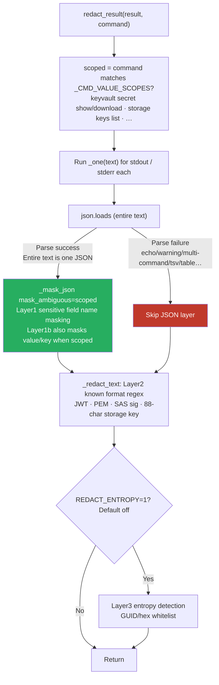
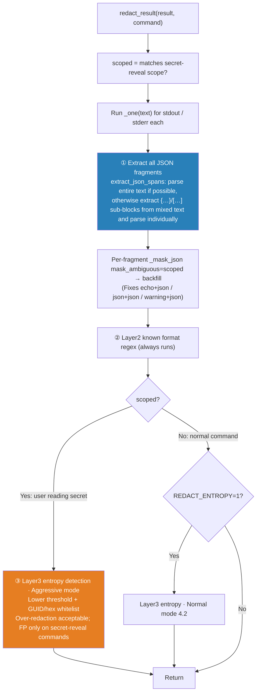
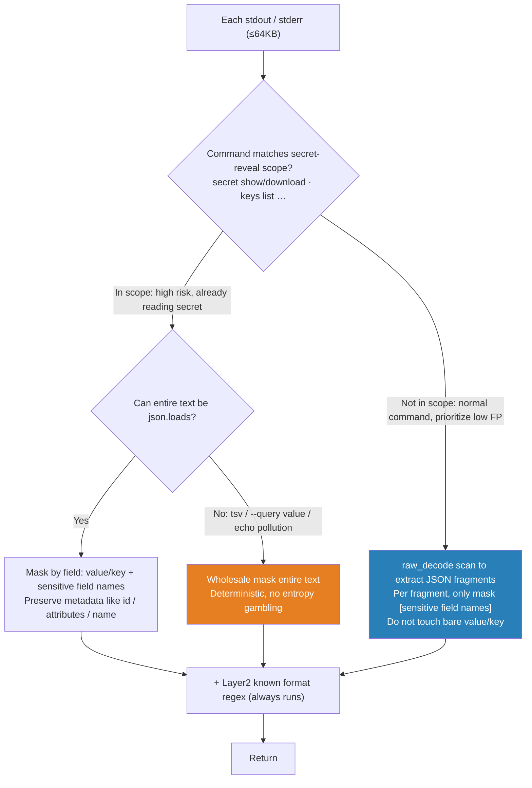

# Design: Robustness of Output Redaction for Arbitrary Bash Output

> Conclusion first: **Neither "masking by field name" nor "falling back to entropy detection" is a silver bullet.** The former requires structured output (tsv/table/`--query value` directly bypasses it), and the latter is ineffective against low-entropy secrets and causes false positives.
> This document is the **derivation process**: from falsifying the structuralist/entropy approaches (§1–§7) to the v2 attempt of "deterministic + raw_decode extraction + remove entropy" (§8). The subsequent **cognitive inflection point** — that post-hoc redaction is not a security boundary, and the boundary should be **identity least privilege** — is documented separately: [From Output Redaction to Identity Boundary — Cognitive Convergence and Layer2 Final Draft.md](from-output-redaction-to-identity-boundary-cognitive-convergence-and-layer2-final.md).

---

## 1. Bug Reproduced in Testing (2026-07-18)

The online image `mcp-server:redact-gate-1` (digest `530027c4`) **does include the redaction code and is correctly wired** (`main.py:206` unconditionally calls `redact.redact_result`). However, for the same canary secret, two commands produced opposite results:

| Command | Returned `value` |
|---|---|
| `az keyvault secret show … -o json` | **`«redacted»`** ✅ |
| `echo "marker"; az keyvault secret show … -o json` | `CANARY_SENTINEL_…` (plaintext) ❌ |

Root cause in `redact.py`'s `_one()`:

```python
try:
    parsed = json.loads(text)      # ← Parses the [entire] stdout text
except (ValueError, TypeError):
    parsed = None
if parsed is not None:
    parsed, n = _mask_json(parsed, mask_ambiguous=scoped)   # Layer1 / 1b only runs here
    text = json.dumps(parsed, ensure_ascii=False)
text, n = _redact_text(text, entropy)                       # Layer2 regex + optional Layer3 entropy
```

**The entire `text` must be a JSON that `json.loads` can parse** for Layer1/1b to run. If there's an extra `echo` line, `az` prints a WARNING, or two commands are concatenated — as long as the entire text is not valid JSON → `parsed=None` → field-name-based masking (Layer1/1b) **is entirely skipped**, leaving only Layer2 format regex as a fallback. Since the KV secret's `value` is an **arbitrary value without a fixed format**, Layer2 cannot catch it → plaintext exposure.

---

## 2. Why "Just Handling an echo Exception" Doesn't Work — The Combinatorial Explosion of Bash Output

This cannot be patched as a special case for `echo`. The same secret can be rendered in nearly infinite forms:

| # | Output Form | Structure Intact? | Which Layer Bypassed |
|---|---|---|---|
| 1 | `echo hdr; az … -o json` | JSON substring exists | Full-text parse fails → Layer1/1b skipped |
| 2 | `az … -o json; az … -o json` | Two JSONs concatenated | Full-text parse fails → Layer1/1b skipped |
| 3 | `az … --query value -o tsv` | **Gone** (bare value on one line) | All "field-based" methods fail; only content detection works |
| 4 | `az … -o table` / `-o yaml` | Field names transformed/unquoted | JSON layer + text field regex both fail |
| 5 | `az` (with WARNING/deprecation/progress on stdout) | JSON + noise | Full-text parse fails → Layer1/1b skipped |
| 6 | `echo "tok=$(az … --query value -o tsv)"` | Bare value embedded in arbitrary text | No fields, no format → only entropy remains |
| 7 | `az … -o json \| jq -r .value` | Bare value | Same as 3 |
| 8 | Multi-line secret (PEM / value with `\n`) | Escaped newlines in JSON value | Text field regex struggles with escaped quotes/newlines |

**Lesson: Output forms are infinite; enumerating exceptions or relying on "field name text regex" will never be complete.** Only **content detection** (format regex / entropy) can counter "structure loss," and each has its own hard limitations (see §4).

---

## 3. Current Branch Flow



**The red `F` node is the leak path**: non-pure JSON → field-based masking skipped → KV secret value only has Layer2, which has no known format → plaintext out.

---

## 4. What Each Method Catches / What Bypasses It (Answering "Is it stable?")

| Method | Catches | Bypassed By |
|---|---|---|
| Layer1 sensitive field names (JSON) | **Any value** of `connectionString`/`accountKey`… | Output is not pure JSON, tsv, table |
| Layer1b scoped `value`/`key` (JSON) | `value` of `secret show` | Same as above + full-text parse failure (this bug) |
| Text-level `"value":"…"` regex (**Plan a**) | `value` field in JSON | tsv/table have no field names; `--query value` has no key; value contains escaped quotes/newlines |
| Layer2 known format regex | JWT/PEM/SAS/storagekey (**format** identifiable) | **Secret without fixed format** (KV arbitrary value, weak password, internal token) |
| Layer3 entropy (**Plan b = your fallback idea**) | High-entropy random strings | **Low-entropy secrets leak**; high-entropy non-secrets **false positive** |
| **Identity least privilege** | Secret never returned from source | Requires correct configuration; **this is the real boundary** |

Empirical entropy data (`shannon()`, threshold 4.2):

| Sample | Length | Entropy | ≥4.2 → Masked? |
|---|---|---|---|
| `Zx9K2mNq…` (real storage key 44B) | 43 | 5.24 | YES |
| JWT random segment | 36 | 4.36 | YES |
| canary (this test value) | 45 | 4.49 | YES |
| **`Summer2026!` (weak password)** | 11 | **3.10** | **no — leak** |
| GUID (identifier, should be allowed) | 36 | 3.72 | no (below threshold + whitelist) |

**So "directly falling back to entropy" is unstable**: it saves random high-entropy secrets, but

1. **Low-entropy secrets still leak** (`Summer2026!`, PIN, short token, passphrase);
2. High-entropy **non**-secrets (base64 data, image digest, certificate fingerprint, some resource IDs) will be **false positives** — which is exactly why Layer3 is off by default.

And "field name text regex" (Plan a) is equally unstable: forms 3/4/6/7 (tsv, table, `--query value`, bare value embedded) have no field names to catch.

**Neither is a silver bullet.**

---

## 5. Recommendation: Defense in Depth + Confine Fallback FP Cost to Scope

Don't aim for "one layer solves all." Instead, stack layers and **limit the cost of "over-redaction" to commands where the user is explicitly reading secrets**:



Three changes:

1. **① Replace the "full-text json.loads" gate with JSON fragment extraction.** As long as the output **still has JSON structure** (echo+json, multiple json concatenated, warning line+json), Layer1/1b can be restored. This also fixes the **sensitive field name** group (not just `value`/`key`), is low cost, adds no new FP, and is **recommended for unconditional adoption**.

2. **③ Add aggressive entropy fallback for scoped commands.** Rationale: When a user runs `keyvault secret show` / `keys list`, the output **is supposed to contain secrets**. In this case, "better to over-redact" is perfectly acceptable. Confining the FP cost of entropy to **this scope** prevents it from polluting normal read-only commands. This directly adopts your intuition of "falling back to content detection," but uses scope to bound its FP side effects.

3. **② Layer2 always runs** (double insurance for format-identifiable secrets, unaffected by structural changes).

### Residual Leakage (Must Be Honestly Acknowledged)

Even so, forms 3/6 (`--query value -o tsv` producing a **low-entropy** secret, or echoing a bare value into text) **will still leak**: no structure + entropy too low = no post-hoc scrubber can solve this.

**This is not a hole that redaction can fill.** Post-hoc output redaction is inherently a best-effort **safety net**, not a security boundary.

---

## 6. The Real Boundary: Identity Least Privilege

Redaction can reduce **accidental leakage**, but it cannot stop a caller who can **shape the output**. For "preventing diagnose from reading KV secrets," the real control point is the **identity layer**:

- The diagnose SP should be a **Reader**, **without** secret get/list — i.e., the state **before** I temporarily granted it access policy on 2026-07-18 to test redaction.
- Privileged reads (secret / listKeys) should only go through the **action** path with **manual approval** (the other half of PR4).
- Redaction is a **second line** of defense for "if the action output accidentally contains a secret, try not to leak it," not the first.

> Recommendation: After testing, **revoke** the access policies temporarily added for this test (diagnose+action get/list on 3 vaults) and restore diagnose=Reader as the least-privilege posture. Otherwise, "redaction bypass" + "diagnose has secret read permission" combined is the real risk surface.

---

## 7. Pending / Next Steps

- [ ] Implement `extract_json_spans` (§5①) + scoped aggressive entropy mode (§5③), add regression test cases covering §2 forms 1–8 (**not** just one echo).
- [ ] Decide on aggressive entropy mode threshold and whitelist (GUID/hex already exist; add base64-image-digest / cert-thumbprint whitelist?).
- [ ] Review `_CMD_VALUE_SCOPES` coverage (are any `list-connection-strings` / `credential` subcommands missing?).
- [ ] Revoke temporary test access policies, restore least privilege.

---

## 8. Finalized Solution v2 (2026-07-18): Remove Entropy, Scope Determines Strategy, raw_decode Unifies Structural Masking

> This section is the **implementation finalization** converged after the §5 discussion, **replacing the "scoped aggressive entropy mode (Layer3)" half of §5**.
> However, the entropy analysis in §4/§5 is **retained above without deletion** as the rationale for "why entropy was ultimately not used."
> Core change: **Completely remove Layer 3 (entropy)**. High-risk residual gaps are covered by **deterministic scope fallback**.

### 8.1 Premise: Output Seen by Redaction is Inherently ≤ 64KB

`SandboxManager.exec()` **truncates before returning**. `main.py:_exec` receives the already truncated result, then redacts it:

```python
# sandbox_manager.py
MAX_OUTPUT_BYTES = int(os.environ.get("MAX_OUTPUT_BYTES", str(64 * 1024)))  # :51 default 64KB
stdout, t1 = _cap(result.stdout or "")                                      # :537 exec() truncates first
# main.py
result = await executor.exec(sctx, command)   # :202 already truncated
result = redact.redact_result(result, ...)    # :206 then redacts
```

Implications:

- `raw_decode` scans input ≤ 64KB (configurable via `MAX_OUTPUT_BYTES`), **performance is not an issue** (sub-ms, far less than the second-level az+network latency).
- Side effect: JSON >64KB will be cut in the middle. `raw_decode` will fail to parse the truncated object → cannot catch it (one residual leak, see §8.4).

### 8.2 Finalized Flow



### 8.3 Branch Explanation

**Top-level strategy split by scope** (`scope = command matches _CMD_VALUE_SCOPES`, i.e., `keyvault secret show/download`, `… keys list`, etc., secret-reveal commands):

- **In scope (high risk, already reading secret) — Goal: Never leak, prefer over-redaction**
  - Entire text can be `json.loads` → mask by field (mask `value`/`key` + all sensitive field names), **preserve non-sensitive metadata like `id`/`attributes`/`name`**.
  - Entire text cannot be parsed (tsv / `--query value` / echo pollution) → cannot perform surgery → **wholesale mask the entire text** (replace with a single `«redacted»` or a hint message). Deterministic, no entropy gambling; here `«redacted»` is the expected result.

- **Not in scope (normal command) — Goal: Low false positives**
  - `raw_decode` scan to extract all JSON fragments. Per fragment, **only mask [sensitive field names]** (`connectionString`/`accountKey`/`clientSecret`/`password`…), **do not touch bare `value`/`key`** (they also appear in non-secret objects like tags, list wrappers).

**Deterministic masking engine shared by both branches**:

- `raw_decode` scan = at each `{`/`[`, attempt to parse one JSON value. On success, get the exact span, mask it, and continue after it. **It naturally includes the case where "the entire text is one JSON"** (a single fragment extracted from index 0 to the end). Therefore, the §5 approach of "try json.loads first, then raw_decode" is **merged into one step**; `json.loads` can remain as a fast path for clean JSON, but is not required.
- **Layer 2 known format regex always runs** (JWT / PEM / SAS sig / 88-char storage key), independent of structure, can catch formatted secrets even in tsv.

**Layer 3 (entropy) removed**: It was already off by default (`REDACT_ENTROPY=0`), so removal has zero runtime impact. Rationale in §4 (short string blind spot `log2(18)<4.2` + high-entropy non-secret false positives + false sense of security).

### 8.4 Residual Leakage and the Real Boundary (Unchanged)

After removing entropy, the following still leak, and **no post-hoc scrubber can fix them**:

- In non-scope commands, a bare secret with neither JSON structure nor known format (e.g., `echo "tok=$(az … --query value -o tsv)"`).
- JSON tail truncated beyond 64KB.

These are handled by **identity least privilege**: the diagnose SP should be a Reader, without secret get/list; privileged reads go through an action with approval. Redaction only guarantees "structured/formatted secrets don't leak," **it is not a security boundary** (see §6).

### 8.5 Implementation Points

- [ ] `extract_json_spans(text)`: `json.JSONDecoder().raw_decode` scan, O(n), n ≤ 64KB.
- [ ] Scope fallback: in-scope and entire text unparseable → wholesale mask (covers tsv / bare value / echo pollution).
- [ ] Remove `_shannon` / `_GUID` / `_HEX` / `_TOKEN` / `REDACT_ENTROPY` related code.
- [ ] Regression test cases covering §2 forms 1–8 (not just one echo) + in-scope tsv bare value + >64KB truncation.

---

> **Cognitive inflection point →** §8 polished this scrubber to its most stable form: "deterministic + raw_decode extraction + remove entropy." But the next step was realizing: **stable doesn't matter** — as long as the caller can shape the output (hide commands from scope, rename fields to bypass field-based methods, `| base64` re-encode to bypass format regex), post-hoc redaction can be bypassed. **It is fundamentally not a security boundary.**
>
> The final architecture that emerged from this flip (**identity least privilege as the boundary**, post-exec reduced to **Layer2-only and only applied to `action_bash`**) is documented as a cognitive progression in a separate document:
>
> **→ [From Output Redaction to Identity Boundary — Cognitive Convergence and Layer2 Final Draft.md](from-output-redaction-to-identity-boundary-cognitive-convergence-and-layer2-final.md)**