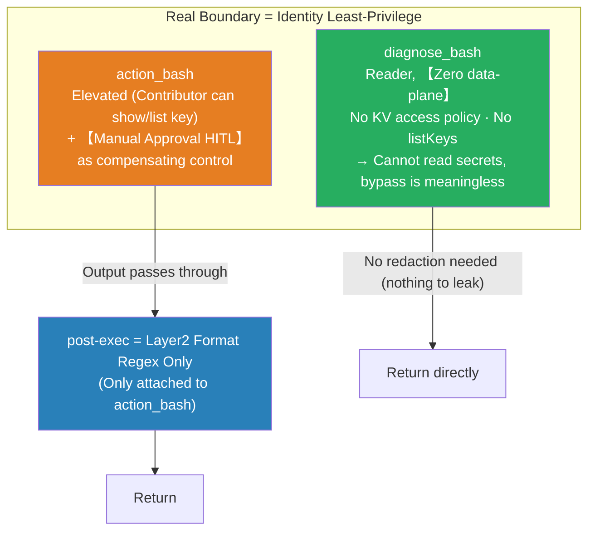

# From Output Redaction to Identity Boundary: Cognitive Convergence and Layer2 Final

> **This is a cognitive inflection point, and also the conclusion of this topic.**
>
> The previous article "[Robustness of Output Redaction for Arbitrary Bash Output](design-robustness-of-output-redaction-for-arbitrary-bash-output.md)" was continuously trying to stabilize the "post-execution output scrubber" — using `raw_decode` to extract JSON fragments, deterministic scope fallback, and removing unreliable entropy. Reaching the end of that path revealed one thing clearly: **No matter how deterministic and stable the scrubber is, it is not a security boundary** — as long as the caller can shape the output (hide commands, change field names, re-encode), post-execution redaction can be bypassed.
>
> Thus, the conclusion flipped from "how to do redaction correctly" to "**Redaction should never bear the responsibility of a boundary**": The boundary is handed over to **identity least-privilege**; redaction retreats to the **Layer2 format regex** level, a pure hygiene measure, and is only attached to `action_bash`, which actually reads secrets.

---

## 1. Two Bypasses That Broke the Structural Approach

| Bypass | Example | Why It Breaks |
|---|---|---|
| **Scope determination failure** | `svc=keyvault` `az "$svc" secret show …` | Scope performs static regex on the **command string**; the actual command is only formed after shell variable expansion. Variables / `eval` / aliases / base64 decode then run — static matching fails → scope=False → even the in-scope fallback from §8 of the previous article is not triggered. |
| **jq field renaming** | `az keyvault secret show -o json \| jq '{"value":.value,"leak":.value}'` | Even if scope hits and masking is done by field name, `leak` is a new name not in the sensitive set → the secret leaks out unchanged via `leak`. Renaming / reshaping defeats all field-based methods. |

**Conclusion: For a threat model that "can run arbitrary bash", post-execution output redaction is fundamentally unsolvable** — the adversary can hide commands (evading scope), rename fields (evading field-based methods), and re-encode values (`| base64` evading format regex). It is **hygiene, not a boundary**. This is also the classic conclusion of DLP: content filtering on an output channel controlled by an untrusted party is never a security boundary.

---

## 2. Final Architecture: Boundary at the Identity Layer, Redaction Retreats to Pure Hygiene

- **diagnose = Reader, zero data-plane.** A pure Reader (ARM `*/read`) **cannot read KV secret values** (access-policy mode requires a separate policy, RBAC mode requires Secrets User), **cannot list storage keys** (`listKeys` is a management-plane `/action`, not in `*/read`). The read step is blocked by identity, rendering the two bypasses from §1 **null** — no matter how the command is shaped, the data never returns.
  - Honest caveat: Reader ≠ completely unable to see secrets. Long-tail management-plane reads (`webapp config appsettings list`, connection strings in some resource `properties`, automation variables…) can still leak secrets to a Reader. These either require further tightening of the diagnose custom role to deny, or acceptance (low risk) — **not to be patched by redaction**.
- **action = Elevated + Approval.** The action SP is a Contributor, **can `show` / `list` keys**. The correct place for privileged reads is here: elevated + manual approval (HITL) as a compensating control.
- **post-exec redaction = Layer2 only, and only attached to action_bash.** diagnose has zero data-plane, nothing to leak, so no need to attach it; only action will actually read keys, so only Layer2 is needed to catch high-risk **formats**.
  - Why no longer do field-level value masking for action? Because action reads are **manually approved** — reading the value of a KV secret is often the **purpose** of the approval; masking it would be counterproductive. Layer2 only catches things like **account-level long-term credentials** that should not be persisted even if approved.

---

## 3. What Layer2 Actually Prevents (And Why It's Worth Keeping Separately)

Layer2 only looks at the **format of the value itself**, ignoring commands and field names → the two bypasses from §1 (scope evasion, jq renaming) **cannot defeat it**, which is precisely its value compared to field-based methods.

| Credential | Regex (Existing / To Be Added) | Why It Must Be Blocked (Even if Elevated) |
|---|---|---|
| **Storage account key** | `(?<![A-Za-z0-9+/])[A-Za-z0-9+/]{86}==` (Existing) | **Account-level, long-lived, full read/write/delete authority. Approval authorizes "performing this operation", not "pasting the account master key into the transcript / log / agent context". This type must never be echoed back, even if elevated.** |
| SAS signature | `\bsig=…` (Existing) | Portable pre-signed authorization; can be used directly upon leak |
| Inline connection string credentials | `(AccountKey\|SharedAccessKey\|Password\|pwd)=…` (Existing) | Long-lived keys embedded in connection strings |
| JWT / bearer | `eyJ…` / `bearer …` (Existing) | Tokens that can be used directly to impersonate calls |
| PEM private key | `BEGIN … PRIVATE KEY …` (Existing) | Private key itself |
| **Function key / host key** | **To be added** (~44–56 chars base64url, weak signature) | Function invocation key; **not covered by existing regex**, requires a mature rule pack (see §4) |

> Architectural hardening (root cause): Prefer **not using account keys** for storage — use `--auth-mode login` (AAD) or short-lived **user-delegation SAS** to reduce the key's exposure surface from the source. Layer2 is the last line of defense if a key is still `list`ed.

**Layer2's boundary (honest)**: Only prevents formats you have written a pattern for; `| base64` re-encoding still leaks; new secret types without fixed formats still leak. Hence it is hygiene, **the boundary is always identity**.

---

## 4. Research: Using Mature Secret-Scanning ("Git Leak") for Stronger Layer2?

Researched three mainstream tools to see if they could replace our hand-written 6 regexes:

| Tool | Mechanism | Suitability for Us |
|---|---|---|
| **gitleaks** | Rule-first, 150+ regexes (`gitleaks.toml`) + entropy as auxiliary; single Go binary, very fast, no network | Rule set is **currently the most comprehensive maintained regex collection** (includes Azure). Binary shell-out per call has latency, but **its regexes can be vendored directly into our Python Layer2** |
| **trufflehog** | 800+ detectors + **live verification** (calls provider API to confirm if key is valid), `--only-verified` near-zero FP | **Not suitable for inline**: Verification requires network round trips, and "MCP sending candidate secrets to a provider to verify liveness" is itself a side effect / leak. **Excluded** |
| **detect-secrets** (Yelp) | Python library, plugin architecture (~27 detectors), `RegexBasedDetector` base class allows custom regexes; includes optional entropy / keyword plugins | **Easiest to embed**: It's Python itself, can run its regex plugins in-process; Azure coverage is thin but can be supplemented with `RegexBasedDetector` |

(NC State research: True-positive overlap between tools is only 18–76%, no single tool covers everything → Just take their **regex rule sets**, no need for multiple tools.)

**Conclusion:**

- **Worth doing**: Use a mature rule pack **to replace / expand** the hand-written 6 Layer2 regexes → get community-maintained coverage for function keys / SAS / connection strings / cross-cloud credentials in one go.
- **How to integrate**: Prefer **detect-secrets** (Python, in-process, `RegexBasedDetector`) or **vendor gitleaks' Azure regexes**; **regex-only**.
- **Don't**: Entropy plugins (same blind spot for short strings + FP from §4 of the previous article); trufflehog's live verification (not suitable for inline).
- **Unchanged**: No matter how strong the ruleset, it is still hygiene; the boundary remains identity least-privilege.

---

## 5. Implementation To-Do (Final)

- [ ] **Lock diagnose to zero data-plane**: Remove the access policies added during this test period (diagnose's get/list on 3 vaults), restore pure Reader.
- [ ] **main.py**: `redact_result` **only called when `group == "action"`**; the diagnose branch does not attach redaction.
- [ ] **redact.py cut down to Layer2-only**: Remove Layer1/1b (`_mask_json` / `_SENSITIVE_KEY` / `_CMD_VALUE_SCOPES` / `mask_ambiguous`) and Layer3 (`_shannon` / entropy-related); keep and **expand known format regexes**.
- [ ] **Layer2 introduce rule pack**: detect-secrets or vendored gitleaks regexes, add **function key** etc.; storage key / SAS / connection string / JWT / PEM / bearer must be guaranteed.
- [ ] **Architecture**: Prefer `--auth-mode login` / user-delegation SAS for storage, reduce the echo surface of account keys.
- [ ] Regression test cases: On the action path, storage keys (including jq-renamed `leak` field, `| base64` counterexample), SAS, connection strings must be caught by Layer2; on the diagnose path, confirm it **cannot read** the key at all (Forbidden), not relying on redaction.

---

## References

- gitleaks — <https://github.com/gitleaks/gitleaks>
- trufflehog (find / verify / analyze) — <https://github.com/trufflesecurity/trufflehog>
- detect-secrets (Yelp) plugins — <https://github.com/Yelp/detect-secrets/blob/master/docs/plugins.md>
- gitleaks vs trufflehog comparison — <https://appsecsanta.com/secret-scanning-tools/gitleaks-vs-trufflehog>