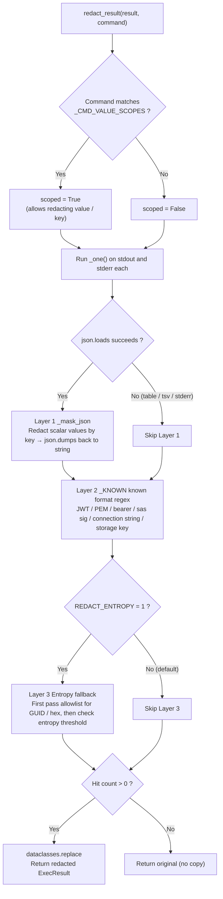
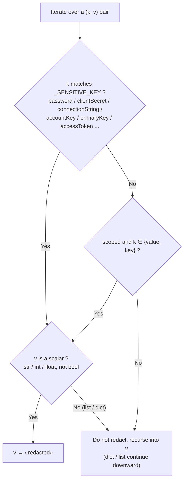

# Output Redaction Implementation Details – `redact.py` Three-Layer Logic and Examples

> This article is a deep dive into the implementation of [`Guardrail Implementation Plan`](action-bash-guardrail-implementation-output-redaction-and-client-mandatory-approval.md) §2.1: explaining `src/mcp-server/redact.py` layer by layer, with before/after examples for each layer, a flowchart, and an end-to-end walkthrough.
>
> In a nutshell: **Before each tool returns, any secret in the output is replaced in-place with `«redacted»`; everything else is left as-is.** The three layers range from precise to fallback, plus a "command scope" switch that controls the most FP-prone `value`/`key` fields.

---

## 0. Placement and General Principles

- **Placement**: In `main.py:_exec`, after `executor.exec` returns and before `return`, `result = redact.redact_result(result, command=command)`. Both `diagnose_bash` and `action_bash` go through `_exec` – **change one place, cover both tools**.
- **REDACT only**: No BLOCK, no approval, no audit. The command has already run, the secret is already in the output; the sole responsibility is to not leak it. BLOCK would discard useful output around the secret, making it too cumbersome for DataOps.
- **Pure transformation**: `ExecResult → redacted ExecResult` (frozen dataclass, new object created via `dataclasses.replace`). If no hit is found, the original object is returned as-is, without copying.
- **FP is the only real risk**: The precise layer is responsible for recall, entropy is off by default, and ambiguous key names and identifiers are explicitly excluded.

---

## 1. Overall Flow



Key point: First, check the **command** to determine `scoped` (only affects whether `value`/`key` are redacted in Layer 1). Then stdout / stderr each go through three layers, counting hits throughout; if no hits are found, the original object is returned as-is.

---

## 2. Layer 1: JSON Value Redaction by Key (`_mask_json`) – Workhorse, Highest Precision

Most `az` output is JSON. If `json.loads` succeeds, it **recursively walks the entire tree**, looking at the **field name** to decide whether to redact the value – the key is the field name, not the value shape, so **a password in any value field is also caught**.

The decision logic (this is the heart of FP control):



Two FP defense lines are in the diagram:

- **`_SENSITIVE_KEY` only contains unambiguous compound names** (`clientSecret`/`connectionString`/`accountKey`/`primaryKey`/`accessToken`…), **not** `value`/`key`/`token`/`secret` – the latter are too common in non-secret objects.
- **Only redact scalars** (`C1`) – if the value is a list/dict, do not replace it; recurse into it instead, preventing `{"value":[...]}` from being completely wiped out.

**Example (unambiguous key, independent of scoped)**: Command `az ad sp create-for-rbac` (`scoped=False`)

```
Input  {"appId":"1111","clientSecret":"Xy9~arbitrary.secret","displayName":"sp"}
      clientSecret matches _SENSITIVE_KEY → scalar → redact
Output  {"appId":"1111","clientSecret":"«redacted»","displayName":"sp"}
```

`appId` / `displayName` remain unchanged.

---

## 3. Layer 1b: Command Scope Switch (`_CMD_VALUE_SCOPES`) – Specifically for Ambiguous `value`/`key`

`value` / `key` are too common (tags are `{"key":"env","value":"prod"}`, lists are `{"value":[...]}`, storage is `{"keyName":"key1","value":"<secret>"}`). Blindly redacting them would cause breakage. Therefore, **only when the command's purpose is to output a secret** (`keyvault secret show`, `* keys list`…) is `scoped` turned on, allowing `value`/`key` to be redacted.

Matching command patterns (`_CMD_VALUE_SCOPES`):

- `az keyvault (secret|key) (show|download)`
- `az (storage account|cosmosdb|redis|servicebus|eventhubs|relay|cognitiveservices|search|batch|maps|appconfig|acr|signalr|webpubsub|iot) … (keys list|list-keys|list-connection-strings|credential|connection-string)`

**Comparison example**, same JSON, same `value` field, different commands yield different results:

```
Command az keyvault secret show ...        (scoped = True)
Input  {"id":".../secrets/db/1","value":"s3cr3t-pw","attributes":{"enabled":true}}
Output  {"id":".../secrets/db/1","value":"«redacted»","attributes":{"enabled":true}}
      ↑ value redacted (scoped on); id preserved; enabled is bool, not redacted

Command az group list                      (scoped = False)
Input  {"value":[{"name":"rg-prod","location":"eastus"}]}
Output  {"value":[{"name":"rg-prod","location":"eastus"}]}   ← Completely unchanged
      ↑ value is a list and not scoped → not redacted; recursion finds no sensitive keys
```

This is the key to "redact all output without false positives" – **the same `value` field is handled differently based on the command**.

---

## 4. Layer 2: Known Format Regex (`_KNOWN`) – Catches Non-JSON / Secrets Hidden in Ordinary Fields

Layer 1 only looks at keys. But secrets can also appear in **non-JSON output** (`-o tsv`, stderr) or **embedded within a string in a non-sensitive field** (e.g., a connection string inside a `description`). Layer 2 uses a set of **known format regexes** to catch these, each with precise spans and near-zero FP:

| Rule | What it catches | Redaction method |
|---|---|---|
| `jwt` | `eyJ….eyJ….sig` (JWT three parts) | Redact entire segment |
| `pem` | `-----BEGIN … PRIVATE KEY-----` | Redact entire segment |
| `bearer` | `Bearer <token>` | Keep `Bearer `, redact token |
| `sas_sig` | `sig=…` in SAS | Keep `sig=`, redact value |
| `conn_secret` | `AccountKey=` / `SharedAccessKey=` / `Password=` / `pwd=` in connection strings | Keep label, redact value |
| `storage_key` | 88-character base64 (storage key shape, ending with `…==`) | Redact entire segment |

Rules with `group>0` **keep the label and only redact the value**, making debugging easier (you can see what was redacted).

**Example (non-JSON, connection string)**: Command `az storage account show-connection-string`

```
Input  DefaultEndpointsProtocol=https;AccountName=acct;AccountKey=ZmFrZWtleQ==;Endpoint=x
      json.loads fails → skip Layer 1; conn_secret matches AccountKey=...
Output  DefaultEndpointsProtocol=https;AccountName=acct;AccountKey=«redacted»;Endpoint=x
      ↑ AccountName preserved, only AccountKey's value is redacted
```

> Layer 2 **also runs after Layer 1's re-serialization**: even if a connection string is hidden inside a string value of a non-sensitive JSON field (which Layer 1 wouldn't catch by key), Layer 2's regex will still catch it.

---

## 5. Layer 3: Entropy Fallback – Off by Default, Catches "Any High-Entropy String"

What the first two layers miss are **formatless, contextless high-entropy secrets** (e.g., a bare random password). Layer 3 uses Shannon entropy to scan tokens of 20+ characters. But entropy is the **only source of FP** (GUIDs, hashes, base64 data are all high entropy), so:

- **Off by default** (only enabled with `REDACT_ENTROPY=1`).
- Even when enabled, it **first passes through an allowlist**: GUIDs (subscription/tenant/resource IDs), hex/sha (git sha, image digests) are directly allowed – redacting them isn't just an FP, it would **break the agent's next step** (the next command needs that ID).
- Then it checks against the **Shannon entropy threshold** (`REDACT_ENTROPY_MIN`, default 4.2); only tokens matching `[A-Za-z0-9+/=_-]{20,}` are evaluated.
- If matched, the entire segment is redacted. **Missed high-entropy secrets are covered by L0 RBAC + L3 audit – trading FN for FP→0.**

**Example (`REDACT_ENTROPY=1`)**: Command `az ...`, a bare random password in stderr

```
Input  login failed for user; pw=9dK2jF83nDkeQ0zzXvB2mQ ; subId=12345678-1234-1234-1234-123456789abc
Output  login failed for user; pw=«redacted» ; subId=12345678-1234-1234-1234-123456789abc
      ↑ High-entropy random string redacted; GUID matches allowlist → preserved
```

> Recommendation: Keep it off by default initially. Only enable it when real false negatives appear, and pair it with detect-secrets filters (`is_potential_uuid` / `is_templated_secret` …) to further suppress FP.

---

## 6. End-to-End Walkthrough (One keyvault Command)

Command: `az keyvault secret show --vault-name v -n db` (→ `scoped=True`, `REDACT_ENTROPY` off by default)

```
stdout input:
  {"id":"https://v.vault.azure.net/secrets/db/1","value":"s3cr3t-pw-!@#","attributes":{"enabled":true}}

① scoped determination: matches _CMD_VALUE_SCOPES[keyvault secret show] → scoped = True
② _one(stdout):
   json.loads succeeds
   ├─ Layer 1 _mask_json(mask_ambiguous=True):
   │    id         → not sensitive, not value/key → recurse (string) unchanged
   │    value      → scoped and ∈{value,key} → scalar → «redacted»   (hit +1)
   │    attributes → recurse → enabled is bool → not redacted
   │    → json.dumps back to string
   ├─ Layer 2 _KNOWN: no JWT/PEM/connection string etc. → no hit
   └─ Layer 3: REDACT_ENTROPY off → skipped
   Hit count = 1
③ stderr empty → skipped
④ Hit count > 0 → dataclasses.replace

stdout output:
  {"id":"https://v.vault.azure.net/secrets/db/1","value":"«redacted»","attributes":{"enabled":true}}
```

---

## 7. FP Defense Lines & Configurable Items Summary

**FP Defense Lines** (why default configuration yields FP≈0 in practice):

1. Prioritize high-precision layers (JSON key + known format), entropy off by default.
2. Ambiguous key names `value`/`key`/`token`/`secret` are not in `_SENSITIVE_KEY`; they are only redacted within the command scope.
3. Only redact scalars, never wipe out lists/dicts.
4. Identifier allowlist (GUID / hex / sha) – not touched even when entropy is on.
5. Command scope provides precise targeting, prioritized over any blind scan.

**Environment Variables**:

| Variable | Default | Effect |
|---|---|---|
| `REDACT_ENTROPY` | `0` (off) | Whether to enable Layer 3 entropy fallback |
| `REDACT_ENTROPY_MIN` | `4.2` | Entropy threshold (higher = more conservative, fewer FP, more FN) |

**Validation**: `redact.py` comes with 8 test cases (keyvault secret show / storage keys list / group list no false positive / tag key-value preserved / connection string / clientSecret / JWT in stderr / GUID preserved), all green.

**Extension Points**: Feed gitleaks rule sets into `_KNOWN` to expand known formats; feed detect-secrets filters into Layer 3's entropy channel to suppress FP.

---

## References

- [`Guardrail Implementation Plan`](action-bash-guardrail-implementation-output-redaction-and-client-mandatory-approval.md) §2.1 – The high-level design for this article (why in-process, why not outsourced)
- `src/mcp-server/redact.py` – Implementation
- `src/mcp-server/main.py:_exec` – Placement (shared by diagnose + action)
- [detect-secrets](https://github.com/Yelp/detect-secrets) · [gitleaks](https://github.com/gitleaks/gitleaks)