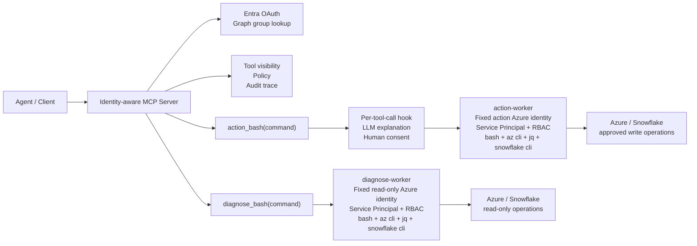

# Identity-aware Shell MCP for Azure DataOps Agents

> **Note (2026-06):** This doc describes the original **two-worker** model
> (`diagnose-worker` / `action-worker` as long-running containers). That is now
> the **local** path (`EXECUTOR=local`). The cloud path (`EXECUTOR=aca`) replaces
> the workers with per-Session Azure Container Apps Sandboxes and passwordless
> Federated Identity Credentials — see [`migrating-identity-aware-mcp-to-aca-sandboxes-plan.md`](./ACA-Redis-Implementation/migrating-identity-aware-mcp-to-aca-sandboxes-plan.md)
> and the root `README.md`.

Core judgment:

> Do not wrap all Azure CRUD operations as MCP tools.
>
> Keep `bash + az cli` as the universal execution substrate.
>
> But do not give the agent an unbounded shell directly.
>
> MCP handles identity, policy, routing, and auditing; workers handle isolated execution; skills define operational judgment.

---

## 1. Overall Architecture



---

## 2. Identity Model

The core boundary is identity-driven.

There are two types of identities in the system:

```text
User identity   = who is requesting the capability
Worker identity = which Azure identity actually executes the command
```

The user identity is obtained via Entra OAuth login. The MCP server then queries the Graph API for the user's object ID and AD groups to determine:

- Which tools the user can see
- Whether the user can call `action_bash(command)`
- Which actions require human consent
- Which user should be recorded in the audit trace

However, when the AI actually performs Azure operations, it does not use the user's own Azure permissions.

The commands are actually executed by fixed worker identities:

- `diagnose-worker` uses a read-only Service Principal, configured with only read permissions on target resources.
- `action-worker` uses a separate action Service Principal, configured with only the write permissions allowed for execution.
- Each Service Principal is scoped via Azure RBAC to a subscription / resource group / resource scope.

This design prevents a high-privilege admin user from exposing their full Azure permissions directly to the agent.

Even if an admin has permission to delete a Resource Group, the agent executing via MCP can only use the corresponding worker's Service Principal permissions.

In one sentence:

```text
User identity decides authorization and audit.
Worker identity decides Azure execution boundary.
```

---

## 3. Layer Responsibilities

### MCP Server = Control Plane

The MCP server is responsible for:

- User Entra OAuth login
- Retrieving user object ID and AD groups via Graph API
- Determining tool visibility based on groups
- Performing policy checks
- Recording audit traces / LangSmith traces
- Routing shell commands to the correct worker
- Hosting semantic workflow tools

The MCP server does not run `az cli` directly, nor does it hold a high-privilege Azure execution identity.

---

### diagnose-worker = Read-only Execution Plane

`diagnose-worker` is responsible for executing diagnostic commands:

- ADF pipeline run queries
- Activity run queries
- Log Analytics queries
- Storage metadata queries
- Snowflake query history queries
- SHIR / VM status queries
- Key Vault metadata queries

It uses a fixed read-only Azure identity, for example:

```text
diagnosis-sp
```

Even if the agent generates dangerous commands, such as:

```bash
az vm delete ...
az datafactory trigger stop ...
az storage blob delete-batch ...
```

They should fail because `diagnosis-sp` lacks the necessary RBAC permissions.

---

### action-worker = Gated Write Execution Plane

`action-worker` is responsible for executing write operations, for example:

- Rerun pipeline
- Stop / start trigger
- Restart VM
- Rotate secret
- Update config

However, it should not run commands bare. All `action_bash(command)` calls must first go through a per-tool-call hook.

---

## 4. MCP Tools

MCP does not need to expose a large number of Azure CRUD tools, such as:

```text
get_pipeline_run()
get_activity_runs()
get_vm_status()
list_storage_blobs()
```

These capabilities can be covered by `bash + az cli`.

MCP exposes two types of high-value tools.

### Shell Tools

```text
diagnose_bash(command)
action_bash(command)
```

`diagnose_bash(command)`:

- Used for read-only diagnostics
- Routed to `diagnose-worker`
- Does not require human approval
- Relies on the read-only Service Principal and RBAC to control risk

`action_bash(command)`:

- Used for write operations
- Routed to `action-worker`
- Must go through a per-tool-call hook
- Executed only after human consent

---

### Semantic Workflow Tools

These are more valuable assets worth long-term investment:

```text
collect_failure_evidence(run_id)
assess_pipeline_rerun_safety(run_id)
classify_failure_boundary(run_id)
validate_data_load_idempotency(run_id)
summarize_incident_timeline(run_id)
```

The "brain" of this type of tool resides in the MCP server, but the actual queries are still routed to the worker.

For example:

```text
collect_failure_evidence(run_id)
  -> MCP server orchestrates the workflow
  -> diagnose-worker executes az cli / snowflake cli
  -> MCP server aggregates evidence
  -> Returns structured evidence
```

---

## 5. Per-tool-call Hook

The security boundary for `action_bash(command)` should not rely on complex JSON schemas.

A simpler design is: when the MCP server calls `action_bash(command)`, it automatically triggers a pre-execution hook.

Flow:

```text
1. Receive action_bash(command)
2. Check caller identity and group permission
3. Call LLM to explain the command and likely blast radius
4. Ask human reviewer for consent
5. If approved, execute command on action-worker
6. If rejected, return rejected result
7. Record full audit trace
```

The agent only needs to pass:

```json
{
  "command": "az datafactory pipeline create-run ..."
}
```

The hook internally generates an explanation for the human, for example:

```text
This command will rerun an Azure Data Factory pipeline.
Target: daily_customer_load
Risk: may duplicate data if the previous run partially loaded downstream tables.
Approve?
```

After approval, the tool returns normally:

```json
{
  "exit_code": 0,
  "stdout": "...",
  "stderr": ""
}
```

When rejected, it returns:

```json
{
  "exit_code": null,
  "stdout": "",
  "stderr": "Action rejected by human approval hook."
}
```

The LLM is only responsible for explanation, not the final security boundary.

The real security boundaries are:

- user group permission
- MCP policy
- human consent
- worker Service Principal / Azure RBAC
- audit trace

In one sentence:

```text
LLM explains.
Human approves.
Policy enforces.
RBAC contains damage.
```

---

## 6. Skill, Tool, Worker, MCP Boundary

```text
Skill = investigation strategy and operational judgment
Semantic workflow tool = solidified high-frequency processes
Shell tool = universal command entry point
Worker = isolated execution environment
MCP = identity, policy, routing, auditing
```

For example, an ADF failure triage skill could specify:

```text
Default path:
1. Call collect_failure_evidence(run_id)
2. Review required evidence:
   - pipeline run status
   - failed activity
   - activity error message
   - linked service
   - integration runtime
   - storage output
   - Snowflake query status
   - Log Analytics errors

If confidence is high:
  produce diagnosis

If confidence is low:
  enter open investigation mode
  use diagnose_bash(command)
  only run read-only commands

Never call action_bash(command) without human consent hook.
```

---

## 7. Read / Write Routing

Simple rules:

```text
read command  -> diagnose_bash(command) -> diagnose-worker
write command -> action_bash(command)   -> approval hook -> action-worker
```

Examples:

```text
collect_failure_evidence      -> read-only -> diagnose-worker
assess_pipeline_rerun_safety  -> read-only -> diagnose-worker
rerun_pipeline                -> write     -> approval hook -> action-worker
restart_shir_vm               -> write     -> approval hook -> action-worker
```

---

## 8. Why Not Centralized Shared az login

Do not maintain a centralized shared `az login` in the MCP server.

Risks:

- Shared token cache
- Subscription context pollution
- Multi-user identity interference
- Difficult isolation for concurrent commands
- Action blast radius too large

Therefore:

> The MCP server does not run `az cli`.
>
> `az cli` only runs inside the worker container.
>
> Each worker uses a fixed Service Principal, with its permission boundary scoped by Azure RBAC.

---

## 9. Why This Is Not Over-abstracted

Over-abstraction is wrapping every Azure CRUD API as an MCP tool.

For example:

```text
get_pipeline_run()
get_activity_runs()
get_vm_status()
list_storage_blobs()
```

These will gradually be covered by:

```text
bash + az cli + strong model
```

But the value of this MCP is not a CRUD wrapper; it is an identity-aware control plane.

It addresses:

- Who can see which tool
- Which identity executes the command
- Which operations require human consent
- How to audit
- How to trace
- How to block high-risk actions
- How to encode organizational judgment into workflows

These will not disappear as models become more powerful.

---

## 10. Final Design

```text
The agent does not directly possess Azure permissions.

The agent requests capabilities through the identity-aware MCP.

MCP determines tool visibility based on the user's Entra identity and AD group.

Normal diagnostic commands are routed via diagnose_bash(command) to the read-only diagnose-worker, executed by the diagnosis Service Principal.

High-risk write commands trigger a per-tool-call hook via action_bash(command):
The LLM explains the operation; after human consent is granted, it is routed to the action-worker and executed by the action Service Principal.

Common investigation paths are solidified into semantic workflow tools.

Domain judgment is solidified into skills, policies, evals, and incident memory.
```

Core slogan:

> `az cli + bash` as execution substrate;
>
> MCP as identity / policy / routing control plane;
>
> per-tool-call hook as human approval boundary;
>
> skills as operational cognition.