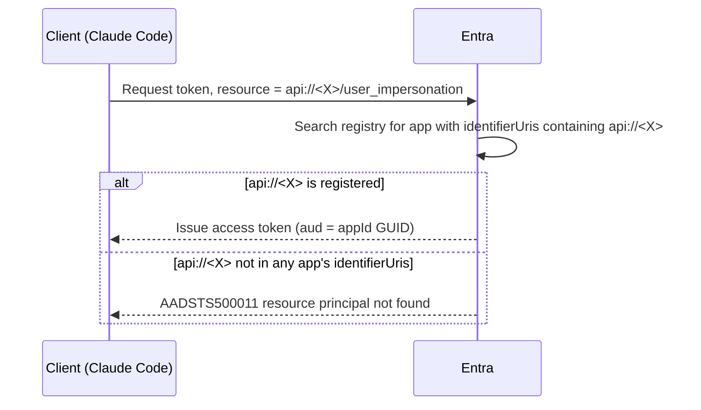

# Bug Analysis: AADSTS500011 — Missing appId Form of Application ID URI

> Symptom: Claude Code connecting to Cloud MCP (during re-authorization) reports
> `AADSTS500011: The resource principal named api://88de6a37-… was not found in the tenant`.
> Conclusion first: **It is not a code bug, nor a container deployment issue. It is that the URI used by the client to identify the resource was not registered on the Entra app registration.**
> This is a **different error** from [`AADSTS9010010`](bug-analysis-aadsts9010010-mcp-resource-parameter-collides-with-entra-v2.md) (the `resource` parameter conflicting with Entra v2).

---

## 1. What is this issue exactly

### 1.1 Two distinct identities on one app

| | What it is | Example | Who uses it |
|---|---|---|---|
| **App ID (Client ID)** | The app registration's GUID identity | `88de6a37-…` | Server validates token `aud`, OBO to exchange for Graph token |
| **Application ID URI (identifierUri)** | **The address others use to "name" this API when they want to call it** | `api://dataops-aca-mcp-server` | Client reports to Entra as the resource when requesting a token |

**These are different things**: App ID is a GUID, identifierUri is a string address. The App ID GUID does **not** automatically become an identifierUri.

### 1.2 Token acquisition mechanism: Entra performs **exact string matching** on identifierUri for the resource

When a client requests a token to call an API, it must report the API's **Application ID URI** to Entra; Entra uses this string to search the registry — whichever app registration has this URI gets the token issued for it.



### 1.3 The mismatch in this bug

- The **server (FastMCP)** broadcasts a scope constructed using the **App ID GUID**: `api://<appId>/user_impersonation` (see `mcpproxy.py:98`).
- However, the **identifierUri registered on the app** at that time was the friendly name `api://dataops-aca-mcp-server`.
- The client uses `api://<appId>` to name the resource → Entra's registry does not have this URI → **`AADSTS500011`**.

**Key point**: The SP (enterprise application) exists, the `user_impersonation` scope exists, everything is normal — **except the string the client uses to name the resource was not registered as one of this API's URIs**. It is purely a "address mismatch" lookup failure, and has **nothing to do** with what code runs in the container or which image is deployed (the error occurs during the token acquisition phase, the request never reaches the container).

> **Analogy**: The server distributes business cards saying "Send to **123 Main St**" (`api://<appId>`), but the property registry only has this building registered under "**456 Oak Ave**" (`api://friendly`). All mail sent to 123 Main St is returned "Address Not Found" — the building is fine, the door is open, just this address isn't registered. Fix: **Register 123 Main St as an alias for this building** (one app can have multiple Application ID URIs).

### 1.4 Difference from AADSTS9010010

| | Trigger | Fix |
|---|---|---|
| **9010010** | Client sends `resource` parameter per RFC 8707, conflicting with Entra v2 | `/mcpproxy` strips the `resource` parameter |
| **500011 (this article)** | The `api://<appId>` named by the client is not in the app's identifierUris | Add the `api://<appId>` URI to the app |

`/mcpproxy` cannot fix 500011 — it removes the `resource` parameter, but does not affect whether the URI in the scope exists.

### 1.5 Current status

**Solution A (temporary patch, 2026-07-18)**: After post-deploy adding back `api://<appId>`, the app's `identifierUris` became `["api://88de6a37-…"]`, and Claude Code Cloud MCP re-authorization succeeded. Disadvantage see §2.2 (silent recurrence on converge).

**Solution B (permanent fix, implemented on branch `fix-identify-uri-overwrite`)**: Change the server to broadcast the **friendly name** `api://<name>-mcp-server` as the scope prefix, making the `identifierUris` declared by Bicep the single source of truth, **removing the post-deploy alias step**. Changes detailed in §3.1 (6 locations all implemented + Bicep side adds `mcpIdentifierUri` output/env to feed the value to the server).

**Deployed and verified (2026-07-18)**: `az acr build` new image `mcp-server:identifier-uri-fix` → `az deployment sub create` converge (`name=dataops-aca`, `resourceGroupName=dataops-aca-rg`, `mcpClientSecret` taken from live, not reset) → Succeeded. Verification results:
- App's `identifierUris` changed from `["api://88de6a37-…"]` **converged to `["api://dataops-aca-mcp-server"]`** (identity.bicep Graph).
- Container rolled to new image, env `MCP_IDENTIFIER_URI=api://dataops-aca-mcp-server`, OBO secret not reset (length 40, not placeholder).
- `/mcp` and `/mcpproxy` protected-resource metadata `scopes_supported` are both `["api://dataops-aca-mcp-server/user_impersonation"]` — **the broadcast scope is now consistent with the app's registered identifierUri** (precisely the alignment missing for 500011). `/health` ok.
- Remaining: A real user performs an interactive login in Claude Code after clearing auth for end-to-end confirmation (metadata and identifierUri are aligned, theoretically no more 500011).

---

## 2. Why a separate command must be run post-deployment

### 2.1 Root cause: Bicep cannot declare `api://<appId>` (chicken-and-egg problem)

The GUID in `api://<appId>` is generated **after** the app is created. At the moment Bicep creates the app, it **cannot reference its own appId which doesn't exist yet** (circular dependency). Therefore, `identity.bicep` can only use a **static friendly name**:

```bicep
// identity.bicep — can only set a static URI, cannot reference its own appId
identifierUris: [
  'api://${name}-mcp-server'   // = api://dataops-aca-mcp-server
]
```

Since FastMCP broadcasts the scope using the **App ID form**, the URI `api://<appId>` needed by the client **cannot be declaratively set by Bicep**. It must be added **after deployment**, once the appId exists, via a separate command:

```bash
# write-env.sh — post-deploy add api://<appId> (otherwise sign-in → AADSTS500011)
az ad app update --id "$mcp_app_id" --identifier-uris "api://${mcp_app_id}"
```

**This is "why a separate command must be run post-deployment"**: not because it's too lazy to write into bicep, but because bicep **structurally cannot** write a value that depends on its own GUID.

### 2.2 Worse: It is a **silently recurring** drift

`az ad app update --identifier-uris` is **overwriting** (replaces the entire array, not appending). And `main.bicep` runs `identity.bicep` on every **converge deployment**, **resetting** `identifierUris` back to only the friendly name, silently wiping out the `api://<appId>` added post-deploy.

Even more insidious: **Microsoft.Graph resources are Unsupported/invisible in `az deployment what-if`**, so this reset is **completely invisible** in what-if (it gets lumped into the pile of "Unsupported" items).

**Timeline (this incident)**:
1. A previous write-env.sh added `api://<appId>` → client could connect.
2. A `main.bicep` converge deployment ran the identity module → `identifierUris` was reset to only `api://dataops-aca-mcp-server`, silently losing the appId form.
3. Old cached tokens still worked → no one noticed.
4. Cleared auth in Claude Code, forced re-authorization → hit 500011.

> Therefore, this post-deploy command is **not one-time**, but "**must be re-run after every converge**". The [deployment documentation](../oid-log-tracking/deployment-document-full-aca-stack-deployment-from-main-bicep.md) only mentioned this in §8 cold deployment appendix, not in §4 converge flow / §7 drift checklist — a gap in that doc (it protected against similar drift for OBO secrets but missed identifierUri).

---

## 3. From the code perspective: What exactly to change to use the friendly name

**Goal**: Make the server broadcast `api://dataops-aca-mcp-server/user_impersonation` (the one Bicep can declaratively own). This **eliminates the drift permanently** — bicep is the single source of truth, no more post-deploy alias needed.

### 3.1 Locations to change

| # | File / Location | Current | Change to |
|---|---|---|---|
| 1 | `mcpproxy.py:98` | `api_scope = f"api://{mcp_app_id}/user_impersonation"` | Read friendly name, e.g., `api_scope = f"{IDENTIFIER_URI}/user_impersonation"` |
| 2 | `main.py` `/mcp` direct path | `AzureJWTVerifier(client_id=MCP_APP_ID, required_scopes=["user_impersonation"])` broadcasts resource internally by FastMCP using `api://<client_id>` | **Confirmed FastMCP natively supports**: `AzureJWTVerifier(..., identifier_uri=IDENTIFIER_URI)`. Its `scopes_supported` property uses `identifier_uri` to construct the prefix (into `/mcp` protected-resource metadata), while `audience=[client_id, identifier_uri]` — **the GUID form of `aud` still passes validation** (exactly §3.2), no library-level customization needed |
| 3 | Server config | None | Add new env, e.g., `MCP_IDENTIFIER_URI=api://dataops-aca-mcp-server`, feed to 1, 2 |
| 4 | `opencode.json` | Hardcoded `"scope": "api://88de6a37-…/user_impersonation"` | Change to `api://dataops-aca-mcp-server/user_impersonation` |
| 5 | `tests/e2e_deployed.py` | `SCOPES = [f"api://{MCP_APP_ID}/user_impersonation"]` | Change to friendly name |
| 6 | write-env.sh | Post-deploy add `api://<appId>` | **Remove this step** (no longer needed; bicep's friendly name is the truth) |

> **Discovering** clients (Claude Code / VS Code) will **automatically follow the server's new broadcast scope**, no changes needed; only places where the scope is **hardcoded** (opencode, e2e) need manual changes.

### 3.2 A common point of confusion: Changing the scope **does not affect token validation**

Will "changing the scope cause the server to reject the token"? **No**:

- **identifierUri is only used in the "client names the resource" step**, determining if Entra can find this API.
- **Once the token is issued, its `aud` is the App ID GUID** (v2 token), regardless of which URI the client used to name the resource.
- The server's `AzureJWTVerifier(client_id=MCP_APP_ID)` validates this GUID.

So whether the client reports `api://<appId>` or `api://friendly`, the `aud` in the token issued by Entra is the same GUID, and `client_id=MCP_APP_ID` remains unchanged, accepting it as is. **Changing the scope only changes the "address used for naming", not the "door number verification".**

### 3.3 Two self-consistent paths (trade-off)

| | Approach | Cost | Drift |
|---|---|---|---|
| **A (old temporary patch)** | Code uses App ID, post-deploy add alias | One command, but **must be re-run after every converge** | Silently recurring, relies on discipline |
| **B (adopted ✅)** | Code uses friendly name, bicep declaratively owns it | Change the 6 locations in §3.1 + re-verify once | **Structurally eliminated** |

**B was chosen**: The six changes in §3.1 + Bicep side `mcpIdentifierUri` output/env are all implemented (branch `fix-identify-uri-overwrite`), the alias step in write-env.sh has been removed. The only remaining task is to run the verification in §1.5 after redeployment.

---

## 4. Why this post-deploy command can change the app's behavior and fix the bug

```bash
az ad app update --id 88de6a37-… --identifier-uris "api://88de6a37-…"
```

### 4.1 It modifies the **Entra app registration**, which is exactly the object the token request is resolved against

500011 occurs during the **Entra resource resolution** step (§1.2 sequence): Entra takes the `api://<appId>` reported by the client and tries to match it against an app's identifierUris.

This command **writes `api://<appId>` into this app's identifierUris**. So the next time the client reports `api://<appId>/user_impersonation`:

- Entra **can find** the app corresponding to this URI in the registry (which is `88de6a37`) → resolution succeeds → issues token (`aud` = appId GUID) → **no more 500011**.

**Why no need to redeploy code/containers**: Because the bug was never in the container. The token request was rejected by Entra **before reaching the container** (500011). The fix modifies the **registration metadata** on the Entra side, not the server code or image. So the change takes effect immediately (the next token request can be resolved), and there is no need to touch the Container App.

### 4.2 Idempotent, immediate, but **not persistent across converge**

- **Idempotent**: If the URI is already present, no change occurs; safe to re-run.
- **Immediate**: Once Entra metadata is updated, the next authorization works (no need to wait for image roll).
- **⚠️ Not persistent**: As per §2.2, it **overwrites** identifierUris, and the next `main.bicep` converge will reset it back to the friendly name. So it is a "**patch to re-apply after every converge**", not a "one-time permanent fix". For a permanent fix, use Solution B in §3.

---

## 5. One-sentence summary

- **What it is**: The `api://<appId>` used by the client to name the resource was not registered in the app's identifierUris → Entra cannot find the resource → 500011. Unrelated to containers/code/images.
- **Why a post-deploy command is needed**: Bicep cannot reference its own appId which hasn't been generated yet, so it cannot declare `api://<appId>`; it must be added after deployment. And every converge silently wipes it out, requiring re-application.
- **Code change to friendly name**: Modify `mcpproxy.py` + `/mcp` path broadcast + feed server a `MCP_IDENTIFIER_URI` + change hardcoded scopes in opencode/e2e + remove the write-env step; token validation is unaffected.
- **Why that command fixes it**: It modifies the Entra app registration (the object against which token requests are resolved), registering `api://<appId>` so Entra can resolve it and issue a token; takes effect immediately, no redeployment needed, but will be wiped out by the next converge.

## References
- Companion article: [`Bug-Analysis-AADSTS9010010`](bug-analysis-aadsts9010010-mcp-resource-parameter-collides-with-entra-v2.md)
- Drift context: [`Deployment-Document-Full-ACA-Stack-Deployment-from-main.bicep`](../oid-log-tracking/deployment-document-full-aca-stack-deployment-from-main-bicep.md) §7/§8
- Code: `src/mcp-server/mcpproxy.py`, `main.py`; `provisioning/aca/modules/identity.bicep`, `write-env.sh`