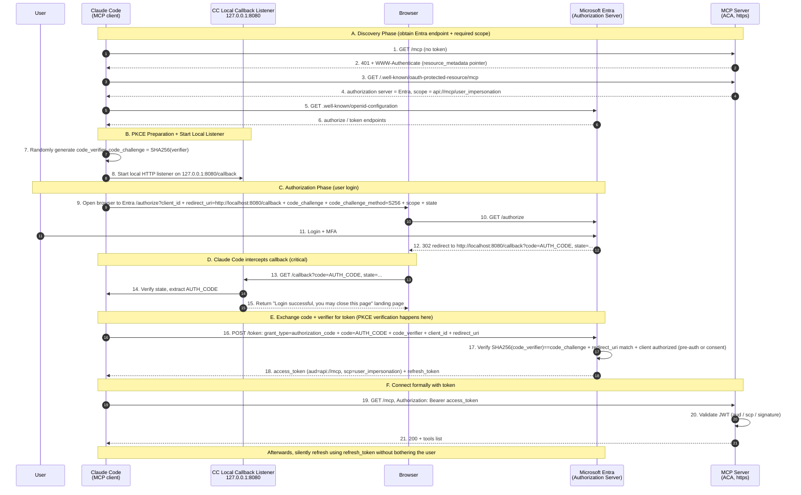

# Connecting Custom Clients to Entra-Protected MCP (Principles and Explanation)

> This is the **principles / explanation** article: it explains **every "why"** behind "how a custom client connects to an Entra-protected MCP via OAuth."
> For **concrete implementation** (registering the client, writing three `mcp.json` files, modifying bicep, verification), see the companion **implementation article**
> [`implementation-pre-register-shared-client-project-level-access.md`](./implementation-pre-register-shared-client-project-level-access.md).
>
> This article answers these questions:
> 1. Currently only VS Code can connect automatically. If you want to switch to **another client (e.g., Claude Code)**, why can't you just "make up an id/secret"?
> 2. How exactly does OAuth for a client like Claude Code complete with the MCP server? Why is the redirect URI localhost,
>    and does this still hold when the MCP server is deployed on ACA? (Section 3)
> 3. Why is **no client secret needed**? What is PKCE? (Section 4)
> 4. After the user logs in, **why can they get an authorization code**? What does the MCP server do? Is it RBAC? (Section 5)
> 5. What happens if you **don't pre-authorize** in Bicep? Can you make it work **without modifying the MCP server's app registration**? (Section 6)
> 6. What is the support status for **opencode / Copilot CLI / Codex**? (Sections 7–9)
> 7. Can you force a specific tool (`action_bash`) to **always require manual approval and never be bypassed**? (Section 10)
>
> For earlier background, see [`DataOps-MCP-login-and-consent-flow-breakdown.md`](../DataOps-MCP-login-and-consent-flow-breakdown.md) (login/consent three gates) and
> [`Entra OAuth Proxy vs Pre-registration MCP.md`](../Entra%20OAuth%20Proxy%20vs%20Pre-registration%20MCP.md) (DCR proxy vs pre-registration).

---

## One-Sentence Summary

- **You can switch clients**, but it's not "just make up an id/secret and stuff it into the config" — **Entra does not support DCR**. A real client must be **pre-registered/pre-authorized in Entra** (pre-registration mode). It's isomorphic to VS Code: register a client app → pre-authorize (or consent) → fill `client_id` into the client configuration.
- **No secret is needed**: Claude Code / opencode / VS Code are all **desktop/CLI-type public clients**. A secret cannot be kept confidential on a program installed on a user's machine, so it's effectively useless. "Proving you are you" relies on **that one Entra login in the browser (including MFA)**. "Preventing the authorization code from being stolen" relies on **PKCE**.
- **Client support varies significantly** (as of 2026-07):

  | Client | Static client_id Support | Can Connect to Entra-Protected MCP |
  |---|---|---|
  | **Claude Code** | ✅ First-class citizen | ✅ Works now |
  | **opencode** | ✅ Supported (DCR is only a fallback) | ✅ Works now |
  | **GitHub Copilot CLI** | ⚠️ Field exists but bug unfixed | ❌ Currently not working |
  | **Codex CLI** | ❌ No static client_id | ❌ Currently not working |

---

## 1. Background: Why "Only VS Code Can Connect Automatically" Right Now

This MCP server uses the **pre-registration / pre-authorized client** model (not the OAuth Proxy model): Entra directly acts as the authorization server and directly issues the client an access token for accessing the MCP server.

VS Code works with "zero configuration" due to two combined factors:

1. **VS Code itself is a first-party public client known to Entra**, with a publicly fixed client id of
   `aebc6443-996d-45c2-90f0-388ff96faa56`.
2. In `provisioning/aca/modules/identity.bicep`, this id is written into the MCP server app's
   `preAuthorizedApplications` (corresponding to **Gate ②** of the login flow, eliminating the consent popup).

The core contradiction (the root cause of everything that follows):

> **Microsoft Entra does not support Dynamic Client Registration (DCR) in the way MCP requires.**

Therefore, a client **cannot dynamically register with Entra on the fly**; it can only use a client id that Entra **already knows**. VS Code's id is built-in by Microsoft; to switch to another client, **you must register one yourself in Entra**.

---

## 2. Switching Clients: Conclusion + Two Corrections

**Conclusion: Yes, you can. This is exactly the design intent of the pre-registration model** — a custom client is just "another known client you registered/pre-authorized," with the same status as VS Code. Both Claude Code and opencode officially support the scenario where "the auth server does not support DCR and requires pre-configured credentials."

Two points to correct:

1. **client_id cannot be made up arbitrarily** — it must be the **appId of a new client app registration you create in Entra**. Entra has no DCR and will not recognize an unregistered client.
2. **The secret is not placed in the configuration file, and most likely is not needed at all**. Desktop/CLI-type public clients use Authorization Code + **PKCE** and do not need a client secret (see Section 4 for principles).

---

## 3. OAuth Full Picture: Sequence Diagram, Callback, Redirect URI, and Port

### 3.1 Sequence Diagram

The entire chain for a **local client** like Claude Code to complete OAuth with the MCP server. Focus on
**② Discovery 401 → ⑫ Entra's 302 redirect → ⑬–⑮ Local callback interception → ⑯ Exchanging code+verifier for token**:



### 3.2 How Claude Code Handles the Callback (Steps 8, 13–15, 16)

How a **local CLI program** "intercepts" the login result from the browser:

1. **Start listener before OAuth begins** (Step 8): Claude Code starts a **temporary HTTP service** locally, listening on
   `127.0.0.1:<callbackPort>` (default random port, can be pinned to 8080 using `--callback-port`). It only exists to receive one callback and shuts down immediately after.
2. **Calculate PKCE simultaneously** (Step 7): Locally randomly generate `code_verifier` (stored only in memory, never sent out), calculate
   `code_challenge = SHA256(code_verifier)`, and only put `code_challenge` into `/authorize`.
3. **Entra uses 302 to send code back locally** (Steps 12–13): After the user successfully logs in, Entra returns a **302 redirect**, causing the browser to
   navigate to `http://localhost:8080/callback?code=AUTH_CODE...`. The browser redirects, and the authorization code lands as a URL
   query on that local listener.
4. **Extract code, verify state, return landing page** (Steps 14–15): Claude Code reads `code` from the callback URL, verifies `state`
   (CSRF prevention), and returns a "Login successful, you may close this page" response to the browser.
5. **Exchange code + verifier for token** (Steps 16–18): Sends `code` and the **memory-only** `code_verifier` to Entra
   `/token`. Entra verifies `SHA256(code_verifier) == code_challenge`, `redirect_uri` match, and client authorization —
   only if all pass does it issue an **access token** (+ refresh token). Even if another program on the same machine steals `code`, without `code_verifier` it cannot exchange it for a token.
6. Only then does it formally connect to `/mcp` with `Authorization: Bearer <token>` (Step 19). The token goes into the system keychain and is silently refreshed using the refresh token.

### 3.3 What is the redirect URI? Why localhost? Does it still hold when the MCP server is on ACA?

- **The redirect URI (reply URL) = where the authorization server (Entra) sends the authorization code after the user logs in.**
  It is **an attribute of the client, unrelated to the MCP server / resource server**.
- **Who receives this redirect? The client that initiated OAuth.** Claude Code is a desktop/CLI program **running on your local machine**. It receives the code by starting a loopback listener locally — hence the redirect URI is `http://localhost:PORT/callback`. This is
  standard practice for native apps (**RFC 8252, OAuth for Native Apps**).
- **This is completely unrelated to where the MCP server is deployed.** Look at the C→D segment of the sequence diagram: the entire redirect happens **between your local browser → your local Claude Code listener** (Entra → Browser → localhost), **never passing through the MCP server on ACA**. The MCP server
  is only accessed with a Bearer token at the very last step (Step 19), **never participating in the redirect**.
- **Therefore, localhost is completely correct and should indeed be used.** Even if the MCP server is on ACA, on the other side of the world, as long as Claude Code
  runs on your local machine, the redirect should go back to the local loopback. You **should not** fill the redirect URI with the MCP server's ACA address — that is not where the code is received.
- **When is the redirect URI a public internet address?** When the client itself is a **server-side web app** (confidential client),
  after login, Entra needs to send the code to that web app's public callback. Claude Code is not a web app, so it uses loopback.
- **Why must the redirect URI be pre-registered:** It is the destination where Entra delivers the code. **Entra only sends the code to redirect URIs registered in the app
  registration**; any unregistered URI is rejected outright. This is a critical control to prevent code interception, forming a double insurance with PKCE.

### 3.4 Only One Port; Don't Get Confused by "Two 8080s"; What if the Port is Occupied?

**The "first callback port" and the "second callback port" are actually the same port, just appearing in two places, and they must be equal:**

| Appearance Location | Role |
|---|---|
| Step 8: Local HTTP listener started on `127.0.0.1:8080` | Local service to **receive** the authorization code |
| Step 9 / Redirect URI registered in Entra `http://localhost:8080/callback` | Tells Entra **where to send the code** |

`--callback-port 8080` (or `oauth.callbackPort: 8080`) **sets both at once**: the listener binds to 8080, and the redirect_uri
also uses 8080. **So "locked to one port" = exactly what `--callback-port` does; there is only one port to begin with.**

**What if the port is occupied** (your concern is valid: pin to 8080 but 8080 is occupied → Step 8 binding fails → OAuth fails). Two approaches:

- **Method A: Pin an uncommon port** (e.g., `8765`). Register `http://localhost:8765/callback` and the client in Entra.
  `--callback-port 8765`. Simple and deterministic.
- **Method B: Don't pin the port; rely on Entra's localhost port-agnostic matching.** Microsoft officially states: *"The login server
  cannot distinguish between redirect URIs when only the port differs"*, and allows registering `http://localhost`、
  `http://localhost:3000/abc`（*paths and ports are okay*) — meaning **Entra ignores the port when matching localhost redirects and only checks the path**. Thus, the client randomly picks a free port, and as long as the **path (`/callback`) matches**, Entra still allows it, naturally avoiding port conflicts.
  - Cost: The path **must** match (path is strictly matched, port is not). Claude Code's path is fixed as `/callback`;
    opencode's path needs actual testing.
- Clients without a fixed port field (like opencode) **can only use Method B**.

> For which method this project chooses and how to register, see Implementation Article §3.

---

## 4. Why Public Clients Don't Need a Client Secret (Including PKCE)

The easiest point to get confused about. Core concept: **`client_secret` authenticates not "you (the user)," but "the client application."** "How do I prove I am me without a secret" actually conflates two identities into one.

### 4.1 Two Different Identities

| Identity to Prove | How It's Proven |
|---|---|
| **You are you** (user identity) | **Logging into Entra in the browser** (account password + MFA) |
| **This app is the app it claims to be** (client identity) | Confidential client uses a secret; public client does not |

"Authenticating I am me" never relies on a secret, but on that one **interactive Entra login**. The secret only solves "is the program sending the request really that client," unrelated to who you are as a person.

### 4.2 Confidential Client vs Public Client

Whether a secret is meaningful depends on whether it **can truly be kept confidential**:

- **Confidential client** (running on a server backend): The secret is stored only on the backend, inaccessible to users → the secret is meaningful.
- **Public client** (desktop app, CLI, mobile app, SPA): The program is **installed on each user's machine**. Packaging a secret into the program and distributing it to everyone = visible to everyone = extracted in one second = **equivalent to having no secret**.

Therefore, OAuth explicitly stipulates that public clients **should not rely on secrets**. VS Code's client id is openly hardcoded in the source code because
**the client id is not a secret to begin with**; it's just a name.

### 4.3 What is PKCE, and How Does It Replace the Secret?

> **PKCE = Proof Key for Code Exchange** (RFC 7636, pronounced "pixy"), is an **extension** to the OAuth authorization code flow,
> specifically designed to prevent "the authorization code from being intercepted and misused mid-stream."
>
> Note the direction: **PKCE is not a part of code_challenge; on the contrary, code_challenge is a component of PKCE.**
> PKCE consists of three elements:
> - `code_verifier`: A **one-time secret randomly generated by the client for each flow**, kept only in local memory, never sent out;
> - `code_challenge`: The hash of `code_verifier` (`SHA256`), **only this** is sent to Entra;
> - `code_challenge_method`: The hash algorithm identifier, typically `S256`.
>
> Intuition: `code_verifier` is the "key," `code_challenge` is the "lock" first given to Entra. `/authorize` shows the lock; `/token`
> must present the key when exchanging for a token. Entra verifies `SHA256(key) == lock` before granting access.

The original role of the secret in the authorization code flow is "prove it's me exchanging the token." Public clients use PKCE as a replacement — this "lock + key" mechanism:

```text
1. Locally randomly generate code_verifier (only in memory, never sent out)
2. During /authorize, only send its hash code_challenge = SHA256(code_verifier)
3. User logs in successfully, Entra sends authorization code back to http://localhost:8080/callback
4. When exchanging for token, client must attach the original code_verifier
5. Entra verifies SHA256(code_verifier) == code_challenge, issues token only if they match
```

Effect: Even if another program on the same machine intercepts the code, it **does not have code_verifier and cannot exchange it for a token**; and code_verifier never left the initiating process from start to finish. This replaces "secret protects code exchange" with "a one-time credential dynamically generated each time, never leaked," **requiring no pre-distribution**, naturally immune to extraction. Layered with **redirect URI must be pre-registered** + loopback only on the local machine, the code only returns to the local app that initiated the flow.

### 4.4 Summary

> **Your personal identity = that one Entra login in the browser (including MFA);**
> **The client's identity = client_id (public name) + PKCE (one-time dynamic credential) + pre-registered redirect URI.**

The obtained access token contains `oid` (you), `aud` (your MCP server), `azp` (which client). The MCP server only
validates `aud` + `scp` + signature — **it doesn't care at all whether the client originally used a secret**.

---

## 5. Why Can You Get an Authorization Code After Login? What Does the MCP Server Do? Is It RBAC?

The easiest point to misunderstand: **The authorization code is issued by Entra (the authorization server), not by the MCP server.**

### 5.1 Entra Issues the Code; the MCP Server Does Not Participate at This Step

Look at the Section 3 sequence diagram: `/authorize` → login → 302 with code, the entire process is between **Browser ↔ Entra**. **The MCP server is not called even once during the entire authorize / token exchange.** It only appears at two ends:

- **At the very beginning** (Steps 1–2): Returns `401 + WWW-Authenticate`, telling the client "go to Entra, ask for this scope."
- **At the very end** (Steps 19–20): Receives the Bearer token, **validates the JWT** (`aud` / `scp` / signature / issuer).

Whether a code is issued in the middle, and to whom, **is not up to the MCP server; Entra decides.**

### 5.2 Why Does Entra Issue a Code After Login? Two Gates, Both in Entra

1. **Authentication (authN, "Who are you")**: The user successfully logs into Entra (+ MFA).
2. **Authorization (authZ, "Is this client allowed to request this scope")**: Entra checks whether this client is permitted for
   `api://<mcp>/user_impersonation` — **either pre-authorized, or has a consent grant** (see Section 6).

Only if both pass does Entra send the code to the client's redirect URI. **This has nothing to do with the MCP server; the MCP server is not the one granting passage.**

### 5.3 Is This RBAC? — No

- **Issuing code / issuing token**: Entra's authN + client authZ, **not RBAC**.
- **MCP server's "who can use which tool"**: That happens **after** token validation, at **runtime** — the MCP server uses
  **OBO** to exchange the user token for a Graph token, queries the user's **AD group** membership, and decides tool visibility (see
  [`mcp_discussion.md`](../mcp_discussion.md) §2/§3). This is **group-based tool gating**, closest to "RBAC," but occurs
  **after obtaining the token**, and is a completely different matter from "issuing the code."
- **Azure RBAC**: Only acts as the resource permission boundary when the **worker Service Principal** executes `az` commands, completely unrelated to user login/code issuance.

> In one sentence: **Being able to get a code after login is Entra completing "authentication + client authorization"; the MCP server only handles sending the 401 direction at the start and validating the token at the end. Tool-level group gating is done by the MCP server at runtime using OBO+Graph; that touches on RBAC, but is not on the code issuance chain.**

---

## 6. What is Pre-authorization? What Happens Without It? Can You Avoid Modifying the Server App?

### 6.1 The Role of Pre-authorization (Gate ②)

Pre-authorization is written in the **MCP server app's** `preAuthorizedApplications`. Its sole purpose is to **eliminate the consent popup**:
You (the API owner) pre-consent on behalf of a trusted client, so Entra directly issues a token with zero consent interaction.

### 6.2 What Happens Without Pre-authorization

Without it, OAuth **technically still works**. The only difference is during the first login:

| Tenant user-consent setting | Result without pre-auth |
|---|---|
| User self-service consent allowed | User sees a consent popup once on first login → clicks "Accept" → a per-user grant is recorded → no more popups thereafter |
| **User consent disabled** (many enterprise tenants) | User cannot click, sees "Requires admin approval" → stuck, requires **admin consent once** |

This project's `user_impersonation` scope in `identity.bicep` is `type: 'User'` (with userConsent text),
**a low-privilege scope eligible for user self-service consent** — as long as the tenant hasn't disabled user consent, not pre-authorizing just means "one extra click the first time."

### 6.3 Can You Completely Avoid Modifying the MCP Server's App Registration? — Yes

Key distinction: **Pre-authorization modifies the server app; but there is another path for the client to obtain the scope — consent grant, which does not modify the server app's definition.** To make the client work, the minimum required is:

1. Create a new **client app registration** + redirect URI + `allowPublicClient` (a brand new object, **does not touch the server app**);
2. Add API permission on the **client app**: the server's `user_impersonation` delegated scope (modifies the **client
   app**, not the server app);
3. **Consent**: User clicks "Accept" on first use (generates a per-user grant) **or** admin consents once (generates a grant object)
   — the grant is an **independent object, not an edit to the server app registration definition**.

> **Conclusion: You can make it work without modifying the MCP server's app registration** — provided **consent can be obtained** (tenant allows user self-service consent, or an admin is willing to consent once). **Pre-authorization is just an optimization to save that one consent click, not a functional necessity.**

When is it **unavoidable** to touch the server app (add pre-auth)? Only when **the tenant has disabled user consent and it's inconvenient to do individual admin consents**, and you want to use "server-side pre-authorization" to solve it for all users at once.

### 6.4 OBO (Gate ③) is Unrelated to the Client

`grant_obo_admin_consent` (AllPrincipals, MCP server SP → Graph) is unrelated to which client is used. No changes are needed when switching clients.

---

## 7. Agent Client Support Comparison for the Entra Scenario

The only criterion: **Can this client accept a "static/pre-registered client_id"** — this is the lifeline for whether Entra (without DCR) can work.

| Client | Static client_id Support | Entra (no DCR) Works? | Config Fields |
|---|---|---|---|
| **Claude Code** | ✅ First-class citizen | ✅ Built for this scenario | `--client-id` / `--callback-port`; `oauth.clientId`, `oauth.callbackPort` |
| **opencode** | ✅ Supported | ✅ Just fill `clientId`; DCR is only a fallback | `oauth: { clientId, scope }` (`clientSecret` optional, leave empty for public client) |
| **Copilot CLI** | ⚠️ Field exists, but **bug unfixed** | ❌ Currently cannot | `oauth: { clientId, callbackPort }` (ignored) |
| **Codex CLI** | ❌ None at all | ❌ Cannot (only uses DCR) | Only `bearer_token_env_var` / `http_headers` / `oauth_resource` |

### 7.1 Claude Code — ✅ Directly Supported

`--client-id` + `--callback-port` is the official path prepared for "auth server does not support DCR" (documentation quote:
*"Some MCP servers don't support automatic OAuth setup via Dynamic Client Registration… the server
requires pre-configured credentials"*). See the implementation article for deployment. Preferred choice for Entra.

### 7.2 opencode — ✅ Supported, Usage Almost Identical

The remote server configuration has an `oauth` object where pre-registered credentials can be directly filled. Documentation quote: *"If not provided, dynamic client
registration will be attempted"* — meaning **it uses your provided clientId first, only falling back to DCR if not given**.

**Regarding secret: opencode and Claude Code are equivalent — both are public clients + PKCE, no client secret needed.**
In opencode's `oauth`, `clientSecret` is an **optional** field (the official options table does not mark it Required). For a public client,
**only fill `clientId` (+ `scope`), leave `clientSecret` empty**. Its DCR fallback path is itself a public + PKCE
flow, and the static `clientId` reuses the same mechanism. (The only difference: opencode's documentation doesn't explicitly spell out "static clientId + PKCE, no secret" as clearly as Claude Code does, but the fields and flow both support it.)

⚠️ Detail: opencode does not expose a "fixed callback port" field → can only use **Method B** from Section 3.4 (Entra register port-agnostic
`…/callback`).

### 7.3 GitHub Copilot CLI — ⚠️ Field Exists, But Currently Broken

`~/.copilot/mcp-config.json` **by design** supports `oauth.clientId` + `oauth.callbackPort`, but there is a **confirmed bug, still open as of 2026-07 ([copilot-cli#2717](https://github.com/github/copilot-cli/issues/2717))**: The CLI
**ignores your configured `clientId` and forcibly uses DCR**. This is fatal for Entra — the id registered via DCR has no authorization, no consent, and login fails directly.

> Note the distinction: GitHub's **Copilot plugins for JetBrains / Eclipse / Xcode** already support "fallback to static
> client id/secret on DCR failure," but those are IDE plugins, not the CLI; **the CLI chain is currently broken**.

### 7.4 Codex CLI — ❌ No Static client_id (See Section 8 for Details)

Codex `config.toml`'s OAuth-related fields are only `scopes`, `oauth_resource`, `mcp_oauth_callback_port/url`,
**no `client_id` / `client_secret` fields whatsoever**. `codex mcp login` uses pure DCR and cannot connect to
Entra using pre-registration.

---

## 8. Codex Deep Dive: Why Support is the Worst + Workaround

Codex CLI (and Codex App) MCP OAuth login **only uses DCR** and has **no field for "per-server static client_id"**.
Multiple **open** issues in the openai/codex repository directly confirm this:

- **[#15818](https://github.com/openai/codex/issues/15818)** — The environment is exactly **Microsoft Entra OAuth 2.0**,
  error `Dynamic client registration not supported`. **Open, not fixed by the official team**.
- **[#19154](https://github.com/openai/codex/issues/19154)** — Reporter's original words: *"I could not find a
  documented way to provide a per-server static OAuth client id"*. **Open**.
- Similar issues exist for Okta / Kaggle ([#23627](https://github.com/openai/codex/issues/23627)) /
  Meta Ads ([#24103](https://github.com/openai/codex/issues/24103)).

In other words, **giving Codex a client_id and having it auto-OAuth — currently impossible**. It doesn't read client_id at all; it only does DCR itself.

### The Only Workaround: Manually Inject a Bearer Token (Very Brittle)

Codex supports `bearer_token_env_var` / `http_headers`, theoretically bypassing OAuth by directly carrying a token:

```toml
[mcp_servers.dataops-mcp]
url = "https://<your-MCP-URL>/mcp"
bearer_token_env_var = "MCP_TOKEN"
```

You obtain an Entra token externally and export it into `MCP_TOKEN` (e.g., `az account get-access-token --resource
api://<mcp-app-id>`, provided that the az CLI client is also authorized/consented on your API).

But see **actual testing from #15818**: After injecting a manual bearer token, the failure changed from **401 to 403** — the token went in but was rejected by the server
(audience/scope mismatch). Plus the token expires in about 1 hour, **no auto-refresh**:

- Only suitable for "temporarily verifying server connectivity," **not a viable daily solution**;
- To truly make it work, you must ensure the token's `aud = api://<mcp-app-id>`, `scp` includes `user_impersonation`, and manually refresh it hourly.

---

## 9. Quick Reference / Decision Advice

- **To connect a non-VS Code client to this Entra-protected MCP: Prioritize Claude Code or opencode** — both are "Entra register
  client app → (optional) pre-authorize → fill clientId," usable right now.
- **Copilot CLI**: Has config fields but bug (#2717) unfixed, **currently unusable**, wait for fix.
- **Codex CLI**: No static client_id field, official issues long-standing open, **currently unusable**; only manual bearer token injection as a makeshift.
- The root cause remains the same: **Entra has no DCR; the client must be able to accept a static client_id**.
- **Two invariants**: Secret is meaningless for public clients (use PKCE); OBO (Gate ③) is unrelated to the client, no changes needed.

---

## 10. Advanced: Forcing a Specific Tool to Always Require Manual Approval (Cannot Be Bypassed)

Scenario: `diagnose_bash` (read-only diagnostics) should be auto-approved, but `action_bash` (write operations) **must always require human review, cannot be bypassed** — commands written by the agent for `action_bash` are too dangerous without human review. Question: **Can this be achieved at the client configuration layer?**

### 10.1 First, Clarify: Don't Mix Up Two Things

| | Difficulty | Explanation |
|---|---|---|
| (A) **Auto-approve** `diagnose_bash` | Easy | All five clients can do this (allowlist) |
| (B) Make `action_bash` **always require manual approval, impossible to bypass** | Hard | This is what's truly desired, and has fundamental limitations |

**Key fact**: Client-side approval is a UX gate controlled by **the person running the client**. **Every client has a "global bypass" mode** —
Claude `--dangerously-skip-permissions`, VS Code Autopilot / `chat.tools.autoApprove`, Codex `--yolo` /
`--dangerously-bypass-approvals-and-sandbox`, Copilot `--allow-all`, opencode session "always allow."

Therefore: **On a machine where the user controls the client configuration, the user can always relax the gate**. Client configuration can prevent "the model autonomously running
`action_bash`," but cannot prevent "a human actively choosing to bypass."

> **The place that truly cannot be bypassed is the MCP server itself.** See [`mcp_discussion.md`](../mcp_discussion.md) §5's
> per-tool-call hook: when the server receives `action_bash`, it blocks until human consent is given, **regardless of which client is connected or whether the client has YOLO mode enabled**; plus worker SP / RBAC as a fallback. **This is the primary control; client configuration is only defense-in-depth.**

Also: These per-tool approval controls are **basically not in mcp.json (the server definition file)**, but in their respective permission / settings layers.

### 10.2 Comparison of Five Clients

| Client | Auto-approve diagnose_bash | Force action_bash always require approval | **Can lock so "local user also cannot bypass"** | Config Location |
|---|---|---|---|---|
| **Claude Code** | ✅ `allow` | ✅ `ask` (pops up even in bypass mode) | ✅ **managed settings** can lock down | `settings.json` (not mcp.json) |
| **VS Code** | ✅ | ✅ `eligibleForAutoApproval:false` | ✅ **Enterprise MDM policy** can lock down | `settings.json` |
| **Codex** | ✅ | ✅ per-tool `approval_mode="approve"` | ❌ `--yolo`/bypass can circumvent, no enterprise lock | `config.toml` |
| **opencode** | ✅ | ✅ `"dataops_action_bash":"ask"` | ⚠️ Session "always" can circumvent, no enterprise lock | `opencode.json` |
| **Copilot CLI** | ✅ | ⚠️ Only `--deny-tool` **hard block** (cannot "approve then execute") | ✅ deny overrides `--allow-all` (but = completely disabled) | flags / `permissions-config.json` |

**Conclusion: Only Claude Code and VS Code can achieve "even the local user cannot change it, and can still execute after approval"** — but both require **enterprise /
managed policy** distribution. Codex / opencode can be set but can be bypassed; Copilot can only "either completely disable or allow."

### 10.3 Per-Client Configuration

#### Claude Code — Strongest (`ask` takes effect even in bypass mode)

Official documentation explicitly states: `bypassPermissions` mode *"Skips permission prompts, **except those forced by explicit
`ask` rules**"*.

```jsonc
// settings.json (regular user-level can force popup; to make "user also cannot change," put in managed settings)
{
  "permissions": {
    "allow": ["mcp__dataops__diagnose_bash"],
    "ask":   ["mcp__dataops__action_bash"],
    "disableBypassPermissionsMode": "disable"
  }
}
```

- `ask` = Force confirmation every time `action_bash` is called, even if `--dangerously-skip-permissions` is enabled.
- To **truly lock down** (user cannot delete): Deploy as **managed settings**, set `allowManagedPermissionRulesOnly: true` +
  `disableBypassPermissionsMode: "disable"`. Managed settings have the highest priority and cannot be overridden even by command line.
- Even harder: can also layer **PreToolUse hook** (exit code 2 blocks) or directly `deny`. Rule names use canonical form `mcp__<server>__<tool>`.

#### VS Code — Relies on Enterprise Policy

```jsonc
// settings.json (org-level / MDM deployed)
{ "chat.tools.eligibleForAutoApproval": { "<action_bash tool id>": false } }
```

Setting `false` = always requires manual confirmation; documentation explicitly states "organizations can use device management policies to enforce manual approval for specific tools." Note that regular
`chat.tools.autoApprove` / Autopilot overrides **user-level** settings; hard guarantee requires **org-managed** deployment.

#### Codex — Can Be Set, But Can Be Bypassed

```toml
# config.toml
[mcp_servers.dataops.tools.action_bash]
approval_mode = "approve"        # Requires manual approval every time
```

`--yolo` / `--dangerously-bypass-approvals-and-sandbox` / `--full-auto` bypasses entirely, and **no enterprise-level lock**
(see [issue #24135](https://github.com/openai/codex/issues/24135)). Only useful as "accidental slip prevention."

#### opencode — Can Be Set, But Can Be Circumvented

```jsonc
// opencode.json (MCP tool name is <server>_<tool>)
{ "permission": { "dataops_diagnose_bash": "allow", "dataops_action_bash": "ask" } }
```

`ask` forces a popup, but the user can click "always approve" in the session, and there is no enterprise-level lock.

#### Copilot CLI — Can Only Hard Block

```bash
copilot --deny-tool='dataops(action_bash)'   # Completely disable; deny overrides --allow-all
```

deny has higher priority than `--allow-all`, but that means **completely preventing execution**, not "approve then execute."

### 10.4 Recommendations

1. **Don't rely on client configuration for `action_bash` security** — it prevents model slip-ups, not human bypass. The existing **server-side
   per-tool-call hook + human consent + worker SP/RBAC** is the only boundary that cannot be bypassed, serving as the primary control.
2. **Client layer as defense-in-depth**: If you can uniformly manage team clients, **Claude Code (managed settings) or VS Code (MDM)**
   are the only two that can "lock so the user cannot change it."
3. In the MCP specification, the server can also use **elicitation** to proactively request confirmation from the client, but this still depends on client implementation and is less reliable than direct server-side blocking.

---

## References

**Internal Project Documents**
- [`implementation-pre-register-shared-client-project-level-access.md`](./implementation-pre-register-shared-client-project-level-access.md) — **Implementation article** (registering client, three mcp.json files, bicep changes, verification)
- [`DataOps-MCP-login-and-consent-flow-breakdown.md`](../DataOps-MCP-login-and-consent-flow-breakdown.md) — 1 login + 2 consent gates (②/③)
- [`Entra OAuth Proxy vs Pre-registration MCP.md`](../Entra%20OAuth%20Proxy%20vs%20Pre-registration%20MCP.md) — DCR proxy vs pre-registration two modes
- `provisioning/aca/modules/identity.bicep` — `preAuthorizedApplications` / `user_impersonation` scope

**External Sources**
- [Claude Code – Connect to MCP (pre-configured OAuth credentials / `--client-id`)](https://code.claude.com/docs/en/mcp)
- [Claude Code – Configure permissions (ask/deny, bypassPermissions exceptions, managed settings)](https://code.claude.com/docs/en/permissions)
- [opencode – MCP servers](https://opencode.ai/docs/mcp-servers/) / [Permissions](https://opencode.ai/docs/permissions/)
- [Codex – MCP docs](https://developers.openai.com/codex/mcp) / [Config reference](https://developers.openai.com/codex/config-reference) / [issue #24135](https://github.com/openai/codex/issues/24135)
- [VS Code – Manage approvals and permissions (`eligibleForAutoApproval`)](https://code.visualstudio.com/docs/agents/approvals)
- [Microsoft – Redirect URI (reply URL) best practices (localhost port/path matching)](https://learn.microsoft.com/en-us/entra/identity-platform/reply-url)
- [Codex #15818](https://github.com/openai/codex/issues/15818) / [#19154](https://github.com/openai/codex/issues/19154) — Entra no DCR cannot connect
- [Copilot CLI #2717 – ignores `oauth.clientId`, always uses DCR](https://github.com/github/copilot-cli/issues/2717)