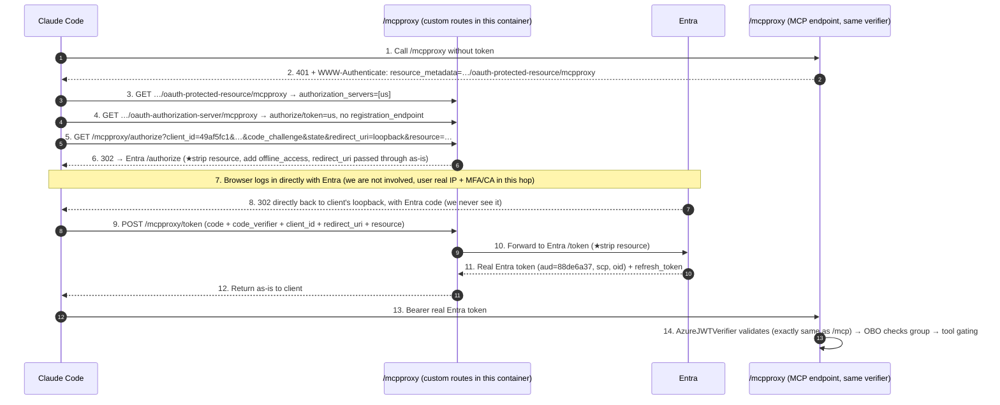

# Implementation Notes: Plan A — `/mcpproxy` Resource-Stripping Proxy

> This document corresponds to the **actual implementation code** for **Plan A (thin filter)** selected in the [planning document](./plan-same-container-dual-endpoints-mcp-and-mcpproxy-two-approaches-compared.md).
> It covers three things: **① How the code is implemented** (section-by-section analysis), **② Design trade-offs**, **③ Potential security issues and drawbacks**.

---

## 0. One-Sentence Summary + Verification Conclusion

Without touching the existing `/mcp` (VS Code direct connection to Entra) at all, an additional `/mcpproxy` endpoint is exposed within the same container. It inserts a layer between the client and Entra, **doing only one thing: removing the RFC 8707 `resource` parameter**, thereby bypassing Entra v2's [`AADSTS9010010`](./bug-analysis-aadsts9010010-mcp-resource-parameter-collides-with-entra-v2.md). The client ultimately receives a **real Entra token**, so `oid` / OBO / AD-group gating is **completely identical to `/mcp`, with zero changes**.

**Deployed and end-to-end verified** (Claude can use it normally). Evidence after real login:

```text
# Token exchanged via /mcpproxy/token (request intentionally included resource=, proxy stripped it)
aud: 88de6a37-cf75-40d3-83e8-44c5ccbc0895     # = our MCP API, audience correct
scp: user_impersonation                        # scope correct
azp: 49af5fc1-96e6-40c1-b108-cb828cc2a00e      # presented by our public client
oid: b04a03e0-6e07-4d55-83b2-7dedeb56c56d      # user identity preserved
refresh_token present: True                    # offline_access effective
=> No AADSTS9010010 throughout the entire process

# Using this token to connect to the /mcpproxy MCP endpoint
tools/list -> ['diagnose_bash', 'action_bash']  # group gating effective
diagnose_bash `az account show` -> exit 0, "Azure subscription 1"  # OBO→sandbox→FIC chain works
```

---

## 1. Background: Why This Layer Is Needed (30-Second Recap)

- The MCP authorization specification (2025-06) requires the client **MUST** include `resource=<MCP server URL>` in both `/authorize` and `/token`.
- Claude Code / opencode strictly comply and will include `resource`. **When Entra v2 receives `resource` and it does not match the `aud` derived from scope → hard error `AADSTS9010010`** (mandatory validation since 2026-03).
- VS Code does not include `resource`, so `/mcp` has always worked.
- **Structural conclusion**: To remove `resource`, a "man-in-the-middle" must resend that upstream request on behalf of the client—this layer cannot be omitted (Microsoft's official APIM solution is essentially the same). Plan A makes this layer **as thin as possible**: only removes one parameter, does not issue its own tokens, does not store anything.

---

## 2. Overall Architecture: Same Container, Dual Endpoints, Shared Downstream

```
                         ┌───────────────────────── Same Container / Same Starlette App ─────────────────────────┐
  VS Code ──────/mcp─────►  RemoteAuthProvider(→Entra)  ┐                                                        │
  (no resource, unchanged)                               │   Same AzureJWTVerifier                               │
                                                         │   Same StreamableHTTP session manager                 │
  Claude Code ──/mcpproxy─►  RequireAuthMiddleware ──────┘   Same tools / OBO / group cache (not a single line   │
  opencode                   + 4 custom OAuth routes (strip resource then forward to Entra)                       │
                         └────────────────────────────────────────────────────────────────────────────────────┘
```

Key point: **`/mcp` and `/mcpproxy` validate the same kind of real Entra token, using the same verifier**. The only differences between the two are:
1. **Where to point the client on 401**: `/mcp` → Entra; `/mcpproxy` → ourselves.
2. `/mcpproxy` has 2 additional discovery metadata endpoints + 2 forwarding routes (authorize / token).

Precisely because of this "same token" insight, the implementation code is **simpler** than the "two FastMCP instances + merged lifespan" envisioned in the plan: simply mount the `/mcp` streamable ASGI app **on a second path** (see §4.2).

---

## 3. Full Request Flow (End-to-End Sequence)



**Why it is "almost stateless"**: Step 6 is "modify params + 302"; the callback in steps 7-8 is sent by Entra directly back to the client's loopback, **the middle layer never handles the callback, never sees the code**; steps 9-12 are "modify params + forward + return as-is". PKCE has only one pair (client↔Entra, end-to-end), `state` is round-tripped by the client itself. We **do not generate our own PKCE, do not issue our own code, do not sign our own token, do not store anything**.

### 3.1 Complete Endpoint / Route List (Real Values + Step-by-Step Mapping to Sequence Diagram Above)

The table below lists **every route** registered by `install_proxy_endpoint`, filled with **real values** (`<base>` = `https://dataops-aca-mcp.icyrock-96f978c0.westus2.azurecontainerapps.io`，`<tenant>` = `9ea91fbb-1313-4312-a601-b6d9ab7d4de3`), and indicates which **step** in the sequence diagram above it corresponds to.

**A) New `/mcpproxy` routes added by this container (custom)**

| Method · Path (real value) | handler | What it does | Sequence diagram step |
|---|---|---|---|
| `GET·POST·DELETE <base>/mcpproxy` | `proxy_mcp_endpoint` (`RequireAuthMiddleware` wrapping the shared streamable app) | MCP endpoint itself: no token→401 pointing to our PRM; with token→validated then enters tools | **No token: 1→2**; **With token: 13→14** |
| `GET <base>/.well-known/oauth-protected-resource/mcpproxy` | `protected_resource_metadata` | RFC 9728: tells client "my AS is myself" | **3** |
| `GET <base>/.well-known/oauth-authorization-server/mcpproxy` | `authorization_server_metadata` | RFC 8414: declares authorize/token endpoints, no `registration_endpoint` | **4** |
| `GET <base>/mcpproxy/.well-known/oauth-authorization-server` | `authorization_server_metadata` (**same handler**, see §4.3) | Same as above, alternative discovery path style, compatible with another type of client | **4** (equivalent) |
| `GET <base>/mcpproxy/authorize` | `authorize` | Strip `resource` + add `offline_access`, 302 to Entra | **Receive=5, Send=6** |
| `POST <base>/mcpproxy/token` | `token` | Strip `resource`, forward to Entra, return as-is | **Receive=9, Forward=10, Return=12** |

**B) Upstream Entra (not routes in this container, but part of the flow; called by us on behalf of client)**

| Method · Path (real value) | What it does | Sequence diagram step |
|---|---|---|
| `GET https://login.microsoftonline.com/<tenant>/oauth2/v2.0/authorize` | We 302 to here (resource already stripped); browser logs in here | **6→7→8** |
| `POST https://login.microsoftonline.com/<tenant>/oauth2/v2.0/token` | Our `token` handler forwards here (resource already stripped) → issues real token | **10→11** |

**C) Existing `/mcp` routes (not a single character changed this time, VS Code uses this path, not in the sequence diagram above)**

| Method · Path (real value) | What it does |
|---|---|
| `GET·POST·DELETE <base>/mcp` | Original MCP endpoint; 401 points to `/mcp` PRM (AS=Entra) |
| `GET <base>/.well-known/oauth-protected-resource/mcp` | RFC 9728: `authorization_servers=[https://login.microsoftonline.com/<tenant>/v2.0]` (direct to Entra) |
| `GET <base>/health` | Health check |

> Understand the mapping at a glance: **Discovery trio** (steps 3/4) = Group B two metadata endpoints; **Authorization redirect** (steps 5/6) = `/mcpproxy/authorize`;
> **Token exchange** (steps 9/10/12) = `/mcpproxy/token`; **Actual work** (steps 1/2 and 13/14) = `/mcpproxy` MCP endpoint itself.
> Steps 7/8 (browser login + callback) are **entirely between client↔Entra**, we have no route involved—this is precisely the source of "statelessness".

---

## 4. Detailed Code Implementation

### 4.1 Files Changed

| File | Change |
|---|---|
| `src/mcp-server/mcpproxy.py` | **New**. Entire proxy logic: 2 metadata endpoints + authorize/token forwarding + second MCP route mount. ~180 lines, no new third-party dependencies (`httpx` already present; `mcp`/`starlette` brought in transitively by `fastmcp`). |
| `src/mcp-server/main.py` | After `app = mcp.http_app()`, if `MCPPROXY_ENABLED` (default true) calls `install_proxy_endpoint(app, …)`. **`/mcp` related code not touched at all.** |
| `.mcp.json` / `opencode.json` | url `…/mcp` → `…/mcpproxy` (clientId/scope retained). |
| `.vscode/mcp.json` | **Unchanged**, VS Code continues to use `/mcp`. |
| `.env.example` | Added a line `MCPPROXY_ENABLED=true`. |

### 4.2 Key Technique: Mounting the Same StreamableHTTP App on a Second Path

**First, clarify what "Streamable HTTP" is.** It is the **transport layer** defined by the MCP specification (2025 edition), replacing the older "HTTP+SSE". In one sentence: **A single HTTP endpoint carries the entire MCP session**—

- `POST`: client sends JSON-RPC messages; server either returns a JSON or upgrades to an **SSE stream** (for streaming/server notifications);
- `GET`: opens a server→client SSE stream (for server-initiated messages);
- `DELETE`: ends the session;
- Throughout, the request header **`mcp-session-id`** ties multiple HTTP requests of the same logical session together.

In FastMCP, the ASGI object implementing this transport is called `StreamableHTTPASGIApp`, and its internal `session_manager` **partitions sessions by `mcp-session-id`, independent of URL path**. This is precisely the prerequisite that makes this technique work.

**What we actually did (yes, reached into the wrapper).** `mcp.http_app()` is a public API returning a Starlette app. We did not stop at this layer, but **reached into this Starlette app's route table**: found the `/mcp` route, **unwrapped** the outer `RequireAuthMiddleware`, extracted the inner `StreamableHTTPASGIApp`, then used Starlette's low-level `Route` to mount the **same object** on `/mcpproxy` again (wrapped in a new `RequireAuthMiddleware` pointing to different 401 metadata). Because sessions are partitioned by request headers and independent of path, the same object mounted on two paths **shares one session manager**, with sessions on the two endpoints independent and non-interfering. Result: **no need to touch lifespan, no need for a second FastMCP instance**.

```python
def find_streamable_asgi_app(app, mcp_path: str):
    """Extract the inner StreamableHTTP ASGI app from the /mcp route for reuse on /mcpproxy."""
    for route in app.router.routes:
        if isinstance(route, Route) and route.path == mcp_path:
            endpoint = getattr(route, "app", None) or getattr(route, "endpoint", None)
            if isinstance(endpoint, RequireAuthMiddleware):
                return endpoint.app          # ← the inner StreamableHTTPASGIApp
            return endpoint
    raise RuntimeError(f"could not find MCP streamable route at {mcp_path!r}")
```

```python
# /mcpproxy MCP endpoint: same streamable app, same required_scopes,
# only the 401 WWW-Authenticate points to our own protected-resource-metadata.
streamable_app = find_streamable_asgi_app(app, mcp_path)
proxy_mcp_endpoint = RequireAuthMiddleware(streamable_app, required_scopes, prm_url)
```

> ⚠️ This **depends on the internal structure of FastMCP/mcp SDK** (the `RequireAuthMiddleware.app` wrapper in the route). The benefit is zero duplicated code;
> the cost is that if the SDK changes this wrapper, `find_streamable_asgi_app` will **raise RuntimeError preventing the container from starting (loud failure, not silent error)**.
> See §10 Drawbacks.

**So we don't need to start another FastMCP server? Correct.** The alternative path (envisioned in the planning document) is: use a factory function to create a **second `FastMCP` instance** (same tools), each calling `http_app()`, then mount both apps under a parent Starlette, **merging two lifespans**. I avoided it. Pros and cons of both approaches:

| | **Reuse same app (this implementation)** | Start second FastMCP instance (not adopted) |
|---|---|---|
| Code volume | Less (only a few routes + one unwrap) | More (factory + mount + merge lifespans) |
| session manager / lifespan | **1 set**, no touching needed | 2 sets, must start both session managers in lifespan |
| tools / verifier / OBO / group cache | **Same set of objects**, zero fork, zero extra memory | Two sets of objects, must keep in sync via factory; extra memory |
| Dependency on SDK | **Coupled to internal wrapper** (unwrap `RequireAuthMiddleware.app`), upgrade requires regression | Only uses public API (`http_app()` + mount), no internal touching |
| Can endpoints be **different** | **Cannot**: necessarily share same tools/verifier/session namespace | Can: each can use different tools/auth/config, fully isolated |

**Conclusion**: In this scenario, the two endpoints **differ only in discovery metadata, everything else is identical**, so "reuse" is the clearly more cost-effective choice—saves an entire block of lifespan/instance management complexity, in exchange for an internal dependency that will "fail loudly". **If one day `/mcpproxy` needs to look different from `/mcp`** (different tools, different verifier), then switch back to the "second instance" approach.

### 4.3 Two Discovery Metadata Endpoints (Making the Client Treat Us as the AS, Without DCR)

**① Protected-Resource Metadata (RFC 9728)** — points the client to "us as the AS" instead of Entra:

```python
async def protected_resource_metadata(_request):
    return JSONResponse({
        "resource": resource,                       # https://<fqdn>/mcpproxy
        "authorization_servers": [issuer],          # ← points to ourselves (= resource)
        "scopes_supported": [api_scope],            # api://88de6a37…/user_impersonation
        "bearer_methods_supported": ["header"],
    })
```

**② Authorization-Server Metadata (RFC 8414)** — declares our authorize/token; **deliberately omits `registration_endpoint`**, so compliant clients will use their **statically configured `client_id` (49af5fc1) and not perform DCR**:

```python
async def authorization_server_metadata(_request):
    return JSONResponse({
        "issuer": issuer,
        "authorization_endpoint": authorize_ep,     # …/mcpproxy/authorize
        "token_endpoint": token_ep,                 # …/mcpproxy/token
        "response_types_supported": ["code"],
        "grant_types_supported": ["authorization_code", "refresh_token"],
        "code_challenge_methods_supported": ["S256"],
        "token_endpoint_auth_methods_supported": ["none"],   # public client, no secret
        "scopes_supported": [api_scope, "offline_access"],
        # Note: no registration_endpoint → does not trigger DCR
    })
```

**Why is the same metadata mounted on two addresses?** These are not "duplicate routes"—they have **different paths, same handler**:

```python
Route("/.well-known/oauth-authorization-server" + proxy_path, ...)  # → /.well-known/oauth-authorization-server/mcpproxy
Route(proxy_path + "/.well-known/oauth-authorization-server", ...)  # → /mcpproxy/.well-known/oauth-authorization-server
```

The root cause is that our AS `issuer` includes a path (`https://…/mcpproxy`), while different clients have different algorithms for "where to fetch metadata for an issuer with a path":
- **RFC 8414 §3.1 (path-insertion style)**: inserts `/.well-known/oauth-authorization-server` between host and path
  → `…/.well-known/oauth-authorization-server/mcpproxy`;
- **OIDC Discovery style (path-appending style)**: appends directly after issuer → `…/mcpproxy/.well-known/oauth-authorization-server`.

I don't presume which style the client uses, so I mount the **same handler on two addresses**, discoverable by either.
> If the issuer were set to the root without a path (`https://host`), you'd only need one well-known, no such ambiguity—but I chose an issuer with a path to keep the `/mcpproxy` namespace self-contained and symmetric with the resource URL. Mounting an extra route is the cost of this choice, see §8.

### 4.4 `/mcpproxy/authorize`: Strip resource + Normalize scope + 302 to Entra

```python
async def authorize(request):
    params = dict(request.query_params)
    params.pop("resource", None)                    # ★ Core: strip RFC 8707 resource
    params["scope"] = _ensure_scopes(params.get("scope"), api_scope)
    # Only redirect to the fixed Entra constant endpoint (prevents open-redirect); redirect_uri passed through as-is for Entra to validate
    return RedirectResponse(f"{upstream_authorize}?{urlencode(params)}", status_code=302)
```

`_ensure_scopes` ensures the scope always contains the API scope + `offline_access`/`openid`/`profile` (adds refresh_token and id claims), but **preserves** the scopes the client originally wanted:

```python
_RESERVED_SCOPES = ("offline_access",)   # Only add offline_access (to get refresh_token); openid/profile unnecessary, removed
def _ensure_scopes(scope, api_scope):
    parts = scope.split() if scope else []
    for needed in (api_scope, *_RESERVED_SCOPES):
        if needed not in parts:
            parts.append(needed)
    return " ".join(parts)
```

> **Which scopes are required?** Only `user_impersonation` (custom API scope) is **required**—it determines that Entra pins `aud` to our API, and is the **only scope validated** by the server-side `AzureJWTVerifier(required_scopes=["user_impersonation"])`. Reserved scopes are **not checked by the server at all**, they only affect what Entra returns to the client, so now **only `offline_access` is added** (to get refresh_token, allowing the client to silently renew after the access token's ~1h expiry without re-prompting browser login). `openid`/`profile` only affect id_token (we never read it, `oid` is already present in the access token), **removed**. The **server-side validation requirements for `/mcp` and `/mcpproxy` are completely identical**, reserved scopes are purely a client request-side concern.

- **PKCE / state / client_id / redirect_uri all passed through as-is**: So PKCE is client↔Entra end-to-end, `state` is validated by the client itself, callback goes directly to the client's loopback.
- **Open-redirect prevention**: We only append parameters to a **hardcoded Entra constant URL**, never deciding the redirect target based on user input. The user-supplied `redirect_uri` is a parameter forwarded to Entra, guarded by **Entra's redirect whitelist registered for 49af5fc1** (currently only `http://localhost:8080/callback`）。

### 4.5 `/mcpproxy/token`: Strip resource + Forward + Return as-is

```python
async def token(request):
    form = dict(await request.form())
    form.pop("resource", None)                       # ★ Strip resource here too
    async with httpx.AsyncClient(timeout=30.0) as client:
        upstream = await client.post(upstream_token, data=form,
                                     headers={"Accept": "application/json"})
    # Status code + body returned as-is; ★ absolutely no logging (body contains token)
    media_type = upstream.headers.get("content-type", "application/json")
    return Response(content=upstream.content, status_code=upstream.status_code,
                    media_type=media_type)
```

- Both `authorization_code` and `refresh_token` grants go through this single path (both are just "strip resource + forward").
- **Scope is not touched** (when exchanging authorization_code for token, Entra derives scope from the code; modifying it could introduce inconsistency).
- **No logging**: token plaintext only passes through memory and is returned as-is to the client.

### 4.6 `main.py` Integration and Feature Flag

```python
MCPPROXY_ENABLED = os.environ.get("MCPPROXY_ENABLED", "true").lower() in ("1","true","yes")
...
app = mcp.http_app()          # /mcp as before

if MCPPROXY_ENABLED:
    from mcpproxy import install_proxy_endpoint
    install_proxy_endpoint(
        app,
        mcp_path="/mcp",
        base_url=BASE_URL,                       # cloud=https FQDN, local=http://localhost:8080
        tenant_id=TENANT_ID,
        mcp_app_id=MCP_APP_ID,
        required_scopes=verifier.required_scopes,  # ["user_impersonation"], same source as /mcp
    )
```

`install_proxy_endpoint` inserts new routes at the front via `app.router.routes[:0] = new_routes` (exact paths, order doesn't really matter). `MCPPROXY_ENABLED=false` → clean fallback to only `/mcp` (verified before deployment).

---

## 5. Client Configuration

```jsonc
// .mcp.json (Claude Code) — only change url to /mcpproxy, clientId unchanged
{ "mcpServers": { "azure-dataops-aca": {
    "type": "http",
    "url": "https://dataops-aca-mcp.<domain>/mcpproxy",
    "oauth": { "clientId": "49af5fc1-96e6-40c1-b108-cb828cc2a00e", "callbackPort": 8080 }
}}}
```

opencode.json is similar (additionally includes `scope`); `.vscode/mcp.json` **remains `/mcp` unchanged**.

---

## 6. Deployment Method and This Session's Record

Infrastructure was already provisioned (Bicep), **code changes only require rebuilding the image + rolling the container**, no need to run `az deployment sub create` again:

```bash
set -a && source .env.aca && set +a
# Local Docker not running, use ACR Tasks to build in the cloud (avoids local daemon dependency)
az acr build -r "$REGISTRY_NAME" -t "mcp-server:mcpproxy-<ts>" -t "mcp-server:latest" ./src/mcp-server
az containerapp update -n "$MCP_APP_NAME" -g "$ACA_RESOURCE_GROUP" \
  --image "$REGISTRY_LOGIN_SERVER/mcp-server:mcpproxy-<ts>"   # use unique tag to force new revision
```

This session: image `mcp-server:mcpproxy-20260711-155857`, new revision **`dataops-aca-mcp--0000009`** (Running). `MCP_SERVER_BASE_URL` is already https FQDN, so the proxy's declared resource/issuer/authorize/token are all https, no Bicep changes needed (`MCPPROXY_ENABLED` defaults to true in code).

---

## 7. End-to-End Verification Evidence (Post-Deployment Testing)

| Check Item | Result |
|---|---|
| `/health` | ✅ ok |
| `…/oauth-protected-resource/mcpproxy` → `authorization_servers=[us]` | ✅ |
| `…/oauth-authorization-server/mcpproxy` (+path-appending style) → no `registration_endpoint`, `auth_method=none` | ✅ |
| `/mcpproxy/authorize?…&resource=…` → 302 to Entra, **resource stripped**, `offline_access` added, PKCE/state/client_id preserved | ✅ |
| `/mcpproxy` no token → 401 → points to proxy PRM | ✅ |
| `/mcp` no token → 401 → points to `/mcp` PRM (**unchanged**, still Entra) | ✅ |
| **Real login**: `/mcpproxy/token` (with resource=) → real Entra token (aud/scp/oid/refresh all correct, **no 9010010**) | ✅ |
| Using that token to connect to `/mcpproxy` MCP → `tools/list=[diagnose_bash, action_bash]` (group gating) | ✅ |
| `diagnose_bash` runs `az account show` → exit 0 (OBO→sandbox→FIC chain works) | ✅ |
| `MCPPROXY_ENABLED=false` → clean fallback to only `/mcp` | ✅ (verified before deployment)|

> Note: Using only `curl` (without login) **cannot** reproduce `AADSTS9010010`—because that error is triggered during the authorization processing/token phase **after login**, an unauthenticated GET will only see the login page. Therefore, definitive proof must go through a **real browser login**, which is the end-to-end record above.

---

## 8. Design Trade-offs

1. **A (thin filter) vs B (FastMCP OAuthProxy)**: Chose A. A hits almost every requirement point-for-point (no DCR, no token store, no signing key, client presents our client_id, identity preservation with zero changes), at the cost of self-maintaining a small piece of thin OAuth glue; B writes less code but turns these requirements into "mechanisms that need extra suppression" (pin static client, token store, signing key, upstream token spike). See planning document §5 for details.

2. **Reusing the same streamable app (rather than two FastMCP instances)**: Because under Plan A, both endpoints **receive the same kind of real Entra token, using the same verifier**, there is no need to start a second instance, nor to merge two lifespans. The cost is **coupling to the SDK's internal wrapper structure** (§4.2 unwrap). Trade-off conclusion: saves an entire block of lifespan/instance management complexity, in exchange for a **loud failure** (won't start) internal dependency—acceptable, and better than silent error.

3. **`/mcp` not touched at all**: Zero regression risk for the VS Code path that is **already verified working**. The proxy is just "adding a compatible channel in parallel", most aligned with Microsoft's security principle (preserving pre-registration direct connection).

4. **Strip resource rather than "translate" resource**: Entra v2 has no place for RFC 8707 `resource`; `aud` is **determined by scope**. Since scope (`api://88de6a37…/user_impersonation`) already pins `aud` to our API, `resource` is redundant and conflicting—simply strip it, `aud` remains correct (verified `aud=88de6a37`). **Stripping resource does not weaken audience binding** (see §9 item 3).

5. **Stateless, does not issue its own tokens**: No token store / signing key / self-signed token trust surface introduced; minimal blast radius; inherently horizontally scalable with multiple replicas. The cost is we have **no place to add hooks** (cannot do per-user rate limiting, revocation, audit enhancement ourselves—must rely on Entra).

6. **Enabled by default (`MCPPROXY_ENABLED=true`)**: One deployment brings `/mcpproxy` to both cloud and local, while keeping a disable switch for isolated troubleshooting.

---

## 9. Security Analysis (Key Points)

First, the conclusion: **This layer does not amplify the attack surface already exposed by Entra itself to a "dangerous" degree** (the `/authorize`, `/token` it forwards to are already public internet + public client), but it does introduce several points **worth documenting and worth future hardening**.

| # | Risk / Concern | Severity | Current Status and Mitigation |
|---|---|---|---|
| 1 | **`/mcpproxy/token` is an unauthenticated forwarding endpoint to Entra** (open relay) | Low-Medium | What it can do does not exceed "talking directly to Entra" (Entra is already public, client has no secret). But it changes the **request source IP to the container's egress IP** (see #2), and can be abused (see #5). |
| 2 | **Token reverse channel loses user's real IP** → weakens **IP-based Conditional Access / sign-in risk detection** | Medium | leg-2 (`/token`) originates from the container's egress IP, Entra sign-in logs/CA see the **server IP** not the user IP. **Note**: leg-1 interactive login (`/authorize` is browser 302) is still **user real IP + MFA/CA**, so strong authentication is unaffected; only the token exchange hop's IP attribution is affected. If you rely on CA policies that "restrict token acquisition by IP", evaluate. |
| 3 | **Stripping `resource` = discarding RFC 8707 audience binding intent** | Low (not weakened in this scenario) | RFC 8707's purpose is "this token can only be used at a certain resource". In this project, **`aud` is pinned by scope to `api://88de6a37`**, `AzureJWTVerifier` validates `aud=MCP_APP_ID`—so the token **is still only valid at our API**, rejected elsewhere. Stripping resource does not weaken this. |
| 4 | **We externally claim to be the AS, but issue someone else's (Entra's) token** (issuer semantic inconsistency) | Low | AS metadata's `issuer` is our URL, but token's `iss` is Entra. MCP clients carry the token as an **opaque string** and do not cross-validate, so no issue in practice; but if a client strictly enforces RFC 9207/validates "token.iss == discovered AS issuer", it would fail. Claude Code/opencode do not do this. |
| 5 | **Unauthenticated endpoints can be abused (DoS / amplification / trigger Entra rate limiting on 49af5fc1)** | Medium | `/authorize` (cheap 302) and `/token` (one outbound httpx to Entra each time) are both unauthenticated. Recommend adding **rate limiting** (IP/client-level). The `/mcpproxy` MCP endpoint itself is protected by `RequireAuthMiddleware`, unaffected. |
| 6 | **Open-redirect** | Mitigated | authorize only appends params to a **hardcoded Entra constant URL**; `redirect_uri` is guarded by **Entra's 49af5fc1 redirect whitelist** (currently only `http://localhost:8080/callback`). **Premise: keep 49af5fc1's redirect whitelist minimal**—if someone adds a loose/controllable redirect (especially non-loopback https), the risk returns. |
| 7 | **Token logged** | Avoided | token handler **does not print body**; authorize's 302 Location only contains public values (code_challenge is public). Must continuously maintain this discipline, avoid accidentally adding logs. |
| 8 | **Always adding `offline_access` → proxy path always issues refresh_token** | Low | refresh token is long-lived, larger blast radius if stolen. This is a standard trade-off for "no re-login", but indeed has a larger surface than "only issue access token". Could consider only adding when client explicitly requests `offline_access`. |
| 9 | **Arbitrary query/form parameters passed through to Entra** | Low | Everything except `resource` is passed through (`prompt`/`login_hint`/`domain_hint`…). Malicious parameters can do no more than "directly hitting Entra", Entra itself validates. |
| 10 | **Upstream TLS** | OK | `httpx` validates `login.microsoftonline.com` certificate by default. |
| 11 | **CORS** | Not applicable | No CORS added. Native clients (loopback) don't need it; browser-based MCP clients using fetch to hit discovery endpoints would be blocked by same-origin policy (out of scope for this phase). |

**One-sentence security narrative (for review/management)**:
- **Absolutely no DCR opened**—metadata provides no `registration_endpoint`, client uses our pre-registered, pinned `49af5fc1`;
- **Client has no secret** (public + PKCE), server also **signs no tokens, stores no tokens**;
- **Identity governance unchanged**—still `oid` + OBO + AD group determines tool visibility; proxy only resolves "protocol incompatibility before token issuance";
- **Equivalent to a minimal version of Microsoft-endorsed "governed gateway" (APIM) pattern**—only strips one parameter, everything else delegated to Entra.

---

## 10. Drawbacks and Future Hardening

**Drawbacks / Debt**:
1. **Self-maintaining a small piece of security-sensitive OAuth glue** (though thin, and holds no secret/token)—needs someone to review, avoid accidentally logging, avoid relaxing redirect whitelist.
2. **Coupled to FastMCP/mcp SDK internal structure** (§4.2 unwrap `RequireAuthMiddleware.app`)—when upgrading `fastmcp`/`mcp`, run the verification checklist (the §7 checklist can be directly reused); failure is a "container won't start" loud failure. **Recommend pinning major versions of these two packages in requirements.**
3. **Depends on good client behavior**—client must accept "AS without `registration_endpoint` + static client_id". Claude Code / opencode support this; if a client insisting on DCR is onboarded in the future, this path won't work.
4. **Local OBO still requires secret**—fixing the resource bug is orthogonal to "OBO de-secret"; locally there is no MI, App R's OBO still uses `MCP_CLIENT_SECRET` (cloud can later switch to MI-FIC).
5. **No hooks for per-user rate limiting/revocation/audit enhancement**—the cost of statelessness.

**Recommended future hardening (by priority)**:
- **[Medium] Add rate limiting to `/mcpproxy/token`, `/mcpproxy/authorize`** (mitigates #5 DoS/amplification, and Entra rate limiting on 49af5fc1).
- **[Medium] Review and tighten 49af5fc1's redirect whitelist** (preserve #6 open-redirect mitigation); document "must not add loose non-loopback redirects".
- **[Low] Make `offline_access` on-demand** (only add when client requests it), reducing refresh token surface (#8).
- **[Low] Pin `fastmcp` / `mcp` major versions**, and solidify the §7 verification checklist into a repeatable script (regression guardrail, targeting §10-2 coupling).
- **[Orthogonal] App R OBO: secret → MI-FIC** (no secret string in cloud), independent from this proxy, can proceed in parallel.

---

## Appendix: One-Sentence Comparison with Plan B (FastMCP OAuthProxy)

| | A (this implementation) | B (OAuthProxy) |
|---|---|---|
| Client receives | **Real Entra token** | FastMCP self-signed token |
| token store / signing key | **Neither needed** | Both needed |
| DCR | **Inherently absent** | Present by default, must be pinned off |
| OBO / oid | **Zero changes** (same as `/mcp`) | Requires spike to fetch upstream token from store |
| Our code | ~180 lines thin glue (self-maintained) | Almost none (leverages framework, but depends on unstable internal APIs) |
| Security surface | Thin, close to APIM; need to self-review those points (§9) | Framework handles, but adds an extra "self-signed token" trust surface |

> Conclusion: For this project's priorities (no DCR, no store/infrastructure, client presents our client_id, identity preservation with zero changes), **A hits almost every requirement point-for-point**, has been implemented and end-to-end verified.