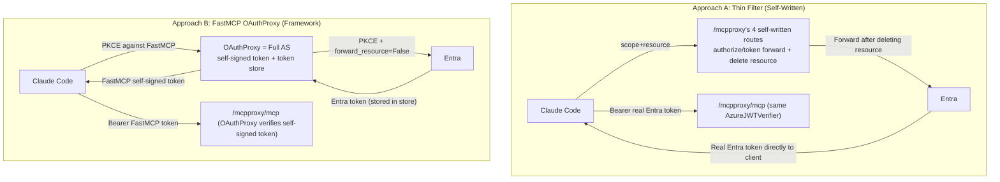
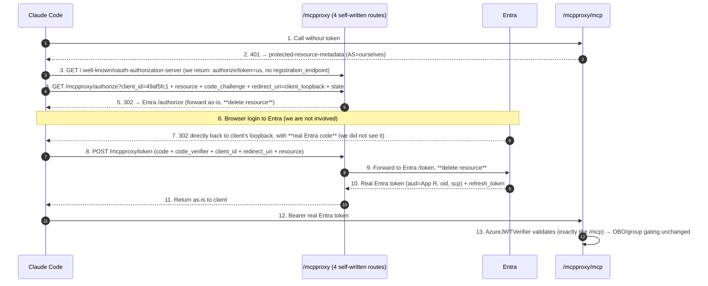
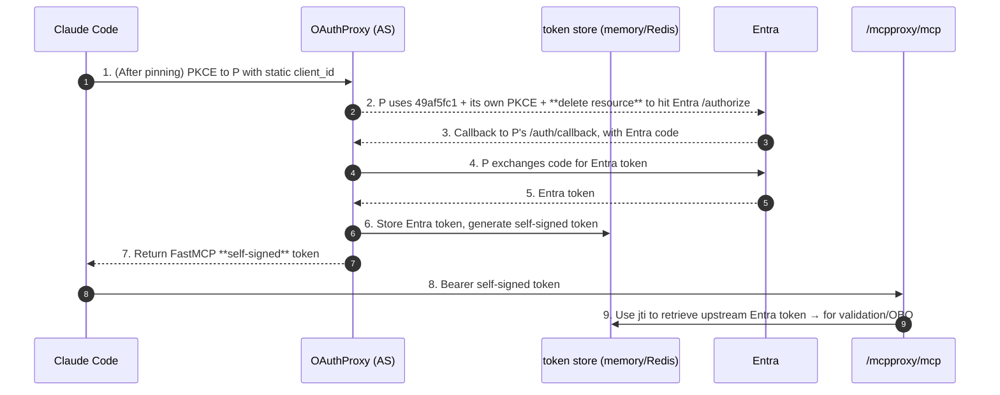

# Plan: Same-Container Dual Endpoints `/mcp` + `/mcpproxy` (Two Approaches Compared)

> **Goal**: **Without touching the existing `/mcp` (VS Code direct to Entra)**, expose an additional `/mcpproxy` in the same container so that
> **clients strictly adhering to RFC 8707, such as Claude Code / opencode**, can bypass
> [`AADSTS9010010`](./bug-analysis-aadsts9010010-mcp-resource-parameter-collides-with-entra-v2.md) and connect.
>
> **This document presents two implementation paths side-by-side for selection**:
> - **Approach A — Thin Filter**: A self-written, nearly stateless "resource-stripping reverse proxy" (4 routes + 2 metadata endpoints).
>   The client ultimately receives a **real Entra token**.
> - **Approach B — FastMCP OAuthProxy**: Uses the framework's built-in OAuth Proxy (a full AS, self-signed tokens + token store).
>
> **Constraints (your original requirements, both approaches align)**: ① Do not touch Entra DCR; ② Reuse the existing public client `49af5fc1`, **do not sign a secret**;
> ③ Same container, reuse FastMCP tool code; ④ Preserve `oid`, maintain "AD group → tool visibility"; ⑤ Must also work locally.

---

## 0. One-Liner Positioning

> The existing architecture is clean **pre-registration** (client connects directly to Entra). The only flaw is that Claude Code / opencode sends the RFC 8707
> `resource` → hits `AADSTS9010010`. **The common essence of both approaches is "inserting a layer between the client and Entra to delete `resource`"**;
> the only divergence is **how heavy this layer is**:
> - **A** is merely a **parameter filter** (forward + delete `resource`), does not issue tokens itself, stores nothing, and the client gets a **real Entra token**;
> - **B** is a **full AS / broker** (issues its own tokens, maintains a `self-signed token → upstream Entra token` mapping), and the client gets a
>   **FastMCP self-signed token**.
>
> VS Code continues to use `/mcp` unchanged; tool code is 100% reused in both approaches.

---

## 1. Common Foundation (Prerequisites for Both Approaches)

### 1.1 First, Dispel a Misconception: "public client + PKCE" Alone Cannot Fix This Bug

`49af5fc1` is currently a public client, is performing PKCE, and is throwing `AADSTS9010010`. **The root cause is not public-vs-confidential,
nor PKCE-vs-secret, but "who talks to Entra"**: as long as the MCP client connects **directly** to Entra, it will carry `resource`, and Entra
will reject it. **To delete `resource`, structurally there must be an intermediary to handle that request with Entra on your behalf—this intermediary cannot be omitted** (Microsoft's official APIM solution is essentially this, see Bug doc §5). The difference between A / B is only whether this intermediary is "thin" or "thick".

### 1.2 How Exactly `resource` Gets "Deleted" (Forward / Strip Explained)

The bug only occurs in **one hop**: the client → Entra `/authorize` + `/token`. Claude Code (per MCP spec) always attaches
`resource=https://…/mcp`，Entra v2 rejects (`AADSTS9010010`). The intermediary splits this hop into two legs:

```
Today (no intermediary, broken):
  Claude Code ──scope + resource──> Entra          ❌ Entra sees resource → 9010010

With intermediary (working):
  Leg 1:  Claude Code ──scope + resource──> Intermediary(/mcpproxy)   ← Accepts resource, no error
  Leg 2:  Intermediary ──scope only, drop resource──> Entra           ✅ Entra sees only scope → issues token
```

- **Approach A** "deletes resource" in leg 2 via **our own forwarding logic** (`/authorize` 302 without it, `/token` forward without it).
- **Approach B** "deletes resource" in leg 2 via FastMCP's `OAuthProxy(forward_resource=False)` **switch** (official docs:
  default `True` forwards resource, `False` = upstream request does not carry it).

**Key point**: Leg 2 is "a request made by the intermediary itself"—precisely because such an intermediary exists to re-send the upstream request on your behalf, you have a place to delete `resource`.
This also explains why §1.1 states the intermediary cannot be omitted.

---

## 2. Quick Overview of Both Approaches + Comparison Table (See the Big Picture First)



| Dimension | **Approach A Thin Filter** | **Approach B FastMCP OAuthProxy** |
|---|---|---|
| Intermediary nature | Parameter filter (near-stateless forward) | **Full authorization server / broker** |
| Client ultimately receives | **Real Entra token** (`aud=App R`) | FastMCP **self-signed** token |
| Token store | **Not needed** | Needed (1 replica=memory; multi-replica needs Redis) |
| JWT signing key | **Not needed** | Needed (`jwt_signing_key`) |
| DCR | **Inherently absent** (metadata does not provide `registration_endpoint`) | Present by default → must be pinned (also depends on internal API #3085) |
| OBO / `oid` | **Zero changes** (same token as `/mcp`, OBO works directly) | Needs spike: retrieve upstream token from store as OBO assertion |
| Composition complexity | Low (both endpoints use same verifier) | Medium (two auth mechanisms + lifespan merge) |
| Code we write/maintain | **~120 lines of OAuth glue** (thin, holds no secret/token) | Almost none (leverages framework) |
| Refresh token | Passes through Entra's (stateless) | Managed by framework (via store) |
| Dependency on FastMCP internal/unstable APIs | None | Pinning static client depends on [#3085](https://github.com/PrefectHQ/fastmcp/issues/3085) (unstable) |
| Security surface | Self-written OAuth (thin, but requires self-review); closest to Microsoft APIM gateway pattern | Framework-backed, battle-tested; but adds a "self-signed token" trust layer |
| Local compatibility | ✅ | ✅ |
| Aligns with your "just a filter" intuition | ✅ Fully | ✗ (It is actually a broker) |

> **One-sentence trade-off**: A trades "writing a small piece of controllable code" for B's entire mechanism of "store + signing key + DCR-pin + upstream token spike";
> B trades "almost no code" for a heavier, but framework-backed, broker. See §5 for detailed dimension-by-dimension comparison.

---

## 3. Approach A: Thin Filter (Self-Written Resource-Stripping Reverse Proxy)

### 3.1 Principle

The MCP endpoint for `/mcpproxy` uses **the exact same `AzureJWTVerifier` as `/mcp`** (because the client carries a real Entra token). We
only additionally hand-write 4 routes, making FastMCP declare for `/mcpproxy` **"I am the AS"**, while this "AS" is actually just a pair of handlers that "modify parameters and forward to
Entra". **The callback goes directly back to the client's loopback; the intermediary never handles it → stateless.**



**Why stateless**: `/authorize` is "modify params + 302", the callback is sent by Entra directly back to the client loopback (step 7), **the intermediary does not handle the callback**; `/token` is "modify params + forward + relay". PKCE has only one pair (client↔Entra, end-to-end), `state` is round-tripped by the client itself. We **do not generate our own PKCE, do not issue our own code, do not store any tokens**.

### 3.2 What Needs to Be Written (Code Skeleton)

Add self-written routes (`@mcp.custom_route`) on the `/mcpproxy` FastMCP instance:

```python
AUTHZ = f"https://login.microsoftonline.com/{TENANT_ID}/oauth2/v2.0/authorize"
TOKEN = f"https://login.microsoftonline.com/{TENANT_ID}/oauth2/v2.0/token"

# ① Protected resource metadata: point AS to ourselves (not Entra)
@mcp.custom_route("/.well-known/oauth-protected-resource/mcpproxy", methods=["GET"])
async def prm(_):
    return JSONResponse({
        "resource": f"{PROXY_BASE_URL}",
        "authorization_servers": [PROXY_BASE_URL],           # ← points to us
        "scopes_supported": [f"api://{MCP_APP_ID}/user_impersonation"],
    })

# ② AS metadata: declare our authorize/token; **do not provide registration_endpoint → client does not DCR**
@mcp.custom_route("/.well-known/oauth-authorization-server", methods=["GET"])
async def asm(_):
    return JSONResponse({
        "issuer": PROXY_BASE_URL,
        "authorization_endpoint": f"{PROXY_BASE_URL}/authorize",
        "token_endpoint": f"{PROXY_BASE_URL}/token",
        "response_types_supported": ["code"],
        "grant_types_supported": ["authorization_code", "refresh_token"],
        "code_challenge_methods_supported": ["S256"],
        "token_endpoint_auth_methods_supported": ["none"],   # public client
        "scopes_supported": [f"api://{MCP_APP_ID}/user_impersonation"],
    })

# ③ authorize: delete resource, 302 to Entra (redirect_uri uses client's own loopback, passed through as-is)
@mcp.custom_route("/mcpproxy/authorize", methods=["GET"])
async def authorize(request):
    q = dict(request.query_params)
    q.pop("resource", None)                                  # ★ delete resource
    q.setdefault("scope", f"api://{MCP_APP_ID}/user_impersonation")
    # If refresh is needed: ensure scope includes offline_access
    return RedirectResponse(f"{AUTHZ}?{urlencode(q)}", status_code=302)

# ④ token: delete resource, forward to Entra, return as-is (both authorization_code and refresh_token go through here)
@mcp.custom_route("/mcpproxy/token", methods=["POST"])
async def token(request):
    form = dict((await request.form()))
    form.pop("resource", None)                               # ★ delete resource
    async with httpx.AsyncClient() as c:
        r = await c.post(TOKEN, data=form)
    return Response(r.content, status_code=r.status_code, media_type="application/json")
```

The MCP endpoint itself: `RemoteAuthProvider(token_verifier=AzureJWTVerifier(App R), authorization_servers=[PROXY_BASE_URL],
base_url=PROXY_BASE_URL)`—just points 401 to "our AS", the rest of the token validation logic is identical to `/mcp`.

### 3.3 Pros / Cons / Risks

- **Pros**: Truly "just a filter"; no store, no signing key, no DCR; client gets real Entra token → `/mcp` and `/mcpproxy`
  share verifier, **OBO/oid zero changes** (no need for B's upstream token spike); simplest security narrative ("we only delete one parameter, everything else is Entra's responsibility"), closest to Microsoft APIM gateway.
- **Cons / Risks**:
  1. **We write and maintain OAuth glue ourselves** (4 routes + 2 metadata). Thin, and **holds no secret/token** (small blast radius), but still security-sensitive code, must self-review: **only redirect to Entra** (prevent open redirect), metadata must be correct, **do not log tokens**.
  2. **Metadata must be precise**, otherwise client may "discovery fail / fallback to direct Entra" (which would fail but is not unsafe).
  3. **Depends on client supporting "static client_id + AS without registration_endpoint"**—Claude Code / opencode supports this
     (see [Custom Client Access Doc §7](./connecting-custom-clients-to-entra-protected-mcp-principles-and-explanation.md)); needs spike to confirm they accept our metadata.
  4. Refresh: must ensure forwarded scope includes `offline_access`, otherwise refresh_token will not be obtained.

---

## 4. Approach B: FastMCP OAuthProxy (Framework Broker)

### 4.1 Principle

FastMCP's `OAuthProxy` makes your server a **full AS**: it has its own `/authorize`, `/token`, `/register`,
`/auth/callback`, runs its own PKCE with the client, **issues its own tokens** to the client, and maintains a
`self-signed token → upstream Entra token` mapping in the store. The upstream hop uses `forward_resource=False` to delete resource.



### 4.2 What Needs to Be Configured (Code Skeleton)

Directly use the low-level `OAuthProxy` (**do not use `AzureProvider`**—it mandates a secret and does not expose `forward_resource`):

```python
from fastmcp.server.auth import OAuthProxy

proxy_auth = OAuthProxy(
    upstream_authorization_endpoint=f"https://login.microsoftonline.com/{TENANT_ID}/oauth2/v2.0/authorize",
    upstream_token_endpoint=f"https://login.microsoftonline.com/{TENANT_ID}/oauth2/v2.0/token",
    upstream_client_id=PUBLIC_CLIENT_ID,        # 49af5fc1
    upstream_client_secret=None,                # No secret (public + PKCE)
    token_verifier=verifier,                    # AzureJWTVerifier(App R)
    base_url=PROXY_BASE_URL,
    forward_resource=False,                     # ★ delete resource → bypass 9010010
    forward_pkce=True,
    jwt_signing_key=JWT_SIGNING_KEY,            # Required when no secret
    allowed_client_redirect_uris=["http://localhost:*", "http://127.0.0.1:*"],
    # client_storage omitted → single-replica in-memory store
)
# Pin static client (seed 49af5fc1, skip client-side /register) — currently requires internal API (#3085/#3086)
_seed_static_client(proxy_auth, client_id=PUBLIC_CLIENT_ID)
```

### 4.3 Pros / Cons / Risks

- **Pros**: Almost no code to write; framework handles authorize/token/callback/refresh/consent/edge cases; future framework bug fixes/features are free.
- **Cons / Risks**:
  1. It is a **token-issuing broker**: **must** have a token store (1 replica=memory, zero infra; multi-replica needs Redis) + `jwt_signing_key`.
     Note: **the store is due to "self-signed tokens", not DCR**—even if the client is pinned and DCR is completely disabled, the store is still there.
  2. **OBO/oid needs spike**: whether `get_access_token()` in tools provides the "upstream Entra token" (containing oid, usable as OBO assertion) needs actual testing;
     if it provides the self-signed token, claims passthrough + upstream token retrieval API must be configured.
  3. **Pinning static client depends on internal API** (`set_client_info` / `OAuthClientInformationFull`, [#3085](https://github.com/PrefectHQ/fastmcp/issues/3085) unstable);
     if not pinned, proxy-DCR is open by default (security-wise not equivalent to open to the world, but not your requirement of "must present my client_id").
  4. `/register` has no built-in off switch (requires middleware to disable).

---

## 5. In-Depth Dimension-by-Dimension Comparison

| Dimension | A Thin Filter | B OAuthProxy | Notes |
|---|---|---|---|
| **Is it an AS** | Barely (parameter-modifying passthrough) | Yes, full | A does not issue tokens; B issues its own tokens |
| **Token client receives** | Real Entra token (`aud=App R`) | FastMCP self-signed token | A can therefore share everything downstream with `/mcp` |
| **Has store** | No (stateless) | Yes (`self-signed token→upstream token`) | Store originates from "issuing tokens", not DCR |
| **Signing key** | None | Yes | B has no upstream secret → must explicitly provide key |
| **DCR** | Inherently absent (metadata does not provide registration_endpoint) | Present by default, must be pinned | A more thoroughly satisfies "no DCR" |
| **Client presents my client_id** | Directly supported (configure `oauth.clientId`) | Needs seeding (depends on internal API) | Both ultimately use `49af5fc1` |
| **OBO / oid changes** | 0 | Needs spike | A is the most hassle-free |
| **Composition/lifespan complexity** | Low (same verifier, just a few more routes) | Medium (two auth mechanisms coexist) | See §7 spike |
| **Our code volume/maintenance** | ~120 lines, long-term self-maintained | Very little, upgrades with framework | A is "self-owned", B is "outsourced to framework" |
| **Refresh token** | Passes through Entra (stateless) | Framework manages via store | Both can refresh |
| **Multi-replica scaling** | Inherently stateless, scale freely | Must swap store to Redis | Currently 1 replica, both can run initially |
| **Security surface** | Self-written OAuth (thin, requires self-review); closest to APIM blueprint | Framework-backed; adds "self-signed token" trust layer | Neither opens DCR |
| **Dependency on unstable/internal API** | None | Pinning depends on #3085 | A has no such dependency risk |
| **Failure/fallback** | Metadata wrong → client discovery fails (fails but not dangerous) | More mechanisms, larger troubleshooting surface | A has more concentrated failure points |

**Tendency Summary**: Regarding your stated priorities (**no DCR, no store/infra, client presents my client_id, identity fidelity zero changes**),
**A hits almost every point**, at the cost of self-owning a small piece of thin OAuth code; **B writes almost no code, but turns these requirements into "mechanisms that must be additionally suppressed"**
(pinning, store, signing key, upstream token spike). **I personally lean towards A**, but both can be implemented; final selection see §10.

---

## 6. Parts Shared by Both Approaches (Same Regardless of Choosing A/B)

### 6.1 Two Entra Apps

| | **App R = Resource / OBO app** | **App C = public client (client presents + upstream)** |
|---|---|---|
| Identity | **Existing** `88de6a37-…` (`{name}-mcp-server`) | **Reuse** `49af5fc1-…` (`{name}-cli-client`, **do not retire**) |
| Role | Token's `aud`; exposes `user_impersonation`; **performs OBO to query groups** | clientId presented by client + initiator for intermediary against Entra—same value used in two places |
| Credentials | **Has credentials** (OBO required: local secret / cloud MI-FIC, §6.2) | **No secret** (public + PKCE) ✅ |
| Changes | **None** | **Add one** proxy callback redirect (`…/mcpproxy/auth/callback`, only needed for B; A uses client's own loopback) + (optional) pre-authorize |

- **A's redirect**: Entra callback goes directly back to **client's loopback** (`http://localhost:*/callback`), so App C must register
  loopback (Entra ignores port for localhost, only recognizes path, see Custom Client Access Doc §3.4)—**same as current state**.
- **B's redirect**: Entra callback goes back to **proxy's** `…/mcpproxy/auth/callback`, this must be additionally registered.
- Token shape (what Entra returns in both approaches; A gives directly to client, B stores in store):
  ```jsonc
  { "aud": "api://88de6a37-…", "scp": "user_impersonation", "azp": "49af5fc1-…", "oid": "<user oid>" }
  ```
- **One public client is sufficient** (your requirement): `49af5fc1` used in two places; if more clients in the future, create new App Registrations per team.

### 6.2 Three-Layer Clarification of "No Client Secret" + OBO's FIC

Three types of "password-like things" in the system, don't conflate them:

| # | What it is | A | B |
|---|---|---|---|
| **①** Upstream client authentication (App C exchanges code→token) | **No secret ✅** public+PKCE | **No secret ✅** |
| **②** Key for intermediary to sign tokens for client | **Does not exist** (A does not issue tokens) | **Has a `jwt_signing_key`** (not an Entra secret) |
| **③** OBO credential (App R exchanges Graph token to query groups) | **Needed** (same for both approaches) | **Needed** |

> **③ is genuine OBO** (`acquire_token_on_behalf_of`, **on behalf of the logged-in user**, queries `/me`'s own groups, least privilege),
> **not** app-only (which requires `GroupMember.Read.All` + admin consent, can read anyone, large blast radius). **Keep OBO.**

**③ Use FIC to eliminate secret (your Q2 question, applicable to both approaches)**:
- **Cloud (ACA)**: Add **Federated Identity Credential trusting this container's managed identity** to App R, MSAL uses
  `client_assertion` (MI token, `audience=api://AzureADTokenExchange`) instead of secret. **The repo's worker SP already uses
  the same MI-as-FIC** (`fic.bicep`). → No secret string in the cloud.
- **Local**: No MI → App R's OBO **still needs secret (or certificate)**. Code branches by environment (cloud=FIC, local=secret), same idea as executor's
  `local`/`aca` branching.
- **Scope**: FIC is **orthogonal** to fixing the resource bug, do not bundle into the mainline; deploy the proxy first (App R continues using existing secret), FIC as subsequent hardening.

### 6.3 Identity Fidelity (`oid` / Group Gating / OBO)

- **A**: Client carries real Entra token → `get_access_token()` is directly it → `oid`, OBO **no line of code needs changing**.
- **B**: Needs spike (§7) to confirm `get_access_token()` provides upstream Entra token; if not, configure claims passthrough + upstream token retrieval API.
- Tool gating for both approaches (`_require_group` / `_user_groups` / OBO / group cache) is **module-level reuse**, `diagnose_bash` /
  `action_bash` definitions **not a single line changed**.

### 6.4 Client Configuration

- **Claude Code** `.mcp.json`: `url` points to `…/mcpproxy`; `oauth.clientId = 49af5fc1` (fill for both A/B, present our client).
- **opencode** `opencode.json`: Same as above, add `oauth.clientId = 49af5fc1`.
- **VS Code** `.vscode/mcp.json`: **Unchanged**, continues zero-config connection to `/mcp`.

```jsonc
// .mcp.json (Claude Code)
{ "mcpServers": { "azure-dataops-aca": {
    "type": "http",
    "url": "https://dataops-aca-mcp.<domain>/mcpproxy",
    "oauth": { "clientId": "49af5fc1-96e6-40c1-b108-cb828cc2a00e" }
}}}
```

### 6.5 Local Compatibility (Both Approaches Must Satisfy)

- `MCP_SERVER_BASE_URL=http://localhost:8080` → `PROXY_BASE_URL=http://localhost:8080/mcpproxy`；
- App C registers loopback callback (A uses client loopback / B uses `…/mcpproxy/auth/callback`), local http://localhost allowed;
- Local `.mcp.json` / `opencode.json` points to local `/mcpproxy`;
- **OBO locally uses `MCP_CLIENT_SECRET`** (§6.2);
- `MCPPROXY_ENABLED=false` → locally falls back to only `/mcp` (same as today), convenient for isolation troubleshooting.

### 6.6 Security Narrative (For Management, Common to Both Approaches)

- **Absolutely no open DCR**: Client uses our pre-registered, pinned `49af5fc1`; no DCR against Entra, nor open registration against ourselves.
- **This is Microsoft-endorsed "governed gateway" pattern** (equivalent to APIM, see Bug doc §5/§8.5); **A is almost equivalent to a minimal version of APIM**
  (only deletes one parameter); B is a self-hosted equivalent gateway (with open DCR turned off).
- **Client has no secret**; server-side only stores a few auditable keys (B has one extra signing key; OBO credential uses MI-FIC in the cloud).
- **Identity governance unchanged**: Still `oid` + OBO + AD group determines tool visibility; the proxy only resolves "protocol incompatibility before token issuance".
- **`/mcp` preserved as-is** (closest to Microsoft security principles), the proxy is just **a parallel compatibility channel added**.

---

## 7. Spikes (Validate Before Implementation; Mark Ownership)

| # | Ownership | Spike | Fallback |
|---|---|---|---|
| **S1** | Shared | **Dual endpoint composition**: `/mcp` (points to Entra) + `/mcpproxy` (points to us/OAuthProxy) in one container, lifespan merge, well-known discovery paths correct | `base_url` precise to `…/mcpproxy`; locally test Claude Code discovery flow |
| **S2** | Shared | **Upstream scope** formulation so token `aud=App R`, `scp=user_impersonation` | Use `api://<AppR>/user_impersonation`; decode token to verify |
| **A1** | A only | Claude Code / opencode accepts our **self-written AS metadata** (no registration_endpoint), uses `oauth.clientId` to complete PKCE flow; refresh works | Adjust metadata fields; ensure scope includes `offline_access` |
| **A2** | A only | `/authorize` 302 + `/token` forward **after deleting resource**, Entra issues token normally; no open-redirect | Strictly only forward to Entra constant endpoints |
| **B1** | B only | Does `get_access_token()` provide **upstream Entra token** (oid + OBO assertion) | No → claims passthrough + upstream token retrieval API |
| **B2** | B only | **Pin static client** (seed `49af5fc1`, no `/register` call) | Internal API unstable → temporarily use proxy-DCR, add pin later |
| **B3** | B only | Multi-replica swap `client_storage` to Redis | Single-replica in-memory first |

> If choosing A, first validate S1/S2/A1/A2; if choosing B, first validate S1/S2/B1/B2. **Suggest spending half a day locally for each**.

---

## 8. Phased Implementation

**Shared prerequisite**: Extract tools/middleware/OBO into a `build_server(auth)` factory (tools unchanged), add `MCPPROXY_ENABLED` switch.

**If choosing A**:
1. Validate A1/A2 (local single-file PoC: 4 routes + 2 metadata + `/mcpproxy/mcp` using AzureJWTVerifier); Claude Code connects locally, decode token to verify oid.
2. Compose into `main.py` (parent Starlette mounts `/mcp` + `/mcpproxy`, S1).
3. Entra: Confirm loopback callback for `49af5fc1` (likely sufficient as-is).
4. bicep: Add env vars to container (`MCPPROXY_ENABLED` / `MCPPROXY_PUBLIC_CLIENT_ID`); **A does not need signing key**.
5. Deploy + cloud validation; update `.mcp.json` / `opencode.json`.

**If choosing B**:
1. Validate B1/B2 (local PoC: `OAuthProxy(forward_resource=False, no secret)` + seed static client).
2. Compose into `main.py` (two instances + lifespan merge, S1).
3. Entra: Add `…/mcpproxy/auth/callback` callback to `49af5fc1`.
4. bicep: Add env vars to container + **`MCPPROXY_JWT_SIGNING_KEY` (secret)**.
5. Deploy + cloud validation; update client configuration.

**Common follow-up for both (optional hardening)**: App R's OBO from secret → MI-FIC; (B) store → Redis; (B) disable `/register`.

---

## 9. Validation Checklist (Common to Both Approaches)

1. Local dual endpoints up: `/mcp`, `/mcpproxy` healthy; `/mcpproxy/.well-known/oauth-protected-resource` reachable.
2. Claude Code → `/mcpproxy`: Login → **no longer throws `AADSTS9010010`** → connected, `tools/list` has content.
3. Decode token: `aud=api://<AppR>`, `scp=user_impersonation`, `azp=49af5fc1`, `oid` present. (A is the real token in client's hand; B is the upstream token in store.)
4. Group gating: diagnose group only sees `diagnose_bash`; action group sees `action_bash` (consistent with `/mcp`).
5. OBO: `checkMemberGroups` works.
6. VS Code regression: `/mcp` unchanged.
7. opencode → `/mcpproxy` connected.
8. ACA deployment: Cloud dual endpoints available (B additionally confirms signing key secret takes effect).

---

## 10. Decision and Recommendations

1. ★ **Primary selection: A vs B** — **Recommend A (Thin Filter)**: Hits almost every one of your requirements (no DCR, no store, client presents my
   client_id, identity fidelity zero changes), at the cost of self-owning a small piece of thin OAuth code; B writes less code but turns these requirements into "mechanisms that must be additionally suppressed".
   **Awaiting your decision.**
2. ★ **App C = Reuse `49af5fc1`, do not retire** — Decided.
3. ★ **Keep `/mcp` dual-track, VS Code unchanged** — Decided.
4. ☐ **Whether to apply MI-FIC for OBO** — Direction decided, not in this phase, subsequent hardening.
5. ☐ **(If choosing B) Whether to disable `/register`** — Suggest not disabling initially, add after stabilization.

---

## References

- [`Bug Analysis-AADSTS9010010-…`](./bug-analysis-aadsts9010010-mcp-resource-parameter-collides-with-entra-v2.md) — Root cause; both approaches address the "delete resource" point
- [`MCP-Custom Client Access-…`](./connecting-custom-clients-to-entra-protected-mcp-principles-and-explanation.md) — Client OAuth support, PKCE, loopback port/path
- [`Entra OAuth Proxy vs Pre-registration MCP`](../Entra%20OAuth%20Proxy%20vs%20Pre-registration%20MCP.md) — Two-layer OAuth world, App split, essence of proxy issuing self-signed tokens (corresponds to Approach B)
- [FastMCP – OAuth Proxy (`forward_resource` / `upstream_client_secret` optional / `jwt_signing_key`)](https://gofastmcp.com/servers/auth/oauth-proxy)
- [FastMCP – Azure (AzureProvider mandates secret, does not expose forward_resource → B uses low-level OAuthProxy)](https://gofastmcp.com/integrations/azure)
- [FastMCP – Composing Servers](https://gofastmcp.com/servers/composition) / [#1579 (mcp.mount() does not isolate auth)](https://github.com/PrefectHQ/fastmcp/issues/1579) / [#3085 (static client bypass DCR, unstable)](https://github.com/PrefectHQ/fastmcp/issues/3085)
- `src/mcp-server/main.py` / `provisioning/aca/modules/identity.bicep` / `mcp-app.bicep`

</SOURCE_FILE>