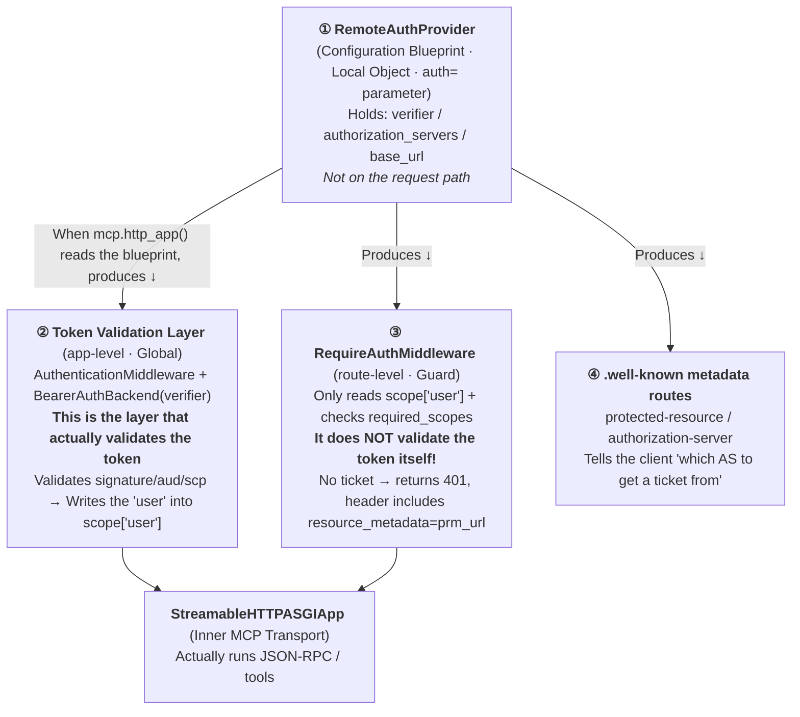
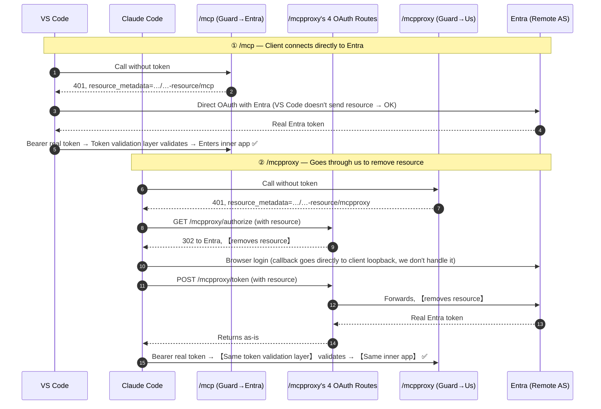

# Principle: How `/mcpproxy` Is Grafted onto FastMCP

> This article answers several "how does this actually work" questions accumulated from a complete discussion:
> 1. Why can't we use "two FastMCP servers + Nginx"? Can it be done? (**Yes, see §7**)
> 2. How does the current setup magically grow a new `/mcpproxy` path on FastMCP? (**§5**)
> 3. `RemoteAuthProvider` / `RequireAuthMiddleware` / remote authorization server / verifier — **who is who among these "auth names"**? (**§2, the core of this article**)
> 4. What is `scope["user"]`? (**§3**)
> 5. FastMCP and FastAPI are both based on Starlette; are they similar? (**§4**)
> 6. What are the inherent disadvantages of this approach? Is the risk high if the SDK changes in the future? (**§8 / §9**)

---

## 0. One-Sentence Overview

```
┌─────────────────────────────────────────────────────────────────────────┐
│  One process · One Starlette app · Two MCP endpoints                      │
│                                                                           │
│   /mcp       → 401 points to Entra's metadata     → client connects directly to Entra for token │
│   /mcpproxy  → 401 points to "our own" metadata → client goes through us, removes resource │
│                                                                           │
│   Both endpoints share the same underlying 【StreamableHTTPASGIApp + same verifier】            │
│   The only difference is the "ticket office address" written on the guard's sign (prm_url).     │
└─────────────────────────────────────────────────────────────────────────┘
```

- **Data plane** (`tools/list` / `tools/call`): Both endpoints are **exactly the same** — both use a **real Entra token**, pass through the same verifier, and hit the same inner app.
- **Token acquisition handshake** (OAuth dance): **There is a difference** — `/mcpproxy` adds an extra hop through us, removing the RFC 8707 `resource` parameter to bypass [`AADSTS9010010`](./bug-analysis-aadsts9010010-mcp-resource-parameter-collides-with-entra-v2.md).
- The only part that truly "touches the SDK internals" is a ~15-line function `find_streamable_asgi_app` (**§5.3**); everything else is clean, public Starlette usage.

---

## 1. Name Explosion: First, Clarify "Who is Local, Who is Remote"

The discussion contains many names with auth/remote, which are easy to confuse. First, use a "where does it live" diagram to locate them — **this is the foundation for understanding everything that follows**:

```
                          Local (your process / your container)                    Remote
   ┌──────────────────────────────────────────────────────────┐   ┌──────────────┐
   │                                                            │   │              │
   │   RemoteAuthProvider   ← A 【configuration object/blueprint】, lives locally │   │    Entra     │
   │        (auth=...)          The "Remote" in its name refers to│──▶│  (The real  │
   │           │               "the authorization server I want │   │   Remote    │
   │           │                to connect to is remote",        │   │   Authorization│
   │           │               NOT that it itself is remote!    │   │   Server AS)│
   │           │  Produces ↓                                    │   │              │
   │   ┌───────┴─────────────────────────────────┐              │   │  · Issues token│
   │   │ AuthenticationMiddleware + verifier (token validator) │   │  · JWKS public key│
   │   │ RequireAuthMiddleware (guard)            │              │   │  · /authorize│
   │   │ .well-known metadata routes              │              │   │    /token    │
   │   └───────────────────────────────────────────┘             │   │              │
   │                                                            │   └──────────────┘
   └──────────────────────────────────────────────────────────┘
```

> ★ **Easiest thing to get wrong**: The "Remote" in `RemoteAuthProvider` **describes that the "authorization server (Entra) is remote"**,
> it itself is a **local configuration object running in your process**. Don't mistake it for "some remote service."

---

## 2. Four-Piece Authentication Analysis (Core of this article, must understand this diagram)

`RemoteAuthProvider`, the token validation layer, `RequireAuthMiddleware`, and the inner app — these **four are not the same thing, nor are they a single instance**.
They have a relationship of **"one blueprint → produces three runtime parts"**.

### 2.1 Blueprint → Output: Their Production Relationship



### 2.2 Four-Piece Definition + One-Sentence Mnemonic

| # | Name | Layer | What it is / Does | What it is **NOT** | One-Sentence Mnemonic |
|---|---|---|---|---|---|
| ① | **RemoteAuthProvider** | FastMCP Configuration Layer | **Configuration blueprint** passed via `auth=`, holds verifier + authorization server address + base_url | ❌ Not middleware, not on the request chain; ❌ Not remote | **Blueprint**: Specifies "who validates tokens, where the AS is" |
| ② | **Token Validation Layer**<br/>`AuthenticationMiddleware`+`BearerAuthBackend(verifier)` | ASGI app-level (Global) | Every request passes through it: extracts `Bearer` token → `verifier.verify_token()` validates signature/aud/scp → result stored in `scope["user"]` | ❌ Not a guard, doesn't check "sufficient permissions" | **Token Validator**: Validates authenticity, stamps "who this person is" |
| ③ | **RequireAuthMiddleware** | ASGI route-level (one per MCP route) | Acts only as a guard: checks if `scope["user"]` exists and `required_scopes` are sufficient; if not, returns 401 with header `resource_metadata="<prm_url>"` | ❌ **It does NOT validate the token at all** (source code only does `scope.get("user")`) | **Guard**: Checks if you have a stamp; if not, points you to "prm_url to get a ticket" |
| ④ | **Remote Authorization Server = Entra** | Remote | The server that actually issues tokens; `/authorize`, `/token`, JWKS public keys are all there | ❌ Not RemoteAuthProvider (that's just a local configuration pointing to it) | **Issuing Authority** |

> **Source code evidence for ③** (`mcp/server/auth/middleware/bearer_auth.py:78-96`): The first thing `RequireAuthMiddleware.__call__` does is
> `auth_user = scope.get("user")`, `if not isinstance(auth_user, AuthenticatedUser): return 401`. **It never touches the token,
> it only reads the stamp placed by ② (the token validation layer).** This explains why both endpoints can share the same verifier — because **token validation happens at the outer global layer,
> independent of which specific guard is used**.

### 2.3 How a Request Actually Passes Through These Layers

```
  HTTP Request  ──►  ┌───────────────────────────────────────────────┐
  Bearer <tok>    │ ② AuthenticationMiddleware (app-level, Global)   │
                  │    BearerAuthBackend: verifier.verify_token()    │  ← The only place token is validated
                  │    Success → scope["user"] = AuthenticatedUser(..)│
                  └───────────────────┬───────────────────────────┘
                                      │  (scope now has "user")
              Routed by path ─────────┼───────────────────────────┐
                                      ▼                           ▼
            ┌─────────────────────────────────┐   ┌──────────────────────────────────┐
            │ ③ RequireAuthMiddleware  (/mcp)  │   │ ③ RequireAuthMiddleware (/mcpproxy)│
            │    prm_url = …/oauth-…-resource/mcp│   │   prm_url = …/oauth-…-resource/mcpproxy│
            │    No user → 401 points to Entra  │   │   No user → 401 points to 【us】        │
            └────────────────┬────────────────┘   └────────────────┬─────────────────┘
                             └───────────────┬──────────────────────┘
                                             ▼
                          ┌────────────────────────────────────────┐
                          │  StreamableHTTPASGIApp (the same one!)   │
                          │  + Your UserAuthMiddleware(FastMCP layer)│
                          │  → Dispatches tools/list, tools/call ... │
                          └────────────────────────────────────────┘
```

**Understanding this diagram is the fulcrum for understanding the entire design**: Token validation (②) is global and exists in a single instance; the guard (③) has one per route, differing only in `prm_url`;
the inner app is **the same one**. The so-called "adding a proxy" is merely **mounting an additional guard with a different `prm_url`**, directing the client to a different ticket office.

---

## 3. What is `scope["user"]` (and the Two Meanings of "scope")

### 3.1 First, Resolve the Ambiguity: Two "scopes"

| "scope" | What it is | Where it appears |
|---|---|---|
| **OAuth scope** | Permission string, e.g., `user_impersonation` | OAuth request parameter / token's `scp` claim |
| **ASGI scope** | **A dictionary per request**, containing method/path/headers/user… | Entry point of every ASGI app `async def __call__(self, scope, receive, send)` |

The `scope` in `scope["user"]` is the **latter (ASGI scope dictionary)**, and has nothing to do with the OAuth `scope`.

### 3.2 The Origin and Flow of `scope["user"]`

```
  verify_token(tok) succeeds
        │
        ▼
  BearerAuthBackend.authenticate() returns (AuthCredentials(scopes), AuthenticatedUser(auth_info))
        │
        ▼
  Starlette's AuthenticationMiddleware writes it into the ASGI dictionary:
        scope["user"] = AuthenticatedUser(...)   ← holds .access_token (contains claims) and .scopes
        scope["auth"] = AuthCredentials(...)
        │
        ▼
  ③ Guard reads scope["user"] to decide whether to allow
        │
        ▼
  In your tool, get_access_token() → .claims["oid"] → OBO / group gating
```

In one sentence: **`scope["user"]` = the carrier of "who is behind this request and whether they have been validated"** (an `AuthenticatedUser` object).
The token validation layer (②) writes the "user" into it, and the guard (③) and your tool read the "user" from it. The source of `oid` in your `main.py` is right here.

---

## 4. FastMCP vs FastAPI vs Starlette: Similar, but Don't Confuse "Inheritance vs Composition"

Both are based on Starlette, but the relationship differs:

```
   Starlette (ASGI routing kernel: app.router.routes is a list of Route)
        ▲                                   ▲
        │ Inheritance (is-a)                 │ Composition / Production (has-a / produces)
        │                                   │
   FastAPI                              FastMCP
   class FastAPI(Starlette)            class FastMCP  (Self-contained protocol server)
   → Itself is a Starlette app         → mcp.http_app() 【produces】 a Starlette app
   → uvicorn.run(fastapi_app) ✅        → uvicorn.run(mcp) ❌   Must run(mcp.http_app())
```

### 4.1 The Most Critical Difference: The Semantics of Decorators are Completely Different

| decorator | What it registers | How many URLs it creates |
|---|---|---|
| `@app.get("/foo")` (FastAPI) | One HTTP route | **1 URL** `/foo` |
| `@mcp.tool` (FastMCP) | One **MCP protocol tool** (JSON-RPC method) | **0 new URLs** — all tools reuse the **same** `/mcp`, dispatched via `tools/call {name}` |
| `@mcp.custom_route("/health")` (FastMCP) | One **real** Starlette route | **1 URL** `/health` ← **this is equivalent to `@app.get`** |

```
  FastAPI:   One function ──► One URL          (@app.get one-to-one)
  FastMCP:   Many tools ──► All squeezed into one URL /mcp  (@mcp.tool multiplexed, JSON-RPC dispatch)
             Want a real URL ──► Use @mcp.custom_route
```

> Therefore, `diagnose_bash` / `action_bash` **do not each become a URL**; they are all behind `/mcp`, dispatched by JSON-RPC via `name`.
> In FastMCP, "decorator = URL route" only holds true for `@mcp.custom_route` (`/health` in `main.py:254` is an example).

---

## 5. How `/mcpproxy` is "Spliced" onto the Already-Built App (Principle)

The core idea is just one sentence: **Starlette's route table `app.router.routes` is a mutable list; inserting a `Route` adds a path.**

### 5.1 Mechanism: Prepend to the Route Table List

```
  app = mcp.http_app()                    # Get the Starlette app
  app.router.routes  ──► [Route("/mcp"...), Route(".well-known/...mcp"), Route("/health"), ...]

  What install_proxy_endpoint does (mcpproxy.py:200):
  app.router.routes[:0] = new_routes      # Insert 5 new Routes at the very beginning
                          │
                          ▼
  app.router.routes  ──► [★/.well-known/...mcpproxy, ★/mcpproxy/authorize,
                          ★/mcpproxy/token, ★/mcpproxy, ...original /mcp ones]
```

When Starlette receives a request, it **iterates through this list in order** and dispatches to the first route whose path matches. **Adding a Route = adding a URL, it's that straightforward** —
this is standard Starlette usage, unrelated to "hacking FastMCP" (functionally equivalent to `@mcp.custom_route`, but because the app **is already built**
and the decorator can no longer be used, it's done imperatively by directly modifying the list).

### 5.2 The 5 Routes Inserted

| Route | What it does | Touches SDK Internals? |
|---|---|---|
| `/.well-known/oauth-protected-resource/mcpproxy` | Returns PRM JSON, points the AS to **ourselves** | ❌ Pure Starlette |
| `/.well-known/oauth-authorization-server(/mcpproxy)` ×2 | Returns AS metadata, **omits** `registration_endpoint` (→ client doesn't DCR) | ❌ Pure Starlette |
| `/mcpproxy/authorize` | `params.pop("resource")` → 302 to Entra | ❌ Pure Starlette |
| `/mcpproxy/token` | `form.pop("resource")` → httpx forwards to Entra → returns response as-is | ❌ Pure Starlette + httpx |
| `/mcpproxy` (MCP endpoint itself) | Reuses the inner app from `/mcp`, only changes `prm_url` | ✅ **The only one that touches internals** |

**The first 4 routes don't touch any FastMCP internals.** The actual "resource removal" happens in `/mcpproxy/authorize` + `/mcpproxy/token`,
**not in the guard** — the guard only returns 401 and points to an address; it's the `prm_url` that directs the client to these two resource-removing routes.

### 5.3 The Only "Internal Surgery": `find_streamable_asgi_app`

For the 5th route, we need to "make `/mcpproxy` run the exact same tools as `/mcp`, share the same session manager, but point the 401 to us."
The approach is to **reach into the already-built route for `/mcp`, extract the inner ASGI app, and re-wrap it with a new guard**:

```
  Find Route("/mcp") ──► Its endpoint is RequireAuthMiddleware(guard)
                              │
                              │  .app  ← Extract the inner app
                              ▼
                        StreamableHTTPASGIApp  (Shared transport app)
                              │
                              │  Re-wrap with a 【new】 RequireAuthMiddleware:
                              ▼
        RequireAuthMiddleware(streamable, required_scopes, prm_url=".../mcpproxy")
                              │
                              ▼
                     Mount to Route("/mcpproxy")
```

**This is the only action in the entire article that "a decorator cannot do"** — a decorator would only "add a route pointing to a new function," whereas this is "reusing an existing
internal object and remounting it." It relies on two SDK internal assumptions (both in `mcpproxy.py`, ~20 lines total):
1. The `/mcp` route is wrapped by `RequireAuthMiddleware`, and the inner app is attached to `.app` (`find_streamable_asgi_app`, `mcpproxy.py:57-73`);
2. The constructor signature of `RequireAuthMiddleware(app, required_scopes, resource_metadata_url)` (`mcpproxy.py:170`; confirmed by source `bearer_auth.py:60-65`).

**Friendly failure mode**: If the structure doesn't match, `find_streamable_asgi_app` directly raises `RuntimeError` (`mcpproxy.py:73`), **crashing on startup, caught by CI/deployment**, not a silent runtime failure; there's also the `MCPPROXY_ENABLED` toggle as a fallback.

---

## 6. Complete Sequence for Both Endpoints (Token Acquisition Differs, Data Plane is the Same)



**Conclusion**:
- **Token acquisition phase**: `/mcpproxy` adds an extra hop through us, removing `resource` (this is where the bug is fixed); those hops **only happen once during token acquisition/refresh**.
- **Data plane**: Both sides hold a **real Entra token**, pass through the **same token validation layer**, and hit the **same inner app** — `oid`/OBO/group gating requires **zero changes**, **zero additional hops**.

---

## 7. Trade-off: Single-App Dual-Endpoint vs Two Servers + Nginx

Your intuition is correct — **"two FastMCP servers + Nginx" is entirely feasible; nothing prohibits it.** The key is to first separate two orthogonal concerns:

```
   Topology (where it runs)          ≠          Bug-fixing mechanism (remove resource)
   1 process vs 2 processes + Nginx            Removing resource must happen in 【application code (Python)】
                                                Nginx is good at 【routing by path】,
                                                NOT good at 【modifying OAuth request bodies】 (especially /token's form body,
                                                native nginx doesn't modify body; requires OpenResty/Lua)
```

So even with two servers + Nginx, **the "remove resource + serve metadata" part still needs to be written in Python** (in the second server using the public
`@mcp.custom_route`); Nginx only handles routing. Its **real benefit** is: the second server natively produces its own `/mcp` guard, **thereby eliminating the internal surgery in §5.3**.

| Dimension | **Current: Single App Dual Endpoint** | **Two Servers + Nginx** |
|---|---|---|
| Process/Memory | 1, shared verifier/MSAL/cache/Redis pool → **More efficient** | 2, all of the above doubled |
| Nginx / Extra Abstraction | None | One more layer of configuration (or use ACA dual ingress to avoid it) |
| Touches FastMCP Internals | One place (`find_streamable_asgi_app`, ~15 lines, fail-loud) | **Zero** (each server is native) |
| Tool Code Reuse | Natural (same mcp instance) | Requires extracting a `build_server(auth)` factory |
| Fault Isolation | ❌ Shared fate (one crashes, both go down) | ✅ Can be isolated |
| Independent Scaling/Deployment | ❌ Not possible | ✅ Possible |
| Data Plane Extra Hops | 0 | 0 (Nginx hop is on the same machine, negligible) |

**Recommendation**: Your current scale is "small usage, single container" → **keep the single app** (simplest operations, most resource-efficient, controllable coupling with fail-loud behavior).
When you need **independent scaling / independent deployment / fault isolation**, switch to two servers (at that point, you might not even need Nginx; just use ingress routing).

---

## 8. Inherent Disadvantages of This Approach (Excluding SDK Failure Risk)

**First, correct a cost intuition**: In terms of resources, the single app is **actually more efficient** (shared verifier/MSAL/cache/Redis pool; two processes would double them);
the "extra hops" only occur **during token acquisition/refresh**, with zero extra hops on the data plane. So saying "resources are the same" is a conservative statement.

The real inherent disadvantages (sorted by "will bite you at your current scale"):

| # | Disadvantage | Explanation | When it Bites |
|---|---|---|---|
| 1 | **Shared fate, no fault isolation** | Both endpoints share the same process and app; process OOM/deadlock/crash → **VS Code and Claude Code both go down**; a bad deploy affects both | **Any scale** (if availability matters) |
| 2 | **Shared session manager, no bulkhead** | Same StreamableHTTP session manager; a noisy client on `/mcpproxy` opening many SSE streams will affect `/mcp` | Medium scale onwards |
| 3 | **Cannot independently scale/tune** | Same process = same CPU/memory/replicas/env; cannot scale only `/mcpproxy` | After scaling up |
| 4 | **You handle OAuth security, and it's embedded in the main app** | `/authorize` (prevent open-redirect), `/token` (forwarding others' tokens, don't log them) are sensitive code, sharing the process with tools; `/token`'s httpx outbound also ties your event loop to Entra's latency | **Even at small scale** |
| 5 | **You maintain two discovery documents yourself; they can drift** | `/mcp` uses Entra's metadata, `/mcpproxy` uses **hand-written** ones; fields (scopes/issuer) must match what Entra actually accepts | **Even at small scale** |
| 6 | **Order assumption for route prepending** | `routes[:0] = ...` relies on "exact paths, no earlier catch-all" to be safe; it's an implicit precondition | Rare |
| 7 | **Readability/Onboarding cost** | "Extracting the inner app and remounting it" is not intuitive (you yourself asked "how is this done"); two plain servers are easier to understand | During maintenance |

> **The core two**: **1 (shared fate)** and **4/5 (OAuth correctness is now your responsibility)** — these are the real costs of the single app, not resources.

---

## 9. SDK Change Risk Assessment: Low

Your judgment is correct — **if it needs fixing, it's just "find the inner app and swap the `prm_url` again"**; the fix surface is minimal. Probability estimation by scenario:

| Scenario | Probability | Reason |
|---|---|---|
| The `Route→RequireAuthMiddleware→inner app` structure **disappears** | **Very low** | `RequireAuthMiddleware` + `resource_metadata` is **directly required by the MCP specification / RFC 9728**; FastMCP has no incentive to remove it |
| Attribute name/wrapping method/constructor signature **changes** (minor finder adjustment needed) | **Medium** | But you only encounter this when **actively upgrading a major version**, and it **crashes on startup with RuntimeError**; the fix is just those few lines |
| Changes to the point where **the inner app cannot be extracted at all** | **Very low** | `app.router.routes` is always iterable; the inner transport app is always in the chain; worst case, peel off one more layer |
| **Completely unfixable** | **< 5%** | And there is always a fallback: revert to the two-server approach or `@mcp.custom_route` |

**Two safety nets make the risk almost negligible**: ① **Pin the fastmcp version** (only need to adjust when actively upgrading); ② If it really gets bad, fall back to the two-server plan — **you will never be backed into a corner**.

**Two recommended safeguards** (optional, make the risk explicit):
1. A `test_mcpproxy_boot` smoke test: assert that `/mcpproxy` starts up = turn "SDK structure hasn't changed" into a CI assertion;
2. At the `find_streamable_asgi_app` / `RequireAuthMiddleware(...)` locations, clearly document the assumed structural dependencies (comments + assertions) for future maintainers.

---

## 10. Quick Reference: Mental Model Summary

```
┌─ Name Clarification ───────────────────────────────────────────────────────────┐
│  RemoteAuthProvider  = Local 【Configuration Blueprint】 (Remote means AS is remote, not itself) │
│  Token Validation Layer (verifier) = app-level global, 【the only place that validates tokens】, fills scope["user"]│
│  RequireAuthMiddleware = route-level 【Guard】, only reads scope["user"], points to prm_url    │
│  Remote Authorization Server = Entra itself, issues tokens                              │
└──────────────────────────────────────────────────────────────────────────────────────┘
┌─ Two Meanings of scope ─────────────────────────────────────────────────────────┐
│  OAuth scope = Permission string (user_impersonation)                              │
│  ASGI scope  = Dictionary per request; scope["user"] = validated "user"            │
└──────────────────────────────────────────────────────────────────────────────────────┘
┌─ FastMCP vs FastAPI ─────────────────────────────────────────────────────────────────┐
│  FastAPI: Inherits Starlette; @app.get = 1 URL                             │
│  FastMCP: Produces Starlette (http_app()); @mcp.tool = squeezed into one URL /mcp    │
│           For a real URL, use @mcp.custom_route                              │
└──────────────────────────────────────────────────────────────────────────────────────┘
┌─ How /mcpproxy is Created ───────────────────────────────────────────────────────────────┐
│  90%: Prepend Route to app.router.routes (= equivalent to decorator, clean)          │
│  10%: find_streamable_asgi_app extracts inner app and remounts (only internal surgery, ~15 lines)   │
└──────────────────────────────────────────────────────────────────────────────────────┘
┌─ Trade-off in One Sentence ─────────────────────────────────────────────────────────┐
│  Single app: Saves resources, simple operations, controllable coupling with fail-loud, but shared fate + OAuth is your responsibility   │
│  Two servers: Fault isolation + independent scaling + zero internal coupling, but +processes +Nginx +factory refactoring │
│  → At current scale (small usage, single container), keep the single app; switch to two servers when isolation/independent scaling is needed         │
└──────────────────────────────────────────────────────────────────────────────────────┘
```

---

## References

- [`Implementation Description - Plan A - mcpproxy resource stripping proxy - Code and Security Analysis`](./implementation-notes-plan-a-mcpproxy-resource-stripping-proxy.md) — Line-by-line code analysis + security analysis (the implementation foundation of this article)
- [`Bug Analysis - AADSTS9010010 - …`](./bug-analysis-aadsts9010010-mcp-resource-parameter-collides-with-entra-v2.md) — Why resource needs to be removed (root cause)
- [`Plan - mcpproxy - Same Container Dual Endpoint - …`](./plan-same-container-dual-endpoints-mcp-and-mcpproxy-two-approaches-compared.md) — Plan A vs B selection
- `src/mcp-server/mcpproxy.py` / `src/mcp-server/main.py`
- `mcp/server/auth/middleware/bearer_auth.py` — `RequireAuthMiddleware` / `BearerAuthBackend` source code (referenced in §2.2)