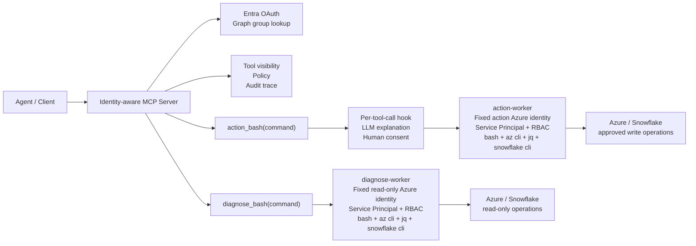

# Identity-aware Shell MCP for Azure DataOps Agents

核心判断：

> 不要把 Azure CRUD 都包成 MCP tool。
>
> 保留 `bash + az cli` 作为通用执行 substrate。
>
> 但不要让 agent 直接拥有无边界 shell。
>
> MCP 做身份、策略、路由、审计；worker 做隔离执行；skills 定义操作判断。

---

## 1. Overall Architecture



---

## 2. Identity Model

核心边界是 identity-driven。

系统里有两类身份：

```text
User identity   = 谁在请求能力
Worker identity = 实际用哪个 Azure identity 执行命令
```

用户身份通过 Entra OAuth login 获取。MCP server 再通过 Graph API 查询 user object id 和 AD groups，用来决定：

- 用户能看到哪些 tools
- 用户能不能调用 `action_bash(command)`
- 哪些 action 需要 human consent
- audit trace 应该记录到哪个 user

但 AI 实际执行 Azure 操作时，不使用用户自己的 Azure 权限。

实际执行命令的是固定的 worker identity：

- `diagnose-worker` 使用 read-only Service Principal，只配置对目标资源的读权限。
- `action-worker` 使用单独的 action Service Principal，只配置允许执行的写权限。
- 每个 Service Principal 都通过 Azure RBAC 限定 subscription / resource group / resource scope。

这个设计避免了一个高权限 admin 用户把自己的全部 Azure 权限直接暴露给 agent。

即使某个 admin 本身有删除 Resource Group 的权限，agent 通过 MCP 执行时也只能使用对应 worker 的 Service Principal 权限。

一句话：

```text
User identity decides authorization and audit.
Worker identity decides Azure execution boundary.
```

---

## 3. Layer Responsibilities

### MCP Server = Control Plane

MCP server 负责：

- 用户 Entra OAuth login
- 通过 Graph API 获取 user object id 和 AD groups
- 根据 group 决定 tool visibility
- 执行 policy check
- 记录 audit trace / LangSmith trace
- 将 shell command route 到正确 worker
- 承载 semantic workflow tools

MCP server 不直接跑 `az cli`，也不持有高权限 Azure execution identity。

---

### diagnose-worker = Read-only Execution Plane

`diagnose-worker` 负责执行诊断命令：

- ADF pipeline run 查询
- activity run 查询
- Log Analytics 查询
- Storage metadata 查询
- Snowflake query history 查询
- SHIR / VM status 查询
- Key Vault metadata 查询

它使用固定的 read-only Azure identity，例如：

```text
diagnosis-sp
```

即使 agent 生成了危险命令，例如：

```bash
az vm delete ...
az datafactory trigger stop ...
az storage blob delete-batch ...
```

也应该因为 `diagnosis-sp` 的 RBAC 不足而失败。

---

### action-worker = Gated Write Execution Plane

`action-worker` 负责执行写操作，例如：

- rerun pipeline
- stop / start trigger
- restart VM
- rotate secret
- update config

但它不应该裸跑命令。所有 `action_bash(command)` 调用都必须先经过 per-tool-call hook。

---

## 4. MCP Tools

MCP 不需要暴露大量 Azure CRUD tools，例如：

```text
get_pipeline_run()
get_activity_runs()
get_vm_status()
list_storage_blobs()
```

这些能力可以由 `bash + az cli` 覆盖。

MCP 暴露两类高价值 tool。

### Shell Tools

```text
diagnose_bash(command)
action_bash(command)
```

`diagnose_bash(command)`：

- 用于 read-only 诊断
- route 到 `diagnose-worker`
- 不需要 human approval
- 依赖 read-only Service Principal 和 RBAC 控制风险

`action_bash(command)`：

- 用于写操作
- route 到 `action-worker`
- 必须经过 per-tool-call hook
- human consent 后才执行

---

### Semantic Workflow Tools

这些是更值得长期沉淀的资产：

```text
collect_failure_evidence(run_id)
assess_pipeline_rerun_safety(run_id)
classify_failure_boundary(run_id)
validate_data_load_idempotency(run_id)
summarize_incident_timeline(run_id)
```

这类 tool 的“大脑”在 MCP server 里，实际查询仍然 route 到 worker。

例如：

```text
collect_failure_evidence(run_id)
  -> MCP server 编排 workflow
  -> diagnose-worker 执行 az cli / snowflake cli
  -> MCP server 聚合 evidence
  -> 返回 structured evidence
```

---

## 5. Per-tool-call Hook

`action_bash(command)` 的安全边界不应该依赖复杂 JSON schema。

更简单的设计是：当 MCP server 调用 `action_bash(command)` 时，自动触发一个 pre-execution hook。

流程：

```text
1. Receive action_bash(command)
2. Check caller identity and group permission
3. Call LLM to explain the command and likely blast radius
4. Ask human reviewer for consent
5. If approved, execute command on action-worker
6. If rejected, return rejected result
7. Record full audit trace
```

agent 只需要传：

```json
{
  "command": "az datafactory pipeline create-run ..."
}
```

hook 内部生成给人的解释，例如：

```text
This command will rerun an Azure Data Factory pipeline.
Target: daily_customer_load
Risk: may duplicate data if the previous run partially loaded downstream tables.
Approve?
```

批准后，tool 正常返回：

```json
{
  "exit_code": 0,
  "stdout": "...",
  "stderr": ""
}
```

拒绝时，返回：

```json
{
  "exit_code": null,
  "stdout": "",
  "stderr": "Action rejected by human approval hook."
}
```

LLM 只负责解释，不是最终安全边界。

真正的安全边界是：

- user group permission
- MCP policy
- human consent
- worker Service Principal / Azure RBAC
- audit trace

一句话：

```text
LLM explains.
Human approves.
Policy enforces.
RBAC contains damage.
```

---

## 6. Skill, Tool, Worker, MCP Boundary

```text
Skill = 调查策略和操作判断
Semantic workflow tool = 高频流程固化
Shell tool = 通用命令入口
Worker = 隔离执行环境
MCP = 身份、策略、路由、审计
```

例如 ADF failure triage skill 可以规定：

```text
Default path:
1. Call collect_failure_evidence(run_id)
2. Review required evidence:
   - pipeline run status
   - failed activity
   - activity error message
   - linked service
   - integration runtime
   - storage output
   - Snowflake query status
   - Log Analytics errors

If confidence is high:
  produce diagnosis

If confidence is low:
  enter open investigation mode
  use diagnose_bash(command)
  only run read-only commands

Never call action_bash(command) without human consent hook.
```

---

## 7. Read / Write Routing

简单规则：

```text
read command  -> diagnose_bash(command) -> diagnose-worker
write command -> action_bash(command)   -> approval hook -> action-worker
```

例子：

```text
collect_failure_evidence      -> read-only -> diagnose-worker
assess_pipeline_rerun_safety  -> read-only -> diagnose-worker
rerun_pipeline                -> write     -> approval hook -> action-worker
restart_shir_vm               -> write     -> approval hook -> action-worker
```

---

## 8. Why Not Centralized Shared az login

不要在 MCP server 里维护一个 centralized shared `az login`。

风险：

- token cache 共享
- subscription context 污染
- 多用户身份串扰
- command 并发难隔离
- action blast radius 太大

所以：

> MCP server 不跑 `az cli`。
>
> `az cli` 只在 worker container 里跑。
>
> 每个 worker 使用固定的 Service Principal，并用 Azure RBAC 限定权限边界。

---

## 9. Why This Is Not Over-abstracted

过度抽象是把每个 Azure CRUD API 都包成 MCP tool。

例如：

```text
get_pipeline_run()
get_activity_runs()
get_vm_status()
list_storage_blobs()
```

这些会逐渐被：

```text
bash + az cli + strong model
```

覆盖。

但这个 MCP 的价值不是 CRUD wrapper，而是 identity-aware control plane。

它解决的是：

- 谁可以看到什么 tool
- 哪个身份执行命令
- 哪些操作需要 human consent
- 如何审计
- 如何 trace
- 如何阻断高危动作
- 如何把组织判断编码进 workflow

这些不会因为模型变强而消失。

---

## 10. Final Design

```text
Agent 不直接拥有 Azure 权限。

Agent 通过 identity-aware MCP 请求能力。

MCP 根据用户 Entra identity 和 AD group 决定 tool visibility。

普通诊断命令通过 diagnose_bash(command) route 到 read-only diagnose-worker，并由 diagnosis Service Principal 执行。

高风险写命令通过 action_bash(command) 触发 per-tool-call hook：
LLM 解释操作，human consent 通过后，才 route 到 action-worker，并由 action Service Principal 执行。

常见调查路径沉淀成 semantic workflow tools。

领域判断沉淀成 skills、policies、evals、incident memory。
```

核心 slogan：

> `az cli + bash` as execution substrate;
>
> MCP as identity / policy / routing control plane;
>
> per-tool-call hook as human approval boundary;
>
> skills as operational cognition.
