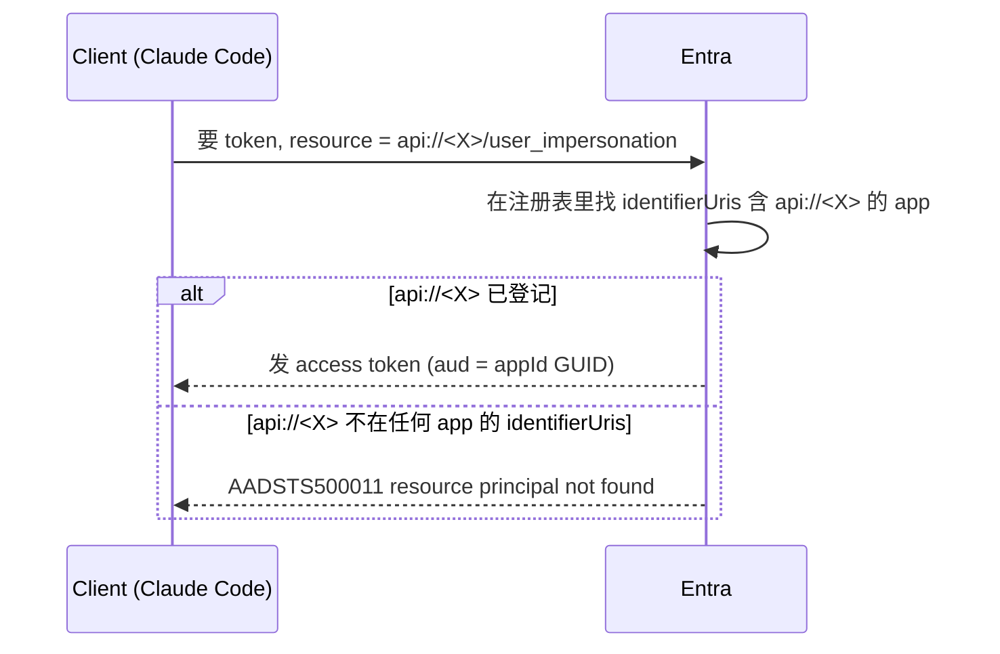

# Bug 剖析：AADSTS500011 —— Application ID URI 的 appId 形式缺失

> 现象：Claude Code 连 Cloud MCP（重新授权时）报
> `AADSTS500011: The resource principal named api://88de6a37-… was not found in the tenant`。
> 结论先行：**不是代码 bug、不是容器部署问题，是 Entra app 注册上"客户端点名用的那个 URI"没登记**。
> 与 [`AADSTS9010010`](Bug剖析-AADSTS9010010-MCP的resource参数撞上Entra-v2.md)（`resource` 参数撞 Entra v2）是**两个不同的错**。

---

## 1. 这个 issue 到底是什么

### 1.1 一个 app 上有两个不同的身份

| | 是什么 | 例子 | 谁在用 |
|---|---|---|---|
| **App ID（Client ID）** | app 注册的 GUID 身份 | `88de6a37-…` | server 校验 token 的 `aud`、OBO 换 Graph 令牌 |
| **Application ID URI（identifierUri）** | **别人想调用这个 API 时，用来"点名"它的地址** | `api://dataops-aca-mcp-server` | client 拿 token 时报给 Entra 的 resource |

**这两个是不同的东西**：App ID 是 GUID，identifierUri 是一个字符串地址。App ID 的 GUID **不会**自动成为一个 identifierUri。

### 1.2 拿 token 的机制：Entra 按 identifierUri **精确字符串匹配** resource

client 要 token 去调某个 API，必须把那个 API 的 **Application ID URI** 报给 Entra；Entra 拿这个字符串去注册表里找——找到哪个 app 注册了这个 URI，就给哪个发 token。



### 1.3 本 bug 的错位

- **server（FastMCP）广播的 scope** 是用 **App ID 的 GUID** 拼的：`api://<appId>/user_impersonation`（见 `mcpproxy.py:98`）。
- **但 app 上当时注册的 identifierUri 是友好名** `api://dataops-aca-mcp-server`。
- client 拿 `api://<appId>` 去点名 → Entra 注册表里没有这个 URI → **`AADSTS500011`**。

**关键**：SP（企业应用）在、`user_impersonation` scope 也在、一切正常——**唯独 client 用来点名的那个字符串没被登记成这个 API 的 URI 之一**。纯粹是"地址对不上"的查找失败，跟容器里跑什么代码、跑哪个镜像**毫无关系**（错发生在拿 token 阶段，请求根本没到容器）。

> **类比**：server 到处发名片说"寄到 **123 Main St**"（`api://<appId>`），房产登记处却只把这栋楼登记在"**456 Oak Ave**"（`api://friendly`）名下。寄到 123 Main St 的信全被退回"查无此地址"——楼好好的、门开着，只是这个地址没登记。修法：给这栋楼**登记 123 Main St 这个别名**（一个 app 可以有多个 Application ID URI）。

### 1.4 和 AADSTS9010010 的区别

| | 触发点 | 修法 |
|---|---|---|
| **9010010** | client 按 RFC 8707 发 `resource` 参数，撞 Entra v2 | `/mcpproxy` 剥掉 `resource` 参数 |
| **500011（本文）** | client 点名的 `api://<appId>` 不在 app 的 identifierUris | 给 app 补 `api://<appId>` 这个 URI |

`/mcpproxy` 治不了 500011——它删的是 `resource` 参数，不管 scope 里那个 URI 存不存在。

### 1.5 当前状态

**方案 A（临时补丁，2026-07-18）**：post-deploy 补回 `api://<appId>` 后，app 的 `identifierUris` 曾为 `["api://88de6a37-…"]`，Claude Code Cloud MCP 重新授权成功。缺点见 §2.2（converge 静默复发）。

**方案 B（根治，已实现于分支 `fix-identify-uri-overwrite`）**：改由 server 广播**友好名** `api://<name>-mcp-server` 作为 scope 前缀，让 Bicep 声明的 `identifierUris` 成为唯一真相，**删掉 post-deploy 补别名那步**。改动见 §3.1（6 处已全部落地 + Bicep 侧新增 `mcpIdentifierUri` output/env 把值喂给 server）。

**已部署并验证（2026-07-18）**：`az acr build` 出新镜像 `mcp-server:identifier-uri-fix` → `az deployment sub create` converge（`name=dataops-aca`、`resourceGroupName=dataops-aca-rg`、`mcpClientSecret` 取自 live 不重置）→ Succeeded。验证结果：
- app 的 `identifierUris` 由 `["api://88de6a37-…"]` **converge 成 `["api://dataops-aca-mcp-server"]`**（identity.bicep Graph）。
- 容器滚到新镜像，env `MCP_IDENTIFIER_URI=api://dataops-aca-mcp-server`，OBO secret 未被重置（长度 40，非占位符）。
- `/mcp` 与 `/mcpproxy` 的 protected-resource metadata `scopes_supported` 均为 `["api://dataops-aca-mcp-server/user_impersonation"]`——**广播的 scope 与 app 注册的 identifierUri 现已一致**（正是 500011 缺的那个对齐）。`/health` ok。
- 剩余：真人在 Claude Code clear auth 走一遍交互式登录做端到端确认（metadata 与 identifierUri 已对齐，理论上不再 500011）。

---

## 2. 为什么要在 post-deployment 单独跑一条命令

### 2.1 根因：Bicep 声明不了 `api://<appId>`（先有鸡还是先有蛋）

`api://<appId>` 里那个 GUID 是 app **创建之后**才生成的。Bicep 在创建同一个 app 的那一刻，**引用不到自己还没出生的 appId**（循环依赖）。所以 `identity.bicep` 只能写一个**静态友好名**：

```bicep
// identity.bicep —— 只能设静态 URI，引用不到自己的 appId
identifierUris: [
  'api://${name}-mcp-server'   // = api://dataops-aca-mcp-server
]
```

而 FastMCP 按 **App ID 形式**广播 scope。于是 `api://<appId>` 这个 client 需要的 URI，**Bicep 没法声明式地设**，只能**部署完之后**、appId 已经存在了，再单独补一条命令：

```bash
# write-env.sh —— post-deploy 补 api://<appId>（否则 sign-in → AADSTS500011）
az ad app update --id "$mcp_app_id" --identifier-uris "api://${mcp_app_id}"
```

**这就是"为什么要在 post-deploy 单独跑一条命令"**：不是懒得写进 bicep，是 bicep **结构上写不了**这个依赖自身 GUID 的值。

### 2.2 更糟的一点：它是**静默复发**的漂移

`az ad app update --identifier-uris` 是**覆盖式**的（替换整个数组，不是追加）。而 `main.bicep` 每次 **converge 部署**都会跑 `identity.bicep`，把 `identifierUris` **重置回只剩友好名**，悄悄把 post-deploy 补的 `api://<appId>` 冲掉。

更隐蔽的是：**Microsoft.Graph 资源在 `az deployment what-if` 里是 Unsupported/不可见的**，所以这次重置在 what-if 里**根本看不到**（会被算进那堆 "Unsupported" 里）。

**时间线（本次事故）**：
1. 某次 write-env.sh 补过 `api://<appId>` → client 能连。
2. 一次 `main.bicep` converge 部署跑了 identity 模块 → `identifierUris` 被重置成只剩 `api://dataops-aca-mcp-server`，静默丢了 appId 形式。
3. 旧的缓存 token 仍能用 → 没人察觉。
4. 在 Claude Code 里 clear auth、强制重新授权 → 撞上 500011。

> 所以这条 post-deploy 命令**不是一次性的**，而是"**每次 converge 之后都要重跑**"。这一点在 [部署文档](../oid-log-tracking/部署文档-从main.bicep完整部署ACA栈-参数密钥漂移与验证.md) 里只在 §8 冷部署附录提了，没进 §4 收敛流程 / §7 漂移清单——是那份 doc 的缺口（对 OBO 密钥的同类漂移做了防护，却漏了 identifierUri）。

---

## 3. 从代码层：如果要改成友好名，具体改什么

**目标**：让 server 广播 `api://dataops-aca-mcp-server/user_impersonation`（Bicep 能声明式拥有的那个）。这样**根治漂移**——bicep 是唯一真相，不再需要 post-deploy 补别名。

### 3.1 要改的地方

| # | 文件 / 位置 | 现在 | 改成 |
|---|---|---|---|
| 1 | `mcpproxy.py:98` | `api_scope = f"api://{mcp_app_id}/user_impersonation"` | 读友好名，如 `api_scope = f"{IDENTIFIER_URI}/user_impersonation"` |
| 2 | `main.py` 的 `/mcp` 直连路径 | `AzureJWTVerifier(client_id=MCP_APP_ID, required_scopes=["user_impersonation"])` 由 FastMCP 内部按 `api://<client_id>` 广播 resource | **已确认 FastMCP 原生支持**：`AzureJWTVerifier(..., identifier_uri=IDENTIFIER_URI)`。它的 `scopes_supported` 属性用 `identifier_uri` 拼前缀（进 `/mcp` protected-resource metadata），而 `audience=[client_id, identifier_uri]`——**GUID 形式的 `aud` 照样通过校验**（正是 §3.2），无需库级定制 |
| 3 | server 配置 | 无 | 新增 env，如 `MCP_IDENTIFIER_URI=api://dataops-aca-mcp-server`，喂给 1、2 |
| 4 | `opencode.json` | 写死 `"scope": "api://88de6a37-…/user_impersonation"` | 改成 `api://dataops-aca-mcp-server/user_impersonation` |
| 5 | `tests/e2e_deployed.py` | `SCOPES = [f"api://{MCP_APP_ID}/user_impersonation"]` | 改成友好名 |
| 6 | write-env.sh | post-deploy 补 `api://<appId>` | **删掉这一步**（不再需要；bicep 的友好名就是真相） |

> 做**发现**的 client（Claude Code / VS Code）会**自动跟着 server 广播的新 scope 走**，不用改；只有 **hardcode 了 scope 的地方**（opencode、e2e）要手改。

### 3.2 一个容易误解的点：改 scope **不影响 token 校验**

会不会"scope 改了，server 就不认这个 token"？**不会**：

- **identifierUri 只在"client 点名 resource"这一步用**，决定 Entra 能不能找到这个 API。
- **token 发出来后，它的 `aud` 是 App ID 的 GUID**（v2 token），跟 client 当初用哪个 URI 点名无关。
- server 的 `AzureJWTVerifier(client_id=MCP_APP_ID)` 校验的就是这个 GUID。

所以 client 无论报 `api://<appId>` 还是 `api://friendly`，Entra 发的 token `aud` 都是同一个 GUID，`client_id=MCP_APP_ID` 保持不变、照单全收。**换 scope 只改"点名用的地址"，不改"门牌验证"。**

### 3.3 两条自洽的路（取舍）

| | 做法 | 代价 | 漂移 |
|---|---|---|---|
| **A（旧临时补丁）** | 代码用 App ID，post-deploy 补别名 | 一行命令，但**每次 converge 必须重跑** | 会静默复发，靠纪律防 |
| **B（已采用 ✅）** | 代码用友好名，bicep 声明式拥有 | 改 §3.1 那 6 处 + 重验一次 | **结构上消除** |

**已选 B**：§3.1 六处改动 + Bicep 侧 `mcpIdentifierUri` output/env 均已落地（分支 `fix-identify-uri-overwrite`），write-env.sh 的补别名步骤已删。剩下的只是重部署后跑一次 §1.5 的验证。

---

## 4. 为什么这条 post-deploy 命令能改变 app 的行为、把 bug 修好

```bash
az ad app update --id 88de6a37-… --identifier-uris "api://88de6a37-…"
```

### 4.1 它改的是 **Entra app 注册**，正好是 token 请求解析的对象

500011 发生在 **Entra 解析 resource** 那一步（§1.2 的时序）：Entra 拿 client 报的 `api://<appId>` 去匹配某个 app 的 identifierUris。

这条命令把 `api://<appId>` **写进了这个 app 的 identifierUris**。于是下一次 client 再报 `api://<appId>/user_impersonation`：

- Entra 在注册表里**能找到**这个 URI 对应的 app（就是 `88de6a37`）→ 解析成功 → 发 token（`aud` = appId GUID）→ **不再 500011**。

**为什么不用重新部署代码/容器**：因为 bug 从来不在容器里。token 请求在**到达容器之前**就被 Entra 拒了（500011）。修的是 Entra 侧那份**注册元数据**，而不是 server 代码或镜像。所以改完立即生效（下一次 token 请求就能解析），也无需碰 Container App。

### 4.2 幂等、即时、但**不持久于 converge**

- **幂等**：URI 已在就无变化，重复跑安全。
- **即时**：Entra 元数据一改，下一次授权就走通（无需等镜像滚动）。
- **⚠️ 不持久**：如 §2.2，它**覆盖式**设 identifierUris，而下次 `main.bicep` converge 又会把它重置回友好名。所以它是"**每次 converge 后要重跑的补丁**"，不是"一劳永逸的修复"。要一劳永逸，走 §3 的方案 B。

---

## 5. 一句话总结

- **是什么**：client 点名用的 `api://<appId>` 没登记进 app 的 identifierUris → Entra 找不到 resource → 500011。与容器/代码/镜像无关。
- **为什么要 post-deploy 补一条命令**：Bicep 引用不到自己还没生成的 appId，声明不了 `api://<appId>`，只能部署后补；且每次 converge 会静默把它冲掉，要重补。
- **代码改友好名**：改 `mcpproxy.py` + `/mcp` 路径广播 + 喂 server 一个 `MCP_IDENTIFIER_URI` + 改 opencode/e2e 的 hardcode + 删 write-env 那步；token 校验不受影响。
- **为什么那条命令能修好**：它改的是 Entra app 注册（token 请求解析的对象），把 `api://<appId>` 登记上，Entra 就能解析、发 token；即时生效、无需重部署，但下次 converge 会冲掉。

## 参考
- 姊妹篇：[`Bug剖析-AADSTS9010010`](Bug剖析-AADSTS9010010-MCP的resource参数撞上Entra-v2.md)
- 漂移上下文：[`部署文档-从main.bicep完整部署ACA栈`](../oid-log-tracking/部署文档-从main.bicep完整部署ACA栈-参数密钥漂移与验证.md) §7/§8
- 代码：`src/mcp-server/mcpproxy.py`、`main.py`；`provisioning/aca/modules/identity.bicep`、`write-env.sh`
