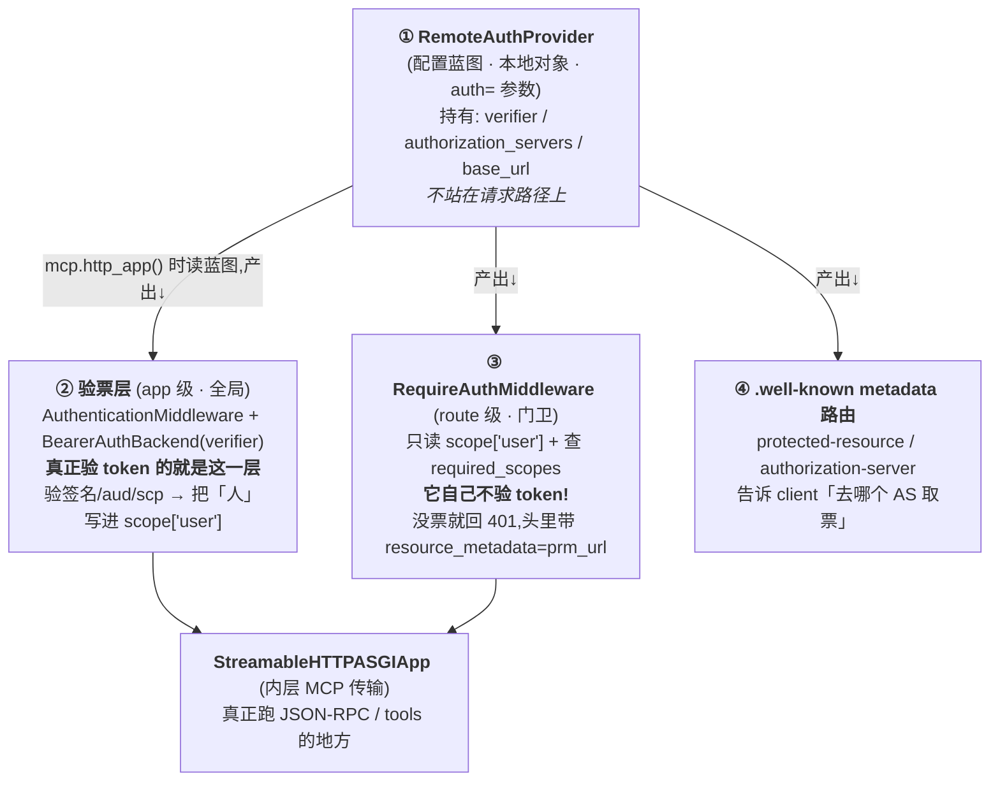
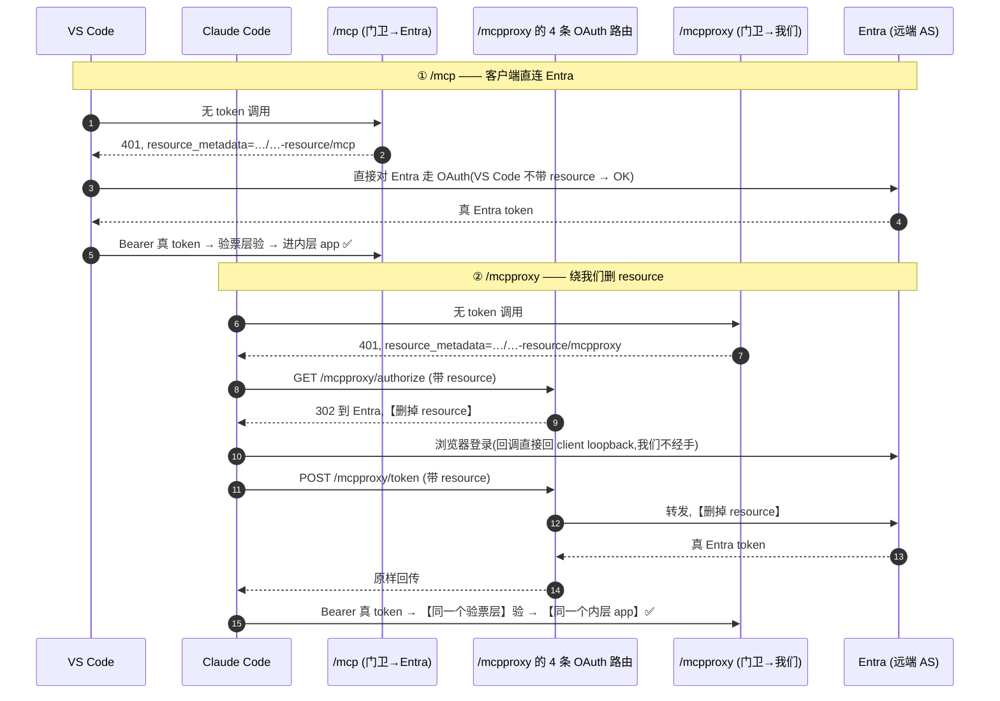

# 原理：`/mcpproxy` 如何嫁接到 FastMCP

> 本文回答一次完整讨论里攒下来的几个「到底怎么回事」的问题：
> 1. 为什么不能用「两个 FastMCP server + Nginx」？能不能做？（**能，见 §7**）
> 2. 现在这套是怎么凭空在 FastMCP 上长出一个 `/mcpproxy` 新 path 的？（**§5**）
> 3. `RemoteAuthProvider` / `RequireAuthMiddleware` / 远端授权服务器 / verifier ——**这几个「auth 名字」到底谁是谁**？（**§2，本文核心**）
> 4. `scope["user"]` 是什么？（**§3**）
> 5. FastMCP 和 FastAPI 都基于 Starlette，它们像不像？（**§4**）
> 6. 这样写有什么内在缺点？未来 SDK 改了风险大不大？（**§8 / §9**）

---

## 0. 一句话总览

```
┌─────────────────────────────────────────────────────────────────────────┐
│  一个进程 · 一个 Starlette app · 两个 MCP 端点                              │
│                                                                           │
│   /mcp       → 401 时指向 Entra 的 metadata     → client 直连 Entra 换 token │
│   /mcpproxy  → 401 时指向「我们自己」的 metadata → client 走我们，删掉 resource │
│                                                                           │
│   两个端点底层是【同一个 StreamableHTTPASGIApp + 同一个 verifier】            │
│   差别只在「门卫牌子上写的取票处地址」不同（prm_url）。                        │
└─────────────────────────────────────────────────────────────────────────┘
```

- **数据面**（`tools/list` / `tools/call`）：两个端点**完全一样**——都拿**真 Entra token**、过同一个 verifier、打同一个内层 app。
- **拿 token 的握手面**（OAuth dance）：**有区别**——`/mcpproxy` 多绕我们一层，把 RFC 8707 的 `resource` 删掉以绕过 [`AADSTS9010010`](./Bug剖析-AADSTS9010010-MCP的resource参数撞上Entra-v2.md)。
- 真正「动到 SDK 内部」的只有一个 ~15 行函数 `find_streamable_asgi_app`（**§5.3**）；其余全是干净的 Starlette 公有玩法。

---

## 1. 名字爆炸:先把「谁在本地、谁在远端」摆正

讨论里一堆带 auth/remote 的名字,最容易糊。先用一张「住在哪」的图定位——**这是理解后面一切的地基**:

```
                          本地(你的进程 / 你的容器)                    远端
   ┌──────────────────────────────────────────────────────────┐   ┌──────────────┐
   │                                                            │   │              │
   │   RemoteAuthProvider   ← 一个【配置对象/蓝图】,住在本地      │   │    Entra     │
   │        (auth=...)          它的名字里的 "Remote" 指的是      │──▶│  (真正的     │
   │           │               "我要连的授权服务器在远端",         │   │  远端授权    │
   │           │               不是说它自己在远端!               │   │  服务器 AS)  │
   │           │ 产出↓                                          │   │              │
   │   ┌───────┴─────────────────────────────────┐              │   │  · 发 token  │
   │   │ AuthenticationMiddleware + verifier(验票) │              │   │  · JWKS 公钥 │
   │   │ RequireAuthMiddleware(门卫)               │              │   │  · /authorize│
   │   │ .well-known metadata 路由                 │              │   │    /token    │
   │   └───────────────────────────────────────────┘             │   │              │
   │                                                            │   └──────────────┘
   └──────────────────────────────────────────────────────────┘
```

> ★ **最容易记反的一点**:`RemoteAuthProvider` 里的 **"Remote" 形容的是「授权服务器(Entra)在远端」**,
> 它本身是**跑在你进程里的一个本地配置对象**。别把它当成「远端的某个服务」。

---

## 2. 鉴权四件套辨析(本文核心,一定要看懂这张图)

`RemoteAuthProvider`、验票层、`RequireAuthMiddleware`、内层 app —— 这四个**不是一回事、更不是一个 instance**。
它们是**「一张蓝图 → 产出三个运行时零件」**的关系。

### 2.1 蓝图 → 产出:它们的生产关系



### 2.2 四件套逐个定义 + 一句话记法

| # | 名字 | 层级 | 它是什么 / 干什么 | 它**不是**什么 | 一句话记法 |
|---|---|---|---|---|---|
| ① | **RemoteAuthProvider** | FastMCP 配置层 | `auth=` 传进去的**配置蓝图**,持有 verifier + 授权服务器地址 + base_url | ❌ 不是中间件,不站在请求链路上;❌ 不在远端 | **蓝图**:说清「验票用谁、AS 在哪」 |
| ② | **验票层**<br/>`AuthenticationMiddleware`+`BearerAuthBackend(verifier)` | ASGI app 级(全局) | 每个请求都先过它:抠 `Bearer` token → `verifier.verify_token()` 验签名/aud/scp → 结果塞进 `scope["user"]` | ❌ 不是门卫,不管「够不够权限」 | **验票机**:验真伪,盖章「这人是谁」 |
| ③ | **RequireAuthMiddleware** | ASGI route 级(每条 MCP 路由各一个) | 只做门卫:看 `scope["user"]` 在不在、`required_scopes` 够不够;不够回 401,头里带 `resource_metadata="<prm_url>"` | ❌ **它自己完全不验 token**(源码只 `scope.get("user")`) | **门卫**:查你盖没盖章,没章就指「去 prm_url 取票」 |
| ④ | **远端授权服务器 = Entra** | 远端 | 真正发 token 的那台服务器;`/authorize`、`/token`、JWKS 公钥都在它那 | ❌ 不是 RemoteAuthProvider(那只是指向它的本地配置) | **发证机关** |

> **③ 的源码证据**(`mcp/server/auth/middleware/bearer_auth.py:78-96`):`RequireAuthMiddleware.__call__` 第一件事就是
> `auth_user = scope.get("user")`,`if not isinstance(auth_user, AuthenticatedUser): 回 401`。**它从头到尾没碰 token,
> 只是读别人(② 验票层)盖好的章。** 这解释了为什么两个端点能共用同一个 verifier——因为**验票根本发生在更外面的全局层,
> 跟具体走哪个门卫无关**。

### 2.3 一个请求实际穿过这几层的样子

```
  HTTP 请求  ──►  ┌───────────────────────────────────────────────┐
  Bearer <tok>    │ ② AuthenticationMiddleware (app 级, 全局)      │
                  │    BearerAuthBackend: verifier.verify_token()  │  ← 唯一验 token 的地方
                  │    成功 → scope["user"] = AuthenticatedUser(..) │
                  └───────────────────┬───────────────────────────┘
                                      │  (scope 里现在有 "user" 了)
              按 path 分流 ───────────┼───────────────────────────┐
                                      ▼                           ▼
            ┌─────────────────────────────────┐   ┌──────────────────────────────────┐
            │ ③ RequireAuthMiddleware  (/mcp)  │   │ ③ RequireAuthMiddleware (/mcpproxy)│
            │    prm_url = …/oauth-…-resource/mcp│   │   prm_url = …/oauth-…-resource/mcpproxy│
            │    没 user → 401 指向 Entra       │   │   没 user → 401 指向【我们】        │
            └────────────────┬────────────────┘   └────────────────┬─────────────────┘
                             └───────────────┬──────────────────────┘
                                             ▼
                          ┌────────────────────────────────────────┐
                          │  StreamableHTTPASGIApp (同一个!)          │
                          │  + 你的 UserAuthMiddleware(FastMCP 层)    │
                          │  → 派发 tools/list, tools/call ...        │
                          └────────────────────────────────────────┘
```

**看懂这张图,就理解了整套设计的支点**:验票(②)在全局、只有一份;门卫(③)每条路由一个、唯一差别是 `prm_url`;
内层 app 是**同一个**。所谓「加 proxy」,不过是**多挂了一个 `prm_url` 不同的门卫**,把 client 引去不同的取票处。

---

## 3. `scope["user"]` 是什么(以及 "scope" 的两个含义)

### 3.1 先破歧义:两个 "scope"

| "scope" | 是什么 | 出现在哪 |
|---|---|---|
| **OAuth scope** | 权限串,如 `user_impersonation` | OAuth 请求参数 / token 的 `scp` claim |
| **ASGI scope** | **每个请求一份的字典**,装 method/path/headers/user… | 每个 ASGI app 的入口 `async def __call__(self, scope, receive, send)` |

`scope["user"]` 里的 `scope` 是**后者(ASGI scope 字典)**,和 OAuth 那个 `scope` 毫无关系。

### 3.2 `scope["user"]` 的来龙去脉

```
  verify_token(tok) 成功
        │
        ▼
  BearerAuthBackend.authenticate() 返回 (AuthCredentials(scopes), AuthenticatedUser(auth_info))
        │
        ▼
  Starlette 的 AuthenticationMiddleware 把它写进 ASGI 字典:
        scope["user"] = AuthenticatedUser(...)   ← 挂着 .access_token(含 claims) 和 .scopes
        scope["auth"] = AuthCredentials(...)
        │
        ▼
  ③ 门卫读 scope["user"] 判断放不放行
        │
        ▼
  你的 tool 里 get_access_token() → .claims["oid"] → OBO / group 门控
```

一句话:**`scope["user"]` = 「这条请求背后是谁、验过没」的载体**(一个 `AuthenticatedUser` 对象)。
② 验票层把「人」写进去,③ 门卫和你的 tool 再从这儿读出「人」。你 `main.py` 里 `oid` 的源头就在这。

---

## 4. FastMCP vs FastAPI vs Starlette:像,但别搞错「继承 vs 组合」

都基于 Starlette,但关系不同:

```
   Starlette (ASGI 路由内核: app.router.routes 就是一个 Route 的 list)
        ▲                                   ▲
        │ 继承 (is-a)                        │ 组合/生产 (has-a / produces)
        │                                   │
   FastAPI                              FastMCP
   class FastAPI(Starlette)            class FastMCP  (自成一体的协议服务器)
   → 本身就是 Starlette app            → mcp.http_app() 才【吐出】一个 Starlette app
   → uvicorn.run(fastapi_app) ✅        → uvicorn.run(mcp) ❌  要 run(mcp.http_app())
```

### 4.1 最关键差别:decorator 的语义完全不同

| decorator | 注册了什么 | 换来几个 URL |
|---|---|---|
| `@app.get("/foo")` (FastAPI) | 一条 HTTP route | **1 个 URL** `/foo` |
| `@mcp.tool` (FastMCP) | 一个 **MCP 协议 tool**(JSON-RPC method) | **0 个新 URL** —— 所有 tool 都复用**同一个** `/mcp`,靠 `tools/call {name}` 分发 |
| `@mcp.custom_route("/health")` (FastMCP) | 一条**真正的** Starlette route | **1 个 URL** `/health` ←**这个才等价于 `@app.get`** |

```
  FastAPI:   一个函数 ──► 一个 URL          (@app.get 一对一)
  FastMCP:   一堆 tool ──► 挤进一个 URL /mcp  (@mcp.tool 多路复用, JSON-RPC 派发)
             想要真 URL ──► 用 @mcp.custom_route
```

> 所以 `diagnose_bash` / `action_bash` **不会各自变成 URL**,它们全在 `/mcp` 后面由 JSON-RPC 按 `name` 派发。
> FastMCP 里「decorator = URL route」只对 `@mcp.custom_route` 成立(`main.py:254` 的 `/health` 就是它)。

---

## 5. `/mcpproxy` 是怎么「拼」到已建好的 app 上的(原理)

核心就一句:**Starlette 的路由表 `app.router.routes` 是一个可变 list,往里塞 `Route` 就多了 path。**

### 5.1 机制:往路由表 list 里前插

```
  app = mcp.http_app()                    # 得到 Starlette app
  app.router.routes  ──► [Route("/mcp"...), Route(".well-known/...mcp"), Route("/health"), ...]

  install_proxy_endpoint 做的事(mcpproxy.py:200):
  app.router.routes[:0] = new_routes      # 把 5 条新 Route 插到最前面
                          │
                          ▼
  app.router.routes  ──► [★/.well-known/...mcpproxy, ★/mcpproxy/authorize,
                          ★/mcpproxy/token, ★/mcpproxy, ...原有的 /mcp 那些]
```

Starlette 收到请求就**按顺序**遍历这个 list,命中第一条 path 匹配的派发过去。**加 Route = 加 URL,就这么直白**——
这是 Starlette 标准玩法,和「黑 FastMCP」无关(功能上等价于 `@mcp.custom_route`,只是因为 app **已经建好了**、
decorator 用不了了,才改成命令式直接改 list)。

### 5.2 塞进去的 5 条路由

| 路由 | 干什么 | 碰 SDK 内部吗 |
|---|---|---|
| `/.well-known/oauth-protected-resource/mcpproxy` | 返回 PRM JSON,把 AS 指向**我们自己** | ❌ 纯 Starlette |
| `/.well-known/oauth-authorization-server(/mcpproxy)` ×2 | 返回 AS metadata,**不给** `registration_endpoint`(→ client 不 DCR) | ❌ 纯 Starlette |
| `/mcpproxy/authorize` | `params.pop("resource")` → 302 到 Entra | ❌ 纯 Starlette |
| `/mcpproxy/token` | `form.pop("resource")` → httpx 转发给 Entra → 原样回传 | ❌ 纯 Starlette + httpx |
| `/mcpproxy` (MCP 端点本身) | 复用 `/mcp` 的内层 app,只换 `prm_url` | ✅ **唯一碰内部的一条** |

**前 4 条一行 FastMCP 内部都没碰。** 真正「删 resource」发生在 `/mcpproxy/authorize` + `/mcpproxy/token`,
**不在门卫里**——门卫只负责回 401、指个地址,是 `prm_url` 把 client 引到这两条删-resource 路由上的。

### 5.3 唯一的「内部手术」:`find_streamable_asgi_app`

第 5 条路由要「让 `/mcpproxy` 跑和 `/mcp` 一模一样的 tools、共用同一个 session manager,只把 401 指向我们」。
做法是**伸进 `/mcp` 那条已建好的 route,把内层 ASGI app 掏出来,再用一个新门卫重新包**:

```
  找到 Route("/mcp") ──► 它的 endpoint 是 RequireAuthMiddleware(门卫)
                              │
                              │  .app  ← 掏出内层
                              ▼
                        StreamableHTTPASGIApp  (共享的传输 app)
                              │
                              │  用【新的】RequireAuthMiddleware 重新包:
                              ▼
        RequireAuthMiddleware(streamable, required_scopes, prm_url=".../mcpproxy")
                              │
                              ▼
                     挂到 Route("/mcpproxy")
```

**这是全篇唯一「decorator 干不了」的动作**——decorator 只会「加一条指向新函数的 route」,而这里是「复用一个已有的
内部对象、重新挂载」。它依赖两个 SDK 内部假设(都在 `mcpproxy.py`,共 ~20 行):
1. `/mcp` 的 route 被 `RequireAuthMiddleware` 包着、内层挂在 `.app` 上(`find_streamable_asgi_app`, `mcpproxy.py:57-73`);
2. `RequireAuthMiddleware(app, required_scopes, resource_metadata_url)` 的构造签名(`mcpproxy.py:170`;源码 `bearer_auth.py:60-65` 确认)。

**失败模式友好**:结构不符时 `find_streamable_asgi_app` 直接 `raise RuntimeError`(`mcpproxy.py:73`),**启动即崩、CI/部署就抓到**,不是线上静默故障;外面还有 `MCPPROXY_ENABLED` 开关兜底。

---

## 6. 两个端点的完整时序(拿 token 有别、数据面无别)



**结论**:
- **拿 token 阶段**:`/mcpproxy` 多绕我们、删 `resource`(这是修 bug 的地方);那几跳**只在拿/刷 token 时发生一次**。
- **数据面**:两边手里都是**真 Entra token**,过**同一个验票层**、打**同一个内层 app**——`oid`/OBO/group 门控**零改动**、**零额外跳数**。

---

## 7. 取舍:单-app-双端点 vs 两-server + Nginx

你的直觉没错——**「两个 FastMCP server + Nginx」完全能做,没有任何东西禁止**。关键是先分清两件正交的事:

```
   拓扑(在哪跑)          ≠          修 bug 的机制(删 resource)
   1 进程 vs 2 进程 + Nginx           删 resource 必须在【应用代码(Python)】里
                                     Nginx 只擅长【按 path 路由】,
                                     不擅长【改 OAuth 请求体】(尤其 /token 的 form body,
                                     原生 nginx 不改 body,要上 OpenResty/Lua)
```

所以即使上了两 server + Nginx,**「删 resource + 发 metadata」那段还是得用 Python 写**(在第二个 server 里用公有的
`@mcp.custom_route`);Nginx 只做路由。它的**真正好处**是:第二个 server 原生产出自己的 `/mcp` 门卫,**从而干掉 §5.3 那个内部手术**。

| 维度 | **现方案:单 app 双端点** | **两 server + Nginx** |
|---|---|---|
| 进程/内存 | 1 个,共享 verifier/MSAL/cache/Redis 池 → **更省** | 2 个,上述全 double |
| Nginx / 额外抽象 | 无 | 多一层配置(或用 ACA 双 ingress 省掉) |
| 碰 FastMCP 内部 | 有一处(`find_streamable_asgi_app`,~15 行,fail-loud) | **零**(各 server 原生) |
| tool 代码复用 | 天然(同一个 mcp 实例) | 需抽 `build_server(auth)` 工厂 |
| 故障隔离 | ❌ 共命运(一个挂两个都挂) | ✅ 可隔离 |
| 独立扩缩容/发版 | ❌ 不能 | ✅ 能 |
| 数据面额外跳数 | 0 | 0(Nginx 那跳在同机,可忽略) |

**建议**:你现在是「小用量单容器」规模 → **保留单 app**(运维最简单、资源最省、耦合可控且 fail-loud)。
等需要**独立扩缩容 / 独立发版 / 故障隔离**时,再切两 server(那时连 Nginx 可能都不用,直接 ingress 路由)。

---

## 8. 这样写本身的内在缺点(抛开 SDK 故障风险)

**先修正一个成本直觉**:资源上单 app **反而更省**(共享 verifier/MSAL/cache/Redis 池,两进程会 double);
「多几跳」也只在**拿/刷 token 时**发生,数据面零额外跳。所以"资源一样"是保守说法。

真正的内在缺点(按「在你这个规模也会咬人」排序):

| # | 缺点 | 说明 | 何时咬人 |
|---|---|---|---|
| 1 | **共命运,无故障隔离** | 两端点同进程同 app,进程 OOM/死锁/崩 → **VS Code 和 Claude Code 一起挂**;一个坏 deploy 两边中招 | **任何规模**(只要在乎可用性) |
| 2 | **共享 session manager,无舱壁** | 同一个 StreamableHTTP session manager,/mcpproxy 上吵闹 client 开一堆 SSE 流会吃到 /mcp 头上 | 中等量起 |
| 3 | **不能独立扩缩容/调参** | 同进程 = 同 CPU/内存/副本/env,没法只给 /mcpproxy 扩容 | 上量后 |
| 4 | **你自己扛 OAuth 安全面,且塞在主 app 里** | `/authorize`(防 open-redirect)、`/token`(转发别人 token、别打日志)是敏感代码,和 tool 同进程;`/token` 的 httpx 出站还把你的 event loop 和 Entra 延迟绑一起 | **小规模也在** |
| 5 | **两套发现文档你自己维护、会 drift** | /mcp 用 Entra 的 metadata,/mcpproxy 用**手写**的;字段(scopes/issuer)要和 Entra 实际接受的保持一致 | **小规模也在** |
| 6 | **路由前插的顺序假设** | `routes[:0] = ...` 靠「精确 path、无更靠前 catch-all」才安全,是个隐性前提 | 罕见 |
| 7 | **可读性/上手成本** | 「掏内层 app 重挂」不直观(你自己就问了「怎么做到的」);两个白开水 server 更好懂 | 维护期 |

> **核心两条**:**1(共命运)** 和 **4/5(OAuth 正确性从此归你负责)**——这才是单 app 的真实代价,而不是资源。

---

## 9. SDK 变更风险评估:低

你的判断对——**要修也就是「找到内层 app、把 `prm_url` 再换一遍」**,修复面极小。分层估概率:

| 情形 | 概率 | 理由 |
|---|---|---|
| `Route→RequireAuthMiddleware→内层 app` 这个结构**消失** | **很低** | `RequireAuthMiddleware` + `resource_metadata` 是 **MCP 规范/RFC 9728 直接要求**的,FastMCP 没动机拿掉 |
| 属性名/包法/构造签名**变了**(要小改 finder) | **中等** | 但只在你**主动升级 major 版本**时遇到,且**启动即 RuntimeError**,改的就是那几行 |
| 变到**内层 app 根本掏不出来** | **很低** | `app.router.routes` 永远可遍历,内层传输 app 必在链条里,最坏多剥一层壳 |
| **彻底修不了** | **< 5%** | 且永远有退路:退到两-server 或 `@mcp.custom_route` |

**两道兜底让风险几乎无关痛痒**:① **pin 住 fastmcp 版本**(只在主动升级时才可能要动);② 真变恶心了,退两-server 方案——**你永远不会被逼到墙角**。

**建议加的两个保险**(可选,把风险显式化):
1. 一个 `test_mcpproxy_boot` 冒烟测试:断言 `/mcpproxy` 能起来 = 把「SDK 结构没变」变成 CI 里一条断言;
2. 在 `find_streamable_asgi_app` / `RequireAuthMiddleware(...)` 处写清依赖的结构假设(注释 + 断言),给后人留交代。

---

## 10. 速查:心智模型总结

```
┌─ 名字辨析 ───────────────────────────────────────────────────────────┐
│  RemoteAuthProvider  = 本地【配置蓝图】(Remote 指 AS 在远端,不是它在远端) │
│  验票层(verifier)     = app 级全局,【唯一验 token 的地方】,填 scope["user"]│
│  RequireAuthMiddleware= route 级【门卫】,只读 scope["user"],指 prm_url    │
│  远端授权服务器        = Entra 本尊,发 token                              │
└──────────────────────────────────────────────────────────────────────┘
┌─ scope 两义 ─────────────────────────────────────────────────────────┐
│  OAuth scope = 权限串(user_impersonation)                              │
│  ASGI scope  = 每请求一份的字典;scope["user"] = 验过的「人」            │
└──────────────────────────────────────────────────────────────────────┘
┌─ FastMCP vs FastAPI ─────────────────────────────────────────────────┐
│  FastAPI: 继承 Starlette;@app.get = 1 URL                             │
│  FastMCP: 生产 Starlette(http_app());@mcp.tool = 挤进 /mcp 一个 URL    │
│           想要真 URL 用 @mcp.custom_route                              │
└──────────────────────────────────────────────────────────────────────┘
┌─ /mcpproxy 怎么长出来 ───────────────────────────────────────────────┐
│  90%: 往 app.router.routes 前插 Route(= decorator 等价,干净)          │
│  10%: find_streamable_asgi_app 掏内层 app 重挂(唯一内部手术, ~15 行)   │
└──────────────────────────────────────────────────────────────────────┘
┌─ 取舍一句话 ─────────────────────────────────────────────────────────┐
│  单 app: 省资源、运维简单、耦合可控 fail-loud,但共命运 + OAuth 你自负   │
│  两 server: 故障隔离 + 独立扩缩容 + 零内部耦合,但 +进程 +Nginx +工厂重构 │
│  → 现规模(小用量单容器)保留单 app;要隔离/独立扩缩再切两 server         │
└──────────────────────────────────────────────────────────────────────┘
```

---

## 参考

- [`实现说明-方案A-mcpproxy-resource剥离代理-代码与安全分析`](./实现说明-方案A-mcpproxy-resource剥离代理-代码与安全分析.md) —— 逐段代码剖析 + 安全分析(本文的实现底座)
- [`Bug剖析-AADSTS9010010-…`](./Bug剖析-AADSTS9010010-MCP的resource参数撞上Entra-v2.md) —— 为什么要删 resource(根因)
- [`计划-mcpproxy-同容器双端点-…`](./计划-mcpproxy-同容器双端点-无DCR无Secret代理接入非VSCode客户端.md) —— 方案 A vs B 选型
- `src/mcp-server/mcpproxy.py` / `src/mcp-server/main.py`
- `mcp/server/auth/middleware/bearer_auth.py` —— `RequireAuthMiddleware` / `BearerAuthBackend` 源码(§2.2 引用)
