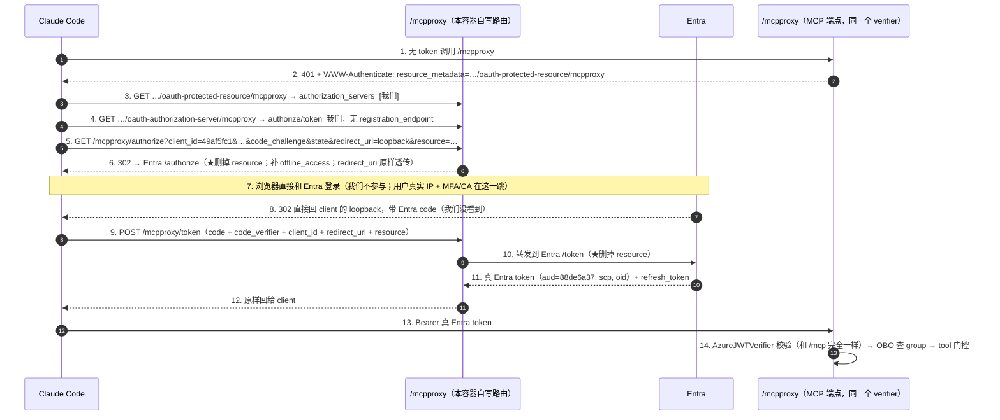

# 实现说明：方案 A —— `/mcpproxy` resource-剥离代理

> 本文对应 [计划文档](./计划-mcpproxy-同容器双端点-无DCR无Secret代理接入非VSCode客户端.md) 里选定的**方案 A（薄过滤器）**的**实际落地代码**。
> 讲三件事：**① 代码怎么实现的**（逐段剖析）、**② design 的取舍**、**③ 潜在安全问题与缺点**。

---

## 0. 一句话总结 + 验证结论

在**完全不动现有 `/mcp`**（VS Code 直连 Entra）的前提下，同一个容器里多暴露一个 `/mcpproxy` 端点。它在 client 与
Entra 之间插一层，**只做一件事：把 RFC 8707 的 `resource` 参数删掉**，从而绕过 Entra v2 的
[`AADSTS9010010`](./Bug剖析-AADSTS9010010-MCP的resource参数撞上Entra-v2.md)。client 最终拿到的是**真 Entra token**，
所以 `oid` / OBO / AD-group 门控与 `/mcp` **完全一致，零改动**。

**已部署并端到端跑通**（Claude 能正常用）。真实登录后的证据：

```text
# 通过 /mcpproxy/token 换回来的 token（请求里故意带了 resource=，代理把它删了）
aud: 88de6a37-cf75-40d3-83e8-44c5ccbc0895     # = 我们的 MCP API，audience 正确
scp: user_impersonation                        # scope 正确
azp: 49af5fc1-96e6-40c1-b108-cb828cc2a00e      # 出示的是我们的 public client
oid: b04a03e0-6e07-4d55-83b2-7dedeb56c56d      # 用户身份保真
refresh_token present: True                    # offline_access 生效
=> 全程没有 AADSTS9010010

# 拿这个 token 连 /mcpproxy 的 MCP 端点
tools/list -> ['diagnose_bash', 'action_bash']  # group 门控生效
diagnose_bash `az account show` -> exit 0, "Azure subscription 1"  # OBO→sandbox→FIC 链路通
```

---

## 1. 背景：为什么要这一层（30 秒回顾）

- MCP 授权规范（2025-06）要求 client **MUST** 在 `/authorize` 和 `/token` 都带 `resource=<MCP server URL>`。
- Claude Code / opencode 严格遵守，会带 `resource`。**Entra v2 收到 `resource` 且它与 scope 推出的 `aud` 对不上
  → 硬报 `AADSTS9010010`**（2026-03 起强制校验）。
- VS Code 不带 `resource`，所以 `/mcp` 一直好用。
- **结构性结论**：要删掉 `resource`，就必须有一个"中间人"替 client 重发那次上游请求——这一层省不掉（微软官方
  APIM 方案本质也是它）。方案 A 就是把这一层做到**最薄**：只删一个参数，不发自己的 token、不存任何东西。

---

## 2. 总体架构：同容器、双端点、共用一切下游

```
                         ┌───────────────────────── 同一个容器 / 同一个 Starlette app ─────────────────────────┐
  VS Code ──────/mcp─────►  RemoteAuthProvider(→Entra)  ┐                                                        │
  (不带 resource，不变)                                  │  同一个 AzureJWTVerifier                              │
                                                         │  同一个 StreamableHTTP session manager               │
  Claude Code ──/mcpproxy─►  RequireAuthMiddleware ──────┘  同一套 tools / OBO / group cache（一行不改）         │
  opencode                   + 4 条自写 OAuth 路由（删 resource 后转发 Entra）                                    │
                         └────────────────────────────────────────────────────────────────────────────────────┘
```

关键点：**`/mcp` 和 `/mcpproxy` 校验的是同一种真 Entra token、用的是同一个 verifier**。两者唯一的差别是：
1. **401 时把 client 指向哪个 AS**：`/mcp` → Entra；`/mcpproxy` → 我们自己。
2. `/mcpproxy` 多了 2 份发现元数据 + 2 条转发路由（authorize / token）。

正因为这个"同 token"的洞察，落地代码比计划里设想的"两个 FastMCP 实例 + 合并 lifespan"**更简单**：直接把
`/mcp` 那个 streamable ASGI app **在第二个路径上再挂一次**即可（见 §4.2）。

---

## 3. 请求全流程（端到端时序）



**为什么说它"几乎无状态"**：第 6 步是"改参数 + 302"；第 7-8 步的回调由 Entra 直接送回 client 的 loopback，
**中间层完全不经手 callback、看不到 code**；第 9-12 步是"改参数 + 转发 + 原样回传"。PKCE 只有一对
（client↔Entra，端到端），`state` 由 client 自己 round-trip。我们**不生成自己的 PKCE、不发自己的 code、不签自己的
token、不存任何东西**。

---

## 4. 代码实现详解

### 4.1 改了哪些文件

| 文件 | 改动 |
|---|---|
| `src/mcp-server/mcpproxy.py` | **新增**。整个代理逻辑：2 份元数据 + authorize/token 转发 + 第二个 MCP 路由挂载。~180 行，无第三方新依赖（`httpx` 已有；`mcp`/`starlette` 由 `fastmcp` 传递带入）。 |
| `src/mcp-server/main.py` | `app = mcp.http_app()` 之后，若 `MCPPROXY_ENABLED`（默认 true）就调用 `install_proxy_endpoint(app, …)`。**`/mcp` 相关代码一行没动。** |
| `.mcp.json` / `opencode.json` | url `…/mcp` → `…/mcpproxy`（clientId/scope 保留）。 |
| `.vscode/mcp.json` | **不动**，VS Code 继续走 `/mcp`。 |
| `.env.example` | 记了一条 `MCPPROXY_ENABLED=true`。 |

### 4.2 关键技巧：把同一个 StreamableHTTP app 在第二个路径上再挂一次

`/mcp` 那条路由的 endpoint 是 `RequireAuthMiddleware` 包着一个 `StreamableHTTPASGIApp`（它的 session_manager 在 app
lifespan 里只被设置一次）。MCP 的 session 是按 `mcp-session-id` 请求头分的、**与 URL 路径无关**，所以把**同一个**
`StreamableHTTPASGIApp` 在 `/mcpproxy` 上再包一层 `RequireAuthMiddleware` 挂一次，就得到了第二个功能完全相同、但
401 指向不同元数据的 MCP 端点——**共用一个 session manager，不需要动 lifespan、不需要第二个 FastMCP 实例**。

```python
def find_streamable_asgi_app(app, mcp_path: str):
    """从 /mcp 路由里取出内层的 StreamableHTTP ASGI app，好在 /mcpproxy 上复用。"""
    for route in app.router.routes:
        if isinstance(route, Route) and route.path == mcp_path:
            endpoint = getattr(route, "app", None) or getattr(route, "endpoint", None)
            if isinstance(endpoint, RequireAuthMiddleware):
                return endpoint.app          # ← 里面那个 StreamableHTTPASGIApp
            return endpoint
    raise RuntimeError(f"could not find MCP streamable route at {mcp_path!r}")
```

```python
# /mcpproxy 的 MCP 端点：同一个 streamable app、同一份 required_scopes，
# 只是 401 的 WWW-Authenticate 指向我们自己的 protected-resource-metadata。
streamable_app = find_streamable_asgi_app(app, mcp_path)
proxy_mcp_endpoint = RequireAuthMiddleware(streamable_app, required_scopes, prm_url)
```

> ⚠️ 这里**依赖了 FastMCP/mcp SDK 的内部结构**（路由里 `RequireAuthMiddleware.app` 这层包装）。好处是零重复代码；
> 代价是 SDK 若改了这层包装，`find_streamable_asgi_app` 会**抛 RuntimeError 让容器起不来（响亮失败，不是静默出错）**。
> 见 §10 缺点。

### 4.3 两份发现元数据（让 client 把我们当成 AS，且不 DCR）

**① Protected-Resource Metadata（RFC 9728）**——把 client 指向"我们这个 AS"而不是 Entra：

```python
async def protected_resource_metadata(_request):
    return JSONResponse({
        "resource": resource,                       # https://<fqdn>/mcpproxy
        "authorization_servers": [issuer],          # ← 指向我们自己（= resource）
        "scopes_supported": [api_scope],            # api://88de6a37…/user_impersonation
        "bearer_methods_supported": ["header"],
    })
```

**② Authorization-Server Metadata（RFC 8414）**——宣告我们的 authorize/token；**故意不给 `registration_endpoint`**，
所以守规矩的 client 会用它**静态配置的 `client_id`（49af5fc1），不去做 DCR**：

```python
async def authorization_server_metadata(_request):
    return JSONResponse({
        "issuer": issuer,
        "authorization_endpoint": authorize_ep,     # …/mcpproxy/authorize
        "token_endpoint": token_ep,                 # …/mcpproxy/token
        "response_types_supported": ["code"],
        "grant_types_supported": ["authorization_code", "refresh_token"],
        "code_challenge_methods_supported": ["S256"],
        "token_endpoint_auth_methods_supported": ["none"],   # public client，无 secret
        "scopes_supported": [api_scope, "offline_access", "openid", "profile"],
        # 注意：没有 registration_endpoint → 不触发 DCR
    })
```

因为 issuer 带了 `/mcpproxy` 路径，不同 client 的 RFC 8414 发现路径写法不同，所以这份 metadata **同时挂在两个位置**
兼容两种 client：

```python
Route("/.well-known/oauth-authorization-server" + proxy_path, ...)  # RFC 8414 路径插入式
Route(proxy_path + "/.well-known/oauth-authorization-server", ...)  # 新版 MCP client 的路径追加式
```

### 4.4 `/mcpproxy/authorize`：删 resource + 归一化 scope + 302 到 Entra

```python
async def authorize(request):
    params = dict(request.query_params)
    params.pop("resource", None)                    # ★ 核心：删掉 RFC 8707 的 resource
    params["scope"] = _ensure_scopes(params.get("scope"), api_scope)
    # 只往固定的 Entra 常量端点重定向（杜绝 open-redirect）；redirect_uri 原样透传给 Entra 校验
    return RedirectResponse(f"{upstream_authorize}?{urlencode(params)}", status_code=302)
```

`_ensure_scopes` 保证 scope 里一定含 API scope + `offline_access`/`openid`/`profile`（补 refresh_token 与 id claims），
但**保留** client 原本要的 scope：

```python
_RESERVED_SCOPES = ("offline_access", "openid", "profile")
def _ensure_scopes(scope, api_scope):
    parts = scope.split() if scope else []
    for needed in (api_scope, *_RESERVED_SCOPES):
        if needed not in parts:
            parts.append(needed)
    return " ".join(parts)
```

- **PKCE / state / client_id / redirect_uri 全部原样透传**：所以 PKCE 是 client↔Entra 端到端的，`state` 由 client 自己
  校验，回调直接回 client 的 loopback。
- **防 open-redirect**：我们只把参数拼到**写死的 Entra 常量 URL** 后面，从不根据用户输入决定跳去哪。用户传的
  `redirect_uri` 是转给 Entra 的参数，由 **Entra 用 49af5fc1 注册的 redirect 白名单**兜底（当前只有
  `http://localhost:8080/callback`）。

### 4.5 `/mcpproxy/token`：删 resource + 转发 + 原样回传

```python
async def token(request):
    form = dict(await request.form())
    form.pop("resource", None)                       # ★ 这里也删 resource
    async with httpx.AsyncClient(timeout=30.0) as client:
        upstream = await client.post(upstream_token, data=form,
                                     headers={"Accept": "application/json"})
    # 状态码 + body 原样回传；★ 绝不打日志（body 里是 token）
    media_type = upstream.headers.get("content-type", "application/json")
    return Response(content=upstream.content, status_code=upstream.status_code,
                    media_type=media_type)
```

- `authorization_code` 和 `refresh_token` 两种 grant 都走这一条（都只是"删 resource + 转发"）。
- **不碰 scope**（authorization_code 换 token 时 Entra 从 code 推 scope，动它反而可能引入不一致）。
- **不落日志**：token 明文只在内存里过一下就原样回给 client。

### 4.6 `main.py` 集成与开关

```python
MCPPROXY_ENABLED = os.environ.get("MCPPROXY_ENABLED", "true").lower() in ("1","true","yes")
...
app = mcp.http_app()          # /mcp 照旧

if MCPPROXY_ENABLED:
    from mcpproxy import install_proxy_endpoint
    install_proxy_endpoint(
        app,
        mcp_path="/mcp",
        base_url=BASE_URL,                       # 云上=https FQDN，本地=http://localhost:8080
        tenant_id=TENANT_ID,
        mcp_app_id=MCP_APP_ID,
        required_scopes=verifier.required_scopes,  # ["user_impersonation"]，和 /mcp 同源
    )
```

`install_proxy_endpoint` 把新路由 `app.router.routes[:0] = new_routes` 插到最前面（精确路径，其实前后都行）。
`MCPPROXY_ENABLED=false` → 干净退回只有 `/mcp`（部署前已验证）。

---

## 5. 客户端配置

```jsonc
// .mcp.json（Claude Code）——只把 url 改到 /mcpproxy，clientId 不变
{ "mcpServers": { "azure-dataops-aca": {
    "type": "http",
    "url": "https://dataops-aca-mcp.<domain>/mcpproxy",
    "oauth": { "clientId": "49af5fc1-96e6-40c1-b108-cb828cc2a00e", "callbackPort": 8080 }
}}}
```

opencode.json 同理（另带 `scope`）；`.vscode/mcp.json` **保持 `/mcp` 不动**。

---

## 6. 部署方式与本次记录

基础设施早已 provision（Bicep），**改代码只需重打镜像 + 滚容器**，无需再跑 `az deployment sub create`：

```bash
set -a && source .env.aca && set +a
# 本机 Docker 没起，用 ACR Tasks 在云上构建（避开本地 daemon 依赖）
az acr build -r "$REGISTRY_NAME" -t "mcp-server:mcpproxy-<ts>" -t "mcp-server:latest" ./src/mcp-server
az containerapp update -n "$MCP_APP_NAME" -g "$ACA_RESOURCE_GROUP" \
  --image "$REGISTRY_LOGIN_SERVER/mcp-server:mcpproxy-<ts>"   # 用唯一 tag 强制新 revision
```

本次：镜像 `mcp-server:mcpproxy-20260711-155857`，新 revision **`dataops-aca-mcp--0000009`**（Running）。
`MCP_SERVER_BASE_URL` 已是 https FQDN，所以代理宣告的 resource/issuer/authorize/token 全是 https，无需改 Bicep
（`MCPPROXY_ENABLED` 代码里默认 true）。

---

## 7. 端到端验证证据（部署后实测）

| 检查项 | 结果 |
|---|---|
| `/health` | ✅ ok |
| `…/oauth-protected-resource/mcpproxy` → `authorization_servers=[我们]` | ✅ |
| `…/oauth-authorization-server/mcpproxy`（+路径追加式）→ 无 `registration_endpoint`、`auth_method=none` | ✅ |
| `/mcpproxy/authorize?…&resource=…` → 302 到 Entra、**resource 已删**、补了 `offline_access`、PKCE/state/client_id 保留 | ✅ |
| `/mcpproxy` 无 token → 401 → 指向 proxy PRM | ✅ |
| `/mcp` 无 token → 401 → 指向 `/mcp` PRM（**未变**，仍是 Entra） | ✅ |
| **真实登录**：`/mcpproxy/token`（带 resure=）→ 真 Entra token（aud/scp/oid/refresh 全对，**无 9010010**） | ✅ |
| 拿该 token 连 `/mcpproxy` MCP → `tools/list=[diagnose_bash, action_bash]`（group 门控） | ✅ |
| `diagnose_bash` 跑 `az account show` → exit 0（OBO→sandbox→FIC 链路通） | ✅ |
| `MCPPROXY_ENABLED=false` → 干净退回只有 `/mcp` | ✅（部署前验证）|

> 说明：只用 `curl`（不登录）**无法**复现 `AADSTS9010010`——因为该错误在**登录之后**的授权处理/token 阶段才触发，
> 未登录的 GET 只会看到登录页。所以决定性证明必须走一次**真实的浏览器登录**，也就是上面这条端到端记录。

---

## 8. Design 取舍

1. **A（薄过滤器）vs B（FastMCP OAuthProxy）**：选 A。A 几乎逐条命中诉求（不 DCR、无 token store、无签名 key、
   client 出示我们的 client_id、身份保真零改动），代价是自持有一小段薄 OAuth 胶水；B 少写代码但把这些诉求都变成
   "要额外压住的机制"（pin 静态 client、token store、签名 key、上游 token spike）。详见计划文档 §5。

2. **复用同一个 streamable app（而非两个 FastMCP 实例）**：因为方案 A 下两端点**收的是同一种真 Entra token、用同一个
   verifier**，没必要起第二个实例、也没必要合并两套 lifespan。代价是**耦合了 SDK 内部包装结构**（§4.2 的 unwrap）。
   取舍结论：省掉一整块 lifespan/实例管理的复杂度，换来一个**响亮失败**（起不来）的内部依赖——可接受，且比静默出错好。

3. **`/mcp` 一个字节都不动**：VS Code 这条**已验证可用**的路径零回归风险。代理只是"并行加一条兼容通道"，最贴合
   微软的安全原则（保留 pre-registration 直连）。

4. **删 resource 而非"翻译" resource**：Entra v2 没有 RFC 8707 的 `resource` 位置，`aud` 是**由 scope 决定**的。既然
   scope（`api://88de6a37…/user_impersonation`）已经把 `aud` 钉死成我们的 API，`resource` 就是多余且冲突的——直接删
   掉，`aud` 依然正确（实测 `aud=88de6a37`）。**删 resource 不削弱受众绑定**（见 §9 第 3 条）。

5. **无状态、不发自己的 token**：不引入 token store / 签名 key / 自签 token 信任面；炸半径最小；天生可多副本水平扩展。
   代价是我们**没有任何加钩子的地方**（不能自己做每用户限流、撤销、审计增强——只能依赖 Entra）。

6. **默认开启（`MCPPROXY_ENABLED=true`）**：一次部署云上/本地都带 `/mcpproxy`，同时留了关闭开关便于隔离排查。

---

## 9. 安全性分析（重点）

先给结论：**这一层没有放大 Entra 本身已暴露的攻击面到"危险"的程度**（它转发到的 `/authorize`、`/token` 本来就是
公网 + public client），但确实引入了几处**值得记录、值得后续加固**的点。

| # | 风险/关注点 | 严重度 | 现状与缓解 |
|---|---|---|---|
| 1 | **`/mcpproxy/token` 是无鉴权的对 Entra 转发端点**（open relay） | 低-中 | 它能做的不超过"直接和 Entra 说话"（Entra 本就公开、client 无 secret）。但它把**请求源 IP 变成容器出口 IP**（见 #2），并可被刷（见 #5）。 |
| 2 | **token 反向通道丢失用户真实 IP** → 削弱**基于 IP 的条件访问 / 登录风险检测** | 中 | leg-2（`/token`）从容器出口 IP 发起，Entra 登录日志/CA 看到的是**服务器 IP** 而非用户 IP。**注意**：leg-1 的交互式登录（`/authorize` 是浏览器 302）仍是**用户真实 IP + MFA/CA**，所以强认证不受影响；受影响的只是 token 换取这一跳的 IP 归属。若你依赖"按 IP 限定 token 获取"的 CA 策略，需评估。 |
| 3 | **删掉 `resource` = 丢弃 RFC 8707 的受众绑定意图** | 低（本场景不削弱） | RFC 8707 的目的是"这个 token 只能用在某 resource"。本项目里 **`aud` 由 scope 钉死成 `api://88de6a37`**，`AzureJWTVerifier` 校验 `aud=MCP_APP_ID`——所以 token **仍然只在我们的 API 有效**，拿去别处会被拒。删 resource 不削弱这一点。 |
| 4 | **我们对外自称 AS，但发的是别人（Entra）的 token**（issuer 语义不一致） | 低 | AS metadata 的 `issuer` 是我们的 URL，但 token 的 `iss` 是 Entra。MCP client 把 token 当**不透明串**携带、不交叉校验，所以现实中不出问题；但若某 client 严格执行 RFC 9207/校验"token.iss == 发现到的 AS issuer"，会失败。Claude Code/opencode 不这么做。 |
| 5 | **未鉴权端点可被刷（DoS / 放大 / 触发 Entra 对 49af5fc1 限流）** | 中 | `/authorize`（便宜的 302）与 `/token`（每次一个到 Entra 的出站 httpx）都无鉴权。建议加**速率限制**（IP/客户端级）。`/mcpproxy` 的 MCP 端点本身有 `RequireAuthMiddleware` 保护，不受影响。 |
| 6 | **open-redirect** | 已缓解 | authorize 只把参数拼到**写死的 Entra 常量 URL**；`redirect_uri` 交给 **Entra 的 49af5fc1 redirect 白名单**兜底（当前仅 `http://localhost:8080/callback`）。**前提：把 49af5fc1 的 redirect 白名单保持最小**——一旦有人往里加了宽松/可控的 redirect（尤其非 loopback 的 https），风险回来。 |
| 7 | **token 落日志** | 已规避 | token handler **不打印 body**；authorize 的 302 Location 里只有公开值（code_challenge 是公开的）。需持续保持这个纪律，别手滑加日志。 |
| 8 | **总是补 `offline_access` → 代理路径恒发 refresh_token** | 低 | refresh token 长寿命、被盗炸半径更大。这是"免重登"的常规取舍，但确实比"只发 access token"面更大。可考虑仅在 client 明确要 `offline_access` 时才补。 |
| 9 | **任意 query/form 参数透传给 Entra** | 低 | 除 `resource` 外全透传（`prompt`/`login_hint`/`domain_hint`…）。恶意参数能做的不超过"直接打 Entra"，Entra 自己会校验。 |
| 10 | **上游 TLS** | OK | `httpx` 默认校验 `login.microsoftonline.com` 的证书。 |
| 11 | **CORS** | 不涉及 | 未加 CORS。原生 client（loopback）不需要；浏览器内的 MCP client 用 fetch 打发现端点会被同源策略挡（超出本期范围）。 |

**一句话安全叙事（给评审/管理层）**：
- **完全没有开放 DCR**——metadata 不给 `registration_endpoint`，client 用我们预注册、pin 好的 `49af5fc1`；
- **client 无 secret**（public + PKCE），服务端也**不签任何 token、不存任何 token**；
- **身份治理不变**——仍是 `oid` + OBO + AD group 决定 tool 可见性；代理只解决"发 token 前的协议不兼容"；
- **等价于微软背书的"受治理网关"（APIM）模式的极简版**——只删一个参数，其余全归 Entra。

---

## 10. 缺点与后续加固

**缺点 / 债务**：
1. **自持有一小段安全敏感的 OAuth 胶水**（虽薄，且不持有 secret/token）——需要有人 review、别手滑打日志、别放宽
   redirect 白名单。
2. **耦合 FastMCP/mcp SDK 内部结构**（§4.2 unwrap `RequireAuthMiddleware.app`）——升级 `fastmcp`/`mcp` 时要跑一遍
   验证（本文 §7 的清单可直接复用）；失败是"容器起不来"的响亮失败。**建议在 requirements 里 pin 住这两个包的大版本。**
3. **依赖 client 的良好行为**——client 必须接受"无 `registration_endpoint` 的 AS + 静态 client_id"。Claude Code /
   opencode 支持；若将来接入某个坚持 DCR 的 client，这条不成立。
4. **本地 OBO 仍需 secret**——修 resource bug 与"OBO 去 secret"正交；本地无 MI，App R 的 OBO 仍用
   `MCP_CLIENT_SECRET`（云上可后续换 MI-FIC）。
5. **无每用户限流/撤销/审计增强的挂钩点**——无状态换来的代价。

**建议的后续加固（按优先级）**：
- **[中] 给 `/mcpproxy/token`、`/mcpproxy/authorize` 加速率限制**（缓解 #5 DoS/放大、以及对 49af5fc1 的 Entra 限流）。
- **[中] 复核并收紧 49af5fc1 的 redirect 白名单**（保住 #6 的 open-redirect 缓解）；文档化"不得加入非 loopback 的宽松
  redirect"。
- **[低] `offline_access` 改为按需**（仅当 client 请求时才补），缩小 refresh token 面（#8）。
- **[低] pin `fastmcp` / `mcp` 大版本**，并把 §7 的验证清单固化成一个可重复跑的脚本（回归护栏，针对 §10-2 的耦合）。
- **[正交] App R 的 OBO：secret → MI-FIC**（云上无 secret 字符串），与本代理独立推进。

---

## 附：与方案 B（FastMCP OAuthProxy）的一句话对比

| | A（本实现） | B（OAuthProxy） |
|---|---|---|
| client 拿到 | **真 Entra token** | FastMCP 自签 token |
| token store / 签名 key | **都不需要** | 都需要 |
| DCR | **天生没有** | 默认有，要 pin 掉 |
| OBO / oid | **零改动**（同 `/mcp`） | 需 spike 从 store 取上游 token |
| 我们的代码 | ~180 行薄胶水（自维护） | 几乎不写（吃框架，但依赖未定型内部 API） |
| 安全面 | 薄、贴 APIM；需自审那几点（§9） | 框架兜底，但多一层"自签 token"信任面 |

> 结论：就本项目的优先级（不 DCR、无 store/基建、client 出示我们的 client_id、身份保真零改动），**A 几乎逐条命中**，
> 已落地并端到端验证通过。
