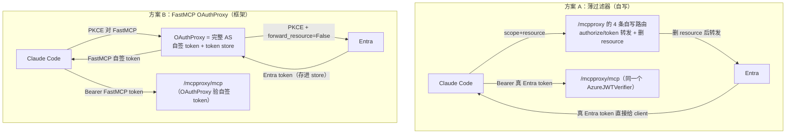
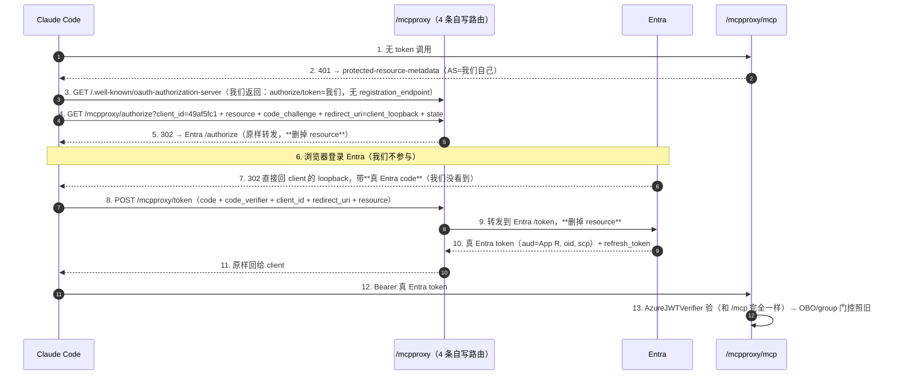
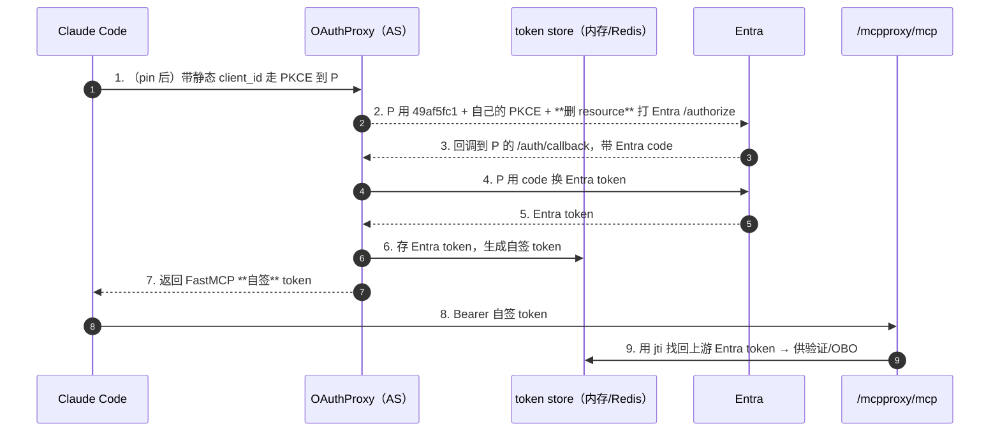

# 计划：同容器双端点 `/mcp` + `/mcpproxy`（两方案对比）

> **目标**：在**不动现有 `/mcp`（VS Code 直连 Entra）** 的前提下，同一个容器里再暴露一个 `/mcpproxy`，让
> **Claude Code / opencode 等严格遵守 RFC 8707 的 client** 绕过
> [`AADSTS9010010`](./Bug剖析-AADSTS9010010-MCP的resource参数撞上Entra-v2.md) 连上来。
>
> **本文并排给出两条实现路线，供选型**：
> - **方案 A —— 薄过滤器**：自写一个近乎无状态的 "resource-剥离反向代理"（4 条路由 + 2 份 metadata）。
>   client 最终拿到**真 Entra token**。
> - **方案 B —— FastMCP OAuthProxy**：用框架自带的 OAuth Proxy（一个完整的 AS，自签 token + token store）。
>
> **约束（你的原始诉求，两方案都对齐）**：① 不碰 Entra DCR；② 复用现有 public client `49af5fc1`、**不签 secret**；
> ③ 同容器、复用 FastMCP tool 代码；④ 保留 `oid`、维持 "AD group → tool 可见性"；⑤ 本地也要能跑。

---

## 0. 一句话定位

> 现有架构是干净的 **pre-registration**（client 直连 Entra），唯一毛病是 Claude Code / opencode 会发 RFC 8707
> `resource` → 撞 `AADSTS9010010`。**两方案的共同本质都是"在 client 与 Entra 之间插一层，把 `resource` 删掉"**；
> 唯一分歧是**这一层做多重**：
> - **A** 只是个**参数过滤器**（转发 + 删 `resource`），自己不发 token、不存东西，client 拿的是**真 Entra token**；
> - **B** 是个**完整 AS / broker**（自己发 token、维护 `自签 token → 上游 Entra token` 映射），client 拿的是
>   **FastMCP 自签 token**。
>
> VS Code 继续走 `/mcp` 不变；两方案的 tool 代码都 100% 复用。

---

## 1. 共同地基（两方案都成立的前提）

### 1.1 先破一个误区：「public client + PKCE」本身修不了这个 bug

`49af5fc1` 现在就是 public client、就在做 PKCE，抛的就是 `AADSTS9010010`。**根因不在 public-vs-confidential、
也不在 PKCE-vs-secret，而在「谁去跟 Entra 说话」**：只要 MCP client **直连** Entra，它就会带 `resource`，Entra
就拒。**要删 `resource`，结构上就必须有一个中间人替你处理与 Entra 的那次请求——这个中间人省不掉**（微软官方
APIM 方案本质也是它，见 Bug 文档 §5）。A / B 的差别只是这个中间人"薄"还是"厚"。

### 1.2 `resource` 到底怎么被"删掉"（forward / strip 详解）

bug 只发生在**一个 hop**：client → Entra 的 `/authorize` + `/token`。Claude Code（按 MCP 规范）总会给这个请求
挂上 `resource=https://…/mcp`，Entra v2 拒（`AADSTS9010010`）。中间层把这个 hop 拆成两截：

```
今天（无中间层，坏）:
  Claude Code ──scope + resource──> Entra          ❌ Entra 见到 resource → 9010010

有中间层（好）:
  Leg 1:  Claude Code ──scope + resource──> 中间层(/mcpproxy)   ← 收下 resource，不报错
  Leg 2:  中间层 ──只带 scope，丢掉 resource──> Entra           ✅ Entra 只见 scope → 发 token
```

- **方案 A** 在 leg 2 里"删 resource"是**我们自己写的转发逻辑**（`/authorize` 302 时不带、`/token` 转发时不带）。
- **方案 B** 在 leg 2 里"删 resource"是 FastMCP `OAuthProxy(forward_resource=False)` 这个**开关**（官方文档：
  默认 `True` 会转发 resource，`False` = 上游请求里不带）。

**关键点**：leg 2 是「中间层自己发的请求」——正因为存在这么个中间人替你重发上游请求，你才有地方去删 `resource`。
这也解释了为什么 §1.1 说中间层省不掉。

---

## 2. 两种方案速览 + 对比表（先看全景）



| 维度 | **方案 A 薄过滤器** | **方案 B FastMCP OAuthProxy** |
|---|---|---|
| 中间层本质 | 参数过滤器（近乎无状态转发） | **完整 authorization server / broker** |
| client 最终拿到 | **真 Entra token**（`aud=App R`） | FastMCP **自签** token |
| token store | **不需要** | 需要（1 副本=内存；多副本要 Redis） |
| jwt 签名 key | **不需要** | 需要（`jwt_signing_key`） |
| DCR | **天生没有**（metadata 不给 `registration_endpoint`） | 默认有 → 要 pin 掉（还依赖内部 API #3085） |
| OBO / `oid` | **零改动**（和 `/mcp` 同一 token，OBO 直接用） | 需 spike：从 store 取上游 token 当 OBO assertion |
| 组合复杂度 | 低（两端点同一个 verifier） | 中（两套 auth 机制 + lifespan 合并） |
| 我们写/维护的代码 | **~120 行 OAuth 胶水**（薄、不持有 secret/token） | 几乎不用写（吃框架） |
| refresh token | 透传 Entra 的（无状态） | 框架管理（走 store） |
| 依赖 FastMCP 内部/未定型 API | 无 | pin 静态 client 依赖 [#3085](https://github.com/PrefectHQ/fastmcp/issues/3085)（未定型） |
| 安全面 | 自写 OAuth（薄，但要自审）；最贴近微软 APIM 网关模式 | 框架兜底、经检验；但多一层"自签 token"信任面 |
| 本地兼容 | ✅ | ✅ |
| 贴合你"就是个过滤器"的直觉 | ✅ 完全 | ✗（它其实是 broker） |

> **一句话取舍**：A 用"多写一小段可控代码"换掉了 B 的"store + 签名 key + DCR-pin + 上游 token spike"整堆机制；
> B 用"几乎不写代码"换来一层更重、但框架兜底的 broker。详细逐维见 §5。

---

## 3. 方案 A：薄过滤器（自写 resource-stripping 反向代理）

### 3.1 原理

`/mcpproxy` 的 MCP 端点用**和 `/mcp` 一模一样的 `AzureJWTVerifier`**（因为 client 带的是真 Entra token）。我们
只额外手写 4 条路由，让 FastMCP 对 `/mcpproxy` **宣告"我自己是 AS"**，而这个"AS"其实只是一对"改参数再转发给
Entra"的 handler。**回调直接回到 client 的 loopback，中间层全程不经手 → 无状态。**



**为什么无状态**：`/authorize` 是"改参数 + 302"，回调由 Entra 直接送回 client loopback（步骤 7），**中间层不经手
callback**；`/token` 是"改参数 + 转发 + 回传"。PKCE 只有一对（client↔Entra，端到端），`state` 由 client 自己
round-trip。我们**不生成自己的 PKCE、不发自己的 code、不存任何 token**。

### 3.2 需要写什么（代码骨架）

在 `/mcpproxy` 那个 FastMCP 实例上加自写路由（`@mcp.custom_route`）：

```python
AUTHZ = f"https://login.microsoftonline.com/{TENANT_ID}/oauth2/v2.0/authorize"
TOKEN = f"https://login.microsoftonline.com/{TENANT_ID}/oauth2/v2.0/token"

# ① 保护资源 metadata：把 AS 指向我们自己（不是 Entra）
@mcp.custom_route("/.well-known/oauth-protected-resource/mcpproxy", methods=["GET"])
async def prm(_):
    return JSONResponse({
        "resource": f"{PROXY_BASE_URL}",
        "authorization_servers": [PROXY_BASE_URL],           # ← 指向我们
        "scopes_supported": [f"api://{MCP_APP_ID}/user_impersonation"],
    })

# ② AS metadata：宣告我们的 authorize/token；**不给 registration_endpoint → client 不 DCR**
@mcp.custom_route("/.well-known/oauth-authorization-server", methods=["GET"])
async def asm(_):
    return JSONResponse({
        "issuer": PROXY_BASE_URL,
        "authorization_endpoint": f"{PROXY_BASE_URL}/authorize",
        "token_endpoint": f"{PROXY_BASE_URL}/token",
        "response_types_supported": ["code"],
        "grant_types_supported": ["authorization_code", "refresh_token"],
        "code_challenge_methods_supported": ["S256"],
        "token_endpoint_auth_methods_supported": ["none"],   # public client
        "scopes_supported": [f"api://{MCP_APP_ID}/user_impersonation"],
    })

# ③ authorize：删 resource，302 到 Entra（redirect_uri 用 client 自己的 loopback，原样透传）
@mcp.custom_route("/mcpproxy/authorize", methods=["GET"])
async def authorize(request):
    q = dict(request.query_params)
    q.pop("resource", None)                                  # ★ 删掉 resource
    q.setdefault("scope", f"api://{MCP_APP_ID}/user_impersonation")
    # 若需 refresh：确保 scope 含 offline_access
    return RedirectResponse(f"{AUTHZ}?{urlencode(q)}", status_code=302)

# ④ token：删 resource，转发到 Entra，原样回传（authorization_code 和 refresh_token 都走这）
@mcp.custom_route("/mcpproxy/token", methods=["POST"])
async def token(request):
    form = dict((await request.form()))
    form.pop("resource", None)                               # ★ 删掉 resource
    async with httpx.AsyncClient() as c:
        r = await c.post(TOKEN, data=form)
    return Response(r.content, status_code=r.status_code, media_type="application/json")
```

MCP 端点本身：`RemoteAuthProvider(token_verifier=AzureJWTVerifier(App R), authorization_servers=[PROXY_BASE_URL],
base_url=PROXY_BASE_URL)`——只是把 401 指向"我们这个 AS"，其余验 token 逻辑和 `/mcp` 一致。

### 3.3 优 / 缺 / 风险

- **优**：真正"就是个过滤器"；无 store、无签名 key、无 DCR；client 拿真 Entra token → `/mcp` 与 `/mcpproxy`
  共用 verifier、**OBO/oid 零改动**（不需要 B 的上游 token spike）；安全叙事最简单（"我们只删一个参数，其余全归
  Entra"），最贴近微软 APIM 网关。
- **缺 / 风险**：
  1. **我们自写并维护 OAuth 胶水**（4 路由 + 2 metadata）。薄、且**不持有 secret/token**（炸半径小），但仍是安全
     敏感代码，必须自审：**只往 Entra 重定向**（杜绝 open redirect）、metadata 写对、**别把 token 打进日志**。
  2. **metadata 必须精确**，否则 client 可能"发现失败 / 回退直连 Entra"（那会失败但不至于不安全）。
  3. **依赖 client 支持"静态 client_id + 无 registration_endpoint 的 AS"**——Claude Code / opencode 支持
     （见 [自定义 client 接入文档 §7](./MCP-自定义Client接入-Entra与各Agent客户端支持对比.md)）；需 spike 确认它们接受我们的 metadata。
  4. refresh：要确保转发 scope 含 `offline_access`，否则拿不到 refresh_token。

---

## 4. 方案 B：FastMCP OAuthProxy（框架 broker）

### 4.1 原理

FastMCP 的 `OAuthProxy` 让你的 server 成为一个**完整 AS**：它有自己的 `/authorize`、`/token`、`/register`、
`/auth/callback`，和 client 跑自己的一套 PKCE，**签发自己的 token** 给 client，并在 store 里维护
`自签 token → 上游 Entra token` 的映射。上游那一跳用 `forward_resource=False` 删掉 resource。



### 4.2 需要配什么（代码骨架）

直接用底层 `OAuthProxy`（**不用 `AzureProvider`**——它强制要 secret 且不暴露 `forward_resource`）：

```python
from fastmcp.server.auth import OAuthProxy

proxy_auth = OAuthProxy(
    upstream_authorization_endpoint=f"https://login.microsoftonline.com/{TENANT_ID}/oauth2/v2.0/authorize",
    upstream_token_endpoint=f"https://login.microsoftonline.com/{TENANT_ID}/oauth2/v2.0/token",
    upstream_client_id=PUBLIC_CLIENT_ID,        # 49af5fc1
    upstream_client_secret=None,                # 无 secret（public + PKCE）
    token_verifier=verifier,                    # AzureJWTVerifier(App R)
    base_url=PROXY_BASE_URL,
    forward_resource=False,                     # ★ 删 resource → 绕过 9010010
    forward_pkce=True,
    jwt_signing_key=JWT_SIGNING_KEY,            # 无 secret 时必填
    allowed_client_redirect_uris=["http://localhost:*", "http://127.0.0.1:*"],
    # client_storage 省略 → 单副本内存 store
)
# pin 静态 client（seed 49af5fc1，跳过 client 侧 /register）——今天要碰内部 API（#3085/#3086）
_seed_static_client(proxy_auth, client_id=PUBLIC_CLIENT_ID)
```

### 4.3 优 / 缺 / 风险

- **优**：几乎不用写代码；框架处理 authorize/token/callback/refresh/consent/边界；未来框架修 bug/加特性我们白捡。
- **缺 / 风险**：
  1. 它是**发 token 的 broker**：**必须**有 token store（1 副本=内存、零基建；多副本要 Redis）+ `jwt_signing_key`。
     注意：**store 是"自签 token"带来的，不是 DCR 带来的**——即便 pin 死 client、完全不 DCR，store 照样在。
  2. **OBO/oid 要 spike**：tool 里 `get_access_token()` 是否给到"上游 Entra token"（含 oid、可当 OBO assertion）需实测；
     若给到的是自签 token，要配 claims 透传 + 上游 token 取用 API。
  3. **pin 静态 client 依赖内部 API**（`set_client_info` / `OAuthClientInformationFull`，[#3085](https://github.com/PrefectHQ/fastmcp/issues/3085) 未定型）；
     若不 pin 则默认开着 proxy-DCR（安全上不等于对世界开放，但不是你要的"必须出示我的 client_id"）。
  4. `/register` 无内建关闭开关（要关得加 middleware）。

---

## 5. 逐维深度对比

| 维度 | A 薄过滤器 | B OAuthProxy | 说明 |
|---|---|---|---|
| **是不是 AS** | 勉强算（改参数的透传） | 是，完整的 | A 不发 token；B 发自己的 token |
| **client 拿到的 token** | 真 Entra token（`aud=App R`） | FastMCP 自签 token | A 因此可与 `/mcp` 共用一切下游 |
| **有无 store** | 无（无状态） | 有（`自签token→上游token`） | store 源于"发 token"，非 DCR |
| **签名 key** | 无 | 有 | B 无 upstream secret → 必须显式给 key |
| **DCR** | 天生无（metadata 不给 registration_endpoint） | 默认有，要 pin | A 更彻底满足"不 DCR" |
| **client 出示我的 client_id** | 直接支持（配 `oauth.clientId`） | 需 seed（依赖内部 API） | 两者最终都用 `49af5fc1` |
| **OBO / oid 改动** | 0 | 需 spike | A 最省心 |
| **组合/lifespan 复杂度** | 低（同一 verifier，只多几条路由） | 中（两套 auth 机制并存） | 见 §7 spike |
| **我们的代码量/维护** | ~120 行，长期自维护 | 极少，随框架升级 | A 是"自持有"，B 是"外包给框架" |
| **refresh token** | 透传 Entra（无状态） | 框架经 store 管理 | 都能刷新 |
| **多副本扩展** | 天生无状态，随便扩 | 要把 store 换 Redis | 现在 1 副本，两者都能先跑 |
| **安全面** | 自写 OAuth（薄，需自审）；最贴 APIM 蓝图 | 框架兜底；多"自签 token"信任面 | 都不开放 DCR |
| **依赖未定型/内部 API** | 无 | pin 依赖 #3085 | A 无此依赖风险 |
| **失败/回退** | metadata 错 → client 发现失败（失败但不危险） | 机制多、排障面更大 | A 出错点更集中 |

**倾向性小结**：就你明说的优先级（**不 DCR、不要 store/基建、client 出示我的 client_id、身份保真零改动**），
**A 几乎逐条命中**，代价是自持有一小段薄 OAuth 代码；**B 几乎不写代码，但把这堆诉求都变成"要额外压住的机制"**
（pin、store、签名 key、上游 token spike）。**我个人倾向 A**，但两者都能落地，最终选型见 §10。

---

## 6. 两方案共享的部分（无论选 A/B 都一样）

### 6.1 两个 Entra App

| | **App R = 资源 / OBO app** | **App C = public client（client 出示 + 上游）** |
|---|---|---|
| 是谁 | **现有** `88de6a37-…`（`{name}-mcp-server`） | **复用** `49af5fc1-…`（`{name}-cli-client`，**不退役**） |
| 角色 | token 的 `aud`；暴露 `user_impersonation`；**做 OBO 查 group** | client 出示的 clientId + 中间层对 Entra 的发起方——同一个值两处用 |
| 凭据 | **有凭据**（OBO 必需：本地 secret / 云上 MI-FIC，§6.2） | **无 secret**（public + PKCE）✅ |
| 改动 | **不动** | **加一条** proxy 回调 redirect（`…/mcpproxy/auth/callback`，仅 B 需要；A 用 client 自己的 loopback）+（可选）pre-authorize |

- **A 的 redirect**：Entra 回调直接回 **client 的 loopback**（`http://localhost:*/callback`），所以 App C 需注册
  loopback（Entra 对 localhost 忽略端口、只认 path，见自定义 client 接入文档 §3.4）——**和现状一样**。
- **B 的 redirect**：Entra 回调回 **proxy 的** `…/mcpproxy/auth/callback`，需额外注册这条。
- token 长相（两方案下 Entra 换回来的都是它；A 直接给 client，B 存进 store）：
  ```jsonc
  { "aud": "api://88de6a37-…", "scp": "user_impersonation", "azp": "49af5fc1-…", "oid": "<用户 oid>" }
  ```
- **一个公共 client 就够**（你的诉求）：`49af5fc1` 两处用；未来 client 多了按团队分帐再建新 App Registration。

### 6.2 "无 client secret" 三层辨析 + OBO 的 FIC

系统里三种"密码性质的东西"，别糊在一起：

| # | 是什么 | A | B |
|---|---|---|---|
| **①** 上游 client 认证（App C 换 code→token） | **无 secret ✅** public+PKCE | **无 secret ✅** |
| **②** 中间层给 client 签 token 的 key | **不存在**（A 不发 token） | **有一个 `jwt_signing_key`**（非 Entra secret） |
| **③** OBO 凭据（App R 换 Graph token 查 group） | **需要**（两方案相同） | **需要** |

> **③ 是货真价实的 OBO**（`acquire_token_on_behalf_of`，**代表登录用户**，查 `/me` 自己的组，最小权限），
> **不是** app-only（那要 `GroupMember.Read.All` + admin consent，能读任何人、blast radius 大）。**保持 OBO。**

**③ 用 FIC 淘汰 secret（你 Q2 问的，两方案通用）**：
- **云上（ACA）**：给 App R 加 **Federated Identity Credential 信任本容器的 managed identity**，MSAL 用
  `client_assertion`（MI token，`audience=api://AzureADTokenExchange`）替代 secret。**repo 的 worker SP 已用
  同款 MI-as-FIC**（`fic.bicep`）。→ 云上无 secret 字符串。
- **本地**：无 MI → App R 的 OBO **仍需 secret（或证书）**。代码按环境分叉（云=FIC、本地=secret），和 executor 的
  `local`/`aca` 分叉同思路。
- **范围**：FIC 与修 resource bug **正交**，别绑进主线；先上代理（App R 沿用现有 secret），FIC 作后续加固。

### 6.3 身份保真（`oid` / group 门控 / OBO）

- **A**：client 带的是真 Entra token → `get_access_token()` 直接就是它 → `oid`、OBO **一行不用改**。
- **B**：需 spike（§7）确认 `get_access_token()` 给到上游 Entra token；若否，配 claims 透传 + 上游 token 取用 API。
- 两方案的 tool 门控（`_require_group` / `_user_groups` / OBO / group cache）都是**模块级复用**，`diagnose_bash` /
  `action_bash` 定义**一行不改**。

### 6.4 客户端配置

- **Claude Code** `.mcp.json`：`url` 指 `…/mcpproxy`；`oauth.clientId = 49af5fc1`（A/B 都填，出示我们的 client）。
- **opencode** `opencode.json`：同上，加 `oauth.clientId = 49af5fc1`。
- **VS Code** `.vscode/mcp.json`：**不动**，继续零配置连 `/mcp`。

```jsonc
// .mcp.json（Claude Code）
{ "mcpServers": { "azure-dataops-aca": {
    "type": "http",
    "url": "https://dataops-aca-mcp.<domain>/mcpproxy",
    "oauth": { "clientId": "49af5fc1-96e6-40c1-b108-cb828cc2a00e" }
}}}
```

### 6.5 本地兼容（两方案都要满足）

- `MCP_SERVER_BASE_URL=http://localhost:8080` → `PROXY_BASE_URL=http://localhost:8080/mcpproxy`；
- App C 注册 loopback 回调（A 用 client loopback / B 用 `…/mcpproxy/auth/callback`），本地 http://localhost 允许；
- 本地 `.mcp.json` / `opencode.json` 指本地 `/mcpproxy`；
- **OBO 本地用 `MCP_CLIENT_SECRET`**（§6.2）；
- `MCPPROXY_ENABLED=false` → 本地退回只有 `/mcp`（和今天一致），便于隔离排查。

### 6.6 安全叙事（给管理层，两方案共通）

- **完全没有开放 DCR**：client 拿的是我们预注册、pin 好的 `49af5fc1`；既不对 Entra 做 DCR，也不对我们自己开放注册。
- **这是微软背书的"受治理网关"模式**（等价 APIM，见 Bug 文档 §5/§8.5）；**A 更是几乎等同于 APIM 的极简版**
  （只删一个参数）；B 是自托管的同款网关（关掉开放 DCR）。
- **client 无 secret**；服务端仅存少数可收口的钥匙（B 多一个签名 key；OBO 凭据云上走 MI-FIC）。
- **身份治理不变**：仍是 `oid` + OBO + AD group 决定 tool 可见性；代理只解决"发 token 前的协议不兼容"。
- **`/mcp` 原样保留**（最贴微软安全原则），代理只是**并行加一条兼容通道**。

---

## 7. Spikes（落地前先打通；标注归属）

| # | 归属 | Spike | 兜底 |
|---|---|---|---|
| **S1** | 共享 | **双端点组合**：`/mcp`（指 Entra）+ `/mcpproxy`（指我们/OAuthProxy）在一个容器里 lifespan 合并、well-known 发现路径正确 | `base_url` 精确到 `…/mcpproxy`；本地实测 Claude Code 发现流程 |
| **S2** | 共享 | **上游 scope** 写法让 token `aud=App R`、`scp=user_impersonation` | 用 `api://<AppR>/user_impersonation`；解 token 核对 |
| **A1** | 仅 A | Claude Code / opencode 接受我们**自写的 AS metadata**（无 registration_endpoint）、用 `oauth.clientId` 走 PKCE 全程；refresh 正常 | 调 metadata 字段；确保 scope 含 `offline_access` |
| **A2** | 仅 A | `/authorize` 302 + `/token` 转发**删 resource** 后 Entra 正常发 token；无 open-redirect | 严格只转发到 Entra 常量端点 |
| **B1** | 仅 B | `get_access_token()` 是否给到**上游 Entra token**（oid + OBO assertion） | 否 → claims 透传 + 上游 token 取用 API |
| **B2** | 仅 B | **pin 静态 client**（seed `49af5fc1`，不打 `/register`） | 内部 API 不稳 → 暂用 proxy-DCR，后补 pin |
| **B3** | 仅 B | 多副本时 `client_storage` 换 Redis | 单副本内存先跑 |

> 选 A 先打 S1/S2/A1/A2；选 B 先打 S1/S2/B1/B2。**建议先在本地各花半天**。

---

## 8. 分阶段落地

**共享前置**：把 tool/中间件/OBO 抽成 `build_server(auth)` 工厂（tool 一行不改），加 `MCPPROXY_ENABLED` 开关。

**若选 A**：
1. 打通 A1/A2（本地单文件 PoC：4 路由 + 2 metadata + `/mcpproxy/mcp` 用 AzureJWTVerifier）；Claude Code 本地连通、解 token 核对 oid。
2. 组合进 `main.py`（父 Starlette 挂 `/mcp` + `/mcpproxy`，S1）。
3. Entra：给 `49af5fc1` 确认 loopback 回调（多半现状已够）。
4. bicep：容器加 env（`MCPPROXY_ENABLED` / `MCPPROXY_PUBLIC_CLIENT_ID`）；**A 不需要签名 key**。
5. 部署 + 云上验证；更新 `.mcp.json` / `opencode.json`。

**若选 B**：
1. 打通 B1/B2（本地 PoC：`OAuthProxy(forward_resource=False, no secret)` + seed 静态 client）。
2. 组合进 `main.py`（两实例 + lifespan 合并，S1）。
3. Entra：给 `49af5fc1` 加 `…/mcpproxy/auth/callback` 回调。
4. bicep：容器加 env + **`MCPPROXY_JWT_SIGNING_KEY`（secret）**。
5. 部署 + 云上验证；更新客户端配置。

**两者共同后续（可选加固）**：App R 的 OBO 从 secret → MI-FIC；（B）store → Redis；（B）关 `/register`。

---

## 9. 验证 checklist（两方案通用）

1. 本地起双端点：`/mcp`、`/mcpproxy` 健康；`/mcpproxy/.well-known/oauth-protected-resource` 可达。
2. Claude Code → `/mcpproxy`：登录 → **不再报 `AADSTS9010010`** → 连上、`tools/list` 有货。
3. 解 token：`aud=api://<AppR>`、`scp=user_impersonation`、`azp=49af5fc1`、`oid` 存在。（A 是 client 手里的真 token；B 是 store 里的上游 token。）
4. group 门控：diagnose 组只见 `diagnose_bash`；action 组见 `action_bash`（和 `/mcp` 一致）。
5. OBO：`checkMemberGroups` 正常。
6. VS Code 回归：`/mcp` 照旧。
7. opencode → `/mcpproxy` 连上。
8. ACA 部署：云上双端点可用（B 额外确认签名 key secret 生效）。

---

## 10. 决策与建议

1. ★ **主选型：A vs B** —— **建议 A（薄过滤器）**：几乎逐条命中你的诉求（不 DCR、无 store、client 出示我的
   client_id、身份保真零改动），代价是自持有一小段薄 OAuth 代码；B 少写代码但把这些诉求都变成"要额外压住的机制"。
   **待你拍板。**
2. ★ **App C = 复用 `49af5fc1`，不退役** —— 已定。
3. ★ **保留 `/mcp` 双轨、VS Code 不动** —— 已定。
4. ☐ **OBO 是否上 MI-FIC** —— 方向定，本期先不做，后续加固。
5. ☐ **（若选 B）是否关 `/register`** —— 建议先不关，稳定后加。

---

## 参考资料

- [`Bug剖析-AADSTS9010010-…`](./Bug剖析-AADSTS9010010-MCP的resource参数撞上Entra-v2.md) —— 根因；两方案都在"删 resource"这一点上对症
- [`MCP-自定义Client接入-…`](./MCP-自定义Client接入-Entra与各Agent客户端支持对比.md) —— client OAuth 支持、PKCE、loopback 端口/path
- [`Entra OAuth Proxy vs Pre-registration MCP`](../Entra%20OAuth%20Proxy%20vs%20Pre-registration%20MCP.md) —— 两层 OAuth 世界、App 拆分、proxy 发自签 token 的本质（对应方案 B）
- [FastMCP – OAuth Proxy（`forward_resource` / `upstream_client_secret` 可选 / `jwt_signing_key`）](https://gofastmcp.com/servers/auth/oauth-proxy)
- [FastMCP – Azure（AzureProvider 强制 secret、不暴露 forward_resource → B 用底层 OAuthProxy）](https://gofastmcp.com/integrations/azure)
- [FastMCP – Composing Servers](https://gofastmcp.com/servers/composition) / [#1579（mcp.mount() 不隔离 auth）](https://github.com/PrefectHQ/fastmcp/issues/1579) / [#3085（静态 client 绕 DCR，未定型）](https://github.com/PrefectHQ/fastmcp/issues/3085)
- `src/mcp-server/main.py` / `provisioning/aca/modules/identity.bicep` / `mcp-app.bicep`
