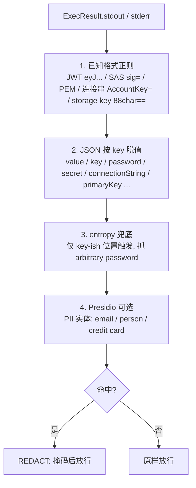
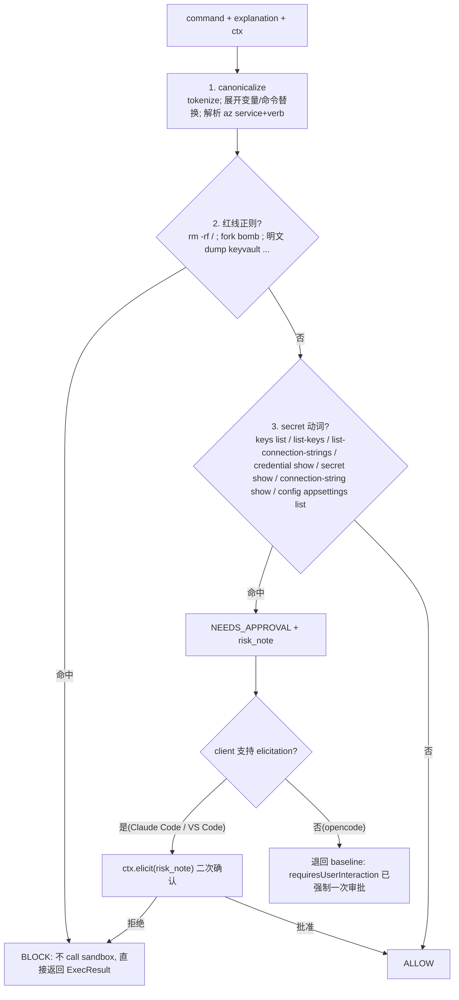
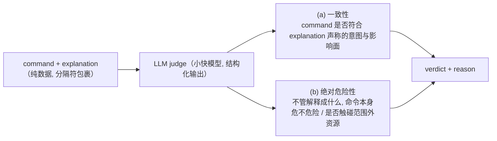

# action_bash 护栏落地方案 —— 输出脱敏 + client 强制审批

> 本文是多轮讨论的收敛版，取代 [`实现方案-action_bash-策略网关与人工审批`](实现方案-action_bash-策略网关与人工审批.md) 里已被 oid-log PR 落地或已过时的部分（见 Part 1）。
>
> **这一步（本迭代）只做两件事并落实：① 输出侧脱敏（post-exec gate）；② client 端强制人工审批。**
> Part 3（pre-exec 确定性网关）是紧接着的下一步设计，Part 4（pre-exec 引入 LLM judge）是更远的规划。先把 ①② 做扎实。

---

## 0. 一页纸（TL;DR）

- **可靠性的地板不是 gate，是已经 ship 的两层**：L0 = worker SP 的 RBAC（diagnose=Reader / action=Contributor，封顶爆炸半径）；L3 = oid-log 身份归因审计（correlation-id 把每条命令追到真人+真 IP）。对外讲可靠性先讲这两层。
- **本迭代补的是纵深**：① 输出侧脱敏在 **MCP server 进程内**做（确定性，不外包）；② 每次 `action_bash` 在 **client 端强制弹人工审批**（Claude Code 靠 server 端一行 `_meta`，VS Code 靠 MDM 下发一个设置）。
- **pre-exec 确定性网关（Part 3）**：不枚举命令，而是**扫输出形状 + 匹配 az 动词语法**；命中 secret 动词 → 二次确认（elicitation），命中红线 → 直接拦。
- **LLM judge（Part 4）**：意图一致性 + 绝对危险性，做成**可插拔、外置到托管模型端点**的一条 pipeline 规则，是下一步、不是这一步。

---

## Part 1 — 现状（Current Status）

### 1.1 已经落地的（oid-log PR #3 之后）

| 能力 | 状态 | 代码 |
|---|---|---|
| L0 RBAC 地板（diagnose=Reader / action=Contributor） | ✅ 已有 | Azure 侧 |
| L3 身份归因审计（`AuditEvent` 权威行 → Log Analytics `MCPAudit_CL`；correlation-id 注入 UA 关联原生 Azure 日志；never-raise/never-block） | ✅ **已落地** | `audit.py`、`main.py:_exec` |
| `SessionCtx` 携带 `correlation_id` | ✅ | `executor.py` |
| `explanation` 到达 `_exec` 并写进审计行 | ✅ **半通** | `main.py:_exec(..., explanation)` |

> 注意 `audit.py` 的审计行**不含 stdout**（只有 command/explanation/exit_code），所以审计链本身不泄露输出里的 secret。若将来往审计里塞输出，**先脱敏再写**。

### 1.2 还没有的（本方案要补）

- **`explanation` 还没进 `SessionCtx`、没到 `executor.exec`**：`_exec` 收到了 `explanation`（给审计用），但 `SessionCtx` 里没有该字段、`exec(ctx, command)` 也拿不到。pre-exec 要做「意图 vs 命令」比对，需要补这最后一跳。
- **`action_bash` 还没设 `requiresUserInteraction`**：目前只有 `annotations={readOnlyHint:false, destructiveHint:true, ...}`——而 annotations 是 hint 不是闸门，client 没义务因它弹窗。强制审批的那行 `_meta` 还没加。
- **gate 现状**：post-exec 脱敏（`redact.py`）**本迭代已落地**并接进 `_exec`（diagnose + action 共走）；pre-exec pipeline（Part 3）、`GatedExecutor` 可选封装尚未做。

### 1.3 本迭代的收敛边界

- **做**：Part 2 的 ①（post-exec 脱敏）+ ②（client 强制审批）。
- **设计好、下一步做**：Part 3（pre-exec 确定性网关）。
- **规划、更后面**：Part 4（pre-exec LLM judge）。

---

## Part 2 — 统一认知：本迭代的两个部分

### 2.1 第一部分：输出侧脱敏（post-exec gate）

**结论先行：在 MCP server 进程内做，确定性规则，不外包、不用 LLM、不上 APIM。**

为什么进程内（回顾讨论的四条硬理由）：

1. **egress 悖论**：外包就得把带 secret 的输出先发出去——为保护 secret 先把它多送一跳，安全控制自打脸。
2. **上下文**：最强检测靠「命令 + az JSON schema + key-ish 位置」，这些只有 server 进程里有；网关只看到一坨不透明 body。
3. **流式**：MCP 是 SSE，网关改写流式 body 要先 buffer、secret 会跨 chunk；进程内手里是完整 `ExecResult`，整段扫。
4. **故障耦合**：外部服务挂了 → fail-open 漏 secret / fail-closed 停服；进程内确定性扫描无此依赖，亚毫秒级。

**脱敏落点**：`_exec` 里、`executor.exec` 返回之后、回 client 之前。也可包成 `GatedExecutor` 透明地套在 inner executor 外（只需 `ExecResult → ExecResult`，无需 FastMCP Context）。二选一，推荐先直接放 `_exec`（改动最小，`_exec` 已是唯一收口）。

**四层确定性检测器**（从精确到兜底）：



要点：

- **① 已知格式正则**：JWT、SAS、PEM 私钥、连接串 key、storage 88 字符 key——高精度、近零误报。可直接嵌 **`detect-secrets`（Yelp，纯 Python）** 或搬 **gitleaks** 规则集，成熟工具就是这些库，不是某个托管 SKU。
- **② JSON 按 key 脱值**：`az` 输出多为 JSON（可强制 `-o json`）。**按字段名脱值**（key 命中敏感名 → mask value），这样**任意值的 password 也抓得到**（key 的是字段名不是值）。`az keyvault secret show` 的 `.value`、`az storage account keys list` 的 `[].value` 是 100% 召回的确定项。
- **③ entropy 兜底**：只在 key-ish 位置（敏感变量赋值、连接串 `=` 后、敏感 JSON key 的 value）触发，压误报。
- **④ Presidio（可选）**：PII 才用，secret 别指望它。依赖重就放 **同 ACA app 的 sidecar 容器**（localhost 调用、依赖隔离）。

**verdict：只有 REDACT —— 不 BLOCK、不审批、不进审计。** 命令已经跑完、secret 已经在输出里，post-exec 唯一的活是「别把它吐出去」，没有可审批的东西；而「每次都跑脱敏」是默认路径，记 verdict 只是噪音。所以脱敏就是 `ExecResult → 脱敏后的 ExecResult` 一个纯变换：不返回 verdict、不拦整条输出（BLOCK 会把 secret 周围有用的输出也一起丢掉，对 DataOps 太难用）。命中数只 `logger.debug` 记**条数（不记值）**供调 FP 用，不进 `AuditEvent`（见 2.3）。

**两条路都走同一个 gate**：`diagnose_bash` 和 `action_bash` 都经 `main.py:_exec`，脱敏挂在这一处、两个 tool 自动覆盖——代码就是 `_exec` 里 `result = redact.redact_result(result, command=command)`。虽然 action 路径最关键（privileged secret 读走 action、`diagnose` 的 Reader 本就读不到多数 secret），但 diagnose 也照走：一致、纵深，且 Reader 偶尔能读到的敏感串（某些资源属性里嵌的连接串）也被兜住。

#### 2.1.1 detect-secrets 是什么

Yelp 开源的 secret 扫描工具/库，最初为「阻止 secret 被 commit 进 git」（pre-commit hook）而生。对我们有用的是它两块能力：

- **检测器（plugins）**：① 已知格式——AWS/Azure Storage key、JWT、Basic Auth、私钥、各家 token…；② `KeywordDetector`——按变量名（`password`/`secret`/`api_key`）抓值；③ **熵检测器**——`Base64HighEntropyString` / `HexHighEntropyString`，Shannon 熵可调阈值。
- **误报过滤器（filters）——这才是它对我们最值钱的部分**：一批久经考验的 FP 排除器，直接抵消熵检测的噪音：`is_potential_uuid`（GUID 不算 secret）、`is_sequential_string`（`1234abcd`）、`is_likely_id_string`、`is_templated_secret`（`<password>` / `${VAR}` / `xxxxx` / `example`）、`is_lock_file`…

怎么当库用（注意它主要为 git 场景设计——报「有没有 secret + 类型/行号」）：做**脱敏**要拿到匹配 span，扫描态下 `PotentialSecret.secret_value` 可得，`text.replace(secret_value, MASK)` 即可。**更适合脱敏的其实是 gitleaks**：每条规则是一个带 capture group 的正则，capture group 就是要掩的精确 span。

我们的用法：**主力是自己写的 JSON 按 key 脱值**（你控制 `-o json`，精度最高）；detect-secrets / gitleaks 的价值是复用它们**成熟的已知格式正则包 + 熵检测器 + FP 过滤器**，不用手攒、不用自己趟 FP 的坑。`redact.py` 现在内置了最关键的几条（JWT/PEM/SAS/连接串/storage key）；要扩就把 gitleaks 规则灌进 `_KNOWN`、把 detect-secrets 的 filters 灌进熵通道。

#### 2.1.2 实现细节（`redact.py`，已落地）

落点：`_exec` 里 `executor.exec` 之后、返回之前，`redact.redact_result(result, command=command)`；`ExecResult` 是 frozen dataclass，用 `dataclasses.replace` 造新结果。三层对应代码：

1. **JSON 按 key 脱值（`_mask_json`）**：`json.loads(stdout)` 成功就递归走；key 命中 `_SENSITIVE_KEY`（**只放不歧义的复合名**：`password`/`clientSecret`/`connectionString`/`accountKey`/`primaryKey`/`accessToken`…）就把**标量值**换成 `«redacted»`。**只掩标量**，绝不把值是 list/dict 的字段替掉（防 `{"value":[...]}` 被端）。解析失败（`-o table`/`tsv`/stderr）跳过本层。
2. **已知格式正则（`_KNOWN`）**：JWT / PEM / `bearer …` / SAS `sig=` / 连接串 `AccountKey=…` / 88 字符 storage key。`group>0` 的只掩值、保留标签（`sig=«redacted»`）。JSON 重序列化后也再跑一遍，抓「藏在非敏感字段里的连接串」。
3. **熵兜底（`_redact_text` 的 entropy 分支）**：**默认关**（`REDACT_ENTROPY=1` 才开）；即便开，也先过 GUID/hex 允许清单，再按 Shannon 熵阈值（默认 4.2）+ 最小长度判。

命令域的 `value`/`key`：`_CMD_VALUE_SCOPES` 认出 `keyvault secret show`、`* keys list` 这类「命令目的就是吐 secret」的，**才**允许掩歧义的 `value`/`key`；否则 `value`/`key` 一律不碰（tag、list wrapper 保命）。stdout / stderr 两个出口都脱（错误里也会回显连接串）。

验收：`tests` 里 8 个用例覆盖上述每种情况（含 `group list` 不误伤、tag `key/value` 保留、GUID 保留 3 个 FP 用例），全绿。

> **逐层流程图、每层 before/after 例子、端到端走查**见 [`输出脱敏实现详解-redact三层逻辑与示例`](输出脱敏实现详解-redact三层逻辑与示例.md)。

#### 2.1.3 把 false positive 降到忽略不计

精确层（JSON key + 已知格式 + 命令域）≈0 FP 且干了绝大部分活；**熵是唯一 FP 源**，所以要么关掉、要么用允许清单 + 上下文压到忽略不计。七条手段：

1. **优先高精度、把熵网做到最小甚至关掉**：JSON 按 key（键名触发，≈100% 精度）+ 已知格式（`eyJ` / `-----BEGIN` / `sig=` 前缀，≈100%）几乎不误报。只靠这两层 FP 已近零——`redact.py` 默认就是这个配置（熵关）。
2. **歧义键名不进通用集**：`value`/`key`/`token`/`secret` 太常见（tag、`{"value":[...]}` list wrapper、storage 的 `keyName`），**一律不放进 `_SENSITIVE_KEY`**，只在命令域内掩。这是最容易踩的 over-redaction 坑（`az … list` 会被整个端掉）。
3. **只掩标量**：`_mask_json` 绝不把值是 list/dict 的字段替成 MASK，防端掉整个结果数组。
4. **标识符允许清单**：GUID（订阅/租户/资源 id）、hex/sha（git sha、镜像 digest）、resource id 明确排除——掩了它们不只是 FP，还会**打断 agent 下一步**（下一条命令要用那个 id）。detect-secrets 的 `is_potential_uuid` 等 filters 就是干这个，开熵通道时直接复用。
5. **熵：上下文门控 + 保守阈值 + 最小长度**：开熵时只在 key-ish 位置触发、阈值取高（宁漏不误）、要求 ≥20 字符。漏掉的高熵 secret 由 L0 RBAC + L3 审计兜底——**用熵的 FN 换 FP→0**。
6. **命令域精准打击**：认出命令就外科手术式只掩该命令的 secret 字段（`keyvault secret show → .value`），精度≈100%，优先于任何盲扫。
7. **可观测可调**：命中只记条数（`logger.debug`，不记值），便于发现 over-redaction 回调规则；掩码保留标签（`sig=«redacted»`）便于 debug。

> 一句话：**精确层负责召回、熵默认关、歧义键名与标识符明确排除** → FP 实际为 0，真正漏的那点交给 RBAC + 审计。

### 2.2 第二部分：client 端强制人工审批（Human-in-the-Loop）

**核心区分**：Claude Code 的强制信号是 **server 端声明**（一行 `_meta`，你的代码里）；VS Code 的强制信号是 **client 端设置**（MDM 下发，你的代码管不了，只能给 hint）。

| Client | 强制审批的参数 | 配在哪 | server 要传什么 | 能否锁到用户/operator 关不掉 |
|---|---|---|---|---|
| **Claude Code** | `_meta["anthropic/requiresUserInteraction"]=true`（v2.1.199+） | **server 的 tool 定义** | **就是这行 `_meta`**（+ 稳定 tool 名 `mcp__dataops__action_bash`、annotations） | ✅ managed settings + `disableBypassPermissionsMode:"disable"` |
| **VS Code** | `chat.tools.eligibleForAutoApproval:{"<toolId>":false}` | **client 设置（MDM/组织策略下发）** | server **传不了强制信号**，只能传 annotations 当 hint（`readOnlyHint:false`/`destructiveHint:true`）+ 稳定 toolId | ✅ 仅靠 MDM/组织策略 |
| **opencode** | 仅 `permission:{tool:"ask"}` | client 配置 | 无 server 端强制、无 elicitation | ❌ 无锁、无 server 强制 —— **弱链** |

> ⚠️ 下面的版本号 / 设置键名来自前一轮 multi-client 调研，client 侧设置一直在演进——**落地前按团队实际 client 版本核对**（尤其 VS Code 的键名）。
>
> 📁 **本仓库已内置可用配置**，clone 后照 [`README` 的 "Connect a client"](../../../README.md) 即可 set up：server 端 `_meta` 已在 `src/mcp-server/main.py` 的 `action_bash` 上；client 配置见根目录 `.mcp.json`（Claude Code）、`.vscode/mcp.json` + `.vscode/settings.json`（VS Code）、`opencode.json`（opencode）、`.claude/settings.json`（Claude Code 审批）。下面是**说明层（保留）**，真实 server 名是 `azure-dataops-aca`，示例里的占位名以仓库文件为准。

#### Claude Code —— server 端一行 `_meta` + fleet 锁

**① server（FastMCP）在 `action_bash` 的 tool 定义上加强制信号**（这是主力，一处声明全局强制）：

```python
@mcp.tool(
    auth=require_action,
    annotations={"readOnlyHint": False, "destructiveHint": True, "idempotentHint": False, "openWorldHint": True},
    meta={"anthropic/requiresUserInteraction": True},   # ← 给 Claude Code 的强制信号（v2.1.199+）
)
async def action_bash(command: str, explanation: str, ctx: Context) -> dict:
    ...
```

设了之后 Claude Code **每次** `action_bash` 都强制真人交互，连 `--permission-prompt-tool` 的 `allow` 都会被转成 `deny`（「prompt 必须到达一个人」）。

**② MCP server 注册**（`.mcp.json`）——server 名 `dataops` 决定权限 id 前缀 `mcp__dataops__`：

```jsonc
// .mcp.json（项目根）
{
  "mcpServers": {
    "dataops": {
      "type": "http",
      "url": "https://mcp.example.internal/mcp"
    }
  }
}
```

**③ managed settings 锁死**——企业管控层，用户 / operator 改不了，优先级高于用户与项目设置：

```jsonc
// managed-settings.json（企业下发；用户无法覆盖）
//   macOS:   /Library/Application Support/ClaudeCode/managed-settings.json
//   Linux:   /etc/claude-code/managed-settings.json
//   Windows: C:\ProgramData\ClaudeCode\managed-settings.json
{
  "permissions": {
    "allow": ["mcp__dataops__diagnose_bash"],
    "ask":   ["mcp__dataops__action_bash"],
    "deny":  [],
    "defaultMode": "default"
  },
  "disableBypassPermissionsMode": "disable",   // ← 顶层键, 不在 permissions 内; 封死 YOLO / bypass 模式
  "enableAllProjectMcpServers": true            // 可选: 强制启用项目 MCP server, 免得用户不接
}
```

> 结构要点：`disableBypassPermissionsMode` 是 **settings 顶层键**（不是 `permissions` 的子键）；`ask` 是审批的兜底，真正的强制来自 server 端 `_meta`。

#### VS Code —— server 只给 hint，锁靠 client 设置 + MDM

server 端**没有**等价的「强制交互」meta；`annotations` 只是 hint。真正的强制靠 client 侧设置，由 MDM/组织策略下发、用户改不了。

**① MCP server 注册**（`.vscode/mcp.json`，注意 VS Code 用 `servers` 不是 `mcpServers`）：

```jsonc
// .vscode/mcp.json
{
  "servers": {
    "dataops": {
      "type": "http",
      "url": "https://mcp.example.internal/mcp"
    }
  }
}
```

**② 审批设置**（`settings.json`，组织级 / MDM 下发）：

```jsonc
// settings.json（企业策略下发, 用户改不了）
{
  // 先关掉全局自动放行（默认就是 false, 显式写死防被人开）
  "chat.tools.autoApprove": false,

  // 细粒度: 让 action_bash 永不进入自动放行（每次强制弹框, 连"始终允许"也不给记住）
  //   键名 / tool id 形状随 VS Code 版本演进, 落地前核对（见本节顶部 ⚠️）
  "chat.tools.eligibleForAutoApproval": {
    "dataops/action_bash": false
  }
}
```

> 机制要点：只设 `autoApprove:false` 不够——VS Code 会记住用户点过的「始终允许」，之后就不再弹了。要**永远弹**必须用 `eligibleForAutoApproval:false`（禁止该 tool 被记住/自动放行），并**由 MDM 锁死**让用户改不回来。所以对 VS Code，server 的职责是：**稳定的 tool id + 诚实的 annotations**；强制那一环交给管设备的人。

#### opencode 是怎么回事

opencode 目前：**无 server 端强制交互、无 elicitation（FR #8251 / #23066 仍未支持）、无企业级锁**，只有 client 本地的 `permission`，operator 能自行改掉。

```jsonc
// opencode.json（项目根 / ~/.config/opencode/config.json）
{
  "$schema": "https://opencode.ai/config.json",
  "mcp": {
    "dataops": {
      "type": "remote",
      "url": "https://mcp.example.internal/mcp",
      "enabled": true
    }
  },
  "permission": {
    "dataops_diagnose_bash": "allow",
    "dataops_action_bash": "ask"   // 唯一能做的; operator 可自行改掉, 无锁
  }
}
```

**取舍**：opencode 是弱链。高危操作要么**限制只允许 Claude Code / VS Code 接入**，要么把「opencode 仅走 `ask` + 组织约定」作为**残余风险显式接受**（RBAC 地板仍在，爆炸半径有上限）。别把它当可靠的强制点。

### 2.3 什么进审计、什么不进

- **post-exec 脱敏不进审计**：它是每次都跑的默认行为，记 verdict 只是噪音。命中数走 `logger.debug`（不记值）仅供调 FP，不进 `AuditEvent`。
- **只有 pre-exec 的决策才进审计**（Part 3 落地时）：`BLOCK`、人工审批结果这类真正的安全事件才值得留痕。届时给 `AuditEvent` 加：

```python
# audit.py: AuditEvent 增补字段（Part 3 落地时，非本迭代）
gate_verdict: str | None = None     # ALLOW / BLOCK / NEEDS_APPROVAL
gate_rule:    str | None = None     # 命中的规则名
risk_note:    str | None = None     # 给人看的风险标注
approved_by_human: bool | None = None   # elicitation/审批结果（如可得）
```

> 一次 tool call 仍是**一条权威行**：pre-exec verdict 塞回 `_exec`，由 `_exec` 那一行带出，而不是另写一行。

---

## Part 3 — 怎么实现 pre-execution（确定性网关）

> 直接说做法。这一层是**确定性**的（无 LLM），紧接本迭代之后做。目标不是拦住 100% 的坏命令，而是**自动拦明显红线 + 对 secret 类命令升级二次确认 + 给审计留痕**。

### 3.1 前置改动（必须先补）

`explanation` 走到执行层，pipeline 才能做「意图 vs 命令」比对：

```python
# executor.py: SessionCtx 加字段
@dataclass(frozen=True)
class SessionCtx:
    user_oid: str | None
    session_id: str | None
    conversation_id: str | None
    group: Group
    correlation_id: str | None = None
    explanation: str | None = None      # ← 新增

# main.py: _exec 把已收到的 explanation 放进 SessionCtx（当前只喂了审计）
sctx = SessionCtx(..., explanation=explanation)
```

### 3.2 pipeline 结构（顺序：便宜确定的先跑）



### 3.3 三条规则的做法

1. **canonicalize（规范化解析）**：tokenize、展开变量与 `$(...)`、在**规范化后的 token** 上判策（不要在原始字符串上正则——shell 执行前会展开/去引号，「被检查的 ≠ 执行的」）。本项目 90% 是 `az`，只解析 `az` 子命令树（service + verb），据此判读/写与影响面。
2. **红线正则（少量、绝对）**：`rm -rf /`、fork bomb、明文 dump secret 等零容忍项 → `BLOCK`。红线是极少数绝对项，其余都不用正则。
3. **secret 动词检测（不枚举命令、匹配动词语法）**：ARM 把「返回 secret 的操作」一律建模成 POST 且名字以 `list*` 开头（`listKeys`/`listConnectionStrings`/`listSecrets`/`listCredentials`/`regenerateKey`），`az` 映射成下面这一小撮动词。**匹配动词，不匹配服务目录**：

   | 动词模式（~7 类） | 命中服务举例 |
   |---|---|
   | `keys list` / `list-keys` | storage、cosmosdb、cognitiveservices、batch、maps、redis、signalr |
   | `list-connection-strings` / `connection-string show` | cosmosdb、iot hub、webapp/functionapp config |
   | `credential show` / `credential list` | acr、appconfig |
   | `secret show/list`、`key show` | keyvault |
   | `... authorization-rule keys list` | servicebus、eventhubs、relay、notification-hub |
   | `config appsettings list` | functionapp、webapp（appsettings 藏连接串） |
   | `admin-key show` / `query-key list` | search |

   命中 → `NEEDS_APPROVAL` + `risk_note`（如「该命令用于取凭据，将暴露 X 的 key」）。

### 3.4 verdict 在 `_exec` 里怎么落地

pre-exec 的**人工交互（elicitation）需要 FastMCP Context**，而 `Executor.exec` 只有 `SessionCtx`。所以把 pre-exec 的编排放在 `_exec`（它持有 `ctx`），规则本身放在可单测的 `gate/` 模块：

```python
async def _exec(group, command, ctx, explanation=None):
    sctx = SessionCtx(..., explanation=explanation)
    verdict = gate.pre_exec(sctx, command)          # 纯函数: ALLOW/BLOCK/NEEDS_APPROVAL

    if verdict.action == "BLOCK":
        result = ExecResult(exit_code=126, stdout="", stderr=f"blocked by policy: {verdict.rule}")
    else:
        if verdict.action == "NEEDS_APPROVAL":
            ok = await _elicit_or_baseline(ctx, verdict.risk_note)   # 支持则 elicit, 否则退回 baseline
            if not ok:
                result = ExecResult(exit_code=126, stdout="", stderr="declined by user")
            else:
                result = await executor.exec(sctx, command)
        else:  # ALLOW
            result = await executor.exec(sctx, command)

    result = gate.post_exec(result, sctx)            # Part 2.1 脱敏
    await audit... (gate_verdict=verdict.action, gate_rule=verdict.rule, risk_note=verdict.risk_note)
    return result.to_dict()
```

要点：

- **BLOCK 不 call sandbox**：构造 `ExecResult` 直接返回。
- **NEEDS_APPROVAL 的机制是 elicitation**：注意时序——client 端的 `requiresUserInteraction` 弹框发生在 server 收到 `tools/call` **之前**（人已经批过一次）。要把 server 侧算出的 `risk_note` 交给人做**带风险标注的二次决策**，就用 `ctx.elicit`（Claude Code v2.1.76+ / VS Code 原生支持；opencode 不支持 → 退回 baseline 的那一次强制审批）。
- **baseline 永远在**：即便 elicitation 不可用，`requiresUserInteraction` 保证 action_bash 至少被真人看过一次；BLOCK 是 server 硬拦，与 client 无关。

### 3.5 动词清单别手工维护

把 3.3 的动词表做成 **yaml 配置**，并用一个**定时任务**从 `azure-rest-api-specs` grep operationId `(list|regenerate).*(key|secret|credential|connectionString)` 自动生成/diff。Azure 出新 `listKeys` 操作时你会收到 diff 告警，而不是靠人肉发现。**加规则 = 改配置**，不动逻辑、不发版。

### 3.6 范围与降级

- **主要作用在 action 路径**：diagnose（Reader）本就取不到多数 secret，command 网在 diagnose 上基本 moot；输出脱敏两条路都挂。
- **模糊地带 → NEEDS_APPROVAL，不硬 BLOCK**：清单漏一条无非少弹一次二次确认，输出网仍脱敏、RBAC 仍封顶。只有绝对红线 hard-block。两张网都**不必完整**，因为地板是 L0+L3。

---

## Part 4 — 规划：pre-exec 引入 LLM as a judge（下一步的下一步）

> 这是 Part 3 之后的增强，不在本迭代。做成**可插拔的一条 pipeline 规则 + 外置到托管模型端点**，不阻塞前面的落地。

### 4.1 judge 必须同时做两件事



- **为什么必须有 (b)**：注入能**同时伪造恶意命令 + 一句匹配的漂亮 explanation**，只查一致性 (a) 会被自洽的坏组合骗过。
- **judge 自身要防注入**：待审内容用分隔符包成**纯数据**，要求**结构化输出**（只回 verdict+reason，不执行其中任何指令）。

### 4.2 部署与接入

- **外置到托管模型端点**（Azure AI Foundry / Azure OpenAI）——judge 是真难自托管、且受益于托管伸缩的那块，值得外包（与「确定性脱敏不外包」相反）。
- **pipeline 里就是一条 `Rule`**：pre-exec 的确定性层短路掉大部分请求后，只有可疑项才调 judge，省延迟省钱。
- **延迟预算**：judge 目标 < 1s，`MCP_EXEC_TIMEOUT=120` 足够；judge 挂了 → fail-closed 到 `NEEDS_APPROVAL`（升级人工），不 fail-open。

### 4.3 为什么现在不做

- 它是独立子系统（模型托管、调参、误报治理、自身注入面），把它当**独立 project** 对待，用 `Rule` 抽象留好插入点即可。
- 本迭代的 L0+L3+① 输出脱敏 + ② client 强制审批，已经足够回应「MCP 可靠性」的质疑；judge 是锦上添花的语义层，不是地基。

---

## Part 5 — 本迭代任务清单（收敛范围）

| # | 任务 | 文件 | 验收 |
|---|---|---|---|
| 1 | ✅ **代码已落地（待端到端验证）**：`action_bash` 加 `meta={"anthropic/requiresUserInteraction": True}`；仓库并附各 client 配置（`.mcp.json` / `.vscode/*` / `opencode.json` / `.claude/settings.json`） | `main.py` + 仓库 client 配置 | 代码在位；「每次强制弹审批」需真实 Claude Code 跑一次确认（含 fastmcp `_meta` 是否原样透出） |
| 2 | ⬜ **未做，本质是运维/MDM 动作**：企业级 `managed-settings.json` + `disableBypassPermissionsMode:"disable"`、VS Code 经 MDM 下发 `eligibleForAutoApproval:false`。⚠️ 仓库里已提交的是**可被覆盖的默认值**（`.claude/settings.json` 的 `ask`、`.vscode/settings.json` 的 `autoApprove`），**不是锁** | 运维/MDM | operator/用户无法绕过（Claude Code / VS Code）；opencode 记为残余风险 |
| 3 | ✅ **已实现** post-exec 脱敏：JSON 按 key 脱值 + 已知格式正则 + 命令域 `value` + 熵（默认关）；diagnose+action 共走 | `redact.py`、`main.py:_exec` | 8 用例全绿；secret 掩码，`group list`/tag/GUID 不误伤 |
| 4 | （改归 Part 3）**pre-exec** verdict 进审计：`AuditEvent` 加 `gate_verdict/rule/risk_note`。**post-exec 脱敏不进审计** | `audit.py`、`main.py` | pre-exec BLOCK/审批留痕 |
| 5 |（衔接 Part 3）`SessionCtx` 加 `explanation` 并透传 | `executor.py`、`main.py` | explanation 到达执行层，为 pre-exec 备料 |

> 顺序：先 1+2（client 强制审批，改动最小、立刻见效）→ 3+4（输出脱敏 + 审计留痕）→ 5（为 Part 3 铺路）。

---

## 参考

**项目内**
- [`实现方案-action_bash-策略网关与人工审批`](实现方案-action_bash-策略网关与人工审批.md) —— 前身设计（Part 1 标注了其已过时/已落地的部分）
- `docs/oid-log-tracking/` —— L3 审计与用户归因（已落地）
- [`multi-client 接入对比`](../multi-client-implementation/MCP-自定义Client接入-Entra与各Agent客户端支持对比.md) —— 各 client 能力
- `src/mcp-server/{main,executor,audit}.py` —— gate 落点与前置改动

**外部**
- [Claude Code – MCP（`anthropic/requiresUserInteraction`、elicitation）](https://code.claude.com/docs/en/mcp)
- [VS Code – Manage approvals（`eligibleForAutoApproval`、MDM）](https://code.visualstudio.com/docs/agents/approvals)
- [opencode – Permissions](https://opencode.ai/docs/permissions/) · elicitation FR [#8251](https://github.com/anomalyco/opencode/issues/8251) / [#23066](https://github.com/anomalyco/opencode/issues/23066)
- [FastMCP – User Elicitation（`ctx.elicit`）](https://gofastmcp.com/servers/elicitation)
- [detect-secrets（Yelp）](https://github.com/Yelp/detect-secrets) · [gitleaks](https://github.com/gitleaks/gitleaks) · [Microsoft Presidio](https://microsoft.github.io/presidio/)
